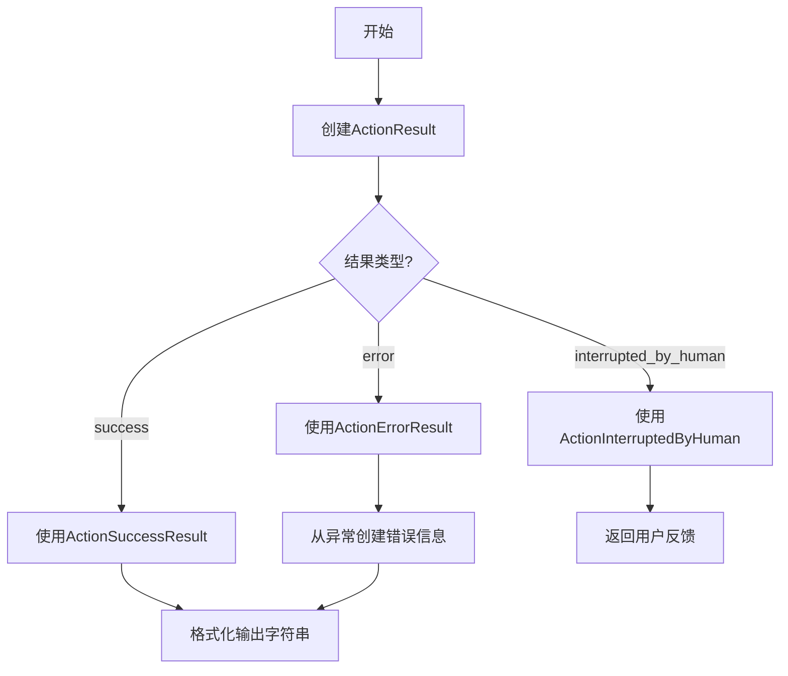
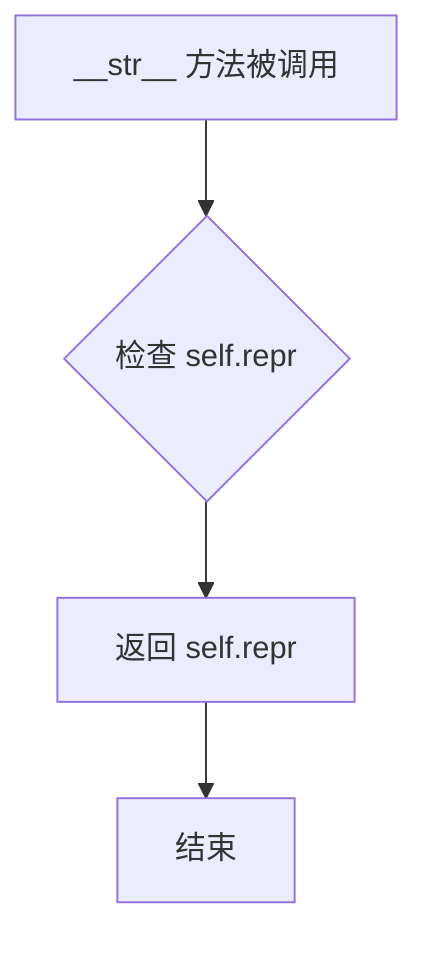
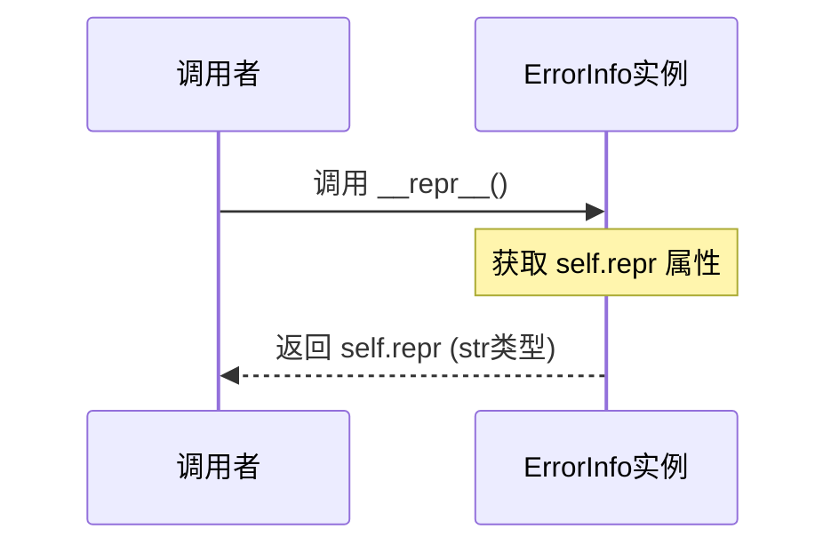

# `.\AutoGPT\classic\forge\forge\models\action.py` 详细设计文档

该文件定义了一套用于描述AI智能体(Agent)执行动作结果的类型系统，包括成功结果、错误结果和用户中断三种状态的Pydantic数据模型，以及相应的处理方法和工具类。

## 整体流程



## 类结构

```
ActionProposal (动作提案模型)
├── ActionSuccessResult (成功结果模型)
├── ActionErrorResult (错误结果模型)
├── ActionInterruptedByHuman (用户中断模型)
└── ErrorInfo (错误信息模型)
```

## 全局变量及字段


### `AnyProposal`
    
类型变量，绑定到ActionProposal

类型：`TypeVar`
    


### `ActionResult`
    
联合类型，表示动作执行的三种结果状态

类型：`ActionSuccessResult | ActionErrorResult | ActionInterruptedByHuman`
    


### `ActionProposal.thoughts`
    
思考内容或带摘要的模型

类型：`str | ModelWithSummary`
    


### `ActionProposal.use_tool`
    
使用的工具调用

类型：`AssistantFunctionCall`
    


### `ActionProposal.raw_message`
    
原始消息(可选)

类型：`AssistantChatMessage`
    


### `ActionSuccessResult.outputs`
    
执行输出

类型：`Any`
    


### `ActionSuccessResult.status`
    
状态标识

类型：`Literal['success']`
    


### `ErrorInfo.args`
    
异常参数

类型：`tuple`
    


### `ErrorInfo.message`
    
错误消息

类型：`str`
    


### `ErrorInfo.exception_type`
    
异常类型名称

类型：`str`
    


### `ErrorInfo.repr`
    
异常的字符串表示

类型：`str`
    


### `ActionErrorResult.reason`
    
错误原因

类型：`str`
    


### `ActionErrorResult.error`
    
错误详情

类型：`Optional[ErrorInfo]`
    


### `ActionErrorResult.status`
    
状态标识

类型：`Literal['error']`
    


### `ActionInterruptedByHuman.feedback`
    
用户反馈内容

类型：`str`
    


### `ActionInterruptedByHuman.status`
    
状态标识

类型：`Literal['interrupted_by_human']`
    
    

## 全局函数及方法


### `ActionProposal.model_json_schema`

该方法是一个类方法，用于生成 `ActionProposal` 模型的 JSON Schema，但在生成的 schema 中排除了 `raw_message` 属性。该方法通过调用父类的 `model_json_schema` 方法获取完整 schema，然后显式删除 `raw_message` 属性的定义。

参数：

- `by_alias`：`bool`，默认为 `True`，是否使用别名作为属性名
- `ref_template`：`str`，默认为 `DEFAULT_REF_TEMPLATE`，用于生成 `$ref` 引用的模板字符串
- `schema_generator`：`type[GenerateJsonSchema]`，默认为 `GenerateJsonSchema`，用于生成 JSON Schema 的类
- `mode`：`JsonSchemaMode`，默认为 `"validation"`，指定生成 schema 的模式（validation、serialization 等）
- `**kwargs`：任意关键字参数，会传递给父类的 `model_json_schema` 方法

返回值：`dict`，返回修改后的 JSON Schema 字典，不包含 `raw_message` 属性的定义

#### 流程图

```mermaid
flowchart TD
    A[Start model_json_schema] --> B[调用 super().model_json_schema 获取原始 Schema]
    B --> C{检查 'raw_message' 是否在 schema.properties 中}
    C -->|是| D[从 schema.properties 中删除 'raw_message' 键值对]
    C -->|否| E[跳过删除步骤]
    D --> F[返回修改后的 Schema]
    E --> F
```

#### 带注释源码

```python
@classmethod
def model_json_schema(
    cls,
    by_alias: bool = True,
    ref_template: str = DEFAULT_REF_TEMPLATE,
    schema_generator: type[GenerateJsonSchema] = GenerateJsonSchema,
    mode: JsonSchemaMode = "validation",
    **kwargs,
):
    """
    The schema for this ActionProposal model, excluding the 'raw_message' property.
    """
    # 调用父类 BaseModel 的 model_json_schema 方法，生成完整的 JSON Schema
    schema = super().model_json_schema(
        by_alias=by_alias,
        ref_template=ref_template,
        schema_generator=schema_generator,
        mode=mode,
        **kwargs,
    )
    # 检查生成的 schema 中是否包含 'raw_message' 属性
    # 注意：需要进行检查，因为 schema 可能会被缓存，且某些模式下可能不包含该属性
    if "raw_message" in schema["properties"]:  # must check because schema is cached
        # 从 schema 的 properties 字典中删除 'raw_message' 属性定义
        del schema["properties"]["raw_message"]
    # 返回修改后的 schema，不包含 'raw_message' 属性
    return schema
```


### `ActionSuccessResult.__str__`

该方法是 `ActionSuccessResult` 类的字符串表示魔法方法（`__str__`），用于将动作执行结果格式化为字符串输出。它会对输出内容进行转义处理（防止代码块注入），并根据输出是否包含换行符决定是否用 Markdown 代码块包裹。

参数：

- `self`：`ActionSuccessResult` 实例，隐式参数，无需显式传递

返回值：`str`，返回格式化后的输出字符串。如果是多行输出（包含换行符），则用 Markdown 代码块包裹；否则直接返回字符串形式。

#### 流程图

```mermaid
flowchart TD
    A[开始 __str__] --> B[将 self.outputs 转换为字符串]
    B --> C{检查是否包含换行符 \n}
    C -->|是| D[将 ``` 替换为 \\``` 转义]
    C -->|否| E[直接返回 str(self.outputs)]
    D --> F[返回格式: ```\n{outputs}\n```]
    E --> G[结束]
    F --> G
    
    style A fill:#e1f5fe
    style G fill:#e8f5e8
    style D fill:#fff3e0
    style F fill:#fff3e0
```

#### 带注释源码

```
def __str__(self) -> str:
    """
    将 ActionSuccessResult 实例转换为字符串格式。
    
    如果输出包含多行内容，会用 Markdown 代码块包裹输出，
    以确保格式化和防止代码块注入攻击。
    
    Returns:
        str: 格式化后的输出字符串
    """
    # 1. 将 outputs 转换为字符串，并转义反引号防止 Markdown 代码块注入
    outputs = str(self.outputs).replace("```", r"\```")
    
    # 2. 判断输出是否为多行（包含换行符）
    multiline = "\n" in outputs
    
    # 3. 根据行数决定返回格式
    # 多行：返回带 Markdown 代码块包裹的字符串
    # 单行：直接返回原始字符串
    return f"```\n{self.outputs}\n```" if multiline else str(self.outputs)
```


### `ErrorInfo.from_exception`

静态方法，用于将传入的 Exception 异常对象转换为 ErrorInfo 实例，捕获异常的参数、消息、类型和字符串表示形式。

参数：

- `exception`：`Exception`，需要转换的异常对象

返回值：`ErrorInfo`，包含异常详情的 ErrorInfo 实例

#### 流程图

```mermaid
flowchart TD
    A[开始: 输入 exception] --> B[获取 exception.args]
    B --> C[获取 message: getattr exception.message 或 exception.args[0]]
    C --> D[获取 exception_type: exception.__class__.__name__]
    D --> E[获取 repr: repr exception]
    E --> F[创建 ErrorInfo 实例]
    F --> G[返回 ErrorInfo 对象]
```

#### 带注释源码

```python
@staticmethod
def from_exception(exception: Exception) -> ErrorInfo:
    """
    静态方法，从 Exception 异常对象创建 ErrorInfo 实例。
    
    参数:
        exception: Exception - 需要转换的异常对象
        
    返回:
        ErrorInfo - 包含异常详情的实例
    """
    return ErrorInfo(
        args=exception.args,                                    # 异常的参数元组
        message=getattr(exception, "message", exception.args[0]),  # 异常消息，优先使用 message 属性，否则使用第一个参数
        exception_type=exception.__class__.__name__,            # 异常类名
        repr=repr(exception),                                   # 异常的字符串表示
    )
```


### `ErrorInfo.__str__`

该方法返回 ErrorInfo 对象的 repr 表示，用于将错误信息对象转换为字符串形式。

参数：此方法不接受额外参数（除隐式的 `self` 参数）。

返回值：`str`，返回对象的 `repr` 属性值，即异常的字符串表示形式。

#### 流程图



#### 带注释源码

```python
def __str__(self):
    """
    返回 ErrorInfo 对象的字符串表示。
    
    该方法继承自 Pydantic BaseModel，用于将 ErrorInfo 实例转换为字符串。
    内部直接调用 repr(self)，返回存储在 self.repr 中的异常 repr 字符串。
    
    Returns:
        str: 异常的字符串表示，等同于 repr(self)
    """
    return repr(self)
```


### `ErrorInfo.__repr__`

该方法为 `ErrorInfo` 类的魔术方法，用于返回对象的 `repr` 属性值，即异常的官方字符串表示形式。

参数：

- `self`：`ErrorInfo`，隐式参数，表示 ErrorInfo 的实例本身

返回值：`str`，返回存储在 `self.repr` 中的异常 repr 字符串

#### 流程图



#### 带注释源码

```python
def __repr__(self):
    """
    返回对象的官方字符串表示。
    
    该方法直接返回实例的 repr 属性值，
    该值在 from_exception 工厂方法中被设置为异常的 repr() 结果。
    
    Returns:
        str: 异常的官方字符串表示，等同于调用 repr(exception)
    """
    return self.repr
```


### `ActionErrorResult.from_exception`

这是一个静态方法，用于将 Exception 对象转换为 `ActionErrorResult` 实例，提取异常消息并创建包含详细错误信息的 `ErrorInfo` 对象。

参数：

- `exception`：`Exception` 类型，需要转换的异常对象

返回值：`ActionErrorResult`，包含异常原因和详细错误信息的错误结果对象

#### 流程图

```mermaid
flowchart TD
    A[开始] --> B[接收 exception 参数]
    B --> C[提取异常消息]
    C --> D{异常是否有 message 属性?}
    D -->|是| E[使用 exception.message]
    D -->|否| F[使用 exception.args[0]]
    E --> G[调用 ErrorInfo.from_exception 创建错误详情]
    F --> G
    G --> H[构建 ActionErrorResult 对象]
    H --> I[返回 ActionErrorResult]
```

#### 带注释源码

```python
@staticmethod
def from_exception(exception: Exception) -> ActionErrorResult:
    """
    从异常对象创建 ActionErrorResult 实例。
    
    该静态方法接收一个 Exception 对象，提取其错误消息，
    并创建包含详细错误信息的 ErrorInfo 对象，最后返回
    包装后的 ActionErrorResult。
    
    参数:
        exception: Exception 类型，需要转换的异常对象
        
    返回值:
        ActionErrorResult 类型，包含 reason 和 error 属性的错误结果对象
    """
    # 使用 getattr 安全地获取异常消息
    # 如果异常有 message 属性则使用，否则使用第一个参数 args[0]
    reason = getattr(exception, "message", exception.args[0])
    
    # 创建 ErrorInfo 对象，包含异常的完整信息
    # 调用 ErrorInfo 的静态方法 from_exception 进行转换
    error = ErrorInfo.from_exception(exception)
    
    # 返回包含原因和错误详情的 ActionErrorResult 实例
    return ActionErrorResult(
        reason=reason,
        error=error,
    )
```


### `ActionErrorResult.__str__`

该方法用于将 `ActionErrorResult` 对象转换为格式化的字符串描述，返回包含错误原因的可读错误信息。

参数：

- `self`：`ActionErrorResult`，代表当前 `ActionErrorResult` 实例

返回值：`str`，返回格式化的错误描述字符串，格式为 `Action failed: '{self.reason}'`

#### 流程图

```mermaid
flowchart TD
    A[开始 __str__] --> B[返回格式化字符串]
    B --> C[格式: Action failed: '{reason}']
    C --> D[结束]
```

#### 带注释源码

```python
def __str__(self) -> str:
    """
    将 ActionErrorResult 对象转换为字符串表示。
    
    返回格式化的错误描述，包含错误原因。
    """
    return f"Action failed: '{self.reason}'"
```


### `ActionInterruptedByHuman.__str__`

该方法是一个实例方法，用于将 `ActionInterruptedByHuman` 对象转换为用户友好的字符串描述，返回用户中断操作的反馈信息。

参数： 无（仅包含隐式参数 `self`）

返回值：`str`，返回格式化的字符串，描述用户中断操作时的反馈内容

#### 流程图

```mermaid
flowchart TD
    A[开始 __str__ 方法] --> B{检查 feedback 属性}
    B --> C[格式化字符串: 'The user interrupted the action with the following feedback: "%s"']
    C --> D[替换占位符 %s 为 self.feedback 的值]
    D --> E[返回格式化后的字符串]
```

#### 带注释源码

```python
def __str__(self) -> str:
    """
    将 ActionInterruptedByHuman 实例转换为用户友好的字符串描述。
    
    返回用户中断操作时提供的反馈信息，格式为：
    'The user interrupted the action with the following feedback: "反馈内容"'
    
    Returns:
        str: 包含用户反馈的描述性字符串
    """
    return (
        'The user interrupted the action with the following feedback: "%s"'
        % self.feedback
    )
```


## 关键组件


### ActionProposal

表示行动提案的数据模型，包含思维过程和工具调用信息，支持从原始聊天消息解析action。

### ActionSuccessResult

表示行动执行成功的结构化结果，包含输出内容和成功状态标识。

### ErrorInfo

错误信息的数据容器，提供从异常对象构建ErrorInfo的静态方法，用于封装错误的详细上下文。

### ActionErrorResult

表示行动执行失败的结构化结果，包含失败原因和可选的错误详情，支持从异常对象构建。

### ActionInterruptedByHuman

表示行动被用户中断的情况，包含用户反馈内容和中断状态标识。

### ActionResult

联合类型别名，汇总三种可能的行动结果状态：成功、错误、被用户中断。

### ModelWithSummary

从utils模块导入的工具类，作为thoughts字段的候选类型，用于支持带摘要的模型数据。

### ActionProposal.model_json_schema

自定义JSON Schema生成方法，排除raw_message属性，用于生成干净的API文档结构。

### ErrorInfo.from_exception

静态工厂方法，将Python异常对象转换为结构化ErrorInfo实例，提取异常参数、消息、类型和表示。

### ActionErrorResult.from_exception

静态工厂方法，将异常转换为ActionErrorResult，自动提取异常消息作为失败原因并构建ErrorInfo。


## 问题及建议


### 已知问题

-   **类型注解不一致**：`ActionProposal.raw_message` 字段类型标注为 `AssistantChatMessage`，但实际默认值为 `None`，导致需要使用 `# type: ignore` 注释来抑制类型检查警告，应该改为 `Optional[AssistantChatMessage] = None`。
-   **非标准异常属性访问**：代码中多处使用 `getattr(exception, "message", exception.args[0])` 来获取异常消息，但这假设异常对象包含 `message` 属性，而这是非标准的Python异常接口约定，可能导致在某些自定义异常中获取不到预期信息。
-   **字符串格式化方式不统一**：`ActionSuccessResult.__str__` 使用了 f-string，而 `ActionInterruptedByHuman.__str__` 仍在使用 `%` 格式化方式，应统一为 f-string 以提高可读性和一致性。
-   **转义逻辑不完整**：`ActionSuccessResult.__str__` 中仅处理了 ```` ` ```` 的转义，但未考虑其他需要在 Markdown 中转义的字符（如反斜杠本身）。
-   **未使用的类型变量**：`AnyProposal = TypeVar(...)` 定义但在代码中未被使用，造成代码冗余。
-   **JSON Schema 缓存假设**：`model_json_schema` 方法中直接检查 `"raw_message" in schema["properties"]`，假设了 schema 的缓存机制，可能在不同的 Pydantic 版本中表现不一致。
-   **序列化风险**：`ErrorInfo.repr` 字段直接存储 `repr(exception)` 的结果，在某些异常对象中可能包含无法序列化的对象或过大的字符串内容。

### 优化建议

-   统一修正 `raw_message` 的类型注解为 `Optional[AssistantChatMessage] = None`，移除 `# type: ignore` 注释。
-   考虑定义自定义异常基类或在文档中明确约定异常必须包含 `message` 属性，或者改用更可靠的方式如 `str(exception)` 来获取异常信息。
-   统一所有 `__str__` 方法的字符串格式化风格，使用一致的 f-string 方式。
-   完善转义逻辑，使用专门的 Markdown 转义函数处理所有需要转义的字符。
-   如果 `AnyProposal` 暂时不需要，可先移除以保持代码整洁；如需保留，应添加注释说明其用途。
-   增强 `model_json_schema` 方法的健壮性，添加版本兼容性检查或使用 Pydantic 官方推荐的方式排除字段。
-   考虑对 `ErrorInfo.repr` 字段添加长度限制或使用 base64 编码存储大型异常信息，避免序列化问题。

## 其它


### 设计目标与约束

本模块的设计目标是为AI Agent系统提供统一的动作执行结果抽象，支持三种核心状态（成功、错误、人为中断）的标准化表示。约束方面，代码严格依赖Pydantic v2进行数据验证和JSON Schema生成，确保类型安全；使用TypeVar实现泛型约束（AnyProposal必须继承自ActionProposal）；所有结果类必须实现`__str__`方法以支持日志和展示。

### 错误处理与异常设计

错误处理采用防御式编程策略，通过`ErrorInfo`类封装异常完整信息（参数、消息、类型、字符串表示），支持从任意Exception对象转换。`ActionErrorResult`提供静态工厂方法`from_exception`将系统异常转换为标准化错误结果，保留原始异常信息以便调试。设计特点是将异常捕获逻辑与业务逻辑分离，调用方可通过模式匹配处理不同结果类型。

### 数据流与状态机

结果数据流遵循严格的单向流动：原始AssistantChatMessage → ActionProposal解析 → 动作执行 → ActionResult生成。状态转换通过字面量类型（Literal）强制约束：`status`字段只能为"success"、"error"或"interrupted_by_human"，形成确定有限状态机（DFA），确保状态不可非法迁移。

### 外部依赖与接口契约

核心依赖包括：pydantic（数据验证与Schema生成）、typing（类型注解）、forge.llm.providers.schema（消息与函数调用类型）。接口契约方面，ActionResult为联合类型，使用者需通过类型守卫或模式匹配处理；ModelWithSummary需实现兼容Pydantic BaseModel的接口；AssistantFunctionCall和AssistantChatMessage需符合forge框架定义的消息格式规范。

### 版本兼容性说明

代码使用`from __future__ import annotations`实现延迟注解解析，确保Python 3.9+的向后兼容性。Pydantic v2的`model_json_schema`方法替代了v1的`schema()`方法，需确保依赖环境为Pydantic 2.x版本。

### 序列化与反序列化设计

所有结果类继承自BaseModel，天然支持JSON序列化。`ActionProposal.model_json_schema`方法特殊处理了`raw_message`字段，排除该属性以生成干净的对外Schema，这是为了避免暴露内部解析上下文。`ActionSuccessResult`的`__str__`方法对输出内容进行Markdown转义处理，防止多行输出破坏日志格式。

### 安全性考虑

`ErrorInfo`类在序列化异常时直接使用`repr()`，可能泄露敏感信息（如数据库连接字符串、文件路径）。建议在生产环境中对`repr`字段实施脱敏处理或在错误结果返回前进行过滤。

### 测试建议

应覆盖以下场景：异常消息为空时的默认行为、嵌套异常的完整链路记录、状态字面量的非法值拒绝、跨模块类型兼容性验证、JSON Schema生成的边界条件（raw_message字段存在/不存在时的处理）。

### 性能考量

`ActionSuccessResult.__str__`方法在每次调用时执行字符串替换操作，对于大量输出的场景可能产生性能开销。`model_json_schema`涉及Schema缓存机制，需注意`raw_message`字段删除操作与缓存的交互。

### 扩展性设计

通过TypeVar `AnyProposal`支持泛型化扩展，允许子类化ActionProposal添加领域特定字段。`ActionResult`联合类型便于后续添加新状态（如超时、取消等），但需同步更新所有模式匹配代码。


    