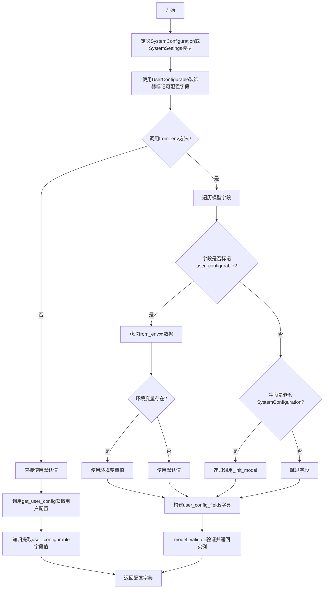
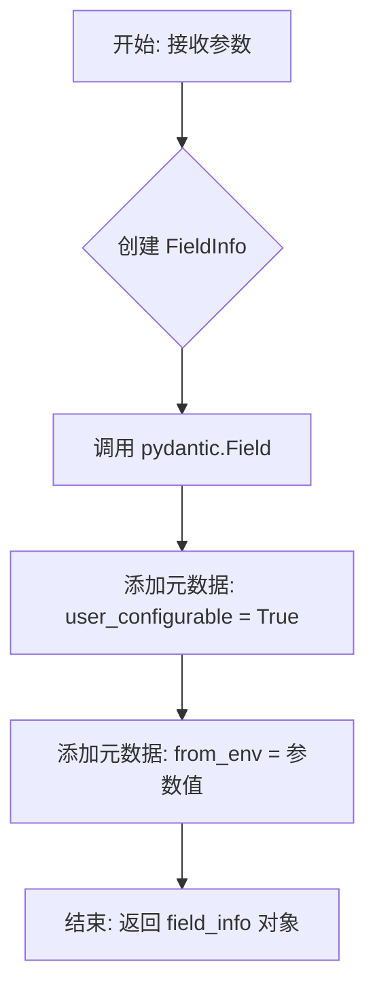
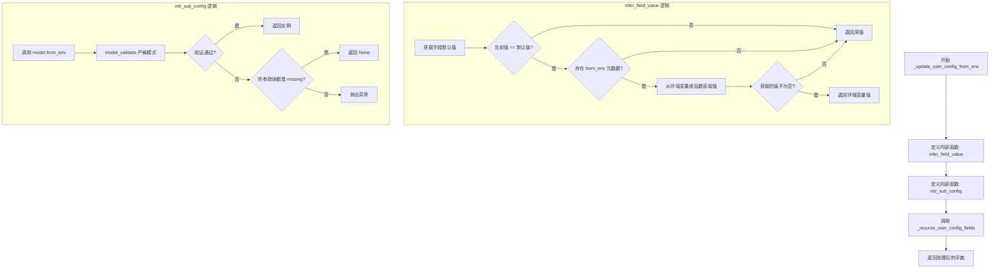
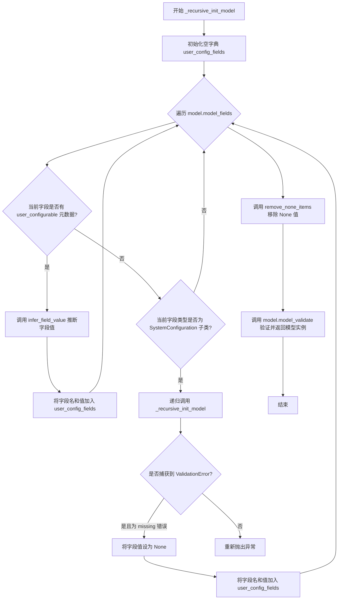
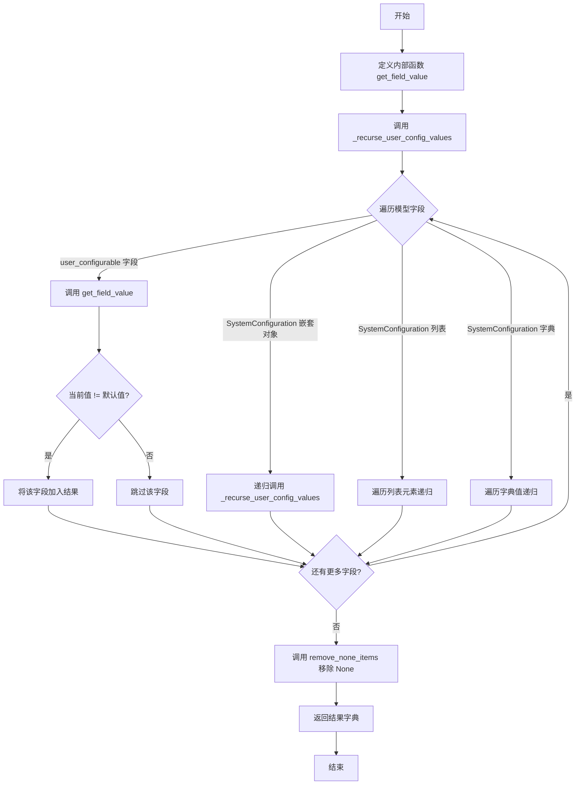
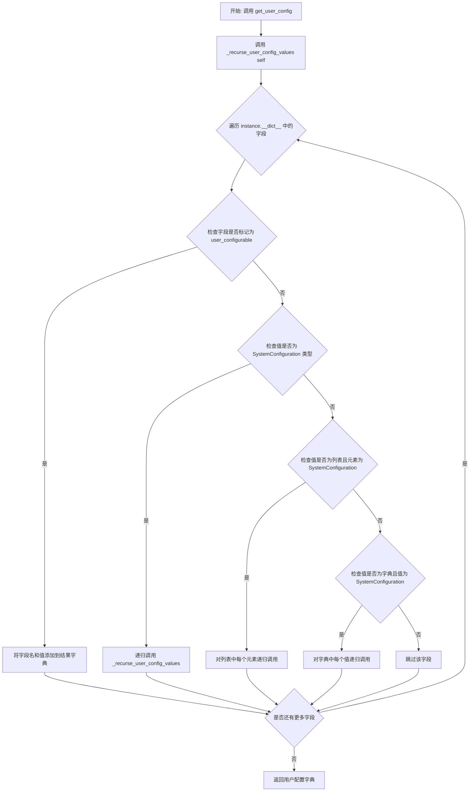
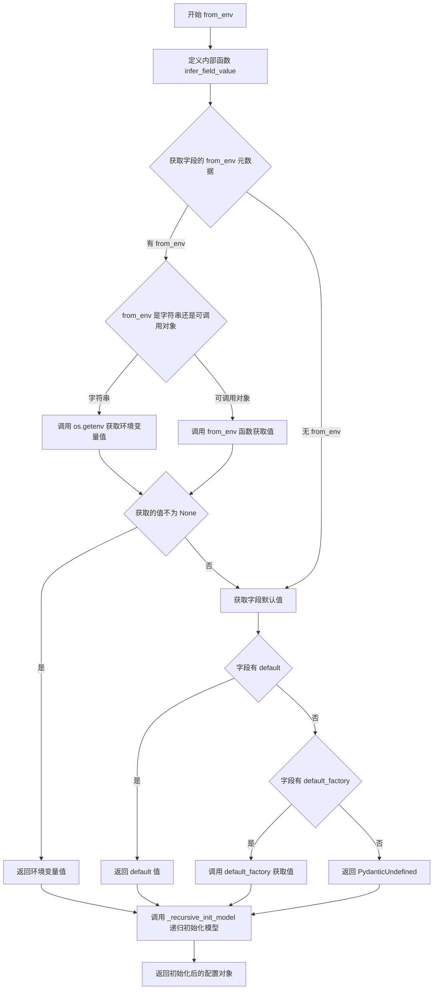
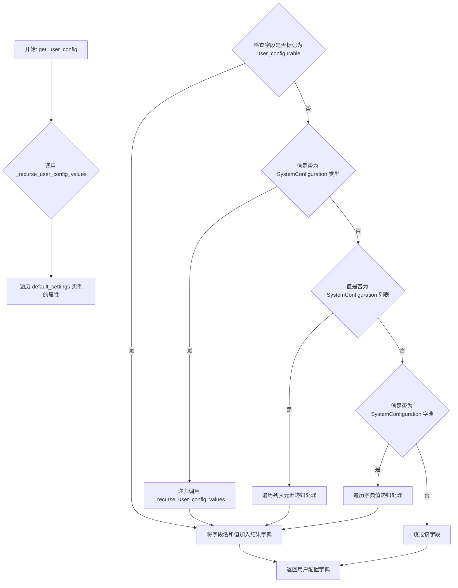
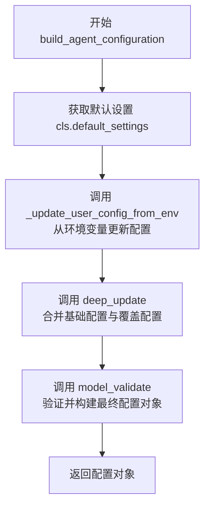

# `.\AutoGPT\classic\forge\forge\models\config.py` 详细设计文档

该模块提供了一个灵活的配置管理框架，通过Pydantic模型实现系统配置的声明式定义，支持从环境变量动态加载用户可配置的字段，并提供递归处理嵌套配置对象的能力。核心功能包括配置验证、深度更新、环境变量映射以及用户配置值的提取。

## 整体流程



## 类结构

```
SystemConfiguration (配置基类)
├── from_env() - 类方法
└── get_user_config() - 实例方法
SystemSettings (设置基类)
└── name, description 字段
Configurable<S> (泛型可配置对象基类)
├── get_user_config() - 类方法
└── build_agent_configuration() - 类方法
```

## 全局变量及字段


### `T`
    
泛型类型变量，用于UserConfigurable装饰器的默认类型参数

类型：`TypeVar`
    


### `M`
    
泛型类型变量，约束为BaseModel，用于递归初始化模型

类型：`TypeVar`
    


### `SC`
    
泛型类型变量，约束为SystemConfiguration，用于嵌套配置类型推断

类型：`TypeVar`
    


### `S`
    
泛型类型变量，约束为SystemSettings，用于Configurable泛型类

类型：`TypeVar`
    


### `SystemConfiguration.model_config`
    
Pydantic模型配置，定义extra=forbid禁止额外字段、use_enum_values使用枚举值、validate_assignment验证赋值

类型：`ConfigDict`
    


### `SystemSettings.name`
    
系统设置的名称标识，用于唯一标识某个系统设置

类型：`str`
    


### `SystemSettings.description`
    
系统设置的描述信息，用于说明该设置的功能和用途

类型：`str`
    


### `SystemSettings.model_config`
    
Pydantic模型配置，定义extra=forbid禁止额外字段、use_enum_values使用枚举值、validate_assignment验证赋值

类型：`ConfigDict`
    


### `Configurable.prefix`
    
配置前缀，用于环境变量映射时的前缀过滤和识别

类型：`str`
    


### `Configurable.default_settings`
    
默认设置类变量，存储该可配置对象的默认配置值，必须由子类显式定义

类型：`ClassVar[S]`
    
    

## 全局函数及方法


### `UserConfigurable`

**描述**：这是一个 Pydantic 字段装饰器工厂函数，用于创建支持用户配置（User Configuration）的模型字段。它封装了 Pydantic 的 `Field`，并向字段元数据中注入 `user_configurable` 标记和 `from_env` 环境变量映射，使得系统能够在运行时根据环境变量或配置文件动态调整这些字段的值。

**参数**：

- `default`：`T | PydanticUndefinedType`，字段的默认值。
- `*args`：`Any`，传递给 Pydantic `Field` 的位置参数。
- `default_factory`：`Optional[Callable[[], T]]`，用于生成默认值的工厂函数（当默认值需要动态计算时使用）。
- `from_env`：`Optional[str | Callable[[], T | None]]`，指定从环境变量读取配置的键名，或定义一个返回值的回调函数。
- `description`：`str`，字段的描述信息，通常用于自动生成文档。
- `exclude`：`bool`，是否在序列化（serialization）中排除该字段。
- `**kwargs`：`Any`，传递给 Pydantic `Field` 的关键字参数。

**返回值**：`FieldInfo` (类型提示为 `T`)，返回配置了特定元数据的 Pydantic `FieldInfo` 对象，供 Pydantic 模型解析。

#### 流程图



#### 带注释源码

```python
def UserConfigurable(
    default: T | PydanticUndefinedType = PydanticUndefined,
    *args,
    default_factory: Optional[Callable[[], T]] = None,
    from_env: Optional[str | Callable[[], T | None]] = None,
    description: str = "",
    exclude: bool = False,
    **kwargs,
) -> T:
    # TODO: use this to auto-generate docs for the application configuration
    # 1. 使用 pydantic 的 Field 创建一个标准的 FieldInfo 对象
    field_info: FieldInfo = Field(
        default,
        *args,
        default_factory=default_factory,
        description=description,
        exclude=exclude,
        **kwargs,
    )
    
    # 2. 标记该字段为用户可配置的，这会被其他递归函数（如 _get_field_metadata）识别
    field_info.metadata.append(("user_configurable", True))
    
    # 3. 记录该字段的配置来源（从环境变量或回调函数），用于 from_env 逻辑
    field_info.metadata.append(("from_env", from_env))

    # 4. 返回构建好的 FieldInfo，在 Pydantic 模型定义中会被解释为字段类型 T
    return field_info  # type: ignore
```


### `_get_field_metadata`

该函数用于从 Pydantic 模型的字段元数据中提取指定键对应的值，支持元组形式和字符串形式的元数据条目。

参数：

- `field`：`FieldInfo`，Pydantic 模型的字段信息对象，包含字段的元数据
- `key`：`str`，要查找的元数据键
- `default`：`Any`，默认值，默认为 `None`，当未找到对应键时返回此值

返回值：`Any`，返回找到的元数据值（若为元组则返回其第二个元素，若为字符串则返回 `True`），若未找到则返回默认值

#### 流程图

```mermaid
flowchart TD
    A[开始] --> B[遍历 field.metadata]
    B --> C{当前 item 是元组<br/>且 item[0] == key?}
    C -->|是| D[返回 item[1]]
    C -->|否| E{当前 item 是字符串<br/>且 item == key?}
    E -->|是| F[返回 True]
    E -->|否| G{继续遍历?}
    G -->|是| B
    G -->|否| H[返回 default]
    D --> I[结束]
    F --> I
    H --> I
```

#### 带注释源码

```python
def _get_field_metadata(field: FieldInfo, key: str, default: Any = None) -> Any:
    """
    从 Pydantic 字段的元数据中提取指定键的值。

    该函数支持两种元数据存储格式：
    1. 元组形式：(key, value) - 用于存储键值对
    2. 字符串形式：key - 用于存储布尔标志

    Parameters:
        field: Pydantic 字段信息对象，包含 metadata 属性
        key: 要查找的元数据键
        default: 未找到时的默认返回值

    Returns:
        找到的元数据值，未找到则返回 default
    """
    # 遍历字段的所有元数据项
    for item in field.metadata:
        # 检查元组形式的元数据 (key, value)
        if isinstance(item, tuple) and item[0] == key:
            return item[1]  # 返回元组的第二个元素（值）
        
        # 检查字符串形式的元数据（布尔标志）
        if isinstance(item, str) and item == key:
            return True  # 字符串键存在时返回 True
    
    # 未找到对应的键，返回默认值
    return default
```


### `_update_user_config_from_env`

该函数用于根据环境变量更新 Pydantic 模型实例的配置字段。它首先定义了两个内部处理函数（用于推断字段值和初始化子配置），然后调用递归处理函数来遍历模型字段并应用环境变量配置。

参数：

- `instance`：`BaseModel`，需要更新的 Pydantic 模型实例。

返回值：`dict[str, Any]`，更新后的用户配置字段字典。

#### 流程图



#### 带注释源码

```python
def _update_user_config_from_env(instance: BaseModel) -> dict[str, Any]:
    """
    从环境变量更新 Pydantic 模型实例的配置字段。

    优先级:
    1. 实例上已有的非默认值
    2. from_env() 返回的值
    3. 字段的默认值

    参数:
        instance: Pydantic 模型实例。

    返回:
        实例的用户配置字段字典。
    """

    def infer_field_value(field: FieldInfo, value):
        """
        推断单个字段的值。
        如果当前值等于默认值，并且字段配置了 from_env，则尝试从环境变量获取新值。
        """
        # 获取字段的默认值
        default_value = (
            field.default
            if field.default not in (None, PydanticUndefined)
            else (field.default_factory() if field.default_factory else None)
        )
        
        # 只有当值是默认值时才尝试覆盖，除非值为 None (可选字段)
        if value == default_value and (
            from_env := _get_field_metadata(field, "from_env")
        ):
            # 从环境变量字符串或回调函数获取值
            val_from_env = os.getenv(from_env) if type(from_env) is str else from_env()
            if val_from_env is not None:
                return val_from_env
        return value

    def init_sub_config(model: Type[SC]) -> SC | None:
        """
        初始化子配置模型。
        尝试使用 model.from_env() 创建实例，如果验证失败（仅因为缺少字段），则返回 None。
        """
        try:
            return model.model_validate(model.from_env(), strict=True)
        except ValidationError as e:
            # 如果所有验证错误都是缺少字段的错误，则优雅地处理并返回 None
            if all(err["type"] == "missing" for err in e.errors()):
                return None
            raise

    # 调用递归处理函数，传入定义好的回调函数
    return _recurse_user_config_fields(instance, infer_field_value, init_sub_config)
```


### `_recursive_init_model`

该函数是一个私有递归函数，用于在 Pydantic 模型中递归初始化用户可配置的字段。它遍历模型的字段，识别带有 `user_configurable` 元数据的字段以及嵌套的 `SystemConfiguration` 类型字段，通过回调函数推断字段值，并最终返回配置初始化完成的模型实例。

参数：

- `model`：`Type[M]`，Pydantic 模型类型（泛型 M 继承自 BaseModel），表示需要初始化的模型类
- `infer_field_value`：`Callable[[FieldInfo], Any]`，回调函数，用于推断每个字段的值，接收 Pydantic 的 FieldInfo 对象作为参数

返回值：`M`，返回配置初始化完成后的模型实例（泛型类型）

#### 流程图



#### 带注释源码

```python
def _recursive_init_model(
    model: Type[M],                          # 要初始化的 Pydantic 模型类型
    infer_field_value: Callable[[FieldInfo], Any],  # 回调函数，用于推断字段值
) -> M:
    """
    Recursively initialize the user configuration fields of a Pydantic model.

    Parameters:
        model: The Pydantic model type.
        infer_field_value: A callback function to infer the value of each field.
            Parameters:
                ModelField: The Pydantic ModelField object describing the field.

    Returns:
        BaseModel: An instance of the model with the initialized configuration.
    """
    user_config_fields = {}  # 存储用户配置字段的字典
    
    # 遍历模型的所有字段
    for name, field in model.model_fields.items():
        # 检查字段是否标记为 user_configurable
        if _get_field_metadata(field, "user_configurable"):
            # 调用回调函数推断字段值并存储
            user_config_fields[name] = infer_field_value(field)
        
        # 检查字段类型是否为 SystemConfiguration 的子类（嵌套配置）
        elif isinstance(field.annotation, ModelMetaclass) and issubclass(
            field.annotation, SystemConfiguration
        ):
            try:
                # 递归处理嵌套的配置模型
                user_config_fields[name] = _recursive_init_model(
                    model=field.annotation,        # 使用字段的类型注解作为模型
                    infer_field_value=infer_field_value,  # 传递相同的回调函数
                )
            except ValidationError as e:
                # 如果验证失败且所有错误都是 missing 类型的错误，则优雅处理
                if all(e["type"] == "missing" for e in e.errors()):
                    user_config_fields[name] = None
                else:
                    # 其他验证错误重新抛出
                    raise

    # 移除字典中的 None 值和未定义值
    user_config_fields = remove_none_items(user_config_fields)

    # 使用 Pydantic 的 model_validate 方法验证并创建模型实例
    return model.model_validate(user_config_fields)
```


### `_recurse_user_config_fields`

该函数递归地处理Pydantic模型实例的用户配置字段，支持单个字段、可选嵌套配置对象、列表和字典形式的嵌套SystemConfiguration对象，并返回处理后的用户配置字段字典。

参数：

- `model`：`BaseModel`，要迭代的Pydantic模型实例
- `infer_field_value`：`Callable[[FieldInfo, Any], Any]`，回调函数，用于处理每个字段。参数为FieldInfo（字段元数据对象）和Any（字段当前值）
- `init_sub_config`：`Optional[Callable[[Type[SystemConfiguration]], SystemConfiguration | None]] = None`，可选回调函数，用于初始化子配置。参数为Type[SystemConfiguration]（子配置类型）

返回值：`dict[str, Any]`，模型实例的处理后的用户配置字段。

#### 流程图

```mermaid
flowchart TD
    A[开始] --> B[初始化空字典 user_config_fields]
    B --> C[遍历 model.model_fields]
    C --> D{当前字段}
    D --> E{检查 _get_field_metadata field 'user_configurable'}
    E -->|是| F[调用 infer_field_value 处理字段]
    F --> G[存入 user_config_fields]
    E -->|否| H{检查 value 是否为 SystemConfiguration}
    H -->|是| I[递归调用 _recurse_user_config_fields]
    I --> G
    H -->|否| J{检查 value is None 且 init_sub_config 存在}
    J -->|是| K[获取 Optional[T] 中的 T 类型]
    K --> L{检查 T 是 ModelMetaclass 且是 SystemConfiguration 子类}
    L -->|是| M[调用 init_sub_config 初始化子配置]
    M --> N{子配置存在}
    N -->|是| O[递归调用 _recurse_user_config_fields]
    O --> G
    N -->|否| P[跳过该字段]
    P --> C
    J -->|否| Q{检查 value 是 list 且所有元素是 SystemConfiguration}
    Q -->|是| R[遍历列表元素]
    R --> S[对每个元素递归调用 _recurse_user_config_fields]
    S --> T[构建处理后的列表]
    T --> G
    Q -->|否| U{检查 value 是 dict 且所有值是 SystemConfiguration}
    U -->|是| V[遍历字典键值对]
    V --> W[对每个值递归调用 _recurse_user_config_fields]
    W --> X[构建处理后的字典]
    X --> G
    U -->|否| Y[跳过该字段]
    Y --> C
    G --> Z{是否还有更多字段}
    Z -->|是| C
    Z -->|否| AA[返回 user_config_fields]
    AA --> AB[结束]
```

#### 带注释源码

```python
def _recurse_user_config_fields(
    model: BaseModel,
    infer_field_value: Callable[[FieldInfo, Any], Any],
    init_sub_config: Optional[
        Callable[[Type[SystemConfiguration]], SystemConfiguration | None]
    ] = None,
) -> dict[str, Any]:
    """
    Recursively process the user configuration fields of a Pydantic model instance.

    Params:
        model: The Pydantic model to iterate over.
        infer_field_value: A callback function to process each field.
            Params:
                ModelField: The Pydantic ModelField object describing the field.
                Any: The current value of the field.
        init_sub_config: An optional callback function to initialize a sub-config.
            Params:
                Type[SystemConfiguration]: The type of the sub-config to initialize.

    Returns:
        dict[str, Any]: The processed user configuration fields of the instance.
    """
    # 初始化结果字典，用于存储处理后的用户配置字段
    user_config_fields = {}

    # 遍历模型的所有字段
    for name, field in model.model_fields.items():
        # 获取字段的当前值
        value = getattr(model, name)

        # 处理标记为 user_configurable 的单个字段
        if _get_field_metadata(field, "user_configurable"):
            # 调用回调函数处理字段值，并存入结果字典
            user_config_fields[name] = infer_field_value(field, value)

        # 递归处理嵌套的 SystemConfiguration 对象
        elif isinstance(value, SystemConfiguration):
            user_config_fields[name] = _recurse_user_config_fields(
                model=value,
                infer_field_value=infer_field_value,
                init_sub_config=init_sub_config,
            )

        # 处理值为 None 的可选嵌套配置对象
        elif value is None and init_sub_config:
            # 从 Optional[T] 注解中提取 T 类型
            field_type = get_args(field.annotation)[0]
            # 检查是否是 SystemConfiguration 子类
            if type(field_type) is ModelMetaclass and issubclass(
                field_type, SystemConfiguration
            ):
                # 尝试初始化子配置
                sub_config = init_sub_config(field_type)
                if sub_config:
                    # 递归处理已初始化的子配置
                    user_config_fields[name] = _recurse_user_config_fields(
                        model=sub_config,
                        infer_field_value=infer_field_value,
                        init_sub_config=init_sub_config,
                    )

        # 处理 SystemConfiguration 对象列表
        elif isinstance(value, list) and all(
            isinstance(i, SystemConfiguration) for i in value
        ):
            # 遍历列表，对每个元素递归调用自身
            user_config_fields[name] = [
                _recurse_user_config_fields(i, infer_field_value, init_sub_config)
                for i in value
            ]
        
        # 处理 SystemConfiguration 对象字典
        elif isinstance(value, dict) and all(
            isinstance(i, SystemConfiguration) for i in value.values()
        ):
            # 遍历字典，对每个值递归调用自身
            user_config_fields[name] = {
                k: _recurse_user_config_fields(v, infer_field_value, init_sub_config)
                for k, v in value.items()
            }

    # 返回处理后的用户配置字段字典
    return user_config_fields
```


### `_recurse_user_config_values`

该函数递归遍历Pydantic模型实例，提取所有用户可配置字段的值。它通过检查字段的元数据标识"user_configurable"来筛选需要处理的字段，并对嵌套的SystemConfiguration对象、列表和字典进行递归处理，最终返回包含所有用户配置值的字典结构。

参数：

- `instance`：`BaseModel`，Pydantic模型实例，待遍历的模型对象
- `get_field_value`：`Callable[[FieldInfo, T], T]`，可选回调函数，用于处理每个字段的值，默认值为`lambda _, v: v`（返回原值）

返回值：`dict[str, Any]`，返回包含处理后的用户配置字段的字典

#### 流程图

```mermaid
flowchart TD
    A[开始 _recurse_user_config_values] --> B[初始化空字典 user_config_values]
    B --> C[遍历 instance.__dict__.items()]
    C --> D{还有未处理的字段?}
    D -->|是| E[获取字段名 name 和值 value]
    E --> F[获取字段的 FieldInfo: field = instance.model_fields[name]]
    F --> G{_get_field_metadata 检查 user_configurable?}
    G -->|是| H[调用 get_field_value 处理字段]
    H --> I[将处理结果添加到 user_config_values]
    G -->|否| J{value 是否为 SystemConfiguration 实例?}
    J -->|是| K[递归调用 _recurse_user_config_values]
    K --> I
    J -->|否| L{value 是否为列表且元素为 SystemConfiguration?}
    L -->|是| M[列表推导式递归处理每个元素]
    M --> I
    L -->|否| N{value 是否为字典且值为 SystemConfiguration?}
    N -->|是| O[字典推导式递归处理每个值]
    O --> I
    N -->|否| P[不处理，直接继续]
    P --> C
    D -->|否| Q[返回 user_config_values]
```

#### 带注释源码

```python
def _recurse_user_config_values(
    instance: BaseModel,
    get_field_value: Callable[[FieldInfo, T], T] = lambda _, v: v,
) -> dict[str, Any]:
    """
    递归遍历Pydantic模型实例中的用户配置值。

    参数:
        instance: Pydantic模型实例
        get_field_value: 回调函数，用于处理每个字段。参数:
            FieldInfo: 描述字段的Pydantic FieldInfo对象
            Any: 字段的当前值

    返回:
        包含实例处理后用户配置字段的字典
    """
    # 初始化结果字典
    user_config_fields = {}

    # 遍历实例的所有属性（通过__dict__获取原始值）
    for name, value in instance.__dict__.items():
        # 获取字段的元数据信息
        field = instance.model_fields[name]
        
        # 检查字段是否有"user_configurable"标记
        if _get_field_metadata(field, "user_configurable"):
            # 使用回调函数处理字段值
            user_config_fields[name] = get_field_value(field, value)
        
        # 处理嵌套的SystemConfiguration对象
        elif isinstance(value, SystemConfiguration):
            user_config_fields[name] = _recurse_user_config_values(
                instance=value, get_field_value=get_field_value
            )
        
        # 处理SystemConfiguration对象列表
        elif isinstance(value, list) and all(
            isinstance(i, SystemConfiguration) for i in value
        ):
            user_config_fields[name] = [
                _recurse_user_config_values(i, get_field_value) for i in value
            ]
        
        # 处理SystemConfiguration对象字典
        elif isinstance(value, dict) and all(
            isinstance(i, SystemConfiguration) for i in value.values()
        ):
            user_config_fields[name] = {
                k: _recurse_user_config_values(v, get_field_value)
                for k, v in value.items()
            }

    return user_config_fields
```


### `_get_non_default_user_config_values`

该函数用于获取 Pydantic 模型实例中用户配置字段的非默认值，通过递归遍历模型的所有字段，并比较字段当前值与其默认值，将不等于默认值的字段返回为字典。

参数：

- `instance`：`BaseModel`，Pydantic 模型实例，从中获取非默认的用户配置值

返回值：`dict[str, Any]`，包含所有非默认值的用户配置字段的字典

#### 流程图



#### 带注释源码

```python
def _get_non_default_user_config_values(instance: BaseModel) -> dict[str, Any]:
    """
    Get the non-default user config fields of a Pydantic model instance.

    Params:
        instance: The Pydantic model instance.

    Returns:
        dict[str, Any]: The non-default user config values on the instance.
    """

    # 定义内部函数，用于获取字段的默认值并比较
    def get_field_value(field: FieldInfo, value):
        # 获取字段的默认值：优先使用 default_factory，否则使用 default
        default = field.default_factory() if field.default_factory else field.default
        # 如果当前值不等于默认值，则返回当前值；否则返回 None（最终会被移除）
        if value != default:
            return value

    # 调用递归函数处理用户配置值，传入自定义的 get_field_value 回调
    # _recurse_user_config_values 会遍历模型的所有字段，
    # 对 user_configurable 字段调用 get_field_value 进行过滤
    return remove_none_items(_recurse_user_config_values(instance, get_field_value))
```


### `deep_update`

该函数用于递归地合并两个字典，将 `update_dict` 中的值更新到 `original_dict` 中。如果两个字典中存在相同的键且对应的值都是字典，则递归地进行深度合并；否则直接覆盖更新。

参数：

- `original_dict`：`dict`，原始字典，待被更新的目标字典
- `update_dict`：`dict`，更新字典，包含需要合并到原始字典中的键值对

返回值：`dict`，返回更新后的原始字典（in-place 更新）

#### 流程图

```mermaid
flowchart TD
    A[开始 deep_update] --> B[遍历 update_dict 的键值对]
    B --> C{检查 key 是否在 original_dict 中<br/>且 original_dict[key] 和 value 都是 dict}
    C -->|是| D[递归调用 deep_update<br/>deep_update(original_dict[key], value)]
    C -->|否| E[直接赋值 original_dict[key] = value]
    D --> F{继续遍历下一对键值}
    E --> F
    F --> G{update_dict 是否还有未处理的键值对}
    G -->|是| B
    G -->|否| H[返回 original_dict]
    H --> I[结束]
```

#### 带注释源码

```python
def deep_update(original_dict: dict, update_dict: dict) -> dict:
    """
    Recursively update a dictionary.

    Params:
        original_dict (dict): The dictionary to be updated.
        update_dict (dict): The dictionary to update with.

    Returns:
        dict: The updated dictionary.
    """
    # 遍历更新字典中的所有键值对
    for key, value in update_dict.items():
        # 检查条件：
        # 1. key 是否存在于 original_dict 中
        # 2. original_dict[key] 是否为字典类型
        # 3. value 是否为字典类型
        # 只有三者都满足时才进行递归深度合并
        if (
            key in original_dict
            and isinstance(original_dict[key], dict)
            and isinstance(value, dict)
        ):
            # 递归调用 deep_update，实现深度合并
            # 将 original_dict[key] 和 value 进行递归合并
            original_dict[key] = deep_update(original_dict[key], value)
        else:
            # 直接覆盖赋值
            # 如果不满足深度合并条件，则用 update_dict 的值直接覆盖
            original_dict[key] = value
    # 返回更新后的原始字典（注意：是 in-place 修改）
    return original_dict
```


### `remove_none_items`

该函数用于递归地移除字典中值为 `None` 或 `PydanticUndefined` 的键值对，常用于清理 Pydantic 模型配置中未设置或未定义的字段。

参数：

- `d`：`dict`，需要处理的字典对象

返回值：`dict`，移除了 `None` 和 `PydanticUndefined` 值后的字典

#### 流程图

```mermaid
flowchart TD
    A[开始: 输入 d] --> B{isinstance(d, dict)?}
    B -- 是 --> C[创建空字典 result]
    C --> D[遍历 d.items]
    D --> E{value not in (None, PydanticUndefined)?}
    E -- 是 --> F[result[k] = remove_none_items(value)]
    E -- 否 --> G[跳过该键值对]
    F --> H{还有更多项?}
    H -- 是 --> D
    H -- 否 --> I[返回 result]
    B -- 否 --> J[返回 d]
```

#### 带注释源码

```python
def remove_none_items(d):
    """
    递归移除字典中值为 None 或 PydanticUndefined 的键值对。
    
    参数:
        d: 需要处理的字典对象
        
    返回:
        移除了 None 和 PydanticUndefined 值后的字典
    """
    # 检查输入是否为字典
    if isinstance(d, dict):
        # 使用字典推导式遍历原始字典的键值对
        return {
            k: remove_none_items(v)  # 递归处理值
            for k, v in d.items()
            if v not in (None, PydanticUndefined)  # 过滤掉 None 和 PydanticUndefined
        }
    # 如果不是字典，直接返回原值（用于处理嵌套结构中的非字典值）
    return d
```


### `SystemConfiguration.get_user_config`

该方法用于获取当前 `SystemConfiguration` 实例中的所有用户配置值，通过递归遍历模型字段，提取标记为 `user_configurable` 的字段及其嵌套的配置对象，最终返回一个包含所有用户配置项的字典。

参数：

- `self`：`SystemConfiguration`，隐式参数，表示当前配置实例本身

返回值：`dict[str, Any]`，返回一个字典，包含当前实例中所有用户配置字段的名称及其值

#### 流程图



#### 带注释源码

```python
def get_user_config(self) -> dict[str, Any]:
    """
    获取当前 SystemConfiguration 实例的用户配置值。
    
    该方法通过调用 _recurse_user_config_values 函数，
    递归遍历模型的所有字段，提取标记为 user_configurable 的配置项。
    
    Returns:
        dict[str, Any]: 包含所有用户配置字段及其值的字典，
                        嵌套的 SystemConfiguration 对象会被递归处理。
    """
    # 调用内部递归函数处理用户配置值
    # 默认使用恒等函数作为 get_field_value，即直接返回原始值
    return _recurse_user_config_values(self)
```


### `SystemConfiguration.from_env`

该方法是一个类方法，用于从环境变量初始化配置对象。它通过检查`UserConfigurable`装饰器传递的`from_env`属性，将环境变量映射到用户可配置的字段上，并递归初始化嵌套的`SystemConfiguration`对象。

参数：

- `cls`：隐含的类参数，表示`SystemConfiguration`类本身

返回值：`SystemConfiguration`（或继承自`SystemConfiguration`的子类实例），返回从环境变量和环境配置初始化后的配置对象实例

#### 流程图



#### 带注释源码

```python
@classmethod
def from_env(cls):
    """
    Initializes the config object from environment variables.

    Environment variables are mapped to UserConfigurable fields using the from_env
    attribute that can be passed to UserConfigurable.
    """

    def infer_field_value(field: FieldInfo):
        """
        内部函数：推断单个字段的值
        
        参数:
            field: Pydantic 字段信息对象
        
        返回:
            字段的值（从环境变量获取或使用默认值）
        """
        # 获取字段的默认值
        default_value = (
            field.default
            if field.default not in (None, PydanticUndefined)
            else (
                field.default_factory()
                if field.default_factory
                else PydanticUndefined
            )
        )
        
        # 检查字段是否配置了 from_env 元数据
        if from_env := _get_field_metadata(field, "from_env"):
            # 根据 from_env 类型获取环境变量值
            # 如果是字符串，调用 os.getenv 获取环境变量
            # 如果是可调用对象，直接调用该函数
            val_from_env = (
                os.getenv(from_env) if type(from_env) is str else from_env()
            )
            # 如果从环境变量获取到了有效值，返回该值
            if val_from_env is not None:
                return val_from_env
        
        # 返回默认值
        return default_value

    # 调用递归初始化模型函数，传入类信息和字段值推断函数
    return _recursive_init_model(cls, infer_field_value)
```


### `Configurable.get_user_config`

获取当前可配置类的用户配置信息，递归遍历所有标记为用户可配置的字段，并以字典形式返回配置值。

参数：

- `cls`：类型 `type[Configurable]`，类方法隐式参数，表示类本身

返回值：`dict[str, Any]`，包含所有用户可配置字段及其当前值的字典

#### 流程图



#### 带注释源码

```python
@classmethod
def get_user_config(cls) -> dict[str, Any]:
    """
    获取当前可配置类的用户配置信息。
    
    该方法是一个类方法，通过调用 _recurse_user_config_values 函数，
    递归遍历 default_settings 实例中所有标记为 user_configurable 的字段，
    并将结果以字典形式返回。
    
    Returns:
        dict[str, Any]: 包含所有用户可配置字段及其当前值的字典。
    """
    # 使用默认的 get_field_value 回调函数（lambda 表达式），
    # 该回调函数直接返回字段的当前值，不做任何处理
    return _recurse_user_config_values(cls.default_settings)
```


### `Configurable.build_agent_configuration`

该方法是一个类方法，用于根据默认设置、环境变量和用户提供的覆盖配置来构建最终的配置对象。它首先从环境变量中读取配置，然后与传入的覆盖配置合并，最后通过 Pydantic 的模型验证确保配置的有效性并返回强类型的配置对象。

参数：

- `overrides`：`dict`，可选参数默认为空字典，用于覆盖默认配置值的字典，允许用户通过代码方式动态修改配置

返回值：`S`，返回经过验证的 `SystemSettings` 子类实例，包含最终合并后的配置值

#### 流程图



#### 带注释源码

```python
@classmethod
def build_agent_configuration(cls, overrides: dict = {}) -> S:
    """
    Process the configuration for this object.
    
    该方法执行以下步骤：
    1. 从环境变量中获取用户配置（通过 _update_user_config_from_env）
    2. 将环境配置与传入的 overrides 字典合并（通过 deep_update）
    3. 使用 Pydantic 的 model_validate 验证合并后的配置并返回强类型对象
    """
    
    # 步骤1：从环境变量构建基础配置
    # _update_user_config_from_env 会遍历 default_settings 的所有字段
    # 检查哪些字段标记了 from_env 元数据，并从环境变量中读取值
    base_config = _update_user_config_from_env(cls.default_settings)
    
    # 步骤2：深度合并基础配置与覆盖配置
    # deep_update 会递归地将 overrides 中的值覆盖到 base_config 中
    # 覆盖配置的优先级高于环境变量配置
    final_configuration = deep_update(base_config, overrides)
    
    # 步骤3：使用 Pydantic 验证配置并返回强类型实例
    # model_validate 会根据 default_settings 的类（存储在 __class__ 中）
    # 进行完整的 Pydantic 验证，确保所有必填字段存在且类型正确
    return cls.default_settings.__class__.model_validate(final_configuration)
```

## 关键组件


### UserConfigurable

一个装饰器函数，用于标记Pydantic模型的字段为用户可配置，并支持从环境变量加载默认值。

### SystemConfiguration

系统配置的基类，提供了从环境变量初始化配置的能力，支持递归处理嵌套的配置对象。

### SystemSettings

系统设置的基类，定义了配置的名称和描述属性。

### Configurable

可配置对象的基类，支持构建代理配置，合并基础配置、环境变量覆盖和用户提供的覆盖值。

### 环境变量加载机制

通过`from_env`属性和环境变量读取，实现配置值的动态加载，支持字符串路径或回调函数两种方式。

### 递归配置处理

包含`_recursive_init_model`、`_recurse_user_config_fields`、`_recurse_user_config_values`等函数，用于递归遍历和处理嵌套的配置对象（支持单个对象、列表和字典形式的嵌套配置）。

### deep_update

递归合并字典的实用函数，用于深度更新配置字典。

### 移除空值项

`remove_none_items`函数用于递归移除字典中的None和PydanticUndefined值。

### 元数据管理

`_get_field_metadata`函数用于从Pydantic字段信息中提取自定义元数据，如`user_configurable`和`from_env`标记。

### 配置验证

使用Pydantic的`model_validate`进行严格的配置验证，并优雅处理缺失字段的ValidationError。


## 问题及建议


### 已知问题

-   **使用 Pydantic 内部 API**：代码中导入了 `pydantic._internal._model_construction` 中的 `ModelMetaclass`，且带有 `# HACK shouldn't be used` 注释，这是对 Pydantic 内部实现的不稳定依赖，可能在版本升级时导致兼容性问题
-   **类型注解不完整**：`typing.ClassVar[S]` 使用了 `# type: ignore` 抑制类型检查警告，表明泛型类型处理不够严谨
-   **直接访问私有属性**：在 `_recurse_user_config_values` 中使用 `instance.__dict__.items()` 遍历字段，而非通过 Pydantic 公共 API 获取数据，可能因 Pydantic 内部实现变化而失效
-   **类型检查方式不当**：多处使用 `type(x) is str` 和 `type(from_env) is str` 进行类型判断，而非使用 `isinstance()`，不符合 Python 最佳实践
-   **函数职责过于复杂**：`from_env` 参数同时支持字符串和 callable 两种形式，增加了逻辑复杂度且容易混淆
-   **配置对象就地修改**：`deep_update` 函数直接修改原始字典 `original_dict`，可能产生意外的副作用，影响调用方的数据状态
-   **递归函数存在重复逻辑**：多个递归函数（`_recurse_user_config_fields`、`_recurse_user_config_values`、`_recursive_init_model`）处理嵌套配置的逻辑高度相似，存在代码重复问题
-   **错误处理不完整**：`init_sub_config` 中仅处理 `missing` 类型的验证错误，其他 ValidationError 会直接抛出，可能导致配置加载失败时缺乏明确的错误信息

### 优化建议

-   **移除内部 API 依赖**：重构代码避免使用 `ModelMetaclass`，改用 Pydantic 公开的 API（如 `model_fields`）配合类型注解判断配置嵌套关系
-   **完善类型注解**：使用 `typing.get_type_hints()` 或 Pydantic 的类型工具正确处理泛型，移除 `# type: ignore` 注释
-   **改进属性访问方式**：通过 `model.model_dump()` 或遍历 `model_fields` 获取字段值，避免直接访问 `__dict__`
-   **统一类型检查**：将 `type(x) is Y` 替换为 `isinstance(x, Y)`，提高代码可读性和可维护性
-   **重构 from_env 参数**：考虑将其拆分为两个独立参数（如 `env_var` 和 `env_loader`），或在文档中明确说明其双重语义
-   **优化 deep_update**：返回新字典而非就地修改，或添加明确的文档说明其副作用
-   **提取公共逻辑**：将递归遍历配置字段的通用逻辑抽取为独立函数，减少重复代码
-   **增强错误处理**：提供更详细的错误上下文信息，帮助开发者定位配置问题

## 其它


### 设计目标与约束

本模块的设计目标是提供一个灵活、可扩展的Python配置管理系统，支持从环境变量、环境变量回调函数、默认值等多源加载配置，并支持配置字段的递归嵌套处理。主要约束包括：1) 仅支持Pydantic v2模型；2) 使用Pydantic内部API（ModelMetaclass）存在版本兼容性风险；3) 配置字段必须使用`UserConfigurable`装饰器标记才能被识别为用户可配置；4) 不支持配置变更热重载。

### 错误处理与异常设计

代码采用分层错误处理策略：1) 在`from_env()`和`_update_user_config_from_env()`中，ValidationError被捕获后检查是否为"missing"类型错误，若是则返回None或跳过该字段，否则重新抛出；2) `_recursive_init_model()`同样对ValidationError进行"missing"类型检查；3) 类型检查使用`type() is`而非`isinstance()`，可能在子类场景下存在误判；4) 未对`os.getenv()`返回的字符串进行类型转换验证，可能导致类型不匹配。

### 数据流与状态机

配置数据流遵循以下路径：1) 用户定义继承自`SystemConfiguration`的模型类，使用`UserConfigurable`装饰器标记字段；2) 调用`from_env()`类方法时，通过`_recursive_init_model()`递归扫描所有`user_configurable`字段；3) 对每个字段调用`infer_field_value()`，优先使用`from_env`元数据（字符串则调用`os.getenv()`，回调函数则直接调用），若无环境变量则使用默认值；4) 嵌套的`SystemConfiguration`字段会递归执行相同流程；5) 最终通过`model_validate()`创建完整配置实例。`Configurable.build_agent_configuration()`额外支持运行时字典覆盖。

### 外部依赖与接口契约

核心依赖包括：1) `pydantic>=2.0` - 模型定义与验证，使用`BaseModel`、`ConfigDict`、`Field`、`ValidationError`；2) `pydantic_core` - 获取`PydanticUndefined`和`PydanticUndefinedType`；3) `typing` - 类型注解支持。内部依赖：`ModelMetaclass`（pydantic._internal._model_construction）属于HACK级别使用，可能在Pydantic版本升级时断裂。

### 安全性考虑

1) 环境变量直接注入配置存在环境变量污染风险，建议添加白名单机制；2) `model_config = ConfigDict(extra="forbid")`防止额外字段注入；3) 未对从环境变量读取的值进行消毒处理，可能导致配置注入；4) 使用`validate_assignment=True`确保赋值时类型校验。

### 性能考虑

1) 递归函数在深层嵌套配置时可能存在栈溢出风险，建议改为迭代实现；2) `_recurse_user_config_values()`遍历`__dict__`而非使用`model_fields`，可能遗漏未初始化字段；3) `deep_update()`使用原地修改，对原始字典有副作用；4) 每次调用`from_env()`都会重新读取环境变量，无缓存机制。

### 配置优先级机制

配置值优先级（从高到低）：1) 运行时传入的overrides字典（仅`Configurable.build_agent_configuration()`支持）；2) 环境变量值（通过`from_env`元数据指定）；3) 代码定义的默认值（`default`或`default_factory`）。

### 序列化与反序列化

1) `get_user_config()`方法将配置实例转换为字典，仅包含用户可配置字段；2) 使用`remove_none_items()`过滤None和PydanticUndefined值；3) 支持嵌套的`SystemConfiguration`、列表、字典类型的序列化；4) 未提供to_json/to_yaml等格式化输出能力。

### 使用示例

```python
class DatabaseConfig(SystemConfiguration):
    host: str = UserConfigurable(default="localhost", from_env="DB_HOST", description="数据库主机")
    port: int = UserConfigurable(default=5432, from_env="DB_PORT", description="数据库端口")
    pool_size: int = UserConfigurable(default=10, description="连接池大小")

class AppConfig(SystemConfiguration):
    debug: bool = UserConfigurable(default=False, from_env="DEBUG", description="调试模式")
    database: DatabaseConfig = UserConfigurable(default_factory=DatabaseConfig)

# 从环境变量加载
config = AppConfig.from_env()
# 获取用户配置字典
user_config = config.get_user_config()
```

### 扩展性设计

1) 通过`UserConfigurable`装饰器的`from_env`参数支持自定义配置源（函数回调）；2) `_recurse_user_config_fields()`的`init_sub_config`参数支持自定义子配置初始化逻辑；3) `Configurable`类为具体业务对象提供配置构建基类；4) 可通过继承`SystemSettings`添加业务特定的设置定义。


    