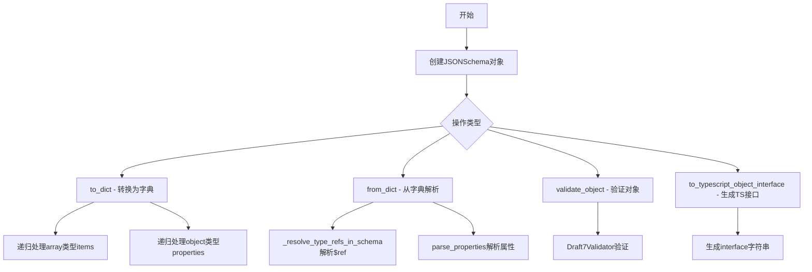
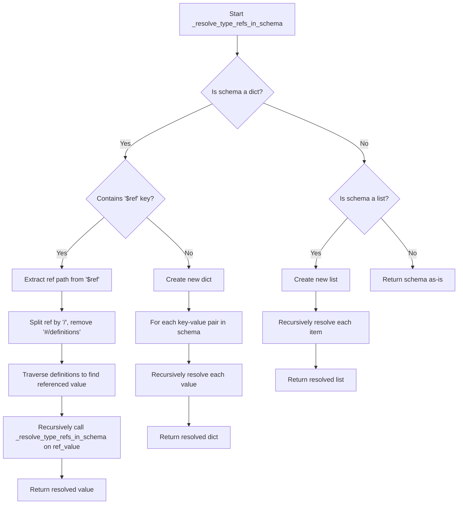
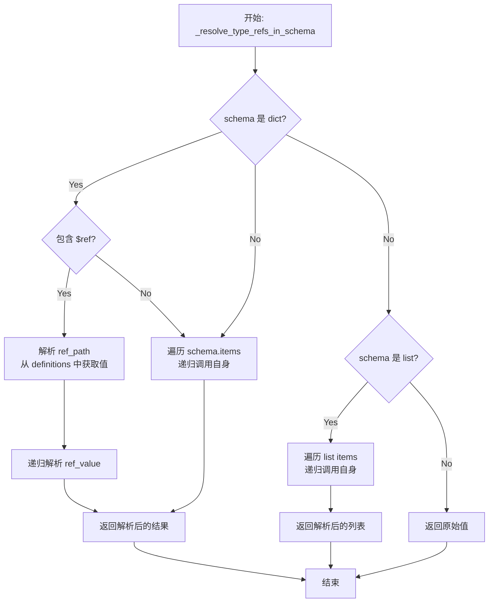
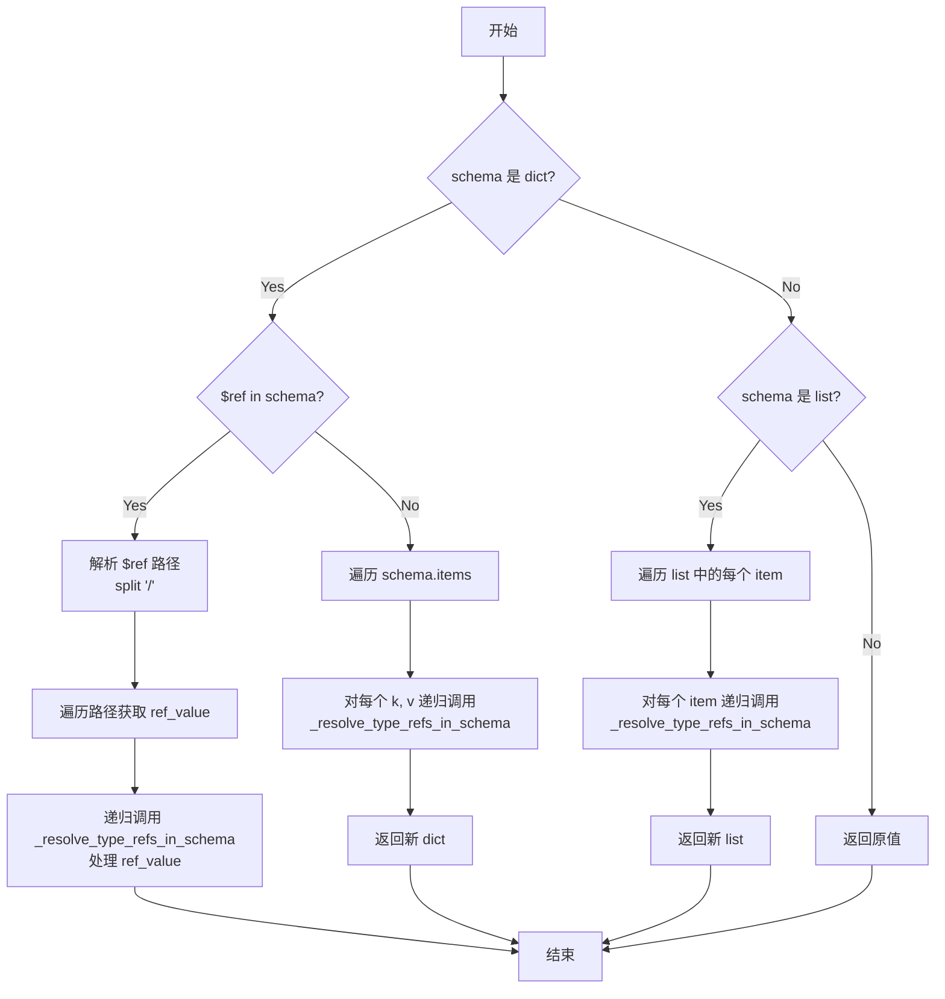
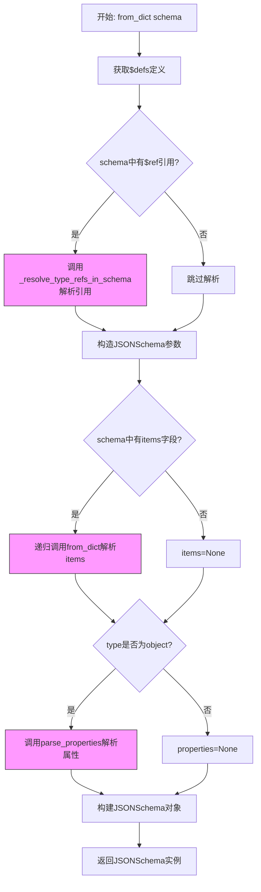
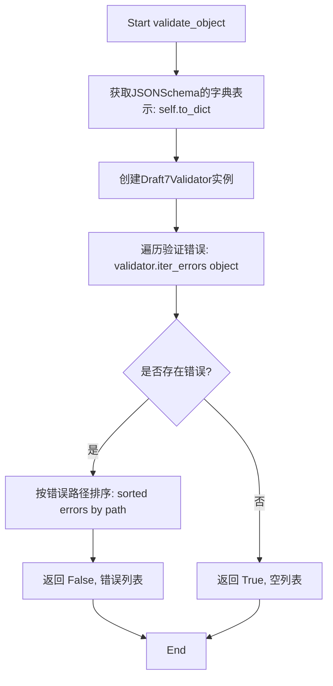

# `.\AutoGPT\classic\forge\forge\models\json_schema.py` 详细设计文档

一个用于处理JSON Schema的Python库，提供了从Python字典创建JSONSchema对象、验证对象是否符合Schema定义、以及生成TypeScript类型定义的功能，支持嵌套对象、数组、枚举等复杂类型的Schema定义和转换。

## 整体流程



## 类结构

```
JSONSchema (主类)
└── Type (内部枚举类)
    ├── STRING
    ├── ARRAY
    ├── OBJECT
    ├── NUMBER
    ├── INTEGER
    └── BOOLEAN
```

## 全局变量及字段


### `_resolve_type_refs_in_schema`
    
递归解析JSON schema中的类型$refs，将其替换为定义中的实际内容

类型：`function(schema: dict | list, definitions: dict) -> dict | list`
    


### `JSONSchema.JSONSchema.description`
    
schema的描述信息，用于文档说明

类型：`Optional[str]`
    


### `JSONSchema.JSONSchema.type`
    
JSON数据类型枚举，定义schema的基本类型

类型：`Optional[Type]`
    


### `JSONSchema.JSONSchema.enum`
    
允许的枚举值列表，限制取值范围

类型：`Optional[list]`
    


### `JSONSchema.JSONSchema.required`
    
标记该字段是否为必需项

类型：`bool`
    


### `JSONSchema.JSONSchema.items`
    
数组类型items的子schema定义

类型：`Optional[JSONSchema]`
    


### `JSONSchema.JSONSchema.properties`
    
对象类型的属性集合，每个属性对应一个schema

类型：`Optional[dict[str, JSONSchema]]`
    


### `JSONSchema.JSONSchema.minimum`
    
数值类型的最小值约束

类型：`Optional[int | float]`
    


### `JSONSchema.JSONSchema.maximum`
    
数值类型的最大值约束

类型：`Optional[int | float]`
    


### `JSONSchema.JSONSchema.minItems`
    
数组类型的最小长度约束

类型：`Optional[int]`
    


### `JSONSchema.JSONSchema.maxItems`
    
数组类型的最大长度约束

类型：`Optional[int]`
    


### `JSONSchema.Type.JSONSchema.Type.STRING`
    
字符串类型标识符

类型：`str`
    


### `JSONSchema.Type.JSONSchema.Type.ARRAY`
    
数组类型标识符

类型：`str`
    


### `JSONSchema.Type.JSONSchema.Type.OBJECT`
    
对象类型标识符

类型：`str`
    


### `JSONSchema.Type.JSONSchema.Type.NUMBER`
    
数字类型标识符

类型：`str`
    


### `JSONSchema.Type.JSONSchema.Type.INTEGER`
    
整数类型标识符

类型：`str`
    


### `JSONSchema.Type.JSONSchema.Type.BOOLEAN`
    
布尔类型标识符

类型：`str`
    


### `JSONSchema.JSONSchema.to_dict`
    
将JSONSchema实例转换为字典表示

类型：`method() -> dict`
    


### `JSONSchema.JSONSchema.from_dict`
    
从字典创建JSONSchema实例的静态方法

类型：`method(schema: dict) -> JSONSchema`
    


### `JSONSchema.JSONSchema.parse_properties`
    
解析对象属性并返回属性名到schema的映射字典

类型：`method(schema_node: dict) -> dict[str, JSONSchema]`
    


### `JSONSchema.JSONSchema.validate_object`
    
根据schema验证对象，返回验证结果和错误列表

类型：`method(object: object) -> tuple[bool, list[ValidationError]]`
    


### `JSONSchema.JSONSchema.to_typescript_object_interface`
    
将对象schema转换为TypeScript接口字符串

类型：`method(interface_name: str = '') -> str`
    


### `JSONSchema.JSONSchema.typescript_type`
    
获取对应的TypeScript类型字符串表示

类型：`property -> str`
    
    

## 全局函数及方法


### `_resolve_type_refs_in_schema`

该函数是一个私有静态方法，用于递归解析 JSON Schema 中的 `$ref` 引用，将引用替换为实际的类型定义。它从 `definitions` 字典中查找并替换所有类型引用，支持嵌套的 schema 结构（字典和列表）。

参数：

- `schema`：`dict | list`，需要解析类型引用的 JSON Schema，可以是字典（对象）或列表
- `definitions`：`dict`，包含所有类型定义的字典，用于解析 `$ref` 引用

返回值：`dict | list`，解析完成后的 JSON Schema，其中所有 `$ref` 已被替换为实际定义

#### 流程图



#### 带注释源码

```python
@overload
def _resolve_type_refs_in_schema(schema: dict, definitions: dict) -> dict:
    """
    重载方法：处理字典类型的 schema
    """
    ...


@overload
def _resolve_type_refs_in_schema(schema: list, definitions: dict) -> list:
    """
    重载方法：处理列表类型的 schema
    """
    ...


def _resolve_type_refs_in_schema(schema: dict | list, definitions: dict) -> dict | list:
    """
    Recursively resolve type $refs in the JSON schema with their definitions.
    """
    # 判断 schema 是否为字典类型
    if isinstance(schema, dict):
        # 检查是否存在 $ref 引用
        if "$ref" in schema:
            # 从 $ref 中提取路径，例如 "#/definitions/MyType" -> ["MyType"]
            ref_path = schema["$ref"].split("/")[2:]  # Split and remove '#/definitions'
            # 从 definitions 开始遍历路径
            ref_value = definitions
            for key in ref_path:
                ref_value = ref_value[key]
            # 递归解析引用的值（可能包含嵌套的 $ref）
            return _resolve_type_refs_in_schema(ref_value, definitions)
        else:
            # 没有 $ref，递归处理所有键值对
            return {
                k: _resolve_type_refs_in_schema(v, definitions)
                for k, v in schema.items()
            }
    # 判断 schema 是否为列表类型
    elif isinstance(schema, list):
        # 递归处理列表中的每个元素
        return [_resolve_type_refs_in_schema(item, definitions) for item in schema]
    else:
        # 基础类型（字符串、数字、布尔值等），直接返回
        return schema
```


### `_resolve_type_refs_in_schema`

该函数是一个递归函数，用于解析 JSON Schema 中的 `$ref` 引用，将其替换为对应的定义（definitions）内容。它支持处理字典、列表和基本类型的数据结构，递归遍历整个 schema 并解析其中的类型引用。

参数：

- `schema`：`list`，输入的 JSON Schema（以列表形式），需要解析其中的类型引用
- `definitions`：`dict`，JSON Schema 中的 `$defs` 或 `definitions` 定义的字典，包含所有可被引用的类型定义

返回值：`list`，返回解析完类型引用后的 schema 列表

#### 流程图



#### 带注释源码

```python
@overload
def _resolve_type_refs_in_schema(schema: dict, definitions: dict) -> dict:
    """
    重载签名：处理字典类型的 schema
    """
    ...


@overload
def _resolve_type_refs_in_schema(schema: list, definitions: dict) -> list:
    """
    重载签名：处理列表类型的 schema
    """
    ...


def _resolve_type_refs_in_schema(schema: dict | list, definitions: dict) -> dict | list:
    """
    递归解析 JSON Schema 中的类型 $ref 引用，将其替换为对应的定义内容。
    
    该函数支持处理三种类型的输入：
    - 字典：检查是否包含 $ref，如果是则解析引用，否则递归处理每个键值对
    - 列表：递归处理列表中的每个元素
    - 其他类型：直接返回原值
    """
    # 判断 schema 是否为字典类型
    if isinstance(schema, dict):
        # 检查是否存在 $ref 引用（JSON Schema 标准格式）
        if "$ref" in schema:
            # 解析引用路径，例如 "#/definitions/MyType" -> ["MyType"]
            # split("/")[2:] 去掉 "#" 和 "definitions" 部分
            ref_path = schema["$ref"].split("/")[2:]
            
            # 从 definitions 中获取引用对应的实际定义
            ref_value = definitions
            for key in ref_path:
                ref_value = ref_value[key]
            
            # 递归解析获取到的定义（可能包含嵌套的 $ref）
            return _resolve_type_refs_in_schema(ref_value, definitions)
        else:
            # 无 $ref，递归处理字典中的每个值
            return {
                k: _resolve_type_refs_in_schema(v, definitions)
                for k, v in schema.items()
            }
    # 判断 schema 是否为列表类型
    elif isinstance(schema, list):
        # 递归处理列表中的每个元素
        return [_resolve_type_refs_in_schema(item, definitions) for item in schema]
    else:
        # 基本类型（字符串、数字、布尔值、None）直接返回
        return schema
```


### `_resolve_type_refs_in_schema`

该函数是一个递归函数，用于解析 JSON Schema 中的类型引用（`$ref`），将引用替换为 `definitions` 中对应的实际定义，实现 Schema 的解引用。

参数：

- `schema`：`dict | list`，输入的 JSON Schema，可以是字典（对象）或列表（数组）
- `definitions`：`dict`，JSON Schema 的定义字典，包含所有可引用的类型定义

返回值：`dict | list`，解析引用后的 JSON Schema 结构

#### 流程图



#### 带注释源码

```python
@overload
def _resolve_type_refs_in_schema(schema: dict, definitions: dict) -> dict:
    """
    重载签名：处理字典类型的 schema
    """
    ...


@overload
def _resolve_type_refs_in_schema(schema: list, definitions: dict) -> list:
    """
    重载签名：处理列表类型的 schema
    """
    ...


def _resolve_type_refs_in_schema(schema: dict | list, definitions: dict) -> dict | list:
    """
    Recursively resolve type $refs in the JSON schema with their definitions.
    
    递归解析 JSON Schema 中的类型引用，将 $ref 替换为 definitions 中的实际定义。
    """
    # 判断 schema 是否为字典（对象）
    if isinstance(schema, dict):
        # 检查是否存在 $ref 引用
        if "$ref" in schema:
            # 解析引用路径，例如 "#/definitions/MyType" -> ["definitions", "MyType"]
            ref_path = schema["$ref"].split("/")[2:]  # Split and remove '#/definitions'
            
            # 从 definitions 中获取引用对应的实际定义
            ref_value = definitions
            for key in ref_path:
                ref_value = ref_value[key]
            
            # 递归解析获取到的定义（可能还包含嵌套的 $ref）
            return _resolve_type_refs_in_schema(ref_value, definitions)
        else:
            # 没有 $ref，递归处理字典中的每个值
            return {
                k: _resolve_type_refs_in_schema(v, definitions)
                for k, v in schema.items()
            }
    # 判断 schema 是否为列表（数组）
    elif isinstance(schema, list):
        # 递归处理列表中的每个元素
        return [_resolve_type_refs_in_schema(item, definitions) for item in schema]
    # 基础类型（字符串、数字、布尔值等），直接返回
    else:
        return schema
```


### `JSONSchema.to_dict()`

将当前 `JSONSchema` 实例转换为符合 JSON Schema 标准的 Python 字典表示，用于序列化或验证等场景。

参数：此方法无显式参数（仅包含隐式参数 `self`）

- `self`：`JSONSchema`，待转换的 JSONSchema 实例本身

返回值：`dict`，返回符合 JSON Schema 标准的字典对象，包含 type、description、items、properties、minimum、maximum 等键（仅包含非 None 值）。

#### 流程图

```mermaid
flowchart TD
    A[开始 to_dict] --> B[创建基础 schema 字典]
    B --> C{self.type == 'array'?}
    C -->|是| D[处理数组类型]
    D --> D1{self.items 存在?}
    D1 -->|是| D2[schema['items'] = self.items.to_dict]
    D1 -->|否| D3[跳过 items]
    D2 --> D4[添加 minItems 和 maxItems]
    C -->|否| E{self.type == 'object'?}
    E -->|是| F[处理对象类型]
    F --> F1{self.properties 存在?}
    F1 -->|是| F2[遍历 properties]
    F2 --> F3[schema['properties'][name] = prop.to_dict]
    F2 --> F4[构建 required 列表]
    F1 -->|否| F5[跳过 properties]
    E -->|否| G{self.enum 存在?}
    G -->|是| H[添加 enum 列表]
    G -->|否| I[处理数值范围]
    I --> I1[添加 minimum 和 maximum]
    H --> J[过滤 None 值]
    I1 --> J
    D4 --> J
    F4 --> J
    F5 --> J
    J --> K[返回 schema]
```

#### 带注释源码

```python
def to_dict(self) -> dict:
    """
    将 JSONSchema 实例转换为符合 JSON Schema 标准的字典格式。
    
    Returns:
        dict: 符合 JSON Schema 规范的字典表示
    """
    # 初始化基础 schema 字典，包含 type 和 description 字段
    # type 使用枚举的 value 属性获取字符串值，若无 type 则为 None
    schema: dict = {
        "type": self.type.value if self.type else None,
        "description": self.description,
    }
    
    # 根据 type 类型进行不同的处理
    if self.type == "array":
        # 处理数组类型
        # 如果存在 items 字段，递归调用 to_dict 转换子 schema
        if self.items:
            schema["items"] = self.items.to_dict()
        # 添加数组长度限制（若存在）
        schema["minItems"] = self.minItems
        schema["maxItems"] = self.maxItems
        
    elif self.type == "object":
        # 处理对象类型
        # 如果存在 properties，递归转换每个属性为字典
        if self.properties:
            schema["properties"] = {
                name: prop.to_dict() for name, prop in self.properties.items()
            }
            # 构建 required 列表，包含所有 required=True 的属性名
            schema["required"] = [
                name for name, prop in self.properties.items() if prop.required
            ]
            
    elif self.enum:
        # 处理枚举类型，直接使用枚举值列表
        schema["enum"] = self.enum
        
    else:
        # 处理数值类型（number/integer），添加范围限制
        # 注意：此处存在 typo，应为 "minimum" 而非 "minumum"
        schema["minumum"] = self.minimum
        schema["maximum"] = self.maximum

    # 过滤掉值为 None 的键，确保返回的字典只包含有效字段
    schema = {k: v for k, v in schema.items() if v is not None}

    return schema
```


### `JSONSchema.from_dict`

该方法是一个静态工厂方法，用于将 Python 字典形式的 JSON Schema 定义转换为 `JSONSchema` 对象，支持解析嵌套的 schema 结构、引用定义（`$ref`）以及数组和对象类型的递归处理。

**参数：**

- `schema`：`dict`，输入的 JSON Schema 字典，必须包含 `type` 字段，可选包含 `description`、`enum`、`items`、`properties`、`minimum`、`maximum`、`minItems`、`maxItems`、`$defs` 等字段

**返回值：**`JSONSchema`，从字典解析得到的 JSONSchema 对象实例

#### 流程图



#### 带注释源码

```python
@staticmethod
def from_dict(schema: dict) -> "JSONSchema":
    """
    从字典形式的JSON Schema定义创建JSONSchema对象。
    
    该方法支持:
    - 解析$defs中定义的可重用类型
    - 递归解析嵌套的数组items
    - 解析对象properties及其required属性
    
    Args:
        schema: JSON Schema字典，必须包含'type'字段
        
    Returns:
        解析后的JSONSchema对象实例
    """
    # 1. 获取$defs定义，用于后续解析$ref引用
    # $defs是JSON Schema中定义可重用类型的地方
    definitions = schema.get("$defs", {})
    
    # 2. 解析schema中的$ref引用，将引用替换为实际定义
    # 这是一个递归过程，会遍历整个schema树
    schema = _resolve_type_refs_in_schema(schema, definitions)
    
    # 3. 构造JSONSchema对象
    # 根据schema中的字段构建对应的JSONSchema实例
    return JSONSchema(
        # 描述字段，可选
        description=schema.get("description"),
        
        # 类型字段，必需，指定数据类型
        type=schema["type"],
        
        # 枚举值，可选
        enum=schema.get("enum"),
        
        # 数组items处理：如果存在items字段，递归调用from_dict解析
        # 这样可以处理嵌套的数组类型定义
        items=JSONSchema.from_dict(schema["items"]) if "items" in schema else None,
        
        # 对象properties处理：仅当type为object时解析properties
        # 调用parse_properties方法处理属性和required列表
        properties=JSONSchema.parse_properties(schema)
        if schema["type"] == "object"
        else None,
        
        # 数值约束，可选
        minimum=schema.get("minimum"),
        maximum=schema.get("maximum"),
        
        # 数组长度约束，可选
        minItems=schema.get("minItems"),
        maxItems=schema.get("maxItems"),
    )
```

#### 依赖方法说明

**`_resolve_type_refs_in_schema` 函数**（全局函数）：

这是一个辅助函数，用于递归解析 JSON Schema 中的 `$ref` 引用。它从 `schema.get("$defs", {})` 中获取定义，然后在整个 schema 中查找 `$ref` 引用并替换为实际定义。

**`JSONSchema.parse_properties` 方法**：

用于解析对象类型的 `properties` 字段，将每个属性的 schema 字典转换为 `JSONSchema` 对象，并根据 `required` 列表设置 `required` 属性。


### `JSONSchema.parse_properties`

解析 JSON Schema 节点中的属性定义，将字典形式的属性转换为 `JSONSchema` 对象实例，并处理必需属性标记。

参数：

- `schema_node`：`dict`，包含 JSON Schema 定义的字典节点，必须包含 `"properties"` 键（可选）来定义对象属性，以及可选的 `"required"` 键来标记必需属性。

返回值：`dict[str, "JSONSchema"]`，返回键为属性名称、值为对应 `JSONSchema` 对象的字典，用于表示解析后的对象属性结构。

#### 流程图

```mermaid
flowchart TD
    A[开始 parse_properties] --> B{schema_node 是否包含 'properties' 键?}
    B -- 是 --> C[遍历 schema_node['properties'] 字典]
    C --> D[对每个属性值调用 JSONSchema.from_dict 转换为 JSONSchema 对象]
    D --> E{schema_node 是否包含 'required' 键?}
    B -- 否 --> F[返回空字典 {}]
    E -- 是 --> G[遍历已转换的 properties]
    G --> H{当前属性名 k 是否在 required 列表中?}
    H -- 是 --> I[设置 v.required = True]
    H -- 否 --> J[设置 v.required = False]
    I --> K[返回处理后的 properties 字典]
    J --> K
    E -- 否 --> K
    F --> K
```

#### 带注释源码

```python
@staticmethod
def parse_properties(schema_node: dict) -> dict[str, "JSONSchema"]:
    """
    静态方法：从 JSON Schema 节点解析属性定义
    
    参数:
        schema_node: 包含 JSON Schema 属性定义的字典节点，通常包含:
                    - 'properties': 属性名到属性定义的映射
                    - 'required': 必需属性名列表
    
    返回:
        键为属性名（str），值为 JSONSchema 对象的字典
    """
    # 条件表达式：如果 schema_node 包含 'properties' 键，
    # 则使用字典推导式将每个属性值转换为 JSONSchema 对象
    # 否则返回空字典
    properties = (
        {k: JSONSchema.from_dict(v) for k, v in schema_node["properties"].items()}
        if "properties" in schema_node
        else {}
    )
    
    # 检查是否存在 'required' 键（定义哪些属性是必需的）
    if "required" in schema_node:
        # 遍历已转换的 properties 字典
        for k, v in properties.items():
            # 根据属性名是否在 required 列表中来设置 required 标志
            v.required = k in schema_node["required"]
    
    # 返回解析后的属性字典
    return properties
```


### `JSONSchema.validate_object`

该方法用于根据当前 JSONSchema 实例验证给定的对象或值是否满足模式定义。它使用 Draft7Validator 进行验证，并返回验证结果（是否通过）以及详细的验证错误列表。

参数：

- `object`：`object`，要验证的对象或值

返回值：`tuple[bool, list[ValidationError]]`，第一个元素为布尔值表示验证是否通过，第二个元素为验证错误列表（如果验证失败）

#### 流程图



#### 带注释源码

```python
def validate_object(self, object: object) -> tuple[bool, list[ValidationError]]:
    """
    Validates an object or a value against the JSONSchema.

    Params:
        object: The value/object to validate.
        schema (JSONSchema): The JSONSchema to validate against.

    Returns:
        bool: Indicates whether the given value or object is valid for the schema.
        list[ValidationError]: The issues with the value or object (if any).
    """
    # 将当前JSONSchema实例转换为字典格式
    # 使用Draft7Validator进行JSON Schema Draft 7版本的验证
    validator = Draft7Validator(self.to_dict())

    # 使用validator检查object是否有违反schema定义的问题
    # iter_errors返回所有错误生成器,按路径排序以获得一致的错误顺序
    if errors := sorted(validator.iter_errors(object), key=lambda e: e.path):
        # 存在验证错误,返回验证失败状态和错误列表
        return False, errors

    # 无验证错误,返回验证成功状态和空错误列表
    return True, []
```


### `JSONSchema.to_typescript_object_interface`

将 JSONSchema 对象转换为 TypeScript 对象接口字符串表示。

参数：

- `interface_name`：`str`，可选参数，生成的 TypeScript 接口名称，默认为空字符串

返回值：`str`，生成的 TypeScript 接口定义字符串

#### 流程图

```mermaid
flowchart TD
    A[开始] --> B{self.type == OBJECT?}
    B -- 否 --> C[抛出 NotImplementedError: 只支持 object 类型]
    B -- 是 --> D{self.properties 存在?}
    D -- 是 --> E[遍历 self.properties]
    E --> F{当前属性有 description?}
    F -- 是 --> G[添加注释 // description]
    F -- 否 --> H[继续]
    G --> I[添加属性定义 name: typescript_type;]
    H --> I
    I --> J{更多属性?}
    J -- 是 --> E
    J -- 否 --> K[用换行符连接所有属性]
    D -- 否 --> L[attributes_string = "[key: string]: any"]
    K --> M{interface_name 存在?}
    L --> M
    M -- 是 --> N[返回 interface interface_name { attributes }]
    M -- 否 --> O[返回 interface { attributes }]
    N --> P[结束]
    O --> P
```

#### 带注释源码

```python
def to_typescript_object_interface(self, interface_name: str = "") -> str:
    """
    将 JSONSchema 对象转换为 TypeScript 接口字符串。

    参数:
        interface_name: 生成的 TypeScript 接口名称，默认为空字符串。

    返回:
        生成的 TypeScript 接口定义字符串。

    异常:
        NotImplementedError: 当 schema 类型不是 object 时抛出。
    """
    # 检查 schema 类型是否为 OBJECT，非 object 类型抛出异常
    if self.type != JSONSchema.Type.OBJECT:
        raise NotImplementedError("Only `object` schemas are supported")

    # 判断是否存在属性定义
    if self.properties:
        # 用于存储生成的属性行
        attributes: list[str] = []
        
        # 遍历所有属性，构建 TypeScript 属性定义
        for name, property in self.properties.items():
            # 如果属性有描述信息，添加 TypeScript 注释
            if property.description:
                attributes.append(f"// {property.description}")
            
            # 获取属性的 TypeScript 类型并添加属性定义
            # 使用 typescript_type property 获取类型映射
            attributes.append(f"{name}: {property.typescript_type};")
        
        # 将所有属性行用换行符连接
        attributes_string = "\n".join(attributes)
    else:
        # 如果没有定义属性，使用索引签名作为默认值
        attributes_string = "[key: string]: any"

    # 构建最终的接口字符串，根据是否有接口名称选择不同的格式
    # 使用 indent 函数进行缩进格式化，保持 TypeScript 代码风格
    return (
        f"interface {interface_name} " if interface_name else ""
    ) + f"{{\n{indent(attributes_string, '  ')}\n}}"
```


### JSONSchema.typescript_type

该属性是 `JSONSchema` 类的一个属性（property），用于将 JSON Schema 类型转换为对应的 TypeScript 类型字符串。它根据当前 schema 对象的 `type`、`items`、`properties` 和 `enum` 等字段，递归地生成相应的 TypeScript 类型表示。

参数：

- 该属性无显式参数，依赖于实例的内部状态（`self.type`、`self.items`、`self.properties`、`self.enum`）

返回值：`str`，返回对应的 TypeScript 类型字符串（如 `"boolean"`、`"number"`、`"string"`、`"Array<T>"`、`"Record<string, any>"` 等）

#### 流程图

```mermaid
flowchart TD
    A[开始: 访问 typescript_type 属性] --> B{self.type 是否为 None?}
    B -->|是| C[返回 'any']
    B -->|否| D{self.type == BOOLEAN?}
    D -->|是| E[返回 'boolean']
    D -->|否| F{self.type in {INTEGER, NUMBER}?}
    F -->|是| G[返回 'number']
    F -->|否| H{self.type == STRING?}
    H -->|是| I[返回 'string']
    H -->|否| J{self.type == ARRAY?}
    J -->|是| K{self.items 是否存在?}
    K -->|是| L[递归获取 items.typescript_type<br/>返回 f'Array<{item_type}>']
    K -->|否| M[返回 'Array']
    J -->|否| N{self.type == OBJECT?}
    N -->|是| O{self.properties 是否存在?}
    O -->|否| P[返回 'Record<string, any>']
    O -->|是| Q[调用 to_typescript_object_interface<br/>返回接口定义字符串]
    N -->|否| R{self.enum 是否存在?}
    R -->|是| S[返回 ' | '.join(repr(v) for v in self.enum)]
    R -->|否| T[抛出 NotImplementedError]
```

#### 带注释源码

```python
@property
def typescript_type(self) -> str:
    """
    将当前 JSONSchema 实例转换为对应的 TypeScript 类型字符串。
    
    该属性根据 schema 的 type、items、properties 和 enum 等字段，
    递归地生成 TypeScript 类型表示。支持以下类型映射：
    - null/undefined -> any
    - boolean -> boolean
    - integer/number -> number
    - string -> string
    - array -> Array<T> 或 Array
    - object -> 接口定义或 Record<string, any>
    - enum -> 联合类型字面量
    
    Returns:
        str: 对应的 TypeScript 类型字符串
        
    Raises:
        NotImplementedError: 当遇到不支持的 Type 枚举值时
    """
    # 如果没有定义 type，返回 any
    if not self.type:
        return "any"
    
    # 布尔类型映射
    if self.type == JSONSchema.Type.BOOLEAN:
        return "boolean"
    
    # 数字类型映射（整数和数字都映射为 number）
    if self.type in {JSONSchema.Type.INTEGER, JSONSchema.Type.NUMBER}:
        return "number"
    
    # 字符串类型映射
    if self.type == JSONSchema.Type.STRING:
        return "string"
    
    # 数组类型映射
    if self.type == JSONSchema.Type.ARRAY:
        # 如果有 items 子 schema，递归获取其 typescript_type
        # 生成泛型数组类型，如 Array<string>、Array<Array<number>> 等
        return f"Array<{self.items.typescript_type}>" if self.items else "Array"
    
    # 对象类型映射
    if self.type == JSONSchema.Type.OBJECT:
        # 如果没有 properties，映射为 Record<string, any>
        if not self.properties:
            return "Record<string, any>"
        # 否则生成 TypeScript 接口定义字符串
        return self.to_typescript_object_interface()
    
    # 枚举类型映射
    # 将枚举值转换为 Python repr 形式（带引号）的联合类型
    # 如 "enum": ["A", "B"] -> "'A' | 'B'"
    if self.enum:
        return " | ".join(repr(v) for v in self.enum)
    
    # 如果遇到不支持的类型，抛出 NotImplementedError
    # 这表明代码需要更新以支持新的 JSON Schema 类型
    raise NotImplementedError(
        f"JSONSchema.typescript_type does not support Type.{self.type.name} yet"
    )
```

## 关键组件


### JSONSchema 类

核心数据模型类，表示 JSON Schema 结构。支持将 Schema 转换为字典、解析字典为 Schema、验证对象、生成 TypeScript 类型定义等功能。

### JSONSchema.Type 枚举

定义 JSON Schema 支持的数据类型，包括 STRING、ARRAY、OBJECT、NUMBER、INTEGER、BOOLEAN。

### to_dict 方法

将 JSONSchema 实例序列化为 Python 字典，用于生成标准的 JSON Schema 格式。

### from_dict 静态方法

从 Python 字典递归解析生成 JSONSchema 实例，支持 $ref 引用解析和嵌套对象属性解析。

### parse_properties 静态方法

解析 JSON Schema 中的 properties 节点，将字典转换为 JSONSchema 对象集合，并处理 required 字段。

### validate_object 方法

使用 jsonschema 库的 Draft7Validator 对对象进行验证，返回验证是否成功及错误列表。

### to_typescript_object_interface 方法

将 object 类型的 JSON Schema 转换为 TypeScript 接口定义字符串，支持属性描述注释生成。

### typescript_type 属性

根据 JSONSchema 的类型配置动态生成对应的 TypeScript 类型字符串，支持嵌套类型和枚举类型。

### _resolve_type_refs_in_schema 函数

递归解析 JSON Schema 中的 $ref 引用，将其替换为 $defs 中定义的完整类型结构。


## 问题及建议


### 已知问题

-   **拼写错误**：在 `to_dict()` 方法的 else 分支中，`schema["minumum"]` 拼写错误，应为 "minimum"
-   **类型比较错误**：`to_dict()` 方法中使用 `self.type == "array"` 和 `self.type == "object"` 进行字符串比较，但 `self.type` 是 `Type` 枚举类型，应使用 `self.type == JSONSchema.Type.ARRAY` 和 `self.type == JSONSchema.Type.OBJECT`
-   **变量名遮蔽**：`validate_object` 方法的参数名 `object` 遮蔽了 Python 内置的 `object` 类
-   **字段名遮蔽**：`enum` 字段名遮蔽了导入的 `enum` 模块，可能导致代码混淆
-   **缺少错误处理**：`from_dict()` 方法中直接访问 `schema["type"]`，如果缺少 "type" 键会抛出 `KeyError` 而非提供友好的错误信息
-   **未实现的功能**：TODO 注释提到需要添加文档字符串，但至今未实现
-   **不支持 null 类型**：JSON Schema 规范包含 "null" 类型，但代码未处理
-   **缺少 $ref 序列化**：`to_dict()` 方法未处理 `$ref` 引用，无法将包含引用的 schema 正确序列化
-   **硬编码的验证器版本**：验证器硬编码使用 `Draft7Validator`，缺乏灵活性以支持其他 JSON Schema 版本
-   **缺少循环引用保护**：在处理嵌套的 `items` 和 `properties` 时，没有防止无限递归的机制

### 优化建议

-   **修复拼写错误**：将 "minumum" 更正为 "minimum"
-   **统一类型比较**：使用枚举类型进行比较，如 `self.type == JSONSchema.Type.ARRAY`
-   **重命名参数**：将 `validate_object` 的参数 `object` 改为 `value` 或 `data` 以避免遮蔽内置类
-   **重命名字段**：将 `enum` 字段重命名为 `enum_values` 或 `enum_values` 以避免遮蔽模块
-   **添加缺失的类型支持**：实现对 "null" 类型的支持，并添加适当的类型检查
-   **改进错误处理**：在 `from_dict()` 中使用 `schema.get("type")` 并提供有意义的错误消息
-   **添加文档字符串**：为所有公共方法和类添加完整的文档字符串
-   **实现 $ref 支持**：在 `to_dict()` 中添加对 `$ref` 的处理逻辑
-   **参数化验证器**：将验证器类型作为可选参数传入，或支持多种 JSON Schema 版本
-   **添加缓存机制**：为 `typescript_type` 属性和生成的 TypeScript 接口添加缓存，避免重复计算
-   **添加输入验证**：在 `from_dict()` 中验证输入字典的有效性
-   **添加类型注解完善性**：确保所有方法的返回类型注解完整准确
-   **考虑使用 __slots__**：如果类的实例数量很大，使用 `__slots__` 可以减少内存占用
-   **提取常量**：将 TypeScript 类型映射提取为类常量或静态方法，提高可维护性


## 其它


### 设计目标与约束

本模块的设计目标是提供一个轻量级的JSON Schema定义、验证和转换工具，能够将JSON Schema结构映射为Python对象，并支持验证JSON数据、生成TypeScript类型定义。核心约束包括：仅支持Draft7版本的JSON Schema验证器；不支持复杂的$ref引用解析（仅支持$defs中定义的基础类型）；TypeScript生成仅支持object类型推导；所有类型映射基于静态定义，不支持运行时动态Schema构建。

### 错误处理与异常设计

代码中的错误处理采用两种方式：对于不支持的操作（如非object类型的TypeScript生成）抛出`NotImplementedError`；对于验证失败返回`(bool, list[ValidationError])`元组而非抛出异常。潜在的异常场景包括：`KeyError`（访问schema中不存在的字段时）、`AttributeError`（type为None时访问.value）、`TypeError`（类型不匹配的操作）。建议增加自定义异常类`JSONSchemaError`作为基类，分离`ValidationException`、`ConversionException`、`ParseException`等具体异常类型。

### 数据流与状态机

JSONSchema对象的状态转换分为三个阶段：**定义阶段**（通过from_dict或直接实例化创建）、**验证阶段**（调用validate_object进行校验）、**转换阶段**（调用to_dict/to_typescript_object_interface输出）。对象内部存在不可变字段（type、enum等）与可变字段（required）的混合状态，其中required字段在parse_properties中可能被修改，建议改为不可变设计或提供明确的构建器模式。

### 外部依赖与接口契约

核心依赖包括：`jsonschema`库（Draft7Validator用于验证）、`pydantic`（BaseModel用于数据建模）、`typing`标准库（类型提示）、`enum`标准库（枚举定义）。对外暴露的公共接口契约：JSONSchema.from_dict接受符合JSON Schema规范的dict，返回JSONSchema实例；validate_object接受任意Python对象，返回(bool, list)元组；to_dict返回标准的JSON Schema dict；to_typescript_object_interface接受可选的interface_name字符串，返回TypeScript接口定义。

### 性能考虑

当前实现的主要性能瓶颈在于：每次调用validate_object都创建新的Validator实例；to_dict方法存在重复的字典推导式过滤；递归解析$ref时缺乏缓存机制。优化建议：引入_validator属性缓存Validator实例；使用__slots__减少内存占用；考虑使用lru_cache缓存to_dict和typescript_type的计算结果。

### 安全性考虑

代码本身不涉及用户输入处理或网络操作，安全性风险较低。但需注意：validate_object中传入的object参数未做类型限制，可能导致特殊对象引发意外行为；from_dict直接访问字典键未做深度校验。建议增加输入类型检查和Schema结构预校验。

### 版本兼容性

代码依赖Python 3.9+的类型联合语法（`int | float`）；pydantic版本应兼容BaseModel的当前定义方式；jsonschema需确保支持Draft7Validator。建议在requirements或pyproject.toml中明确版本约束：pydantic>=2.0、jsonschema>=4.0、Python>=3.9。

### 测试策略

建议补充的测试用例包括：边界条件测试（空schema、全部为None的字段）；类型枚举测试（所有Type枚举值）；验证边界值（minimum/maximum、minItems/maxItems）；$ref解析的深度嵌套测试；TypeScript生成的各种组合测试；to_dict/from_dict的往返一致性测试；性能基准测试（大量字段的object验证）。

### 扩展性设计

当前设计支持有限扩展：items属性支持嵌套JSONSchema实现数组类型递归；properties支持嵌套实现对象递归。扩展建议：增加`additionalProperties`支持复杂对象类型；增加`patternProperties`正则匹配；支持`$ref`到外部文件的引用；增加`const`固定值支持；考虑增加Builder模式简化复杂Schema构建。

### 边界条件处理

代码中存在的边界问题：`minimum`/`maximum`字段在to_dict中存在拼写错误（minumum）；当type为None时typescript_type返回"any"但validate_object可能产生意外结果；空properties时TypeScript生成使用`[key: string]: any`而非标准索引签名；enum与type同时存在时的优先级处理未明确。

### 使用示例

基础用法示例：
```python
schema = JSONSchema(
    type=JSONSchema.Type.OBJECT,
    properties={
        "id": JSONSchema(type=JSONSchema.Type.INTEGER, required=True),
        "name": JSONSchema(type=JSONSchema.Type.STRING, required=True),
        "tags": JSONSchema(type=JSONSchema.Type.ARRAY, items=JSONSchema(type=JSONSchema.Type.STRING))
    }
)
# TypeScript生成
print(schema.to_typescript_object_interface("User"))
# 验证
is_valid, errors = schema.validate_object({"id": 1, "name": "test"})
```
    