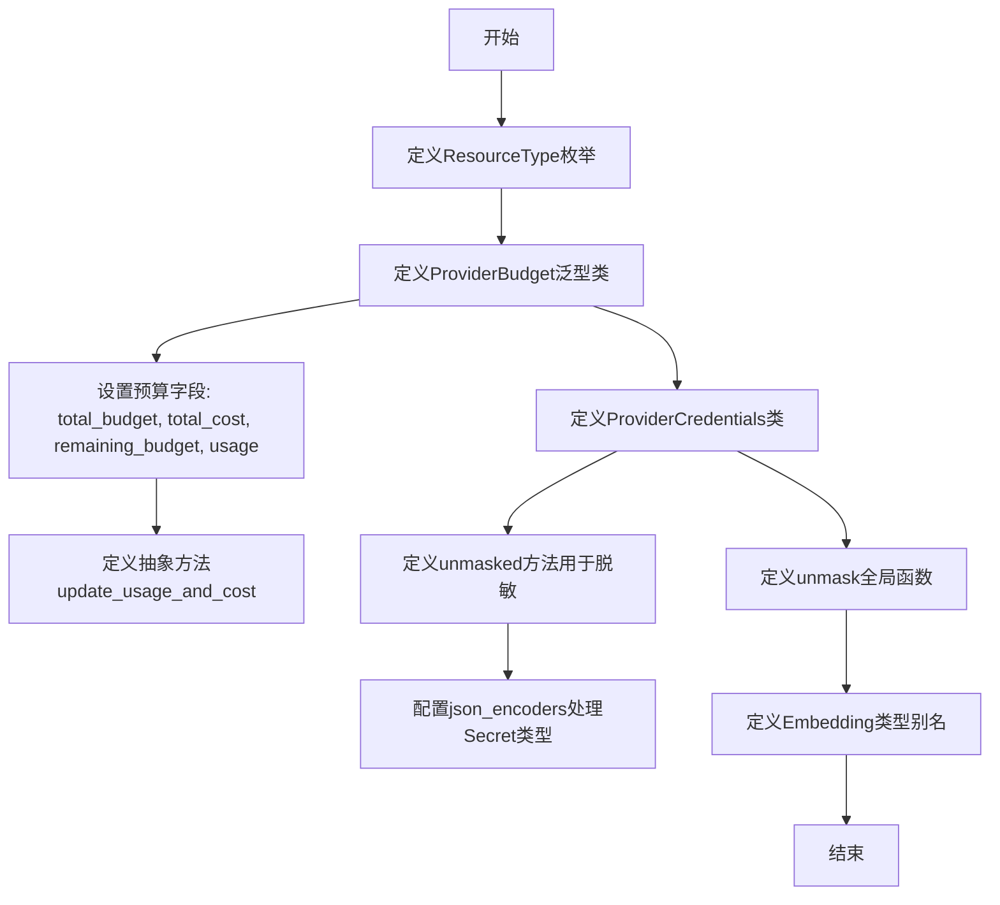
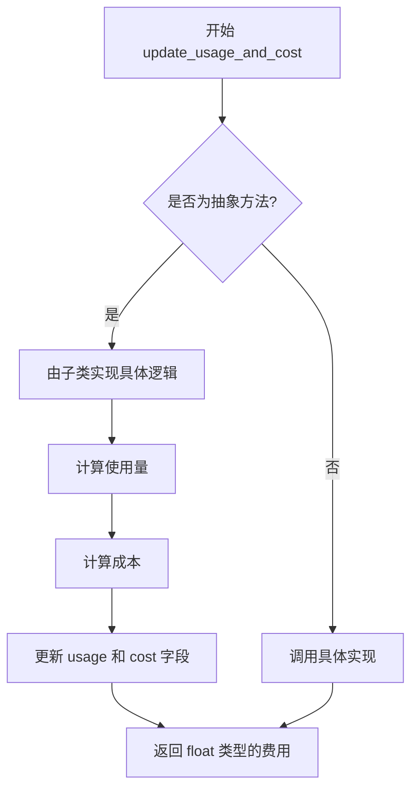
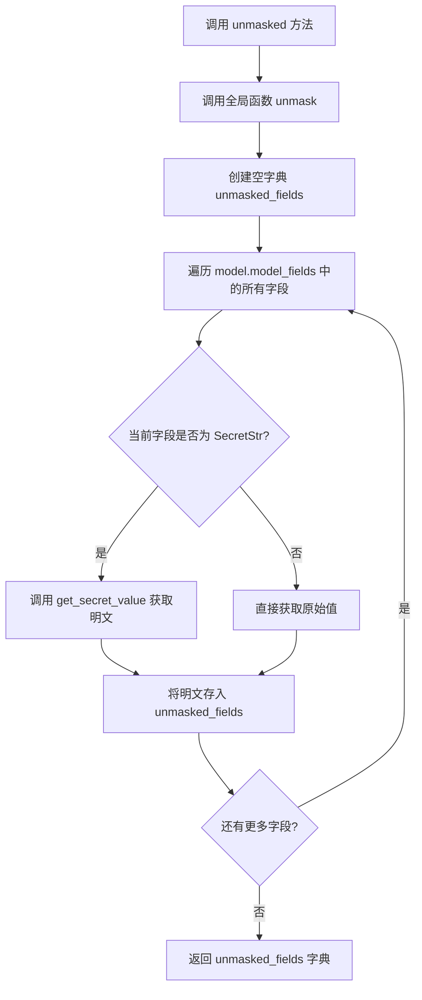

# `.\AutoGPT\classic\forge\forge\models\providers.py` 详细设计文档

该代码定义了机器学习模型供应商相关的核心基础设施，包括资源类型枚举、供应商预算管理泛型类、供应商凭证结构以及用于安全处理敏感信息的工具函数，其中预算类支持自定义使用量类型并提供抽象方法用于更新使用量和成本，凭证类提供了自动掩码敏感字段的序列化能力。

## 整体流程



## 类结构

```
ResourceType (枚举类)
ProviderBudget[T] (泛型抽象类)
│   └── 继承: SystemConfiguration, Generic[_T]
│   └── 抽象方法: update_usage_and_cost
ProviderCredentials (配置类)
│   └── 继承: SystemConfiguration
│   └── 方法: unmasked
unmask (全局函数)
Embedding (类型别名)
```

## 全局变量及字段


### `Embedding`
    
用于模型提供者和内存提供者的嵌入向量类型别名

类型：`list[float]`
    


### `ResourceType.MODEL`
    
枚举成员，表示资源类型为模型

类型：`ResourceType`
    


### `ProviderBudget.total_budget`
    
总预算，默认为无穷大，用于设置预算上限

类型：`float`
    


### `ProviderBudget.total_cost`
    
累计成本，记录已消耗的费用总额

类型：`float`
    


### `ProviderBudget.remaining_budget`
    
剩余预算，计算剩余可用金额

类型：`float`
    


### `ProviderBudget.usage`
    
泛型使用情况字段，存储具体的使用数据

类型：`_T (Generic)`
    


### `ProviderCredentials.model_config`
    
Pydantic模型配置，包含JSON编码器设置用于脱敏Secret类型

类型：`ConfigDict`
    
    

## 全局函数及方法


### `unmask`

该函数用于将 Pydantic BaseModel 模型中的敏感字段（如 SecretStr）转换为其实际的明文值，返回一个包含所有字段的字典，其中敏感信息已被解密。

参数：

- `model`：`BaseModel`，Pydantic BaseModel 实例，可能包含需要解密的敏感字段

返回值：`dict`，包含模型所有字段的字典，其中 SecretStr 类型的值已转换为实际的秘密值

#### 流程图

```mermaid
flowchart TD
    A[Start unmask] --> B[Initialize unmasked_fields = {}]
    B --> C{For each field_name in model.model_fields}
    C --> D[Get value = getattr(model, field_name)]
    D --> E{Is value instanceof SecretStr?}
    E -->|Yes| F[unmasked_fields[field_name] = value.get_secret_value]
    E -->|No| G[unmasked_fields[field_name] = value]
    F --> H[Continue to next field]
    G --> H
    H --> C
    C -->|No more fields| I[Return unmasked_fields]
```

#### 带注释源码

```python
def unmask(model: BaseModel):
    """Unmask a Pydantic BaseModel by converting SecretStr to plain text.
    
    This function iterates through all fields of a Pydantic model and:
    - If a field is a SecretStr, it extracts the actual secret value
    - Otherwise, it keeps the original value unchanged
    
    Args:
        model: Pydantic BaseModel instance containing potentially secret fields
        
    Returns:
        dict: A dictionary mapping field names to their values,
              with SecretStr values replaced by their unmasked content
    """
    # Initialize empty dictionary to store unmasked field values
    unmasked_fields = {}
    
    # Iterate over all defined fields in the Pydantic model
    for field_name, _ in model.model_fields.items():
        # Dynamically get the value of each field from the model instance
        value = getattr(model, field_name)
        
        # Check if the value is a SecretStr instance (sensitive data)
        if isinstance(value, SecretStr):
            # Extract the actual secret value from the SecretStr wrapper
            unmasked_fields[field_name] = value.get_secret_value()
        else:
            # For non-sensitive fields, keep the original value as-is
            unmasked_fields[field_name] = value
    
    # Return the dictionary containing all unmasked field values
    return unmasked_fields
```


### `ProviderBudget.update_usage_and_cost`

更新提供者的使用情况和成本，计算并返回模型响应的费用。

参数：

- `*args`：可变位置参数，用于传递额外的位置参数（具体参数由子类实现决定）
- `**kwargs`：可变关键字参数，用于传递额外的关键字参数（具体参数由子类实现决定）

返回值：`float`，计算出的模型响应费用

#### 流程图



#### 带注释源码

```python
@abc.abstractmethod
def update_usage_and_cost(self, *args, **kwargs) -> float:
    """Update the usage and cost of the provider.

    Returns:
        float: The (calculated) cost of the given model response.
    """
    ...
    # 注意：此方法为抽象方法，具体实现由子类完成
    # 子类需要：
    # 1. 接收并处理传入的参数（通过 *args, **kwargs）
    # 2. 根据实际使用情况更新 self.usage
    # 3. 计算成本并更新 self.total_cost 和 self.remaining_budget
    # 4. 返回计算出的成本（float 类型）
```


### `ProviderCredentials.unmasked`

该方法返回一个字典，包含凭证对象的所有字段，其中 Secret 类型的字段（如密码、密钥等）会被暴露其明文值，而非 Secret 对象本身。这用于需要查看凭证内容但不希望在日志中显示敏感信息的场景。

参数：

- `self`：`ProviderCredentials`，隐式参数，表示当前凭证实例本身

返回值：`dict`，返回一个字典，包含模型的所有字段名称及其值，Secret 类型字段会被解密为明文

#### 流程图



#### 带注释源码

```python
def unmasked(self) -> dict:
    """返回凭证的未掩码（明文）形式。
    
    该方法调用全局 unmask 函数，将当前凭证对象的所有字段转换为字典形式，
    其中 Secret 类型的字段会被暴露其明文值。
    
    Returns:
        dict: 包含所有字段名称及对应值的字典，Secret 字段为明文
    """
    # 调用全局 unmask 函数，传入当前实例（self）
    return unmask(self)
```

## 关键组件


### ResourceType

资源类型枚举类，定义了系统支持的资源类型，目前仅包含 MODEL 类型，用于标识模型资源。

### ProviderBudget

泛型抽象基类，用于管理供应商的预算和成本。包含总预算、已使用成本、剩余预算和使用量字段，提供抽象方法用于更新使用量和计算成本。

### ProviderCredentials

供应商凭证结构类，继承自 SystemConfiguration。提供 unmasked 方法用于获取脱敏后的凭证信息，并配置了针对 SecretStr、SecretBytes 和 Secret 类型的 JSON 编码器。

### unmask

全局函数，接受 Pydantic BaseModel 对象，返回脱敏后的字典字段。将 SecretStr、SecretBytes 和 Secret 类型的字段值转换为实际内容，其他字段保持原值。

### Embedding

类型别名，定义为 list[float]，用于表示嵌入向量的类型，同时被模型供应商和内存供应商使用。


## 问题及建议


### 已知问题

-   **Budget字段冗余**：remaining_budget与total_budget和total_cost存在数据冗余，应该通过计算属性动态计算，而不是单独存储，容易产生状态不一致
-   **泛型类型约束缺失**：usage: _T没有上界约束，传入任意类型都合法，缺乏类型安全性和文档指引
-   **抽象方法签名过于宽泛**：update_usage_and_cost使用*args, **kwargs，丧失类型提示意义，子类实现时无法明确参数规范
-   **unmask函数处理不完整**：仅处理SecretStr，对SecretBytes和BaseModel嵌套情况未做递归处理
-   **json_encoders潜在运行时错误**：SecretBytes的lambda在value为空bytes时返回空bytes，但json_encoders期望可JSON序列化的值，可能导致序列化失败
-   **初始化逻辑不一致**：remaining_budget初始化为math.inf，但update后需要重新计算，初始值意义不明确
-   **类型注解缺失**：unmasked方法、unmask函数均缺少返回类型注解

### 优化建议

-   将remaining_budget改为计算属性（@property），基于total_budget - total_cost动态计算，消除冗余存储
-   为泛型T添加上界约束，如Generic[_T, ...]或添加类型提示说明期望的usage类型结构
-   明确定义update_usage_and_cost的参数签名，使用数据类或Protocol定义参数结构
-   递归处理unmask函数，支持嵌套的BaseModel、list、dict等容器类型中的Secret字段
-   为SecretBytes的json_encoder添加类型检查，确保返回bytes时能正确序列化
-   添加完整的类型注解提升代码可维护性
-   考虑添加usage的类型验证或使用pydantic的Field验证器


## 其它


### 设计目标与约束

**设计目标**：
- 提供一个通用的预算管理框架，支持不同类型的资源使用跟踪
- 提供凭据管理的安全机制，支持敏感信息的掩码和暴露
- 定义通用的嵌入向量类型，支持模型提供商和内存提供商

**约束**：
- `ProviderBudget` 是一个抽象类，必须通过子类实现具体的使用跟踪逻辑
- 预算计算使用浮点数，可能存在精度问题
- `Embedding` 类型为 `list[float]`，限制了底层存储方式

### 错误处理与异常设计

**异常处理机制**：
- 代码本身不包含显式的异常处理，依赖调用方进行异常捕获
- `unmask` 函数假设所有字段都是可访问的，未处理属性不存在的情况
- `ProviderBudget.update_usage_and_cost` 为抽象方法，子类实现时需定义可能的异常

**潜在异常**：
- `getattr` 在属性不存在时返回默认值，但代码未处理这种情况
- `SecretStr`、`SecretBytes`、`Secret` 的 `get_secret_value()` 可能抛出异常如果值为 None

### 数据流与状态机

**数据流**：
- 用户配置 → `ProviderCredentials` → `unmask()` → 暴露的凭据字典
- 资源使用 → `ProviderBudget.update_usage_and_cost()` → 更新 `total_cost` 和 `remaining_budget`
- 预算状态通过 `total_budget`、`total_cost`、`remaining_budget` 三个字段维护

**状态机**：
- `ProviderBudget` 的状态转换：`初始化` → `update_usage_and_cost()` → `更新状态`

### 外部依赖与接口契约

**外部依赖**：
- `pydantic`：用于数据模型定义和配置管理
- `abc`：用于抽象类定义
- `enum`：用于枚举类型定义
- `math`：用于数学常量和函数
- `typing`：用于泛型支持

**接口契约**：
- `ProviderBudget`：子类必须实现 `update_usage_and_cost` 方法
- `ProviderCredentials.unmasked()`：返回包含所有字段的字典，Secret 类型字段返回明文值
- `unmask()` 函数：接收 Pydantic BaseModel 对象，返回字段名到值的字典

### 版本兼容性考虑

- 使用了 Pydantic v2 的 API（如 `model_fields`、`model_config`）
- 不兼容 Pydantic v1
- `Secret` 类型需要 Pydantic 版本支持

### 安全性考虑

- 凭据类通过 `SecretStr`、`SecretBytes`、`Secret` 包装敏感信息
- 提供了 `unmask` 方法用于调试，但需注意在生产环境中谨慎使用
- JSON 编码器配置确保序列化时不暴露敏感值

### 使用示例和调用模式

- `ResourceType` 用于标识资源类型，目前仅支持 "model"
- `ProviderBudget` 需要配合具体实现类使用
- `ProviderCredentials` 可直接实例化或继承使用
- `Embedding` 作为类型提示使用

    