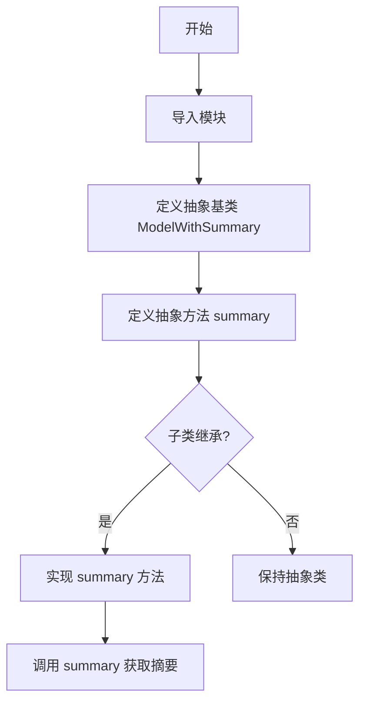
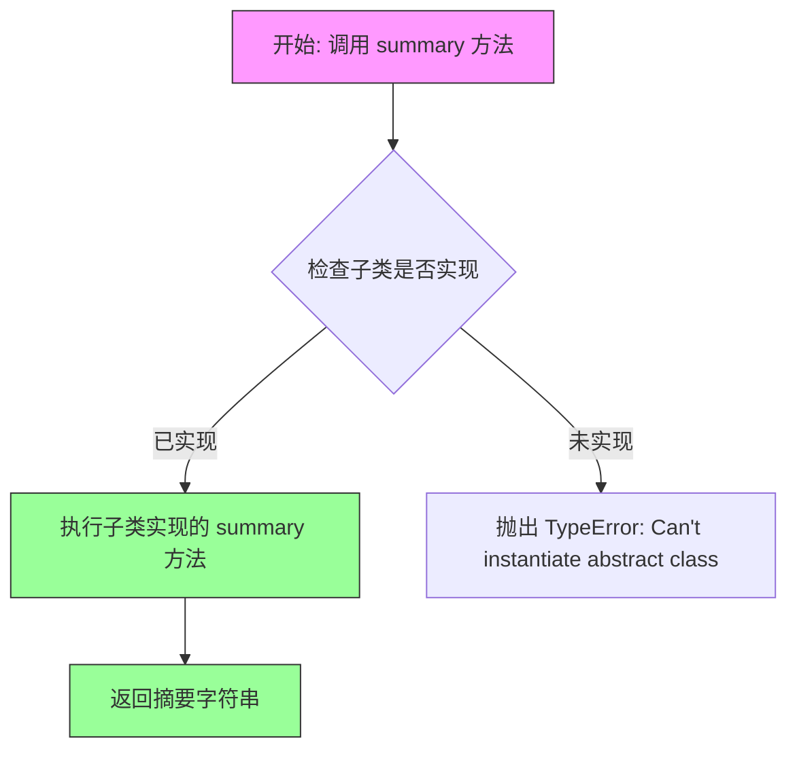

# `.\AutoGPT\classic\forge\forge\models\utils.py` 详细设计文档

该代码定义了一个名为ModelWithSummary的抽象基类，继承自Pydantic的BaseModel和Python的ABC，用于为模型提供统一的摘要接口规范。所有实现该抽象类的子类必须实现summary方法，以产生人类可读的模型内容摘要。

## 整体流程



## 类结构

```
ModelWithSummary (抽象基类)
├── 继承自 BaseModel (Pydantic)
└── 继承自 ABC (Python abc)
```

## 全局变量及字段


    

## 全局函数及方法


### `ModelWithSummary.summary`

这是一个抽象方法，定义了模型摘要的接口。所有继承自 `ModelWithSummary` 的具体类都必须实现此方法，以提供模型内容的人类可读摘要。

参数：

- `self`：`ModelWithSummary`，调用该方法的类实例（Pydantic BaseModel 子类实例）

返回值：`str`，模型内容的人类可读摘要字符串

#### 流程图



#### 带注释源码

```python
from abc import ABC, abstractmethod
# abc.ABC: 抽象基类模块，提供抽象方法装饰器
# abc.abstractmethod: 装饰器，用于标记抽象方法

from pydantic import BaseModel
# pydantic.BaseModel: Pydantic 模型基类，提供数据验证和序列化功能


class ModelWithSummary(BaseModel, ABC):
    """
    抽象基类，继承自 Pydantic BaseModel 和 ABC。
    要求所有子类实现 summary 方法以提供模型摘要。
    """
    
    @abstractmethod
    def summary(self) -> str:
        """
        抽象方法：应生成模型内容的可读摘要。
        
        Args:
            self: ModelWithSummary 实例，隐式参数
            
        Returns:
            str: 人类可读的模型内容摘要
            
        Raises:
            TypeError: 如果尝试直接实例化此类（未实现方法时）
            
        Note:
            此方法为抽象方法，所有非抽象子类必须重写此方法。
            子类实现时应返回描述模型关键属性和值的字符串。
        """
        pass
```

---

### 补充说明

| 项目 | 说明 |
|------|------|
| **设计目标** | 定义一个通用的模型摘要接口，要求所有 Pydantic 模型子类实现自定义的摘要生成逻辑 |
| **约束** | 继承此类的具体类必须实现 `summary` 方法，否则无法实例化 |
| **错误处理** | 直接实例化或调用未实现的抽象方法会抛出 `TypeError` |
| **外部依赖** | `pydantic`（数据验证）、`abc`（抽象基类） |
| **接口契约** | 子类实现时必须返回 `str` 类型，任何返回非字符串类型的实现都是无效的 |

## 关键组件


### ModelWithSummary

ModelWithSummary 是一个 Pydantic 抽象基类，定义了模型摘要的统一接口，继承自 BaseModel 和 ABC，要求子类实现 summary() 方法以提供模型内容的人类可读摘要。

### summary()

summary() 是一个抽象方法，要求子类实现以返回模型内容的字符串摘要，无参数，返回类型为 str。


## 问题及建议


### 已知问题

-   **类缺少文档字符串**：ModelWithSummary 类本身没有类级别的文档字符串，建议添加以说明该抽象类的用途和设计意图
-   **抽象方法缺少详细文档**：summary() 方法的文档仅说明其功能，缺少参数说明、异常说明和示例
-   **无默认实现**：作为可能频繁使用的抽象基类，若存在通用的摘要生成逻辑，可提供默认实现供子类复用或重写
-   **无字段定义**：作为 Pydantic 模型，未定义任何字段，可能导致子类实现时缺少统一的数据结构约束
-   **无验证逻辑**：缺少 Pydantic 字段验证器或模型验证器，无法对子类数据实施统一校验规则
-   **元类兼容性风险**：同时继承 ABC 和 Pydantic BaseModel 可能在某些边缘情况下存在元类冲突风险（虽在现代 Python 和 Pydantic v1/v2 中已解决）

### 优化建议

-   为 ModelWithSummary 类添加类级别文档字符串，说明其作为摘要模型基类的设计目的
-   为 summary() 方法添加更完整的文档，包括返回值格式示例和可能的异常情况说明
-   考虑在抽象方法上添加 @cached_property 或默认实现，以支持无需自定义摘要的简单用例
-   定义必要的抽象字段（使用 Field），确保子类实现时具有一致的数据结构和类型约束
-   添加通用的 model_validator 或 field_validator 以实施跨子类的统一验证逻辑
-   考虑添加 mixin 方法（如 to_dict()、from_dict()）以增强模型的通用性
-   明确标注 Python 版本依赖和 Pydantic 版本要求，确保兼容性


## 其它


### 设计目标与约束

设计目标：
1. 提供一个通用的抽象基类，用于定义需要生成摘要的模型
2. 强制所有子类实现 `summary()` 方法，确保统一的接口契约
3. 继承 Pydantic 的 `BaseModel` 功能，获得数据验证和序列化能力

设计约束：
1. 抽象方法 `summary()` 必须由子类实现，否则无法实例化
2. 只能继承自 Pydantic 的 `BaseModel` 和 ABC 的 `ABC`
3. 不提供默认实现，保持抽象性

### 错误处理与异常设计

由于该类为抽象基类，错误处理主要体现在：
1. **实例化限制**：尝试实例化 `ModelWithSummary` 会抛出 `TypeError`，提示"Can't instantiate abstract class ModelWithSummary with abstract method summary"
2. **子类实现检查**：若子类未实现 `summary()` 方法，Python 会在实例化时自动检查并抛出 `TypeError`
3. 建议调用方使用 `try-except` 捕获 `TypeError` 以处理不当实例化

### 数据流与状态机

该类为基类，不涉及复杂的数据流或状态机。其数据流如下：
1. 子类定义具体的数据模型字段（继承自 Pydantic BaseModel）
2. 调用方创建子类实例，Pydantic 自动进行数据验证
3. 调用 `summary()` 方法获取模型的人类可读摘要
4. 返回字符串类型的摘要信息

### 外部依赖与接口契约

外部依赖：
- `abc` 模块：Python 内置模块，提供抽象基类（ABC）支持
- `pydantic` 包：提供 BaseModel 基类，用于数据验证和序列化

接口契约：
- **抽象方法**：`summary() -> str`
  - 输入：无参数
  - 输出：字符串类型的人类可读摘要
  - 要求：子类必须实现该方法
- **继承约束**：子类必须同时继承 `BaseModel` 和 `ABC`

### 性能考虑

1. 该类为轻量级抽象基类，无性能开销
2. `summary()` 方法的性能取决于子类实现
3. 建议在 `summary()` 方法中避免复杂的递归或大数据处理

### 安全性考虑

1. 该类本身不涉及敏感数据处理
2. 子类在实现 `summary()` 时应注意：
   - 避免泄露敏感字段（如密码、密钥）
   - 对输出内容进行适当的脱敏处理

### 可测试性设计

1. 抽象基类无法直接实例化，测试主要针对子类
2. 测试策略：
   - 验证子类正确实现 `summary()` 方法
   - 验证返回值为字符串类型
   - 验证 Pydantic 的数据验证功能正常工作

### 版本兼容性

- Python 版本：3.7+（支持 ABC 和 Pydantic）
- Pydantic 版本：1.x 或 2.x（BaseModel 在两个版本中均可用，2.x 中可能有轻微 API 变化）

### 配置管理

该类不涉及运行时配置，所有配置通过子类定义实现。

### 扩展性设计

1. 可通过继承该基类创建多种模型变体
2. 可在子类中添加额外的抽象方法以扩展功能
3. 建议配合组合模式使用，生成复杂对象的摘要

### 文档和注释规范

- 类文档字符串：应说明类的用途和继承约束
- 方法文档字符串：应使用 Google 或 NumPy 风格，描述输入输出
- 类型注解：应使用 Python 3.7+ 的 typing 模块进行类型标注

    