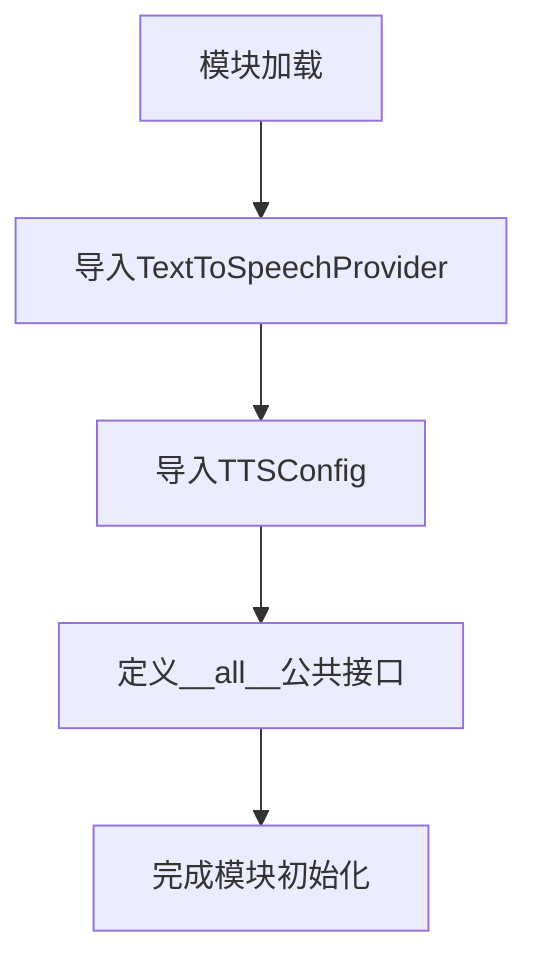

# `.\AutoGPT\classic\forge\forge\speech\__init__.py` 详细设计文档

该模块是语音合成功能的入口模块，通过导入并导出TextToSpeechProvider和TTSConfig类，为上层应用提供统一的语音合成服务接口。

## 整体流程



## 类结构

```
speech_synthesis 包
├── __init__.py (当前文件)
└── say.py (内部实现模块)
```

## 全局变量及字段


### `__all__`
    
定义模块的公开接口，控制from module import *的行为

类型：`list`
    


    

## 全局函数及方法


## 关键组件


### TextToSpeechProvider

文本转语音提供者类，负责将文本转换为语音输出。该类应包含语音合成的核心逻辑、音频处理和播放控制等功能。

### TTSConfig

TTS配置类，用于存储和管理文本转语音系统的配置参数。该类可能包含语音语调、语速、音量、音频格式等配置选项。


## 问题及建议


### 已知问题

-   **文档注释与实际功能不符**：模块注释中提到"(speech recognition and) speech synthesis functions"，暗示同时包含语音识别和语音合成功能，但代码实际只导出了语音合成相关的 `TextToSpeechProvider` 和 `TTSConfig`，没有语音识别相关内容，存在文档与实现不一致的问题
-   **缺少模块级文档**：模块仅依赖文件头的 docstring，没有提供更详细的使用说明、API 文档或设计意图说明
-   **过度简单的模块设计**：该模块仅作为重新导出（reexport）层，如果未来没有额外的聚合或转换逻辑，可能没有存在的必要，增加了项目复杂度
-   **依赖风险集中**：模块完全依赖 `.say` 子模块，如果 `.say` 模块结构变化或导出内容变更，将直接影响该模块的可用性
-   **功能边界不清晰**：注释暗示该模块可能承担语音识别功能，但实际上并未包含，边界定义模糊可能导致未来维护困惑

### 优化建议

-   **更新文档注释**：将注释改为更准确的描述，如 "This module contains the speech synthesis functions and re-exports core TTS components."，移除 "(speech recognition and)" 部分以避免误导
-   **添加模块级文档字符串**：使用详细的模块文档说明该模块的职责、导出内容的目的、以及与 `.say` 模块的关系
-   **考虑模块合并或移除**：如果该模块仅用于简单重导出，建议直接使用 `.say` 模块，或在文档中明确说明此模块存在的设计意图（如为了解耦、API 封装等）
-   **增加类型注解和类型检查**：为导入和导出操作添加显式的类型提示，提高代码的可维护性和 IDE 支持
-   **考虑添加异常处理**：如果 `.say` 模块导入可能失败，应添加适当的错误处理或文档说明其依赖关系

## 其它


### 设计目标与约束

本模块作为语音合成功能的公共接口层，目标是统一对外暴露 TextToSpeechProvider 和 TTSConfig 两个核心类，隐藏底层实现细节。约束包括：必须依赖内部 say 模块的 TTS 实现，不可单独使用；版本需与 say 模块保持同步更新。

### 错误处理与异常设计

由于本模块仅为接口导出层，异常处理主要依赖 say 模块实现。可能的异常包括：导入错误（say 模块不存在或版本不匹配）、配置错误（TTSConfig 参数不合法）。调用方应捕获相关异常并做降级处理。

### 外部依赖与接口契约

本模块直接依赖 `say` 模块中的 `TextToSpeechProvider` 类和 `TTSConfig` 类。接口契约：say 模块必须实现这两个类，且 TextToSpeechProvider 需提供 speak() 方法，TTSConfig 需提供可序列化的配置属性。任何对 say 模块的重大变更需同步更新本模块。

### 使用示例

```python
from tts import TextToSpeechProvider, TTSConfig

# 创建配置
config = TTSConfig(voice="zh-CN", speed=1.0, pitch=1.0)

# 创建语音合成提供者
provider = TextToSpeechProvider(config)

# 执行语音合成
provider.speak("你好，世界")
```

### 版本兼容性说明

本模块遵循语义化版本控制。当 say 模块 API 发生不兼容变更时，本模块 major 版本号应递增。建议使用版本锁定（如 pip freeze）确保依赖一致性。

### 配置项说明（TTSConfig）

- voice: 字符串，指定语音类型（如 "zh-CN", "en-US"），默认根据系统 locale 自动选择
- speed: 浮点数，语速倍率（0.5-2.0），默认 1.0
- pitch: 浮点数，音调调整（0.5-2.0），默认 1.0

### 性能考虑

本模块为轻量级导出层，无额外性能开销。实际语音合成性能取决于 say 模块实现。批量合成场景下建议复用 TextToSpeechProvider 实例以减少初始化开销。

### 测试策略建议

由于本模块主要是接口重导出，测试重点应覆盖：导入测试（验证 say 模块可正常导入）、接口完整性测试（验证导出的类和属性存在）、兼容性测试（与不同版本 say 模块的配合）。

    