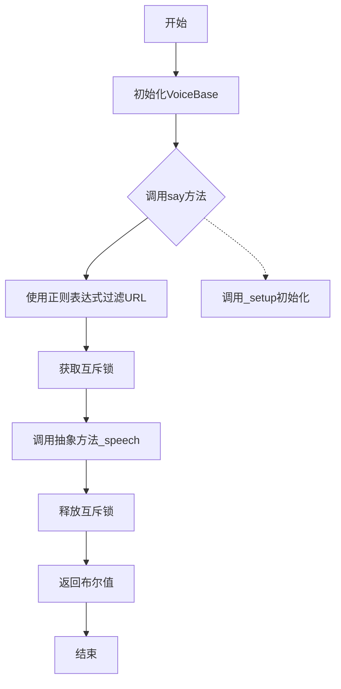
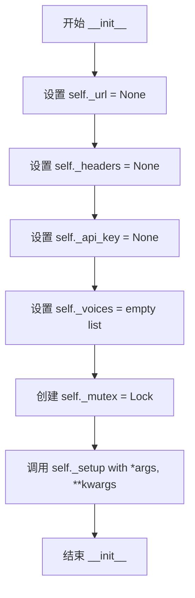
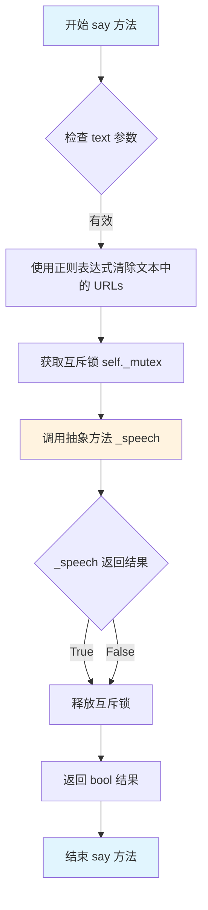
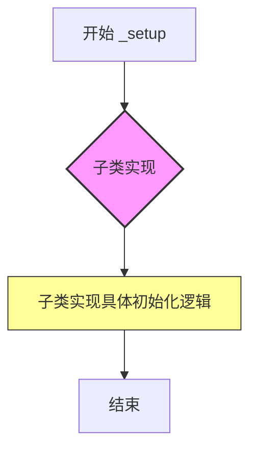
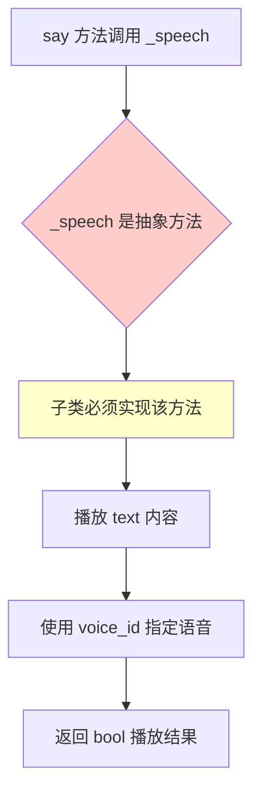

# `.\AutoGPT\classic\forge\forge\speech\base.py` 详细设计文档

VoiceBase是一个用于所有语音类的抽象基类，提供了文本转语音的基本框架，通过互斥锁保证线程安全，并包含URL过滤和抽象方法定义。

## 整体流程



## 类结构

```
VoiceBase (抽象基类)
└── _setup (抽象方法，由子类实现)
└── _speech (抽象方法，由子类实现)
```

## 全局变量及字段


### `VoiceBase._url`
    
存储语音服务的API请求URL地址

类型：`str | None`
    


### `VoiceBase._headers`
    
存储HTTP请求头信息，用于API认证和内容类型定义

类型：`dict | None`
    


### `VoiceBase._api_key`
    
存储语音服务的API密钥，用于身份验证

类型：`str | None`
    


### `VoiceBase._voices`
    
存储可用的语音列表，包含语音的名称、ID等属性信息

类型：`list`
    


### `VoiceBase._mutex`
    
线程互斥锁，用于保证say方法的线程安全性，防止并发访问冲突

类型：`threading.Lock`
    
    

## 全局函数及方法


### `VoiceBase.__init__`

初始化语音类，设置基本实例变量并调用子类的_setup方法。

参数：

- `*args`：可变位置参数（元组），传递额外位置参数给子类`_setup`方法
- `**kwargs`：可变关键字参数（字典），传递额外关键字参数给子类`_setup`方法

返回值：`None`，无返回值（构造方法）

#### 流程图



#### 带注释源码

```python
def __init__(self, *args, **kwargs):
    """
    Initialize the voice class.
    构造方法：初始化VoiceBase实例的基本属性
    """
    self._url = None            # 存储API端点URL，初始为None
    self._headers = None        # 存储HTTP请求头，初始为None
    self._api_key = None        # 存储API密钥，初始为None
    self._voices = []           # 存储可用语音列表，初始为空列表
    self._mutex = Lock()        # 创建线程锁，用于保证线程安全
    self._setup(*args, **kwargs) # 调用子类实现的具体初始化逻辑
```


### VoiceBase.say

该方法接收文本和语音索引参数，首先使用正则表达式从文本中清除URL链接，然后通过互斥锁确保线程安全地调用抽象方法`_speech`来播放语音，返回布尔值表示操作是否成功。

参数：

- `text`：`str`，要说出的文本内容
- `voice_index`：`int`，要使用的语音索引（默认值为0）

返回值：`bool`，表示语音播放是否成功

#### 流程图



#### 带注释源码

```python
def say(self, text: str, voice_index: int = 0) -> bool:
    """
    Say the given text.

    Args:
        text (str): The text to say.
        voice_index (int): The index of the voice to use.
    """
    # 使用正则表达式从文本中移除 URL 链接
    # 匹配模式: 匹配 http/https 协议开头的 URL
    text = re.sub(
        r"\b(?:https?://[-\w_.]+/?\w[-\w_.]*\.(?:[-\w_.]+/?\w[-\w_.]*\.)?[a-z]+(?:/[-\w_.%]+)*\b(?!\.))",  # noqa: E501
        "",
        text,
    )
    # 使用互斥锁确保线程安全，防止并发调用 _speech
    with self._mutex:
        # 调用子类实现的抽象方法 _speech 进行实际语音播放
        return self._speech(text, voice_index)
```


### `VoiceBase._setup`

Setup the voices, API key, etc. 这是一个抽象方法，由子类实现，用于初始化语音类所需的资源，如 API 密钥、可用语音列表等。

参数：

- `*args`：任意位置参数，用于传递子类初始化所需的额外位置参数
- `**kwargs`：任意关键字参数，用于传递子类初始化所需的额外关键字参数（如 API 密钥、URL 等）

返回值：`None`，无返回值，仅执行初始化逻辑

#### 流程图



#### 带注释源码

```python
@abc.abstractmethod
def _setup(self, *args, **kwargs) -> None:
    """
    Setup the voices, API key, etc.
    
    这是一个抽象方法，必须由子类重写实现。
    子类应该在此方法中完成以下初始化工作：
    - 获取并验证 API 密钥
    - 初始化可用语音列表
    - 设置必要的请求头和 URL
    - 配置其他子类特定的初始化参数
    
    Args:
        *args: 可变位置参数，支持传递子类特定的初始化参数
        **kwargs: 可变关键字参数，支持传递 API 密钥、URL 等配置信息
    
    Returns:
        None: 此方法不返回任何值，初始化结果存储在实例属性中
    """
    # 抽象方法，由子类实现具体逻辑
    # 基类提供接口规范，子类负责具体初始化
```


### `VoiceBase._speech`

抽象方法，用于播放指定的文本内容。该方法定义了在子类中必须实现的语音播放逻辑，由 `say` 方法在互斥锁保护下调用。

参数：

- `text`：`str`，要播放的文本内容
- `voice_id`：`int`，要使用的语音索引（默认值为 0）

返回值：`bool`，表示语音播放是否成功

#### 流程图



#### 带注释源码

```python
@abc.abstractmethod
def _speech(self, text: str, voice_id: int = 0) -> bool:
    """
    Play the given text.

    Args:
        text (str): The text to play.
        voice_id: int, the index of the voice to use
    """
    # 注意：此为抽象方法，子类必须实现具体逻辑
    # 参数 text: 要播放的文本字符串
    # 参数 voice_id: 语音索引，用于选择不同的语音
    # 返回值: bool 类型，表示播放是否成功
    # 该方法被设计为在 self._mutex 锁保护的上下文中被调用
```

#### 额外说明

**设计目标与约束**：

- 该方法被设计为抽象方法（`@abc.abstractmethod`），强制子类实现具体的语音播放逻辑
- 返回值 `bool` 用于指示播放操作的成功与否

**技术债务/优化空间**：

- 由于是抽象方法，文档中缺少对子类实现预期的详细说明（如错误处理方式、异常抛出条件等）
- 未定义具体的异常类型或错误码，子类实现时可能缺乏一致的错误处理规范

**注意事项**：

- 该方法不直接对外暴露，而是通过 `say` 方法间接调用
- 调用时已处于 `self._mutex` 保护的临界区内，子类实现时无需考虑线程安全问题


## 关键组件


### VoiceBase 抽象基类

语音合成系统的基类，提供文本转语音的抽象接口，通过抽象方法定义子类必须实现的_setup()和_speech()方法，支持多语音切换和线程安全的语音播放。

### 线程安全机制 (_mutex)

使用threading.Lock()实现线程同步，确保多线程环境下say()方法的并发安全，防止同时调用_speech()导致资源竞争或状态不一致。

### URL过滤正则表达式

使用re.sub()配合正则表达式，移除文本中的URL链接，避免语音合成时读出无效的URL内容。正则表达式涵盖http/https协议、域名、路径等复杂格式。

### 灵活初始化模式 (*args, **kwargs)

通过可变参数*args和**kwargs实现子类的灵活初始化，_setup()方法由子类重写以执行特定的初始化逻辑，如加载API配置、获取可用语音列表等。

### 语音索引机制 (voice_index)

通过整数索引指定要使用的语音，say()方法将voice_index传递给_speech()实现，支持多语音选项的切换与管理。

### 私有属性封装

所有属性使用单下划线前缀（_url, _headers, _api_key, _voices）遵循Python命名约定，标记为内部使用，体现面向对象的封装设计。


## 问题及建议


### 已知问题

-   **正则表达式未预编译**：在 `say()` 方法中每次调用都重新编译正则表达式，性能低下
-   **参数类型不一致**：`say()` 方法参数为 `voice_index: int`，而抽象方法 `_speech()` 参数为 `voice_id: int`，命名和类型不一致
-   **API Key 安全性**：`_api_key` 明文存储在类属性中，缺乏加密或安全存储机制
-   **参数验证缺失**：未对 `text` 和 `voice_index` 参数进行有效性校验
-   **文档不完整**：`_speech()` 抽象方法缺少返回值描述
-   **错误处理缺失**：`say()` 方法无异常处理，异常会直接传播可能导致调用方难以捕获
-   **接口不清晰**：过度使用 `*args, **kwargs` 传递参数，导致接口不明确，难以维护
-   **锁粒度过粗**：整个 `say()` 方法都在锁保护下执行，高并发场景下性能受限

### 优化建议

-   **预编译正则表达式**：在类初始化时编译正则表达式为类属性，避免重复编译开销
-   **统一参数命名**：将 `_speech()` 的 `voice_id` 参数改为 `voice_index` 以保持一致
-   **添加参数验证**：在 `say()` 方法入口处校验 `text` 非空、`voice_index` 有效范围
-   **补充文档**：为 `_speech()` 方法添加返回值描述
-   **考虑异步支持**：添加异步版本方法以支持非阻塞语音播放
-   **细粒度锁控制**：将锁的范围缩小到仅保护核心语音播放逻辑
-   **提供上下文管理器**：实现 `__enter__` 和 `__exit__` 以支持 `with` 语句的资源管理

## 其它


### 设计目标与约束

本类作为所有语音子类的抽象基类，旨在提供统一的接口规范和基础的线程安全机制。设计约束包括：子类必须实现`_setup`和`_speech`抽象方法；使用互斥锁保证`say`方法的线程安全性；通过正则表达式过滤文本中的URL。

### 错误处理与异常设计

- **初始化异常**：子类在`_setup`中若配置失败（如API密钥无效），应抛出自定义异常或设置合理的错误状态
- **参数校验**：`say`方法应增加对`text`为空或`voice_index`越界的校验
- **正则表达式异常**：当前正则表达式复杂，可能存在运行时错误风险，建议捕获`re.error`异常
- **锁异常**：`with self._mutex`块若获取锁失败，应有超时处理或异常传播机制

### 数据流与状态机

1. **入口流程**：用户调用`say(text, voice_index)`
2. **数据处理**：使用正则表达式过滤文本中的URL
3. **同步控制**：获取互斥锁确保线程安全
4. **核心处理**：调用子类`_speech`方法执行实际语音合成
5. **状态转换**：对象从初始化状态→就绪状态→使用中状态→完成状态

### 外部依赖与接口契约

- **abc模块**：提供抽象方法装饰器，用于定义子类必须实现的接口
- **re模块**：用于URL过滤的正则表达式处理
- **threading模块**：提供线程同步的互斥锁机制
- **子类契约**：实现类必须提供`_setup(*args, **kwargs)`和`_speech(text: str, voice_id: int) -> bool`两个方法

### 线程安全考虑

- `_mutex`锁保护了`say`方法的完整执行流程，防止多线程并发调用导致资源竞争
- 当前实现为粗粒度锁，可能影响并发性能；建议评估是否可改为细粒度锁
- 建议增加死锁超时机制，避免永久阻塞

### 性能要求与优化空间

- 正则表达式在每次`say`调用时重新编译，建议预编译正则表达式为类属性
- 互斥锁的粗粒度设计可能成为性能瓶颈，可考虑语音级别的细粒度锁
- `_voices`列表的访问未加锁，存在潜在竞态条件

### 内存管理与资源生命周期

- `_mutex`在对象销毁时应正确释放（依赖Python垃圾回收机制）
- 建议实现`__del__`方法或使用上下文管理器确保资源释放
- `_voices`等列表类型字段应考虑内存泄漏风险

### 配置管理与灵活性

- 构造函数接受`*args, **kwargs`提供了扩展性，但缺乏明确的配置项定义
- 建议增加配置Schema文档或使用数据类(DataClass)定义配置结构
- `_url`、`_headers`、`_api_key`的设置逻辑完全委托给子类，基类缺少默认值和校验逻辑

### 版本兼容性

- 使用`from __future__ import annotations`支持Python 3.7+的类型注解前向引用
- 建议明确最低Python版本要求
- 考虑添加`typing`模块的泛型支持以增强类型安全

### 扩展性设计

- 当前仅支持单voice_index参数，可扩展为voice_id支持更复杂的语音选择
- 可考虑添加异步版本的`say_async`方法支持非阻塞语音播放
- 可添加事件回调机制（如`on_speech_start`、`on_speech_end`）增强可观测性

### 测试策略建议

- 单元测试：测试URL过滤正则表达式的正确性
- 集成测试：测试多线程并发调用场景
- mock测试：模拟子类实现验证基类行为


    