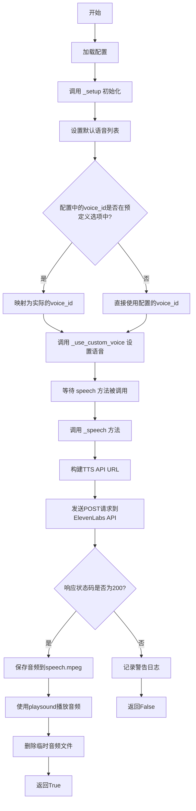
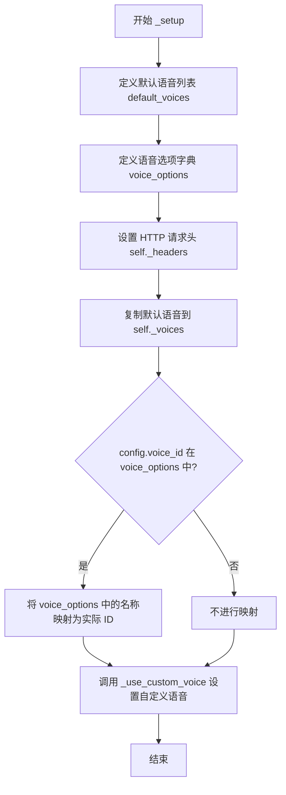
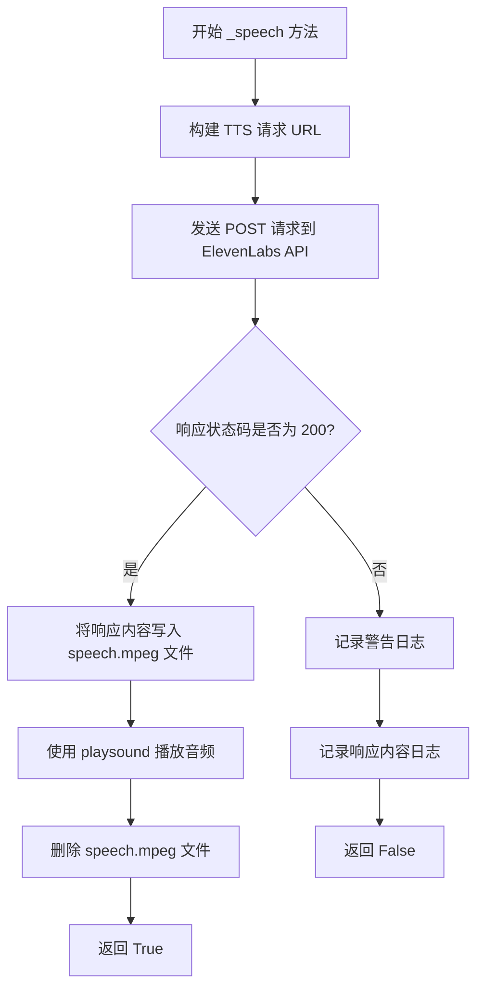

# `.\AutoGPT\classic\forge\forge\speech\eleven_labs.py` 详细设计文档

该模块实现了ElevenLabs文本转语音服务，通过调用ElevenLabs API将文本转换为语音并使用playsound库播放，同时支持自定义语音ID配置。

## 整体流程



## 类结构

```
VoiceBase (抽象基类)
└── ElevenLabsSpeech (ElevenLabs语音实现类)
    └── ElevenLabsConfig (配置类)
```

## 全局变量及字段


### `PLACEHOLDERS`
    
占位符集合，包含'your-voice-id'，用于判断是否使用自定义语音

类型：`set`
    


### `logger`
    
模块级别的日志记录器

类型：`logging.Logger`
    


### `ElevenLabsConfig.api_key`
    
ElevenLabs API密钥，从环境变量ELEVENLABS_API_KEY读取

类型：`str`
    


### `ElevenLabsConfig.voice_id`
    
语音ID，从环境变量ELEVENLABS_VOICE_ID读取

类型：`str`
    


### `ElevenLabsSpeech._headers`
    
HTTP请求头，包含Content-Type和xi-api-key

类型：`dict`
    


### `ElevenLabsSpeech._voices`
    
可用的语音ID列表

类型：`list`
    
    

## 全局函数及方法


### `ElevenLabsSpeech._setup`

该方法用于初始化ElevenLabs语音配置，加载默认语音列表和自定义语音设置，并配置API请求头。

参数：

- `config`：`ElevenLabsConfig`，包含API密钥和语音ID的配置对象

返回值：`None`，该方法不返回任何值，仅执行初始化操作

#### 流程图



#### 带注释源码

```python
def _setup(self, config: ElevenLabsConfig) -> None:
    """Set up the voices, API key, etc.

    Returns:
        None: None
    """
    # 定义默认语音ID列表，这些是ElevenLabs提供的预设语音
    default_voices = ["ErXwobaYiN019PkySvjV", "EXAVITQu4vr4xnSDxMaL"]
    
    # 定义语音名称到ID的映射字典，便于用户通过名称选择语音
    voice_options = {
        "Rachel": "21m00Tcm4TlvDq8ikWAM",
        "Domi": "AZnzlk1XvdvUeBnXmlld",
        "Bella": "EXAVITQu4vr4xnSDxMaL",
        "Antoni": "ErXwobaYiN019PkySvjV",
        "Elli": "MF3mGyEYCl7XYWbV9V6O",
        "Josh": "TxGEqnHWrfWFTfGW9XjX",
        "Arnold": "VR6AewLTigWG4xSOukaG",
        "Adam": "pNInz6obpgDQGcFmaJgB",
        "Sam": "yoZ06aMxZJJ28mfd3POQ",
    }
    
    # 设置HTTP请求头，包含内容类型和ElevenLabs API密钥
    self._headers = {
        "Content-Type": "application/json",
        "xi-api-key": config.api_key,
    }
    
    # 复制默认语音列表到实例变量，后续可被自定义语音覆盖
    self._voices = default_voices.copy()
    
    # 如果用户提供的voice_id是语音名称（在voice_options中），
    # 则将其转换为实际的语音ID
    if config.voice_id in voice_options:
        config.voice_id = voice_options[config.voice_id]
    
    # 调用内部方法设置自定义语音（如果提供且不是占位符）
    self._use_custom_voice(config.voice_id, 0)
```


### `ElevenLabsSpeech._use_custom_voice`

设置自定义语音ID，如果提供的语音ID有效且不是占位符，则将其更新到内部语音列表的指定索引位置。

参数：

- `voice`：`str`，要设置的自定义语音ID
- `voice_index`：`int`，要更新的语音列表索引位置

返回值：`None`，无返回值

#### 流程图

```mermaid
flowchart TD
    A[开始 _use_custom_voice] --> B{voice 是否存在且非空?}
    B -->|否| C[不做任何操作]
    B --> D{voice 是否不在 PLACEHOLDERS 中?}
    D -->|否| C
    D -->|是| E[将 voice 赋值给 self._voices[voice_index]]
    E --> F[结束]
    C --> F
```

#### 带注释源码

```python
def _use_custom_voice(self, voice, voice_index) -> None:
    """Use a custom voice if provided and not a placeholder

    Args:
        voice (str): The voice ID
        voice_index (int): The voice index

    Returns:
        None: None
    """
    # Placeholder values that should be treated as empty
    # 检查voice是否存在且不是占位符
    if voice and voice not in PLACEHOLDERS:
        # 将有效的自定义语音ID更新到voices列表的指定索引位置
        self._voices[voice_index] = voice
```


### `ElevenLabsSpeech._speech`

该方法通过调用 ElevenLabs 的文本转语音 API，将传入的文本转换为语音并播放，返回请求是否成功。

参数：

- `text`：`str`，要转换为语音的文本内容
- `voice_id`：`int`，可选，要使用的语音索引，默认为 0

返回值：`bool`，如果请求成功返回 `True`，否则返回 `False`

#### 流程图



#### 带注释源码

```python
def _speech(self, text: str, voice_id: int = 0) -> bool:
    """Speak text using elevenlabs.io's API

    Args:
        text (str): The text to speak
        voice_index (int, optional): The voice to use. Defaults to 0.

    Returns:
        bool: True if the request was successful, False otherwise
    """
    # 构建 ElevenLabs TTS API 的请求 URL，使用 voice_id 对应的语音 ID
    tts_url = (
        f"https://api.elevenlabs.io/v1/text-to-speech/{self._voices[voice_id]}"
    )
    # 发送 POST 请求到 ElevenLabs API，传入文本内容
    response = requests.post(tts_url, headers=self._headers, json={"text": text})

    # 检查响应状态码是否为 200（成功）
    if response.status_code == 200:
        # 将返回的音频内容写入 speech.mpeg 文件
        with open("speech.mpeg", "wb") as f:
            f.write(response.content)
        # 使用 playsound 播放音频文件，设置为阻塞模式（True）
        playsound("speech.mpeg", True)
        # 播放完成后删除临时音频文件
        os.remove("speech.mpeg")
        # 返回成功标志
        return True
    else:
        # 记录请求失败的警告日志
        logger.warning("Request failed with status code:", response.status_code)
        # 记录响应内容以便调试
        logger.info("Response content:", response.content)
        # 返回失败标志
        return False
```

## 关键组件


### ElevenLabsConfig 配置类

负责管理ElevenLabs API的认证密钥和语音ID配置，支持从环境变量读取配置值。

### ElevenLabsSpeech 语音合成类

继承自VoiceBase的核心类，负责与ElevenLabs API交互，实现文本到语音的转换和播放功能。

### _setup 初始化方法

设置默认语音列表和可用语音选项，配置API请求头，并将用户指定的语音ID映射为对应的语音标识符。

### _use_custom_voice 自定义语音处理方法

检查提供的语音ID是否为有效值（非空且非占位符），如果有效则替换指定索引位置的语音。

### _speech 语音合成核心方法

构建TTS API请求URL，发送POST请求获取音频数据，将音频保存为临时文件并播放，最后清理临时文件。

### PLACEHOLDERS 占位符集合

定义需要被忽略的语音ID占位符值，用于过滤无效的配置输入。

### 请求头配置 (_headers)

包含Content-Type和xi-api-key，用于API请求的身份验证和内容类型声明。

### voice_options 语音选项映射

预定义的ElevenLabs可用语音ID映射表，将可读的语音名称映射为对应的API语音标识符。


## 问题及建议


### 已知问题

-   **文件命名冲突**：使用硬编码的固定文件名 `"speech.mpeg"`，在多线程或并发调用时会导致文件被覆盖或播放错误音频
-   **资源泄漏风险**：如果 `playsound` 播放失败或程序在播放前中断，临时文件不会被删除，造成文件残留
-   **日志参数格式化错误**：使用 `logger.warning("Request failed with status code:", response.status_code)` 而非 `logger.warning("Request failed with status code: %s", response.status_code)`，导致参数不会正确格式化
-   **类型注解与实现不一致**：`_speech` 方法参数名为 `voice_id: int`，但 docstring 中写的是 `voice_index`，且该参数实际用作列表索引而非语音ID，容易引起混淆
-   **API 错误处理不完善**：仅返回布尔值，调用方无法获知具体错误原因（如配额超限、无效API密钥、网络超时等）
-   **缺少请求超时**：使用 `requests.post` 但未设置 timeout 参数，可能导致请求无限期等待
-   **硬编码配置**：默认语音ID列表、语音选项字典、API端点URL均为硬编码，不利于配置管理
-   **缺少响应验证**：未验证 API 返回的是否为有效的音频数据（如检查 Content-Type 或内容长度）
-   **未使用的常量**：`PLACEHOLDERS` 定义了但实际只用于单点检查，模式不够清晰

### 优化建议

-   使用 `tempfile` 模块生成唯一的临时文件名（如 `tempfile.NamedTemporaryFile(delete=False)`），避免并发冲突，并在播放完成后确保清理
-   使用 Python logging 的格式化语法：`logger.warning("Request failed with status code: %s", response.status_code)`
-   修正参数命名为 `voice_index` 以明确其用途，并更新 docstring 保持一致
-   考虑自定义异常类或返回包含错误信息的字典/对象，替代简单的布尔返回值
-   添加 `timeout` 参数到 `requests.post` 调用，如 `timeout=30`
-   将硬编码的语音ID和URL移至配置类或常量定义，便于维护
-   添加响应体验证：检查 `response.headers.get('Content-Type')` 是否包含 `audio/` 或 `mpeg`
-   使用上下文管理器（`with` 语句）确保文件正确关闭
-   考虑实现音频缓存机制，对于相同文本避免重复调用 API

## 其它


### 设计目标与约束

本模块旨在为语音合成框架提供ElevenLabs TTS服务的集成能力，支持多种预设语音并允许自定义语音ID。设计约束包括：仅支持Python 3.x环境，需配置有效的ElevenLabs API密钥，语音文件暂存为临时文件且使用后立即删除，API响应超时等网络问题需妥善处理。

### 错误处理与异常设计

API请求失败时返回False并记录警告日志，包括状态码和响应内容；网络异常由requests库自动抛出异常；文件IO操作可能抛出PermissionError或OSError；配置缺失时UserConfigurable会从环境变量读取，缺失时可能引发KeyError或使用默认值；所有异常通过logger记录而非抛出，确保主流程不受影响。

### 数据流与状态机

数据流：用户调用_speech(text, voice_id) → 构建TTS API URL → 发送POST请求 → 接收音频响应(MP3) → 写入临时文件speech.mpeg → 调用playsound播放 → 删除临时文件 → 返回布尔值。状态机主要包括：初始化状态(_setup完成) → 就绪状态(可调用_speech) → 播放中状态 → 播放完成返回就绪状态。

### 外部依赖与接口契约

核心依赖包括：requests库用于HTTP请求，playsound库用于音频播放，os库用于文件操作。接口契约：VoiceBase基类定义_speech(text, voice_id)方法需返回bool类型；ElevenLabsConfig继承SystemConfiguration提供api_key和voice_id配置；_setup(config)方法由框架在初始化时调用；配置文件需包含有效的ElevenLabs API密钥(环境变量ELEVENLABS_API_KEY)和可选的voice_id(环境变量ELEVENLABS_VOICE_ID)。

### 安全性考虑

API密钥通过环境变量ELEVENLABS_API_KEY获取，避免硬编码；请求头中包含xi-api-key需妥善保管；临时文件使用固定名称speech.mpeg存在多进程冲突风险；未对用户输入text进行长度限制，可能导致API请求过大；错误日志可能泄露敏感响应内容。

### 性能考虑

每次调用都会创建和删除临时文件，频繁调用时IO开销较大；音频播放为同步阻塞操作，影响响应速度；未实现音频缓存机制，相同文本重复请求浪费API配额；requests会话未复用，频繁请求时连接建立开销较高；未设置请求超时，可能导致长时间阻塞。

### 配置管理

通过ElevenLabsConfig类管理配置，支持从环境变量加载；api_key为必填配置项；voice_id支持两种模式：直接使用ElevenLabs提供的语音ID或使用友好名称(如"Rachel", "Domi")自动映射到对应ID；默认语音列表包含2个预设声音，支持通过config.voice_id覆盖默认语音；PLACEHOLDERS集合用于标识需忽略的占位符值。

### 测试策略

单元测试建议：测试_setup方法正确初始化_headers和_voices；测试_use_custom_voice对有效/无效voice的处理；测试_speech方法在成功/失败响应时的行为；测试配置加载逻辑。集成测试建议：测试实际API调用(需mock或使用测试密钥)；测试音频播放功能；测试错误场景处理。Mock策略：可mock requests.post返回不同状态码；mock playsound避免实际播放；mock os.remove处理文件删除失败场景。

### 部署注意事项

部署时需确保环境变量ELEVENLABS_API_KEY已正确配置；临时文件目录需有写权限；音频播放依赖系统音频驱动；建议在容器化环境中测试playsound兼容性；生产环境建议增加请求重试机制和超时设置；考虑实现音频缓存减少API调用成本。

### 版本兼容性

代码标注from __future__ import annotations支持Python 3.7+类型提示；依赖库版本要求：requests>=2.25.0, playsound>=1.2.0；未使用Python 4.x新特性，向后兼容性好；VoiceBase基类接口需保持稳定确保子类兼容。


    