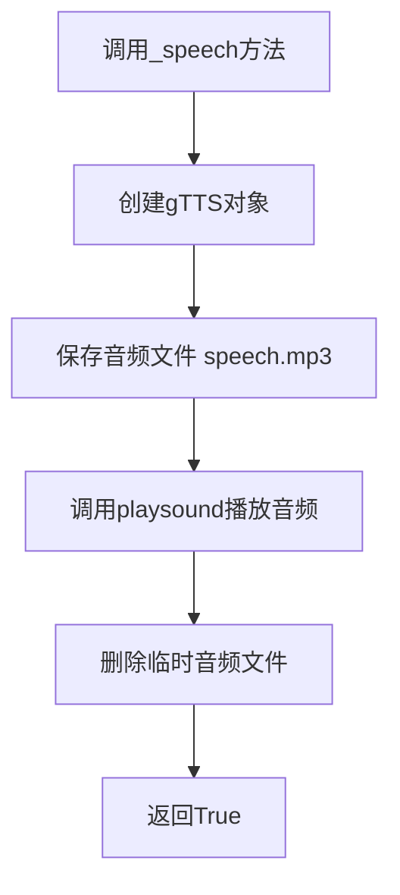
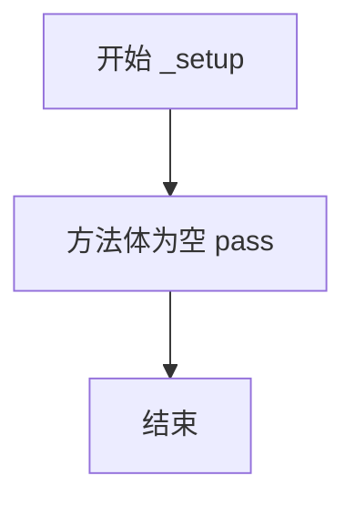
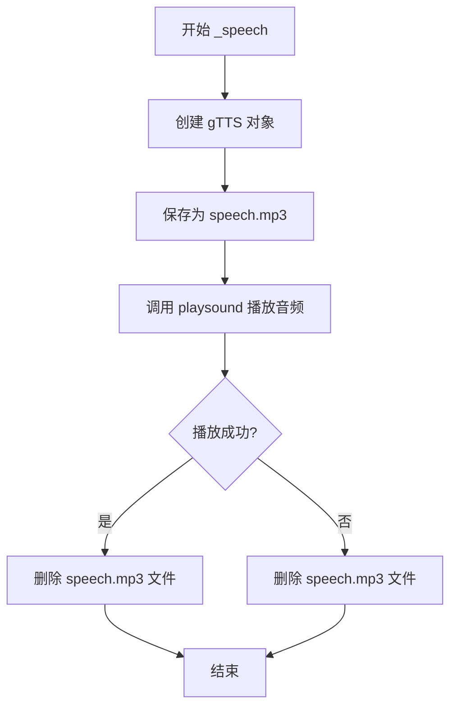
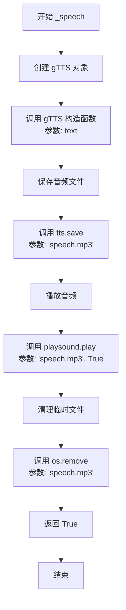

# `.\AutoGPT\classic\forge\forge\speech\gtts.py` 详细设计文档

GTTSVoice类实现了文本转语音功能，通过Google TTS服务将输入的文本转换为语音并使用playsound库播放生成的音频文件。

## 整体流程



## 类结构

```
VoiceBase (抽象基类)
└── GTTSVoice (GTTS语音实现类)
```

## 全局变量及字段


    

## 全局函数及方法


### `GTTSVoice._setup`

该方法是GTTSVoice类的初始化设置方法，用于在语音合成前执行必要的准备工作（如初始化依赖、加载配置等）。当前实现为空（pass），是一个预留的扩展点。

参数：

- `self`：`GTTSVoice`，隐式参数，表示类的实例本身

返回值：`None`，无返回值

#### 流程图



#### 带注释源码

```python
def _setup(self) -> None:
    """
    执行语音合成前的初始化设置工作。
    
    该方法在类实例化后、首次语音合成前被调用，
    可用于加载配置、检查依赖、初始化资源等。
    
    当前实现为空（pass），作为预留的扩展点。
    """
    pass
```


### `GTTSVoice._speech`

使用 Google TTS (gTTS) 将文本转换为语音并播放，生成临时音频文件后调用 playsound 播放，最后清理临时文件。

参数：

- `text`：`str`，需要转换为语音的文本内容
- `voice_id`：`int`，语音ID（当前版本中未使用，保留以支持未来多语音功能），默认值为 `0`

返回值：`bool`，表示语音是否成功播放（当前始终返回 `True`）

#### 流程图



#### 带注释源码

```python
def _speech(self, text: str, voice_id: int = 0) -> bool:
    """Play the given text."""
    # 使用 gtts 库创建 gTTS 对象，将文本转换为语音
    tts = gtts.gTTS(text)
    
    # 将生成的语音保存为临时 MP3 文件
    tts.save("speech.mp3")
    
    # 调用 playsound 播放生成的语音文件
    # 第二个参数 True 表示同步播放（等待播放完成）
    playsound("speech.mp3", True)
    
    # 播放完成后删除临时文件，释放磁盘空间
    os.remove("speech.mp3")
    
    # 返回 True 表示播放成功
    return True
```


### `GTTSVoice._setup`

GTTS语音模块的初始化设置方法，当前为空实现，可能用于后续扩展或资源预加载。

参数：
- `self`：`VoiceBase`，当前类实例本身，代表GTTSVoice对象

返回值：`None`，该方法不返回任何值

#### 流程图


#### 带注释源码

```python
def _setup(self) -> None:
    """GTTS语音模块的初始化设置。
    
    该方法继承自VoiceBase基类，在GTTSVoice中暂时未实现具体逻辑，
    预留作为后续初始化操作（如缓存清理、配置加载等）的扩展接口。
    """
    pass
```


### `GTTSVoice._speech`

该方法接收文本内容和语音ID，使用Google Text-to-Speech (gTTS)将文本转换为语音并播放，同时清理临时音频文件，返回操作是否成功。

参数：

- `text`：`str`，要转换并播放的文本内容
- `voice_id`：`int`，语音标识符（默认为0，当前实现中未使用）

返回值：`bool`，表示语音播放是否成功完成

#### 流程图



#### 带注释源码

```python
def _speech(self, text: str, voice_id: int = 0) -> bool:
    """Play the given text.
    
    使用 Google Text-to-Speech (gTTS) 服务将文本转换为语音并播放。
    
    Args:
        text: 要转换为语音的文本内容
        voice_id: 语音标识符（当前版本未使用，保留用于未来扩展）
    
    Returns:
        bool: 语音播放成功返回 True
    """
    # 创建 gTTS 对象，将输入文本转换为语音
    tts = gtts.gTTS(text)
    
    # 将生成的语音保存为 MP3 文件
    tts.save("speech.mp3")
    
    # 播放生成的语音文件
    # 第二个参数 True 表示同步播放（等待播放完成后返回）
    playsound("speech.mp3", True)
    
    # 删除临时生成的语音文件，释放磁盘空间
    os.remove("speech.mp3")
    
    # 返回成功状态
    return True
```

## 关键组件


### GTTSVoice 类

Google Text-to-Speech 语音合成实现类，继承自 VoiceBase 基类，负责将文本内容通过 gtts 库转换为语音并使用 playsound 库播放音频。

### _speech 方法

核心语音播放方法，接收文本和语音 ID 参数，调用 gtts.gTTS 将文本转换为语音并保存为 MP3 文件，然后使用 playsound 播放音频，最后删除临时 MP3 文件。

### gtts.gTTS 外部依赖

Google Text-to-Speech 官方 Python 库，用于将文本转换为语音音频流，是本模块的核心依赖。

### playsound 音频播放

第三方音频播放库，负责播放生成的 MP3 音频文件，支持阻塞模式播放。

### 临时文件管理机制

通过 os.remove 自动清理生成的 speech.mp3 临时文件，避免磁盘空间泄漏。


## 问题及建议


### 已知问题

-   **文件路径硬编码**：使用固定文件名 "speech.mp3"，在多线程或并发调用场景下会产生文件冲突，导致音频播放异常或文件被意外覆盖
-   **资源清理不完善**：若 `playsound()` 抛出异常，`os.remove("speech.mp3")` 不会执行，导致临时音频文件残留磁盘
-   **缺乏异常处理**：`_speech()` 方法未对 `gtts.gTTS()`、`tts.save()` 和 `playsound()` 可能抛出的异常进行捕获，网络异常、音频设备错误等会导致程序崩溃
-   **参数 `voice_id` 未使用**：方法签名包含 `voice_id` 参数，但实际未对该参数进行任何处理，造成接口语义不清晰
-   **同步阻塞**：语音生成和播放均为同步操作，会阻塞调用线程，影响用户体验
-   **缺少配置灵活性**：无法设置 GTTS 的语言、语速等参数，播放参数（如阻塞模式）也硬编码

### 优化建议

-   **使用临时文件或内存流**：采用 `tempfile` 模块生成唯一临时文件，或使用 `io.BytesIO` 内存流，避免并发冲突
-   **使用 try-finally 或上下文管理器**：确保临时文件在任何情况下都能被清理
-   **添加异常处理**：对网络请求、文件 IO、音频播放等可能失败的操作进行 try-except 包装，返回 `False` 表示失败而非总是返回 `True`
-   **移除未使用参数或实现功能**：若暂不支持多语音 ID，选择在文档中说明或在未来版本实现
-   **考虑异步实现**：可提供异步版本方法，使用 `asyncio` 或线程池执行语音生成和播放，避免阻塞主线程
-   **增强配置能力**：在类初始化或 `_setup()` 中接受语言、语速等参数，传递给 `gtts.gTTS()` 的对应参数

## 其它


### 设计目标与约束

**设计目标**：
- 实现文本到语音的转换和播放功能
- 提供统一的语音接口，继承自VoiceBase基类
- 支持不同语音ID的切换（虽然当前版本未完全实现）

**约束**：
- 依赖外部TTS服务（Google GTTS）
- 需要网络连接才能进行语音合成
- 生成的音频文件为MP3格式
- 播放完成后立即删除临时文件

### 错误处理与异常设计

**异常类型**：
- `gtts.gTTS` 可能抛出网络相关异常（如无网络连接、API超时）
- `playsound` 可能抛出音频播放异常（如音频设备不可用）
- `os.remove` 可能抛出文件操作异常（如文件被占用或不存在）

**处理策略**：
- 当前实现无显式异常处理，异常将直接向上传播
- 建议在调用层捕获异常并提供用户友好的错误提示
- `_speech`方法返回`bool`类型，但未区分成功与失败状态

### 数据流与状态机

**数据流**：
1. 输入：文本字符串（text）和语音ID（voice_id）
2. 处理：gtts.gTTS生成MP3文件 → playsound播放 → os.remove清理
3. 输出：布尔值表示执行状态

**状态转换**：
- 初始状态 → 合成中（gtts.gTTS） → 播放中（playsound） → 完成（返回True）
- 任意步骤异常 → 错误状态（异常传播）

### 外部依赖与接口契约

**依赖库**：
- `gtts`：Google Text-to-Speech API客户端
- `playsound`：跨平台音频播放库
- `os`：Python标准库，用于文件操作

**接口契约**：
- 继承自`VoiceBase`类
- 必须实现`_setup()`和`_speech(text, voice_id)`方法
- `_speech`方法接收字符串文本和整数语音ID，返回布尔值
- 语音ID参数当前未被使用（设计缺陷）

### 性能考虑

**当前问题**：
- 每次调用都创建和删除临时文件，I/O开销较大
- 语音合成依赖网络，网络延迟影响响应时间
- 同步阻塞播放，函数在播放完成前不会返回

**优化建议**：
- 可考虑添加音频缓存机制，避免重复合成相同文本
- 可添加异步播放支持
- 临时文件可使用内存缓冲区（BytesIO）减少磁盘I/O

### 安全性考虑

**潜在风险**：
- 临时文件"speech.mp3"使用固定名称，存在文件覆盖风险
- 无异常处理时，异常信息可能暴露敏感系统路径
- 网络请求无超时设置，可能导致永久阻塞

**建议**：
- 使用唯一临时文件名（如UUID）
- 添加网络请求超时配置
- 记录安全日志时避免泄露敏感信息

### 配置管理

**当前配置**：
- 硬编码输出文件名："speech.mp3"
- 硬编码播放阻塞参数：True

**建议**：
- 将输出路径、文件名模板、超时时间等提取为配置项
- 可通过构造函数或配置文件传入

### 测试策略

**测试覆盖**：
- 单元测试：测试_speech方法的基本调用流程
- 集成测试：测试与gtts和playsound的交互
- 边界测试：空文本、超长文本、无网络等场景

**当前问题**：
- 依赖外部API和网络，不易进行离线单元测试
- 无mock或打桩机制

### 兼容性考虑

**Python版本**：
- 使用`from __future__ import annotations`，支持Python 3.7+

**平台兼容性**：
- `gtts`和`playsound`均支持多平台（Windows、macOS、Linux）
- 需确保系统音频设备可用

**库版本兼容性**：
- 无版本约束声明
- 建议添加最低版本要求

### 资源管理

**当前资源管理**：
- 临时文件在播放后删除，但若异常发生在playsound之前，文件不会被清理
- 无上下文管理器支持

**改进建议**：
- 使用try-finally确保临时文件清理
- 实现__enter__和__exit__方法支持上下文管理器

### 日志记录

**当前状态**：
- 无任何日志记录

**建议添加**：
- 记录语音合成开始和结束
- 记录播放状态和时长
- 记录异常信息和堆栈

### 版本兼容性

**Python兼容性**：
- 代码使用类型注解（annotations），需要Python 3.7+
- 使用`from __future__ import annotations`确保向后兼容

**依赖库兼容性**：
- gtts和playsound需单独测试各版本兼容性
- 建议锁定最低兼容版本


    