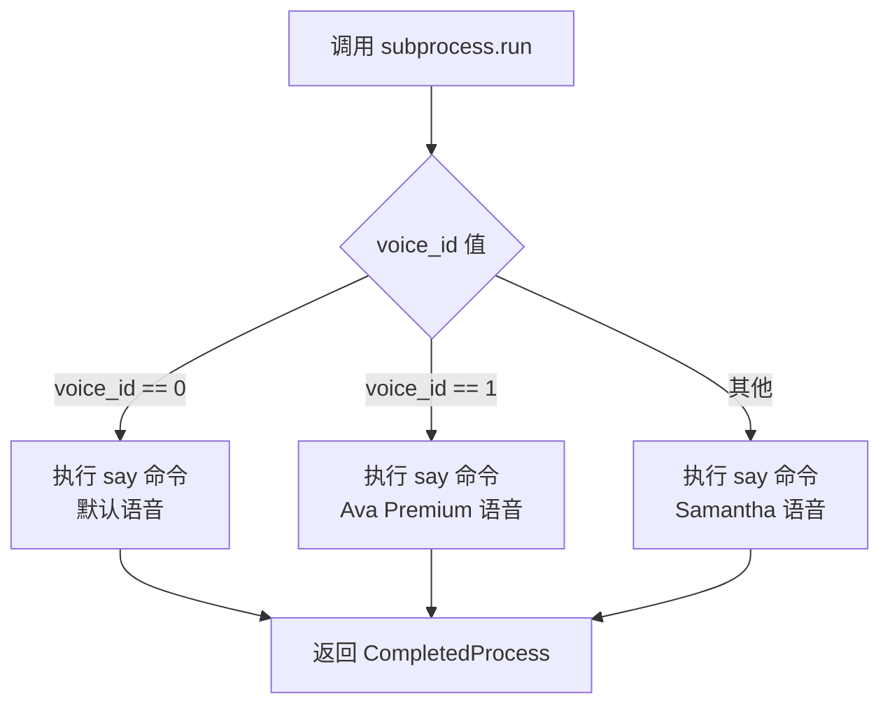
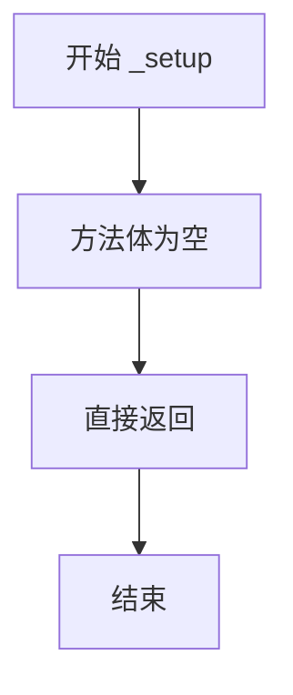

# `.\AutoGPT\classic\forge\forge\speech\macos_tts.py` 详细设计文档

该模块实现了 MacOS 平台的文本转语音（TTS）功能，通过调用系统内置的 say 命令行工具，根据不同的语音ID选择不同的语音角色进行语音播放。

## 整体流程

```mermaid
graph TD
    A[开始] --> B[初始化 MacOSTTS 实例]
    B --> C[调用 _speech 方法]
    C --> D{voice_id == 0?}
    D -- 是 --> E[执行 say 命令（默认语音）]
    D -- 否 --> F{voice_id == 1?}
    F -- 是 --> G[执行 say -v Ava (Premium) 命令]
    F -- 否 --> H[执行 say -v Samantha 命令]
    E --> I[返回 True]
    G --> I
    H --> I
```

## 类结构

```
VoiceBase (抽象基类)
└── MacOSTTS (MacOS TTS 实现类)
```

## 全局变量及字段


    

## 全局函数及方法


### `subprocess.run`

`subprocess.run` 是 Python 标准库中的全局函数，用于执行外部命令。在本代码中用于调用 MacOS 的 `say` 命令实现文本转语音功能。

参数：

- `args`：列表（List[str]），命令及参数列表，如 `["say", text]` 或 `["say", "-v", "voice_name", text]`
- `shell`：布尔值（bool），是否通过 shell 执行，代码中固定为 `False`

返回值：`subprocess.CompletedProcess`，执行完成后的返回对象，包含返回码等信息。在本代码中未捕获该返回值。

#### 流程图



#### 带注释源码

```python
# 调用 subprocess.run 的第一种情况：使用默认语音
# 参数 args: ["say", text] - say 命令 + 要朗读的文本
# 参数 shell: False - 不使用 shell 直接执行命令
subprocess.run(["say", text], shell=False)

# 调用 subprocess.run 的第二种情况：使用 Ava Premium 语音
# 参数 args: ["say", "-v", "Ava (Premium)", text]
#   - "-v" 指定 voice 参数
#   - "Ava (Premium)" 是语音名称
# 参数 shell: False - 不使用 shell 直接执行命令
subprocess.run(["say", "-v", "Ava (Premium)", text], shell=False)

# 调用 subprocess.run 的第三种情况：使用 Samantha 语音
# 参数 args: ["say", "-v", "Samantha", text]
#   - "-v" 指定 voice 参数
#   - "Samantha" 是语音名称
# 参数 shell: False - 不使用 shell 直接执行命令
subprocess.run(["say", "-v", "Samantha", text], shell=False)
```


### `MacOSTTS._setup`

该方法为MacOSTTS类的初始化设置方法，目前为空实现，用于完成TTS语音引擎的初始化配置工作。

参数：

- 无参数

返回值：`None`，该方法不返回任何值，仅执行初始化逻辑

#### 流程图



#### 带注释源码

```python
def _setup(self) -> None:
    """
    初始化设置方法。
    
    该方法用于执行MacOSTTS语音引擎的初始化配置工作。
    当前版本为空实现（pass），表示暂无特殊的初始化需求。
    
    参数:
        无
    
    返回值:
        None
    """
    pass  # TODO: 实现具体的初始化逻辑，如加载语音配置、检查系统环境等
```


### `MacOSTTS._speech`

使用 macOS 内置的 `say` 命令根据指定的 `voice_id` 播放传入的文本内容。

参数：

-  `text`：`str`，需要转换为语音的文本内容。
-  `voice_id`：`int`，语音标识符（默认为 0）。0 代表默认语音，1 代表 "Ava (Premium)" 语音，其他值代表 "Samantha" 语音。

返回值：`bool`，表示语音播放命令是否成功执行（此处始终返回 `True`）。

#### 流程图

```mermaid
graph TD
    A([开始 _speech]) --> B{voice_id == 0?}
    B -- 是 --> C[执行 say 命令<br>使用默认语音]
    B -- 否 --> D{voice_id == 1?}
    D -- 是 --> E[执行 say 命令<br>使用语音 'Ava (Premium)']
    D -- 否 --> F[执行 say 命令<br>使用语音 'Samantha']
    C --> G[返回 True]
    E --> G
    F --> G
```

#### 带注释源码

```python
def _speech(self, text: str, voice_id: int = 0) -> bool:
    """Play the given text."""
    # 如果 voice_id 为 0，使用系统默认语音
    if voice_id == 0:
        subprocess.run(["say", text], shell=False)
    # 如果 voice_id 为 1，使用 Premium 语音 Ava
    elif voice_id == 1:
        subprocess.run(["say", "-v", "Ava (Premium)", text], shell=False)
    # 其他情况，默认使用 Samantha 语音
    else:
        subprocess.run(["say", "-v", "Samantha", text], shell=False)
    # 假设命令执行成功，返回 True
    return True
```

## 关键组件


### MacOSTTS 类

MacOS TTS语音类，继承自VoiceBase，通过调用系统say命令实现文本转语音功能，支持三种语音模式切换。

### VoiceBase 抽象基类

项目定义的TTS语音抽象基类，规定接口规范，子类需实现_setup()和_speech()方法。

### _setup() 方法

初始化方法，当前实现为空（pass），为未来扩展预留的钩子方法。

### _speech() 方法

核心语音播放方法，接收文本和语音ID参数，根据voice_id选择不同语音（默认、Ava Premium、Samantha），通过subprocess调用MacOS系统say命令执行语音合成。

### subprocess 模块

Python标准库模块，用于执行外部系统命令（say），实现跨平台系统调用能力。

### voice_id 参数

整数类型语音标识符，用于控制TTS语音类型：0为默认语音，1为Ava Premium女声，其他值为Samantha女声。

### say 命令

MacOS系统内置文本转语音命令，通过-v参数可指定具体语音类型，实现零依赖的TTS能力。


## 问题及建议


### 已知问题

-   **Magic Number问题**：voice_id使用硬编码的整数(0, 1, 2)作为枚举值，缺乏可读性，应使用枚举或常量类定义
-   **缺乏错误处理**：subprocess.run()调用未捕获任何异常，若say命令执行失败（如系统不支持、无权限等），程序会直接崩溃
-   **无执行结果验证**：方法始终返回True，无法判断语音实际是否播放成功，调用方无法获知真实执行状态
-   **无超时控制**：subprocess.run()未设置timeout参数，进程可能无限期阻塞
-   **无日志记录**：缺少日志输出，线上环境难以追踪问题
-   **_setup方法为空**：继承自VoiceBase但_setup实现为空，可能违反里氏替换原则，若基类要求子类必须实现具体逻辑则存在问题

### 优化建议

-   引入Enum或常量类定义voice_id，如`VoiceEnum = Enum('VoiceEnum', 'Default Premium Samantha')`，提升代码可维护性
-   添加try-except捕获CalledProcessError和FileNotFoundError等异常，并返回False或抛出自定义异常
-   使用subprocess.run()的capture_output=True捕获stderr，判断执行是否成功并返回对应状态码
-   添加timeout参数，建议默认5-10秒，避免进程挂起
-   引入logging模块记录关键操作日志，如voice_id选择、命令执行结果等
-   检查MacOS say命令可用性，在_setup中进行预检查并缓存结果
-   考虑使用subprocess.Popen提供更精细的进程控制（如实时输出、取消播放等）


## 其它


### 设计目标与约束

本模块旨在为MacOS系统提供文本转语音功能，利用系统内置的say命令实现语音播放。设计约束包括：仅支持MacOS系统运行，需要系统安装say命令，不支持自定义语音语速和音调调节，语音输出为同步阻塞操作。

### 错误处理与异常设计

subprocess.run调用可能抛出FileNotFoundError（say命令不存在）、PermissionError（执行权限不足）、CalledProcessError（命令执行失败）等异常。当前实现未对这些异常进行捕获处理，建议增加try-except块并返回False或抛出自定义异常。voice_id参数未进行边界验证，可能导致不可预期的语音输出。

### 数据流与状态机

输入文本经过_speech方法处理后，通过subprocess调用系统say命令转换为语音输出。模块无状态机设计，不存在状态转换。数据流为：调用方 -> _speech(text, voice_id) -> subprocess.run -> 系统say命令 -> 音频输出。

### 外部依赖与接口契约

外部依赖包括subprocess模块（标准库）和系统say命令（MacOS内置）。接口契约：_speech方法接收text字符串和voice_id整数参数，返回布尔值表示执行是否成功。当voice_id为0时使用默认语音，为1时使用Ava Premium语音，其他值使用Samantha语音。

### 安全性考虑

text参数未进行输入验证和清洗，可能存在命令注入风险（尽管shell=False提供了保护）。建议对超长文本进行截断处理，避免资源耗尽。voice_id参数应限制在合理范围内。

### 性能考虑

当前实现为同步阻塞调用，语音播放期间会阻塞当前线程。大文本内容时语音合成耗时较长。建议考虑异步实现或使用队列机制。subprocess每次调用都会启动新进程，存在进程创建开销。

### 兼容性考虑

本模块仅兼容MacOS 10.5及以上版本（say命令内置）。不同MacOS版本内置语音可能存在差异，voice_id对应的语音在不同系统上可能不可用。建议添加语音可用性检测机制。

### 测试策略

建议测试场景包括：正常文本转语音、不同voice_id参数切换、异常输入处理（空文本、超长文本）、say命令不可用时的错误处理、不同MacOS版本的兼容性测试。

### 配置管理

当前voice_id与语音的映射关系硬编码在代码中。建议提取为配置文件或枚举类型，便于扩展更多语音选项。语音参数（如语速、音调）目前不支持配置。

    