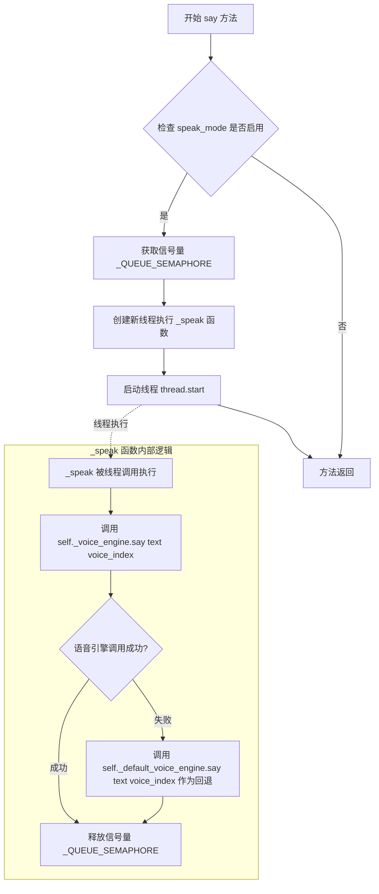

# `.\AutoGPT\classic\forge\forge\speech\say.py` 详细设计文档

一个文本转语音(TTS)模块，支持多种TTS提供商(elevenlabs、gtts、macos、streamelements)，通过配置选择语音引擎，并提供语音合成功能

## 整体流程

```mermaid
graph TD
    A[开始] --> B[初始化TextToSpeechProvider]
    B --> C[调用_get_voice_engine获取语音引擎]
    C --> D{provider类型}
    D -->|elevenlabs| E[创建ElevenLabsSpeech]
    D -->|macos| F[创建MacOSTTS]
    D -->|streamelements| G[创建StreamElementsSpeech]
    D -->|其他| H[创建GTTSVoice]
    E --> I[返回(default_voice_engine, voice_engine)]
    F --> I
    G --> I
    H --> I
    J[say方法调用] --> K{speak_mode?}
    K -->|是| L[获取信号量]
    K -->|否| M[直接执行_speak]
    L --> N[创建新线程执行_speak]
    N --> O[调用voice_engine.say]
    O --> P{成功?}
    P -->|是| Q[完成]
    P -->|否| R[调用default_voice_engine.say]
    R --> Q
    Q --> S[释放信号量]
```

## 类结构

```
VoiceBase (抽象基类)
├── GTTSVoice
├── MacOSTTS
├── ElevenLabsSpeech
└── StreamElementsSpeech

TTSConfig (配置类)
└── SystemConfiguration

TextToSpeechProvider (主提供者类)
```

## 全局变量及字段


### `_QUEUE_SEMAPHORE`
    
信号量，控制并发语音队列数量，初始值为1

类型：`Semaphore`
    


### `TTSConfig.speak_mode`
    
是否开启说话模式

类型：`bool`
    


### `TTSConfig.elevenlabs`
    
ElevenLabs提供商配置

类型：`Optional[ElevenLabsConfig]`
    


### `TTSConfig.streamelements`
    
StreamElements提供商配置

类型：`Optional[StreamElementsConfig]`
    


### `TTSConfig.provider`
    
TTS提供商选择(elevenlabs/gtts/macos/streamelements)

类型：`Literal["elevenlabs", "gtts", "macos", "streamelements"]`
    


### `TextToSpeechProvider._config`
    
TTS配置对象

类型：`TTSConfig`
    


### `TextToSpeechProvider._default_voice_engine`
    
默认语音引擎(GTTSVoice)

类型：`VoiceBase`
    


### `TextToSpeechProvider._voice_engine`
    
当前选定的语音引擎

类型：`VoiceBase`
    
    

## 全局函数及方法


### `TextToSpeechProvider.__init__`

初始化 TextToSpeechProvider 实例，接收 TTS 配置对象，保存配置并根据配置中的 `provider` 字段动态选择并实例化对应的语音引擎（当前引擎与备用默认引擎）。

参数：

- `self`：`TextToSpeechProvider`，类的实例本身。
- `config`：`TTSConfig`，包含 TTS 提供商配置（如选择哪个引擎、API 密钥等）的配置对象。

返回值：`None`，构造函数无返回值。

#### 流程图

```mermaid
flowchart TD
    A[Start __init__] --> B[Input: config: TTSConfig]
    B --> C[Save config: self._config = config]
    C --> D[Call static method: _get_voice_engine]
    D --> E[Logic: Check config.provider and instantiate engine]
    E --> F[Return: tuple(default_engine, current_engine)]
    F --> G[Unpack: self._default_voice_engine = default]
    G --> H[Unpack: self._voice_engine = current]
    H --> I[End]
```

#### 带注释源码

```python
def __init__(self, config: TTSConfig):
    # 1. 将传入的 TTS 配置对象保存为实例属性，供后续 say 方法使用
    self._config = config
    
    # 2. 调用静态方法获取语音引擎。
    # 该方法返回一个元组：(默认引擎对象, 当前选中的引擎对象)
    # 这里利用 Python 的元组解包同时初始化两个引擎属性
    self._default_voice_engine, self._voice_engine = self._get_voice_engine(config)
```


### `TextToSpeechProvider.say`

该方法执行文本转语音功能。当 speak_mode 启用时，通过获取信号量来控制并发，使用独立线程调用语音引擎合成语音；若语音引擎调用失败，则回退使用默认语音引擎。

参数：

- `self`：`TextToSpeechProvider` 实例，当前对象自身
- `text`：任意类型，要转换为语音的文本内容（具体类型在代码中未显式声明，根据调用上下文推断为字符串）
- `voice_index`：`int`，默认值为 `0`，指定要使用的语音索引

返回值：`None`，无返回值

#### 流程图



#### 带注释源码

```python
def say(self, text, voice_index: int = 0) -> None:
    """执行文本转语音输出

    参数:
        text: 要转换为语音的文本内容
        voice_index: 语音索引，默认为 0
    """

    # 定义内部函数 _speak，用于在独立线程中执行语音合成
    def _speak() -> None:
        # 调用当前配置的语音引擎进行语音合成
        success = self._voice_engine.say(text, voice_index)
        
        # 如果当前语音引擎调用失败，回退使用默认语音引擎
        if not success:
            self._default_voice_engine.say(text, voice_index)
        
        # 释放信号量，允许下一个语音请求执行
        _QUEUE_SEMAPHORE.release()

    # 检查配置中的 speak_mode 是否启用
    if self._config.speak_mode:
        # 获取信号量，如果已达到并发限制则阻塞当前线程
        # 信号量初始值为 1，确保同时只有一个语音请求在处理
        _QUEUE_SEMAPHORE.acquire(True)
        
        # 创建新线程执行语音合成任务，避免阻塞主线程
        thread = threading.Thread(target=_speak)
        thread.start()
```


### `TextToSpeechProvider.__repr__`

该方法返回 `TextToSpeechProvider` 类的字符串表示形式，包含类名和当前使用的语音引擎类别名称，用于调试和日志输出。

参数：

- `self`：`TextToSpeechProvider` 实例，当前对象本身

返回值：`str`，返回类的字符串表示，格式为 `TextToSpeechProvider(provider={voice_engine_name})`，其中 `{voice_engine_name}` 是当前语音引擎的类名

#### 流程图

```mermaid
flowchart TD
    A[开始 __repr__] --> B[获取类名: self.__class__.__name__]
    B --> C[获取语音引擎类名: self._voice_engine.__class__.__name__]
    C --> D[格式化字符串: {class_name}(provider={voice_engine_name})]
    D --> E[返回格式化后的字符串]
    E --> F[结束]
```

#### 带注释源码

```python
def __repr__(self):
    """
    返回对象的字符串表示形式
    
    Returns:
        str: 包含类名和语音引擎类名的字符串，格式如 'TextToSpeechProvider(provider=GTTSVoice)'
    """
    # 使用字符串格式化方法构建表示字符串
    # class_name: 获取当前类的名称，通常为 'TextToSpeechProvider'
    # voice_engine_name: 获取当前语音引擎实例的类名，如 'GTTSVoice'、'ElevenLabsSpeech' 等
    return "{class_name}(provider={voice_engine_name})".format(
        class_name=self.__class__.__name__,              # 动态获取类名，支持子类继承
        voice_engine_name=self._voice_engine.__class__.__name__,  # 获取当前使用的语音引擎类名
    )
```


### `TextToSpeechProvider._get_voice_engine`

这是一个静态方法，用于根据传入的 `TTSConfig` 配置对象实例化对应的语音引擎。它读取配置中的 `provider` 字段，选择并创建相应的语音处理类实例（ElevenLabs、MacOS、StreamElements 或 GTTS），并返回一个包含默认回退引擎和当前激活引擎的元组。

参数：
-  `config`：`TTSConfig`，包含 TTS 提供者的选择逻辑及提供者所需的配置信息（如 API Key）。

返回值：`tuple[VoiceBase, VoiceBase]`，返回两个语音引擎实例。元组第一个元素是固定的默认回退引擎 `GTTSVoice`（用于在主引擎失败时重试），第二个元素是根据配置选中的活跃引擎。

#### 流程图

```mermaid
flowchart TD
    A([开始 _get_voice_engine]) --> B[获取配置中的 provider]
    B --> C{provider == 'elevenlabs'?}
    C -->|是| D[voice_engine = ElevenLabsSpeech]
    C -->|否| E{provider == 'macos'?}
    E -->|是| F[voice_engine = MacOSTTS]
    E -->|否| G{provider == 'streamelements'?}
    G -->|是| H[voice_engine = StreamElementsSpeech]
    G -->|否| I[voice_engine = GTTSVoice]
    D --> J[返回 tuple(GTTSVoice(), voice_engine)]
    F --> J
    H --> J
    I --> J
```

#### 带注释源码

```python
@staticmethod
def _get_voice_engine(config: TTSConfig) -> tuple[VoiceBase, VoiceBase]:
    """根据配置获取语音引擎"""
    tts_provider = config.provider
    # 根据 provider 类型实例化对应的语音引擎
    if tts_provider == "elevenlabs":
        voice_engine = ElevenLabsSpeech(config.elevenlabs)
    elif tts_provider == "macos":
        voice_engine = MacOSTTS()
    elif tts_provider == "streamelements":
        voice_engine = StreamElementsSpeech(config.streamelements)
    else:
        # 默认使用 Google TTS
        voice_engine = GTTSVoice()

    # 返回元组：第一个为默认回退引擎(GTTS)，第二个为当前选中的引擎
    return GTTSVoice(), voice_engine
```

## 关键组件


### TTSConfig

配置类，管理系统级TTS配置，包括语音模式开关、各提供商配置以及当前使用的TTS引擎类型

### TextToSpeechProvider

核心TTS提供者类，负责协调不同语音引擎，根据配置选择合适的TTS实现，支持语音播放的线程管理和信号量控制

### _QUEUE_SEMAPHORE

全局信号量，控制并发语音播放数量，当前设置为1，即同时只能播放一个语音，起到阻塞主线程的作用

### VoiceBase

语音引擎基类，定义TTS引擎的统一接口规范，所有具体语音引擎实现需继承此类

### ElevenLabsSpeech

ElevenLabs TTS引擎实现，调用ElevenLabs API进行语音合成，支持自定义配置

### GTTSVoice

Google TTS引擎实现，使用Google Translate服务进行语音合成，作为默认语音引擎

### MacOSTTS

macOS系统原生TTS引擎实现，调用系统AVFoundation框架进行语音合成

### StreamElementsSpeech

StreamElements TTS引擎实现，支持StreamElements平台的语音合成功能

### say 方法

异步语音播放方法，通过线程执行实际语音输出，失败时自动降级到默认引擎

### _get_voice_engine 静态方法

根据配置动态选择语音引擎的工厂方法，支持四种TTS提供商的无缝切换

## 问题及建议


### 已知问题

- **全局信号量设计缺陷**：`_QUEUE_SEMAPHORE` 是模块级全局变量且初始值为1，导致所有 `TextToSpeechProvider` 实例共享同一信号量，这限制了多实例场景下的并发能力，且信号量初始化逻辑（值为1）在 `say` 方法中先 `acquire(True)` 再 `release`，实际上变成了同步执行而非真正的异步队列
- **`_get_voice_engine` 方法逻辑错误**：方法始终返回 `GTTSVoice()` 作为默认语音引擎，无论选择了哪个 provider，这会导致当主语音引擎失败时，回退到的仍是 `GTTSVoice` 而非对应 provider 的实现，造成功能退化
- **配置参数空值风险**：在 `_get_voice_engine` 中，直接将 `config.elevenlabs`、`config.streamelements` 传递给对应的语音实现类，但这些配置对象在 `TTSConfig` 中定义为 `Optional`，若为 `None` 则可能导致运行时错误
- **缺少线程管理**：创建的 `threading.Thread` 未设置 `daemon=True`，且没有提供等待线程完成的机制，可能导致程序退出时语音播放被中断，且线程异常会被吞噬
- **环境变量解析过于复杂**：`provider` 的 `from_env` 逻辑包含5层嵌套的 `or` 表达式，优先级判断与字符串字面量定义不一致（如 "macos" 对应 `USE_MAC_OS_TTS` 环境变量，但 provider 本身不是 "macos"），维护困难且容易出错
- **类型注解不完整**：`say` 方法的 `text` 参数缺少类型注解，配置类的 `provider` 字段使用了 `type: ignore` 忽略类型检查

### 优化建议

- 将信号量改为类实例属性或使用线程安全的队列（`queue.Queue`），并根据实际需求设置合理的并发限制
- 修复 `_get_voice_engine` 的回退逻辑，使其返回对应 provider 的语音引擎实例或提供明确的错误处理
- 在调用语音引擎前添加空值检查，或在配置类中确保 required 字段不为 None
- 为线程设置 `daemon=True` 或提供 `join()` 方法以支持优雅退出
- 将环境变量解析逻辑提取为独立的配置辅助方法或使用配置验证器
- 补充缺失的类型注解并移除 `type: ignore` 注释
- 考虑实现上下文管理器（`__enter__`/`__exit__`）以支持资源清理

## 其它


### 设计目标与约束

本模块的设计目标是提供一个统一的文本转语音（Text-to-Speech, TTS）接口，支持多种TTS提供商（ElevenLabs、GTTS、MacOS、StreamElements），并通过配置动态选择使用的语音引擎。核心约束包括：1）必须继承SystemConfiguration以支持系统配置管理；2）使用Semaphore限制并发队列长度为1，防止主线程阻塞；3）提供商选择优先级为环境变量配置或默认值gtts；4）当主语音引擎失败时，自动回退到默认语音引擎。

### 错误处理与异常设计

错误处理采用隐式静默失败模式：当语音引擎say()方法返回False时，自动切换到默认语音引擎GTTSVoice重试。_QUEUE_SEMAPHORE使用阻塞模式获取（acquire(True)），若获取失败会导致线程永久阻塞。配置对象config.provider通过Literal类型约束为预定义字符串，外部传入非法值会触发类型检查错误。当前未对网络异常、API配额限制、音频合成失败等场景进行显式异常捕获与重试机制设计。

### 数据流与状态机

数据流路径为：用户调用say(text, voice_index) → 检查speak_mode标志 → 获取信号量 → 创建后台线程 → 调用语音引擎say() → 成功则释放信号量，失败则回退到默认引擎。状态机包含两种状态：speak_mode=False时直接跳过不执行；speak_mode=True时进入信号量控制的发声流程。信号量初始值为1，每调用一次say()需要先获取（减至0则阻塞），执行完毕后释放（恢复至1）。

### 外部依赖与接口契约

外部依赖包括：1）forge.models.config中的SystemConfiguration和UserConfigurable，用于配置管理；2）base模块中的VoiceBase抽象基类，定义语音引擎接口；3）各语音引擎实现类（ElevenLabsSpeech、GTTSVoice、MacOSTTS、StreamElementsSpeech）；4）threading和Semaphore标准库用于并发控制。接口契约方面：VoiceBase.say(text, voice_index)方法必须返回布尔值表示成功/失败；TTSConfig.provider必须为Literal["elevenlabs", "gtts", "macos", "streamelements"]类型；TextToSpeechProvider.say()方法返回None（副作用型方法）。

### 线程安全与并发模型

使用threading.Thread创建后台线程执行语音合成，主线程通过Semaphore(1)控制最多同时存在一个待处理语音请求。当speak_mode为True时，每次say()调用会尝试获取信号量，若已有未完成语音则阻塞等待。该设计确保语音请求串行执行，避免多个语音同时播放导致的混乱，但也会造成高频率调用时的排队延迟。注意信号量在_speak()内部释放而非线程启动时释放，确保资源正确归还。

### 配置优先级与环境变量映射

配置优先级顺序为：显式赋值 > 环境变量 > 默认值。provider字段支持从环境变量TEXT_TO_SPEECH_PROVIDER读取，若未设置则按优先级回退：USE_MAC_OS_TTS→macos、ELEVENLABS_API_KEY→elevenlabs、USE_BRIAN_TTS→streamelements、否则默认gtts。elevenlabs和streamelements的配置对象为可选（Optional），当未选择对应提供商时可为None，避免不必要的配置初始化。

### 潜在改进建议

1. 增加显式异常处理：对网络超时、API错误码、音频格式错误等情况进行捕获并记录日志；2. 添加超时机制：为Semaphore.acquire()设置超时参数，避免永久阻塞风险；3. 支持异步非阻塞模式：当前同步等待模式不适合实时对话场景；4. 增加语音引擎健康检查：启动时验证API凭证有效性；5. 支持语音参数配置：语速、音调、音量等参数当前硬编码或未暴露；6. 信号量初始值可配置：当前写死为1，无法支持并发播放多段语音；7. 添加单元测试覆盖：当前代码缺少对回退逻辑、信号量行为的测试用例。

    