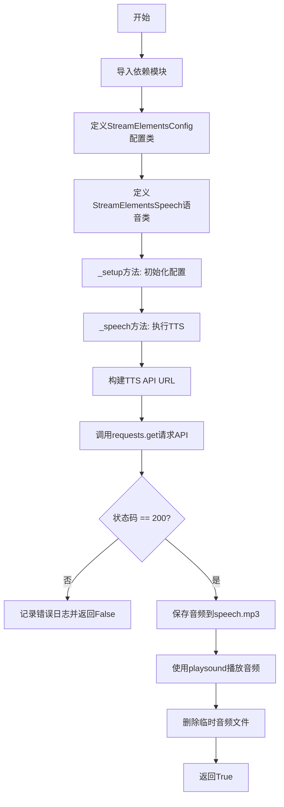
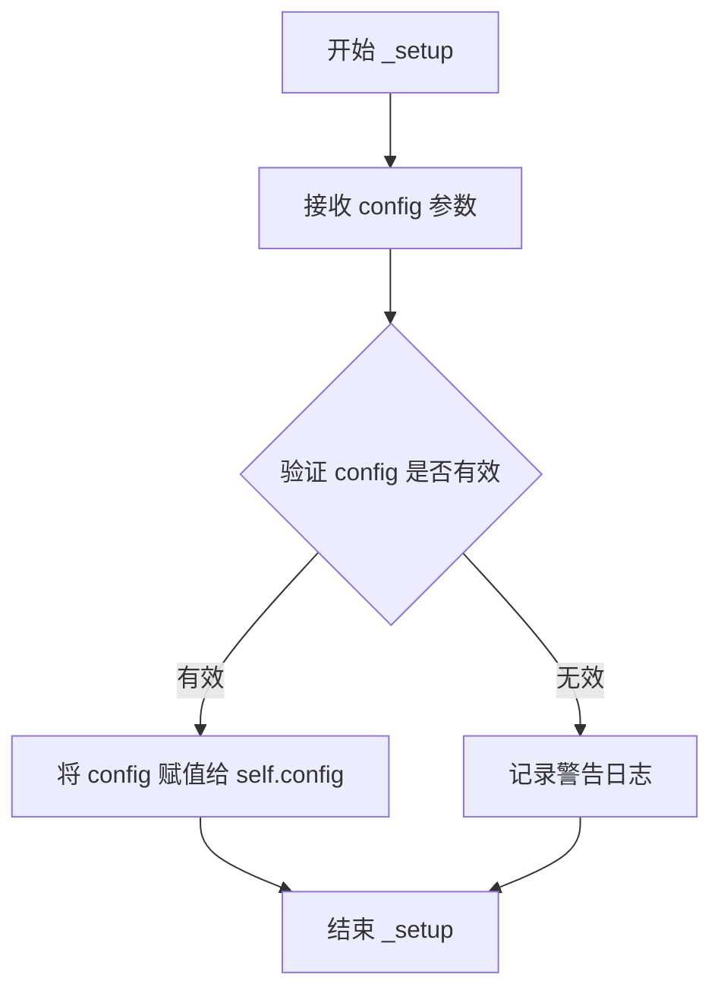
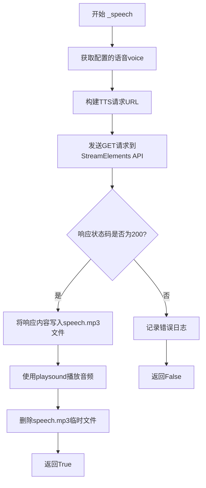

# `.\AutoGPT\classic\forge\forge\speech\stream_elements_speech.py` 详细设计文档

该模块是AutoGPT Forge的StreamElements语音合成组件，通过调用StreamElements TTS API将文本转换为语音，并使用playsound库播放生成的音频文件，同时提供可配置的语音选项和环境变量支持。

## 整体流程



## 类结构

```
VoiceBase (抽象基类)
└── StreamElementsSpeech (StreamElements语音实现)

SystemConfiguration (配置基类)
└── StreamElementsConfig (StreamElements配置类)
```

## 全局变量及字段


### `logger`
    
模块级日志记录器

类型：`logging.Logger`
    


### `StreamElementsConfig.voice`
    
语音名称，可从环境变量STREAMELEMENTS_VOICE读取，默认Brian

类型：`str`
    


### `StreamElementsSpeech.config`
    
StreamElements配置对象

类型：`StreamElementsConfig`
    
    

## 全局函数及方法


### `StreamElementsSpeech._setup`

初始化 StreamElements 语音模块的配置，将传入的 StreamElementsConfig 配置对象存储到实例属性中，供后续语音合成操作使用。

参数：

- `config`：`StreamElementsConfig`，包含 StreamElements 语音服务的配置信息，如语音类型等

返回值：`None`，该方法仅执行配置初始化操作，无返回值

#### 流程图



#### 带注释源码

```python
def _setup(self, config: StreamElementsConfig) -> None:
    """Setup the voices, API key, etc."""
    # 将传入的 StreamElementsConfig 配置对象存储到实例的 self.config 属性中
    # 后续的 _speech 方法会通过 self.config.voice 获取语音配置
    self.config = config
```


### `StreamElementsSpeech._speech`

执行文本转语音并播放的核心方法，通过调用 StreamElements TTS API 将文本转换为语音并播放。

参数：

- `text`：`str`，要转换为语音的文本内容
- `voice_id`：`int`，语音ID（当前实现中未使用，保留此参数以保持接口一致性）

返回值：`bool`，请求成功返回 True，失败返回 False

#### 流程图



#### 带注释源码

```python
def _speech(self, text: str, voice_id: int = 0) -> bool:
    """Speak text using the streamelements API

    Args:
        text (str): The text to speak
        voice (str): The voice to use

    Returns:
        bool: True if the request was successful, False otherwise
    """
    # 从配置中获取语音名称
    voice = self.config.voice
    
    # 构建StreamElements TTS API的请求URL
    # 使用query参数传递文本和语音配置
    tts_url = (
        f"https://api.streamelements.com/kappa/v2/speech?voice={voice}&text={text}"
    )
    
    # 发送HTTP GET请求获取TTS音频数据
    # 注意：未设置超时，可能导致请求长时间阻塞
    response = requests.get(tts_url)

    # 检查HTTP响应状态码
    if response.status_code == 200:
        # 将二进制音频数据写入临时MP3文件
        # 注意：硬编码文件名，在并发场景下可能产生文件冲突
        with open("speech.mp3", "wb") as f:
            f.write(response.content)
        
        # 使用playsound库播放音频文件
        playsound("speech.mp3")
        
        # 播放完成后删除临时文件以释放磁盘空间
        # 注意：如果播放过程中发生异常，文件可能不会被删除
        os.remove("speech.mp3")
        return True
    else:
        # 请求失败时记录错误日志，包含状态码和响应内容
        logger.error(
            "Request failed with status code: %s, response content: %s",
            response.status_code,
            response.content,
        )
        return False
```

---

### 补充信息

#### 潜在的技术债务或优化空间

1. **硬编码文件名**：`"speech.mp3"` 是硬编码的临时文件名，在多线程/多实例环境下可能产生文件冲突
2. **未使用的参数**：`voice_id` 参数在实现中未被使用，但保留在接口中，可能造成接口语义不清晰
3. **缺少请求超时**：未对 `requests.get()` 设置 timeout，可能导致网络问题时长时间阻塞
4. **异常处理不足**：文件操作和播放过程缺少异常捕获，可能导致程序崩溃
5. **资源泄漏风险**：如果 `playsound()` 抛出异常，`speech.mp3` 文件将不会被删除

#### 其它项目

- **错误处理**：依赖HTTP状态码判断成功，使用日志记录失败原因
- **外部依赖**：依赖 `requests` 库进行HTTP请求，`playsound` 库进行音频播放
- **接口契约**：返回布尔值表示成功/失败，失败时通过日志输出详细信息

## 关键组件


### StreamElementsConfig

Configuration class that holds the StreamElements TTS voice setting, using the SystemConfiguration base and UserConfigurable for environment variable support (STREAMELEMENTS_VOICE).

### StreamElementsSpeech

Main speech synthesis class that extends VoiceBase, providing text-to-speech functionality through the StreamElements API.

### _setup(config: StreamElementsConfig) -> None

Initialization method that stores the configuration object for later use in speech synthesis.

### _speech(text: str, voice_id: int = 0) -> bool

Core TTS method that sends text to StreamElements API, receives audio, plays it, and cleans up temporary files. Returns boolean indicating success or failure.

### API Integration (requests.get)

HTTP GET request to StreamElements TTS endpoint with voice and text parameters.

### Audio Playback (playsound)

Plays the downloaded MP3 audio file to the user.

### File Management (temp file I/O)

Creates temporary speech.mp3 file for audio data, then deletes it after playback to clean up resources.

### Error Handling & Logging

Logs errors with status code and response content when API requests fail.


## 问题及建议


### 已知问题

-   **硬编码文件名**: 使用固定的 `speech.mp3` 文件名，在并发场景下可能导致文件冲突或被覆盖
-   **未使用的参数**: `voice_id` 参数在函数签名中定义但未被使用
-   **资源泄漏风险**: 如果 `playsound` 抛出异常，`speech.mp3` 文件将不会被删除
-   **缺少网络异常处理**: 仅处理了 HTTP 状态码，未捕获 `requests.get` 可能抛出的网络异常（如连接超时、DNS 解析失败等）
-   **缺乏超时设置**: API 请求没有设置超时，可能导致程序无限期阻塞
-   **响应内容未验证**: 未检查 `response.content` 是否为空或有效
-   **同步阻塞调用**: `playsound` 是同步阻塞调用，影响整体响应速度

### 优化建议

-   使用 `tempfile` 模块生成唯一临时文件，避免并发冲突，并在使用后确保清理
-   实现 `try-finally` 块或上下文管理器确保文件始终被删除
-   添加 `requests.get` 的异常捕获（`requests.RequestException`），并设置合理的 `timeout` 参数
-   如果 `voice_id` 无需支持，可从函数签名中移除以保持代码整洁
-   添加重试机制处理临时性网络故障
-   验证响应内容大小或添加校验和检查，确保音频数据有效
-   考虑使用异步音频播放库（如 `aio playsound` 或线程池）提升性能

## 其它


### 设计目标与约束

该模块旨在为 AutoGPT Forge 提供基于 StreamElements TTS API 的语音合成功能，使框架能够在需要时将文本转换为语音并直接播放。核心约束包括：仅支持同步调用（调用方会阻塞至语音播放完成），依赖外部 StreamElements API 的可用性，音频格式限定为 MP3，临时文件在当前工作目录生成且使用固定文件名 speech.mp3，配置项仅提供 voice 参数且默认值为 "Brian"。

### 错误处理与异常设计

- **请求错误**：若 HTTP 响应状态码非 200，记录错误日志并返回 `False`。目前未捕获 `requests` 抛出的网络异常（如超时、DNS 错误），建议在后续迭代中加入重试机制或统一异常捕获。  
- **文件 I/O 错误**：写文件、删除文件时可能抛出 `IOError` 或 `OSError`，当前实现未显式捕获，建议增加异常处理以防止残留临时文件。  
- **播放错误**：`playsound` 可能因音频解码或系统音频设备问题抛出异常，同样需要捕获并记录日志。  
- **返回值语义**：`True` 表示成功合成并播放，`False` 表示任意一步失败，调用方依据返回值决定后续行为。

### 数据流与状态机

1. **入口**：`StreamElementsSpeech._speech(text, voice_id)` 被外部调用。  
2. **构造请求**：依据 `text` 与配置的 `voice` 拼接完整的 TTS URL。  
3. **发起请求**：使用 `requests.get` 向 StreamElements API 发送 GET 请求。  
4. **响应处理**：若状态码为 200，将二进制内容写入本地临时文件 `speech.mp3`；否则记录错误并直接返回 `False`。  
5. **播放音频**：调用 `playsound("spepeech.mp3")` 阻塞播放。  
6. **清理**：播放完毕后删除临时文件 `speech.mp3`。  
7. **返回**：成功返回 `True`，失败返回 `False`。  

该过程为线性状态机，无分支或循环，状态转换唯一。

### 外部依赖与接口契约

- **依赖库**：`requests`（HTTP 客户端），`playsound`（音频播放），`os`（文件操作），`logging`（日志）。  
- **配置模型**：`StreamElementsConfig` 继承 `SystemConfiguration`，提供 `voice` 配置项，可通过构造函数或环境变量 `STREAMELEMENTS_VOICE` 注入。  
- **基类接口**：`VoiceBase` 定义 `_setup(config)` 与 `_speech(text, voice_id)` 两个抽象方法，子类必须实现。`StreamElementsSpeech` 严格遵循该接口契约。  
- **外部服务**：StreamElements TTS API（`https://api.streamelements.com/kappa/v2/speech`），要求网络可达且返回 MP3 音频流。

### 性能考虑

- **临时文件**：每次调用都会在磁盘写入、读取、删除约 1–2 MB 的 MP3，频繁调用会产生磁盘 I/O 开销。可改为使用内存中的 `BytesIO` 直接传递给 `playsound`（若库支持），或使用流式播放库。  
- **同步阻塞**：`playsound` 为同步调用，会阻塞调用线程。若需要并发语音播放，需要在独立线程或进程中执行。  
- **网络延迟**：TTS 请求依赖外部 API，响应时间受网络和 StreamElements 服务负载影响，建议加入超时（`requests.get(..., timeout=...)`）并提供用户可配置的超时阈值。

### 安全考虑

- **URL 参数泄露**：`voice` 与 `text` 直接拼接在 URL 中，可能被中间人日志记录。生产环境建议使用 HTTPS 并确认日志级别不记录完整请求。  
- **临时文件冲突**：使用固定文件名 `speech.mp3` 可能导致并发调用时文件被覆盖或删除，建议使用唯一临时文件名（如 `temp_{uuid}.mp3`）或内存流。  
- **音频设备**：播放音频时依赖系统音频输出，若设备不可用会导致异常，需要捕获并给出友好提示。

### 配置管理

- **配置类**：`StreamElementsConfig` 通过 `UserConfigurable` 支持默认值 "Brian"，并支持从环境变量 `STREAMELEMENTS_VOICE` 读取。若需扩展其他参数（如语速、音调），可在该类中继续添加字段。  
- **运行时修改**：配置在 `_setup` 阶段一次性加载，后续调用不涉及动态更新。若需要热更新，可提供 `update_config` 方法或利用配置中心的热加载机制。

### 可测试性

- **单元测试**：可通过 mock `requests.get` 与 `playsound` 来验证逻辑。测试用例应覆盖：成功合成、HTTP 错误、文件写入异常、播放异常、超时等场景。  
- **集成测试**：需要真实的 StreamElements API 密钥（可通过环境变量注入），并确保测试环境能够访问外网。  
- **模拟基类**：`VoiceBase` 可使用 `unittest.mock` 进行子类化或直接实例化测试。

### 部署与运维

- **依赖声明**：在项目的 `requirements.txt` 或 `pyproject.toml` 中明确列出 `requests`、`playsound`、`forge`（内部包）等依赖。  
- **环境变量**：生产部署需配置 `STREAMELEMENTS_VOICE`（若使用非默认值）以及可能的代理、网络策略。  
- **日志**：使用 `logging.getLogger(__name__)` 记录错误日志，日志级别可通过 Python `logging` 配置进行统一管理。建议输出至结构化日志系统以便于监控。

### 扩展性与未来改进

- **异步播放**：引入 `asyncio` 或线程池实现非阻塞语音播放，提升并发处理能力。  
- **多语言/多音色**：在配置中加入音色映射表，支持动态选择不同语言或声音。  
- **本地缓存**：对相同文本的 TTS 请求进行本地缓存（如 MD5(text+voice) 为键），避免重复调用外部 API，节省带宽与费用。  
- **错误恢复**：加入指数退避重试、备用 TTS 供应商（如 Google TTS）以提升容错性。  
- **流式合成**：部分 TTS 提供商支持流式音频返回，可逐步播放而无需等待完整文件。

### 日志与监控

- **日志点**：  
  - `_setup`：记录配置加载完成（debug 级别）。  
  - `_speech`：记录请求 URL（debug，敏感信息需脱敏），请求状态码，错误详情（error 级别）。  
  - 播放成功/失败：记录播放结果（info / error）。  
- **监控指标**：可采集 API 请求成功率、平均响应时长、错误率等指标，集成至 Prometheus 或 Grafana。

### 并发与线程模型

- **当前实现**：单线程同步，调用 `_speech` 会阻塞直至音频播放完毕。若在主事件循环（如 asyncio）中调用，可能导致整体响应延迟。  
- **改进建议**：将播放过程放入后台线程或子进程，使用 `threading.Thread(target=playsound, args=("speech.mp3",)).start()`，并妥善管理线程生命周期，防止资源泄露。

### 依赖管理

- **显式依赖**：`requests>=2.25`、`playsound>=1.2`（具体版本视项目而定），`forge`（内部包）。  
- **冲突检测**：确保 `requests` 与 `playsound` 的依赖不冲突，例如 `playsound` 可能依赖 `pyobjc`（macOS）或 `winsound`（Windows），需在不同平台上做条件依赖。  
- **安全审计**：定期检查依赖库的 CVE，使用 `pip-audit` 或 `safety` 工具。


    