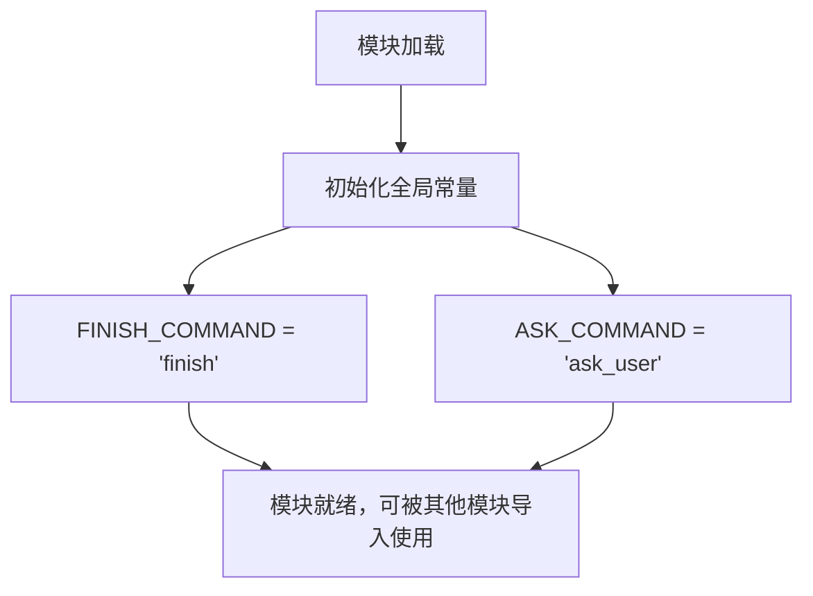

# `.\AutoGPT\classic\forge\forge\utils\const.py` 详细设计文档

该代码定义了两个全局命令常量，用于标识交互式系统中用户命令的类型。FINISH_COMMAND 表示结束命令，ASK_COMMAND 表示请求用户输入的命令。

## 整体流程



## 类结构

```
无类层次结构（纯常量定义模块）
```

## 全局变量及字段


### `FINISH_COMMAND`
    
表示完成指令的字符串常量，用于标识某个操作或流程的结束

类型：`string`
    


### `ASK_COMMAND`
    
表示请求用户输入指令的字符串常量，用于触发用户交互或询问

类型：`string`
    


    

## 全局函数及方法


## 关键组件


### 一段话描述

这段代码定义了两个全局字符串常量，用于标识命令类型，分别表示"完成命令"和"用户询问命令"，作为系统中命令处理的标识符使用。

### 文件的整体运行流程

该模块为初始化配置文件，在程序启动时首先加载两个命令常量，供其他模块在需要执行命令判断或命令分发时引用使用。

### 全局变量详情

#### FINISH_COMMAND
- **类型**: str
- **描述**: 表示完成命令的字符串标识符，用于标记任务完成或流程结束

#### ASK_COMMAND
- **类型**: str
- **描述**: 表示询问用户命令的字符串标识符，用于触发用户交互或请求用户输入

### 关键组件信息

#### 命令常量定义模块
统一管理系统中使用的命令标识符，提供集中式的命令定义，避免硬编码字符串散落在代码各处

#### 命令标识符
系统定义的两种基本命令类型，作为命令模式或状态机中的状态判断依据

### 潜在的技术债务或优化空间

1. **类型安全不足**: 使用字符串常量缺乏类型检查和编译时验证，建议使用枚举类(Enum)替代
2. **缺乏文档**: 未添加模块级文档字符串说明这些常量的使用场景和设计意图
3. **扩展性受限**: 如需新增命令需修改源代码，建议考虑配置文件或数据库存储
4. **类型注解缺失**: 可添加 `from typing import Final` 配合类型提示提高代码可读性

### 其它项目

#### 设计目标与约束
- **设计目标**: 提供统一的命令标识符，避免魔法字符串散落
- **约束**: 保持简单轻量，不引入额外依赖

#### 错误处理与异常设计
当前无错误处理需求，为纯配置定义模块

#### 数据流与状态机
作为命令模式中的命令识别标识，在命令分发器或状态机中作为状态转换的判断依据

#### 外部依赖与接口契约
无外部依赖，仅作为内部配置常量供其他模块导入使用


## 问题及建议


### 已知问题

- 缺乏类型注解，变量类型默认为 `Any` 或隐式推断，降低了代码的可读性和静态分析工具的效能
- 缺少文档字符串或注释说明这两个常量的用途和上下文
- 常量命名虽然使用了全大写（符合 Python 惯例），但缺乏模块级或类级的组织
- 没有定义常量的有效范围或约束，例如是否允许空值等
- 作为全局变量，直接暴露了两个魔法字符串（magic strings），可能导致命名冲突或难以追踪

### 优化建议

- 添加显式类型注解：`FINISH_COMMAND: str = "finish"` 和 `ASK_COMMAND: str = "ask_user"`
- 在模块顶部添加模块级文档字符串，说明该模块的功能和这两个常量的用途
- 如果这些命令在系统中有多处使用，建议封装为枚举类 `Enum`，以提供更好的类型安全和代码提示
- 考虑将相关常量归类到统一的命名空间（如类或专用模块），避免全局污染
- 如有需要，添加简单的运行时验证逻辑（例如检查值不为空）


## 其它


### 设计目标与约束

本代码模块定义了命令字符串常量，用于在命令行交互系统中标识"完成"和"询问用户"两种命令操作。设计目标是为上层业务逻辑提供统一的命令标识符，避免硬编码字符串，提高代码可维护性和可读性。约束条件为仅定义字符串常量，不包含任何业务逻辑。

### 错误处理与异常设计

由于本模块仅包含常量定义，不涉及函数调用或复杂逻辑，暂不需要错误处理机制。但若后续扩展，建议在常量使用处进行空值检查，防止None或空字符串导致的潜在问题。

### 数据流与状态机

本模块作为数据提供者，不涉及数据流处理和状态机设计。FINISH_COMMAND和ASK_COMMAND作为静态字符串常量，被其他模块引用时属于单向数据流动。

### 外部依赖与接口契约

本模块无外部依赖，仅使用Python内置的字符串类型。接口契约方面，其他模块通过导入方式使用这两个常量：
- from constants import FINISH_COMMAND, ASK_COMMAND
- 使用时保持字符串原值，不进行任何转换或修改

### 安全性考虑

当前实现无安全风险，因仅包含公开的字符串常量。如后续扩展需注意：
- 避免在常量中硬编码敏感信息
- 若涉及用户输入验证，应使用白名单机制

### 性能考虑

当前实现性能开销可忽略不计，属于模块加载时的常量绑定操作。如有大量常量定义，建议使用枚举类（Enum）替代，以提高类型安全性和代码组织性。

### 兼容性考虑

本代码兼容Python 3.x全部版本。如需支持Python 2.x，需确认字符串编码处理。当前实现无版本特定依赖。

### 配置说明

本模块无需运行时配置，常量在模块加载时即被定义。如需扩展为可配置形式，可考虑：
- 从配置文件读取命令字符串
- 使用环境变量覆盖默认值
- 实现配置加载和验证逻辑

### 使用示例

```python
# 导入常量
from constants import FINISH_COMMAND, ASK_COMMAND

# 使用示例
def process_command(command):
    if command == FINISH_COMMAND:
        return "任务完成"
    elif command == ASK_COMMAND:
        return "等待用户输入"
    else:
        return "未知命令"

# 测试
print(process_command(FINISH_COMMAND))  # 输出: 任务完成
print(process_command(ASK_COMMAND))      # 输出: 等待用户输入
```

### 版本历史

| 版本 | 日期 | 变更说明 |
|------|------|----------|
| 1.0.0 | 初始版本 | 定义FINISH_COMMAND和ASK_COMMAND两个命令常量 |

    