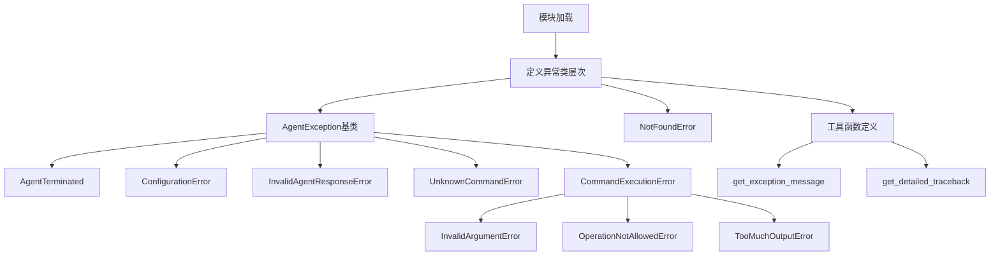
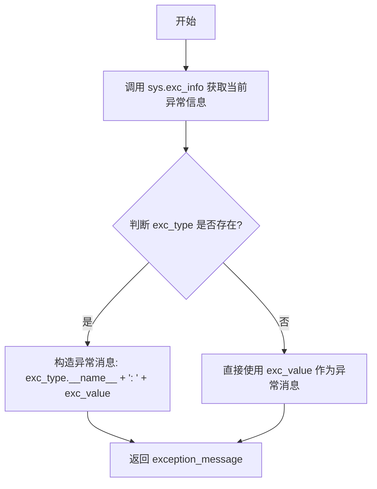
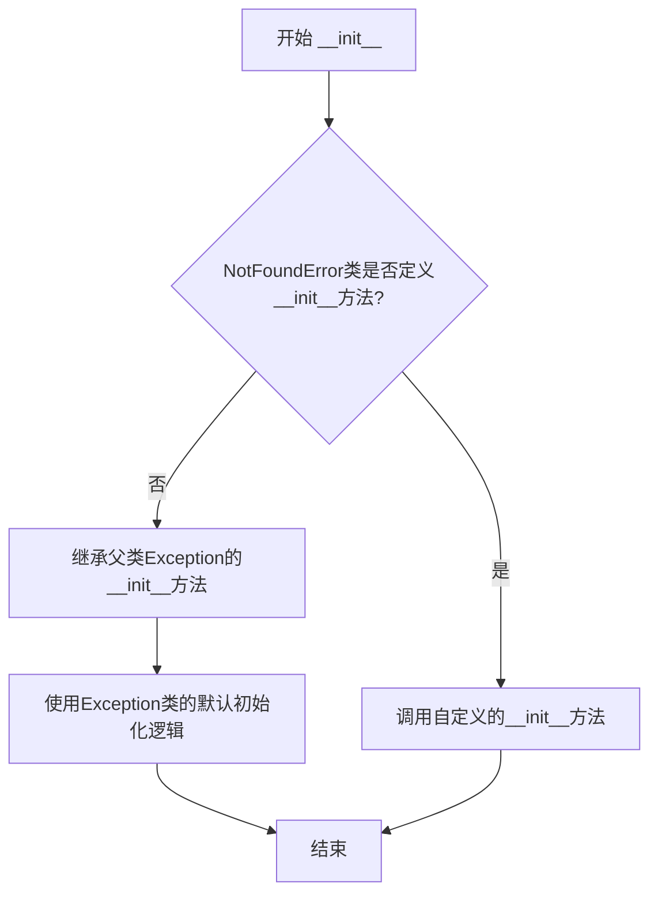
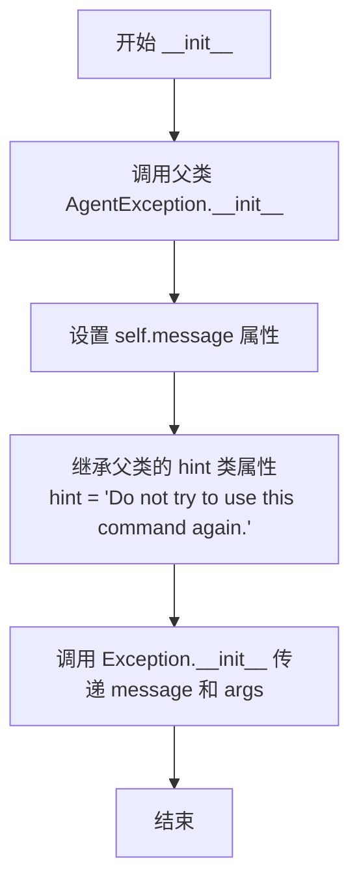
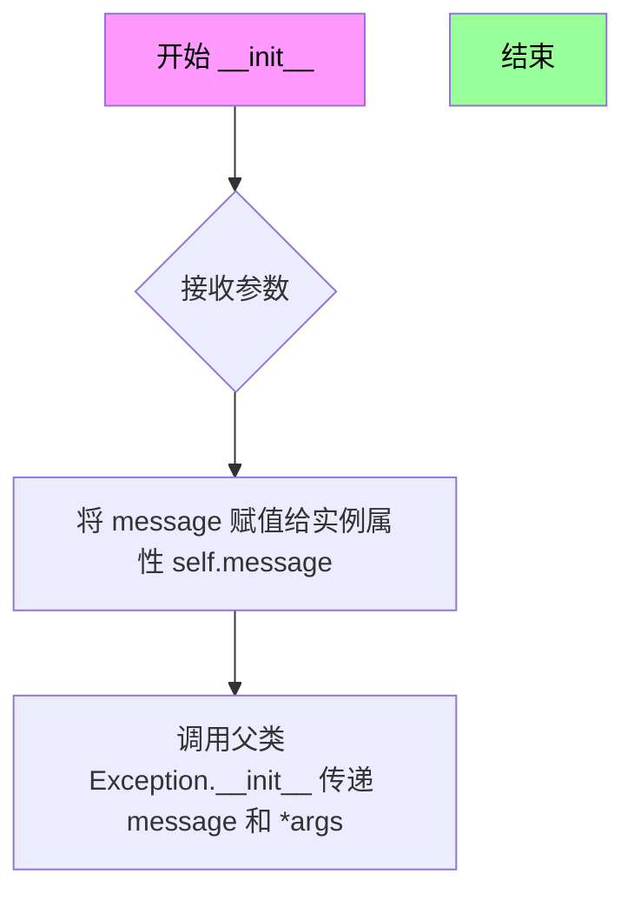
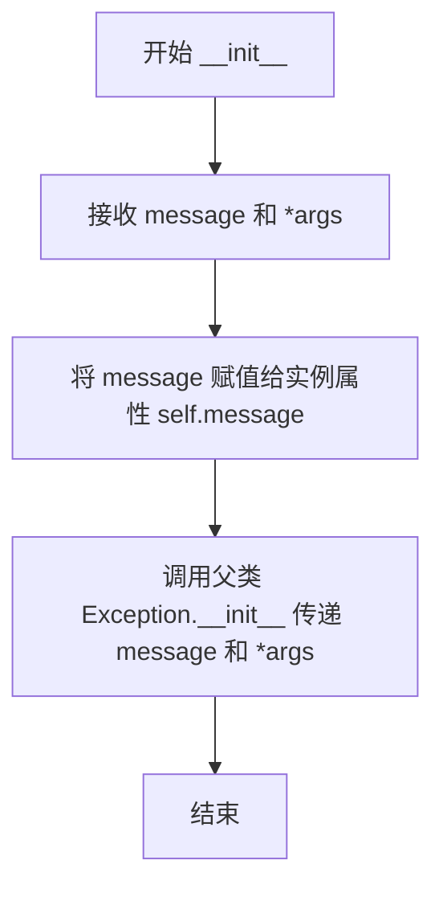

# `.\AutoGPT\classic\forge\forge\utils\exceptions.py` 详细设计文档

该模块定义了Agent框架中使用的自定义异常类层次结构，提供了从基础错误到特定场景错误的完整分类，同时包含两个工具函数用于获取当前异常的简洁消息和详细的堆栈跟踪信息。

## 整体流程



## 类结构

```
Exception (Python内置)
├── NotFoundError
└── AgentException
    ├── AgentTerminated
    │   └── AgentFinished
    ├── ConfigurationError
    ├── InvalidAgentResponseError
    ├── UnknownCommandError
    └── CommandExecutionError
        ├── InvalidArgumentError
        ├── OperationNotAllowedError
        └── TooMuchOutputError
```

## 全局变量及字段


### `AgentException.message`
    
异常的错误消息

类型：`str`
    


### `AgentException.hint`
    
可选的提示信息，用于传递给LLM以减少此类错误再次发生

类型：`Optional[str]`
    


### `UnknownCommandError.hint`
    
提示信息，告知AI不要再次尝试使用此命令

类型：`str`
    
    

## 全局函数及方法


### `get_exception_message`

获取当前异常的 类型和消息信息，并将格式化为字符串返回。

参数：

- （无参数）

返回值：`str`，返回格式为"异常类型: 异常消息"的字符串，如果没有异常类型则只返回异常消息。

#### 流程图



#### 带注释源码

```python
def get_exception_message():
    """Get current exception type and message."""
    # 使用 sys.exc_info() 获取当前正在处理的异常信息
    # 返回值: (exc_type, exc_value, exc_traceback)
    exc_type, exc_value, _ = sys.exc_info()
    
    # 判断是否存在异常类型
    # 如果存在，格式化为 "异常类型名称: 异常值" 的形式
    # 如果不存在（当前没有异常），则直接返回 exc_value（通常为 None）
    exception_message = f"{exc_type.__name__}: {exc_value}" if exc_type else exc_value
    
    # 返回格式化后的异常消息字符串
    return exception_message
```


### `get_detailed_traceback`

获取当前异常的完整追踪信息（包括堆栈帧和局部变量）。

参数： 无

返回值：`str`，返回格式化的异常追踪字符串，包含堆栈信息和每帧的局部变量。

#### 流程图

```mermaid
flowchart TD
    A[开始] --> B[调用 sys.exc_info 获取异常信息]
    B --> C[初始化详细追踪字符串<br/>'Traceback (most recent call last):']
    C --> D[使用 traceback.format_tb 格式化堆栈跟踪]
    D --> E[将格式化后的堆栈信息追加到字符串]
    E --> F[追加 'Local variables by frame, innermost last:' 标题]
    F --> G{检查 exc_tb 是否存在}
    G -->|是| H[获取当前帧的 frame 对象]
    H --> I[获取行号和函数名]
    I --> J[格式化帧信息并追加到字符串]
    J --> K[使用 inspect.getargvalues 获取局部变量]
    K --> L[遍历所有局部变量并追加到字符串]
    L --> M[移动到下一帧 exc_tb.tb_next]
    M --> G
    G -->|否| N[返回详细的追踪字符串]
    N --> O[结束]
```

#### 带注释源码

```python
def get_detailed_traceback():
    """
    获取当前异常追踪的详细信息，包括每个堆栈帧中的局部变量。
    
    Returns:
        str: 包含完整异常堆栈跟踪及局部变量信息的格式化字符串
    """
    # 获取当前异常的详细信息：异常类型、异常值、追踪对象
    _, _, exc_tb = sys.exc_info()
    
    # 初始化追踪信息字符串，添加标题
    detailed_traceback = "Traceback (most recent call last):\n"
    
    # 使用 traceback 模块格式化异常堆栈跟踪为字符串列表
    formatted_tb = traceback.format_tb(exc_tb)
    
    # 将格式化的堆栈信息连接成字符串
    detailed_traceback += "".join(formatted_tb)

    # 添加局部变量信息的标题说明
    detailed_traceback += "\nLocal variables by frame, innermost last:\n"
    
    # 遍历异常追踪链中的所有帧（从内到外）
    while exc_tb:
        # 获取当前帧对象
        frame = exc_tb.tb_frame
        
        # 获取异常发生的行号
        lineno = exc_tb.tb_lineno
        
        # 获取当前帧对应的函数名
        function_name = frame.f_code.co_name

        # 格式化帧信息：函数名、文件名、行号
        detailed_traceback += (
            f"  Frame {function_name} in {frame.f_code.co_filename} at line {lineno}\n"
        )

        # 使用 inspect 模块获取当前帧的局部变量
        local_vars = inspect.getargvalues(frame).locals
        
        # 遍历并格式化所有局部变量
        for var_name, value in local_vars.items():
            # 追加变量名和值的表示到追踪信息中
            detailed_traceback += f"    {var_name} = {value}\n"

        # 移动到追踪链中的下一个帧
        exc_tb = exc_tb.tb_next

    # 返回完整的异常追踪详细信息
    return detailed_traceback
```


### `NotFoundError.__init__`

该方法是 `NotFoundError` 异常的构造函数，用于初始化异常对象。由于 `NotFoundError` 类直接继承自 `Exception` 而未定义自己的 `__init__` 方法，因此它使用 Python 内置 `Exception` 类的默认初始化方法。

参数：

- `*args`：`tuple`，可变参数，用于传递异常的错误消息或其他上下文信息

返回值：`None`，构造函数不返回任何值

#### 流程图



#### 带注释源码

```python
class NotFoundError(Exception):
    pass
    # NotFoundError 类直接继承自 Python 内置的 Exception 类
    # 未定义自己的 __init__ 方法，因此使用父类 Exception 的默认构造函数
    # Exception.__init__ 接受 *args 可变参数，通常第一个参数为错误消息字符串
    # 该异常类通常用于表示资源未找到的错误场景
```

#### 备注

由于 `NotFoundError` 未显式定义 `__init__` 方法，其实际行为完全继承自 `Exception` 基类。在实际使用中，通常通过 `raise NotFoundError("资源未找到")` 的方式抛出该异常。


### AgentException.__init__

初始化 AgentException 异常实例，设置异常消息和可选的提示信息，用于在 Agent 执行过程中报告特定错误。

参数：

- `message`：`str`，异常的具体描述信息
- `*args`：`Any`（可变参数），传递给父类 Exception 的额外参数，用于支持异常链

返回值：`None`，构造函数不返回值，仅初始化对象状态

#### 流程图

```mermaid
flowchart TD
    A[开始 __init__] --> B[接收 message 和 *args]
    B --> C[将 message 赋值给实例属性 self.message]
    D[调用 super().__init__] --> D
    D --> E[将 message 和 *args 传递给父类 Exception.__init__]
    E --> F[结束]
    
    C --> D
```

#### 带注释源码

```python
def __init__(self, message: str, *args):
    """
    初始化 AgentException 异常实例。
    
    参数:
        message: 异常的具体描述信息，用于告知调用者错误原因
        *args: 可变参数，将额外参数传递给父类 Exception，支持异常链和上下文传递
    
    返回值:
        无（构造函数）
    """
    # 将传入的 message 存储为实例属性，供后续获取异常信息使用
    self.message = message
    
    # 调用父类 Exception 的初始化方法，传递消息和额外参数
    # 这确保了异常行为符合 Python 标准异常机制
    super().__init__(message, *args)
```


### `AgentTerminated.__init__`

该方法是 `AgentTerminated` 类的初始化构造函数，继承自 `AgentException` 类，用于初始化异常对象的消息内容。

参数：

- `message`：`str`，异常的具体描述信息
- `*args`：`tuple`，传递给父类 Exception 的额外位置参数

返回值：`None`，无返回值（构造函数）

#### 流程图

```mermaid
flowchart TD
    A[开始 __init__] --> B[将 message 赋值给 self.message]
    --> C[调用 super().__init__message, *args]
    --> D[将 message 和 *args 传递给 Exception 基类]
    --> E[结束]
```

#### 带注释源码

```python
def __init__(self, message: str, *args):
    """
    初始化 AgentTerminated 异常实例。
    
    注意：AgentTerminated 类本身未定义 __init__ 方法，
    因此继承自父类 AgentException 的 __init__ 方法。
    
    参数:
        message: str, 异常的具体描述信息，说明终止原因
        *args: tuple, 传递给父类 Exception 的额外位置参数
    
    返回值:
        None, 构造函数无返回值
    """
    self.message = message  # 将传入的消息存储为实例属性
    super().__init__(message, *args)  # 调用父类 AgentException 的初始化方法，进而调用 Exception 的初始化
```


### `AgentFinished.__init__`

该方法是 `AgentFinished` 类的构造函数，继承自 `AgentException` 基类，用于初始化异常实例并设置错误消息。

参数：

- `self`：`AgentFinished`，类的实例本身
- `message`：`str`，错误消息，描述异常的具体信息
- `*args`：`tuple`，可选参数，用于传递给父类异常构造函数

返回值：`None`，构造函数不返回值

#### 流程图

```mermaid
flowchart TD
    A[开始 __init__] --> B{接收参数}
    B --> C[self.message = message]
    C --> D[super().__init__message<br/>*args]
    D --> E[结束]
    
    style A fill:#f9f,color:#000
    style E fill:#9f9,color:#000
```

#### 带注释源码

```python
class AgentFinished(AgentTerminated):
    """The agent self-terminated"""
    
    # 注意: AgentFinished 类本身没有定义 __init__ 方法
    # 它继承自 AgentTerminated -> AgentException
    # 因此使用的是来自 AgentException 的 __init__ 方法:
    
    def __init__(self, message: str, *args):
        """
        初始化 AgentException 异常实例
        
        参数:
            message: str - 错误消息,描述异常的具体信息
            *args: tuple - 可变参数,传递给父类异常构造函数
        """
        # 将消息存储为实例属性,供后续错误处理使用
        self.message = message
        
        # 调用父类 AgentException 的初始化方法
        # 注意: AgentTerminated 没有自己的 __init__ 
        # 所以 super() 会跳过它直接调用 AgentException
        super().__init__(message, *args)
```

> **说明**: `AgentFinished.__init__` 实际上是继承自 `AgentException` 的实现。由于 Python 的类继承机制，当创建 `AgentFinished` 实例时，会调用继承的 `__init__` 方法，将错误消息存储在实例的 `message` 属性中，并通过 `super()` 调用链传递给最终的基类 `Exception`。


### ConfigurationError.__init__

该方法是 `ConfigurationError` 类的初始化方法，继承自 `AgentException` 基类，用于创建配置错误异常实例。

参数：

- `message`：`str`，错误消息，描述配置错误的具体内容
- `*args`：可变位置参数，用于传递给父类 Exception 的额外参数

返回值：无（`None`），`__init__` 方法不返回值

#### 流程图

```mermaid
flowchart TD
    A[开始 __init__] --> B[接收 message 和 *args]
    B --> C[将 message 赋值给实例属性 self.message]
    D[调用 super().__init__message, *args] --> E[结束]
    C --> D
```

#### 带注释源码

```python
class ConfigurationError(AgentException):
    """Error caused by invalid, incompatible or otherwise incorrect configuration"""
    
    # 未定义自己的 __init__，继承自 AgentException
    # AgentException.__init__ 定义如下：
    #
    # def __init__(self, message: str, *args):
    #     self.message = message          # 将传入的错误消息存储为实例属性
    #     super().__init__(message, *args)  # 调用父类 Exception 的初始化方法
    #
    # 该类继承链：
    # ConfigurationError -> AgentException -> Exception -> BaseException -> object
```


### `InvalidAgentResponseError.__init__`

该方法是 `InvalidAgentResponseError` 类的构造函数，继承自 `AgentException` 基类，用于初始化异常实例的 message 属性，并调用父类的初始化方法。

参数：

- `message`：`str`，错误消息，描述 LLM 返回的响应格式错误的具体原因
- `*args`：可变位置参数 tuple，传递给父类 Exception 的额外参数，用于支持异常链式初始化

返回值：`None`，无返回值（`__init__` 方法的返回类型为 None）

#### 流程图

```mermaid
flowchart TD
    A[开始 __init__] --> B[接收 message 和 *args]
    B --> C[将 message 赋值给 self.message]
    C --> D[调用 super().__init__ message, *args]
    D --> E[结束]
```

#### 带注释源码

```python
class InvalidAgentResponseError(AgentException):
    """The LLM deviated from the prescribed response format"""

    # 未重写 __init__，继承自 AgentException:
    # def __init__(self, message: str, *args):
    #     self.message = message
    #     super().__init__(message, *args)
```


### UnknownCommandError.__init__

继承自父类 AgentException 的初始化方法，用于创建未知命令异常实例。

参数：

- `self`：`UnknownCommandError`，隐式参数，表示当前 UnknownCommandError 实例
- `message`：`str`，异常的错误消息，描述具体的错误情况
- `*args`：任意位置参数，可变参数，用于传递给父类 Exception 的额外参数

返回值：`None`，无返回值（构造函数）

#### 流程图



#### 带注释源码

```python
class UnknownCommandError(AgentException):
    """The AI tried to use an unknown command"""

    # 类属性 hint，提供给 LLM 的提示信息，用于减少此类错误的再次发生
    hint = "Do not try to use this command again."

    # 继承自 AgentException 的 __init__ 方法
    # 由于 UnknownCommandError 未重写 __init__，实际调用的是 AgentException.__init__
    #
    # def __init__(self, message: str, *args):
    #     self.message = message                    # 设置实例属性 message
    #     super().__init__(message, *args)          # 调用父类 Exception.__init__
    #
    # 实际调用链：
    # UnknownCommandError(message) --> AgentException.__init__ --> Exception.__init__
    pass
```

---

### 补充说明

| 项目 | 说明 |
|------|------|
| **类继承关系** | `UnknownCommandError` → `AgentException` → `Exception` → `BaseException` |
| **hint 属性说明** | 这是一个**类属性**（而非实例属性），所有 UnknownCommandError 实例共享同一个 hint 值 |
| **设计用途** | 当 AI 模型尝试调用一个不存在的命令时抛出此异常，hint 用于指导 AI 未来避免使用未知命令 |
| **异常消息格式** | 通过 `f"{exc_type.__name__}: {exc_value}"` 格式获取异常类型和消息 |


### `CommandExecutionError.__init__`

`CommandExecutionError` 类的初始化方法，继承自 `AgentException` 基类，用于创建命令执行失败时的异常对象。

参数：

- `message`：`str`，异常的错误信息描述
- `*args`：可变参数 tuple，传递给父类 Exception 的额外参数

返回值：`None`，无返回值（构造函数）

#### 流程图



#### 带注释源码

```python
def __init__(self, message: str, *args):
    """
    初始化 CommandExecutionError 异常实例
    
    注意: CommandExecutionError 类本身未显式定义 __init__ 方法
    该方法继承自父类 AgentException
    """
    
    # 将传入的错误消息赋值给实例属性 message
    # 供后续获取异常详情使用
    self.message = message
    
    # 调用父类 Exception 的初始化方法
    # 传递 message 和可变参数 *args
    # *args 允许传递额外参数给基类 Exception 处理
    super().__init__(message, *args)
```


### `InvalidArgumentError.__init__`

InvalidArgumentError 类的初始化方法，继承自 AgentException，用于创建包含错误消息的无效参数异常实例。

参数：

- `message`：`str`，错误消息，描述具体的无效参数错误
- `*args`：可变位置参数，可选，传递给父类 Exception 的额外参数

返回值：`None`，无返回值（`__init__` 方法）

#### 流程图

```mermaid
flowchart TD
    A[开始 __init__] --> B{接收 message 和 *args}
    B --> C[将 message 赋值给实例属性 self.message]
    C --> D[调用 super().__init__传递 message 和 *args]
    D --> E[结束]
    
    style A fill:#f9f,color:#000
    style E fill:#9f9,color:#000
```

#### 带注释源码

```python
def __init__(self, message: str, *args):
    """
    初始化 InvalidArgumentError 异常实例
    
    参数:
        message: str - 错误消息，描述具体的无效参数错误
        *args: 可变位置参数，可选，传递给父类 Exception 的额外参数
    
    返回值:
        None - __init__ 方法不返回值
    """
    self.message = message  # 将传入的错误消息存储为实例属性
    super().__init__(message, *args)  # 调用父类 AgentException 的初始化方法
    # 注意：InvalidArgumentError 没有自己的 hint，默认继承为空
```

#### 备注

- `InvalidArgumentError` 类本身**没有定义**自己的 `__init__` 方法
- 该类**继承**了父类 `AgentException` 的 `__init__` 方法
- 继承链：`InvalidArgumentError` → `CommandExecutionError` → `AgentException` → `Exception`
- `AgentException` 定义了 `hint: Optional[str] = None` 类属性，但 `InvalidArgumentError` 未重置该属性
- 该异常用于指示命令行或函数接收到了无效的参数


### OperationNotAllowedError.__init__

该方法是 `OperationNotAllowedError` 类的初始化方法，继承自 `AgentException`，用于初始化异常的错误消息。由于 `OperationNotAllowedError` 未显式定义 `__init__` 方法，因此使用的是父类 `AgentException` 的实现。

参数：

- `message`：`str`，异常的错误消息描述
- `*args`：可变位置参数，用于传递给父类 Exception 的额外参数

返回值：`None`，无返回值（`__init__` 方法）

#### 流程图



#### 带注释源码

```python
def __init__(self, message: str, *args):
    """
    初始化 OperationNotAllowedError 异常实例。
    
    注意：OperationNotAllowedError 类本身未定义 __init__，
    因此使用继承自 AgentException 的 __init__ 方法。
    
    参数:
        message: str, 异常的错误消息描述
        *args: 可变位置参数，用于传递给父类 Exception
    返回:
        None
    """
    self.message = message  # 将传入的错误消息存储为实例属性
    super().__init__(message, *args)  # 调用父类 Exception 的初始化方法
```


### `TooMuchOutputError.__init__`

TooMuchOutputError 类的初始化方法，继承自 AgentException，用于创建表示操作输出过多错误的异常实例。

参数：

- `message`：`str`，异常的错误消息，描述具体的错误内容
- `*args`：可变参数元组，其他可选参数，传递给父类 Exception 的初始化器

返回值：`None`，初始化方法不返回任何值

#### 流程图

```mermaid
flowchart TD
    A[开始 __init__] --> B[接收 message 和 *args 参数]
    B --> C[将 message 赋值给实例属性 self.message]
    D[调用 super().__init__] --> E[将 message 和 *args 传递给父类 Exception.__init__]
    C --> D
    E --> F[结束]
```

#### 带注释源码

```python
def __init__(self, message: str, *args):
    """
    初始化 TooMuchOutputError 异常实例。
    
    参数:
        message: str - 异常的错误消息，描述操作输出过多的具体情况
        *args: tuple - 可变参数，用于传递给父类 Exception 的初始化器
    
    返回:
        None - __init__ 方法不返回值
    """
    self.message = message  # 将传入的消息存储为实例属性
    super().__init__(message, *args)  # 调用父类 AgentException 的初始化方法
```

**注意**：TooMuchOutputError 类本身未定义 `__init__` 方法，它直接继承了父类 AgentException 的初始化实现。


## 关键组件


### 异常类层次结构

代码定义了一套完整的异常类体系，以 `AgentException` 为基类，包含了多种特定场景的异常类型，用于在 Agent 执行过程中处理不同类型的错误情况。

### 异常消息获取模块

`get_exception_message()` 函数负责获取当前异常的简要信息，将异常类型和异常值组合成格式化的错误消息字符串。

### 详细堆栈跟踪模块

`get_detailed_traceback()` 函数负责获取完整的异常堆栈跟踪信息，包括文件名、行号、函数名以及每个帧中的局部变量，用于调试和问题诊断。

### 自定义异常基类

`AgentException` 类作为所有 Agent 相关异常的基础类，定义了错误消息字段和可选的提示信息（hint），提示信息可用于减少 LLM 再次触发相同错误的几率。

### 特定异常类型

代码定义了多种特定异常类，包括：`AgentTerminated`（代理终止）、`AgentFinished`（代理完成）、`ConfigurationError`（配置错误）、`InvalidAgentResponseError`（无效响应）、`UnknownCommandError`（未知命令）、`CommandExecutionError`（命令执行错误）、`InvalidArgumentError`（无效参数）和 `OperationNotAllowedError`（操作不允许）、`TooMuchOutputError`（输出过多）等，覆盖了 Agent 执行过程中的各种异常场景。


## 问题及建议


### 已知问题

-   **使用已废弃的API**: `inspect.getargvalues()` 在Python 3.5+已被废弃，当前代码仍在使用，应改用 `frame.f_locals` 或 `inspect.getfullargspec()`
-   **潜在敏感信息泄露**: `get_detailed_traceback()` 函数会将所有局部变量打印出来，可能暴露密码、API密钥等敏感信息，存在安全风险
-   **异常类型注解不一致**: `AgentException` 类中 `message: str` 声明为类属性，但实际在 `__init__` 中作为实例属性赋值，这种模式容易造成混淆
-   **重复定义类属性**: `UnknownCommandError` 中 `hint = "Do not try to use this command again."` 是类级别赋值，但父类 `AgentException` 中 `hint` 已定义为 `Optional[str] = None`，应使用 `hint: ClassVar` 或重写 `__init__`
-   **sys.exc_info() 返回值处理不严谨**: `get_exception_message()` 中检查 `exc_type else exc_value` 实际上在捕获异常后 `exc_type` 不可能为 `None`，这段防御性代码逻辑冗余
-   **缺少错误码机制**: 异常类仅提供消息文本，缺少错误码（error_code）机制，不利于程序化错误处理和国际化
-   **没有日志记录**: 所有异常类和函数均未集成日志功能，无法追踪异常发生时的上下文信息
-   **format_tb 仅获取字符串形式**: `traceback.format_tb()` 返回字符串列表而非可操作的对象，限制了后续分析的能力

### 优化建议

-   **替换废弃API**: 将 `inspect.getargvalues(frame).locals` 替换为直接访问 `frame.f_locals`，或使用 `inspect.getfullargspec(frame.f_code)`
-   **添加敏感信息过滤**: 在 `get_detailed_traceback()` 中实现白名单/黑名单机制，过滤如 `password`、`token`、`secret`、`key` 等敏感变量名
-   **统一异常属性定义**: 将 `message` 改为在 `__init__` 中使用 `self.message = message` 赋值而非类注解形式；将 `hint` 统一为 `ClassVar[Optional[str]]` 类型或显式重写
-   **增加错误码**: 为每个异常类添加 `code: str` 或 `error_code: int` 类属性，便于错误识别和处理
-   **集成日志记录**: 在异常类中添加 `logger` 或使用 `logging` 模块记录异常上下文；或在全局异常处理器中统一记录
-   **改进traceback获取**: 使用 `traceback.extract_tb()` 替代 `format_tb()`，以获得可结构化处理的 Traceback 对象
-   **考虑添加上下文管理器**: 为需要捕获异常的代码提供上下文管理器，简化异常信息获取的重复逻辑


## 其它


### 设计目标与约束

本模块旨在为Agent框架提供一套统一的异常处理和追踪机制，支持获取异常的详细信息（包括类型、消息、完整堆栈跟踪及局部变量），并定义了一套标准化的异常类体系，用于区分不同类型的错误场景。设计约束包括：依赖Python标准库（inspect、sys、traceback、typing），不引入外部依赖；异常类支持自定义消息和可选的hint字段供LLM使用；所有异常继承自AgentException基类以便于统一捕获。

### 错误处理与异常设计

本模块采用分层异常设计：
- **AgentException**: 基类，包含message和hint属性，hint用于向LLM提供错误恢复建议
- **NotFoundError**: 独立异常，表示资源未找到
- **AgentTerminated/AgentFinished**: 表示代理生命周期终止的异常，继承关系表明终止可以是主动或被动的
- **ConfigurationError**: 配置相关错误
- **InvalidAgentResponseError**: LLM响应格式错误
- **UnknownCommandError**: 未知命令异常，包含默认hint防止重复尝试
- **CommandExecutionError**: 命令执行基类，下设InvalidArgumentError、OperationNotAllowedError、TooMuchOutputError三个子类

所有自定义异常都继承自Python内置Exception类，支持标准异常传递机制。

### 外部依赖与接口契约

本模块依赖以下Python标准库：
- `inspect`: 用于获取函数参数和局部变量信息
- `sys`: 用于获取当前异常信息（sys.exc_info()）
- `traceback`: 用于格式化堆栈跟踪
- `typing`: 用于类型提示（Optional）

模块导出接口：
- `get_exception_message()`: 无参数调用，返回字符串类型的异常简述
- `get_detailed_traceback()`: 无参数调用，返回字符串类型的详细堆栈信息
- 所有异常类可直接导入使用

### 性能考虑

- `get_detailed_traceback()` 在遍历堆栈帧时使用 `inspect.getargvalues()`，对每个帧进行局部变量提取，在异常高频场景下可能产生性能开销
- 局部变量序列化（`{value}`）在复杂对象或大型数据时可能导致内存和计算开销
- 建议在生产环境中对输出的局部变量进行过滤或限制深度

### 安全性考虑

- 局部变量输出可能包含敏感信息（如密码、密钥、用户数据），当前实现未做任何过滤
- 堆栈信息可能暴露内部文件路径和代码结构
- 建议在生产环境添加敏感信息过滤机制或提供开关控制详细程度

### 可测试性

模块设计具有良好的可测试性：
- 纯函数设计，无副作用
- 异常类层次清晰，便于模拟和断言
- 建议补充单元测试覆盖各异常类的初始化和属性设置

### 兼容性考虑

- 使用Python 3标准库，支持Python 3.7+
- `sys.exc_info()` 在多线程环境下存在GIL保护，线程安全
- 异常类可通过pickle序列化，支持跨进程传递

### 使用示例与调用约定

```python
# 获取异常简述
try:
    # 可能抛出异常的代码
    pass
except Exception:
    msg = get_exception_message()

# 获取详细堆栈
try:
    pass
except Exception:
    tb = get_detailed_traceback()

# 使用自定义异常
try:
    raise UnknownCommandError("Command 'xyz' not found")
except AgentException as e:
    print(e.message)      # 命令未找到的具体消息
    print(e.hint)         # 恢复建议
```


    