# `.\AutoGPT\classic\forge\forge\utils\file_operations.py` 详细设计文档

一个基于策略模式的多格式文件文本解析器，支持从txt、pdf、docx、json、xml、yaml、html、latex等常见文件格式中提取文本内容，通过文件扩展名自动选择合适的解析器，并提供二进制文件检测和回退机制。

## 整体流程

```mermaid
graph TD
    A[开始 decode_textual_file] --> B{file.readable()?}
    B -- 否 --> C[抛出 ValueError: 文件不可读]
    B -- 是 --> D[根据扩展名查找解析器]
    D --> E{找到对应解析器?}
    E -- 否 --> F{is_file_binary_fn?}
    F -- 是 --> G[抛出 ValueError: 不支持的二进制格式]
    F -- 否 --> H[使用TXTParser作为回退]
    E -- 是 --> I[创建FileContext并设置解析器]
    H --> I
    I --> J[调用file_context.decode_file]
    J --> K[返回提取的文本]
```

## 类结构

```
ParserStrategy (抽象基类)
├── TXTParser
├── PDFParser
├── DOCXParser
├── JSONParser
├── XMLParser
├── YAMLParser
├── HTMLParser
└── LaTeXParser

FileContext (上下文类)
```

## 全局变量及字段


### `extension_to_parser`
    
文件扩展名到解析器实例的映射字典，用于根据文件扩展名选择合适的解析策略处理不同类型的文件

类型：`dict[str, ParserStrategy]`
    


### `FileContext.parser`
    
文件解析策略对象，负责实现具体文件的读取和文本提取逻辑

类型：`ParserStrategy`
    


### `FileContext.logger`
    
日志记录器实例，用于输出文件解析过程中的调试信息和错误日志

类型：`logging.Logger`
    
    

## 全局函数及方法


### `is_file_binary_fn`

该函数用于检测给定的二进制文件流是否包含二进制数据（通过检查文件内容中是否存在空字节 `\x00` 来判断），如果存在空字节则返回 `True`，否则返回 `False`。

参数：

- `file`：`BinaryIO`，要检测的二进制文件流对象

返回值：`bool`，如果文件包含空字节（是二进制文件）返回 `True`，否则返回 `False`

#### 流程图

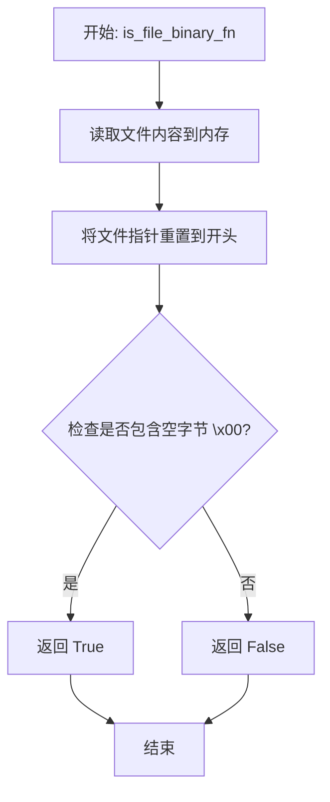

#### 带注释源码

```python
def is_file_binary_fn(file: BinaryIO):
    """Given a file path load all its content and checks if the null bytes is present

    Args:
        file (_type_): _description_

    Returns:
        bool: is_binary
    """
    # 读取整个文件内容到内存中进行二进制检测
    file_data = file.read()
    
    # 将文件指针重置到文件开头，以便后续操作可以再次读取文件内容
    file.seek(0)
    
    # 检查文件数据中是否包含空字节 \x00（空字节通常表示二进制文件）
    if b"\x00" in file_data:
        # 存在空字节，返回 True 表示为二进制文件
        return True
    
    # 不存在空字节，返回 False 表示为文本文件
    return False
```


### `decode_textual_file`

该函数是文件解码的核心入口，根据文件扩展名选择合适的解析器（策略模式），将二进制文件内容解码为文本字符串，支持txt、pdf、docx、json、xml、yaml、html、latex等多种格式，并具备二进制文件检测和回退机制。

参数：

- `file`：`BinaryIO`，要读取的二进制文件对象
- `ext`：`str`，文件扩展名（如 .pdf、.txt 等），用于匹配对应的解析器
- `logger`：`logging.Logger`，日志记录器，用于输出调试信息

返回值：`str`，解码后的文本内容

#### 流程图

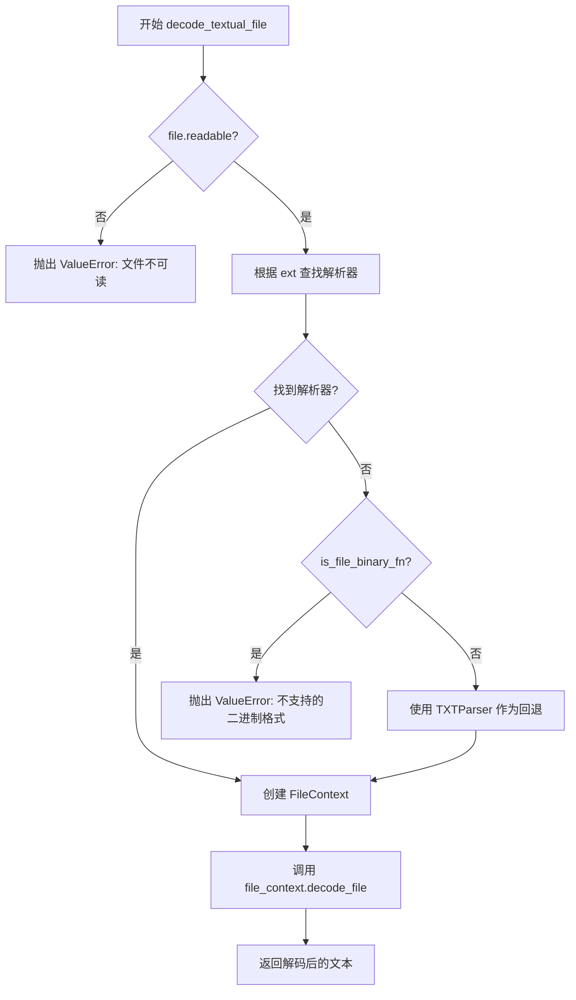

#### 带注释源码

```python
def decode_textual_file(file: BinaryIO, ext: str, logger: logging.Logger) -> str:
    """
    根据文件扩展名选择合适的解析器，将二进制文件解码为文本
    
    Args:
        file: 二进制文件对象
        ext: 文件扩展名（如 .pdf, .txt）
        logger: 日志记录器
    
    Returns:
        解码后的文本字符串
    
    Raises:
        ValueError: 文件不可读或不支持的二进制格式
    """
    # 步骤1: 检查文件是否可读
    if not file.readable():
        raise ValueError(f"{repr(file)} is not readable")

    # 步骤2: 根据扩展名查找对应的解析器策略
    parser = extension_to_parser.get(ext.lower())
    
    # 步骤3: 如果未找到解析器
    if not parser:
        # 检查是否为二进制文件
        if is_file_binary_fn(file):
            # 二进制文件且无对应解析器，抛出异常
            raise ValueError(f"Unsupported binary file format: {ext}")
        # 非二进制文件（如脚本、代码文件），回退到 TXTParser
        parser = TXTParser()
    
    # 步骤4: 创建文件上下文，注入解析器和日志器
    file_context = FileContext(parser, logger)
    
    # 步骤5: 委托给上下文执行解码操作
    return file_context.decode_file(file)
```


### `ParserStrategy.read`

该方法是文件解析策略的抽象接口，定义了统一的文件读取和文本提取规范。具体实现由子类完成，支持多种文件格式（如TXT、PDF、DOCX、JSON、XML、YAML、HTML、LaTeX等）的文本提取。

参数：

- `self`：隐式的 `ParserStrategy` 实例，代表具体的解析器实现（如 `TXTParser`、`PDFParser` 等）
- `file`：`BinaryIO`，要读取的文件对象，为二进制文件流

返回值：`str`，从文件中解析提取的文本内容

#### 流程图

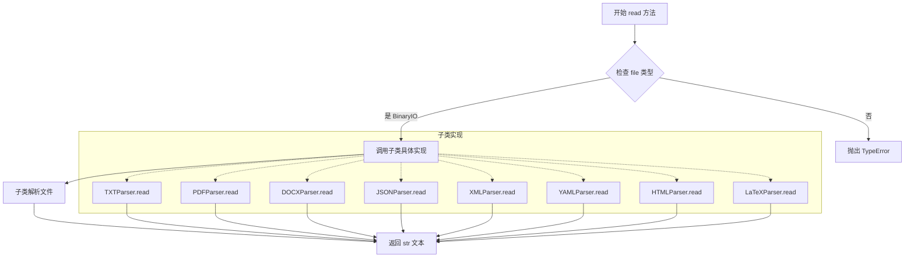

#### 带注释源码

```python
class ParserStrategy(ABC):
    """
    文件解析策略抽象基类
    
    定义了统一的文件读取接口，所有具体文件格式解析器都应继承此类
    并实现 read 方法来完成特定格式的文本提取
    """
    
    @abstractmethod
    def read(self, file: BinaryIO) -> str:
        """
        读取文件并提取文本内容
        
        这是一个抽象方法，必须由子类实现具体逻辑
        
        参数:
            file: BinaryIO 类型，二进制文件流对象
            
        返回:
            str: 从文件中提取的文本内容
        """
        ...
```


### `TXTParser.read`

该方法是文本文件解析器的核心实现，通过 `charset_normalizer` 库自动检测文件编码，并将二进制文件内容转换为字符串返回。

参数：

- `file`：`BinaryIO`，需要读取的二进制文件对象

返回值：`str`，检测到最佳编码后转换的文本内容

#### 流程图

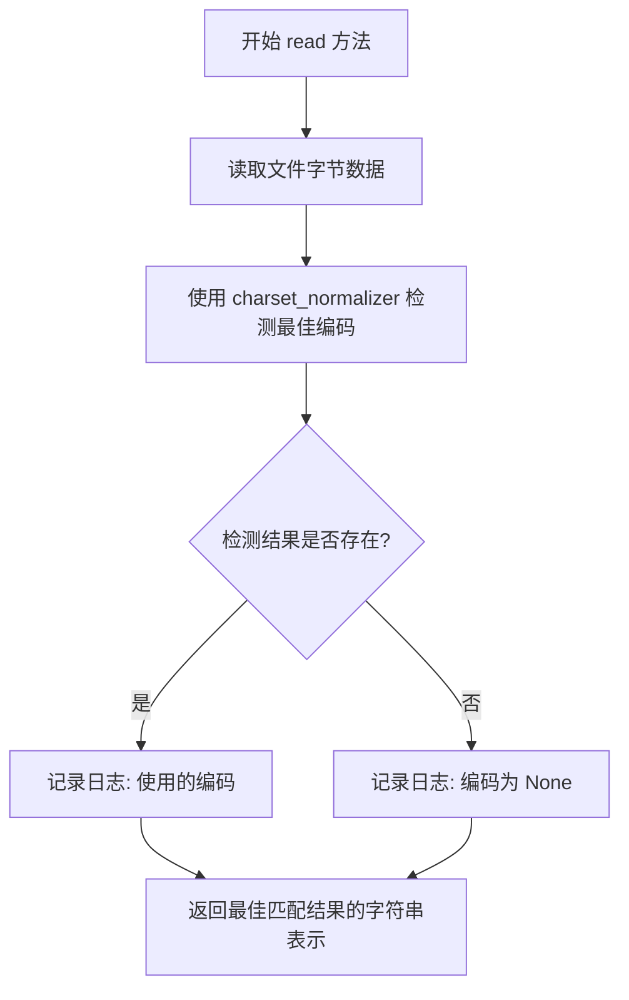

#### 带注释源码

```python
def read(self, file: BinaryIO) -> str:
    # 使用 charset_normalizer 库从字节数据中检测最佳编码
    # from_bytes 方法接收文件字节内容，返回匹配结果列表
    # .best() 获取最佳匹配结果
    charset_match = charset_normalizer.from_bytes(file.read()).best()
    
    # 记录调试日志，包含文件名和检测到的编码
    # getattr 用于安全获取 file 对象的 name 属性，不存在时返回 'file'
    logger.debug(
        f"Reading {getattr(file, 'name', 'file')} "
        f"with encoding '{charset_match.encoding if charset_match else None}'"
    )
    
    # 将匹配结果转换为字符串返回
    # charset_match 对象会自动将字节内容按检测到的编码转换为字符串
    return str(charset_match)
```


### `PDFParser.read`

该方法实现了从PDF文件中提取文本内容的功能，属于策略模式中具体策略类的核心方法。通过pypdf库读取PDF文件对象，遍历所有页面并调用extract_text()方法将每页的文本内容提取出来，最终拼接成完整的文本字符串返回。

参数：

- `self`：PDFParser类的实例对象
- `file`：`BinaryIO`，PDF文件的二进制输入流，包含完整的PDF文件数据

返回值：`str`，从PDF文档中提取的所有页面文本内容拼接而成的字符串

#### 流程图

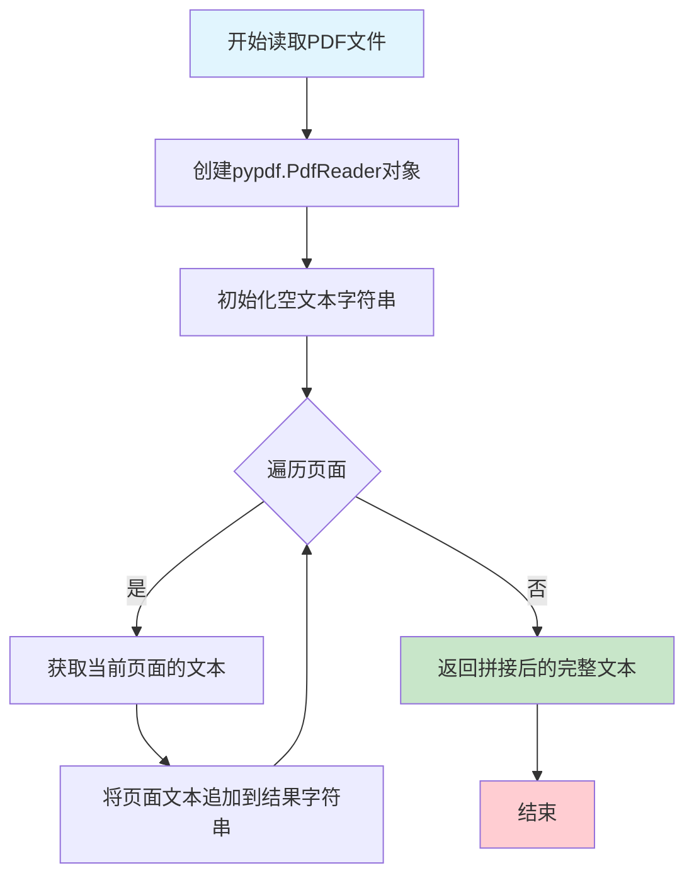

#### 带注释源码

```python
# Reading text from binary file using pdf parser
class PDFParser(ParserStrategy):
    """
    PDF文件解析策略类，继承自ParserStrategy抽象基类
    负责从PDF格式的二进制文件中提取文本内容
    """
    
    def read(self, file: BinaryIO) -> str:
        """
        从PDF二进制文件中提取文本内容
        
        该方法使用pypdf库读取PDF文件，遍历所有页面并提取每个页面的文本，
        最终将所有页面的文本拼接成一个完整的字符串返回。
        
        Args:
            file: BinaryIO类型的文件对象，包含PDF的二进制数据
            
        Returns:
            str: 从PDF中提取的全部文本内容，如果PDF没有文本内容则返回空字符串
        """
        # 使用pypdf库创建PDF读取器对象，传入二进制文件对象
        parser = pypdf.PdfReader(file)
        
        # 初始化空字符串用于存储提取的文本内容
        text = ""
        
        # 遍历PDF的所有页面，range(len(parser.pages))生成页面索引序列
        for page_idx in range(len(parser.pages)):
            # 获取当前页面的文本提取器，pages是页面对象列表
            # extract_text()方法执行实际的文本提取操作
            text += parser.pages[page_idx].extract_text()
            
        # 返回拼接完成的完整文本字符串
        return text
```


### `DOCXParser.read`

该方法实现了从 DOCX（Microsoft Word）二进制文件中提取纯文本内容的功能，通过 python-docx 库解析 Word 文档结构，遍历文档中的所有段落并将其文本内容拼接后返回。

参数：

- `file`：`BinaryIO`，需要解析的 DOCX 格式的二进制文件对象

返回值：`str`，从 DOCX 文档中提取的所有段落文本内容

#### 流程图

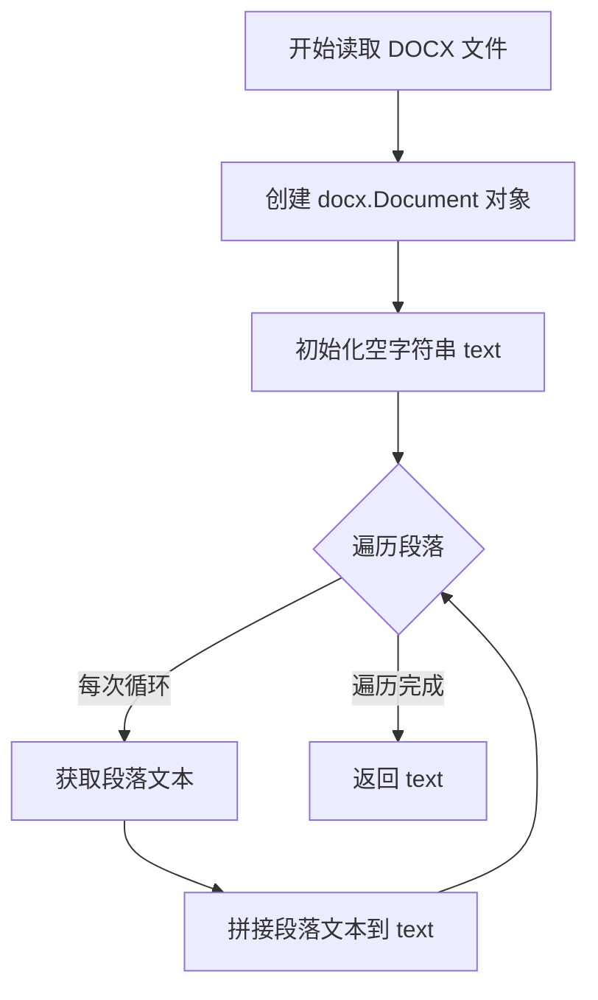

#### 带注释源码

```python
def read(self, file: BinaryIO) -> str:
    """从 DOCX 文件中提取文本内容
    
    Args:
        file: 二进制文件对象，应为有效的 DOCX 格式
        
    Returns:
        提取的纯文本内容
    """
    # 使用 python-docx 库打开 DOCX 文件并创建 Document 对象
    doc_file = docx.Document(file)
    
    # 初始化用于存储文本的空字符串
    text = ""
    
    # 遍历文档中的所有段落
    for para in doc_file.paragraphs:
        # 将每个段落的文本内容追加到 text 变量
        text += para.text
    
    # 返回拼接后的完整文本
    return text
```

---

### 补充信息

#### 类详细信息

| 类名 | 文件路径 | 描述 |
|------|----------|------|
| `ParserStrategy` | 抽象基类 | 定义文件解析器的抽象接口 |
| `DOCXParser` | 本代码 | 实现 DOCX 格式文件的文本提取 |

#### 关键组件信息

| 组件名称 | 描述 |
|----------|------|
| `docx.Document` | python-docx 库的核心类，用于解析 DOCX 文件结构 |
| `docx.Document.paragraphs` | 文档中所有段落的集合 |

#### 潜在的技术债务或优化空间

1. **段落分隔符丢失**：当前实现直接拼接段落文本，未保留段落之间的换行符，可能导致原始文档的结构信息丢失
2. **表格内容未提取**：仅处理了段落，未处理文档中的表格数据（表格内容可能包含重要信息）
3. **样式信息丢失**：未提取粗体、斜体等格式信息，文档的语义结构不完整
4. **内存效率**：对于大型文档，逐个段落拼接字符串效率较低（字符串不可变，每次拼接会创建新对象），建议使用列表存储后用 `join()` 方法合并
5. **错误处理缺失**：未处理文件损坏、格式不正确等异常情况

#### 其它项目

**设计目标与约束**：
- 遵循策略模式（Strategy Pattern），与其他 Parser 实现保持一致的接口
- 专注于文本内容提取，不保留格式信息

**错误处理与异常设计**：
- 当前未实现显式的异常处理，依赖 python-docx 库抛出异常
- 建议添加对无效 DOCX 文件格式的检测和友好错误提示

**数据流与状态机**：
- 输入：二进制 DOCX 文件流
- 处理：解析 DOCX 文档结构 → 提取段落文本
- 输出：纯文本字符串

**外部依赖与接口契约**：
- 依赖 `docx` (python-docx) 库
- 接口遵循 `ParserStrategy` 抽象类定义的契约：`read(file: BinaryIO) -> str`


### `JSONParser.read`

该方法是 JSON 解析器的核心实现，负责将二进制文件对象中的 JSON 数据读取并转换为字符串格式。它实现了 `ParserStrategy` 抽象接口，通过 `json.load` 解析 JSON 数据，并使用 `str()` 将其转换为字符串返回。

参数：

- `file`：`BinaryIO`，二进制文件对象，包含待解析的 JSON 数据

返回值：`str`，JSON 数据转换后的字符串表示形式

#### 流程图

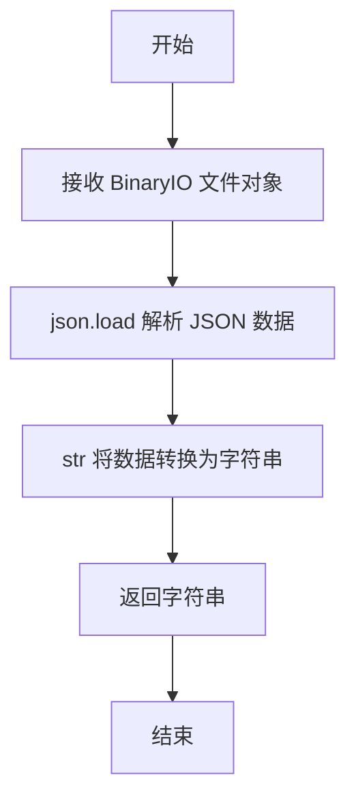

#### 带注释源码

```python
# 继承自 ParserStrategy 抽象基类
class JSONParser(ParserStrategy):
    def read(self, file: BinaryIO) -> str:
        """
        读取 JSON 格式文件并返回字符串表示
        
        Args:
            file: 二进制文件对象，需要是可读的 JSON 文件
            
        Returns:
            JSON 数据的字符串表示
        """
        # 使用 json.load 解析文件中的 JSON 数据
        # json.load 会自动将 JSON 对象转换为 Python 字典/列表
        data = json.load(file)
        
        # 将 Python 对象转换为字符串格式
        # 这里会调用对象的 __str__ 方法
        text = str(data)
        
        # 返回转换后的字符串
        return text
```


### `XMLParser.read`

该方法接收一个二进制文件流，使用BeautifulSoup库以XML解析器模式解析文件内容，并提取其中的纯文本内容后返回。

参数：

- `file`：`BinaryIO`，要读取的二进制文件流对象

返回值：`str`，从XML文件中提取的纯文本内容

#### 流程图

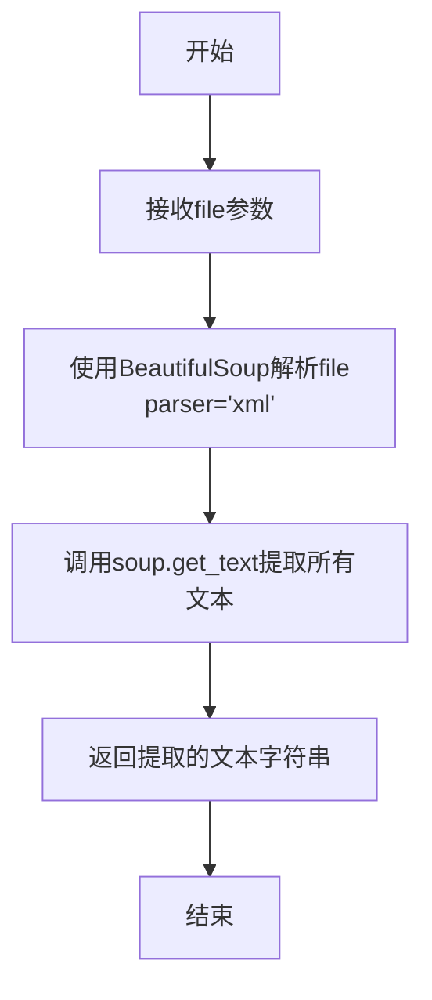

#### 带注释源码

```python
class XMLParser(ParserStrategy):
    def read(self, file: BinaryIO) -> str:
        # 使用BeautifulSoup解析XML文件
        # 参数file: 二进制文件流对象
        # 参数"xml": 指定使用XML解析器
        soup = BeautifulSoup(file, "xml")
        
        # 从解析后的XML文档中提取所有文本内容
        # get_text()方法会递归获取所有文本节点并拼接
        text = soup.get_text()
        
        # 返回提取的纯文本内容
        return text
```


### `YAMLParser.read`

该方法是 YAMLParser 类的核心方法，继承自 ParserStrategy 抽象类，负责读取二进制文件流中的 YAML 格式数据，使用 SafeLoader 进行安全解析，并将解析后的字典对象转换为字符串格式返回。

参数：

- `file`：`BinaryIO`，二进制文件对象，包含待解析的 YAML 内容

返回值：`str`，字符串格式的 YAML 数据表示

#### 流程图

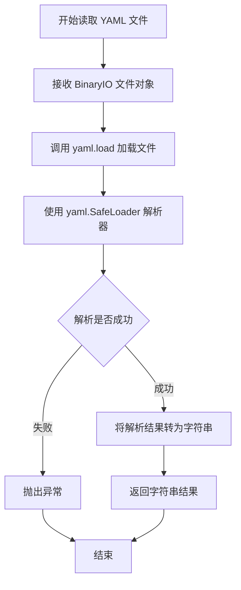

#### 带注释源码

```python
# Reading as dictionary and returning string format
class YAMLParser(ParserStrategy):
    """YAML 文件解析器实现类，继承自 ParserStrategy 抽象类"""
    
    def read(self, file: BinaryIO) -> str:
        """
        读取 YAML 格式的二进制文件并转换为字符串
        
        Args:
            file: BinaryIO 二进制文件对象
            
        Returns:
            str: 解析后的 YAML 内容字符串表示
        """
        # 使用 yaml.SafeLoader 安全加载器解析 YAML 文件
        # SafeLoader 可以防止执行恶意构造的 YAML 代码
        data = yaml.load(file, Loader=yaml.SafeLoader)
        
        # 将解析后的字典对象转换为字符串格式返回
        text = str(data)
        
        return text
```


### `HTMLParser.read`

该方法是策略模式中HTML文件的文本提取实现，接收二进制文件对象，使用BeautifulSoup的html.parser解析器解析HTML内容，并提取所有文本节点合并返回纯文本字符串。

参数：

- `file`：`BinaryIO`，HTML格式的二进制文件对象

返回值：`str`，从HTML文档中提取的所有纯文本内容

#### 流程图

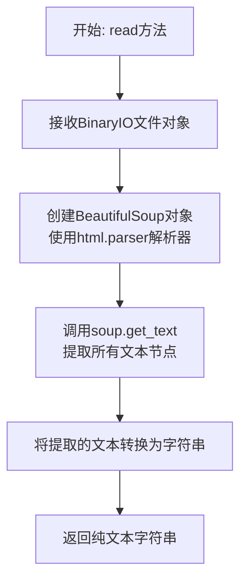

#### 带注释源码

```python
class HTMLParser(ParserStrategy):
    """HTML文件解析策略实现类，继承自ParserStrategy抽象基类"""
    
    def read(self, file: BinaryIO) -> str:
        """
        从HTML文件中提取纯文本内容
        
        Args:
            file: 二进制文件对象，包含HTML格式的文档内容
            
        Returns:
            str: 从HTML文档中提取的所有文本内容拼接而成的字符串
        """
        # 使用BeautifulSoup解析HTML文件，指定html.parser作为解析器
        soup = BeautifulSoup(file, "html.parser")
        
        # 调用get_text方法提取HTML中所有的文本内容
        # 该方法会递归获取所有子节点的文本并拼接
        text = soup.get_text()
        
        # 返回提取到的纯文本字符串
        return text
```


### `LaTeXParser.read`

该方法实现了从二进制文件中读取并解析LaTeX文档的核心功能。它通过将二进制内容解码为字符串，然后使用 `LatexNodes2Text` 工具将 LaTeX 标记转换为纯文本，最终返回提取的文本内容。

参数：

- `self`：LaTeXParser，当前类实例
- `file`：BinaryIO，二进制文件对象，包含要解析的 LaTeX 文档内容

返回值：`str`，从 LaTeX 文档中提取的纯文本内容

#### 流程图

```mermaid
flowchart TD
    A[开始 read 方法] --> B[读取二进制文件内容: file.read]
    B --> C[解码为UTF-8字符串: latex = file.read().decode]
    D[LatexNodes2Text 实例] --> E[调用 latex_to_text 方法转换 LaTeX]
    C --> E
    E --> F[返回转换后的文本]
    
    style A fill:#f9f,stroke:#333
    style F fill:#9f9,stroke:#333
```

#### 带注释源码

```python
class LaTeXParser(ParserStrategy):
    """LaTeX文档解析器策略类，继承自ParserStrategy抽象基类"""
    
    def read(self, file: BinaryIO) -> str:
        """
        从二进制文件中读取并解析LaTeX文档内容
        
        Args:
            file: BinaryIO - 二进制文件对象，包含LaTeX格式的文档数据
            
        Returns:
            str - 从LaTeX文档中提取的纯文本内容
        """
        # 步骤1: 读取二进制文件内容并解码为字符串
        # 使用UTF-8编码（默认）将字节流转换为LaTeX源代码字符串
        latex = file.read().decode()
        
        # 步骤2: 创建LatexNodes2Text转换器实例
        # 该工具来自pylatexenc库，负责将LaTeX标记语言转换为普通文本
        # 它会处理常见的LaTeX命令、公式、环境等
        text = LatexNodes2Text().latex_to_text(latex)
        
        # 步骤3: 返回转换后的纯文本内容
        return text
```


### `FileContext.set_parser`

设置文件上下文的解析器策略，允许动态切换不同的文件解析器，实现策略模式的核心功能。

参数：

- `parser`：`ParserStrategy`，要设置的解析器策略对象，用于替换当前的解析器实现

返回值：`None`，无返回值，仅修改对象内部状态

#### 流程图

```mermaid
graph TD
    A[开始 set_parser] --> B[接收 parser 参数]
    B --> C{日志记录}
    C --> D[记录调试日志: Setting Context Parser to {parser}]
    D --> E[更新 self.parser]
    E --> F[结束]
```

#### 带注释源码

```python
def set_parser(self, parser: ParserStrategy) -> None:
    """
    设置文件上下文的解析器策略
    
    参数:
        parser: ParserStrategy - 新的解析器策略实例，用于替换当前的解析器
               该参数必须实现 ParserStrategy 接口（即具有 read 方法）
    
    返回值:
        None
    
    说明:
        此方法允许在运行时动态切换不同的文件解析器实现。
        例如，可以根据文件扩展名或文件内容特征选择最合适的解析器。
        常见的调用场景包括：
        - 根据文件 MIME 类型切换解析器
        - 根据文件内容自动检测并切换解析器
        - 支持自定义解析器注入
    """
    # 记录调试日志，包含新解析器的类名信息
    self.logger.debug(f"Setting Context Parser to {parser}")
    
    # 更新内部解析器引用，替换原有的解析器策略
    self.parser = parser
```


### `FileContext.decode_file`

该方法是策略模式（Strategy Pattern）的核心实现，通过委托给注入的 `ParserStrategy` 对象来解析不同类型的文件，并返回提取的文本内容。

参数：

- `file`：`BinaryIO`，待解析的二进制文件对象

返回值：`str`，从文件中提取的文本内容

#### 流程图

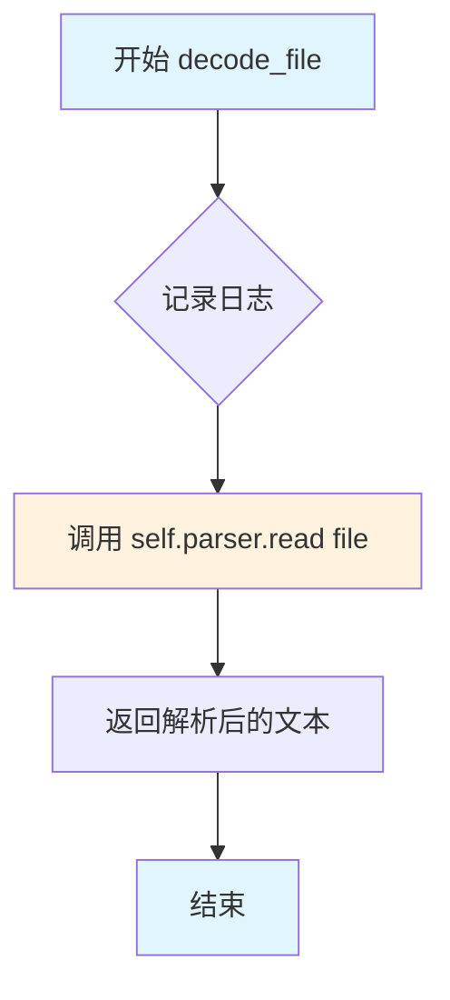

#### 带注释源码

```python
def decode_file(self, file: BinaryIO) -> str:
    """
    使用策略模式解析文件并提取文本内容
    
    该方法是 FileContext 类的核心方法，体现了策略模式的设计思想：
    - 将文件解析的具体实现委托给注入的 ParserStrategy 对象
    - 客户端无需关心具体使用哪种解析器
    - 可以通过 set_parser 动态切换解析策略
    
    Args:
        file: BinaryIO - 二进制文件对象，支持任意支持 read() 方法的文件流
        
    Returns:
        str - 解析后的文本内容，解析结果取决于注入的 ParserStrategy 实现
        
    Raises:
        具体的异常类型取决于 self.parser.read() 的实现
        例如：json.JSONDecodeError, yaml.YAMLError 等
    """
    # 记录调试日志，包含文件名（如果可用）和当前使用的解析器类型
    # 使用 getattr 安全获取 file 的 name 属性，避免文件对象没有 name 属性时报错
    self.logger.debug(
        f"Reading {getattr(file, 'name', 'file')} with parser {self.parser}"
    )
    
    # 委托给策略对象执行实际的读取操作
    # 这里体现了"开闭原则"：新增新的文件格式只需创建新的 ParserStrategy 实现
    # 无需修改此方法
    return self.parser.read(file)
```

## 关键组件


### ParserStrategy

抽象策略类，定义文件解析器的接口规范，所有具体解析器均继承该类并实现read方法

### TXTParser

纯文本文件解析器，使用charset_normalizer库自动检测文件编码并读取内容

### PDFParser

PDF文档解析器，使用pypdf库逐页提取PDF中的文本内容

### DOCXParser

Word文档解析器，使用python-docx库提取DOCX文件中的段落文本

### JSONParser

JSON文件解析器，将JSON数据加载为字典后转换为字符串返回

### XMLParser

XML文件解析器，使用BeautifulSoup以XML模式解析并提取纯文本内容

### YAMLParser

YAML文件解析器，使用PyYAML的SafeLoader加载数据并转换为字符串

### HTMLParser

HTML文件解析器，使用BeautifulSoup的HTML解析器提取纯文本内容

### LaTeXParser

LaTeX文档解析器，使用pylatexenc库将LaTeX代码转换为纯文本

### FileContext

策略模式中的上下文类，负责管理解析器实例并调用解析方法完成文件读取

### extension_to_parser

全局字典映射，将文件扩展名映射到对应的解析器实例，实现基于扩展名的自动路由

### is_file_binary_fn

二进制文件检测函数，通过读取文件内容判断是否包含空字节来确定文件类型

### decode_textual_file

主入口函数，根据文件扩展名选择合适的解析器，支持二进制文件格式验证和fallback到文本解析器


## 问题及建议


### 已知问题

- **全局变量预实例化**：`extension_to_parser` 字典在模块加载时就创建了所有 Parser 实例，导致即使不使用某些格式也会实例化对应解析器，增加内存占用和启动时间
- **文件指针未重置**：TXTParser 读取文件后文件指针已移动到末尾，但未在读取前重置；若文件被多次使用会导致读取为空
- **文件内容重复读取**：`is_file_binary_fn` 函数读取全部文件内容后使用 `file.seek(0)` 重置指针，但调用方（如 `decode_textual_file`）在获取 parser 后会再次读取文件，造成 I/O 浪费
- **字符串拼接低效**：多个 Parser（PDFParser、DOCXParser）使用 `text +=` 在循环中拼接字符串，时间复杂度为 O(n²)，应使用列表或 StringIO
- **缺少错误处理**：JSONParser、YAMLParser 未捕获解析异常；PDFParser 未处理加密 PDF；DOCXParser 未处理损坏文件，均会导致未捕获的异常传播
- **二进制检测不完善**：`is_file_binary_fn` 仅检测空字节，未考虑某些文本格式（如 UTF-16）也包含空字节的情况，且对于不可 seek 的文件流会失败
- **类型注解不完整**：`decode_textual_file` 函数的 ext 参数缺少类型注解；ParserStrategy 的 read 方法返回类型可更精确为 `str` 而非省略号

### 优化建议

- **延迟实例化 parser**：将 `extension_to_parser` 改为映射到类而非实例，或使用 `@lru_cache` 延迟创建单例
- **统一文件指针管理**：在读取文件前显式调用 `file.seek(0)`，或在读取后返回结果时确保调用方已知指针状态
- **避免重复读取**：合并二进制检测与实际读取逻辑，或传递已读取的字节数据
- **使用高效拼接**：将 `text +=` 改为 `parts.append()` 后 `''.join(parts)`，或使用 `io.StringIO`
- **添加异常处理**：为 JSON、YAML、PDF、DOCX 解析添加 try-except 捕获并转换为有意义的自定义异常
- **改进二进制检测**：使用 `chardet` 或更健壮的编码检测库，或捕获 `io.UnsupportedOperation` 异常处理不可 seek 的流
- **完善类型注解**：添加缺失的类型注解，提升代码可读性和静态检查能力


## 其它


### 设计目标与约束

本项目旨在提供一个统一、可扩展的文件解析框架，支持多种文档格式的文本提取。核心设计目标包括：采用策略模式实现解析器解耦，确保新增文件格式支持时无需修改现有代码；通过文件扩展名自动匹配解析器，实现自动化的文件类型识别；支持二进制文件和文本文件的区分处理；提供日志记录能力以便于调试和监控。约束条件包括：仅支持常见文档格式，不支持图像、音频等多媒体文件的解析；解析过程全部在内存中完成，不支持流式处理大文件；依赖外部库进行实际解析工作，无法解析被加密或损坏的文件。

### 错误处理与异常设计

系统采用分层异常处理策略。底层解析器在遇到格式错误或不支持的内容时，应尽可能捕获异常并返回部分数据，而非直接抛出。`decode_textual_file`函数作为入口点，负责验证文件可读性和扩展名合法性，对于不支持的二进制格式抛出`ValueError`并附带明确的错误信息。`is_file_binary_fn`函数通过检测空字节来判断文件是否为二进制文件，该方法虽然简单但对于常见场景足够有效。解析器内部的异常应被捕获并转换为用户友好的错误消息，同时记录详细日志供开发人员排查。建议增加自定义异常类如`UnsupportedFormatError`和`ParseError`以提供更精细的错误分类。

### 数据流与状态机

系统数据流分为三个主要阶段。第一阶段为文件类型识别：根据文件扩展名从`extension_to_parser`字典中查找对应的解析器实例，若未找到则调用`is_file_binary_fn`判断是否为不支持的二进制文件，若非二进制文件则回退到TXTParser。第二阶段为解析器初始化：创建`FileContext`实例，传入选定的解析器和日志记录器，可通过`set_parser`方法动态更换解析器。第三阶段为文件解码：调用`FileContext.decode_file`方法，该方法委托给当前解析器的`read`方法执行实际的文本提取。整个过程状态转换简单，无复杂的状态机设计，但`FileContext`类可视为一个轻量级的状态持有者，维护当前解析器实例的状态。

### 外部依赖与接口契约

系统依赖多个外部库实现具体格式的解析：`charset_normalizer`用于TXT文件的字符编码检测；`pypdf`用于PDF文件文本提取；`python-docx`用于DOCX文件解析；`PyYAML`用于YAML文件解析；`BeautifulSoup4`用于XML、HTML文件解析；`pylatexenc`用于LaTeX文件转换。这些库均通过pip安装，版本兼容性需在项目依赖文件中明确指定。接口契约方面，`ParserStrategy`抽象类定义了`read(file: BinaryIO) -> str`方法，所有具体解析器必须实现该方法。输入参数`file`应为已打开的二进制文件对象，调用前文件指针应位于起始位置。输出为提取的文本内容，字符串形式返回。对于无法提取文本的格式（如图片嵌入的PDF），解析器应返回空字符串而非抛出异常。

### 性能考虑与优化空间

当前实现存在若干性能问题。首先，所有解析器在处理大型文件时均将整个文件内容加载到内存，可能导致内存占用过高，建议对大文件实现流式处理或分块读取。其次，`TXTParser`中的`charset_normalizer.from_bytes()`会进行完整的编码检测，对于已知编码的文件可跳过检测过程。`PDFParser`逐页提取文本后可立即处理而非累积到字符串变量中，减少中间字符串对象的创建。`decode_textual_file`函数每次调用都会创建新的`FileContext`对象，对于高频调用场景可考虑缓存机制。此外，`extension_to_parser`字典中多个扩展名映射到同一解析器实例，若解析器无状态则可复用，若解析器有内部状态则存在线程安全隐患，建议明确解析器的状态设计或使用工厂方法创建实例。

### 并发与线程安全性

当前代码未显式处理并发场景。`ParserStrategy`的各个实现类（除TXTParser外）通常为无状态设计，可安全地在多线程环境中共享使用。`TXTParser`依赖`charset_normalizer`的内部状态，线程安全性取决于该库的实现。`FileContext`类维护解析器引用和日志记录器引用，日志记录器通常是线程安全的，但解析器实例的共享可能在特定情况下导致竞争条件。若系统在多线程环境中使用，建议对`FileContext.decode_file`调用进行加锁保护，或为每个线程创建独立的解析器实例。`extension_to_parser`字典在模块加载时初始化，属于进程级别的共享资源，但字典内容为只读操作，因此是线程安全的。

### 可扩展性设计

系统采用策略模式，具备良好的可扩展性。新增文件格式支持只需三步：创建新的解析器类继承`ParserStrategy`并实现`read`方法；在`extension_to_parser`字典中添加扩展名到解析器实例的映射；确保依赖的外部库已安装。建议为解析器实现添加优先级机制，当一个扩展名对应多个解析器时可支持自动选择最优解析器。此外，可考虑实现解析器自动发现机制，通过扫描指定目录动态加载解析器类，减少手动配置工作。`FileContext`类的`set_parser`方法为运行时动态更换解析器提供了可能，可用于实现文件格式自动检测失败后的备选方案。系统当前未实现解析器链式调用机制，若需要处理嵌套格式（如HTML内嵌LaTeX），可在此基础上进行扩展。

### 配置管理

当前系统采用硬编码方式管理扩展名到解析器的映射关系，存储在`extension_to_parser`全局字典中。这种方式简单直接，但修改配置需要修改源代码，对于非技术用户不够友好。建议后续改进为：支持从外部配置文件（如JSON或YAML）加载扩展名映射关系；支持环境变量或配置文件指定自定义解析器类；提供运行时API用于动态注册新的文件格式解析器。日志配置通过`logging.Logger`传入，当前需要调用方显式传入，建议提供默认日志配置选项。解析器依赖的外部库版本应在requirements.txt或pyproject.toml中明确声明，并定期更新以获取安全补丁和新功能。

### 测试策略建议

建议为系统建立多层次测试体系。单元测试层面：针对每个解析器类编写独立测试用例，使用已知内容的测试文件验证解析结果正确性；测试字符编码检测的准确性；测试异常情况如空文件、损坏文件的处理。集成测试层面：测试`decode_textual_file`函数与各解析器的协作；测试文件类型识别逻辑的正确性；测试从文件读取到文本输出的完整流程。边界测试：测试超大文件的处理性能；测试混合编码的文件；测试特殊字符和Unicode内容的处理。Mock测试：对于外部库调用可使用mock对象隔离依赖，确保测试的稳定性和执行速度。测试文件应包含在项目仓库中，持续集成流程应包含测试执行步骤。

    