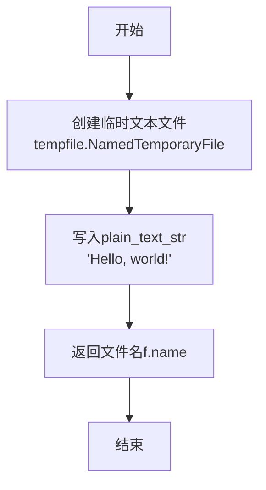
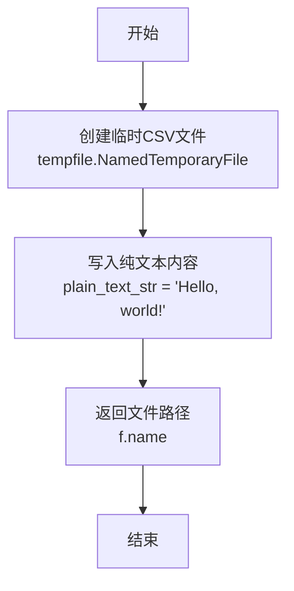
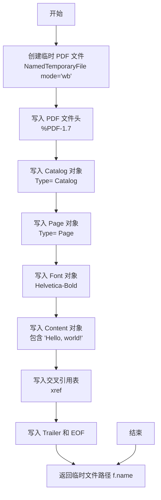
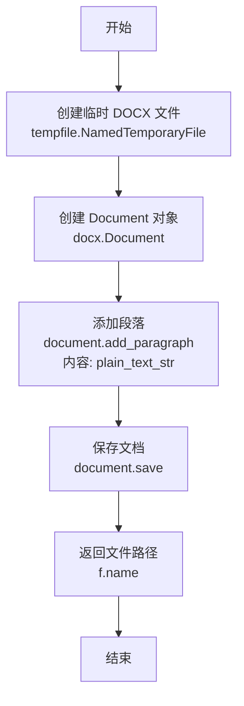
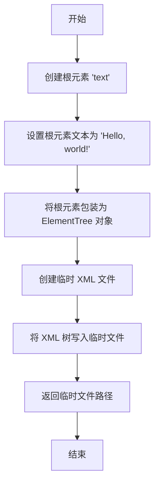
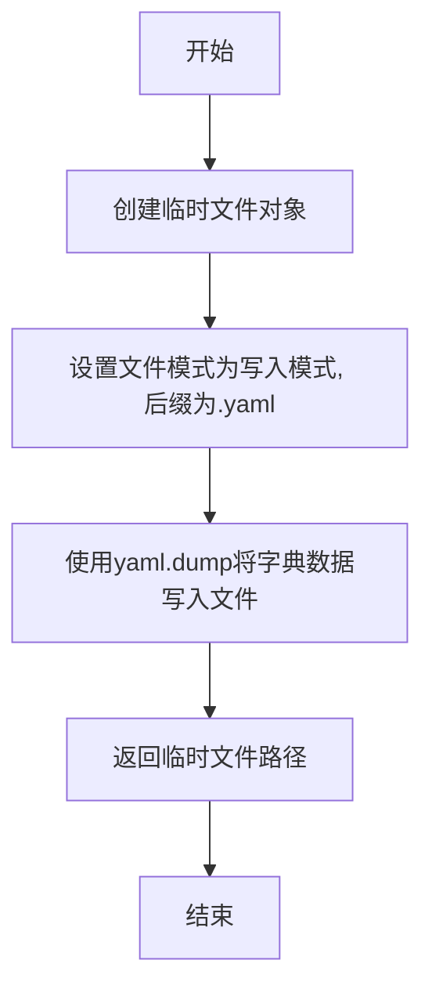
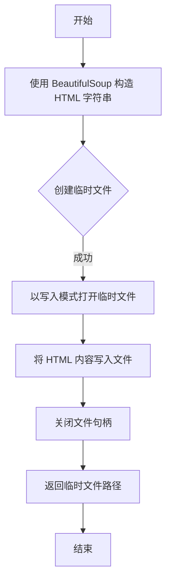
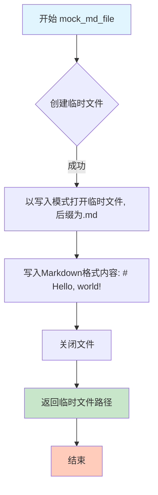
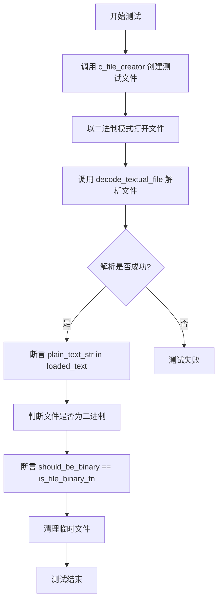

# `.\AutoGPT\classic\forge\forge\utils\test_file_operations.py` 详细设计文档

该代码是一个测试模块，核心功能是验证文件解析和类型判断功能。它通过定义多个 mock 函数来创建不同格式（txt, csv, pdf, docx, json, xml, yaml, html, md, latex）的临时文件，并使用 pytest 参数化测试来验证 decode_textual_file 函数读取文本内容的准确性以及 is_file_binary_fn 函数区分二进制文件和文本文件的能力。

## 整体流程

```mermaid
graph TD
    Start((开始测试)) --> GetParams[获取参数: file_extension, c_file_creator]
    GetParams --> CreateFile[调用 c_file_creator 创建临时文件]
    CreateFile --> OpenFile[以二进制模式 (rb) 打开文件]
    OpenFile --> Decode[调用 decode_textual_file(file, extension, logger)]
    Decode --> AssertContent{loaded_text 包含 plain_text_str?}
    AssertContent -- 否 --> Fail[测试失败: 断言错误]
    AssertContent -- 是 --> IsBinary[调用 is_file_binary_fn(file)]
    IsBinary --> CheckBinary{结果 == (file_extension in binary_files_extensions)?}
    CheckBinary -- 否 --> Fail
    CheckBinary -- 是 --> Cleanup[删除临时文件 unlink]
    Cleanup --> End((结束测试))
```

## 类结构

```
test_file_parser.py (模块)
├── 全局变量
│   ├── plain_text_str (str): 测试用纯文本字符串
│   ├── respective_file_creation_functions (dict): 文件扩展名到创建函数的映射
│   ├── binary_files_extensions (list): 二进制文件扩展名列表
│   └── logger (Logger): 模块级日志记录器
└── 全局函数
    ├── mock_text_file (): 创建临时 txt 文件
    ├── mock_csv_file (): 创建临时 csv 文件
    ├── mock_pdf_file (): 创建临时 pdf 文件
    ├── mock_docx_file (): 创建临时 docx 文件
    ├── mock_json_file (): 创建临时 json 文件
    ├── mock_xml_file (): 创建临时 xml 文件
    ├── mock_yaml_file (): 创建临时 yaml 文件
    ├── mock_html_file (): 创建临时 html 文件
    ├── mock_md_file (): 创建临时 md 文件
    ├── mock_latex_file (): 创建临时 tex 文件
    └── test_parsers (): 参数化测试函数
```

## 全局变量及字段


### `plain_text_str`
    
用于测试的纯文本字符串，内容为'Hello, world!'，用于各种文件格式的文本验证

类型：`str`
    


### `respective_file_creation_functions`
    
将文件扩展名映射到对应创建函数的字典，用于生成不同格式的测试文件（txt、csv、pdf、docx、json、xml、yaml、html、md、tex）

类型：`dict`
    


### `binary_files_extensions`
    
二进制文件扩展名列表，包含'.pdf'和'.docx'，用于标识哪些文件类型被认为是二进制格式

类型：`list`
    


### `logger`
    
模块级别的日志记录器，通过logging.getLogger(__name__)创建，用于记录该模块的日志信息

类型：`logging.Logger`
    


    

## 全局函数及方法


### `mock_text_file`

该函数用于创建一个包含简单文本内容的临时 `.txt` 文件，并返回该临时文件的文件路径，供测试场景使用。

参数： 无

返回值：`str`，返回创建的临时文件的完整路径（文件系统路径）。

#### 流程图



#### 带注释源码

```python
def mock_text_file():
    """创建一个包含 'Hello, world!' 的临时文本文件并返回其路径"""
    # 使用 tempfile.NamedTemporaryFile 创建临时文件
    # mode="w": 以文本写入模式打开
    # delete=False: 函数返回后不自动删除文件，便于后续使用
    # suffix=".txt": 指定文件后缀名为 .txt
    with tempfile.NamedTemporaryFile(mode="w", delete=False, suffix=".txt") as f:
        # 将预定义的纯文本字符串写入临时文件
        f.write(plain_text_str)
    # 返回临时文件的完整路径，供调用者使用
    return f.name
```


### `mock_csv_file`

该函数用于创建一个临时的 CSV 格式测试文件，写入预定义的纯文本内容 "Hello, world!"，并返回该临时文件的绝对路径，供后续测试解析器使用。

参数：None（无参数）

返回值：`str`，返回创建的临时 CSV 文件的绝对路径

#### 流程图



#### 带注释源码

```python
def mock_csv_file():
    """
    创建一个临时的 CSV 格式测试文件，并写入纯文本内容。
    
    该函数用于测试各种文件解析器，生成符合 CSV 扩展名的临时文件。
    
    Returns:
        str: 创建的临时文件的绝对路径，调用方负责在测试完成后清理。
    """
    # 使用 tempfile.NamedTemporaryFile 创建临时文件
    # mode="w" 以文本模式写入
    # delete=False 防止函数返回前文件被删除，便于后续读取
    # suffix=".csv" 指定文件扩展名为 .csv
    with tempfile.NamedTemporaryFile(mode="w", delete=False, suffix=".csv") as f:
        # 写入预定义的纯文本内容
        f.write(plain_text_str)
    # 返回临时文件的路径，供测试用例使用
    return f.name
```


### `mock_pdf_file`

该函数用于创建一个包含指定文本内容的最小有效 PDF 格式文件，并返回该临时文件的路径。函数通过手动构建 PDF 的各个对象（catalog、page、font、content）和交叉引用表来生成一个有效的 PDF 文件。

参数：
- 无

返回值：`str`，返回创建的临时 PDF 文件的绝对路径

#### 流程图



#### 带注释源码

```python
def mock_pdf_file():
    """
    创建一个包含 'Hello, world!' 文本的最小有效 PDF 文件。
    
    该函数手动构建 PDF 结构，包括：
    - PDF 文件头
    - Document Catalog 对象
    - Page 对象
    - Font 对象
    - Page Contents 对象（包含文本）
    - 交叉引用表
    - Trailer 信息
    
    Returns:
        str: 创建的临时 PDF 文件的路径
    """
    # 使用二进制写入模式创建临时文件，delete=False 允许函数返回后文件仍然存在
    with tempfile.NamedTemporaryFile(mode="wb", delete=False, suffix=".pdf") as f:
        # 创建新的 PDF 并添加包含 plain_text_str 的页面
        
        # 写入 PDF 头部标识
        f.write(b"%PDF-1.7\n")
        
        # 写入文档目录（Catalog）对象 - PDF 的根对象
        # /Type /Catalog: 定义为 Catalog 对象
        # /Pages 2 0 R: 引用页面对象
        f.write(b"1 0 obj\n")
        f.write(b"<< /Type /Catalog /Pages 2 0 R >>\n")
        f.write(b"endobj\n")
        
        # 写入页面（Page）对象
        # /Type /Page: 定义为页面对象
        # /Parent 1 0 R: 引用父对象（Catalog）
        # /Resources: 定义页面使用的资源（字体）
        # /MediaBox [0 0 612 792]: 定义页面尺寸（美国 Letter 大小）
        # /Contents 4 0 R: 引用页面内容对象
        f.write(b"2 0 obj\n")
        f.write(
            b"<< /Type /Page /Parent 1 0 R /Resources << /Font << /F1 3 0 R >> >> "
            b"/MediaBox [0 0 612 792] /Contents 4 0 R >>\n"
        )
        f.write(b"endobj\n")
        
        # 写入字体（Font）对象
        # /Type /Font: 定义为字体对象
        # /Subtype /Type1: 使用 Type 1 字体
        # /Name /F1: 字体名称标识
        # /BaseFont /Helvetica-Bold: 使用 Helvetica-Bold 字体
        f.write(b"3 0 obj\n")
        f.write(
            b"<< /Type /Font /Subtype /Type1 /Name /F1 /BaseFont /Helvetica-Bold >>\n"
        )
        f.write(b"endobj\n")
        
        # 写入页面内容（Contents）对象
        # /Length 25: 内容流的长度
        # BT ... ET: 开始/结束文本块
        # /F1 12 Tf: 使用 F1 字体，大小 12
        # 72 720 Td: 文本定位（72pt = 1英寸，从顶部 72pt 处开始）
        # (Hello, world!) Tj: 显示文本
        f.write(b"4 0 obj\n")
        f.write(b"<< /Length 25 >>\n")
        f.write(b"stream\n")
        f.write(b"BT\n/F1 12 Tf\n72 720 Td\n(Hello, world!) Tj\nET\n")
        f.write(b"endstream\n")
        f.write(b"endobj\n")
        
        # 写入交叉引用表（Cross-Reference Table）
        # 记录每个对象在文件中的字节偏移量
        f.write(b"xref\n")
        f.write(b"0 5\n")  # 从对象 0 开始，共有 5 个对象
        f.write(b"0000000000 65535 f \n")  # 对象 0：自由对象，f 表示 free
        f.write(b"0000000017 00000 n \n")  # 对象 1：Catalog，n 表示使用中
        f.write(b"0000000073 00000 n \n")  # 对象 2：Page
        f.write(b"0000000123 00000 n \n")  # 对象 3：Font
        f.write(b"0000000271 00000 n \n")  # 对象 4：Contents
        
        # 写入 Trailer（ trailer 部分）
        # /Size 5: 交叉引用表中对象数量
        # /Root 1 0 R: 指向 Catalog 对象
        f.write(b"trailer\n")
        f.write(b"<< /Size 5 /Root 1 0 R >>\n")
        
        # 写入交叉引用表起始位置
        f.write(b"startxref\n")
        f.write(b"380\n")  # 交叉引用表的偏移量
        
        # 写入 PDF 结束标记
        f.write(b"%%EOF\n")
        
        # 写入一个空字节，确保文件以空字符结尾（兼容性）
        f.write(b"\x00")
        
    # 返回临时文件的路径，供调用者使用
    return f.name
```


### `mock_docx_file`

创建一个包含简单段落的临时 DOCX 文件，并返回其文件路径。该函数用于测试文档解析功能，生成带有 "Hello, world!" 文本的 Word 文档。

参数：
- 无

返回值：`str`，临时 DOCX 文件的绝对路径

#### 流程图



#### 带注释源码

```python
def mock_docx_file():
    """
    创建一个包含简单段落的临时 DOCX 文件，并返回其文件路径。
    
    该函数用于生成测试用的 Word 文档，文档内容为模块级变量 plain_text_str。
    使用 tempfile.NamedTemporaryFile 创建临时文件，设置 suffix 为 .docx 以确保
    文件扩展名正确。delete=False 允许函数返回后文件依然存在，供调用者使用。
    
    Returns:
        str: 临时 DOCX 文件的绝对路径
        
    Note:
        调用者负责在使用完毕后清理临时文件
    """
    # 以二进制写入模式创建临时文件，不自动删除，后缀为 .docx
    with tempfile.NamedTemporaryFile(mode="wb", delete=False, suffix=".docx") as f:
        # 创建新的 Word 文档对象
        document = docx.Document()
        
        # 添加段落，内容为模块级变量 plain_text_str ("Hello, world!")
        document.add_paragraph(plain_text_str)
        
        # 将文档保存到临时文件路径
        # 注意：此处使用 f.name 而非 f 对象，因为 docx.Document.save() 需要文件路径字符串
        document.save(f.name)
    
    # 返回临时文件的完整路径
    return f.name
```


### `mock_json_file`

该函数用于创建一个临时的 JSON 文件，并向其中写入包含纯文本内容的 JSON 对象，然后返回该临时文件的路径。

参数：

- 该函数无参数

返回值：`str`，返回创建的临时 JSON 文件的完整路径（文件名）

#### 流程图

```mermaid
flowchart TD
    A[开始] --> B[创建临时文件<br/>mode='w', suffix='.json'<br/>delete=False]
    B --> C[写入JSON数据<br/>json.dump<br/>{'text': 'Hello, world!'}]
    C --> D[返回临时文件路径<br/>f.name]
    D --> E[结束]
```

#### 带注释源码

```python
def mock_json_file():
    """
    创建一个临时 JSON 文件，其中包含纯文本内容的 JSON 对象。
    
    该函数用于测试目的，生成一个包含固定文本的 JSON 文件，
    并返回该临时文件的路径供调用者使用。
    
    返回:
        str: 临时 JSON 文件的路径
    """
    # 使用 tempfile.NamedTemporaryFile 创建临时文件
    # mode="w": 以文本写入模式打开
    # delete=False: 函数返回后不自动删除文件，调用者负责清理
    # suffix=".json": 指定文件扩展名为 .json
    with tempfile.NamedTemporaryFile(mode="w", delete=False, suffix=".json") as f:
        # 使用 json.dump 将 Python 字典写入文件
        # 写入的数据为 {"text": "Hello, world!"}
        json.dump({"text": plain_text_str}, f)
    
    # 返回临时文件的完整路径（文件名）
    return f.name
```


### `mock_xml_file`

该函数用于创建一个包含纯文本内容的临时 XML 文件，并返回该文件的路径。主要用于测试解析器对 XML 文件的处理能力。

参数：
- 无

返回值：`str`，返回创建的临时 XML 文件的绝对路径。

#### 流程图



#### 带注释源码

```python
def mock_xml_file():
    """
    创建一个包含纯文本内容的临时 XML 文件并返回其路径。
    
    该函数用于测试场景，生成一个格式良好的 XML 文件，
    文件内容为 <text>Hello, world!</text>。
    
    Returns:
        str: 临时 XML 文件的完整路径
    """
    # 创建 XML 根元素，元素名为 "text"
    root = ElementTree.Element("text")
    
    # 将纯文本字符串设置为根元素的文本内容
    # plain_text_str 在模块级别定义为 "Hello, world!"
    root.text = plain_text_str
    
    # 将根元素包装为 ElementTree 树形结构对象
    tree = ElementTree.ElementTree(root)
    
    # 创建临时文件，使用二进制写入模式，保留文件以避免自动删除
    # 文件后缀为 .xml
    with tempfile.NamedTemporaryFile(mode="wb", delete=False, suffix=".xml") as f:
        # 将 XML 树写入临时文件（使用二进制模式写入）
        tree.write(f)
    
    # 返回临时文件的名称（路径）
    return f.name
```


### `mock_yaml_file`

该函数用于创建一个临时 YAML 格式的测试文件，将包含明文字符串的字典数据序列化为 YAML 格式并写入临时文件，返回该临时文件的路径供调用者使用。

参数： 无

返回值：`str`，返回创建的临时 YAML 文件的完整路径（字符串类型），调用者可通过该路径访问或操作该临时文件。

#### 流程图



#### 带注释源码

```python
def mock_yaml_file():
    """
    创建一个包含测试数据的临时YAML文件，并返回其文件路径。
    
    该函数使用Python的yaml库将一个包含明文字符串的字典序列化为YAML格式，
    并保存到临时文件中。临时文件在函数返回后不会被自动删除，
    以便调用者能够访问和使用该文件。
    
    Returns:
        str: 创建的临时YAML文件的完整路径字符串
    """
    # 使用tempfile.NamedTemporaryFile创建临时文件
    # mode="w": 以文本写入模式打开
    # delete=False: 函数返回后不自动删除文件，保留文件供后续使用
    # suffix=".yaml": 设置文件后缀为.yaml
    with tempfile.NamedTemporaryFile(mode="w", delete=False, suffix=".yaml") as f:
        # 使用yaml.dump将字典序列化为YAML格式并写入文件
        # 写入的数据为 {"text": "Hello, world!"}
        yaml.dump({"text": plain_text_str}, f)
    
    # 返回临时文件的名称（路径），供调用者使用
    return f.name
```


### `mock_html_file`

该函数用于创建一个包含简单 HTML 内容的临时文件，并返回该文件的路径，主要用于测试文档解析功能。

参数：
- 无

返回值：`str`，创建的临时 HTML 文件的绝对路径

#### 流程图



#### 带注释源码

```python
def mock_html_file():
    """
    创建一个包含简单 HTML 内容的临时文件，并返回其文件路径。
    用于测试 HTML 文档解析功能。
    """
    # 使用 BeautifulSoup 构造 HTML 文档结构
    # HTML 包含标题 "This is a test" 和正文段落，段落内容为 plain_text_str ("Hello, world!")
    html = BeautifulSoup(
        "<html>"
        "<head><title>This is a test</title></head>"
        f"<body><p>{plain_text_str}</p></body>"
        "</html>",
        "html.parser",  # 使用 Python 内置的 html.parser 解析器
    )
    
    # 创建临时 HTML 文件，delete=False 防止函数返回前文件被删除
    with tempfile.NamedTemporaryFile(mode="w", delete=False, suffix=".html") as f:
        # 将 BeautifulSoup 对象转换为字符串并写入文件
        f.write(str(html))
    
    # 返回临时文件的完整路径，供调用者使用
    return f.name
```


### `mock_md_file`

该函数用于创建一个临时的Markdown格式的测试文件，写入包含预设纯文本字符串的标题行，并返回临时文件的路径供测试使用。

参数： 无

返回值：`str`，返回创建的临时Markdown文件的完整路径（文件名称）。

#### 流程图



#### 带注释源码

```python
def mock_md_file():
    """
    创建一个包含Markdown格式内容的临时测试文件。
    
    该函数用于测试文件解析器能够正确处理Markdown文件。
    它创建一个临时文件,写入一个Markdown标题格式的字符串,
    然后返回文件路径供调用者使用。
    
    Returns:
        str: 创建的临时Markdown文件的完整路径(名称)
    """
    # 使用tempfile.NamedTemporaryFile创建临时文件
    # mode="w": 以文本写入模式打开
    # delete=False: 函数返回后不自动删除文件,让调用者负责清理
    # suffix=".md": 设置文件扩展名为.md,使其被识别为Markdown文件
    with tempfile.NamedTemporaryFile(mode="w", delete=False, suffix=".md") as f:
        # 写入Markdown格式的标题内容
        # 格式: "# {plain_text_str}!" 
        # plain_text_str是模块级变量 "Hello, world!"
        # 最终写入内容为: "# Hello, world!!\n"
        f.write(f"# {plain_text_str}!\n")
    
    # 返回临时文件的名称(完整路径)
    # 调用者可以通过此路径访问创建的临时文件
    # 使用完毕后需自行清理(调用unlink等方法)
    return f.name
```


### `mock_latex_file`

该函数创建一个临时的 LaTeX 文件（.tex），包含一个最小化的 LaTeX 文档结构，其中嵌入了预设的纯文本内容 "Hello, world!"，并返回该临时文件的绝对路径。

参数： 无

返回值： `str`，返回创建的临时 LaTeX 文件的绝对路径。

#### 流程图

```mermaid
flowchart TD
    A[开始] --> B[创建临时文件<br/>suffix='.tex'<br/>mode='w'<br/>delete=False]
    B --> C[构建LaTeX字符串<br/>包含documentclass<br/>begin{document}<br/>plain_text_str<br/>end{document}]
    C --> D[将LaTeX字符串<br/>写入临时文件]
    D --> E[返回文件路径<br/>f.name]
    E --> F[结束]
```

#### 带注释源码

```python
def mock_latex_file():
    """
    创建一个包含最小化LaTeX文档结构的临时文件，并返回其文件路径。
    
    该函数用于测试目的，生成一个包含预设文本内容的LaTeX文件。
    生成的LaTeX文档使用article文档类，包含标准的document环境。
    
    Returns:
        str: 创建的临时LaTeX文件的绝对路径
        
    Note:
        - 文件在测试完成后需要手动清理（通过unlink方法）
        - 使用delete=False以便在测试中保持文件以便后续读取
    """
    # 使用NamedTemporaryFile创建临时文件
    # mode="w": 以文本模式打开
    # delete=False: 临时文件在对象销毁时不被自动删除，方便测试使用
    # suffix=".tex": 设置文件扩展名为.tex
    with tempfile.NamedTemporaryFile(mode="w", delete=False, suffix=".tex") as f:
        # 构建LaTeX字符串，包含：
        # 1. \documentclass{article} - 使用article文档类
        # 2. \begin{document} - 文档开始
        # 3. plain_text_str (即 "Hello, world!") - 文档内容
        # 4. \end{document} - 文档结束
        latex_str = (
            r"\documentclass{article}"  # LaTeX文档类声明
            r"\begin{document}"         # 文档环境开始
            f"{plain_text_str}"         # 嵌入纯文本内容
            r"\end{document}"           # 文档环境结束
        )
        # 将构建好的LaTeX字符串写入临时文件
        f.write(latex_str)
    # 返回临时文件的绝对路径
    return f.name
```


### `test_parsers`

这是一个 pytest 参数化测试函数，用于测试各种文件格式（txt、csv、pdf、docx、json、xml、yaml、html、md、latex）的解析器是否能正确读取文件内容，同时验证二进制文件判断逻辑是否正确。

参数：

- `file_extension`：`str`，文件扩展名（如 ".txt", ".pdf" 等），来自 `respective_file_creation_functions` 字典的键
- `c_file_creator`：`Callable`，一个无参数的函数，用于创建特定格式的测试文件，返回文件路径

返回值：`None`，测试函数无返回值，通过 pytest 的断言进行验证

#### 流程图



#### 带注释源码

```python
@pytest.mark.parametrize(
    "file_extension, c_file_creator",
    respective_file_creation_functions.items(),
)
def test_parsers(file_extension, c_file_creator):
    """
    参数化测试函数，测试各种文件格式的解析器
    
    参数:
        file_extension: str, 文件扩展名（如 ".txt", ".pdf" 等）
        c_file_creator: Callable, 创建测试文件的函数
    
    返回:
        None, 通过 pytest 断言验证功能
    """
    # 调用文件创建函数，生成临时测试文件
    created_file_path = Path(c_file_creator())
    
    # 以二进制模式打开文件
    with open(created_file_path, "rb") as file:
        # 调用 decode_textual_file 解析文件内容
        # 传入文件对象、文件扩展名和日志记录器
        loaded_text = decode_textual_file(file, os.path.splitext(file.name)[1], logger)

        # 断言解析出的文本包含预期的字符串
        assert plain_text_str in loaded_text

        # 判断该文件扩展名是否应该在二进制文件列表中
        should_be_binary = file_extension in binary_files_extensions
        # 断言二进制文件判断逻辑的正确性
        assert should_be_binary == is_file_binary_fn(file)

    # 清理临时测试文件
    created_file_path.unlink()  # cleanup
```

## 关键组件


### 多种文件格式模拟创建函数

用于创建不同格式的测试文件，包括纯文本、CSV、PDF、DOCX、JSON、XML、YAML、HTML、Markdown和LaTeX。每个函数返回一个临时文件路径。

### 临时文件管理

使用tempfile.NamedTemporaryFile创建临时测试文件，并通过Path.unlink()进行清理，确保测试环境干净。

### 文件创建函数映射表

respective_file_creation_functions字典将文件扩展名映射到对应的创建函数，实现文件创建的统一调度。

### 二进制文件扩展名标识

binary_files_extensions列表明确标识哪些文件格式为二进制格式，用于测试文件类型判断功能。

### 参数化测试框架

test_parsers使用pytest.mark.parametrize装饰器，对所有支持的文件格式进行批量测试，验证decode_textual_file和is_file_binary_fn函数的正确性。

### PDF文件手动构建

mock_pdf_file函数手动构建完整的PDF文件结构，包括catalog、page、font、content对象和交叉引用表，展示了PDF文件格式的底层结构。

### 外部依赖集成

集成多个文档处理库：python-docx处理Word文档、BeautifulSoup解析HTML、PyYAML处理YAML、python-docx创建PDF，展示多格式文件处理能力。


## 问题及建议


### 已知问题

- **资源泄漏风险**：`tempfile.NamedTemporaryFile`创建后未显式关闭，虽然文件最终会被删除，但在测试执行期间可能占用系统资源。`mock_docx_file()`中`document.save(f.name)`使用文件名而非文件对象，且未关闭文件句柄。
- **文件清理脆弱性**：依赖`created_file_path.unlink()`进行清理，如果测试在`unlink()`之前抛出异常，临时文件将不会被清理，导致磁盘空间泄漏。
- **硬编码的二进制文件列表**：`binary_files_extensions`列表与`respective_file_creation_functions`字典中的键没有自动化关联，两者需要手动保持同步，容易出现不一致。
- **PDF生成方式不标准**：手动拼接字节串构建PDF是脆弱的方式，缺少PDF版本兼容性、字体嵌入完整性等验证，且写入`\x00`字节可能引入意外行为。
- **测试断言不够精确**：仅检查`plain_text_str in loaded_text`，未验证完整的解析结果结构，也无法区分"部分匹配"和"完全正确解析"。
- **参数化测试参数冗余**：`c_file_creator`参数接收到的是函数本身而非函数调用结果，但实际使用`c_file_creator()`动态调用，造成参数语义不一致。

### 优化建议

- 使用上下文管理器（`with`语句）或`tempfile.TemporaryDirectory()`自动管理临时文件生命周期，确保异常情况下也能正确清理。
- 将`binary_files_extensions`改为从`respective_file_creation_functions`或外部配置动态生成，避免重复定义和同步问题。
- 考虑使用成熟的PDF生成库（如`reportlab`）替代手写PDF字节串，提高可维护性和可靠性。
- 测试中增加对解析结果的完整性验证，包括返回类型、编码格式、元数据等，而非仅做子字符串匹配。
- 简化参数化逻辑，直接使用`respective_file_creation_functions.items()`并移除不必要的间接层。
- 添加异常场景测试（如损坏文件、编码错误、权限问题等），提高测试覆盖率。

## 其它


### 设计目标与约束

本模块的设计目标是提供一个统一的测试文件生成框架，支持多种文件格式的模拟创建，用于验证文件解析模块的正确性。设计约束包括：只支持有限的文本和二进制文件格式，不涉及复杂的文件内容验证，仅验证文本提取功能。

### 错误处理与异常设计

代码中错误处理机制较为薄弱，主要依赖pytest的断言进行错误检测。潜在的异常场景包括：临时文件创建失败、文件写入权限不足、文件路径被意外删除等。建议增加异常捕获和处理机制，例如使用try-except块包装文件操作，为每种文件类型添加专门的异常类，并在测试失败时提供更详细的错误信息。

### 数据流与状态机

数据流主要包括：文件创建函数生成临时文件 → 读取文件内容 → 调用decode_textual_file解析 → 验证文本提取结果 → 清理临时文件。没有复杂的状态机设计，核心状态流转为：创建态 → 读取态 → 处理态 → 清理态。

### 外部依赖与接口契约

主要外部依赖包括：docx库（Word文档生成）、yaml库（YAML文件处理）、BeautifulSoup库（HTML解析）、json/xml标准库。导入的内部模块file_operations提供了两个核心函数接口：decode_textual_file(file, file_extension, logger)用于文本文件解析，is_file_binary_fn(file)用于判断文件是否为二进制格式。

### 性能考量与优化空间

当前实现每次测试都创建和删除临时文件，IO开销较大。优化方向包括：使用pytest的fixture共享测试文件、考虑使用内存文件系统（tmpfs）减少磁盘IO、批量创建测试文件后统一清理。对于大文件测试场景，可考虑增加文件大小参数化和缓存机制。

### 安全考虑

临时文件使用安全，NamedTemporaryFile在文件关闭后可通过unlink删除。但需要注意：测试文件路径暴露在系统中、文件内容包含敏感测试数据时应考虑加密、cleanup失败时可能遗留临时文件。建议增加文件清理的原子性保证和清理失败的重试机制。

### 使用示例与测试场景

提供了10种文件格式的创建函数，覆盖了常见的文档类型。测试场景包括：文本文件解析验证、二进制文件识别验证、不同文件格式兼容性测试。建议补充：损坏文件的解析失败测试、超大文件的性能测试、特殊编码（UTF-8、GBK等）的解析测试。

### 配置与扩展性

respective_file_creation_functions字典提供了良好的扩展性，新增文件格式只需添加对应的mock函数并注册到字典中。binary_files_extensions列表管理二进制文件识别逻辑。建议将文件扩展名与创建函数的映射关系提取为配置文件，支持运行时动态加载，遵循开闭原则。

### 日志与监控

代码中使用logger = logging.getLogger(__name__)获取模块级日志记录器，但实际日志输出较少。建议增加关键操作节点的日志记录：文件创建成功、文件解析结果、测试断言失败时的详细信息，便于问题排查和系统监控。

### 版本兼容性

代码依赖的外部库版本要求：docx需兼容python-docx库、yaml需PyYAML库、BeautifulSoup需bs4库。建议在requirements.txt或setup.py中明确指定版本范围，并添加版本兼容性测试，确保在不同Python版本（3.7+）和依赖版本下的正常运行。


    