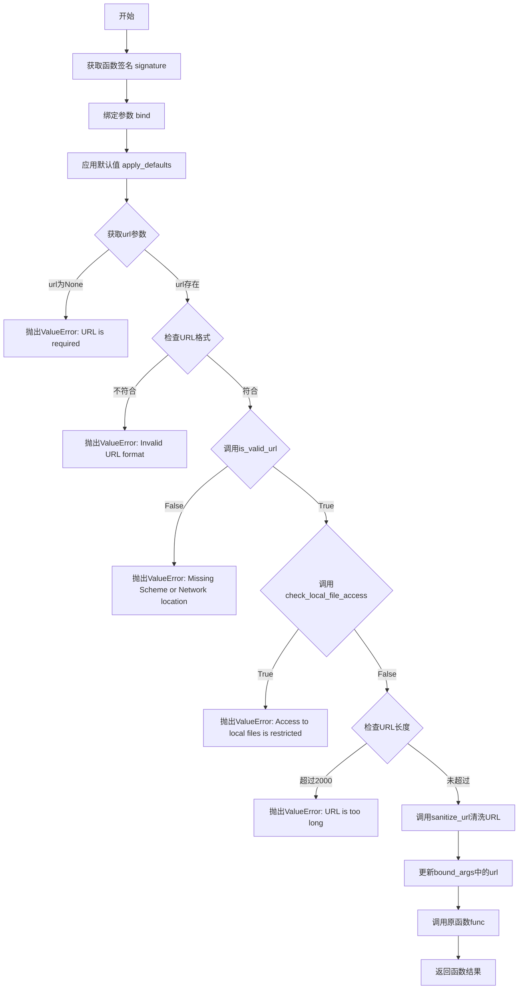
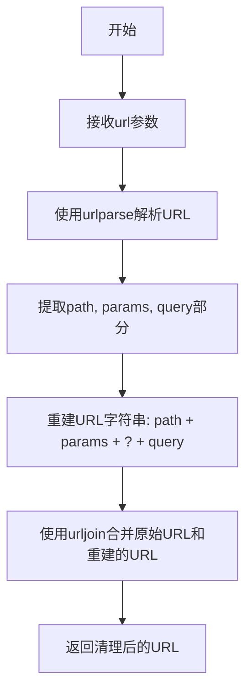
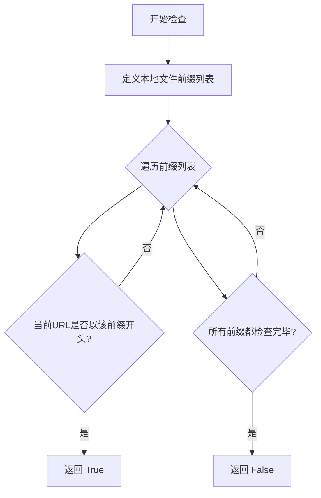

# `.\AutoGPT\classic\forge\forge\utils\url_validator.py` 详细设计文档

这是一个URL验证和处理工具模块，通过装饰器模式对需要URL参数的函数进行统一的URL验证和清理，包括检查URL格式、有效性、本地文件访问和长度限制等功能。

## 整体流程

```mermaid
graph TD
A[开始] --> B[validate_url装饰器被调用]
B --> C[获取函数签名并绑定参数]
C --> D{url参数是否存在?}
D -- 否 --> E[抛出ValueError: URL is required]
D -- 是 --> F{URL是否以http://或https://开头?}
F -- 否 --> G[抛出ValueError: Invalid URL format]
F -- 是 --> H{URL是否有效?]
H -- 否 --> I[抛出ValueError: Missing Scheme or Network location]
H -- 是 --> J{是否为本地文件?]
J -- 是 --> K[抛出ValueError: Access to local files is restricted]
J -- 否 --> L{URL长度是否超过2000?}
L -- 是 --> M[抛出ValueError: URL is too long]
L -- 否 --> N[sanitize_url清理URL]
N --> O[调用原函数并返回结果]
```

## 类结构

```
模块级 (无类)
├── 全局类型定义
│   ├── P (ParamSpec)
│   └── T (TypeVar)
└── 全局函数
    ├── validate_url (装饰器)
    ├── is_valid_url (工具函数)
    ├── sanitize_url (工具函数)
    └── check_local_file_access (工具函数)
```

## 全局变量及字段


### `P`
    
用于函数签名参数规格化的类型变量，支持高阶函数类型推导

类型：`ParamSpec`
    


### `T`
    
用于函数返回值类型化的类型变量，支持泛型函数返回类型推断

类型：`TypeVar`
    


    

## 全局函数及方法


### `validate_url`

URL验证装饰器，对函数参数中的URL进行完整验证，包括URL格式检查、有效性验证、本地文件访问限制、长度限制以及URL清洗，确保传入的URL符合安全要求后执行原函数。

参数：

- `func`：`Callable[P, T]`，被装饰的函数，接收任意参数并返回任意类型

返回值：`Callable[P, T]`，装饰后的包装函数，执行URL验证后调用原函数

#### 流程图



#### 带注释源码

```python
import functools
import re
from inspect import signature
from typing import Callable, ParamSpec, TypeVar
from urllib.parse import urljoin, urlparse

# 定义类型变量，用于装饰器的泛型参数保留
P = ParamSpec("P")
T = TypeVar("T")


def validate_url(func: Callable[P, T]) -> Callable[P, T]:
    """
    The method decorator validate_url is used to validate urls for any command that
    requires a url as an argument.
    """
    # 使用functools.wraps保持原函数的元数据（__name__, __doc__等）
    @functools.wraps(func)
    def wrapper(*args, **kwargs):
        # 1. 获取原函数的签名对象
        sig = signature(func)
        
        # 2. 绑定位置参数和关键字参数到函数签名
        bound_args = sig.bind(*args, **kwargs)
        
        # 3. 应用函数定义中的默认值
        bound_args.apply_defaults()

        # 4. 从绑定参数中获取名为"url"的参数
        url = bound_args.arguments.get("url")
        
        # 5. 检查URL参数是否存在，如不存在则抛出异常
        if url is None:
            raise ValueError("URL is required for this function")

        # 6. 使用正则表达式检查URL必须以http://或https://开头
        if not re.match(r"^https?://", url):
            raise ValueError(
                "Invalid URL format: URL must start with http:// or https://"
            )
        
        # 7. 验证URL是否具有有效的scheme和netloc（网络位置）
        if not is_valid_url(url):
            raise ValueError("Missing Scheme or Network location")
        
        # 8. 检查URL是否为本地文件访问，如是则拒绝
        if check_local_file_access(url):
            raise ValueError("Access to local files is restricted")
        
        # 9. 检查URL长度是否超过2000字符的限制
        if len(url) > 2000:
            raise ValueError("URL is too long")

        # 10. 对URL进行清洗处理，去除潜在的恶意部分
        bound_args.arguments["url"] = sanitize_url(url)

        # 11. 使用验证并清洗后的参数调用原函数，返回其结果
        return func(*bound_args.args, **bound_args.kwargs)

    return wrapper  # type: ignore


def is_valid_url(url: str) -> bool:
    """Check if the URL is valid

    Args:
        url (str): The URL to check

    Returns:
        bool: True if the URL is valid, False otherwise
    """
    try:
        # 使用urlparse解析URL，检查是否具有scheme和netloc
        result = urlparse(url)
        return all([result.scheme, result.netloc])
    except ValueError:
        return False


def sanitize_url(url: str) -> str:
    """Sanitize the URL

    Args:
        url (str): The URL to sanitize

    Returns:
        str: The sanitized URL
    """
    # 解析URL获取各个组成部分
    parsed_url = urlparse(url)
    # 重新构建URL，仅保留path、params和query部分
    reconstructed_url = f"{parsed_url.path}{parsed_url.params}?{parsed_url.query}"
    # 使用urljoin将清洗后的路径与原始URL的base（scheme+netloc）结合
    return urljoin(url, reconstructed_url)


def check_local_file_access(url: str) -> bool:
    """Check if the URL is a local file

    Args:
        url (str): The URL to check

    Returns:
        bool: True if the URL is a local file, False otherwise
    """
    # 定义本地文件前缀列表
    local_file_prefixes = [
        "file:///",
        "file://localhost",
    ]

    # 检查URL是否以任何本地文件前缀开头
    return any(url.startswith(prefix) for prefix in local_file_prefixes)
```


### `is_valid_url`

该函数用于验证URL是否具有有效的scheme（协议）和netloc（网络位置），通过Python的`urlparse`解析URL并检查这两个关键组成部分是否存在且非空，若解析过程中抛出异常则返回False。

参数：

- `url`：`str`，要检查的URL字符串

返回值：`bool`，如果URL具有有效的scheme和netloc则返回True，否则返回False

#### 流程图

```mermaid
flowchart TD
    A[开始: 传入url参数] --> B[调用urlparse解析URL]
    B --> C{解析是否抛出异常?}
    C -->|是| D[返回False]
    C -->|否| E[检查scheme是否存在]
    E --> F{scheme非空?}
    F -->|否| D
    F -->|是| G[检查netloc是否存在]
    G -->{netloc非空?}
    G -->|否| D
    G -->|是| H[返回True]
```

#### 带注释源码

```python
def is_valid_url(url: str) -> bool:
    """Check if the URL is valid

    Args:
        url (str): The URL to check

    Returns:
        bool: True if the URL is valid, False otherwise
    """
    try:
        # 使用urllib.parse的urlparse解析URL字符串
        # 该函数会返回一个ParseResult对象，包含scheme, netloc, path等属性
        result = urlparse(url)
        
        # 检查解析结果是否同时具有有效的scheme和netloc
        # scheme: 协议部分（如http, https）
        # netloc: 网络位置部分（如example.com, localhost:8080）
        # all([...])确保两者都存在且非空
        return all([result.scheme, result.netloc])
    except ValueError:
        # 如果URL格式严重错误导致urlparse抛出ValueError
        # （如空字符串或非法字符），返回False
        return False
```


### `sanitize_url`

清理和重建URL，去除fragment（锚点）等部分，同时保留URL的scheme和netloc信息，返回一个干净的URL字符串。

参数：

- `url`：`str`，需要清理的原始URL

返回值：`str`，清理后的URL

#### 流程图



#### 带注释源码

```python
def sanitize_url(url: str) -> str:
    """Sanitize the URL
    清理URL，去除fragment等不必要部分

    Args:
        url (str): The URL to sanitize
                  需要清理的原始URL

    Returns:
        str: The sanitized URL
             清理后的URL字符串
    """
    # 使用urlparse解析URL，得到URL的各个组成部分
    # 包含: scheme, netloc, path, params, query, fragment
    parsed_url = urlparse(url)
    
    # 重建URL，只保留path、params和query部分
    # 这样可以去除fragment（锚点）和其他可能不需要的部分
    reconstructed_url = f"{parsed_url.path}{parsed_url.params}?{parsed_url.query}"
    
    # 使用urljoin将重建的URL与原始URL的基础部分合并
    # 这样可以保留原始URL的scheme和netloc信息
    return urljoin(url, reconstructed_url)
```


### `check_local_file_access`

检查 URL 是否为本地文件访问（以 `file://` 协议开头），用于安全防护，防止用户通过 URL 参数访问本地文件系统。

参数：

- `url`：`str`，需要检查的 URL 字符串

返回值：`bool`，如果 URL 是本地文件访问（以 `file:///` 或 `file://localhost` 开头）则返回 `True`，否则返回 `False`

#### 流程图



#### 带注释源码

```python
def check_local_file_access(url: str) -> bool:
    """Check if the URL is a local file

    Args:
        url (str): The URL to check

    Returns:
        bool: True if the URL is a local file, False otherwise
    """
    # List of local file prefixes
    # 定义本地文件协议的前缀列表，用于检测潜在的本地文件访问
    local_file_prefixes = [
        "file:///",       # 标准本地文件协议前缀
        "file://localhost",  # 使用localhost的本地文件协议
    ]

    # 使用 any() 检查 URL 是否以任一本地文件前缀开头
    # 返回 True 表示检测到本地文件访问，返回 False 表示安全
    return any(url.startswith(prefix) for prefix in local_file_prefixes)
```

## 关键组件


### URL验证装饰器 (validate_url)

用于验证需要URL参数的函数的装饰器，执行多项安全检查包括URL格式、有效性、本地文件访问和长度限制

### URL有效性检查函数 (is_valid_url)

使用urlparse验证URL是否包含必要的scheme和netloc组件

### URL净化函数 (sanitize_url)

通过重新构建URL路径、参数和查询字符串来净化URL，移除scheme和netloc部分

### 本地文件访问检查函数 (check_local_file_access)

检查URL是否为本地文件协议（file:///或file://localhost），防止本地文件访问

### 类型变量定义 (P, T)

使用ParamSpec和TypeVar实现装饰器的类型安全，保持被装饰函数的签名和返回类型

### URL长度验证

在validate_url装饰器中检查URL长度是否超过2000字符限制


## 问题及建议


### 已知问题

-   **装饰器参数名硬编码**：`validate_url` 装饰器硬编码了参数名 `"url"`，无法适配不同参数名的函数，缺乏灵活性
-   **sanitize_url 破坏 URL 结构**：该函数使用 `urljoin` 仅用 path、params、query 重建 URL，会丢失 scheme 和 netloc，导致 URL 失效
-   **不必要的列表创建**：`is_valid_url` 中使用 `all([result.scheme, result.netloc])` 创建了列表，应使用 `all((result.scheme, result.netloc))` 或直接 `all([result.scheme, result.netloc])`
-   **本地文件检查不完整**：`check_local_file_access` 仅检查 `file:///` 和 `file://localhost` 前缀，遗漏了其他本地文件形式（如 `file://127.0.0.1`、`file:/` 等）
-   **URL 长度验证位置不当**：在 `sanitize_url` 之前验证长度，但 sanitize 可能会改变 URL 长度，验证逻辑不够严谨
-   **类型注解不完整**：`wrapper` 函数缺少返回类型注解
-   **缺少对 fragment 和认证信息的处理**：URL 中的 `#fragment` 和 `user:password@` 部分未被考虑
-   **错误信息不够具体**：未区分不同验证失败的具体原因，不利于调试

### 优化建议

-   **解耦装饰器与参数名**：将参数名作为可选配置项传入，或通过类型注解自动检测
-   **修复 sanitize_url 逻辑**：保留 scheme、netloc、query 和 fragment，仅对 path 进行清理
-   **优化 is_valid_url**：移除不必要的列表创建，提高性能
-   **扩展本地文件检查**：增加更多本地文件前缀的检测，如 `file://127.0.0.1`、`file:/`、`file:///` 等
-   **调整验证顺序**：先 sanitize 再验证长度，确保最终 URL 符合要求
-   **添加完整类型注解**：为 `wrapper` 添加返回类型 `T`
-   **增强 URL 验证**：考虑 fragment 和认证信息的合法性检查
-   **细化错误信息**：为不同验证失败场景提供具体错误描述，便于问题定位

## 其它


### 设计目标与约束

**设计目标**：
- 提供一个可复用的URL验证装饰器，适用于任何需要URL参数的函数
- 确保所有URL符合HTTP/HTTPS协议规范
- 防止本地文件访问安全风险
- 对URL长度进行限制以防止滥用

**设计约束**：
- URL长度限制为2000字符
- 仅支持http://和https://协议
- 不支持需要认证的URL（无用户名/密码字段验证）
- 使用Python标准库实现，无外部依赖

### 错误处理与异常设计

**ValueError异常场景**：
1. URL参数缺失：抛出"URL is required for this function"
2. URL协议非法：抛出"Invalid URL format: URL must start with http:// or https://"
3. URL无效（缺少scheme或netloc）：抛出"Missing Scheme or Network location"
4. 本地文件访问：抛出"Access to local files is restricted"
5. URL过长：抛出"URL is too long"

**异常处理策略**：
- 所有验证在装饰器wrapper中集中处理
- 验证失败时立即抛出ValueError，不继续执行
- 使用sig.bind()捕获参数绑定错误

### 数据流与状态机

**数据流**：
1. 装饰器接收被装饰函数
2. 调用函数时进入wrapper
3. 通过signature绑定参数
4. 提取url参数进行多层验证
5. 验证通过后进行URL sanitize
6. 更新bound_args并调用原函数
7. 返回原函数结果

**验证流程状态机**：
- 初始状态 → 检查URL存在 → 检查协议前缀 → 检查URL有效性 → 检查本地文件 → 检查长度 → 清理URL → 执行原函数

### 外部依赖与接口契约

**依赖项（标准库）**：
- functools.wraps：装饰器元数据保留
- re：正则表达式匹配
- inspect.signature：函数签名绑定
- typing：类型提示
- urllib.parse：URL解析与构建

**接口契约**：
- 被装饰函数必须包含名为"url"的参数
- url参数类型应为str
- 函数可以有任何返回类型
- 装饰器保留原函数元数据

### 安全性考虑

**安全威胁防护**：
1. 本地文件访问防护：阻止file:///和file://localhost前缀
2. URL长度限制：防止长URL导致的DoS攻击
3. 协议限制：仅允许http/https，防止file/ftp等协议
4. URL sanitize：防止路径遍历攻击

**潜在安全风险**：
- sanitize_url函数可能丢失URL中的fragment（#部分）
- 未验证URL中的恶意查询参数
- 未处理URL编码字符

### 性能考虑

**性能特点**：
- 装饰器在函数调用时执行，每次调用都有额外开销
- urlparse可能存在性能瓶颈
- 正则匹配相对高效

**优化建议**：
- 对于高频调用场景，可考虑缓存验证结果
- 可使用lru_cache缓存is_valid_url结果

### 测试策略

**测试用例建议**：
1. 有效URL通过验证
2. 缺失URL参数抛出异常
3. 非http/https协议抛出异常
4. 无效URL格式抛出异常
5. 本地文件URL抛出异常
6. 超长URL抛出异常
7. sanitize_url正确处理各种URL格式
8. 装饰器保留原函数元数据
9. 带默认参数的函数正确处理

### 使用示例

```python
@validate_url
def fetch_webpage(url: str, timeout: int = 30) -> str:
    """获取网页内容"""
    pass

# 正常使用
result = fetch_webpage("https://example.com")

# 异常情况
fetch_webpage("ftp://example.com")  # ValueError
fetch_webpage("file:///etc/passwd")  # ValueError
fetch_webpage("invalid")  # ValueError
```

### 扩展性考虑

**当前限制**：
- URL长度固定为2000
- 本地文件前缀列表固定
- 无法自定义验证规则

**扩展方向**：
- 可添加配置参数自定义URL最大长度
- 可添加钩子函数自定义验证逻辑
- 可添加白名单/黑名单机制
- 可支持自定义协议

### 常量定义

```python
MAX_URL_LENGTH = 2000
VALID_URL_SCHEMES = ["http", "https"]
LOCAL_FILE_PREFIXES = ["file:///", "file://localhost"]
```

### 版本信息

**当前版本**：1.0.0

**变更历史**：
- v1.0.0：初始版本，包含URL验证、清理和本地文件检查功能


    