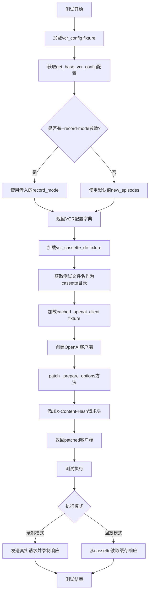
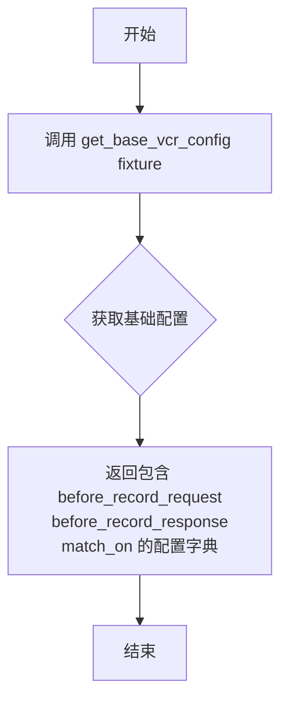
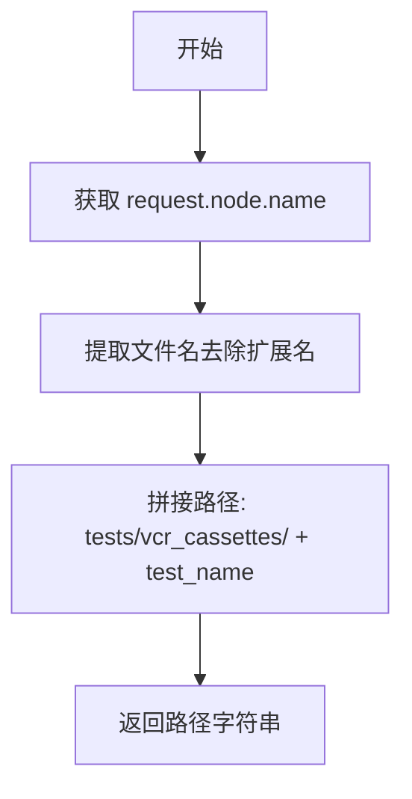
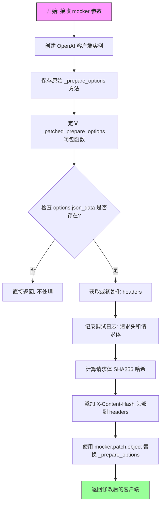
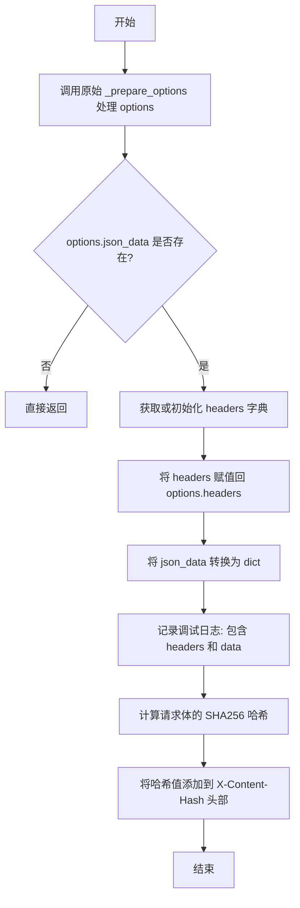

# `.\AutoGPT\classic\forge\tests\vcr\__init__.py` 详细设计文档

这是一个pytest配置文件，提供VCR（Video Cassette Recorder）机制的fixtures用于录制和回放OpenAI API调用，包含请求/响应过滤、内容哈希生成等核心功能，以实现测试的幂等性和离线执行能力。

## 整体流程



## 类结构

```
模块层级（无类定义，全部为模块级函数和fixtures）
└── conftest.py (pytest配置文件)
    ├── fixtures:
    │   ├── vcr_config (session级)
    │   ├── get_base_vcr_config (session级)
    │   ├── vcr_cassette_dir (function级)
    │   └── cached_openai_client (function级)
    └── 全局配置:
        ├── DEFAULT_RECORD_MODE
        └── BASE_VCR_CONFIG
```

## 全局变量及字段


### `DEFAULT_RECORD_MODE`
    
VCR默认的录制模式，设置为'new_episodes'表示录制新的请求响应会话

类型：`str`
    


### `BASE_VCR_CONFIG`
    
VCR的基础配置字典，包含请求/响应拦截器及匹配规则，用于pytest-vcr录制和回放HTTP交互

类型：`dict`
    


    

## 全局函数及方法


### `vcr_config`

这是一个 pytest fixture，用于提供 VCR（Video Cassette Recorder）配置对象，供测试框架在录制和回放 HTTP 请求时使用。它封装了 VCR 的钩子函数和匹配规则，确保测试过程中的 API 调用被正确记录和重放。

参数：

-  `get_base_vcr_config`：`fixture`，提供基础 VCR 配置的 fixture，依赖注入

返回值：`dict`，包含 VCR 配置的字典，键包括 `before_record_request`、`before_record_response` 和 `match_on`，用于控制请求/响应的过滤和匹配策略

#### 流程图



#### 带注释源码

```python
# 定义会话级别的 pytest fixture，名称为 vcr_config
@pytest.fixture(scope="session")
def vcr_config(get_base_vcr_config):
    """
    VCR 配置 fixture
    
    参数:
        get_base_vcr_config: 依赖的基础配置 fixture，用于获取 VCR 的配置字典
        
    返回:
        dict: 包含 VCR 钩子和匹配规则的配置对象
    """
    # 直接返回基础配置 fixture 的结果
    return get_base_vcr_config
```


### `get_base_vcr_config`

这是一个 pytest fixture，用于生成 VCR（Video Cassette Recorder）测试配置。它从 pytest 命令行参数中获取录制模式，若未指定则使用默认的 "new_episodes" 模式，并返回包含请求/响应过滤器和匹配规则的 VCR 配置字典。

参数：

- `request`：`<class 'pytest.FixtureRequest'>`，pytest 的请求对象，用于访问测试配置和命令行选项

返回值：`<class 'dict'>`，包含 VCR 录制配置的字典，包括 `before_record_request`、`before_record_response`、`match_on` 等键，以及可选的 `record_mode`

#### 流程图

```mermaid
flowchart TD
    A[开始: get_base_vcr_config] --> B[从 request.config 获取 --record-mode 参数]
    B --> C{record_mode 是否为 None?}
    C -->|是| D[设置 config['record_mode'] = DEFAULT_RECORD_MODE]
    C -->|否| E[保持原 config 不变]
    D --> F[返回 config]
    E --> F
```

#### 带注释源码

```python
@pytest.fixture(scope="session")
def get_base_vcr_config(request):
    """
    生成基础 VCR 配置的 pytest fixture。
    从命令行参数获取录制模式，生成用于 VCR 磁带录制的配置字典。
    
    参数:
        request: pytest 的请求对象，包含配置信息
        
    返回:
        包含 VCR 配置的字典，用于决定如何录制和匹配 HTTP 请求/响应
    """
    # 从 pytest 配置获取 --record-mode 选项，默认为 "new_episodes"
    record_mode = request.config.getoption("--record-mode", default="new_episodes")
    
    # 使用全局基础配置（包含请求/响应过滤器和匹配规则）
    config = BASE_VCR_CONFIG

    # 如果未指定录制模式，则设置为默认模式
    if record_mode is None:
        config["record_mode"] = DEFAULT_RECORD_MODE

    # 返回最终配置字典
    return config
```


### `vcr_cassette_dir`

该函数是一个 pytest fixture，用于动态生成测试用例对应的 VCR 录像带目录路径。它通过获取当前测试函数的名称，并将其与基础 cassettes 目录路径拼接，形成针对性的录像文件存放位置。

参数：

- `request`：Pytest 的 `request` 对象，用于访问当前测试节点的信息

返回值：`str`，返回 VCR 录像带目录的绝对路径，格式为 `tests/vcr_cassettes/{测试函数名}`

#### 流程图



#### 带注释源码

```python
@pytest.fixture()
def vcr_cassette_dir(request):
    """
    Pytest fixture，用于获取当前测试用例对应的 VCR 录像带目录路径。
    
    该 fixture 会根据测试函数的名称动态生成录像带存储目录，
    使得每个测试函数都有独立的录像带目录，便于管理和维护。
    """
    # 从 request 对象中获取当前测试节点的名称（包含测试函数名和模块信息）
    test_name = os.path.splitext(request.node.name)[0]
    
    # 使用 os.path.join 将基础目录与测试名称拼接，形成完整的录像带目录路径
    # 例如：测试函数名为 test_api_get_user.pytest -> tests/vcr_cassettes/test_api_get_user
    return os.path.join("tests/vcr_cassettes", test_name)
```


### `cached_openai_client`

这是一个 pytest fixture 函数，用于创建一个定制化的 OpenAI 客户端实例。该客户端通过 patch `_prepare_options` 方法来拦截 API 请求，并自动为每个请求添加 `X-Content-Hash` 头部（基于请求体的 SHA256 哈希值），以便在 VCR cassette 回放时实现快速且低成本的内容匹配。

参数：

- `mocker`：`MockerFixture`，pytest-mock 提供的 fixture，用于创建 mock 对象和 patch 对象

返回值：`OpenAI`，返回配置好的 OpenAI 客户端实例

#### 流程图



#### 带注释源码

```python
@pytest.fixture
def cached_openai_client(mocker: MockerFixture) -> OpenAI:
    """
    创建一个带有请求体哈希功能的 OpenAI 客户端 fixture。
    
    该 fixture 会拦截所有 API 请求，计算请求体的 SHA256 哈希值，
    并将其添加到请求头中，以便在 VCR 测试中实现精确的请求匹配。
    
    参数:
        mocker: pytest-mock 提供的 MockerFixture，用于创建 mock 对象
        
    返回:
        配置了自定义 _prepare_options 方法的 OpenAI 客户端实例
    """
    # 1. 创建标准的 OpenAI 客户端实例
    client = OpenAI()
    
    # 2. 保存原始的 _prepare_options 方法引用，以便在 patched 版本中调用
    _prepare_options = client._prepare_options

    # 3. 定义 patched _prepare_options 函数，用于拦截和修改请求选项
    def _patched_prepare_options(self, options: FinalRequestOptions):
        """
        拦截并修改请求选项的内部方法。
        
        参数:
            self: OpenAI 客户端实例（隐式传入）
            options: 最终请求选项对象，包含请求头、请求体等信息
        """
        # 3.1 先调用原始方法，保持原有逻辑不变
        _prepare_options(options)

        # 3.2 如果没有 JSON 数据，直接返回，不进行处理
        if not options.json_data:
            return

        # 3.3 获取现有的 headers，如果没有则初始化为空字典
        # 使用 is_given 检查 headers 是否明确给定
        headers: dict[str, str | Omit] = (
            {**options.headers} if is_given(options.headers) else {}
        )
        
        # 3.4 将处理后的 headers 写回 options
        options.headers = headers
        
        # 3.5 将 json_data 转换为 dict 类型以便处理
        data = cast(dict, options.json_data)

        # 3.6 记录调试日志，输出请求头和请求体内容
        logging.getLogger("cached_openai_client").debug(
            f"Outgoing API request: {headers}\n{data if data else None}"
        )

        # 3.7 计算请求体的 SHA256 哈希值
        # 使用 freeze_request_body 标准化请求体，确保一致性
        content_hash = sha256(
            freeze_request_body(data), usedforsecurity=False
        ).hexdigest()
        
        # 3.8 将哈希值添加到请求头，供 VCR 回放时匹配使用
        headers["X-Content-Hash"] = content_hash

    # 4. 使用 mocker 替换客户端的 _prepare_options 方法
    # 这样所有通过该客户端的请求都会经过 patched 版本
    mocker.patch.object(
        client,
        "_prepare_options",
        new=_patched_prepare_options,
    )

    # 5. 返回配置好的客户端实例
    return client
```


### `_patched_prepare_options`

这是一个内部函数（闭包），用于拦截并修改 OpenAI 客户端的请求选项。它在原始 `_prepare_options` 基础上添加了请求体的 SHA256 哈希头部（`X-Content-Hash`），以实现测试时对 cassette 录制的低成本快速匹配，同时记录调试日志。

参数：

- `self`：捕获的外部变量（OpenAI 客户端实例），用于访问原始的 `_prepare_options` 方法
- `options`：`FinalRequestOptions`，来自 openai 库的请求选项对象，包含请求头、请求体等

返回值：`None`，无显式返回值（隐式返回 `None`）

#### 流程图



#### 带注释源码

```python
def _patched_prepare_options(self, options: FinalRequestOptions):
    """
    拦截并修改 OpenAI 客户端的请求选项
    :param self: 捕获的外部变量（OpenAI 客户端实例）
    :param options: FinalRequestOptions 请求选项对象
    """
    # 调用原始的 _prepare_options 方法处理选项
    _prepare_options(options)

    # 如果没有 JSON 数据，直接返回，不进行后续处理
    if not options.json_data:
        return

    # 根据 options.headers 是否已设置，初始化 headers 字典
    # 使用 is_given 检查 headers 是否被显式设置
    headers: dict[str, str | Omit] = (
        {**options.headers} if is_given(options.headers) else {}
    )
    # 将处理后的 headers 赋值回 options 对象
    options.headers = headers
    # 将 json_data 强制转换为字典类型
    data = cast(dict, options.json_data)

    # 记录调试日志，输出请求头和请求体
    logging.getLogger("cached_openai_client").debug(
        f"Outgoing API request: {headers}\n{data if data else None}"
    )

    # 添加 X-Content-Hash 头部，用于 cassette 回放时的低成本快速匹配
    # freeze_request_body 冻结请求体（可能用于标准化处理）
    # usedforsecurity=False 表示不用于安全目的（避免 FIPS 模式问题）
    headers["X-Content-Hash"] = sha256(
        freeze_request_body(data), usedforsecurity=False
    ).hexdigest()
```

## 关键组件


### 核心功能概述

该代码是一个 pytest 测试夹具模块，用于为 OpenAI API 测试提供 HTTP 请求的录制与回放（VCR）功能，通过修改 OpenAI 客户端添加请求体哈希头部来实现高效的请求匹配和缓存管理。

### 关键组件

#### VCR 配置管理模块

VCR 配置管理组件，负责定义请求/响应的预处理函数和匹配规则，是整个录制回放机制的基础配置。

#### 命令行录制模式解析

根据 `--record-mode` 参数动态配置 VCR 录制模式，支持灵活控制 cassettes 的创建策略。

#### 测试用例 cassette 目录定位

自动根据测试函数名称生成对应的 cassette 存储目录路径，实现测试用例与录制文件的对应管理。

#### OpenAI 客户端请求拦截与哈希处理

修改 OpenAI 客户端的内部方法，在请求发送前注入 X-Content-Hash 头部，使用 SHA256 算法对请求体进行哈希，用于后续 cassette 回放时的快速匹配。

## 问题及建议


### 已知问题

-   **全局配置被直接修改**：在`get_base_vcr_config`中直接修改`config`字典（`config["record_mode"] = DEFAULT_RECORD_MODE`），而`config`引用的是`BASE_VCR_CONFIG`这个全局常量，可能导致意外的状态污染
-   **类型混用风险**：`headers`变量类型标注为`dict[str, str | Omit]`，但`Omit`类型是OpenAI内部类型，与普通字典操作混用可能导致类型不一致和行为异常
-   **方法绑定问题**：在`cached_openai_client`中定义的`_patched_prepare_options`使用普通函数定义而非绑定方法，`self`参数实际不会被使用，但这种模式可能导致未来维护时的混淆
-   **缺少空值检查**：`freeze_request_body(data)`调用前未检查`data`是否为有效字典，如果`data`为`None`或格式异常可能导致运行时错误
-   **日志记录无保护**：直接访问`options.json_data`并记录日志，未考虑`json_data`可能不存在或为`None`的情况
-   **硬编码路径**：`"tests/vcr_cassettes"`路径硬编码，缺乏灵活配置机制

### 优化建议

-   **深拷贝配置**：在`get_base_vcr_config`中使用`copy.deepcopy(BASE_VCR_CONFIG)`创建配置副本，避免修改全局常量
-   **添加类型守卫**：在访问`options.json_data`前使用`is_given()`或类似守卫，确保数据有效性
-   **重构patch逻辑**：考虑使用`unittest.mock.patch`或更明确的fixture作用域控制，避免跨测试的状态残留
-   **路径配置化**：将cassette目录改为可配置的fixture参数，支持不同项目结构
-   **错误处理封装**：对`freeze_request_body`和`sha256`调用添加try-except包装，提供更友好的错误信息
-   **日志级别可配置**：考虑从fixture参数或环境变量读取日志级别，提高测试运行时的灵活性

## 其它


### 设计目标与约束

该模块旨在为OpenAI API调用提供测试级别的缓存机制，通过VCR（Video Cassette Recorder）模式录制和回放HTTP请求，避免在测试环境中重复调用昂贵的API资源。核心约束包括：仅支持OpenAI官方Python客户端、依赖pytest框架、cassette文件存储在指定目录、请求body必须可哈希。

### 错误处理与异常设计

代码中未显式处理异常，主要依赖底层库（OpenAI客户端、VCR、pytest）自然传播异常。潜在异常场景包括：VCR配置缺失导致录制失败、cassette文件不存在导致回放失败、网络请求超时、OpenAI API密钥未配置等。建议在`cached_openai_client` fixture中添加try-except捕获关键异常（如哈希计算失败、header设置失败），并提供有意义的错误信息。

### 数据流与状态机

数据流如下：测试请求 → OpenAI客户端 → `_patched_prepare_options`拦截 → 计算请求body哈希 → 添加`X-Content-Hash` header → VCR拦截器处理 → 写入/读取cassette文件。状态机涉及VCR的录制模式（new_episodes、none、rewind、live）和播放模式的转换，默认为`new_episodes`模式。

### 外部依赖与接口契约

主要外部依赖包括：`openai`（OpenAI官方客户端）、`pytest`（测试框架）、`pytest-mock`（mock工具）、`vcrpy`（VCR库，通过`.vcr_filter`模块隐式依赖）。接口契约方面：`before_record_request`和`before_record_response`来自`.vcr_filter`模块，需符合VCR过滤器签名；`freeze_request_body`函数需返回可哈希的字符串用于SHA256计算。

### 配置与可扩展性

支持通过pytest命令行参数`--record-mode`动态配置VCR录制模式，默认值为"new_episodes"。可扩展方向：支持自定义哈希算法、添加更多请求匹配规则、支持除OpenAI外的其他API客户端、添加缓存过期策略、集成更高级的过滤逻辑。

### 安全性考虑

使用`usedforsecurity=False`的SHA256哈希，避免在某些平台上产生不必要的性能开销。请求body中的敏感信息（如API密钥）需通过VCR的`before_record_request`过滤器脱敏。当前代码未对cassette文件进行加密存储，若包含敏感数据需考虑加密方案。

### 测试覆盖与质量保证

当前代码即测试代码本身，建议补充单元测试验证：哈希计算正确性、header添加逻辑、record_mode参数解析、cassette目录生成逻辑。可使用`pytest-cov`评估测试覆盖率。

    