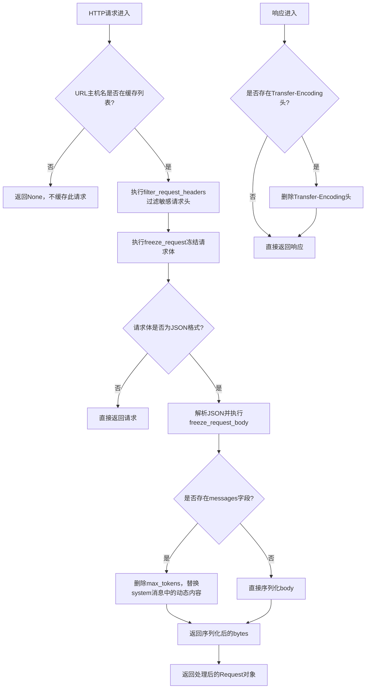
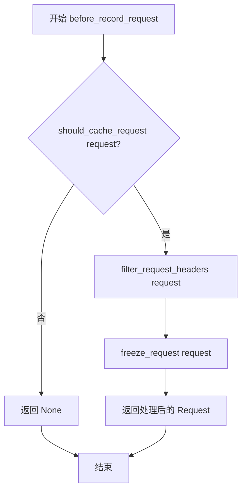
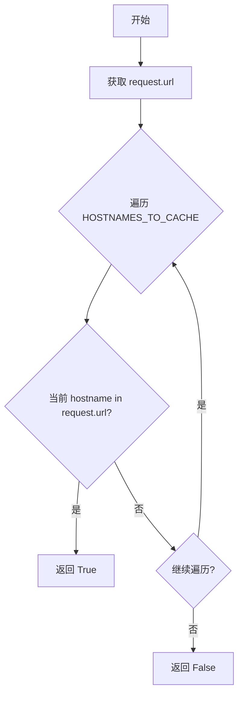
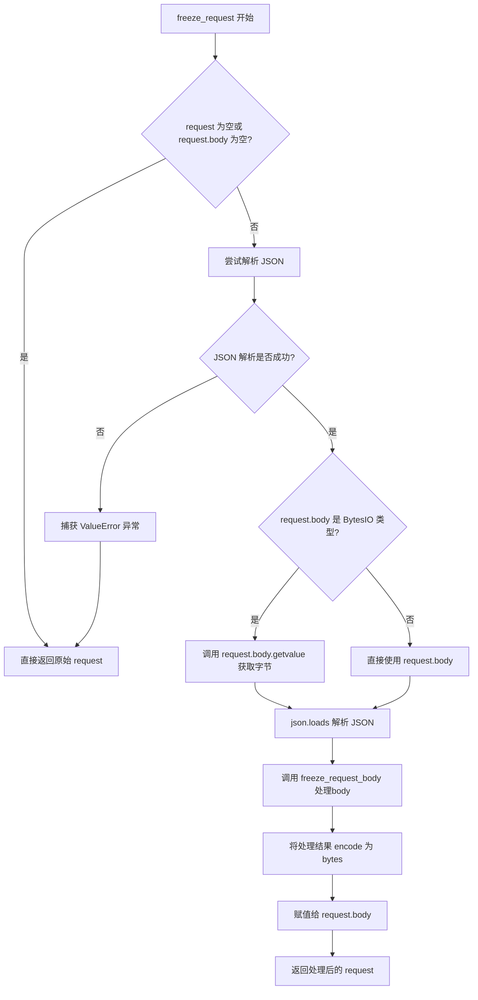
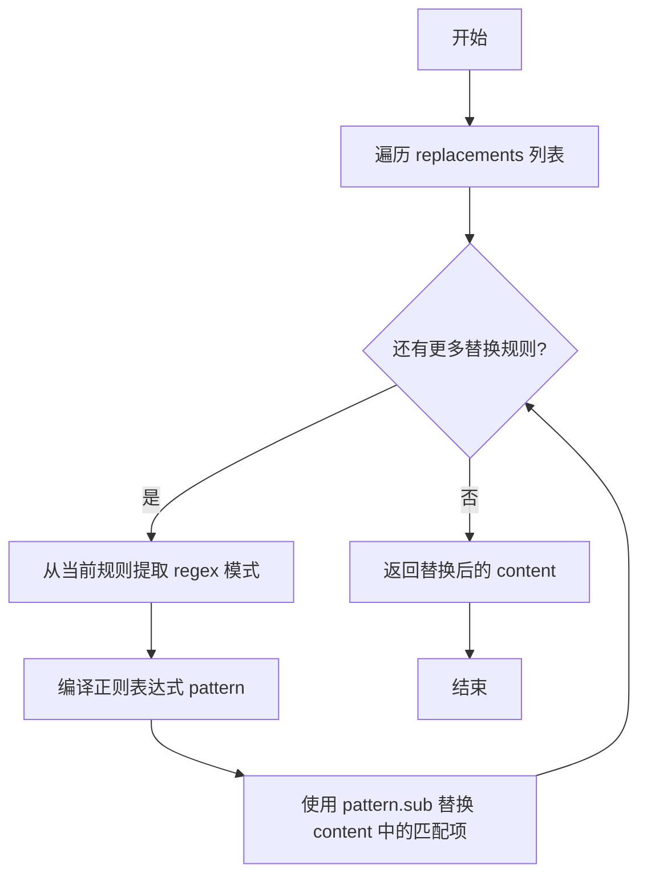

# `.\AutoGPT\classic\forge\tests\vcr\vcr_filter.py` 详细设计文档

这是一个VCR（Video Cassette Recorder）库的请求/响应处理模块，主要用于HTTP请求的录制和回放。代码通过过滤敏感请求头（如Authorization、Cookie）、冻结动态请求体内容（时间戳、WebDriver信息等）、以及清理响应头，实现对API请求的安全缓存，确保录制的内容可以在不泄露隐私信息的情况下被重放。

## 整体流程



## 类结构

```
此文件为函数式编程风格，无类定义
所有功能通过全局函数实现
VCR插件钩子函数: before_record_request, before_record_response
```

## 全局变量及字段


### `HOSTNAMES_TO_CACHE`
    
需要缓存的主机名列表，包含api.openai.com、localhost:50337、duckduckgo.com

类型：`list[str]`
    


### `IGNORE_REQUEST_HEADERS`
    
需要过滤的请求头集合，包含Authorization、Cookie、OpenAI-Organization等，以及X-Stainless-*开头的正则匹配

类型：`set[str | re.Pattern]`
    


### `LLM_MESSAGE_REPLACEMENTS`
    
LLM消息内容替换规则，用于移除时间戳和WebDriver等动态信息

类型：`list[dict[str, str]]`
    


### `OPENAI_URL`
    
OpenAI API的URL常量，值为api.openai.com

类型：`str`
    


    

## 全局函数及方法


### `before_record_request`

这是一个VCR钩子函数，在录制HTTP请求前被调用，负责协调过滤请求头和冻结请求体的操作，以确保录制到的请求不包含敏感信息或动态变化的内容。

参数：

- `request`：`Request`，VCR库中的请求对象，包含URL、 headers、body等信息

返回值：`Request | None`，返回处理后的请求对象；如果不需要缓存该请求则返回`None`

#### 流程图



#### 带注释源码

```python
def before_record_request(request: Request) -> Request | None:
    """
    VCR钩子函数，在录制请求前调用
    负责协调过滤和冻结操作
    
    参数:
        request: VCR的Request对象，包含请求的URL、headers、body等信息
    
    返回值:
        处理后的Request对象，或None（如果不应缓存该请求）
    """
    
    # 第一步：检查该请求是否应该被缓存
    # 通过检查请求URL是否包含在HOSTNAMES_TO_CACHE列表中
    if not should_cache_request(request):
        # 如果不应该缓存，直接返回None，VCR将不记录此请求
        return None

    # 第二步：过滤请求头，移除敏感或动态的HTTP头部
    # 例如：Authorization、Cookie、User-Agent等
    request = filter_request_headers(request)
    
    # 第三步：冻结请求体，将动态内容替换为静态值
    # 例如：时间戳、selenium WebDriver对象等
    request = freeze_request(request)
    
    # 返回处理后的请求，VCR将记录此请求
    return request
```


### `should_cache_request`

判断请求的 URL 是否存在于预定义的需要缓存的主机名列表中，如果存在则返回 `True` 以便对该请求进行缓存录制，否则返回 `False`。

参数：

- `request`：`Request`，VCR 库封装的请求对象，包含 `url` 属性用于获取请求的完整 URL

返回值：`bool`，如果请求 URL 中包含任一缓存主机名则返回 `True`，否则返回 `False`

#### 流程图



#### 带注释源码

```python
def should_cache_request(request: Request) -> bool:
    """
    判断请求是否应该被缓存。
    
    该函数检查请求的 URL 是否包含预定义的主机名列表（HOSTNAMES_TO_CACHE）
    中的任意一个主机名。如果 URL 包含列表中的主机名，则返回 True，表示
    应该对该请求进行缓存；否则返回 False。
    
    缓存的主机名列表包括：
    - "api.openai.com": OpenAI API 端点
    - "localhost:50337": 本地测试服务器
    - "duckduckgo.com": DuckDuckGo 搜索引擎
    
    参数:
        request: VCR 库的 Request 对象，包含请求的 URL 等信息
        
    返回值:
        bool: 如果 URL 包含任一缓存主机名返回 True，否则返回 False
    """
    # 使用 any() 短路求值，只要有一个主机名匹配就返回 True
    return any(hostname in request.url for hostname in HOSTNAMES_TO_CACHE)
```


### `filter_request_headers`

该函数用于过滤 VCR 请求录制过程中的请求头，遍历并删除需要忽略的请求头。支持两种匹配模式：字符串精确匹配（不区分大小写）和正则表达式匹配，用于移除如 Authorization、Cookie 等敏感或动态的请求头。

参数：

- `request`：`Request`，VCR 库中的 Request 对象，包含待处理的请求头信息

返回值：`Request`，返回处理后的 Request 对象，已移除所有需要忽略的请求头

#### 流程图

```mermaid
flowchart TD
    A[开始 filter_request_headers] --> B[获取 request.headers 的列表副本]
    B --> C{遍历 header_name}
    C -->|当前 header| D[检查是否匹配 IGNORE_REQUEST_HEADERS]
    D --> E{是否存在匹配项?}
    E -->|是 - 字符串精确匹配| F[比较 ignore 与 header_name<br/>忽略大小写]
    E -->|是 - 正则表达式匹配| G[使用 ignore.match(header_name)]
    E -->|否| H[不执行删除]
    F --> I[删除 request.headers[header_name]]
    G --> I
    I --> C
    H --> C
    C -->|遍历完成| J[返回 request 对象]
    J --> K[结束]
```

#### 带注释源码

```python
def filter_request_headers(request: Request) -> Request:
    """
    过滤请求头，删除需要忽略的请求头。
    
    支持两种匹配模式：
    1. 字符串精确匹配（不区分大小写）
    2. 正则表达式匹配
    
    Args:
        request: VCR 的 Request 对象
        
    Returns:
        处理后的 Request 对象，已移除需要忽略的请求头
    """
    # 获取 headers 的列表副本，避免在遍历过程中修改字典导致的迭代问题
    for header_name in list(request.headers):
        # 使用 any() 检查当前 header_name 是否匹配 IGNORE_REQUEST_HEADERS 中的任一规则
        if any(
            (
                # 字符串匹配：类型为 str 且忽略大小写比较
                (type(ignore) is str and ignore.lower() == header_name.lower())
                # 正则匹配：类型为 Pattern 且正则表达式匹配成功
                or (isinstance(ignore, re.Pattern) and ignore.match(header_name))
            )
            for ignore in IGNORE_REQUEST_HEADERS
        ):
            # 删除匹配的请求头
            del request.headers[header_name]
    
    # 返回处理后的 request 对象
    return request
```

---

#### 相关全局变量

| 变量名 | 类型 | 描述 |
|--------|------|------|
| `IGNORE_REQUEST_HEADERS` | `set[str \| re.Pattern]` | 需要忽略的请求头集合，包含字符串（如 "Authorization"）和预编译的正则表达式（如 `re.compile(r"X-Stainless-[\w\-]+", re.IGNORECASE)`） |

#### 潜在的技术债务或优化空间

1. **类型检查方式**：使用 `type(ignore) is str` 而非 `isinstance(ignore, str)`，虽然两者在大多数情况下等价，但 `isinstance()` 更为 Pythonic 且支持继承
2. **正则编译位置**：`IGNORE_REQUEST_HEADERS` 中的正则表达式已在模块级别预编译，这是好的做法，但可考虑将其组织为命名元组或 dataclass 以提高可读性
3. **性能考虑**：每次调用都会遍历所有请求头并对每个请求头检查所有忽略规则，可考虑将 IGNORE_REQUEST_HEADERS 拆分为字符串集合和正则列表以优化匹配性能


### `freeze_request`

主请求冻结入口，处理 BytesIO 和普通 body 类型，将请求体中的动态内容（如时间戳、WebDriver 信息等）进行规范化或移除，以便于请求的缓存和重放。

参数：

- `request`：`Request`，VCR 的请求对象，包含 URL、headers、body 等属性

返回值：`Request`，处理后的请求对象，如果解析失败或无需处理则返回原始请求

#### 流程图



#### 带注释源码

```python
def freeze_request(request: Request) -> Request:
    """
    主请求冻结入口
    
    处理 BytesIO 和普通 body 类型，将请求体中的动态内容
    规范化后返回，以便于请求的缓存和重放
    
    参数:
        request: VCR 的请求对象
        
    返回:
        处理后的请求对象
    """
    # 边界检查：如果请求为空或请求体为空，直接返回原始请求
    if not request or not request.body:
        return request

    # 使用 contextlib.suppress 捕获 JSON 解析可能的 ValueError
    # 如果解析失败（如 body 不是有效的 JSON），则忽略错误并返回原始请求
    with contextlib.suppress(ValueError):
        request.body = freeze_request_body(
            json.loads(
                # 根据 body 类型选择获取方式：
                # BytesIO 类型需要调用 getvalue() 方法获取内容
                # 普通 bytes/str 类型直接使用
                request.body.getvalue()
                if isinstance(request.body, BytesIO)
                else request.body
            )
        )

    return request
```


### `freeze_request_body`

该函数是请求体冻结的核心逻辑，负责从 LLM 请求体中移除动态内容。具体来说，它会删除 `max_tokens` 字段以确保请求的确定性，并使用预定义的正则表达式替换规则清洗 `system` 角色消息中的动态内容（如时间戳、Selenium WebDriver 信息等），最终将处理后的字典序列化为 JSON 字节串返回。

参数：

- `body`：`dict`，请求体的字典对象，包含了 LLM API 调用的消息内容和其他参数

返回值：`bytes`，经过处理（删除 `max_tokens`、替换 `system` 消息动态内容）后的 JSON 编码字节串

#### 流程图

```mermaid
flowchart TD
    A([开始 freeze_request_body]) --> B{body 中有 'messages' 键?}
    B -->|否| C[直接对 body 进行 JSON 序列化<br/>sort_keys=True 编码为 bytes]
    C --> Z([返回 bytes])
    B -->|是| D{body 中有 'max_tokens' 键?}
    D -->|是| E[删除 body['max_tokens'] 字段]
    D -->|否| F[跳过删除步骤]
    E --> F
    F --> G[遍历 body['messages'] 列表]
    G --> H{当前消息有 'content' 和 'role'?}
    H -->|否| I[继续下一条消息]
    H -->|是| J{当前消息 role == 'system'?}
    J -->|否| I
    J -->|是| K[调用 replace_message_content<br/>替换 message['content'] 中的动态内容]
    K --> I
    I --> L{消息列表遍历完成?}
    L -->|否| G
    L -->|是| M[对处理后的 body 进行 JSON 序列化<br/>sort_keys=True 编码为 bytes]
    M --> Z
```

#### 带注释源码

```python
def freeze_request_body(body: dict) -> bytes:
    """Remove any dynamic items from the request body"""

    # 如果请求体中没有 'messages' 字段，说明不是聊天补全请求
    # 直接将整个 body 序列化为 JSON 字节串返回
    if "messages" not in body:
        return json.dumps(body, sort_keys=True).encode()

    # 删除 'max_tokens' 参数，该参数用于控制生成文本的长度
    # 不同的 max_tokens 会导致不同的生成结果，因此需要移除以保证请求确定性
    if "max_tokens" in body:
        del body["max_tokens"]

    # 遍历所有消息，对 system 角色的消息进行动态内容替换
    for message in body["messages"]:
        # 只有同时包含 content 和 role 的消息才需要处理
        if "content" in message and "role" in message:
            # system 消息通常包含系统提示词，可能包含动态生成的内容
            # （如时间戳、运行环境信息等），需要统一替换为静态值
            if message["role"] == "system":
                message["content"] = replace_message_content(
                    message["content"], LLM_MESSAGE_REPLACEMENTS
                )

    # 将处理后的 body 字典序列化为 JSON 字节串返回
    # sort_keys=True 保证键的顺序一致，进一步增强确定性
    return json.dumps(body, sort_keys=True).encode()
```


### `replace_message_content`

使用正则表达式替换消息内容中的动态数据，将匹配到的内容替换为指定的静态值，常用于缓存请求时移除动态时间戳等变化内容，以确保相同内容的请求能够被正确命中缓存。

参数：

- `content`：`str`，需要替换的原始消息内容
- `replacements`：`list[dict[str, str]]`，替换规则列表，每个字典包含"regex"（正则表达式模式）和"replacement"（替换目标字符串）键

返回值：`str`，替换后的消息内容

#### 流程图



#### 带注释源码

```python
def replace_message_content(content: str, replacements: list[dict[str, str]]) -> str:
    """
    使用正则表达式替换消息内容中的动态数据
    
    参数:
        content: 需要替换的原始消息内容
        replacements: 替换规则列表，每个字典包含 'regex' 和 'replacement' 键
    
    返回:
        替换后的消息内容
    """
    # 遍历每一个替换规则
    for replacement in replacements:
        # 从当前规则中提取正则表达式模式字符串
        pattern = re.compile(replacement["regex"])
        # 使用正则表达式替换内容中的匹配项，并更新 content
        content = pattern.sub(replacement["replacement"], content)

    # 返回最终替换后的内容
    return content
```


### `before_record_response`

该函数是一个 VCR（Video Cassette Recorder）钩子函数，用于在录制 HTTP 响应时移除 `Transfer-Encoding` 头，确保录制文件的一致性和可重现性。

参数：

- `response`：`dict[str, Any]`，HTTP 响应字典，包含 headers、body 等字段

返回值：`dict[str, Any]`，处理后的响应字典，已移除 Transfer-Encoding 头

#### 流程图

```mermaid
flowchart TD
    A[开始] --> B{response['headers'] 中是否存在 'Transfer-Encoding'}
    B -->|是| C[删除 response['headers']['Transfer-Encoding']]
    B -->|否| D[跳过删除步骤]
    C --> E[返回 response]
    D --> E
    E[结束]
```

#### 带注释源码

```python
def before_record_response(response: dict[str, Any]) -> dict[str, Any]:
    """
    VCR 钩子函数：在录制响应前移除 Transfer-Encoding 头
    
    Transfer-Encoding 头表示响应的传输编码方式（如 chunked），
    在录制和回放时可能导致不一致，因此需要移除。
    
    参数:
        response: HTTP 响应字典，通常包含 'status', 'headers', 'body' 等键
        
    返回值:
        处理后的响应字典，移除了 Transfer-Encoding 头（如存在）
    """
    # 检查响应头中是否存在 Transfer-Encoding
    if "Transfer-Encoding" in response["headers"]:
        # 删除该头，避免录制/回放时的不一致问题
        del response["headers"]["Transfer-Encoding"]
    
    # 返回处理后的响应
    return response
```

## 关键组件


### 主机名缓存配置

定义需要缓存请求的目标主机名列表，包含OpenAI API、本地服务DuckDuckGo接口。

### 请求头过滤规则

定义需要从缓存请求中移除的敏感请求头，包括认证信息、Cookie、组织标识等，并支持正则表达式匹配。

### LLM消息替换规则

定义用于移除请求体中动态内容的正则表达式替换规则，如时间戳、Selenium WebDriver对象等。

### 请求过滤入口函数

VCR钩子函数，在记录请求前调用，负责协调整个请求处理流程，判断是否缓存、过滤头信息、冻结请求体。

### 请求URL缓存判断

根据URL中的主机名判断是否应该缓存该请求。

### 请求头过滤器

遍历请求头并移除需要忽略的敏感头信息，支持字符串精确匹配和正则模式匹配。

### 请求体冻结器

将请求体转换为JSON，处理BytesIO类型，调用请求体冻结函数处理动态内容。

### 请求体处理器

核心逻辑函数，移除max_tokens参数，替换system消息中的动态内容（如时间戳、浏览器信息）。

### 消息内容替换器

使用预定义的正则表达式规则替换消息内容中的动态信息，返回处理后的字符串。

### 响应处理器

VCR钩子函数，移除响应头中的Transfer-Encoding字段，确保缓存的响应可重现。


## 问题及建议


### 已知问题

-   **IGNOR_REQUEST_HEADERS 集合类型错误**：`set[str | re.Pattern]` 中的 `re.Pattern` 是不可哈希类型，无法作为集合元素，运行时会导致 `TypeError: unhashable type: 'Pattern'`
-   **freeze_request 异常处理过于宽泛**：使用 `contextlib.suppress(ValueError)` 静默吞掉所有 `ValueError`，可能隐藏 JSON 解析错误等其他问题
-   **正则表达式重复编译**：每次调用 `replace_message_content` 时都会重新编译正则表达式，没有预编译缓存，影响性能
-   **类型注解不完整**：`freeze_request_body` 函数的 `body` 参数类型注解为 `dict`，但实际接收的是 `dict[str, Any]`
-   **未使用的常量**：`OPENAI_URL` 定义后未在任何地方使用，属于死代码
-   **缺少输入校验**：`before_record_response` 直接访问 `response["headers"]`，未检查响应结构是否有效
-   **字符串比较效率低**：`filter_request_headers` 中使用 `.lower()` 每次比较都创建新字符串，可以预先统一大小写

### 优化建议

-   将 `IGNORE_REQUEST_HEADERS` 改为列表 `list[str | re.Pattern]`，或拆分为两个独立列表
-   在模块级别预编译 `LLM_MESSAGE_REPLACEMENTS` 中的正则表达式为 `re.Pattern` 对象
-   使用 `json.JSONDecodeError` 替代宽泛的 `ValueError` 异常捕获，或记录日志
-   补充完整的类型注解，如 `def freeze_request_body(body: dict[str, Any]) -> bytes`
-   移除未使用的 `OPENAI_URL` 常量，或确认其用途
-   在 `before_record_response` 中添加响应结构校验
-   使用 `str.casefold()` 替代多次 `.lower()` 调用以提高字符串比较效率


## 其它


### 设计目标与约束

本模块旨在为VCR（Video Cassette Recorder）提供请求和响应的过滤与规范化功能，使得HTTP请求可以被录制并在后续测试中重放。主要约束包括：仅对特定域名（api.openai.com、localhost:50337、duckduckgo.com）的请求进行缓存处理；需要移除请求中的动态内容（如时间戳、token等）以确保请求的可重复性；响应中需移除Transfer-Encoding头以避免兼容性问题。

### 错误处理与异常设计

代码中主要使用contextlib.suppress(ValueError)来忽略JSON解析失败的情况，当请求body不是有效的JSON格式时，freeze_request函数会静默失败并返回原始请求。should_cache_request函数没有进行空值检查，可能在request.url为None时抛出AttributeError。filter_request_headers函数遍历headers时使用了list()进行复制，避免了迭代过程中修改字典导致的RuntimeError。

### 数据流与状态机

数据流分为请求处理流程和响应处理流程两条主线。请求处理流程：before_record_request入口 → should_cache_request判断是否缓存 → filter_request_headers过滤敏感头 → freeze_request冻结请求体 → 返回处理后的Request对象。响应处理流程：before_record_response入口 → 检查并删除Transfer-Encoding头 → 返回处理后的响应字典。没有复杂的状态机设计，属于纯函数式的数据转换。

### 外部依赖与接口契约

主要依赖包括：vcr.request.Request（VCR库提供的请求对象）、json标准库、re正则表达式、contextlib标准库、io.BytesIO、typing.Any。函数契约：before_record_request接收Request对象返回Request|None；before_record_response接收dict返回dict；freeze_request_body接收dict返回bytes；replace_message_content接收str和list返回str。所有函数都保持了输入类型的兼容性处理。

### 安全性考虑

代码处理了多种敏感请求头（Authorization、Cookie、OpenAI-Organization等），确保缓存的请求不包含认证信息。LLM_MESSAGE_REPLACEMENTS配置中移除了Selenium WebDriver对象信息，防止泄露浏览器自动化痕迹。但需要注意：缓存的请求体可能仍包含用户输入的敏感数据，建议在生产环境对缓存进行加密存储。

### 性能考虑

filter_request_headers中对IGNORE_REQUEST_HEADERS的每次匹配都创建了新的迭代器，re.Pattern对象在每次header检查时都会被使用。freeze_request_body中对body["messages"]的遍历和json.dumps操作在高频调用时可能产生性能开销。建议对re.compile的Pattern对象进行预编译缓存，对大型请求体考虑流式处理或采样策略。

### 配置说明

HOSTNAMES_TO_CACHE定义了需要缓存的域名列表，可通过修改此列表调整缓存范围。IGNORE_REQUEST_HEADERS定义了需要过滤的请求头，支持字符串精确匹配和正则表达式模式匹配。LLM_MESSAGE_REPLACEMENTS定义了消息内容的替换规则，每项包含regex和replacement字段，支持动态添加新的替换规则。OPENAI_URL作为常量定义了OpenAI API域名，当前主要用于文档说明目的。

    