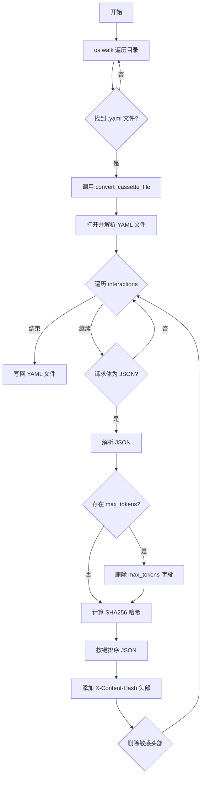
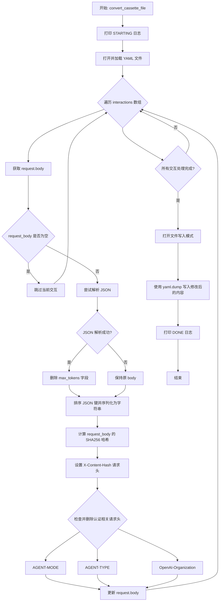

# `.\AutoGPT\classic\forge\tests\vcr_cassettes\format_cassettes.py` 详细设计文档

该脚本是一个 YAML cassette 文件处理器，用于遍历当前目录及子目录中的所有 .yaml 文件，对每个文件中的 HTTP 请求进行标准化处理：解析 JSON 请求体、删除 max_tokens 字段、按键排序、计算内容哈希添加 X-Content-Hash 头部、并移除敏感认证头部（AGENT-MODE、AGENT-TYPE、OpenAI-Organization），最终将处理后的内容写回原文件。

## 整体流程



## 类结构

```
该代码为脚本形式，无类定义
```

## 全局变量及字段


### `cassette_content`
    
YAML文件解析后的内容对象，包含interactions列表

类型：`dict`
    


### `interaction`
    
遍历中的单个交互对象，包含request和response信息

类型：`dict`
    


### `request_body`
    
请求体字符串，可能包含原始JSON字符串或空值

类型：`str`
    


### `request_obj`
    
解析后的请求体JSON对象，用于修改和重新序列化

类型：`dict`
    


### `headers`
    
请求头字典，用于添加Content-Hash和删除认证头

类型：`dict`
    


### `dirpath`
    
os.walk返回的当前遍历的目录路径

类型：`str`
    


### `files`
    
os.walk返回的当前目录下的文件名列表

类型：`list`
    


### `file`
    
循环中当前处理的文件名

类型：`str`
    


    

## 全局函数及方法


### `convert_cassette_file`

该函数是处理单个 cassette 文件的主函数，读取 YAML 格式的 VCR  cassette 文件，解析其中的 JSON 请求体，移除 `max_tokens` 参数、删除认证相关的请求头（如 AGENT-MODE、AGENT-TYPE、OpenAI-Organization），计算请求体的 SHA256 哈希并添加到自定义请求头（X-Content-Hash），最后将修改后的内容写回原文件。

参数：

- `filename`：`str | Path`，cassette 文件的路径

返回值：`None`，无返回值

#### 流程图



#### 带注释源码

```python
def convert_cassette_file(filename: str | Path):
    """
    处理单个 cassette 文件的主函数
    用于标准化 VCR 录制文件中的请求体和请求头
    """
    # 打印开始日志
    print(f"{filename} STARTING")

    # 打开并加载 YAML 格式的 cassette 文件
    with open(filename) as c:
        cassette_content = yaml.load(c, Loader)

    # 遍历 cassette 文件中的所有 request-response 交互
    for interaction in cassette_content["interactions"]:
        # 获取请求体
        request_body: str = interaction["request"]["body"]
        
        # 如果请求体为空，跳过该交互
        if request_body is None:
            continue

        # 尝试解析 JSON 格式的请求体，忽略 JSON 解析错误
        with contextlib.suppress(json.decoder.JSONDecodeError):
            request_obj = json.loads(request_body)

            # 删除 max_tokens 字段，因为只要请求成功，该字段的值无关紧要
            if "max_tokens" in request_obj:
                del request_obj["max_tokens"]

            # 对请求体的键进行排序并重新序列化为字符串
            request_body = json.dumps(request_obj, sort_keys=True)

        # 获取请求头
        headers = interaction["request"]["headers"]

        # 计算请求体的哈希值，用于 VCR 查找
        # 设置 X-Content-Hash 请求头
        headers["X-Content-Hash"] = [
            sha256(request_body.encode(), usedforsecurity=False).hexdigest()
        ]

        # 移除认证相关的请求头
        if "AGENT-MODE" in headers:
            del headers["AGENT-MODE"]
        if "AGENT-TYPE" in headers:
            del headers["AGENT-TYPE"]
        if "OpenAI-Organization" in headers:
            del headers["OpenAI-Organization"]

        # 更新请求体
        interaction["request"]["body"] = request_body

    # 打开文件并写入修改后的内容
    with open(filename, "w") as c:
        c.write(yaml.dump(cassette_content, Dumper=Dumper))

    # 打印完成日志
    print(f"{filename} DONE")
```

## 关键组件


### convert_cassette_file 函数

负责加载、解析和处理 YAML 格式的 cassette 文件，规范化请求体并更新文件内容

### os.walk 文件遍历

遍历当前目录及子目录下所有 .yaml 文件，逐个调用 convert_cassette_file 进行处理

### JSON 请求体解析与规范化

使用 json.loads 解析请求体，删除 max_tokens 字段并对键进行排序，确保请求体一致性

### SHA256 内容哈希计算

使用 sha256 计算请求体的哈希值，并添加到 X-Content-Hash 头部用于 VCR 查找

### 认证头剥离

删除 AGENT-MODE、AGENT-TYPE 和 OpenAI-Organization 等敏感认证头

### YAML 文件读写

使用 yaml.load 加载和 yaml.dump 写入 cassette 文件，使用 CDumper 和 CLoader 优化性能


## 问题及建议


### 已知问题

-   **异常处理不完整**：仅使用 `contextlib.suppress(json.decoder.JSONDecodeError)` 抑制 JSON 解析错误，但未处理 YAML 解析失败、文件读写错误、KeyError 等其他潜在异常，可能导致程序静默失败或崩溃
-   **数据结构缺乏校验**：代码假设 `cassette_content["interactions"]`、`.request`、`.headers`、`.body` 等字段必定存在，未做存在性检查，会抛出 KeyError
-   **文件覆盖无原子性**：先读取文件，处理后直接覆盖原文件，若处理过程中异常中断，会导致原文件损坏且无法恢复
-   **硬编码的 header 字段**：需要删除的认证头（AGENT-MODE、AGENT-TYPE、OpenAI-Organization）硬编码在代码中，扩展性差
-   **Magic String 分散**："X-Content-Hash" 作为魔法字符串出现，缺乏常量定义
- **类型注解不严谨**：`filename` 参数支持 `str | Path`，但后续直接传给 `open()` 未做类型转换处理
- **日志方式不规范**：使用 `print()` 进行日志输出，生产环境应使用 logging 模块
- **目录遍历方式陈旧**：使用 `os.walk` 配合字符串拼接，可改用 `pathlib` 更加 Pythonic

### 优化建议

-   **增强异常处理**：使用 try-except 捕获多种异常类型，对关键操作添加重试机制或事务性回滚
-   **添加数据校验**：使用 `.get()` 方法或显式校验 JSON 结构，确保必需字段存在
-   **实现安全写入**：先写入临时文件，成功后重命名覆盖原文件，或添加备份机制
-   **配置化设计**：将需删除的 header 名称和自定义 header 键定义为常量或配置项
-   **统一日志管理**：替换 print 为 logging 模块，支持不同日志级别和格式配置
-   **采用 pathlib**：使用 `Path.rglob("*.yaml")` 替代 os.walk，提升代码可读性
-   **添加类型转换**：对 Path 对象做 str 转换或直接让 open 支持 Path（Python 3.6+ 已支持）

## 其它


### 设计目标与约束

该脚本的主要设计目标是将cassette文件（YAML格式的HTTP交互记录）中的请求体进行标准化处理，以便用于VCR（Video Cassette Recorder）回放测试。具体约束包括：1）仅处理.yaml和.yml后缀的文件；2）假设cassette文件遵循vcrpy的cassette格式规范；3）仅处理JSON格式的请求体；4）保留所有非JSON请求体不变；5）输出文件覆盖原文件。

### 错误处理与异常设计

脚本使用`contextlib.suppress(json.decoder.JSONDecodeError)`静默处理JSON解析失败的情况，当请求体不是有效JSON时，保留原始body不变。使用`try-except`隐式处理文件读写异常，异常发生时程序会抛出未捕获的异常并终止。`yaml.load`可能抛出yaml.YAMLError，但未做捕获处理。

### 数据流与状态机

脚本遍历目录树读取所有YAML文件，对每个文件进入「加载→解析→转换→写入」的流程。对于每个interaction，状态流为：读取原始request body → 尝试解析JSON → 删除max_tokens字段 → 排序JSON键 → 计算内容哈希 → 更新headers → 序列化body → 写回文件。非JSON body直接跳过处理。

### 外部依赖与接口契约

依赖以下外部库：1）PyYAML（使用C加速的CDumper和CLoader）用于YAML序列化/反序列化；2）标准库json用于JSON处理；3）标准库hashlib用于SHA256哈希计算；4）标准库pathlib用于Path类型支持；5）标准库os和contextlib提供系统级操作。输入文件格式为vcrpy cassette YAML，输出文件格式保持不变。

### 输入输出规格

输入：YAML文件，需包含顶层键"interactions"，每个interaction需包含"request"对象，request对象需包含"body"（字符串）和"headers"（字典）字段。输出：修改后的YAML文件，request.body被重新序列化为规范化的JSON字符串，headers中新增"X-Content-Hash"键，删除"AGENT-MODE"、"AGENT-TYPE"、"OpenAI-Organization"键（如果存在）。

### 假设与前提条件

假设脚本在Python 3.9+环境运行（支持str | Path联合类型注解）。假设cassette文件编码为UTF-8。假设YAML文件结构符合vcrpy规范。假设请求体在JSON解析前已是字符串格式。假设目标目录有写入权限。

### 边界条件与限制

空请求体（request_body为None或空字符串）会被跳过处理。空交互列表（interactions为空列表）会正常写入空文件。无"interactions"键的YAML文件会抛出KeyError。未找到.yaml文件时脚本不执行任何操作静默退出。嵌套目录中如有权限问题会抛出PermissionError。

### 安全性考虑

使用`usedforsecurity=False`参数表明SHA256哈希不用于安全目的。删除敏感Headers（AGENT-MODE、AGENT-TYPE、OpenAI-Organization）避免凭证泄露。直接覆盖原文件，无备份机制，存在数据丢失风险。未对文件路径进行安全校验，可能受路径遍历攻击（虽然当前实现仅遍历"."）。

### 性能特征

文件I/O为性能瓶颈，使用yaml的C扩展加速序列化/反序列化。JSON解析和哈希计算为CPU密集操作，时间复杂度O(n*m)，n为文件数，m为每个文件的交互数。内存占用取决于最大cassette文件大小，解析时需将整个文件加载到内存。

### 日志与监控

使用print输出文件名状态信息，格式为"{filename} STARTING"和"{filename} DONE"。无结构化日志、无错误级别区分、无监控指标。建议添加日志级别控制、错误统计、性能指标采集。

### 测试策略建议

单元测试应覆盖：JSON解析成功/失败场景、max_tokens删除逻辑、JSON键排序、哈希计算正确性、Headers删除逻辑。集成测试应覆盖：空目录、单文件、多文件、嵌套目录、权限错误场景。建议添加pytest框架支持，添加mock测试框架。

    