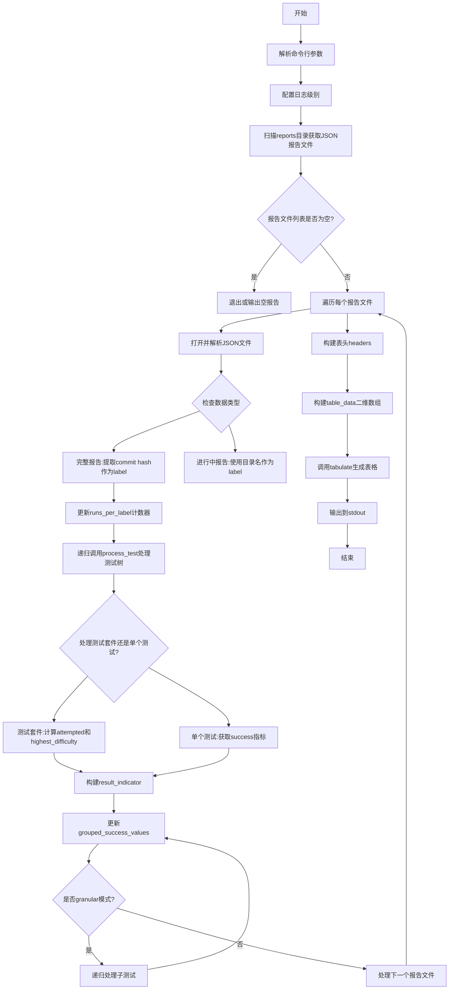
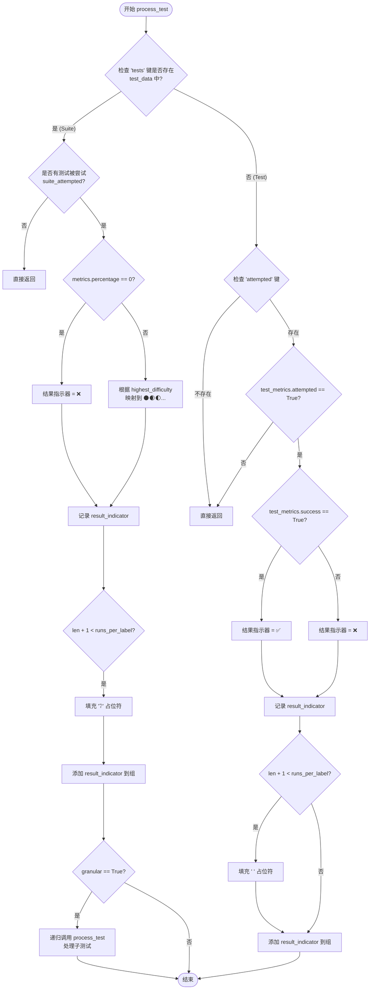
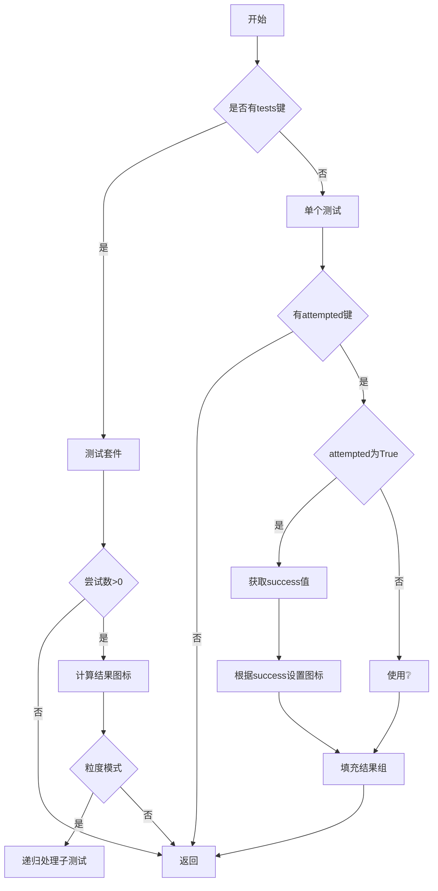

# `.\AutoGPT\classic\original_autogpt\agbenchmark_config\analyze_reports.py` 详细设计文档

该脚本是一个测试报告聚合工具，它扫描reports目录下的JSON格式测试报告文件，解析其中的测试结果数据，按照提交版本（commit hash）分组，并生成一个可视化的表格，展示各测试在不同运行轮次中的成功/失败状态，便于对比不同代码版本的测试通过情况。

## 整体流程



## 类结构

```
无类层次结构 (脚本文件)
└── 模块级代码 (顶层执行逻辑)
    └── process_test (嵌套函数)
```

## 全局变量及字段


### `info`
    
命令行 -v 参数，表示详细输出模式

类型：`bool`
    


### `debug`
    
命令行 -vv 参数，表示调试输出模式

类型：`bool`
    


### `granular`
    
命令行 --granular 参数，表示是否显示详细的子测试结果

类型：`bool`
    


### `logger`
    
logging模块创建的当前模块的日志记录器

类型：`Logger`
    


### `report_files`
    
所有符合条件的报告JSON文件路径列表

类型：`list[Path]`
    


### `labels`
    
所有唯一的历史提交版本标签列表

类型：`list[str]`
    


### `runs_per_label`
    
每个标签对应的运行次数计数器

类型：`defaultdict[str, int]`
    


### `suite_names`
    
测试套件名称列表（当前未实际使用）

类型：`list[str]`
    


### `test_names`
    
所有唯一测试名称的有序列表

类型：`list[str]`
    


### `grouped_success_values`
    
按'标签|测试名'键索引的成功值列表，用于存储每个测试在各次运行中的结果状态

类型：`defaultdict[str, list[str]]`
    


    

## 全局函数及方法


### `process_test`

该函数是一个嵌套函数，负责递归遍历测试树节点。它根据传入的 `test_data` 判断当前节点是测试套件（包含子测试）还是单个测试，然后根据测试的难度（对于套件）或成功与否（对于单个测试）生成对应的 Emoji 指示器（如 ✅、❌、🌑 等），并将这些指示器追加到外层作用域的 `grouped_success_values` 字典中，以构建最终的表格输出。

参数：

-  `test_name`：`str`，测试或测试套件的名称，用于作为结果字典的键标识。
-  `test_data`：`dict`，包含测试指标（metrics）的字典。如果是测试套件，则该字典内部还会包含一个 `tests` 键。

返回值：`None`（无返回值），该函数通过修改闭包中的 `grouped_success_values` 和 `test_names` 来产生副作用。

#### 流程图



#### 带注释源码

```python
def process_test(test_name: str, test_data: dict):
    # 获取当前标签和测试名称组合的结果列表
    result_group = grouped_success_values[f"{label}|{test_name}"]

    # 判断是否为测试套件（如果包含 'tests' 键）
    if "tests" in test_data:
        logger.debug(f"{test_name} is a test suite")

        # --- 测试套件处理逻辑 ---
        # 检查该套件中是否有任何测试被尝试过
        suite_attempted = any(
            test["metrics"]["attempted"] for test in test_data["tests"].values()
        )
        logger.debug(f"suite_attempted: {suite_attempted}")
        if not suite_attempted:
            return # 如果没有尝试任何测试，直接返回

        # 记录套件名称
        if test_name not in test_names:
            test_names.append(test_name)

        # 根据百分比或难度确定 Emoji 指示器
        if test_data["metrics"]["percentage"] == 0:
            result_indicator = "❌"
        else:
            highest_difficulty = test_data["metrics"]["highest_difficulty"]
            result_indicator = {
                "interface": "🔌",
                "novice": "🌑",
                "basic": "🌒",
                "intermediate": "🌓",
                "advanced": "🌔",
                "hard": "🌕",
            }[highest_difficulty]

        # 填充逻辑：如果当前结果组的长度小于该标签下的总运行次数，填充占位符
        logger.debug(f"result group: {result_group}")
        logger.debug(f"runs_per_label: {runs_per_label[label]}")
        if len(result_group) + 1 < runs_per_label[label]:
            result_group.extend(
                ["❔"] * (runs_per_label[label] - len(result_group) - 1)
            )
        
        # 添加当前套件的结果指示器
        result_group.append(result_indicator)
        logger.debug(f"result group (after): {result_group}")

        # 如果开启 granular 模式，递归处理套件内的每一个子测试
        if granular:
            for test_name, test in test_data["tests"].items():
                process_test(test_name, test)
        return

    # --- 单个测试处理逻辑 ---
    test_metrics = test_data["metrics"]
    result_indicator = "❔" # 默认值

    # 检查指标中是否有 attempted 字段
    if "attempted" not in test_metrics:
        return
    elif test_metrics["attempted"]:
        # 记录测试名称
        if test_name not in test_names:
            test_names.append(test_name)

        # 根据 success 布尔值确定结果
        success_value = test_metrics["success"]
        result_indicator = {True: "✅", False: "❌"}[success_value]

    # 填充逻辑：注意单个测试填充的是空格 '  ' 而非 '❔'
    if len(result_group) + 1 < runs_per_label[label]:
        result_group.extend(
            ["  "] * (runs_per_label[label] - len(result_group) - 1)
        )
    result_group.append(result_indicator)
```

## 关键组件


### 命令行参数解析与日志配置

该模块负责解析脚本启动时的命令行参数（-v, -vv, --granular），并根据参数配置Python logging模块的日志级别，用于控制程序运行时的详细程度和信息输出。

### 报告文件发现与遍历

该组件通过Path遍历reports目录，使用正则表达式匹配日期格式（^\d{8}T\d{6}_）的文件夹，并筛选出其中的report.json文件，构建待处理的报告文件列表。

### 数据结构定义

该组件定义了多个全局数据结构用于存储测试运行元数据和结果：labels存储commit哈希或运行ID，runs_per_label记录每个标签的运行次数，test_names收集所有测试名称，grouped_success_values按"label|test_name"键存储分组的结果列表。

### process_test 递归处理函数

该函数是核心逻辑组件，递归处理测试树数据，区分测试套件与单个测试，根据测试难度和执行结果生成对应的Unicode图标（🌑🌒🌓🌔🌕✅❌❔），并处理运行中和完成的测试状态。
- 参数：test_name (str), test_data (dict)
- 返回值：None
- 流程图：


### 结果聚合与表格生成

该组件负责将分组的结果数据转换为适合tabulate库处理的二维列表格式，处理不同运行次数的列对齐，并处理全部为未知状态的结果行清理。

### tabulate 表格输出

该组件使用tabulate库将处理后的数据以grid格式输出到标准输出，展示测试名称与各次运行结果的对齐表格。

### 错误处理机制

该模块捕获JSON解析和KeyError异常，当测试数据缺少预期字段时打印诊断信息并重新抛出异常，用于调试数据格式问题。


## 问题及建议


### 已知问题

-   **类型注解语法错误**：使用了`list[str]()`、`list[str]()`等不正确的语法（应该是`list[str]`作为类型注解，而不是实例化），这会导致运行时错误或行为异常
-   **全局变量过度使用**：存在大量全局变量（`labels`, `runs_per_label`, `suite_names`, `test_names`, `grouped_success_values`），导致代码难以测试、状态难以追踪、并发场景下存在风险
-   **嵌套函数定义**：`process_test`函数在循环内部定义，每次迭代都会重新创建该函数对象，造成性能开销且不利于代码理解和单元测试
-   **魔法值散落各处**：结果指示符如`"❔"`, `"✅"`, `"❌"`, `"🌑"`等和键名如`"tests"`, `"metrics"`, `"attempted"`等硬编码在代码中，应提取为常量类
-   **异常处理过于宽泛**：仅捕获`KeyError`并直接`raise`，其他潜在异常（如`JSONDecodeError`, `FileNotFoundError`, `PermissionError`）未处理，可能导致程序在遇到损坏文件时直接崩溃
-   **数据验证缺失**：未对JSON文件内容进行充分验证，假设特定键必定存在（如`"metrics"`, `"percentage"`, `"highest_difficulty"`），可能引发`KeyError`
-   **目录存在性未检查**：`Path(__file__).parent / "reports"`目录不存在时，代码会静默失败，产生空的`report_files`列表而无任何警告
-   **未使用的变量**：`suite_names`变量被声明但从未使用
-   **日志级别判断逻辑**：`debug`和`info`标志通过命令行参数设置，但日志消息中仍使用`logger.debug()`和`logger.info()`，即使这些级别已被禁用

### 优化建议

-   将全局变量封装到配置类或数据类中，或重构为函数式风格传递状态
-   将`process_test`提取为模块级函数或单独的类（如`TestResultProcessor`）
-   创建常量类`ResultIndicators`和`JsonKeys`集中管理所有硬编码字符串
-   添加完善的JSON schema验证或防御性编程，使用`.get()`方法提供默认值
-   在处理前检查`reports`目录是否存在，不存在时给出明确提示
-   移除未使用的`suite_names`变量
-   考虑使用`argparse`替代简单的`sys.argv`解析，提供更健壮的命令行参数处理
-   对于复杂的字典查找（如难度到图标的映射），可考虑使用`Enum`或`dataclass`增强类型安全

## 其它


### 设计目标与约束

本代码的设计目标是聚合分析多个测试报告JSON文件，按Git提交标签（commit hash）分组展示测试用例的成功/失败状态，并通过直观的emoji指示器帮助开发者快速识别测试结果。核心约束包括：1）仅处理符合命名规范（`\d{8}T\d{6}_`前缀）的报告目录；2）依赖tabulate库进行格式化输出；3）支持`-v`/`-vv`/`--granular`三种命令行选项控制日志级别和详细程度。

### 错误处理与异常设计

代码采用防御式编程策略，主要错误处理包括：1）JSON文件加载失败时通过`logger.info`记录但不中断执行；2）测试树解析缺失`metrics`字段时捕获`KeyError`并打印诊断信息后重新抛出；3）测试套件未尝试运行时通过`suite_attempted`标志跳过；4）缺失`attempted`指标的测试标记为`❔`。当前实现缺少对文件不存在、权限错误、JSON格式损坏等场景的显式处理。

### 数据流与状态机

数据流遵循以下路径：1）启动阶段解析命令行参数并配置日志级别；2）扫描阶段遍历reports目录筛选有效报告文件；3）加载阶段逐个读取JSON并提取`agent_git_commit_sha`或目录名作为标签；4）处理阶段递归遍历测试树，对每个测试更新`grouped_success_values`字典中的结果列表；5）输出阶段构建表格数据并调用tabulate渲染。整个过程为单向流动，无状态回滚机制。

### 外部依赖与接口契约

核心外部依赖为`tabulate`库（`from tabulate import tabulate`），用于将二维列表转换为格式化表格字符串。接口契约要求：1）输入JSON必须包含`tests`键或等效的测试树结构；2）测试节点必须包含`metrics`字典，其中`attempted`字段指示是否执行，`success`字段指示成功状态，`percentage`字段指示通过率，`highest_difficulty`字段指示难度等级；3）报告目录命名必须匹配正则`^\d{8}T\d{6}_`格式。

### 配置与环境需求

运行环境要求Python 3.9+（使用`list[str]`类型注解语法），必须安装`tabulate`库（`pip install tabulate`）。工作目录需包含`reports`子目录，其中每个符合命名规范的子目录包含`report.json`文件。命令行参数`-v`设置日志级别为INFO，`-vv`设置为DEBUG，`--granular`启用测试套件的递归展开显示。

### 安全性与风险评估

潜在安全风险包括：1）通过`Path(__file__).parent`访问文件系统，存在路径遍历风险（虽当前为固定相对路径）；2）动态构建文件路径并执行文件读取操作；3）未对JSON数据进行严格模式验证，恶意构造的JSON可能导致内存溢出或逻辑错误。优化建议：添加输入路径白名单验证、对大JSON文件实施流式处理、限制递归深度防止栈溢出。

### 性能指标与基准

性能特征分析：1）时间复杂度为O(n*m)，其中n为报告文件数，m为总测试用例数；2）空间复杂度O(t*l)，t为测试用例数，l为标签数，主要存储在`grouped_success_values`字典中；3）文件I/O为主要瓶颈，建议对频繁访问的报告实施缓存。当前实现无缓存机制，每次执行需重新扫描和解析所有JSON文件。

### 可扩展性与插件化设计

当前架构支持有限的可扩展性：1）可通过修改`result_indicator`映射字典添加新的emoji指示器；2）支持通过`--granular`参数切换详细程度；3）日志系统基于Python标准logging模块，可通过配置实现多handler扩展。限制包括：硬编码的JSON结构假设、固定的输出格式（tabulate grid）、缺乏结果导出能力（如CSV/HTML）。

### 测试与验证策略

代码本身作为测试结果分析工具，缺乏自身单元测试。建议补充：1）使用pytest框架创建模拟JSON报告文件的fixture；2）验证不同命令行参数组合的行为；3）测试边界条件（空报告目录、无效JSON、缺失字段等）；4）使用pytest-mock模拟tabulate输出以验证表格结构正确性。

### 部署与运维考量

部署方式为直接执行脚本，无需容器化或服务化。运维要点：1）报告文件随时间累积，需定期归档或清理历史目录；2）日志输出可对接外部日志收集系统；3）建议添加cron定时任务自动执行并邮件通知结果。当前无错误告警机制，失败时仅输出到标准输出。


    