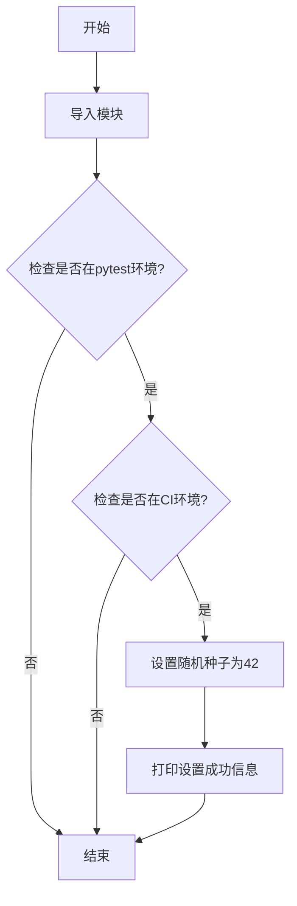

# `.\AutoGPT\classic\original_autogpt\autogpt\__init__.py` 详细设计文档

该代码是一个随机种子设置模块，用于在pytest或CI环境下自动设置随机数种子为42，以确保测试的可重复性。

## 整体流程



## 类结构

```
无类层次结构（该文件为脚本模块，不包含类定义）
```

## 全局变量及字段


### `os`
    
Python标准库模块，提供操作系统相关功能

类型：`module`
    


### `random`
    
Python标准库模块，提供随机数生成功能

类型：`module`
    


### `sys`
    
Python标准库模块，提供系统参数和工具函数

类型：`module`
    


    

## 全局函数及方法


## 关键组件


### 随机种子设置机制

检测当前运行环境是否为测试或CI环境，如果是则将随机种子固定为42，以保证测试的可复现性。

### 运行环境检测

通过检查sys.argv、sys.modules和os.getenv("CI")三个维度来判断当前是否处于pytest测试或CI环境中。


## 问题及建议


### 已知问题

-   **种子设置时机不可控**：随机种子在模块导入时即被执行，无法在需要时手动触发或重置
-   **硬编码值**：种子值42硬编码在代码中，缺乏配置化管理
-   **代码可测试性差**：种子设置逻辑直接嵌入模块顶层，难以在单元测试中模拟或覆盖
-   **功能单一**：仅支持pytest和CI环境判断，缺少对其他测试框架（如unittest、nose2）的支持
-   **缺少文档**：没有文档字符串说明代码目的、参数含义和使用场景
-   **模块导入冗余**：导入了os和sys模块但仅使用了极少量功能，存在过度导入
-   **缺乏错误处理**：未考虑random模块导入失败或环境检测异常的情况

### 优化建议

-   **封装为函数**：将种子设置逻辑提取为独立的`set_random_seed()`函数，接受可选的seed参数，提升可测试性和可复用性
-   **配置化设计**：通过环境变量或配置文件管理种子值，例如`os.getenv("RANDOM_SEED", 42)`
-   **扩展环境检测**：支持更多测试框架和场景，如检测`unittest`、`nose2`或自定义测试标记
-   **添加文档字符串**：为模块和函数添加docstring，说明功能、使用场景和注意事项
-   **条件导入优化**：仅在需要时导入os和sys，减少不必要的模块加载
-   **线程安全考虑**：如在多线程环境使用，考虑添加锁机制保证种子设置的原子性
-   **日志记录**：添加日志输出替代print，便于在生产环境控制日志级别


## 其它


### 设计目标与约束

确保在测试环境下随机数可复现，通过检测sys.argv、sys.modules或CI环境变量来判断是否处于测试环境。

### 错误处理与异常设计

本代码块不涉及复杂错误处理，仅依赖Python内置异常机制。导入失败会抛出ModuleNotFoundError。

### 外部依赖与接口契约

依赖Python标准库：os、random、sys模块。无外部接口契约，仅修改random模块的全局随机种子状态。

### 运行环境与兼容性

适用于Python 3.x所有版本，无平台特定代码，跨平台兼容。

### 配置与初始化行为

仅在检测到测试环境时执行一次性初始化，设置random.seed(42)确保测试可复现性。

### 潜在技术债务与优化空间

1. 建议将环境检测逻辑封装为独立函数以提高可测试性
2. 硬编码的种子值42可考虑提取为配置常量
3. 可添加显式的类型注解提高代码可维护性

### 安全考虑

本代码不涉及用户输入处理，无安全风险。但需注意在生产环境设置随机种子可能影响安全随机数用途。

    