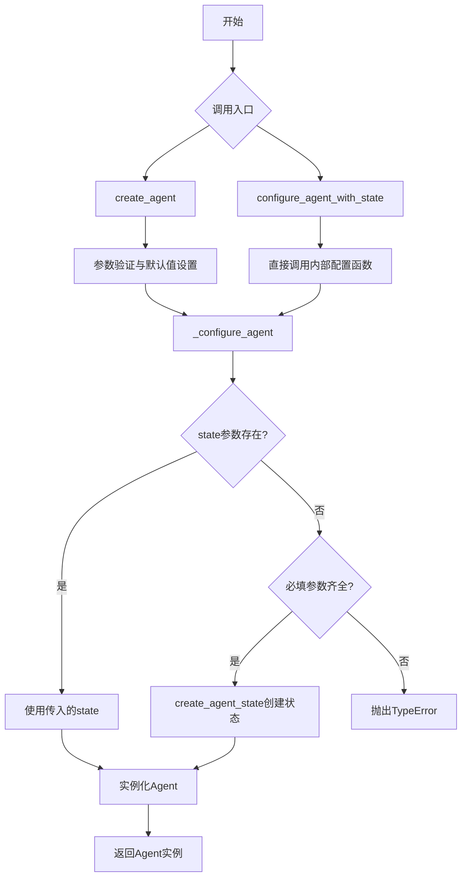
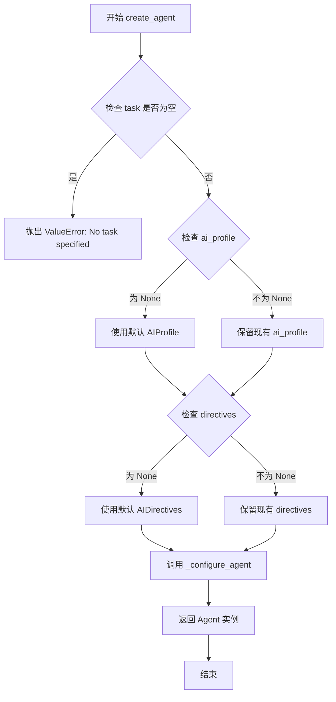
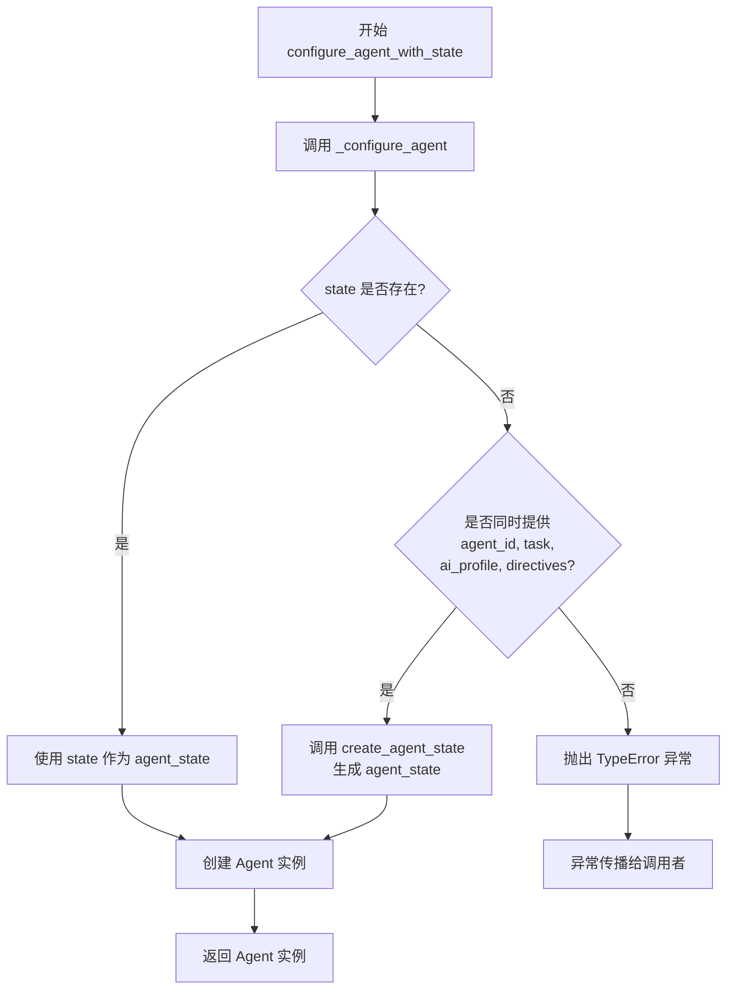
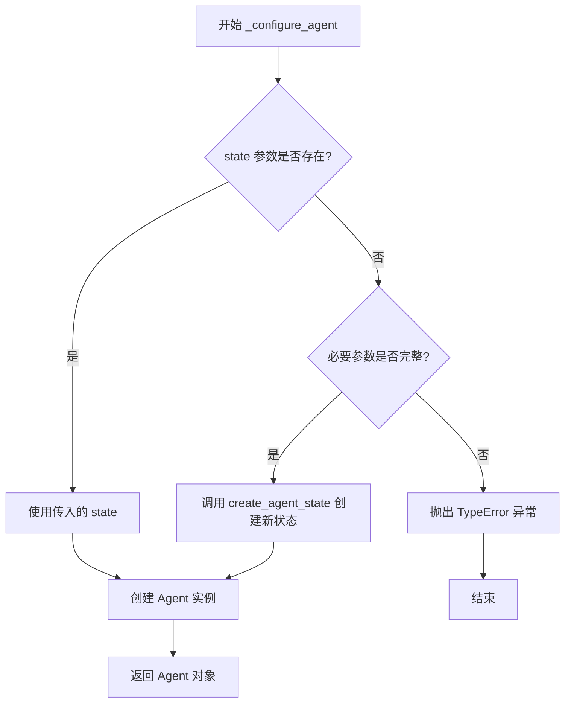
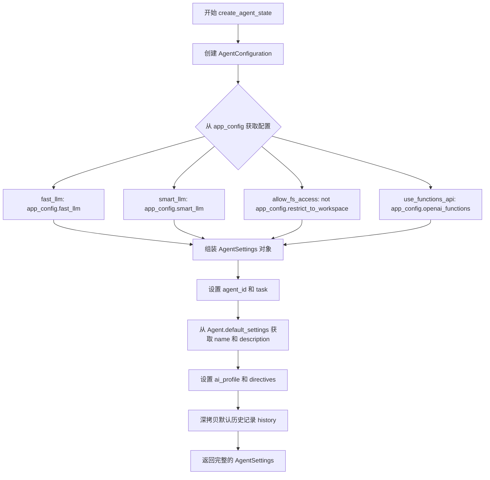

# `.\AutoGPT\classic\original_autogpt\autogpt\agent_factory\configurators.py` 详细设计文档

该文件是AutoGPT代理工厂模块，负责创建和配置Agent实例。通过提供不同的入口函数（create_agent和configure_agent_with_state），封装了代理的初始化流程，包括验证参数、构建AgentSettings、配置LLM提供者、文件存储等核心组件，最终返回可运行的Agent对象。

## 整体流程



## 类结构

```
无自定义类定义
仅包含工厂函数模块
依赖外部导入: Agent, AgentConfiguration, AgentSettings, AppConfig, FileStorage, MultiProvider, AIProfile, AIDirectives
```

## 全局变量及字段


### `create_agent`
    
公开函数，用于根据给定的agent_id、task和配置创建新的Agent实例

类型：`function`
    


### `configure_agent_with_state`
    
公开函数，用于使用已有的AgentSettings状态配置并返回Agent实例

类型：`function`
    


### `_configure_agent`
    
内部函数，实际创建Agent的核心逻辑，根据state或参数创建agent状态并实例化Agent

类型：`function`
    


### `create_agent_state`
    
辅助函数，根据agent_id、task、AIProfile、AIDirectives和AppConfig创建AgentSettings状态对象

类型：`function`
    


### `create_agent.agent_id`
    
Agent的唯一标识符

类型：`str`
    


### `create_agent.task`
    
分配给Agent的任务描述

类型：`str`
    


### `create_agent.app_config`
    
应用程序的全局配置对象

类型：`AppConfig`
    


### `create_agent.file_storage`
    
用于文件存储的接口实现

类型：`FileStorage`
    


### `create_agent.llm_provider`
    
多Provider的大语言模型提供者

类型：`MultiProvider`
    


### `create_agent.ai_profile`
    
AI配置文件，如果未提供则使用默认配置

类型：`Optional[AIProfile]`
    


### `create_agent.directives`
    
AI指令配置，如果未提供则使用默认配置

类型：`Optional[AIDirectives]`
    


### `configure_agent_with_state.state`
    
已有的Agent状态设置对象

类型：`AgentSettings`
    


### `configure_agent_with_state.app_config`
    
应用程序的全局配置对象

类型：`AppConfig`
    


### `configure_agent_with_state.file_storage`
    
用于文件存储的接口实现

类型：`FileStorage`
    


### `configure_agent_with_state.llm_provider`
    
多Provider的大语言模型提供者

类型：`MultiProvider`
    


### `_configure_agent.app_config`
    
应用程序的全局配置对象

类型：`AppConfig`
    


### `_configure_agent.llm_provider`
    
多Provider的大语言模型提供者

类型：`MultiProvider`
    


### `_configure_agent.file_storage`
    
用于文件存储的接口实现

类型：`FileStorage`
    


### `_configure_agent.agent_id`
    
Agent的唯一标识符，默认为空字符串

类型：`str`
    


### `_configure_agent.task`
    
分配给Agent的任务描述，默认为空字符串

类型：`str`
    


### `_configure_agent.ai_profile`
    
AI配置文件，可选参数

类型：`Optional[AIProfile]`
    


### `_configure_agent.directives`
    
AI指令配置，可选参数

类型：`Optional[AIDirectives]`
    


### `_configure_agent.state`
    
已有的Agent状态设置对象，用于从已有状态恢复Agent

类型：`Optional[AgentSettings]`
    


### `create_agent_state.agent_id`
    
Agent的唯一标识符

类型：`str`
    


### `create_agent_state.task`
    
分配给Agent的任务描述

类型：`str`
    


### `create_agent_state.ai_profile`
    
AI配置文件

类型：`AIProfile`
    


### `create_agent_state.directives`
    
AI指令配置

类型：`AIDirectives`
    


### `create_agent_state.app_config`
    
应用程序的全局配置对象，用于获取LLM和权限配置

类型：`AppConfig`
    
    

## 全局函数及方法


### `create_agent`

该函数是AutoGPT代理工厂的核心函数，负责根据提供的任务描述、应用程序配置和AIprofile创建一个新的AI代理实例。它首先验证任务参数的有效性，为缺失的可选参数设置默认值，然后委托内部配置函数完成代理的完整初始化。

参数：

- `agent_id`：`str`，代理的唯一标识符，用于在系统中跟踪和引用该代理
- `task`：`str`，代理要执行的核心任务描述，这是创建代理的必需参数
- `app_config`：`AppConfig`，应用程序的全局配置，包含LLM模型设置、文件系统访问权限等
- `file_storage`：`FileStorage`，文件存储抽象接口，提供代理读写文件的能力
- `llm_provider`：`MultiProvider`，多提供商LLM接口，用于与各种语言模型进行交互
- `ai_profile`：`Optional[AIProfile] = None`，AIprofile配置文件，包含代理的角色定义和行为指南，如果为None则使用默认空配置
- `directives`：`Optional[AIDirectives] = None`，AI指令集，包含代理的操作约束和安全策略，如果为None则使用默认空指令集

返回值：`Agent`，返回配置完成并初始化好的代理实例，可以开始执行任务

#### 流程图



#### 带注释源码

```python
def create_agent(
    agent_id: str,                          # 代理的唯一标识符
    task: str,                              # 代理需要执行的任务
    app_config: AppConfig,                  # 应用程序全局配置
    file_storage: FileStorage,              # 文件存储接口
    llm_provider: MultiProvider,            # LLM多提供商接口
    ai_profile: Optional[AIProfile] = None,  # 可选的AI配置文件
    directives: Optional[AIDirectives] = None,  # 可选的AI指令
) -> Agent:
    """
    创建并配置一个新的AI代理实例
    
    参数:
        agent_id: 代理的唯一标识
        task: 代理的任务描述
        app_config: 应用程序配置
        file_storage: 文件存储实现
        llm_provider: 语言模型提供商
        ai_profile: AIprofile配置，如果为None则使用默认配置
        directives: AI指令集，如果为None则使用默认指令
    
    返回:
        配置完整的Agent实例
    """
    # 验证任务参数，不能为空
    if not task:
        raise ValueError("No task specified for new agent")
    
    # 为缺失的可选参数设置默认值
    # 如果调用者未提供AIProfile，创建一个空的默认配置
    ai_profile = ai_profile or AIProfile()
    # 如果调用者未提供指令集，创建一个空的默认指令
    directives = directives or AIDirectives()

    # 委托给内部配置函数完成代理的完整创建
    agent = _configure_agent(
        agent_id=agent_id,
        task=task,
        ai_profile=ai_profile,
        directives=directives,
        app_config=app_config,
        file_storage=file_storage,
        llm_provider=llm_provider,
    )

    return agent
```


### `configure_agent_with_state`

该函数是代理工厂函数之一，通过接收已有的 `AgentSettings` 状态对象以及运行时依赖（应用配置、文件存储、LLM提供者），委托内部 `_configure_agent` 函数完成 Agent 实例的创建。

参数：

- `state`：`AgentSettings`，已序列化的代理状态对象，包含代理的完整配置信息
- `app_config`：`AppConfig`，应用程序全局配置，包含 LLM 模型选择、文件系统访问策略等
- `file_storage`：`FileStorage`，文件存储抽象接口，用于代理访问持久化存储
- `llm_provider`：`MultiProvider`，多模型 LLM 提供者，支持动态切换不同语言模型

返回值：`Agent`，配置完成且初始化好的代理实例，可立即用于执行任务

#### 流程图



#### 带注释源码

```python
def configure_agent_with_state(
    state: AgentSettings,
    app_config: AppConfig,
    file_storage: FileStorage,
    llm_provider: MultiProvider,
) -> Agent:
    """
    通过预定义的 AgentSettings 状态配置并返回一个 Agent 实例。
    
    此函数是代理工厂的入口点之一，适用于从持久化存储恢复代理状态的场景。
    它将所有运行时依赖转发给内部函数 _configure_agent 进行实际创建逻辑。
    
    参数:
        state: AgentSettings 对象，包含代理的唯一标识、名称、描述、任务、
               AI 配置、指令集、历史记录等完整状态信息
        app_config: AppConfig 全局配置，提供 LLM 模型选择、文件系统权限、
                   OpenAI Functions 开关等应用级设置
        file_storage: FileStorage 实例，代理用于读取/写入文件的抽象层，
                     通常绑定到特定的工作空间目录
        llm_provider: MultiProvider 多模型提供者，支持根据配置动态选择
                     fast_llm 或 smart_llm 进行推理
    
    返回:
        Agent: 完全初始化且注入依赖的代理实例，可直接用于任务执行
    """
    return _configure_agent(
        state=state,
        app_config=app_config,
        file_storage=file_storage,
        llm_provider=llm_provider,
    )
```


### `_configure_agent`

私有内部函数，用于根据提供的参数配置并实例化一个 Agent 对象。该函数支持两种创建方式：通过完整的配置参数（agent_id、task、ai_profile、directives）创建新的 Agent 状态，或通过已有的 AgentSettings 状态对象恢复 Agent。

参数：

- `app_config`：`AppConfig`，应用程序配置对象，包含 LLM 配置、文件系统访问权限等应用级设置
- `llm_provider`：`MultiProvider`，多提供商 LLM 客户端，用于 Agent 与大语言模型交互
- `file_storage`：`FileStorage`，文件存储抽象接口，用于 Agent 访问和管理工作区文件
- `agent_id`：`str`，Agent 的唯一标识符，默认为空字符串
- `task`：`str`，Agent 需要执行的任务描述，默认为空字符串
- `ai_profile`：`Optional[AIProfile]`，AI 个人档案配置，包含模型人格和行为参数，可为空
- `directives`：`Optional[AIDirectives]`，AI 指令集，包含行为约束和指令，可为空
- `state`：`Optional[AgentSettings]`，已有的 Agent 状态快照，用于恢复 Agent，可为空

返回值：`Agent`，配置完成并初始化的 Agent 实例

#### 流程图



#### 带注释源码

```python
def _configure_agent(
    app_config: AppConfig,
    llm_provider: MultiProvider,
    file_storage: FileStorage,
    agent_id: str = "",
    task: str = "",
    ai_profile: Optional[AIProfile] = None,
    directives: Optional[AIDirectives] = None,
    state: Optional[AgentSettings] = None,
) -> Agent:
    """
    配置并创建 Agent 实例的内部函数。
    
    支持两种创建模式：
    1. 使用 state 直接创建（用于恢复已有 Agent）
    2. 使用 agent_id, task, ai_profile, directives 组合创建（用于新建 Agent）
    
    参数:
        app_config: 应用配置，包含 LLM 和功能开关设置
        llm_provider: LLM 多提供商客户端
        file_storage: 文件存储接口
        agent_id: Agent 唯一标识
        task: 任务描述
        ai_profile: AI 配置档案
        directives: AI 指令集
        state: 已有的 Agent 状态（可选）
    
    返回:
        配置好的 Agent 实例
    
    异常:
        TypeError: 当既没有提供 state，也没有提供完整的创建参数时抛出
    """
    # 判断是否使用已有的 Agent 状态恢复 Agent
    if state:
        agent_state = state
    # 判断是否提供了完整的创建参数
    elif agent_id and task and ai_profile and directives:
        # 调用工厂函数创建新的 Agent 状态
        agent_state = state or create_agent_state(
            agent_id=agent_id,
            task=task,
            ai_profile=ai_profile,
            directives=directives,
            app_config=app_config,
        )
    else:
        # 参数不完整，抛出明确的错误信息
        raise TypeError(
            "Either (state) or (agent_id, task, ai_profile, directives)"
            " must be specified"
        )

    # 使用配置好的状态和其他依赖创建 Agent 实例
    return Agent(
        settings=agent_state,
        llm_provider=llm_provider,
        file_storage=file_storage,
        app_config=app_config,
    )
```


### `create_agent_state`

该函数用于根据传入的代理ID、任务描述、AI配置、指令配置和应用程序配置，创建一个完整的 `AgentSettings` 对象，作为新代理的初始状态配置。

参数：

- `agent_id`：`str`，代理的唯一标识符，用于在系统中区分不同的代理实例
- `task`：`str`，代理需要执行的任务描述，定义代理的核心工作目标
- `ai_profile`：`AIProfile`，AI配置文件，包含AI模型相关的配置参数
- `directives`：`AIDirectives`，AI指令配置，定义代理的行为规范和约束
- `app_config`：`AppConfig`，应用程序全局配置，包含LLM、文件系统访问等应用级设置

返回值：`AgentSettings`，返回配置好的代理设置对象，包含了代理运行所需的全部配置信息

#### 流程图



#### 带注释源码

```python
def create_agent_state(
    agent_id: str,
    task: str,
    ai_profile: AIProfile,
    directives: AIDirectives,
    app_config: AppConfig,
) -> AgentSettings:
    """
    根据提供的配置信息创建代理状态设置对象。
    
    该函数构建一个完整的 AgentSettings 对象，包含代理运行所需的所有配置，
    包括LLM配置、文件系统访问权限、功能API开关等。
    
    参数:
        agent_id: 代理的唯一标识符
        task: 代理需要执行的任务描述
        ai_profile: AI配置文件，包含模型相关配置
        directives: AI指令配置，定义代理行为规范
        app_config: 应用程序全局配置
    
    返回:
        AgentSettings: 配置完整的代理设置对象
    """
    return AgentSettings(
        agent_id=agent_id,  # 设置代理唯一标识
        name=Agent.default_settings.name,  # 使用默认名称
        description=Agent.default_settings.description,  # 使用默认描述
        task=task,  # 设置代理任务
        ai_profile=ai_profile,  # 设置AI配置文件
        directives=directives,  # 设置AI指令配置
        config=AgentConfiguration(  # 创建代理运行时配置
            fast_llm=app_config.fast_llm,  # 快速LLM配置
            smart_llm=app_config.smart_llm,  # 智能LLM配置
            allow_fs_access=not app_config.restrict_to_workspace,  # 文件系统访问权限（取反 restrict_to_workspace）
            use_functions_api=app_config.openai_functions,  # 是否使用OpenAI函数API
        ),
        history=Agent.default_settings.history.model_copy(deep=True),  # 深拷贝默认历史记录，保持独立
    )
```

## 关键组件


### Agent创建工厂

负责实例化新的Agent实例，是代码的入口函数。接收代理ID、任务描述、应用配置、文件存储和LLM提供者等必要参数，验证任务非空后调用内部配置函数完成Agent的创建。

### 状态恢复器

通过已存在的AgentSettings状态对象来恢复或重建Agent实例的函数。允许从持久化状态中重新初始化Agent，适用于代理重启或状态迁移场景。

### 配置管理器

内部核心函数，负责协调各参数并实际创建Agent实例。根据传入的是完整状态还是分散参数，决定直接使用状态或创建新状态。包含参数组合有效性校验逻辑。

### 状态构建器

辅助函数，负责构造AgentSettings配置对象。将应用配置（LLM、文件系统访问权限等）映射到AgentConfiguration，并使用默认值初始化名称、描述和历史记录。

### 参数验证器

在create_agent函数中检查task参数非空，在_configure_agent函数中检查state与(agent_id, task, ai_profile, directives)参数组的互斥性。确保至少提供一种有效的代理初始化方式。

### 依赖注入容器

通过函数参数传递AppConfig、FileStorage、MultiProvider等外部依赖，实现松耦合设计。允许在运行时动态注入不同的配置和提供者实例。


## 问题及建议


### 已知问题

-   **逻辑冗余**：`_configure_agent` 函数中 `agent_state = state or create_agent_state(...)` 语句存在逻辑冗余。由于 `elif` 分支的前提是 `state` 为 `None`（因为前面已排除 `if state:` 的情况），这里的 `state or` 是多余的。
-   **参数验证不足**：缺少对核心依赖参数（`app_config`、`file_storage`、`llm_provider`）的空值检查，如果传入 `None` 会在后续调用 Agent 构造函数时才报错，定位问题不及时。
-   **异常信息不够具体**：`TypeError` 异常消息只说明了必须提供哪些参数组合，但未指明具体是哪个参数缺失导致校验失败。
-   **魔法值重复访问**：`Agent.default_settings` 在 `create_agent_state` 中被多次访问（`name`、`description`、`history`），每次访问都会访问类属性。
-   **函数职责过重**：`_configure_agent` 同时负责参数校验、状态构建和 Agent 实例化三个职责，违背了单一职责原则。

### 优化建议

-   移除 `agent_state = state or create_agent_state(...)` 中的多余 `state or` 部分，直接赋值 `agent_state = create_agent_state(...)`。
-   在函数入口处添加核心依赖参数的非空校验，使用明确的错误消息指出具体缺失参数。
-   考虑将状态构建逻辑（`create_agent_state` 调用）从 `_configure_agent` 中分离，单独作为预处理步骤。
-   将 `Agent.default_settings` 提取为局部变量，减少重复的属性访问开销。
-   考虑将异常类型从 `TypeError` 改为 `ValueError`，因为这是一个值校验问题而非类型问题。

## 其它


### 设计目标与约束

本模块的设计目标是提供统一的Agent创建和配置接口，支持两种创建模式：从头创建新Agent和使用已有状态恢复Agent。约束条件包括：必须提供task参数或state参数，否则抛出TypeError；ai_profile和directives必须存在或使用默认值；依赖AppConfig、FileStorage和MultiProvider三个核心组件。

### 错误处理与异常设计

本模块涉及两类异常：1) ValueError：当task参数为空字符串时抛出，提示"No task specified for new agent"；2) TypeError：当既没有提供state也没有同时提供agent_id、task、ai_profile、directives四个参数时抛出，提示"Either (state) or (agent_id, task, ai_profile, directives) must be specified"。异常设计采用快速失败原则，在函数入口进行参数校验。

### 数据流与状态机

数据流分为两条路径：路径一（从头创建）：调用方传入agent_id、task、ai_profile、directives → create_agent() → _configure_agent() → create_agent_state() → Agent()实例化；路径二（状态恢复）：调用方传入state → configure_agent_with_state() → _configure_agent() → Agent()实例化。AgentSettings是核心状态对象，包含agent_id、name、description、task、ai_profile、directives、config、history等八个子状态字段。

### 外部依赖与接口契约

本模块依赖四个外部模块：1) forge.config.ai_directives.AIDirectives：指令配置类；2) forge.config.ai_profile.AIProfile：AI画像配置类；3) forge.file_storage.base.FileStorage：文件存储抽象基类；4) forge.llm.providers.MultiProvider：多提供商LLM接口。接口契约要求：AppConfig必须包含fast_llm、smart_llm、restrict_to_workspace、openai_functions四个配置项；FileStorage需实现基类接口；MultiProvider需支持LLM调用。

### 配置参数说明

create_agent函数参数：agent_id(str,唯一标识)、task(str,任务描述)、app_config(AppConfig,应用配置)、file_storage(FileStorage,文件存储)、llm_provider(MultiProvider,LLM提供商)、ai_profile(可选AIProfile,默认空实例)、directives(可选AIDirectives,默认空实例)。configure_agent_with_state函数参数：state(AgentSettings,已有状态)、app_config、file_storage、llm_provider。

### 使用示例

示例一（从头创建Agent）：
```
agent = create_agent(
    agent_id="agent_001",
    task="分析市场数据并生成报告",
    app_config=app_config,
    file_storage=storage,
    llm_provider=provider,
)
```
示例二（从状态恢复Agent）：
```
agent = configure_agent_with_state(
    state=existing_state,
    app_config=app_config,
    file_storage=storage,
    llm_provider=provider,
)
```

### 性能考虑与优化空间

当前实现每次调用create_agent都会创建新的AgentSettings对象和history深拷贝，可能带来性能开销。优化方向：1) 对于大量创建场景，可缓存默认history配置；2) state参数校验可提取为独立校验函数提高复用性；3) 可考虑添加Agent实例池复用机制。

### 安全考虑

当前模块未包含敏感数据处理逻辑，安全考量集中在调用方：1) 确保agent_id不包含敏感信息；2) task参数应进行输入过滤防止注入攻击；3) file_storage权限应与app_config.restrict_to_workspace配置一致。

### 并发与线程安全性

本模块创建的Agent实例为独立对象，无共享状态，线程安全。多个线程可同时调用create_agent或configure_agent_with_state而不会产生竞态条件。

### 测试策略建议

建议覆盖以下测试场景：1) 正常路径测试：完整参数创建、状态恢复；2) 异常路径测试：空task、空参数组合；3) 默认值测试：ai_profile和directives为None时的行为；4) 配置传递测试：AppConfig各字段正确映射到AgentConfiguration。

    