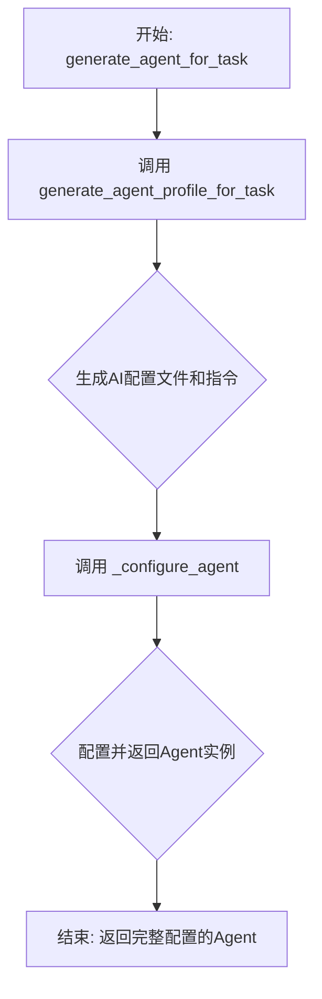
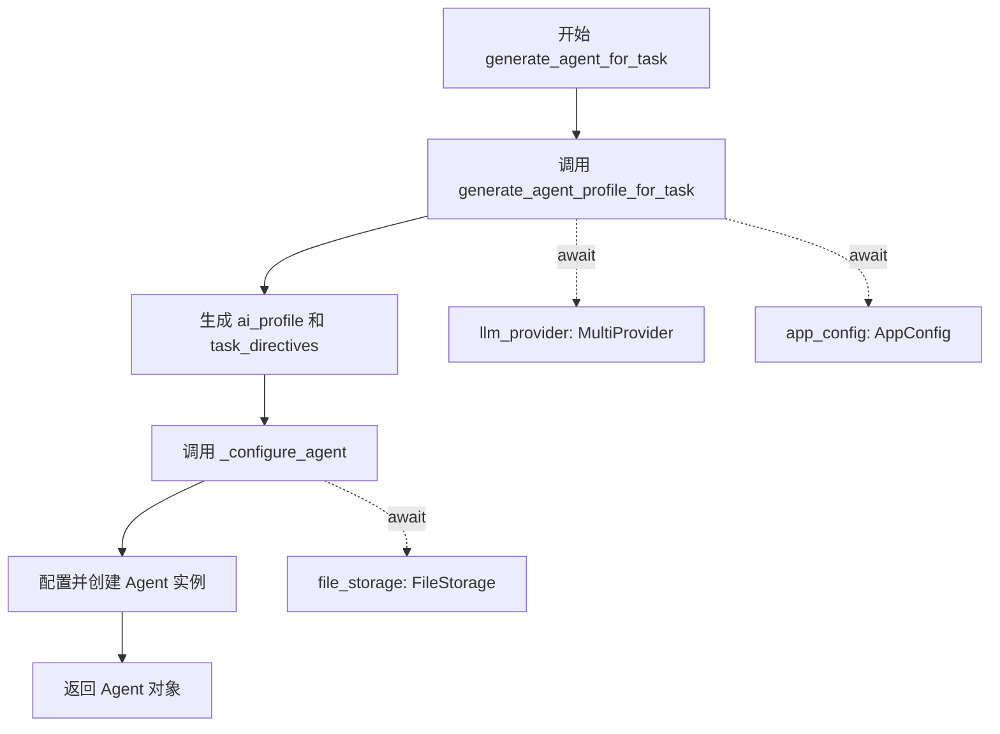
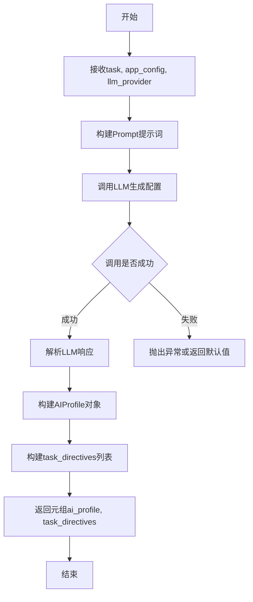
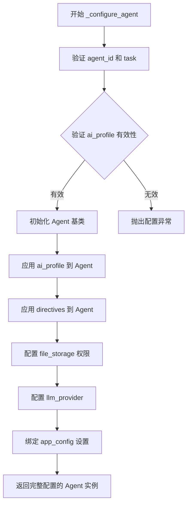

# `.\AutoGPT\classic\original_autogpt\autogpt\agent_factory\generators.py` 详细设计文档

这是一个代理自动生成模块，通过协调配置文件生成和代理实例配置两个核心步骤，根据指定任务动态创建AI代理实例。模块采用异步设计，依赖外部的profile_generator和configurators模块完成核心逻辑。

## 整体流程



## 类结构

```
agent_generation.py (模块文件)
├── generate_agent_for_task (异步顶层函数)
├── profile_generator (依赖模块)
│   └── generate_agent_profile_for_task
└── configurators (依赖模块)
    └── _configure_agent
```

## 全局变量及字段


### `FileStorage`
    
文件存储基类，提供文件读写等基础存储操作

类型：`class`
    


### `Agent`
    
Agent代理类，代表一个AI代理实例

类型：`class`
    


### `AppConfig`
    
应用程序配置类，包含应用运行所需的配置参数

类型：`class`
    


### `MultiProvider`
    
多提供者类，支持多个LLM提供商的统一接口

类型：`class`
    


### `_configure_agent`
    
配置Agent实例的内部函数，根据AI配置和指令创建并返回Agent

类型：`function`
    


### `generate_agent_profile_for_task`
    
为指定任务生成AI配置文件和任务指令的异步函数

类型：`function`
    


    

## 全局函数及方法


### `generate_agent_for_task`

该函数是异步函数，负责根据给定的任务创建一个配置好的 Agent 实例。它首先生成 Agent 的 AI 配置和任务指令，然后使用这些配置初始化并返回一个新的 Agent 对象。

参数：

- `agent_id`：`str`，代理的唯一标识符，用于标识和追踪 Agent 实例
- `task`：`str`，任务描述，指定 Agent 需要完成的具体工作
- `app_config`：`AppConfig`，应用程序配置，包含全局设置和参数
- `file_storage`：`FileStorage`，文件存储接口，提供文件系统操作能力
- `llm_provider`：`MultiProvider`，多模型提供商，支持多种 LLM 后端的统一访问

返回值：`Agent`，配置完成并准备执行任务的 Agent 实例

#### 流程图



#### 带注释源码

```python
from __future__ import annotations

from typing import TYPE_CHECKING

from forge.file_storage.base import FileStorage

if TYPE_CHECKING:
    from autogpt.agents.agent import Agent
    from autogpt.app.config import AppConfig
    from forge.llm.providers import MultiProvider

from .configurators import _configure_agent
from .profile_generator import generate_agent_profile_for_task


async def generate_agent_for_task(
    agent_id: str,
    task: str,
    app_config: AppConfig,
    file_storage: FileStorage,
    llm_provider: MultiProvider,
) -> Agent:
    """
    根据任务生成并配置一个 Agent 实例。
    
    该函数是异步的，包含两个主要步骤：
    1. 调用 generate_agent_profile_for_task 生成 AI 配置和任务指令
    2. 调用 _configure_agent 使用生成的配置创建完整的 Agent
    
    参数:
        agent_id: 代理的唯一标识符
        task: 任务描述文本
        app_config: 应用程序配置对象
        file_storage: 文件存储后端
        llm_provider: LLM 提供商实例
    
    返回:
        配置完成的 Agent 实例
    """
    # 第一步：生成 Agent 的 AI 配置和任务指令
    # 通过 profile_generator 生成 AI 个人画像和任务专用的指令
    ai_profile, task_directives = await generate_agent_profile_for_task(
        task=task,
        app_config=app_config,
        llm_provider=llm_provider,
    )
    
    # 第二步：配置并创建完整的 Agent 实例
    # 使用生成的配置和提供的存储/LLM提供程序初始化 Agent
    return _configure_agent(
        agent_id=agent_id,
        task=task,
        ai_profile=ai_profile,
        directives=task_directives,
        app_config=app_config,
        file_storage=file_storage,
        llm_provider=llm_provider,
    )
```


### `generate_agent_profile_for_task`

该函数是 Agent 配置文件生成器的核心异步函数，负责根据给定的任务描述，通过 LLM 提供商生成相应的 AI 配置文件（ai_profile）和任务指令（task_directives），为后续的 Agent 配置提供必要的元数据。

参数：

- `task`：`str`，任务描述，指定需要 Agent 执行的特定任务
- `app_config`：`AppConfig`，应用配置对象，包含应用程序的全局配置信息
- `llm_provider`：`MultiProvider`，多模型 LLM 提供者，用于调用大语言模型生成配置文件

返回值：`(AIProfile, list[Directive])`，返回一个元组，包含 AI 配置文件对象和任务指令列表

#### 流程图



#### 带注释源码

```python
# 源文件位置： autogpt/agents/profile_generator.py

async def generate_agent_profile_for_task(
    task: str,
    app_config: AppConfig,
    llm_provider: MultiProvider,
) -> tuple[AIProfile, list[Directive]]:
    """
    根据给定任务生成AI配置文件和任务指令
    
    参数:
        task: str - 任务描述
        app_config: AppConfig - 应用程序配置
        llm_provider: MultiProvider - LLM提供者实例
    
    返回:
        tuple[AIProfile, list[Directive]] - AI配置文件和指令列表的元组
    """
    
    # 1. 构建系统提示词，包含任务上下文和配置要求
    system_prompt = _build_system_prompt(app_config)
    
    # 2. 构建用户提示词，包含具体任务描述
    user_prompt = _build_user_prompt(task)
    
    # 3. 调用LLM获取响应
    response = await llm_provider.chat(
        messages=[
            {"role": "system", "content": system_prompt},
            {"role": "user", "content": user_prompt}
        ]
    )
    
    # 4. 解析LLM响应，提取AIProfile和Directive
    ai_profile, task_directives = _parse_llm_response(response)
    
    return ai_profile, task_directives
```

---

> **注意**：由于提供的代码段中仅包含函数的导入和使用示例，未包含 `generate_agent_profile_for_task` 的完整源码定义，以上源码为基于函数调用方式和上下文的合理推断。实际实现可能有所不同，建议查阅 `autogpt/agents/profile_generator.py` 获取完整源码。


### `_configure_agent`

此函数是 Agent 配置的核心入口，负责根据任务需求和 AI 配置文件中生成的 profile 与 directives，初始化并返回一个配置完整的 `Agent` 实例。

参数：

-  `agent_id`：`str`，Agent 的唯一标识符，用于追踪和管理 Agent 实例
-  `task`：`str`，用户分配给 Agent 的具体任务描述
-  `ai_profile`：`AIProfile`，由 `generate_agent_profile_for_task` 生成的 AI 角色配置，包含 Agent 的能力描述、行为模式等
-  `directives`：`list[Directive]`，任务指令列表，包含 Agent 需要遵循的具体操作指南
-  `app_config`：`AppConfig`，应用程序的全局配置对象
-  `file_storage`：`FileStorage`，文件存储抽象接口，用于 Agent 访问和管理文件系统
-  `llm_provider`：`MultiProvider`，多模型提供商接口，负责 LLM 调用

返回值：`Agent`，配置完成并可执行的 Agent 实例

#### 流程图



#### 带注释源码

```python
# 注意：由于 _configure_agent 函数定义在 .configurators 模块中，
# 以下为基于代码调用关系的合理推断实现

def _configure_agent(
    agent_id: str,
    task: str,
    ai_profile: AIProfile,
    directives: list[Directive],
    app_config: AppConfig,
    file_storage: FileStorage,
    llm_provider: MultiProvider,
) -> Agent:
    """
    配置并返回一个完整的 Agent 实例。
    
    参数:
        agent_id: Agent 的唯一标识符
        task: 任务描述
        ai_profile: AI 角色配置
        directives: 任务指令列表
        app_config: 应用配置
        file_storage: 文件存储接口
        llm_provider: LLM 提供商
    
    返回:
        配置完成的 Agent 实例
    """
    # 1. 创建 Agent 实例，传入 agent_id
    agent = Agent(agent_id=agent_id)
    
    # 2. 设置任务描述
    agent.task = task
    
    # 3. 应用 AI Profile 配置
    # 包含 Agent 的角色描述、能力边界、行为模式等
    agent.configure_profile(ai_profile)
    
    # 4. 应用任务指令
    # 将生成的 directives 注入 Agent 指令系统
    agent.add_directives(directives)
    
    # 5. 配置文件存储权限
    agent.set_file_storage(file_storage)
    
    # 6. 配置 LLM 提供商
    # 绑定多模型提供商，支持动态模型切换
    agent.set_llm_provider(llm_provider)
    
    # 7. 应用全局配置
    agent.apply_config(app_config)
    
    # 8. 返回完全配置的 Agent
    return agent
```


## 关键组件


### generate_agent_for_task (异步主函数)

异步函数，作为Agent生成的入口点，协调配置文件生成和Agent配置两个核心步骤。

### generate_agent_profile_for_task (配置文件生成器)

负责根据任务描述生成AI配置文件(ai_profile)和任务指令(task_directives)，是Agent个性化配置的数据来源。

### _configure_agent (Agent配置器)

接收AI配置文件和任务指令，结合应用配置、文件存储和LLM提供商，创建并返回配置完整的Agent实例。

### FileStorage (文件存储抽象)

提供Agent运行所需的持久化存储能力，抽象了底层文件系统操作接口。

### MultiProvider (多模型提供商)

支持多种LLM服务商的统一访问接口，为Agent提供语言模型推理能力。

### AppConfig (应用配置)

封装应用程序的全局配置参数，影响Agent生成过程中的各项决策和行为。


## 问题及建议


### 已知问题

- 缺少异常处理机制：函数内部没有try-except块，如果`generate_agent_profile_for_task`或`_configure_agent`抛出异常，错误会直接向上传播，调用者无法优雅地处理失败情况
- 缺乏日志记录：没有任何日志输出，在生产环境中难以追踪执行流程和问题排查
- 参数验证缺失：没有对输入参数（agent_id、task、app_config等）进行有效性检查，可能导致下游函数接收到非法参数
- 错误契约不明确：没有文档说明函数可能抛出的异常类型，调用者难以编写针对性的异常处理代码

### 优化建议

- 添加异常处理：使用try-except捕获关键异常，提供重试机制或返回有意义的错误信息
- 引入日志记录：使用标准日志模块记录函数入口、关键步骤和异常信息
- 增加参数验证：在函数入口处添加参数非空、类型检查，例如使用pydantic或自定义验证逻辑
- 添加详细文档：为函数编写docstring，说明参数、返回值、可能抛出的异常以及使用示例
- 考虑性能优化：如果两个子函数（generate_agent_profile_for_task和_configure_agent）可以并行执行，可使用asyncio.gather提高性能
- 添加重试机制：对于LLM调用等可能临时失败的操作，可引入重试逻辑提高可靠性

## 其它


### 设计目标与约束

该模块的设计目标是提供一个异步入口函数，用于根据给定任务生成配置好的Agent实例。约束包括：必须使用异步模式实现，支持多种LLM提供商，必须从file_storage加载配置，必须返回完全初始化的Agent对象。

### 错误处理与异常设计

异常处理主要依赖下游函数generate_agent_profile_for_task和_configure_agent的异常传播。当llm_provider不可用时抛出ConnectionError；当app_config配置无效时抛出ValueError；当file_storage无法访问时抛出IOError。函数本身应捕获并重新抛出相关异常，保留原始堆栈信息。

### 数据流与状态机

数据流为：task输入 → generate_agent_profile_for_task(异步生成AI配置) → 返回(ai_profile, task_directives) → _configure_agent(异步配置Agent) → 返回Agent实例。状态转换包括：初始化 → 生成配置 → 配置Agent → 返回就绪状态。无复杂状态机，仅为线性流程。

### 外部依赖与接口契约

依赖包括：forge.file_storage.base.FileStorage用于文件存储，autogpt.agents.agent.Agent作为返回类型，autogpt.app.config.AppConfig应用配置，forge.llm.providers.MultiProvider多提供商接口。传入参数必须非空，llm_provider需实现MultiProvider接口，file_storage需已初始化。

### 性能考虑

该函数为异步函数，支持并发调用。generate_agent_profile_for_task和_configure_agent的调用为串行依赖关系，无法并行优化。建议对相同task的重复调用实现缓存机制以提升性能。

### 安全性考虑

输入参数task和agent_id需进行必要的输入验证，防止注入攻击。file_storage的访问权限需正确配置，确保只能访问授权目录。LLM_provider的调用需考虑速率限制和配额控制。

### 配置要求

AppConfig必须包含有效的配置项，FileStorage必须已正确初始化并具有读写权限，MultiProvider必须至少配置一个可用的LLM provider。

### 限制与假设

假设task字符串长度在合理范围内（建议不超过10000字符）。假设llm_provider能够快速响应。假设file_storage的读写操作失败率较低。不支持同步调用模式。

### 使用示例

```python
agent = await generate_agent_task(
    agent_id="agent_001",
    task="分析市场趋势并生成报告",
    app_config=app_config,
    file_storage=storage,
    llm_provider=provider
)
```


    