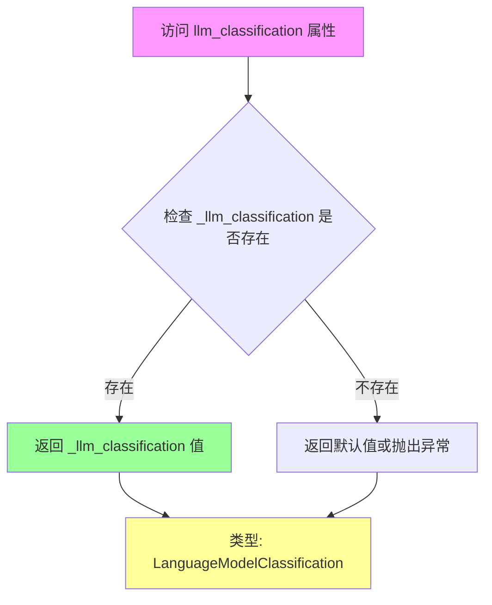
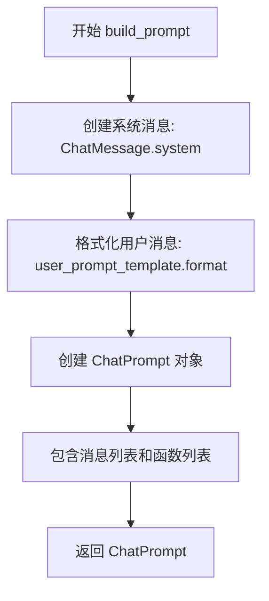

# `.\AutoGPT\classic\original_autogpt\autogpt\agent_factory\profile_generator.py` 详细设计文档

一个基于LLM的智能体配置生成器，通过分析用户任务描述自动创建AI智能体的名称、角色描述、最佳实践和约束条件，支持灵活的prompt模板配置和函数调用机制。

## 整体流程

```mermaid
graph TD
A[开始: 用户输入任务描述] --> B[创建AgentProfileGenerator实例]
B --> C[build_prompt: 构建系统消息和用户消息]
C --> D[调用LLM: create_chat_completion]
D --> E{LLM是否调用create_agent函数?}
E -- 否 --> F[抛出ValueError: 函数未调用]
E -- 是 --> G[parse_response_content: 解析响应内容]
G --> H[提取ai_profile和ai_directives]
H --> I[返回 tuple[AIProfile, AIDirectives]]
```

## 类结构

```
SystemConfiguration (基类)
└── AgentProfileGeneratorConfiguration
PromptStrategy (接口/抽象基类)
└── AgentProfileGenerator
```

## 全局变量及字段


### `generate_agent_profile_for_task`
    
异步函数，根据给定任务生成AI配置文件，包含AIProfile和AIDirectives

类型：`async function`
    


### `AgentProfileGenerator`
    
提示策略类，用于构建和解析代理配置生成的提示

类型：`class`
    


### `AgentProfileGeneratorConfiguration`
    
系统配置类，定义代理配置生成器所需的各项配置参数

类型：`class`
    


### `AgentProfileGeneratorConfiguration.llm_classification`
    
用户可配置的LLM分类属性，默认使用SMART_MODEL

类型：`LanguageModelClassification`
    


### `AgentProfileGeneratorConfiguration._example_call`
    
包含create_agent函数调用示例的字典，用于提示模板中的示例展示

类型：`object`
    


### `AgentProfileGeneratorConfiguration.system_prompt`
    
用户可配置的系统提示文本，指导LLM生成代理配置

类型：`str`
    


### `AgentProfileGeneratorConfiguration.user_prompt_template`
    
用户可配置的用户端提示模板，用于格式化用户目标

类型：`str`
    


### `AgentProfileGeneratorConfiguration.create_agent_function`
    
用户可配置的create_agent函数定义字典，包含参数模式

类型：`dict`
    


### `AgentProfileGenerator._llm_classification`
    
内部存储的LLM分类属性

类型：`LanguageModelClassification`
    


### `AgentProfileGenerator._system_prompt_message`
    
内部存储的系统提示消息文本

类型：`str`
    


### `AgentProfileGenerator._user_prompt_template`
    
内部存储的用户提示模板

类型：`str`
    


### `AgentProfileGenerator._create_agent_function`
    
内部存储的已验证的创建代理函数对象

类型：`CompletionModelFunction`
    
    

## 全局函数及方法


### `generate_agent_profile_for_task`

该函数是一个异步函数，用于根据用户输入的任务描述生成对应的 AI 代理配置文件（AIProfile）和指令（AIDirectives）。它通过调用 LLM 生成包含代理名称、角色描述、最佳实践和约束条件的配置对象。

参数：

- `task`：`str`，用户定义的任务描述字符串，用于指导 AI 代理生成配置文件
- `app_config`：`AppConfig`，应用程序的配置对象，提供 LLM 模型选择等配置信息
- `llm_provider`：`MultiProvider`，多模型提供商实例，用于调用 LLM 生成响应

返回值：`tuple[AIProfile, AIDirectives]`，返回生成的 AI 配置文件和指令元组，包含代理名称、角色描述、最佳实践和约束条件

#### 流程图

```mermaid
flowchart TD
    A[开始: generate_agent_profile_for_task] --> B[使用默认配置实例化 AgentProfileGenerator]
    B --> C[调用 build_prompt 构建提示词]
    C --> D[调用 LLM create_chat_completion 生成响应]
    D --> E[解析响应内容为 AIProfile 和 AIDirectives]
    E --> F[返回 tuple[AIProfile, AIDirectives]]
```

#### 带注释源码

```python
async def generate_agent_profile_for_task(
    task: str,
    app_config: AppConfig,
    llm_provider: MultiProvider,
) -> tuple[AIProfile, AIDirectives]:
    """Generates an AIConfig object from the given string.

    Returns:
    AIConfig: The AIConfig object tailored to the user's input
    """
    # 使用默认配置实例化 AgentProfileGenerator 配置类
    # HACK: 通过 model_dump() 序列化配置对象来传递参数
    agent_profile_generator = AgentProfileGenerator(
        **AgentProfileGenerator.default_configuration.model_dump()  # HACK
    )

    # 使用用户任务描述构建提示词
    prompt = agent_profile_generator.build_prompt(task)

    # 调用 LLM 并传入提示词、模型名称、函数定义和解析器
    output = await llm_provider.create_chat_completion(
        prompt.messages,              # 聊天消息列表
        model_name=app_config.smart_llm,  # 智能 LLM 模型名称
        functions=prompt.functions,   # 可调用函数定义
        completion_parser=agent_profile_generator.parse_response_content,  # 响应解析器
    )

    # 调试日志：输出 LLM 原始响应内容
    logger.debug(f"AI Config Generator Raw Output: {output.response")

    # 返回解析后的 AIProfile 和 AIDirectives 对象
    return output.parsed_result
```


### `AgentProfileGenerator.llm_classification`

该属性是一个只读的getter属性，用于返回AgentProfileGenerator实例的LLM分类配置。该配置决定了在生成AI代理配置文件时使用哪个语言模型分类。

参数：此方法无参数（作为属性访问）

返回值：`LanguageModelClassification`，返回当前配置的LLM分类类型，用于确定生成代理配置文件时使用的模型类别。

#### 流程图



#### 带注释源码

```python
@property
def llm_classification(self) -> LanguageModelClassification:
    """获取当前代理配置生成器的LLM分类属性
    
    这是一个只读属性，通过装饰器实现。
    返回在初始化时设置的LLM分类配置，用于确定
    生成代理配置文件时使用哪个语言模型分类。
    
    Returns:
        LanguageModelClassification: 枚举类型，指定使用的模型分类
                                     (如 SMART_MODEL, FAST_MODEL 等)
    """
    return self._llm_classification
```

#### 相关上下文源码

```python
class AgentProfileGenerator(PromptStrategy):
    """代理配置文件生成器类"""
    
    default_configuration: AgentProfileGeneratorConfiguration = (
        AgentProfileGeneratorConfiguration()
    )

    def __init__(
        self,
        llm_classification: LanguageModelClassification,
        system_prompt: str,
        user_prompt_template: str,
        create_agent_function: dict,
    ):
        """初始化AgentProfileGenerator实例
        
        Args:
            llm_classification: LanguageModelClassification - LLM分类配置
            system_prompt: str - 系统提示词
            user_prompt_template: str - 用户提示词模板
            create_agent_function: dict - 创建代理的函数定义
        """
        self._llm_classification = llm_classification  # 存储LLM分类配置
        self._system_prompt_message = system_prompt
        self._user_prompt_template = user_prompt_template
        self._create_agent_function = CompletionModelFunction.model_validate(
            create_agent_function
        )

    @property
    def llm_classification(self) -> LanguageModelClassification:
        """获取LLM分类配置的只读属性"""
        return self._llm_classification
```

#### 配置类中的定义

```python
class AgentProfileGeneratorConfiguration(SystemConfiguration):
    """代理配置生成器的配置类"""
    
    llm_classification: LanguageModelClassification = UserConfigurable(
        default=LanguageModelClassification.SMART_MODEL  # 默认使用智能模型分类
    )
    # ... 其他配置项
```


### `AgentProfileGenerator.build_prompt`

该方法用于根据用户目标构建提示词（ChatPrompt），包括系统消息、用户消息和创建代理的函数定义。

参数：

- `user_objective`：`str`，用户目标或任务描述，默认为空字符串
- `**kwargs`：可变关键字参数，用于传递额外的参数（当前未使用）

返回值：`ChatPrompt`，包含系统消息、用户消息和创建代理函数定义的提示词对象

#### 流程图



#### 带注释源码

```python
def build_prompt(self, user_objective: str = "", **kwargs) -> ChatPrompt:
    """根据用户目标构建提示词对象。

    该方法创建一个ChatPrompt实例，包含：
    1. 系统消息：告知LLM其角色和任务
    2. 用户消息：包含用户的目标或任务描述
    3. 函数定义：用于创建代理的函数模式

    Args:
        user_objective: 用户的任务目标或需求描述
        **kwargs: 额外的关键字参数（保留用于未来扩展）

    Returns:
        ChatPrompt: 包含完整提示信息的对象，可用于LLM调用
    """
    # 使用系统提示模板创建系统消息
    system_message = ChatMessage.system(self._system_prompt_message)
    
    # 使用用户提示模板格式化用户消息，填入用户目标
    user_message = ChatMessage.user(
        self._user_prompt_template.format(
            user_objective=user_objective,
        )
    )
    
    # 构建最终的提示词对象，包含消息和函数定义
    prompt = ChatPrompt(
        messages=[system_message, user_message],
        functions=[self._create_agent_function],
    )
    
    return prompt
```


### `AgentProfileGenerator.parse_response_content`

该方法负责解析大语言模型（LLM）的响应内容，从工具调用中提取智能体的配置文件和指令集。它验证 LLM 是否正确调用了 `create_agent` 函数，并将返回的参数转换为 `AIProfile` 和 `AIDirectives` 对象供系统使用。

参数：

- `response`：`AssistantChatMessage`，来自目标模型的原始响应内容，包含 LLM 返回的工具调用信息

返回值：`tuple[AIProfile, AIDirectives]`，包含解析后的智能体配置文件（AIProfile）和指令集（AIDirectives）

#### 流程图

```mermaid
flowchart TD
    A[开始解析响应] --> B{response.tool_calls 是否存在?}
    B -->|否| C[抛出 ValueError: 未调用 create_agent 函数]
    B -->|是| D[获取第一个工具调用的参数]
    E[提取 arguments] --> F[创建 AIProfile 对象]
    F --> G[从 directives 中提取 best_practices 和 constraints]
    G --> H[创建 AIDirectives 对象]
    H --> I[返回 tuple[AIProfile, AIDirectives]]
    
    C --> J[记录调试日志]
    J --> K[重新抛出异常]
    
    subgraph 异常处理
    L[捕获 KeyError] --> M[记录调试日志]
    M --> K
    end
    
    E -.->|发生 KeyError| L
```

#### 带注释源码

```python
def parse_response_content(
    self,
    response: AssistantChatMessage,
) -> tuple[AIProfile, AIDirectives]:
    """Parse the actual text response from the objective model.

    Args:
        response_content: The raw response content from the objective model.

    Returns:
        The parsed response.
    """
    try:
        # 验证 LLM 是否调用了 create_agent 函数
        # 如果没有工具调用，说明 LLM 未按预期返回函数调用结果
        if not response.tool_calls:
            raise ValueError(
                f"LLM did not call {self._create_agent_function.name} function; "
                "agent profile creation failed"
            )
        
        # 从第一个工具调用中获取函数参数
        # response.tool_calls[0] 是第一个 (也应该是唯一的) 工具调用
        arguments: object = response.tool_calls[0].function.arguments
        
        # 创建 AIProfile 对象，包含智能体的名称和描述
        # arguments.get("name") 获取智能体名称
        # arguments.get("description") 获取智能体描述
        ai_profile = AIProfile(
            ai_name=arguments.get("name"),  # type: ignore
            ai_role=arguments.get("description"),  # type: ignore
        )
        
        # 创建 AIDirectives 对象，包含最佳实践和约束条件
        # 从 directives 对象中提取 best_practices 和 constraints 数组
        # resources 暂时设为空列表
        ai_directives = AIDirectives(
            best_practices=arguments.get("directives", {}).get("best_practices"),
            constraints=arguments.get("directives", {}).get("constraints"),
            resources=[],
        )
        
    except KeyError:
        # 捕获 KeyError 异常（当 arguments 中缺少必要字段时）
        # 记录调试日志并重新抛出异常，让上层调用者处理
        logger.debug(f"Failed to parse this response content: {response}")
        raise
    
    # 返回解析后的 AIProfile 和 AIDirectives 组成的元组
    return ai_profile, ai_directives
```


## 关键组件


### AgentProfileGeneratorConfiguration

配置类，定义生成代理配置文件所需的系统提示、用户提示模板和LLM分类等参数。

### AgentProfileGenerator

实现PromptStrategy接口的核心类，负责构建提示和解析LLM响应，生成AIProfile和AIDirectives对象。

### generate_agent_profile_for_task

异步顶层函数，接收任务描述、AppConfig和LLM提供器，调用AgentProfileGenerator生成代理配置文件。

### ChatPrompt & ChatMessage

用于构建LLM提示的消息对象，包含系统消息和用户消息，以及函数定义。

### CompletionModelFunction

定义create_agent函数的参数模式，包括name、description和directives的结构化JSON Schema。

### AIProfile & AIDirectives

表示生成的代理配置数据模型，分别存储代理名称/角色和最佳实践/约束。

### MultiProvider & create_chat_completion

LLM调用接口，负责与语言模型交互并获取结构化响应。

### 潜在技术债务

1. HACK注释：default_configuration.model_dump()的hack用法，应采用更规范的依赖注入方式
2. KeyError捕获过于宽泛，logger.debug后直接raise可能暴露内部细节
3. arguments.get("name")使用类型忽略注释，缺少运行时类型验证
4. 资源列表硬编码为空数组[]，未实现资源分配逻辑

### 设计目标与约束

目标：让LLM自动生成符合任务需求的AI代理配置（名称、描述、最佳实践、约束）
约束：最佳实践和约束各限制1-5条，使用JSON Schema强制校验

### 错误处理与异常设计

当LLM未调用create_agent函数时抛出ValueError；解析响应时捕获KeyError并记录debug日志后重新抛出

### 数据流与状态机

用户输入任务 → 构建System+User消息 → 调用LLM → 解析tool_calls → 提取name/description/directives → 返回AIProfile和AIDirectives元组


## 问题及建议


### 已知问题

-   **类型安全风险**：`parse_response_content` 方法中 `arguments` 声明为 `object` 类型，但实际使用 `.get()` 方法访问属性，Python 不会进行类型检查，可能导致运行时错误
-   **不恰当的异常捕获**：使用 `except KeyError` 捕获异常，但实际代码更可能触发 `AttributeError`（当 `response.tool_calls` 为 None 时），异常处理逻辑不够完善
-   **硬编码 Hack 标记**：代码中存在 `# HACK` 注释，使用 `model_dump()` 传递配置参数，这种方式不够规范，表明存在设计缺陷
-   **日志级别不当**：异常时使用 `logger.debug()` 记录失败信息，调试级别日志在生产环境可能被过滤，导致问题难以追踪
-   **资源字段硬编码**：`AIDirectives` 初始化时 `resources` 参数被硬编码为空列表 `[]`，缺乏灵活性
-   **配置不可变性**：配置类使用 `UserConfigurable` 装饰器但未提供运行时修改机制，配置不够灵活
-   **直接实例化依赖**：全局函数内部直接实例化 `AgentProfileGenerator`，未使用依赖注入，降低了可测试性

### 优化建议

-   **改进类型注解**：将 `arguments: object` 改为 `arguments: dict[str, Any]`，使用 `typing` 模块的 `Any` 类型
-   **完善异常处理**：捕获更全面的异常类型（如 `Exception` 或分别捕获 `KeyError` 和 `AttributeError`），并提供更有意义的错误信息
-   **消除 Hack 代码**：重构配置传递方式，使用工厂模式或依赖注入来创建 `AgentProfileGenerator`
-   **提升日志级别**：将 `logger.debug` 改为 `logger.warning` 或 `logger.error`，确保关键错误被记录
-   **解耦资源初始化**：允许调用方传入 `resources` 参数，而非硬编码空列表
-   **引入工厂模式**：创建 `AgentProfileGeneratorFactory` 或接受配置对象的依赖注入，提高可测试性
-   **添加类型转换**：在 `parse_response_content` 中对 `arguments.get()` 的返回值进行类型验证和转换，确保数据符合预期


## 其它


### 设计目标与约束

本模块的核心设计目标是通过大语言模型(LLM)自动生成自定义AI代理的配置文件(AIProfile和AIDirectives)。主要约束包括：1) 必须调用指定的`create_agent`函数而非自由文本生成；2) 生成的代理配置需包含1-5条最佳实践和约束；3) 依赖外部LLM提供商进行实际生成任务。

### 错误处理与异常设计

主要异常场景包括：1) LLM未调用`create_agent`函数时抛出`ValueError`，提示"agent profile creation failed"；2) 解析响应时遇到`KeyError`则记录debug日志并重新抛出异常；3) 配置模型验证失败时由pydantic自动抛出验证错误。异常处理采用向上传播模式，调用方负责捕获和处理。

### 数据流与状态机

数据流如下：用户输入任务字符串→构建系统提示和用户提示模板→调用LLM的`create_chat_completion`→LLM返回tool_calls→解析参数构建AIProfile和AIDirectives→返回给调用方。无状态机设计，属于简单的请求-响应模式。

### 外部依赖与接口契约

核心依赖包括：1) `forge.llm.prompting`模块的`ChatPrompt`、`LanguageModelClassification`、`PromptStrategy`；2) `forge.llm.providers`模块的`MultiProvider`及`CompletionModelFunction`；3) `forge.models`的配置和JSONSchema模型；4) `autogpt.app.config`的`AppConfig`。主要接口契约：`generate_agent_profile_for_task`接受任务字符串、AppConfig和MultiProvider，返回AIProfile和AIDirectives元组。

### 性能考虑

当前实现为同步调用LLM，每次生成都会创建新的`AgentProfileGenerator`实例。潜在优化点：1) 可以考虑缓存`AgentProfileGenerator`实例以减少对象创建开销；2) LLM调用本身是主要性能瓶颈，建议添加超时控制；3) 批量生成多个代理配置时可考虑并行化。

### 安全性考虑

1) 用户输入`task`直接嵌入提示模板，需关注提示注入风险；2) LLM输出需严格验证，特别是`create_agent`函数的参数；3) 函数定义中包含description字段，需确保不泄露敏感信息；4) 日志记录需注意脱敏处理，当前仅debug级别输出原始响应。

### 可测试性设计

测试难点在于依赖外部LLM。设计建议：1) `parse_response_content`方法可 mocked 进行单元测试；2) `build_prompt`方法可完全独立测试；3) 配置类`AgentProfileGeneratorConfiguration`可进行模型验证测试；4) 集成测试需要模拟或mock `MultiProvider`。

### 配置管理

配置通过`AgentProfileGeneratorConfiguration`类集中管理，支持用户配置的字段包括：`llm_classification`（默认SMART_MODEL）、`system_prompt`、`user_prompt_template`、`create_agent_function`。采用pydantic的`UserConfigurable`装饰器实现配置项定义，支持运行时修改。

### 并发与异步处理

`generate_agent_profile_for_task`函数为async函数，支持await调用。底层通过`llm_provider.create_chat_completion`进行异步调用。当前实现无并发控制，多并发调用时需依赖调用方或LLM提供商的并发管理能力。

### 监控与日志策略

日志记录通过`logger`（`__name__`为准）进行：1) debug级别记录LLM原始输出；2) debug级别记录解析失败的响应内容；3) 关键错误通过异常上传播由调用方处理。建议添加：1) 成功/失败计数指标；2) LLM调用耗时监控；3) 令牌使用量统计。

    