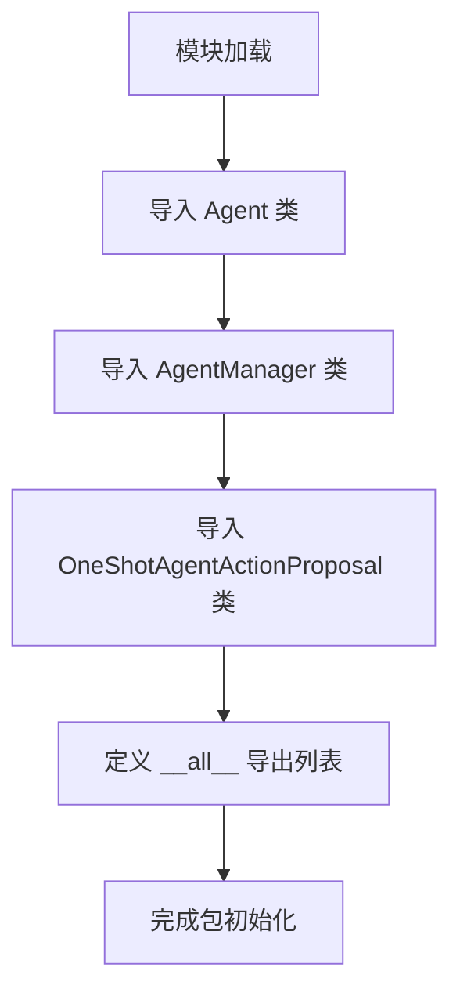

# `.\AutoGPT\classic\original_autogpt\autogpt\agents\__init__.py` 详细设计文档

这是一个AI Agent管理系统的包初始化文件，用于统一导出核心组件：Agent（智能体）、AgentManager（智能体管理器）和OneShotAgentActionProposal（单次提示策略），供外部模块导入使用。

## 整体流程



## 类结构

```
AgentSystem (包根目录)
├── __init__.py (包初始化)
├── agent.py (Agent 智能体类)
├── agent_manager.py (AgentManager 管理器类)
└── prompt_strategies/
    └── one_shot/
        └── one_shot.py (OneShotAgentActionProposal 策略类)
```

## 全局变量及字段


### `__all__`
    
定义了模块的公共接口，指定了使用 from module import * 时可导出的符号列表

类型：`list[str]`
    


    

## 全局函数及方法


## 关键组件


### Agent

核心智能体类，定义智能体的基本行为和能力

### AgentManager

智能体管理器，负责创建、调度和管理多个Agent实例

### OneShotAgentActionProposal

一次性提示策略，用于在单次交互中生成智能体动作提案


## 问题及建议


### 已知问题

-   **缺少模块级文档字符串**：该 `__init__.py` 文件没有模块级别的 docstring，无法快速了解该包的用途和职责边界
-   **包版本信息缺失**：未定义 `__version__` 或 `__author__` 等元数据，不利于版本管理和依赖追踪
-   **导入路径不一致**：`OneShotAgentActionProposal` 来自深度嵌套的 `prompt_strategies.one_shot` 模块，而其他类来自顶层模块，导入路径风格不统一
-   **潜在循环依赖风险**：`Agent` 和 `AgentManager` 相互引用时，通过此 `__init__.py` 导入可能触发循环依赖问题
-   **导出内容受限**：`__all__` 仅暴露 3 个类，可能存在其他有用的类（如异常类、工具类、类型定义）未被导出，用户无法通过 `from package import *` 访问

### 优化建议

-   添加模块级 docstring，说明该包的核心功能（例如：Agent 管理和编排框架）
-   添加 `__version__ = "x.x.x"` 版本声明，并考虑添加 `__author__` 和 `__license__`
-   统一导入路径风格，如将 `OneShotAgentActionProposal` 相关的模块组织到独立的子包中
-   考虑添加 `Optional` 类型的延迟导入或异常处理，提升导入失败时的错误可读性
-   审查并扩展 `__all__` 导出列表，包含更多公共 API（如类型别名、配置类等）
-   添加类型注解文件（`.pyi`）或使用 `from __future__ import annotations` 提升类型安全


## 其它


### 设计目标与约束

本模块旨在提供一个轻量级、可扩展的多代理系统框架，支持Agent的创建、管理和动作建议生成。设计约束包括：1) 保持模块间低耦合度；2) 遵循Python包的最佳实践；3) 支持插件化的策略模式；4) 最小化外部依赖。

### 错误处理与异常设计

模块级导入应处理ImportError，确保依赖的agent、agent_manager和prompt_strategies模块存在。建议在AgentManager中实现异常捕获机制，处理Agent创建失败、动作建议超时等场景。OneShotAgentActionProposal应定义自定义异常类用于策略执行失败的情况。

### 数据流与状态机

数据流：外部调用 → AgentManager.create_agent() → Agent实例化 → OneShotAgentActionProposal.propose() → 返回动作建议。状态机：Agent生命周期包括created、initialized、running、stopped、error等状态，由AgentManager统一管理状态转换。

### 外部依赖与接口契约

本模块依赖agent模块（Agent类）、agent_manager模块（AgentManager类）和prompt_strategies.one_shot模块（OneShotAgentActionProposal类）。对外提供的接口包括：AgentManager.create_agent()、Agent.execute()、OneShotAgentActionProposal.propose()。消费者需确保已安装所有依赖模块。

### 安全性考虑

导入路径验证：使用相对导入（from .module）确保包内模块正确引用。命名空间保护：__all__明确导出公开接口，避免污染使用者命名空间。建议添加类型注解（typing）以支持静态类型检查。

### 性能考量

模块采用延迟导入模式，仅在from ... import时加载类定义。Agent实例化应为轻量级操作，避免在__init__中执行耗时计算。AgentManager应维护Agent实例缓存，避免重复创建相同配置的Agent。

### 配置与扩展性

扩展点：OneShotAgentActionProposal为策略模式实现，可通过继承扩展多策略支持。配置传递：Agent和AgentManager构造函数接受kwargs，实现灵活配置。建议使用dataclasses或pydantic定义配置模型。

### 测试策略

单元测试：针对Agent、AgentManager和OneShotAgentActionProposal分别编写测试用例。集成测试：验证模块间导入和协作是否正常。Mock策略：使用unittest.mock模拟依赖模块进行隔离测试。

### 版本兼容性

当前版本应兼容Python 3.8+。建议在setup.py或pyproject.toml中明确python_requires。后续API变更应遵循语义化版本规范（SemVer）。

### 部署与运维

本模块为纯Python包，可通过pip install直接部署。建议使用虚拟环境管理依赖。容器化部署时需确保所有依赖模块版本兼容。日志级别应可配置，便于运维监控。

### 代码规范与约定

遵循PEP 8命名规范（类名大驼峰，函数名小驼峰）。使用docstring编写类和方法文档。建议添加__version__变量标识版本号。import顺序：标准库 → 第三方库 → 本地模块。

    