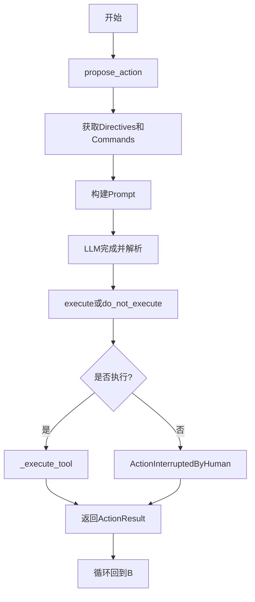
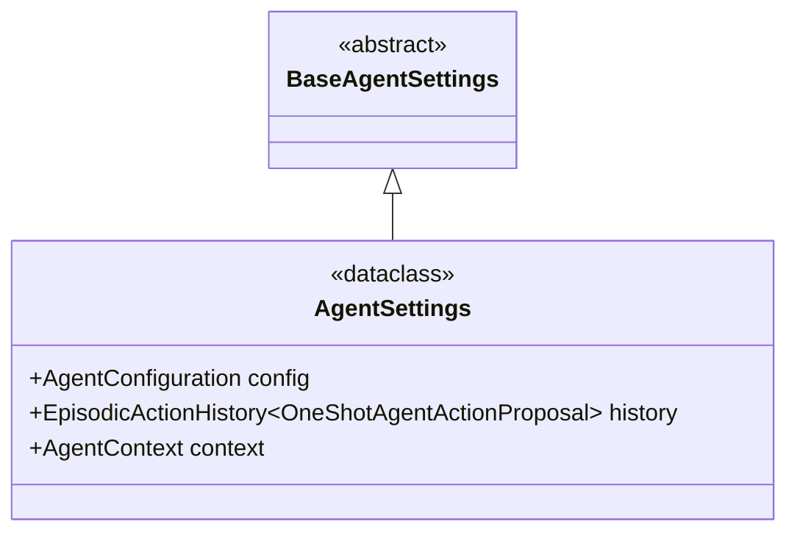
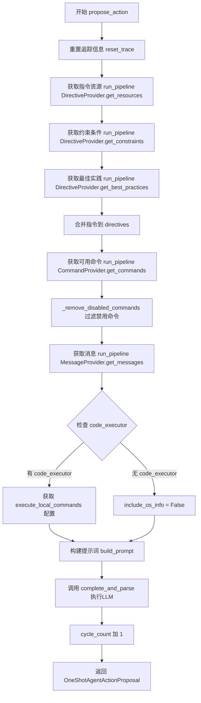
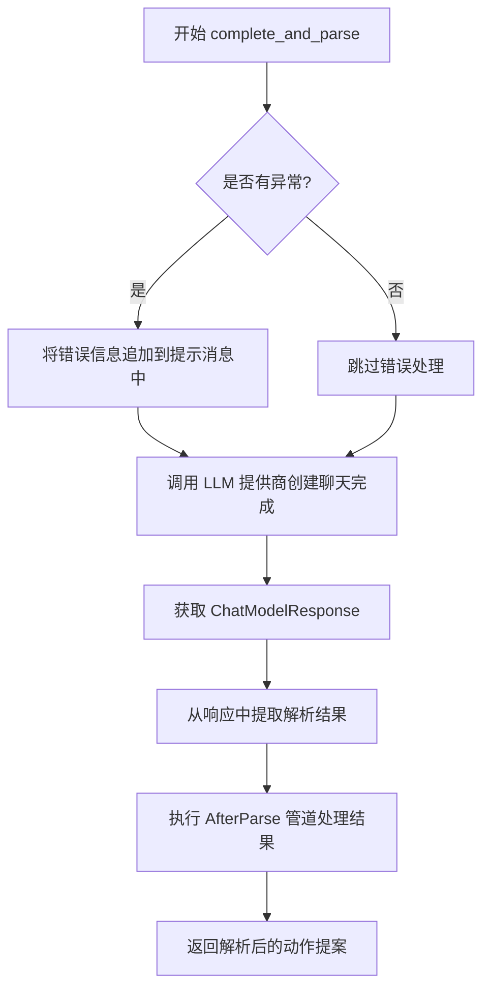
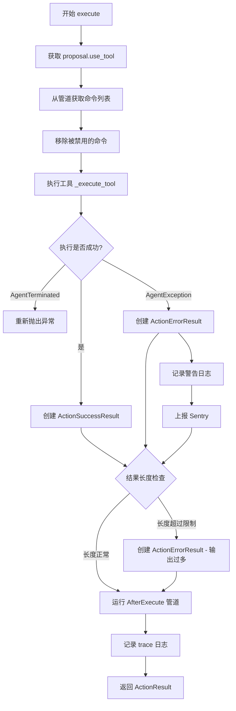
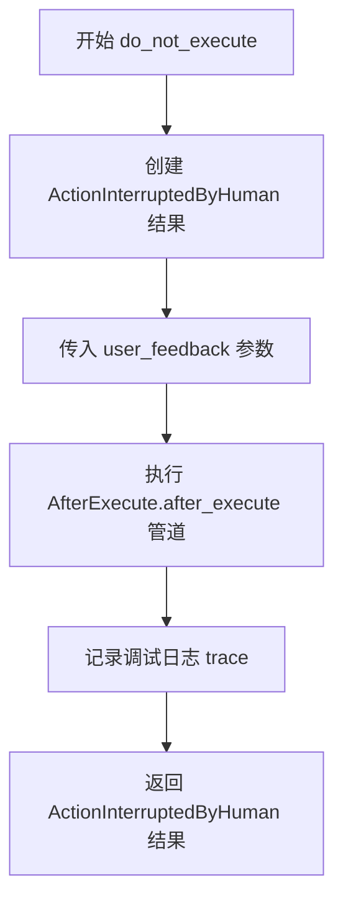
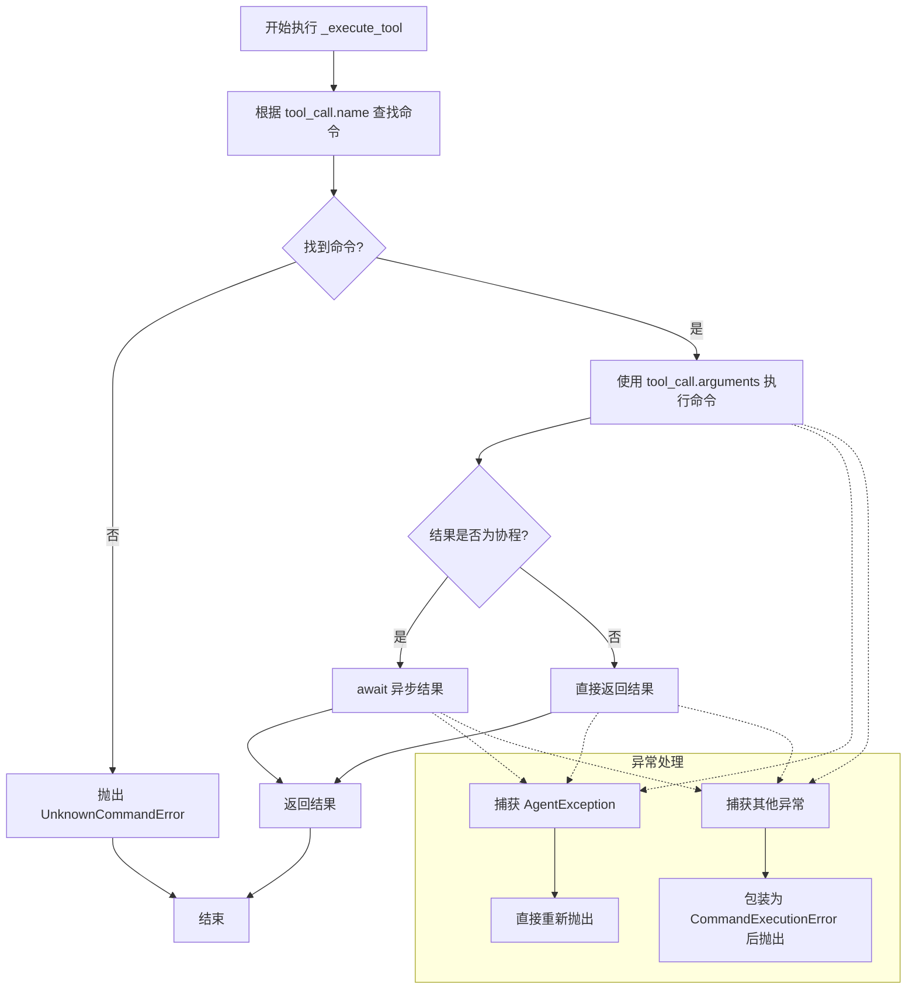
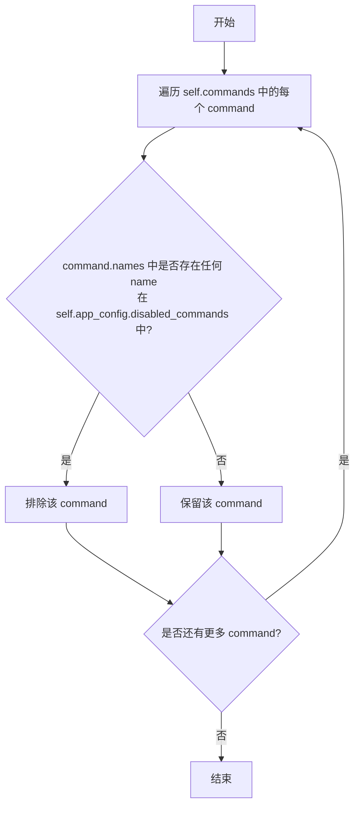
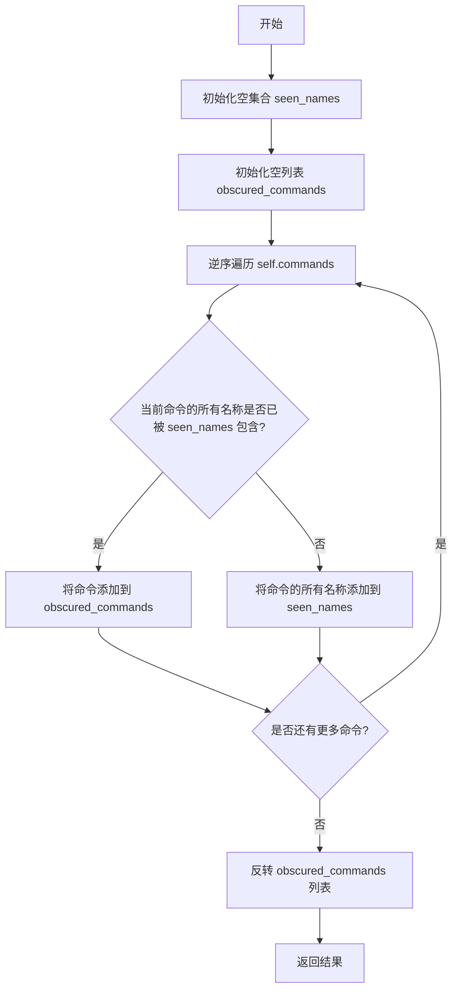
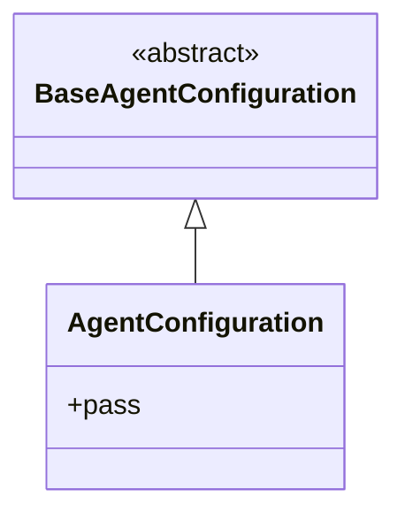

# `.\AutoGPT\classic\original_autogpt\autogpt\agents\agent.py` 详细设计文档

这是一个基于MultiProvider的AI Agent实现，集成多种组件（文件系统、代码执行、Git操作、Web搜索等），通过prompt策略与大语言模型交互，实现任务分解、动作提案、执行和结果反馈的完整Agent循环。

## 整体流程



## 类结构

```
BaseAgent (抽象基类)
└── Agent (主Agent类)
    ├── AgentConfiguration
    ├── AgentSettings
    └── 集成组件:
        ├── SystemComponent
        ├── ActionHistoryComponent
        ├── UserInteractionComponent
        ├── FileManagerComponent
        ├── CodeExecutorComponent
        ├── GitOperationsComponent
        ├── ImageGeneratorComponent
        ├── WebSearchComponent
        ├── WebSeleniumComponent
        ├── ContextComponent
        └── WatchdogComponent
```

## 全局变量及字段


### `logger`
    
用于记录模块日志的Logger实例

类型：`logging.Logger`
    


### `AgentSettings.config`
    
代理的配置信息

类型：`AgentConfiguration`
    


### `AgentSettings.history`
    
代理的动作历史记录

类型：`EpisodicActionHistory[OneShotAgentActionProposal]`
    


### `AgentSettings.context`
    
代理的上下文信息

类型：`AgentContext`
    


### `Agent.llm_provider`
    
大语言模型提供者，用于与LLM交互

类型：`MultiProvider`
    


### `Agent.prompt_strategy`
    
提示词策略，用于构建和解析提示

类型：`OneShotAgentPromptStrategy`
    


### `Agent.commands`
    
代理当前可用的命令列表

类型：`list[Command]`
    


### `Agent.system`
    
系统组件，提供系统级指令和约束

类型：`SystemComponent`
    


### `Agent.history`
    
动作历史组件，管理对话历史和记忆

类型：`ActionHistoryComponent`
    


### `Agent.user_interaction`
    
用户交互组件，处理用户反馈和输入

类型：`UserInteractionComponent`
    


### `Agent.file_manager`
    
文件管理组件，处理文件读写操作

类型：`FileManagerComponent`
    


### `Agent.code_executor`
    
代码执行组件，安全地执行Python代码

类型：`CodeExecutorComponent`
    


### `Agent.git_ops`
    
Git操作组件，执行版本控制操作

类型：`GitOperationsComponent`
    


### `Agent.image_gen`
    
图像生成组件，处理图像创建任务

类型：`ImageGeneratorComponent`
    


### `Agent.web_search`
    
网络搜索组件，执行网页搜索

类型：`WebSearchComponent`
    


### `Agent.web_selenium`
    
Selenium网络组件，处理浏览器自动化操作

类型：`WebSeleniumComponent`
    


### `Agent.context`
    
上下文组件，管理代理的工作上下文

类型：`ContextComponent`
    


### `Agent.watchdog`
    
看门狗组件，监控代理状态并处理异常

类型：`WatchdogComponent`
    


### `Agent.event_history`
    
事件历史记录，存储完整的动作序列

类型：`EpisodicActionHistory`
    


### `Agent.app_config`
    
应用程序配置，包含全局设置和选项

类型：`AppConfig`
    
    

## 全局函数及方法


### `AgentConfiguration`

AgentConfiguration 是一个简单的配置类，继承自 BaseAgentConfiguration，用于定义 Agent 的核心配置项。该类作为配置模型被 AgentSettings 引用，为代理实例提供配置支持。

#### 带注释源码

```python
class AgentConfiguration(BaseAgentConfiguration):
    """Agent 配置类，继承自 BaseAgentConfiguration。
    
    该类作为配置模型定义 Agent 的行为和属性，
    目前通过继承获得基础配置能力，具体配置项由父类定义。
    """
    pass  # 空类实现，通过继承获得配置字段和能力
```

#### 说明

`AgentConfiguration` 是一个配置数据类，主要特点如下：

1. **继承结构**：继承自 `BaseAgentConfiguration`，后者通常为 Pydantic BaseModel，用于定义配置字段
2. **设计目的**：作为配置载体，在 `AgentSettings` 中实例化用于配置 Agent 的行为
3. **使用方式**：在 `AgentSettings` 类中作为默认配置字段使用：
   ```python
   config: AgentConfiguration = Field(
       default_factory=AgentConfiguration
   )
   ```

4. **技术细节**：
   - 使用 `Field` 和 `default_factory` 确保每次创建 `AgentSettings` 时都会生成新的配置实例
   - 该类本身为空实现，配置字段由父类 `BaseAgentConfiguration` 定义

5. **潜在优化空间**：
   - 如果需要自定义配置字段，可以在此类中添加
   - 当前为占位符实现，可能需要根据实际需求扩展配置项


### `AgentSettings`

这是一个 Pydantic 数据模型类，用于定义代理（Agent）的配置和状态信息。它继承自 `BaseAgentSettings`，包含了代理运行所需的核心配置项，如代理配置对象、历史记录和执行上下文。

参数：

- （无，此为类定义，非函数/方法）

返回值：

- （无，此为类定义，非函数/方法）

#### 流程图



#### 带注释源码

```python
class AgentSettings(BaseAgentSettings):
    """代理设置数据模型
    
    该类定义了代理实例运行所需的核心配置和状态字段，
    继承自 BaseAgentSettings，使用 Pydantic Field 进行字段定义。
    """
    
    # 代理运行时配置，包含模型选择、功能开关等配置项
    config: AgentConfiguration = Field(  # type: ignore
        default_factory=AgentConfiguration
    )

    # 代理的动作历史记录，用于跟踪和回溯代理的执行历史
    # 类型为情景动作历史，存储 OneShotAgentActionProposal 类型的动作提案
    history: EpisodicActionHistory[OneShotAgentActionProposal] = Field(
        default_factory=EpisodicActionHistory[OneShotAgentActionProposal]
    )
    """(STATE) The action history of the agent."""

    # 代理的上下文信息，包含工作空间、变量等运行时上下文
    context: AgentContext = Field(default_factory=AgentContext)
```


### Agent.__init__

这是 Agent 类的初始化方法，负责创建 Agent 实例并初始化所有必要的组件，包括 LLM 提供者、文件存储、各种功能组件（系统、历史、文件管理、代码执行、Git 操作、Web 搜索等）以及配置。

参数：

- `settings`：`AgentSettings`，代理的配置设置，包含代理的标识、描述、历史记录和上下文等信息
- `llm_provider`：`MultiProvider`，多模型 LLM 提供者，用于处理语言模型调用
- `file_storage`：`FileStorage`，文件存储接口，用于管理文件的读写操作
- `app_config`：`AppConfig`，应用程序的全局配置

返回值：`None`，该方法为构造函数，不返回任何值

#### 流程图

```mermaid
flowchart TD
    A[开始 __init__] --> B[调用父类 super().__init__settings]
    B --> C[设置 self.llm_provider]
    C --> D[创建并配置 OneShotAgentPromptStrategy]
    D --> E[初始化 self.commands = []]
    E --> F[创建 SystemComponent]
    F --> G[创建 ActionHistoryComponent<br/>链式调用 WatchdogComponent<br/>链式调用 SystemComponent]
    G --> H{app_config.noninteractive_mode?}
    H -->|是| I[跳过 UserInteractionComponent]
    H -->|否| J[创建 UserInteractionComponent]
    J --> K[创建 FileManagerComponent]
    K --> L[创建 CodeExecutorComponent]
    L --> M[创建 GitOperationsComponent]
    M --> N[创建 ImageGeneratorComponent]
    N --> O[创建 WebSearchComponent]
    O --> P[创建 WebSeleniumComponent]
    P --> Q[创建 ContextComponent]
    Q --> R[创建 WatchdogComponent<br/>链式调用 ContextComponent]
    R --> S[设置 self.event_history]
    S --> T[设置 self.app_config]
    T --> U[结束 __init__]
```

#### 带注释源码

```python
def __init__(
    self,
    settings: AgentSettings,
    llm_provider: MultiProvider,
    file_storage: FileStorage,
    app_config: AppConfig,
):
    """初始化 Agent 实例
    
    参数:
        settings: AgentSettings - 代理的配置设置
        llm_provider: MultiProvider - LLM 提供者
        file_storage: FileStorage - 文件存储接口
        app_config: AppConfig - 应用程序配置
    """
    # 调用父类 BaseAgent 和 Configurable 的初始化方法
    super().__init__(settings)

    # 设置 LLM 提供者
    self.llm_provider = llm_provider
    
    # 创建并配置提示策略的默认配置
    prompt_config = OneShotAgentPromptStrategy.default_configuration.model_copy(
        deep=True
    )
    # 根据配置决定是否使用 functions API
    # Anthropic 目前不支持 tools + prefilling，所以需要排除
    prompt_config.use_functions_api = (
        settings.config.use_functions_api
        and self.llm.provider_name != "anthropic"
    )
    # 初始化提示策略
    self.prompt_strategy = OneShotAgentPromptStrategy(prompt_config, logger)
    # 初始化命令列表
    self.commands: list[Command] = []

    # ============ 组件初始化 ============
    
    # 系统组件：提供系统级别的指令和约束
    self.system = SystemComponent()
    
    # 动作历史组件：记录代理的执行历史
    # 包含令牌计数回调、LLM 提供者、历史配置
    # 链式注册：执行后运行 WatchdogComponent，再运行 SystemComponent
    self.history = (
        ActionHistoryComponent(
            settings.history,
            lambda x: self.llm_provider.count_tokens(x, self.llm.name),
            llm_provider,
            ActionHistoryConfiguration(
                llm_name=app_config.fast_llm, max_tokens=self.send_token_limit
            ),
        )
        .run_after(WatchdogComponent)
        .run_after(SystemComponent)
    )
    
    # 用户交互组件：仅在非交互模式下创建
    if not app_config.noninteractive_mode:
        self.user_interaction = UserInteractionComponent()
    
    # 文件管理器组件：管理文件操作
    self.file_manager = FileManagerComponent(file_storage, settings)
    
    # 代码执行器组件：在沙箱环境中执行代码
    self.code_executor = CodeExecutorComponent(
        self.file_manager.workspace,
        CodeExecutorConfiguration(
            docker_container_name=f"{settings.agent_id}_sandbox"
        ),
    )
    
    # Git 操作组件：处理 Git 仓库操作
    self.git_ops = GitOperationsComponent()
    
    # 图像生成组件：生成图像
    self.image_gen = ImageGeneratorComponent(self.file_manager.workspace)
    
    # Web 搜索组件：执行网络搜索
    self.web_search = WebSearchComponent()
    
    # Web Selenium 组件：使用 Selenium 进行网页自动化
    self.web_selenium = WebSeleniumComponent(
        llm_provider,
        app_config.app_data_dir,
    )
    
    # 上下文组件：管理代理的上下文信息
    self.context = ContextComponent(self.file_manager.workspace, settings.context)
    
    # 看门狗组件：监控代理执行过程
    # 链式注册：执行后运行 ContextComponent
    self.watchdog = WatchdogComponent(settings.config, settings.history).run_after(
        ContextComponent
    )

    # ============ 状态和配置 ============
    
    # 事件历史：用于追踪执行历史
    self.event_history = settings.history
    # 应用配置：保存全局应用配置
    self.app_config = app_config
```


### `Agent.propose_action`

该方法是Agent的核心决策方法，负责根据当前任务状态、可用资源和约束条件，通过LLM生成并解析下一个应执行的行动提案，是Agent任务执行循环中的关键步骤。

#### 类详细信息

**类名：** `Agent`

**类描述：** OneShotAgent是基于LLM的自主Agent实现，继承自`BaseAgent`和`Configurable`，集成了多个组件（文件系统、代码执行、Git操作、Web搜索等）来执行复杂任务。

#### 方法详细信息

**方法名称：** `Agent.propose_action`

**方法描述：** 提议下一个要执行的动作，基于任务和当前状态，通过运行指令管道获取资源和约束，构建提示词后调用LLM完成并解析响应。

**参数：** 无

**返回值：** `OneShotAgentActionProposal`，包含LLM生成的工具调用建议和智能体的思考过程

#### 流程图



#### 带注释源码

```python
async def propose_action(self) -> OneShotAgentActionProposal:
    """Proposes the next action to execute, based on the task and current state.

    Returns:
        The command name and arguments, if any, and the agent's thoughts.
    """
    # 重置分布式追踪/日志收集器
    self.reset_trace()

    # ====== 第一步：获取指令系统 ======
    # 从各个DirectiveProvider组件获取资源列表
    resources = await self.run_pipeline(DirectiveProvider.get_resources)
    # 从各个DirectiveProvider组件获取约束条件列表
    constraints = await self.run_pipeline(DirectiveProvider.get_constraints)
    # 从各个DirectiveProvider组件获取最佳实践列表
    best_practices = await self.run_pipeline(DirectiveProvider.get_best_practices)

    # 合并基础指令与动态获取的指令
    directives = self.state.directives.model_copy(deep=True)
    directives.resources += resources
    directives.constraints += constraints
    directives.best_practices += best_practices

    # ====== 第二步：获取可用命令 ======
    # 从CommandProvider组件获取当前可用的命令列表
    self.commands = await self.run_pipeline(CommandProvider.get_commands)
    # 根据app_config.disabled_commands过滤掉被禁用的命令
    self._remove_disabled_commands()

    # ====== 第三步：获取消息历史 ======
    # 从MessageProvider组件获取对话消息历史
    messages = await self.run_pipeline(MessageProvider.get_messages)

    # 判断是否需要在提示词中包含操作系统信息
    # 只有当code_executor组件存在且配置允许执行本地命令时才包含
    include_os_info = (
        self.code_executor.config.execute_local_commands
        if hasattr(self, "code_executor")
        else False
    )

    # ====== 第四步：构建提示词 ======
    # 使用OneShotAgentPromptStrategy构建完整的LLM提示词
    prompt: ChatPrompt = self.prompt_strategy.build_prompt(
        messages=messages,
        task=self.state.task,
        ai_profile=self.state.ai_profile,
        ai_directives=directives,
        commands=function_specs_from_commands(self.commands),
        include_os_info=include_os_info,
    )

    # 调试日志：输出完整提示词内容
    logger.debug(f"Executing prompt:\n{dump_prompt(prompt)}")
    
    # ====== 第五步：执行LLM并解析结果 ======
    output = await self.complete_and_parse(prompt)
    
    # 记录执行周期数，用于监控和调试
    self.config.cycle_count += 1

    # 返回解析后的动作提案
    return output
```

#### 关键组件信息

| 组件名称 | 描述 |
|---------|------|
| `DirectiveProvider` | 提供Agent运行的指令系统，包括资源、约束和最佳实践 |
| `CommandProvider` | 提供Agent可执行的命令列表 |
| `MessageProvider` | 提供对话历史消息 |
| `OneShotAgentPromptStrategy` | 负责构建LLM提示词和解析响应内容 |
| `ActionHistoryComponent` | 管理Agent的行动历史和token限制 |

#### 潜在的技术债务或优化空间

1. **指令合并效率问题**：每次调用都运行三次`run_pipeline`获取资源、约束和最佳实践，可考虑合并为单次调用
2. **命令过滤重复计算**：命令列表获取后立即过滤禁用命令，但在`execute`方法中会再次获取命令，存在重复调用
3. **提示词构建复杂**：`build_prompt`方法承担过多职责，可拆分优化
4. **缺少重试机制**：LLM调用失败时没有重试逻辑，可能导致任务中断

#### 其它项目

**设计目标与约束：**
- 目标：基于单轮LLM调用生成可执行的行动提案
- 约束：受限于`send_token_limit`（通常为上下文窗口的75%）

**错误处理与异常设计：**
- 异常处理主要在`complete_and_parse`方法中，通过`exception`参数传递错误信息给LLM
- LLM返回结果后通过`AfterParse`管道进行后处理

**数据流与状态机：**
- 该方法处于Agent主循环的核心位置，上承任务初始化，下启动作执行
- 状态通过`self.state`（AgentState）管理，包括task、ai_profile、directives等

**外部依赖与接口契约：**
- 依赖`MultiProvider`进行LLM调用
- 依赖`prompt_strategy`进行提示词构建和响应解析
- 返回的`OneShotAgentActionProposal`需符合协议定义的格式


### `Agent.complete_and_parse`

该方法负责将聊天提示发送给 LLM 提供商，获取响应后使用提示策略解析响应内容，并通过 `AfterParse` 管道后返回解析后的动作提案。

**参数：**

- `self`：隐式参数，`Agent` 实例本身
- `prompt`：`ChatPrompt`，要发送给 LLM 的聊天提示
- `exception`：`Optional[Exception]`，可选参数，处理过程中捕获的异常，默认为 `None`

**返回值：** `OneShotAgentActionProposal`，LLM 返回的解析后的动作提案

#### 流程图



#### 带注释源码

```python
async def complete_and_parse(
    self, prompt: ChatPrompt, exception: Optional[Exception] = None
) -> OneShotAgentActionProposal:
    """完成提示并解析 LLM 响应

    Args:
        prompt: 要发送给 LLM 的聊天提示
        exception: 可选的异常，如果提供则会将错误信息追加到提示中

    Returns:
        OneShotAgentActionProposal: 解析后的动作提案
    """
    # 如果存在异常，将错误信息作为系统消息追加到提示中
    if exception:
        prompt.messages.append(ChatMessage.system(f"Error: {exception}"))

    # 调用 LLM 提供商创建聊天完成
    response: ChatModelResponse[
        OneShotAgentActionProposal
    ] = await self.llm_provider.create_chat_completion(
        prompt.messages,           # 提示消息列表
        model_name=self.llm.name,   # 使用的模型名称
        completion_parser=self.prompt_strategy.parse_response_content,  # 响应解析器
        functions=prompt.functions,  # 可用的函数定义
        prefill_response=prompt.prefill_response,  # 预填充响应
    )
    # 从响应中获取解析后的结果
    result = response.parsed_result

    # 执行 AfterParse 管道，处理解析后的结果
    await self.run_pipeline(AfterParse.after_parse, result)

    # 返回最终的解析结果
    return result
```


### `Agent.execute`

该方法负责执行Agent的动作提案，处理命令执行、异常捕获、结果封装和管道回调，是Agent执行循环中的核心执行环节。

参数：

- `self`：Agent，Agent实例本身
- `proposal`：OneShotAgentActionProposal，动作提案，包含要执行的工具调用信息
- `user_feedback`：str，用户反馈，默认为空字符串，用于在用户中断时传递反馈信息

返回值：`ActionResult`，执行结果，可以是成功结果、错误结果或被用户中断的结果

#### 流程图



#### 带注释源码

```python
async def execute(
    self,
    proposal: OneShotAgentActionProposal,
    user_feedback: str = "",
) -> ActionResult:
    """执行Agent的动作提案
    
    Args:
        proposal: 包含要执行的工具调用信息的动作提案
        user_feedback: 用户反馈，用于用户中断场景
    
    Returns:
        ActionResult: 执行结果，可能是成功、错误或被用户中断
    """
    # 从提案中获取要执行的工具
    tool = proposal.use_tool

    # 通过管道获取当前可用的命令列表
    self.commands = await self.run_pipeline(CommandProvider.get_commands)
    # 根据配置移除被禁用的命令
    self._remove_disabled_commands()

    try:
        # 执行工具并获取返回值
        return_value = await self._execute_tool(tool)

        # 封装成功结果
        result = ActionSuccessResult(outputs=return_value)
    except AgentTerminated:
        # Agent被终止，重新抛出异常
        raise
    except AgentException as e:
        # Agent相关异常，记录并封装为错误结果
        result = ActionErrorResult.from_exception(e)
        logger.warning(f"{tool} raised an error: {e}")
        # 上报Sentry用于监控
        sentry_sdk.capture_exception(e)

    # 检查结果长度是否超过阈值（令牌限制的1/3）
    result_tlength = self.llm_provider.count_tokens(str(result), self.llm.name)
    if result_tlength > self.send_token_limit // 3:
        result = ActionErrorResult(
            reason=f"Command {tool.name} returned too much output. "
            "Do not execute this command again with the same arguments."
        )

    # 执行完成后运行管道回调
    await self.run_pipeline(AfterExecute.after_execute, result)

    # 记录调试追踪信息
    logger.debug("\n".join(self.trace))

    return result
```


### `Agent.do_not_execute`

该方法用于处理被用户拒绝的代理提案，当用户选择不执行某个提议的动作时，记录用户的反馈信息并通过后处理管道，同时返回一个人类中断的结果。

参数：

- `denied_proposal`：`OneShotAgentActionProposal`，被用户拒绝的代理动作提案
- `user_feedback`：`str`，用户提供的反馈信息，说明拒绝的原因

返回值：`ActionResult`，返回包含用户反馈的中断结果对象

#### 流程图



#### 带注释源码

```python
async def do_not_execute(
    self, denied_proposal: OneShotAgentActionProposal, user_feedback: str
) -> ActionResult:
    """当用户拒绝执行某个提案时调用此方法
    
    Args:
        denied_proposal: 被用户拒绝的代理动作提案
        user_feedback: 用户提供的拒绝理由或反馈
    
    Returns:
        ActionResult: 返回一个包含用户反馈的中断结果
    """
    # 创建一个人类中断结果对象，包含用户的反馈信息
    result = ActionInterruptedByHuman(feedback=user_feedback)

    # 运行后执行管道，处理动作执行后的清理或通知工作
    await self.run_pipeline(AfterExecute.after_execute, result)

    # 打印调试日志，记录完整的执行追踪信息
    logger.debug("\n".join(self.trace))

    # 返回中断结果，标识该动作被用户手动中断
    return result
```


### `Agent._execute_tool`

执行指定工具调用并返回执行结果。该方法首先根据工具名称查找对应的命令，然后执行该命令并处理异步结果，最后进行异常处理。

参数：

- `tool_call`：`AssistantFunctionCall`，要执行的工具调用对象，包含命令名称和参数

返回值：`Any`，命令的执行结果

#### 流程图



#### 带注释源码

```python
async def _execute_tool(self, tool_call: AssistantFunctionCall) -> Any:
    """Execute the command and return the result
    # 执行命令并返回结果

    Args:
        tool_call (AssistantFunctionCall): The tool call to execute
        # tool_call: 要执行的工具调用，包含命令名称和参数

    Returns:
        str: The execution result
        # 返回: 命令的执行结果
    """
    # Execute a native command with the same name or alias, if it exists
    # 根据 tool_call 中的命令名称从已注册的命令列表中查找对应的命令
    command = self._get_command(tool_call.name)
    
    try:
        # 使用 tool_call 中的参数调用命令
        # **tool_call.arguments 将参数字典解包传递给命令函数
        result = command(**tool_call.arguments)
        
        # 检查返回结果是否为协程（异步函数）
        # 如果是异步函数则需要 await，否则直接返回结果
        if inspect.isawaitable(result):
            return await result
        return result
        
    except AgentException:
        # AgentException 是业务逻辑相关的异常，直接重新抛出
        # 这些异常已经过适当处理，不需要额外包装
        raise
        
    except Exception as e:
        # 捕获其他所有异常，并包装为 CommandExecutionError
        # 提供更清晰的错误信息给上层调用者
        raise CommandExecutionError(str(e))
```


### `Agent._get_command`

根据命令名称从已注册的命令列表中查找并返回对应的 `Command` 对象。如果在命令列表中找不到指定名称的命令，则抛出 `UnknownCommandError` 异常。

参数：

- `command_name`：`str`，要查找的命令名称

返回值：`Command`，返回匹配名称的命令对象

#### 流程图

```mermaid
flowchart TD
    A[开始 _get_command] --> B{遍历 commands 列表}
    B --> C{command_name in command.names?}
    C -->|是| D[返回匹配的 Command 对象]
    C -->|否| E[继续遍历下一个 command]
    E --> B
    B --> F{遍历结束未找到匹配}
    F --> G[抛出 UnknownCommandError]
    G --> H[异常: Cannot execute command '{command_name}': unknown command.]
```

#### 带注释源码

```python
def _get_command(self, command_name: str) -> Command:
    """根据命令名称查找并返回对应的命令对象。

    该方法从命令列表（self.commands）中反向遍历，查找名称匹配的命令。
    使用反向遍历是为了确保在存在同名命令时，返回最后注册的命令（优先级最高）。

    Args:
        command_name (str): 要查找的命令名称，可以是命令的主名称或任意别名。

    Returns:
        Command: 匹配名称的命令对象。

    Raises:
        UnknownCommandError: 当命令列表中找不到指定名称的命令时抛出。
    """
    # 反向遍历命令列表，以便优先返回后注册的命令（覆盖同名命令）
    for command in reversed(self.commands):
        # 检查传入的命令名称是否在当前命令的 names 列表中（包括主名称和别名）
        if command_name in command.names:
            # 找到匹配的命令，返回该 Command 对象
            return command

    # 遍历完所有命令仍未找到匹配，抛出 UnknownCommandError 异常
    raise UnknownCommandError(
        f"Cannot execute command '{command_name}': unknown command."
    )
```


### `Agent._remove_disabled_commands`

该方法从命令列表中移除被禁用的命令，通过检查每个命令的所有名称是否存在于应用配置的禁用命令集合中，实现命令过滤功能。

参数：

- `self`：`Agent`，方法的隐式参数，代表当前Agent实例

返回值：`None`，该方法不返回任何值，直接修改实例属性 `self.commands`

#### 流程图



#### 带注释源码

```python
def _remove_disabled_commands(self) -> None:
    """从命令列表中移除被禁用的命令。
    
    该方法检查 self.commands 列表中的每个命令，
    如果命令的任何名称在 app_config.disabled_commands 中被找到，
    则将该命令从列表中移除。
    """
    self.commands = [
        command
        for command in self.commands  # 遍历当前所有命令
        if not any(  # 如果以下条件都不满足，则保留命令
            name in self.app_config.disabled_commands  # 检查命令名称是否在禁用列表中
            for name in command.names  # 遍历该命令的所有名称和别名
        )
    ]
```


### `Agent.find_obscured_commands`

该方法用于识别并返回被隐藏的命令。在 Agent 的命令列表中，如果某个命令的所有名称（包含别名）都已经在后续命令中出现过，则该命令被视为被隐藏的。

参数：

- 无（仅 `self` 参数）

返回值：`list[Command]`，返回被隐藏的命令列表，这些命令的所有名称都已被其他命令所包含。

#### 流程图



#### 带注释源码

```python
def find_obscured_commands(self) -> list[Command]:
    """找出所有被隐藏的命令。
    
    被隐藏的命令是指其所有名称/别名都已在后续命令中出现过的命令。
    这是为了避免在有多个同名或同别名的命令时，优先使用较晚定义的命令。
    
    Returns:
        list[Command]: 返回被隐藏的命令列表
    """
    # 用于记录已经出现过的所有命令名称
    seen_names = set()
    # 用于存储被隐藏的命令
    obscured_commands = []
    
    # 逆序遍历命令列表，这样先处理后面的命令
    for command in reversed(self.commands):
        # 如果当前命令的所有名称都已经在 seen_names 中出现过，
        # 说明该命令被后面的命令隐藏了
        if seen_names.issuperset(command.names):
            obscured_commands.append(command)
        else:
            # 否则，将该命令的所有名称添加到已见集合中
            seen_names.update(command.names)
    
    # 逆序返回，以保持原有的命令顺序
    return list(reversed(obscured_commands))
```


### `AgentConfiguration`

该类是 `BaseAgentConfiguration` 的具体实现，用于配置 OneShotAgent 的行为，目前未定义任何额外配置字段，仅作为配置模型的标记类使用。

参数：

- （无，类定义中未定义 `__init__` 方法）

返回值：

- （无，类定义中未定义任何方法）

#### 流程图



#### 带注释源码

```python
class AgentConfiguration(BaseAgentConfiguration):
    """AgentConfiguration 类继承自 BaseAgentConfiguration。

    该类目前为一个空类（仅包含 pass 语句），用于定义 OneShotAgent 的配置结构。
    所有配置字段实际上继承自父类 BaseAgentConfiguration。
    """
    pass  # 空类，用于标记类型，后续可在此扩展配置字段
```

## 关键组件


### Agent (Agent类)

核心代理类，继承自BaseAgent和Configurable，负责协调整个自动化代理系统的运行。它集成了LLM提供商、多种组件（文件系统、代码执行、Git操作、Web搜索等），通过状态机模式提议并执行动作。

### OneShotAgentPromptStrategy

一次性提示策略，用于构建与LLM交互的提示词，管理资源、约束和最佳实践，整合命令规范生成聊天提示。

### ActionHistoryComponent

动作历史组件，负责记录和管理代理的执行历史，支持情景记忆和token计数，用于后续分析和上下文构建。

### CodeExecutorComponent

代码执行组件，提供隔离的沙箱环境（Docker）执行用户生成的代码，支持本地命令执行和安全隔离。

### FileManagerComponent

文件管理组件，管理代理的工作空间和文件存储操作，提供文件读写、目录操作等基础能力。

### ContextComponent

上下文组件，维护代理的当前状态和上下文信息，管理任务相关的环境和变量。

### WebSearchComponent & WebSeleniumComponent

Web搜索和Selenium组件，提供网页搜索和浏览器自动化能力，用于获取外部信息和执行Web任务。

### GitOperationsComponent

Git操作组件，提供仓库克隆、提交、推送等Git操作能力。

### ImageGeneratorComponent

图像生成组件，负责基于文本描述生成图像。

### WatchdogComponent

看门狗组件，用于监控代理执行过程，防止无限循环或异常行为。

### SystemComponent

系统组件，提供系统级指令和约束，整合资源和最佳实践。

### propose_action 方法

核心动作提议方法，通过管道运行获取资源、约束、最佳实践、命令和消息，构建提示词后调用LLM生成动作提议。

### execute 方法

动作执行方法，负责执行LLM提议的工具调用，处理执行结果（成功/错误），进行结果长度检查和异常处理。

### complete_and_parse 方法

完成并解析方法，调用LLM创建聊天完成，解析响应内容为结构化动作提议，执行后处理管道。

### _execute_tool 方法

工具执行方法，通过命令名称查找对应命令，执行并处理同步/异步结果，包装异常为CommandExecutionError。

### function_specs_from_commands

工具函数，将命令列表转换为LLM可用的函数规范格式。

## 问题及建议


### 已知问题

-   **组件初始化职责过重**：`__init__` 方法包含大量组件初始化逻辑，超过60行代码，违反单一职责原则，导致可维护性差。
-   **重复代码块**：`propose_action` 和 `execute` 方法中都包含获取命令列表和调用 `_remove_disabled_commands` 的逻辑，造成代码重复。
-   **组件重复初始化**：WatchdogComponent 被初始化两次——一次在 history 组件链中（`.run_after(WatchdogComponent)`），另一次在末尾单独创建，可能导致状态不一致或意外行为。
-   **硬编码逻辑**：在 `prompt_config.use_functions_api` 设置中硬编码了对 "anthropic" _provider_name 的判断，违反开闭原则，新增 Provider 时需要修改此处的条件判断。
-   **缺少空值检查**：`complete_and_parse` 方法中 `response.parsed_result` 可能为 None，但未进行检查就直接返回，可能导致后续调用空指针异常。
-   **token 计算重复调用**：在 `execute` 方法中对结果进行 token 计算时调用了 `count_tokens`，如果结果很大可能造成性能开销，且未设置上限。
-   **类型注解不完整**：部分局部变量如 `result_tlength` 等缺少类型注解，影响代码可读性和类型检查效果。

### 优化建议

-   **提取组件工厂方法**：将 `__init__` 中的组件初始化逻辑抽取为独立的私有方法，如 `_init_components()`、`_init_prompt_strategy()` 等，提高可读性。
-   **抽取命令获取逻辑**：将获取命令列表和过滤禁用命令的逻辑抽取为独立方法，如 `_get_active_commands()`，消除重复代码。
-   **统一 Watchdog 管理**：移除 history 链中的 WatchdogComponent，只保留末尾的单独实例，或者将 Watchdog 改为单例模式确保全局唯一。
-   **策略模式替换硬编码**：使用策略模式或配置驱动的方式处理不同 Provider 的功能支持特性，而非在代码中硬编码 Provider 名称判断。
-   **添加空值保护和断言**：在 `complete_and_parse` 中添加对 `parsed_result` 的空值检查或使用断言确保返回值的有效性。
-   **优化 token 计算**：考虑对超长输出提前截断或在 LLM Provider 层面设置 max_tokens 限制，避免不必要的计算开销。
-   **完善类型注解**：为所有局部变量添加完整的类型注解，提升代码的静态分析能力和可维护性。

## 其它


### 设计目标与约束

本代码的核心设计目标是构建一个基于LLM的自动化代理（Agent）系统，能够根据用户任务自主决策并执行相应操作。系统采用组件化架构，通过依赖注入和管道机制实现各功能模块的解耦。主要技术约束包括：1）必须支持多种LLM provider（OpenAI、Anthropic等）；2）需要兼容function calling机制（但Anthropic除外，因其不支持tools+prefilling）；3）受限于token数量，需要对返回结果进行截断处理；4）支持交互式和非交互式两种运行模式。

### 错误处理与异常设计

代码定义了多层异常体系：`AgentException`为基础异常类，`AgentTerminated`表示代理被终止，`CommandExecutionError`表示命令执行失败，`UnknownCommandError`表示未知命令。错误处理策略如下：1）在`execute`方法中，捕获`AgentTerminated`后直接向上抛出，其他`AgentException`则转换为`ActionErrorResult`并通过Sentry记录；2）对于返回结果过大的情况（超过token限制的1/3），主动转换为错误结果防止token溢出；3）在`_execute_tool`中，使用`inspect.isawaitable`判断结果是否为协程，支持同步和异步命令执行。

### 数据流与状态机

代理的核心循环遵循"提案-执行"模式：1）通过`propose_action`方法向LLM发送包含上下文、指令、最佳实践的prompt，获取下一个动作提案；2）通过`execute`方法执行选定的工具调用；3）通过`do_not_execute`处理用户拒绝的场景。状态管理主要依赖`AgentSettings`中的`history`（ActionHistory）和`context`（AgentContext），history记录完整的执行历史用于上下文填充，context存储当前任务相关的环境信息。指令（directives）通过管道机制从各组件聚合，包括resources、constraints和best_practices三类。

### 外部依赖与接口契约

本类依赖以下外部组件：1）`MultiProvider`（LLM提供商），负责模型调用和token计数；2）`FileStorage`（文件存储），提供文件操作能力；3）`AppConfig`（应用配置），包含禁用命令列表、LLM配置等；4）Sentry SDK用于错误追踪。各组件通过协议（Protocol）定义接口契约：`DirectiveProvider`提供资源/约束/最佳实践，`CommandProvider`提供可用命令，`MessageProvider`提供聊天消息，`AfterParse`和`AfterExecute`分别在解析后和执行后触发钩子。

### 安全性考虑

代码包含以下安全设计：1）`_remove_disabled_commands`方法根据配置移除禁用的命令，防止执行危险操作；2）`find_obscured_commands`方法检测被遮挡的命令（所有名称都已被其他命令覆盖的命令），避免命令解析歧义；3）代码执行器使用Docker沙箱（`docker_container_name`）隔离危险操作；4）非交互模式下禁用用户交互组件。潜在的改进点包括：敏感信息脱敏、日志输出过滤、命令参数Schema验证等。

### 性能考虑与优化空间

性能相关设计：1）使用token计数来限制返回结果大小，防止单次响应过大；2）history组件配置`max_tokens`限制上下文长度；3）`prompt_strategy`支持深拷贝避免配置污染。优化空间包括：1）可引入响应缓存机制，对相同prompt避免重复调用LLM；2）history可采用摘要压缩而非简单截断；3）命令发现逻辑（`_get_command`）为O(n)复杂度，可建立名称索引；4）并行执行独立的组件管道任务（如同时获取directives和commands）。

### 配置管理

配置通过`AgentSettings`和`AgentConfiguration`管理，采用Pydantic模型：1）`AgentSettings`包含name、description、history、context等运行时状态；2）`AgentConfiguration`继承自`BaseAgentConfiguration`，当前为空但预留扩展；3）`default_settings`类变量定义默认配置。配置修改通过`model_copy(deep=True)`创建副本来避免影响默认配置。应用级配置通过`app_config: AppConfig`传入，包括`noninteractive_mode`、`disabled_commands`、`fast_llm`等。

### 生命周期与初始化

Agent实例化时执行以下初始化：1）调用父类`BaseAgent`构造器；2）复制并配置`prompt_strategy`，根据LLM类型决定是否启用functions API；3）初始化组件链：`ActionHistoryComponent` → `WatchdogComponent` → `SystemComponent`；4）条件初始化`UserInteractionComponent`（仅在交互模式下）；5）创建`CodeExecutorComponent`（带Docker配置）、`GitOperationsComponent`、`ImageGeneratorComponent`、`WebSearchComponent`、`WebSeleniumComponent`、`ContextComponent`、`WatchdogComponent`；6）各组件通过`.run_after()`方法建立执行顺序依赖。

### 并发与线程安全

代码使用`async/await`模式处理并发，主要考虑点：1）所有I/O操作（LLM调用、文件操作、Web请求）均为异步；2）组件管道`run_pipeline`方法需确保线程安全；3）`ActionHistory`作为状态容器，需考虑并发写入场景。潜在风险：多个并发请求修改`self.commands`列表时需加锁保护；`self.state`属性的读写可能存在竞态条件。

### 日志与监控

日志设计：1）使用`logging.getLogger(__name__)`创建模块级logger；2）关键节点记录debug级别日志（如执行prompt、trace信息）；3）异常通过`logger.warning`记录并触发Sentry上报。监控点：1）Sentry捕获`AgentException`异常；2）cycle_count记录执行周期数；3）token使用量通过`count_tokens`监控。改进建议：可引入结构化日志和指标采集（Prometheus），记录命令执行成功率、平均响应时间等。

### 测试策略建议

建议的测试覆盖：1）单元测试：各方法的异常处理路径、命令过滤逻辑、状态管理；2）集成测试：与Mock LLM Provider配合测试完整流程；3）组件测试：验证各组件（file_manager、code_executor等）的独立功能；4）契约测试：验证各Protocol接口的实现符合预期。关键场景测试用例应包括：LLM返回无效proposal的处理、命令执行超时/失败的恢复、token超限时的截断行为、disabled_commands的配置生效等。

### 部署与运维考量

部署相关：1）代码执行器依赖Docker环境，需确保Docker守护进程运行；2）WebSeleniumComponent依赖浏览器驱动（Chrome/Firefox）；3）文件存储需配置持久化卷。运维建议：1）配置合理的日志级别和输出格式；2）Sentry DSN需正确配置；3）监控LLM调用延迟和错误率；4）设置合理的token限制防止成本超支；5）非交互模式适用于CI/CD和自动化场景。


    