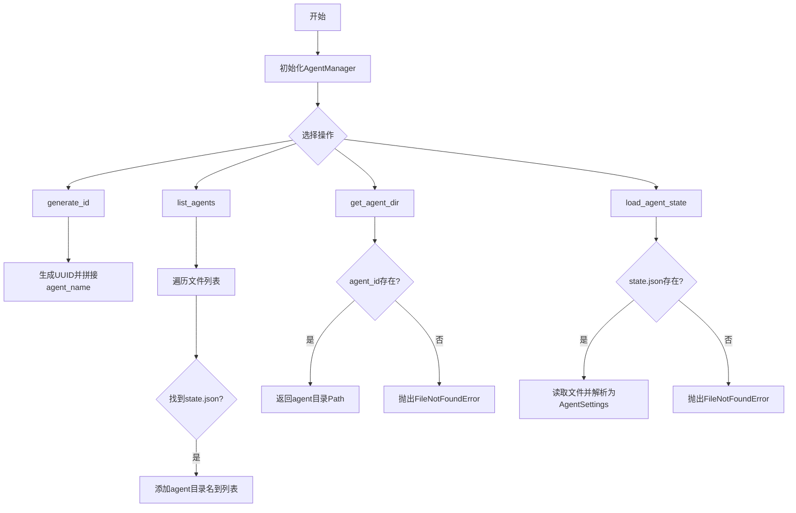
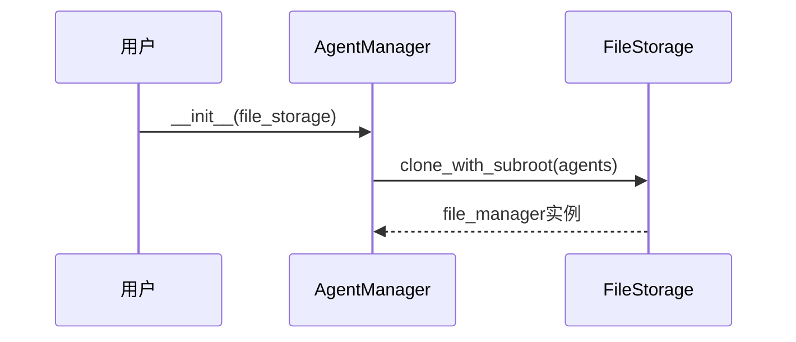
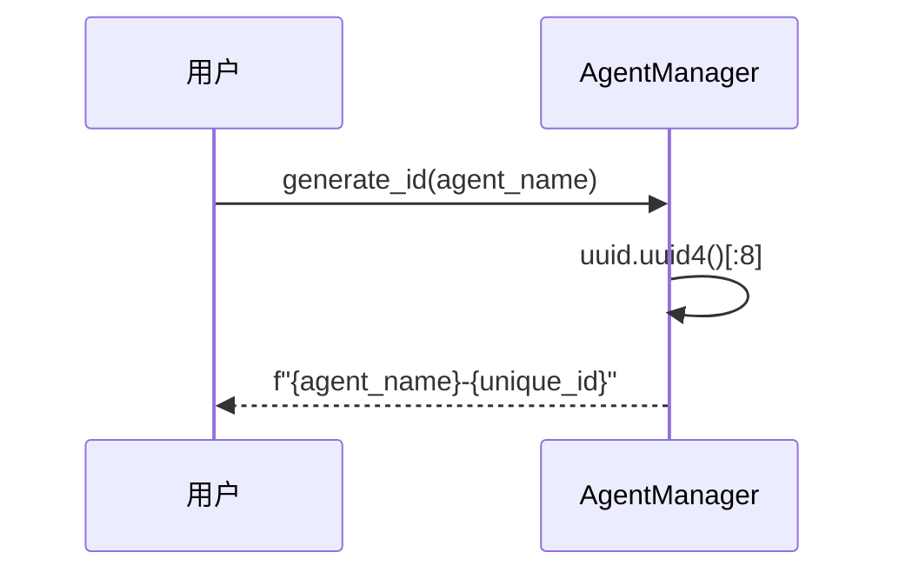
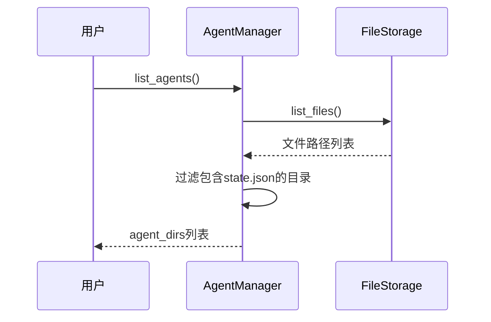

# `.\AutoGPT\classic\original_autogpt\autogpt\agents\agent_manager.py` 详细设计文档

AgentManager类负责管理AutoGPT代理的生命周期，包括生成唯一ID、列出代理目录、获取代理存储路径以及加载代理状态配置等功能，底层依赖FileStorage进行持久化存储。

## 整体流程



## 类结构

```
AgentManager (代理管理器)
```

## 全局变量及字段


### `uuid`
    
Python内置uuid模块，用于生成唯一标识符

类型：`module`
    


### `Path`
    
pathlib.Path类，用于处理文件系统路径操作

类型：`class`
    


### `FileStorage`
    
文件存储抽象基类，定义文件持久化操作的接口契约（从forge.file_storage.base导入）

类型：`class`
    


### `AgentSettings`
    
代理配置数据模型类，用于序列化和反序列化代理状态（从autogpt.agents.agent导入）

类型：`class`
    


### `AgentManager.file_manager`
    
文件存储管理器实例，用于代理数据的持久化操作

类型：`FileStorage`
    
    

## 全局函数及方法


### `AgentManager.__init__`

初始化 AgentManager 实例，使用提供的文件存储创建一个针对 "agents" 子目录的文件管理器实例。

参数：

- `file_storage`：`FileStorage`，文件存储实例，用于初始化文件管理器

返回值：`None`，初始化方法，无返回值

#### 流程图



#### 带注释源码

```python
def __init__(self, file_storage: FileStorage):
    """
    初始化 AgentManager 实例。
    
    使用提供的文件存储实例创建一个子目录为 'agents' 的文件管理器，
    用于后续的 Agent 状态管理和文件操作。
    
    Args:
        file_storage: 文件存储实例，用于初始化文件管理器
        
    Returns:
        None
    """
    # 调用 file_storage 的 clone_with_subroot 方法创建一个子目录为 "agents" 的文件管理器
    # 该文件管理器将用于管理所有与 Agent 相关的文件操作
    self.file_manager = file_storage.clone_with_subroot("agents")
```


### `AgentManager.generate_id`

生成唯一的代理标识符，格式为"agent_name-前8位UUID"

参数：

- `agent_name`：`str`，代理名称

返回值：`str`，格式为'agent_name-前8位UUID'的唯一标识符

#### 流程图



#### 带注释源码

```python
@staticmethod
def generate_id(agent_name: str) -> str:
    """Generate a unique ID for an agent given agent name.
    
    该方法为给定的代理名称生成一个唯一的标识符。
    标识符由代理名称和UUID的前8位组成，格式为"agent_name-xxxxxxxx"。
    
    Args:
        agent_name: 代理的名称，用于标识代理的ID前缀
        
    Returns:
        str: 格式为"agent_name-前8位UUID"的唯一标识符
    """
    # 生成UUID并取前8位作为唯一标识
    unique_id = str(uuid.uuid4())[:8]
    # 拼接代理名称和唯一标识符
    return f"{agent_name}-{unique_id}"
```


### `AgentManager.list_agents`

返回所有代理目录名列表

参数：

- （无参数）

返回值：`list[str]`，返回所有代理目录名列表

#### 流程图



#### 带注释源码

```python
def list_agents(self) -> list[str]:
    """Return all agent directories within storage."""
    # 初始化空列表，用于存储所有代理目录名
    agent_dirs: list[str] = []
    
    # 遍历文件管理器中的所有文件路径
    for file_path in self.file_manager.list_files():
        # 过滤条件：
        # 1. 文件路径层级长度为2（根目录/代理目录）
        # 2. 文件名为 state.json（代理状态文件标识）
        if len(file_path.parts) == 2 and file_path.name == "state.json":
            # 将满足条件的父目录名称（代理目录名）添加到列表
            agent_dirs.append(file_path.parent.name)
    
    # 返回所有代理目录名列表
    return agent_dirs
```


### `AgentManager.get_agent_dir`

返回与给定 ID 关联的代理目录路径，如果目录不存在则抛出异常。

参数：

- `agent_id`：`str`，代理唯一标识符

返回值：`Path`，代理数据存储目录的路径对象

#### 流程图

```mermaid
sequenceDiagram
    participant U as 用户
    participant AM as AgentManager
    participant FM as FileStorage
    U->>AM: get_agent_dir(agent_id)
    AM->>FM: exists(agent_id)
    FM-->>AM: 布尔值
    alt agent_id存在
        AM-->>AM: file_manager.root / agent_id
        AM-->>U: Path对象
    else agent_id不存在
        AM-->>U: FileNotFoundError
```

#### 带注释源码

```python
def get_agent_dir(self, agent_id: str) -> Path:
    """Return the directory of the agent with the given ID."""
    # 验证 agent_id 不为空字符串
    assert len(agent_id) > 0
    agent_dir: Path | None = None
    # 检查存储中是否存在该代理目录
    if self.file_manager.exists(agent_id):
        # 拼接根目录与代理 ID 生成完整路径
        agent_dir = self.file_manager.root / agent_id
    else:
        # 代理目录不存在时抛出异常
        raise FileNotFoundError(f"No agent with ID '{agent_id}'")
    return agent_dir
```


### `AgentManager.load_agent_state`

加载指定ID代理的状态配置。它首先构造状态文件路径，检查文件是否存在，如果不存在则抛出`FileNotFoundError`，否则读取文件内容并将其解析为`AgentSettings`对象。

参数：

- `agent_id`：`str`，代理唯一标识符

返回值：`AgentSettings`，解析后的代理配置对象

#### 流程图

```mermaid
sequenceDiagram
    participant U as 用户
    participant AM as AgentManager
    participant FM as FileStorage
    U->>AM: load_agent_state(agent_id)
    AM->>AM: Path(agent_id) / state.json
    AM->>FM: exists(state_file_path)
    FM-->>AM: 布尔值
    alt state.json存在
        AM->>FM: read_file(state_file_path)
        FM-->>AM: JSON字符串
        AM->>AM: AgentSettings.parse_raw(state)
        AM-->>U: AgentSettings对象
    else state.json不存在
        AM-->>U: FileNotFoundError
```

#### 带注释源码

```python
def load_agent_state(self, agent_id: str) -> AgentSettings:
    """Load the state of the agent with the given ID."""
    # 构造状态文件路径: {agent_id}/state.json
    state_file_path = Path(agent_id) / "state.json"
    
    # 检查状态文件是否存在
    if not self.file_manager.exists(state_file_path):
        # 如果文件不存在，抛出 FileNotFoundError 异常
        raise FileNotFoundError(f"Agent with ID '{agent_id}' has no state.json")

    # 读取状态文件内容 (JSON 字符串)
    state = self.file_manager.read_file(state_file_path)
    
    # 解析 JSON 字符串为 AgentSettings 对象并返回
    return AgentSettings.parse_raw(state)
```

## 关键组件


### AgentManager 类

负责管理Agent生命周期的主类，提供代理的ID生成、列表查询、目录获取和状态加载等功能。

### generate_id 静态方法

根据agent_name生成唯一的8位UUID前缀组成的代理ID，格式为"agent_name-xxxxxxxx"。

### list_agents 方法

遍历文件存储，查找所有包含state.json文件的目录，返回代理ID列表。

### get_agent_dir 方法

根据agent_id返回对应的代理目录路径，若不存在则抛出FileNotFoundError异常。

### load_agent_state 方法

从代理目录中读取state.json文件，解析为AgentSettings对象返回，若文件不存在则抛出异常。

### file_manager 实例变量

类型为FileStorage，用于代理文件的存储和读取操作，通过clone_with_subroot创建agents子目录。


## 问题及建议


### 已知问题

-   **路径构造错误**：`load_agent_state` 方法中使用 `Path(agent_id) / "state.json"` 构造路径，但应该使用 `self.file_manager.root / agent_id / "state.json"`，这会导致在非预期目录查找文件
-   **不当的断言使用**：`get_agent_dir` 方法中使用 `assert` 进行参数验证，在 Python 中当使用 `-O` 优化标志时会被跳过，应使用 `ValueError` 异常
-   **缺少上下文管理器支持**：类未实现 `__enter__` 和 `__exit__` 方法，无法作为上下文管理器使用，资源管理不完整
-   **类型注解不一致**：`list_agents` 方法返回类型注解为 `list[str]` 但实际可能返回空列表，应明确返回 `list[str]`
-   **文件遍历逻辑脆弱**：`list_agents` 方法假设目录结构深度为 2，且通过检查 `state.json` 文件来判断是否为 agent 目录，耦合度高
-   **异常信息不完整**：多处异常信息可以包含更多上下文信息，便于调试

### 优化建议

-   **修复路径逻辑**：将 `load_agent_state` 中的 `Path(agent_id) / "state.json"` 改为 `self.file_manager.root / agent_id / "state.json"`
-   **改用显式异常**：将 `assert len(agent_id) > 0` 改为 `if not agent_id: raise ValueError("agent_id cannot be empty")`
-   **添加上下文管理器**：实现 `__enter__` 和 `__exit__` 方法以支持 `with` 语句
-   **统一类型注解风格**：为所有方法添加完整的类型注解，包括返回值类型
-   **提取目录判断逻辑**：将 agent 目录判断逻辑提取为独立方法或配置常量，提高可维护性
-   **添加日志记录**：在关键操作点添加日志记录，便于监控和调试
-   **考虑添加缓存**：对于频繁访问的 agent 状态，可以考虑添加缓存机制减少文件 I/O
-   **添加单元测试友好设计**：将文件存储操作抽象为接口，便于单元测试mock


## 其它


### 设计目标与约束

该模块的设计目标是为AutoGPT系统提供代理（Agent）的持久化管理能力，支持代理的创建、查询和状态恢复。核心约束包括：1）依赖FileStorage抽象接口，确保存储层的可替换性；2）代理ID采用UUID前缀+名称的组合方式，平衡可读性与唯一性；3）代理数据以目录形式存储，每个代理对应一个以agent_id命名的子目录。

### 错误处理与异常设计

代码中涉及两类异常场景：1）FileNotFoundError用于表示代理不存在或状态文件缺失；2）断言用于校验agent_id非空。改进建议：1）可自定义AgentNotFoundException以区分不同错误类型；2）list_agents方法在遍历时缺少异常捕获，若list_files()抛出异常可能导致信息泄露；3）get_agent_dir使用断言而非显式参数校验，不符合防御性编程原则。

### 数据流与状态机

数据流主要包含两个方向：写入方向通过外部调用创建代理目录和state.json文件；读取方向通过load_agent_state从文件系统加载JSON并反序列化为AgentSettings对象。状态转换遵循：不存在→已创建→已加载的简单状态机，但当前代码未提供显式的状态管理机制，代理的生命周期状态由外部调用方维护。

### 外部依赖与接口契约

核心依赖包括：1）FileStorage抽象类（来自forge.file_storage.base），需实现clone_with_subroot、list_files、exists、read_file等方法；2）AgentSettings类（来自autogpt.agents.agent），提供parse_raw类方法用于反序列化；3）Python标准库pathlib.Path和uuid。接口契约：list_files返回迭代器或列表，元素为Path对象；read_file返回字符串或字节流；AgentSettings.parse_raw接受JSON字符串并返回AgentSettings实例。

### 安全性与边界条件

当前实现存在以下安全考量：1）agent_id未做路径遍历校验，恶意输入可能导致目录穿越；2）list_agents通过检查state.json存在性判断代理有效性，但未校验文件格式合法性；3）文件读取未设置字符集编码假设，可能导致跨平台兼容性问题。建议增加agent_id的字符白名单校验和路径规范化处理。

### 并发与性能考虑

该类非线程安全，多线程环境下需外部加锁。当前实现中list_agents和get_agent_dir均为O(n)复杂度（遍历文件列表），在代理数量较多时性能可能受限。可考虑增加缓存机制或索引文件以优化查询性能。

    