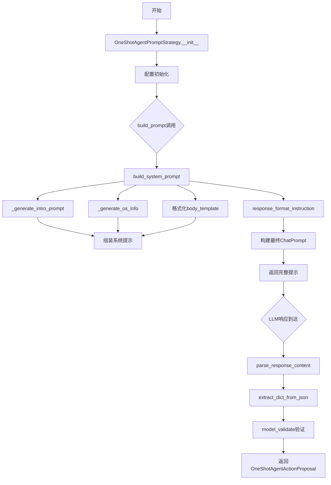
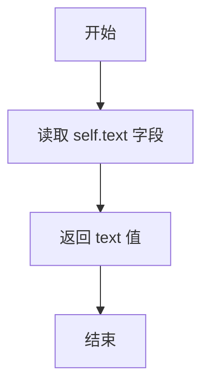
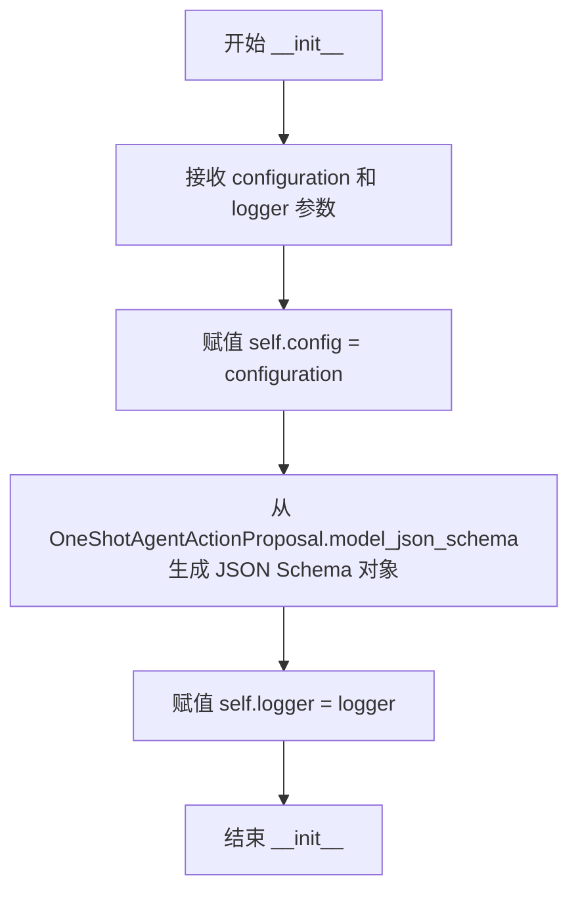
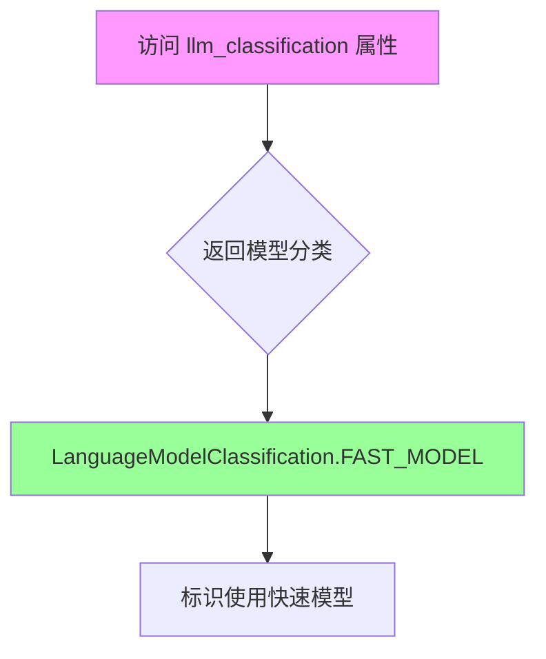
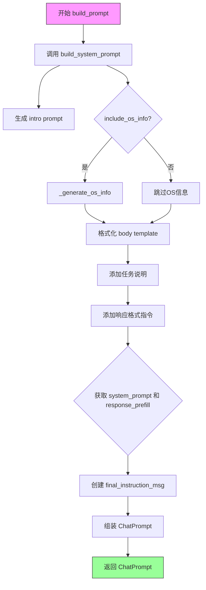
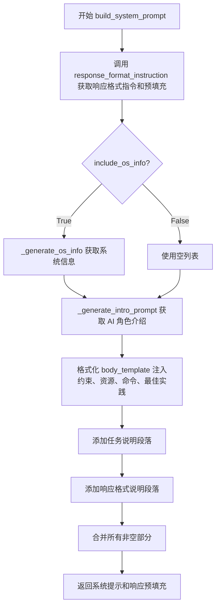
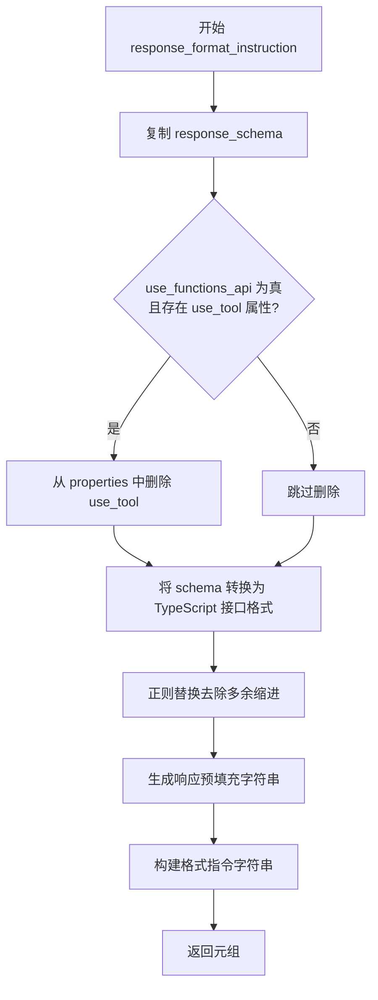
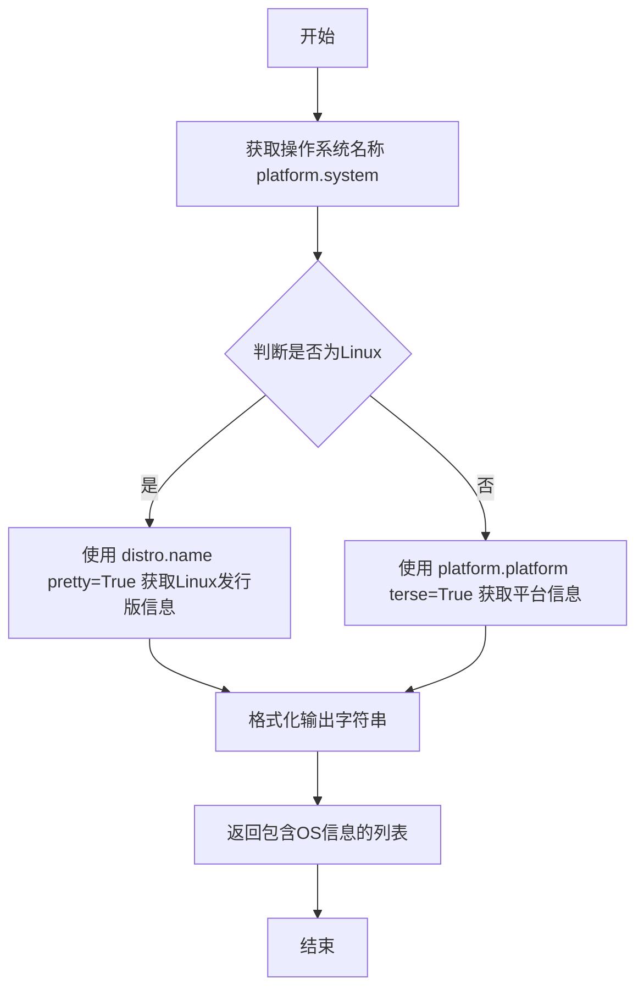
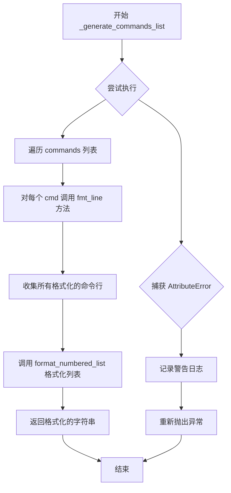

# `.\AutoGPT\classic\original_autogpt\autogpt\agents\prompt_strategies\one_shot.py` 详细设计文档

这是一个一次性代理(One-Shot Agent)的提示策略实现，用于构建LLM提示、处理任务分配、生成系统提示、命令列表和响应格式，并解析LLM的响应内容。该模块实现了PromptStrategy接口，支持配置化提示模板、OS信息嵌入、函数API调用和响应验证。

## 整体流程



## 类结构

```
ModelWithSummary (抽象基类)
├── AssistantThoughts
└── ActionProposal (抽象基类)
    └── OneShotAgentActionProposal
PromptStrategy (抽象基类)
└── OneShotAgentPromptStrategy
SystemConfiguration (抽象基类)
└── OneShotAgentPromptConfiguration
```

## 全局变量及字段


### `_RESPONSE_INTERFACE_NAME`
    
响应接口名称常量

类型：`str`
    


### `AssistantThoughts.observations`
    
来自上次行动的观察

类型：`str`
    


### `AssistantThoughts.text`
    
思考内容

类型：`str`
    


### `AssistantThoughts.reasoning`
    
思考背后的推理

类型：`str`
    


### `AssistantThoughts.self_criticism`
    
建设性自我批评

类型：`str`
    


### `AssistantThoughts.plan`
    
传达长期计划的短列表

类型：`list[str]`
    


### `AssistantThoughts.speak`
    
要对用户说的话的总结

类型：`str`
    


### `OneShotAgentActionProposal.thoughts`
    
代理的思考过程

类型：`AssistantThoughts`
    


### `OneShotAgentPromptConfiguration.DEFAULT_BODY_TEMPLATE`
    
默认提示主体模板

类型：`str`
    


### `OneShotAgentPromptConfiguration.DEFAULT_CHOOSE_ACTION_INSTRUCTION`
    
默认选择动作指令

类型：`str`
    


### `OneShotAgentPromptConfiguration.body_template`
    
用户可配置的提示主体模板

类型：`str`
    


### `OneShotAgentPromptConfiguration.choose_action_instruction`
    
用户可配置的选择动作指令

类型：`str`
    


### `OneShotAgentPromptConfiguration.use_functions_api`
    
是否使用函数API

类型：`bool`
    


### `OneShotAgentPromptStrategy.config`
    
配置对象

类型：`OneShotAgentPromptConfiguration`
    


### `OneShotAgentPromptStrategy.response_schema`
    
响应JSON模式

类型：`JSONSchema`
    


### `OneShotAgentPromptStrategy.logger`
    
日志记录器

类型：`Logger`
    
    

## 全局函数及方法


### `AssistantThoughts.summary`

该方法是 `AssistantThoughts` 类的成员方法，用于将智能体的思考过程以文本形式进行摘要返回，简化对复杂思考结构的引用。

参数：  
无（仅包含隐式参数 `self`）

返回值：`str`，返回 `text` 字段的内容作为摘要

#### 流程图



#### 带注释源码

```python
def summary(self) -> str:
    """
    生成并返回当前 AssistantThoughts 实例的摘要。
    
    该方法实现了 ModelWithSummary 接口约定的摘要生成逻辑，
    通过直接返回内部存储的 text 字段来提供对思考内容的简化访问。
    
    Returns:
        str: 当前智能体思考过程的文本描述
    """
    return self.text
```


### `OneShotAgentPromptStrategy.__init__`

该方法是 `OneShotAgentPromptStrategy` 类的构造函数，用于初始化单次代理提示策略。它接收策略配置和日志记录器，将配置存储在实例属性中，并根据 `OneShotAgentActionProposal` 模型动态生成 JSON Schema 用于后续验证 LLM 响应格式。

参数：

- `configuration`：`OneShotAgentPromptConfiguration` - 策略配置对象，包含提示模板、指令和功能开关等配置项
- `logger`：`Logger` - Python 标准日志记录器，用于输出初始化和运行过程中的日志信息

返回值：`None`（构造函数无显式返回值）

#### 流程图



#### 带注释源码

```python
def __init__(
    self,
    configuration: OneShotAgentPromptConfiguration,
    logger: Logger,
):
    """初始化 OneShotAgentPromptStrategy 实例。
    
    Args:
        configuration: 策略配置对象，包含提示模板和用户可配置项
        logger: 日志记录器实例
    """
    # 将传入的配置对象存储为实例属性，供后续方法使用
    self.config = configuration
    
    # 从 OneShotAgentActionProposal 的 Pydantic 模型定义生成 JSON Schema
    # 该 Schema 用于构建系统提示中的响应格式说明，并验证 LLM 返回的内容
    # OneShotAgentActionProposal 包含 thoughts 字段（类型为 AssistantThoughts）
    self.response_schema = JSONSchema.from_dict(
        OneShotAgentActionProposal.model_json_schema()
    )
    
    # 存储日志记录器，用于在提示构建和响应解析过程中输出调试信息
    self.logger = logger
```


### `OneShotAgentPromptStrategy.llm_classification`

这是一个属性（property），用于返回该提示策略对应的语言模型分类标识。在当前实现中，它返回 `LanguageModelClassification.FAST_MODEL`，表示使用快速模型分类。该属性支持未来根据上下文动态切换模型类型（FIXME 标记）。

参数：

- （无参数，这是属性访问器）

返回值：`LanguageModelClassification`，返回该提示策略对应的语言模型分类，当前固定为 `FAST_MODEL`（快速模型），未来可能支持动态切换。

#### 流程图



#### 带注释源码

```python
@property
def llm_classification(self) -> LanguageModelClassification:
    """
    返回该提示策略对应的语言模型分类。
    
    当前实现固定返回 FAST_MODEL 类型，用于标识使用快速/轻量级模型。
    
    Returns:
        LanguageModelClassification: 语言模型分类枚举值，当前为 FAST_MODEL
        
    Note:
        FIXME: 未来应实现动态切换逻辑，根据任务复杂度、响应时间要求
        或系统负载等因素在 FAST_MODEL 和其他模型类型之间切换。
    """
    return LanguageModelClassification.FAST_MODEL  # FIXME: dynamic switching
```


### `OneShotAgentPromptStrategy.build_prompt`

该方法构建一个完整的聊天提示（ChatPrompt），用于单次代理交互。它整合了系统提示（包括AI角色、操作系统信息、约束条件、资源、命令和最佳实践）、用户任务描述、消息历史以及行动指令，并返回包含所有这些组件的ChatPrompt对象，同时支持函数调用API的可选配置。

参数：

- `messages`：`list[ChatMessage]`，之前对话的消息历史列表
- `task`：`str`，用户要求代理执行的具体任务描述
- `ai_profile`：`AIProfile`，包含AI名称和角色等配置信息
- `ai_directives`：`AIDirectives`，包含约束条件、资源和最佳实践等指令
- `commands`：`list[CompletionModelFunction]`，
- `include_os_info`：`bool`，是否在提示中包含操作系统信息
- `**extras`：可变关键字参数，用于传递额外的配置选项

返回值：`ChatPrompt`，包含完整提示内容、消息列表和预填充响应的对象

#### 流程图



#### 带注释源码

```python
def build_prompt(
    self,
    *,
    messages: list[ChatMessage],
    task: str,
    ai_profile: AIProfile,
    ai_directives: AIDirectives,
    commands: list[CompletionModelFunction],
    include_os_info: bool,
    **extras,
) -> ChatPrompt:
    """Constructs and returns a prompt with the following structure:
    1. System prompt
    3. `cycle_instruction`
    """
    # 首先构建系统提示，包含AI角色信息、OS信息、约束、资源、命令、最佳实践等
    system_prompt, response_prefill = self.build_system_prompt(
        ai_profile=ai_profile,
        ai_directives=ai_directives,
        commands=commands,
        include_os_info=include_os_info,
    )

    # 创建最终行动指令消息，指导模型选择并执行一个命令
    final_instruction_msg = ChatMessage.user(self.config.choose_action_instruction)

    # 组装完整的ChatPrompt，包含：
    # 1. 系统消息（包含所有指令和格式要求）
    # 2. 用户任务（用三引号包裹）
    # 3. 历史消息
    # 4. 最终行动指令
    # 5. 响应预填充（引导LLM按指定格式开始回复）
    return ChatPrompt(
        messages=[
            ChatMessage.system(system_prompt),
            ChatMessage.user(f'"""{task}"""'),  # 三引号包裹任务，确保明确边界
            *messages,  # 展开历史消息
            final_instruction_msg,
        ],
        prefill_response=response_prefill,  # 预填充引导LLM输出JSON格式
        functions=commands if self.config.use_functions_api else [],  # 条件性包含函数定义
    )
```


### `OneShotAgentPromptStrategy.build_system_prompt`

构建系统提示（system prompt），整合 AI 角色信息、操作系统信息、约束条件、资源、可用命令、最佳实践、任务说明以及响应格式指令，最终返回一个包含系统提示正文和响应预填充内容的元组。

参数：

- `ai_profile`：`AIProfile`，AI 角色配置文件，包含 AI 名称和角色描述
- `ai_directives`：`AIDirectives`，AI 指令配置，包含约束条件、资源和最佳实践
- `commands`：`list[CompletionModelFunction]`，`CompletionModelFunction` 对象列表，提供给代理的可执行命令
- `include_os_info`：`bool`，是否包含操作系统信息

返回值：`tuple[str, str]`，第一个字符串是完整的系统提示正文，第二个字符串是用于引导 LLM 输出的响应预填充内容

#### 流程图



#### 带注释源码

```python
def build_system_prompt(
    self,
    ai_profile: AIProfile,
    ai_directives: AIDirectives,
    commands: list[CompletionModelFunction],
    include_os_info: bool,
) -> tuple[str, str]:
    """
    Builds the system prompt.

    Returns:
        str: The system prompt body
        str: The desired start for the LLM's response; used to steer the output
    """
    # Step 1: 获取响应格式指令和预填充内容
    # 根据 use_functions_api 配置决定是否使用函数 API 模式
    response_fmt_instruction, response_prefill = self.response_format_instruction(
        self.config.use_functions_api
    )
    
    # Step 2: 构建提示的各个部分
    system_prompt_parts = (
        # 2.1 AI 角色介绍部分
        self._generate_intro_prompt(ai_profile)
        # 2.2 操作系统信息（可选）
        + (self._generate_os_info() if include_os_info else [])
        # 2.3 主体模板：约束、资源、命令、最佳实践
        + [
            self.config.body_template.format(
                constraints=format_numbered_list(ai_directives.constraints),
                resources=format_numbered_list(ai_directives.resources),
                commands=self._generate_commands_list(commands),
                best_practices=format_numbered_list(ai_directives.best_practices),
            )
        ]
        # 2.4 任务说明段落
        + [
            "## Your Task\n"
            "The user will specify a task for you to execute, in triple quotes,"
            " in the next message. Your job is to complete the task while following"
            " your directives as given above, and terminate when your task is done."
        ]
        # 2.5 响应格式说明
        + ["## RESPONSE_FORMAT\n" + response_fmt_instruction]
    )

    # Step 3: 将所有非空部分用双换行符连接成最终提示
    # filter(None, ...) 过滤掉空字符串和 None 值
    # strip("\n") 去除首尾换行符
    return (
        "\n\n".join(filter(None, system_prompt_parts)).strip("\n"),
        response_prefill,
    )
```


### `OneShotAgentPromptStrategy.response_format_instruction`

该方法根据是否使用函数 API 生成相应的响应格式指令和预填充响应内容。当启用函数 API 时，会从响应 schema 中移除 "use_tool" 属性，并额外添加调用工具的强制要求。

**参数：**

- `use_functions_api`：`bool`，指示是否使用函数 API 模式

**返回值：** `tuple[str, str]`，返回包含响应格式指令字符串和响应预填充内容的元组

#### 流程图



#### 带注释源码

```python
def response_format_instruction(self, use_functions_api: bool) -> tuple[str, str]:
    """
    生成响应格式指令和预填充内容。
    
    根据 use_functions_api 参数决定是否包含工具调用指令，
    并从响应 schema 中相应地添加或移除 use_tool 属性。
    
    参数:
        use_functions_api: bool - 是否使用函数 API 模式
            True: 需要调用工具，会从 schema 中移除 use_tool
            False: 不需要调用工具
    
    返回:
        tuple[str, str]:
            - 第一个元素: 响应格式指令字符串，包含 JSON 类型说明和可选的工具调用要求
            - 第二个元素: 响应预填充字符串，用于引导 LLM 响应格式
    """
    # 深拷贝 response_schema，避免修改原始 schema
    response_schema = self.response_schema.model_copy(deep=True)
    
    # 断言确保 properties 存在
    assert response_schema.properties
    
    # 如果使用函数 API，则从响应 schema 中删除 use_tool 属性
    # 因为函数调用会在 tool_calls 字段中传递，不需要在 JSON body 中
    if use_functions_api and "use_tool" in response_schema.properties:
        del response_schema.properties["use_tool"]

    # 使用正则表达式去除多余缩进，减小 prompt 体积提升性能
    # 将 "\n    " (4空格缩进) 替换为 "\n" (无缩进)
    response_format = re.sub(
        r"\n\s+",
        "\n",
        response_schema.to_typescript_object_interface(_RESPONSE_INTERFACE_NAME),
    )
    
    # 生成响应预填充字符串，引导 LLM 输出正确的 JSON 格式
    # 格式: "{\n    \"{first_property_name}\":"
    response_prefill = f'{{\n    "{list(response_schema.properties.keys())[0]}":'

    # 构建并返回格式指令和预填充内容的元组
    return (
        (
            # 强制要求 LLM 始终响应指定类型的 JSON 对象
            f"YOU MUST ALWAYS RESPOND WITH A JSON OBJECT OF THE FOLLOWING TYPE:\n"
            f"{response_format}"
            # 如果使用函数 API，额外要求必须调用工具
            + ("\n\nYOU MUST ALSO INVOKE A TOOL!" if use_functions_api else "")
        ),
        response_prefill,
    )
```


### `OneShotAgentPromptStrategy._generate_intro_prompt`

生成代理自我介绍的提示引言部分，包含 AI 名称、角色描述以及独立决策的行为准则。

参数：

- `ai_profile`：`AIProfile`，AI 配置文件，包含 AI 的名称（ai_name）和角色（ai_role）等属性

返回值：`list[str]`，返回一个字符串列表，包含两条提示文本：第一条说明 AI 的身份（名称和角色），第二条阐述 AI 应独立决策、发挥 LLM 优势、追求简单策略的行为准则。

#### 流程图

```mermaid
flowchart TD
    A[开始] --> B[接收 ai_profile 参数]
    B --> C[提取 ai_profile.ai_name]
    B --> D[提取 ai_profile.ai_role 并去除尾部句号]
    E[组合第一条提示: You are {ai_name}, {role}.]
    F[组合第二条提示: 独立决策行为准则]
    E --> G[返回字符串列表]
    F --> G
```

#### 带注释源码

```python
def _generate_intro_prompt(self, ai_profile: AIProfile) -> list[str]:
    """Generates the introduction part of the prompt.

    Returns:
        list[str]: A list of strings forming the introduction part of the prompt.
    """
    # 返回一个包含两条字符串的列表
    # 第一条：AI 的身份介绍，格式为 "You are {ai_name}, {ai_role}."
    #        使用 rstrip('.') 去除 ai_role 末尾可能存在的句号，避免重复
    # 第二条：AI 的行为准则，说明应独立决策、发挥 LLM 优势、追求简单策略
    return [
        f"You are {ai_profile.ai_name}, {ai_profile.ai_role.rstrip('.')}.",
        "Your decisions must always be made independently without seeking "
        "user assistance. Play to your strengths as an LLM and pursue "
        "simple strategies with no legal complications.",
    ]
```


### `OneShotAgentPromptStrategy._generate_os_info`

生成当前操作系统的信息，并返回包含该信息的字符串列表，用于系统提示中让AI了解其运行的环境。

参数：

- 无（仅使用 `self`）

返回值：`list[str]`，返回包含操作系统信息的字符串列表，格式为 `["The OS you are running on is: {os_info}"]`

#### 流程图



#### 带注释源码

```python
def _generate_os_info(self) -> list[str]:
    """Generates the OS information part of the prompt.

    Params:
        config (Config): The configuration object.

    Returns:
        str: The OS information part of the prompt.
    """
    # 获取当前操作系统的名称（如 'Linux', 'Windows', 'Darwin' 等）
    os_name = platform.system()
    
    # 根据操作系统类型选择合适的信息获取方式
    os_info = (
        # 对于非Linux系统，使用 platform.platform(terse=True) 获取简洁的平台信息
        platform.platform(terse=True)
        if os_name != "Linux"
        # 对于Linux系统，使用 distro.name(pretty=True) 获取更详细的发行版信息
        else distro.name(pretty=True)
    )
    
    # 返回格式化的字符串列表，用于提示模板
    return [f"The OS you are running on is: {os_info}"]
```


### `OneShotAgentPromptStrategy._generate_commands_list`

将可用的命令列表格式化为带编号的文本列表，供系统提示词中使用。该方法遍历命令对象列表，调用每个命令的格式化方法生成描述文本，并将其转换为编号列表格式。

参数：

- `commands`：`list[CompletionModelFunction]` - 命令对象列表，每个对象代表一个可用的工具或命令

返回值：`str` - 格式化的编号命令列表字符串，供提示词模板使用

#### 流程图



#### 带注释源码

```python
def _generate_commands_list(self, commands: list[CompletionModelFunction]) -> str:
    """Lists the commands available to the agent.

    该方法负责将命令对象列表转换为格式化的文本字符串，
    该字符串将嵌入到系统提示词的 ## Commands 部分中。

    Params:
        agent: The agent for which the commands are being listed.

    Returns:
        str: A string containing a numbered list of commands.
    """
    try:
        # 使用列表推导式遍历所有命令对象
        # 调用每个命令的 fmt_line() 方法获取其格式化描述
        # 然后将结果列表传递给 format_numbered_list 转换为带编号的列表字符串
        return format_numbered_list([cmd.fmt_line() for cmd in commands])
    except AttributeError:
        # 捕获属性错误（可能是命令对象没有实现 fmt_line 方法）
        # 记录警告日志，包含失败的命令列表，便于调试
        self.logger.warning(f"Formatting commands failed. {commands}")
        # 重新抛出异常，让调用者知道格式化过程失败
        raise
```


### `OneShotAgentPromptStrategy.parse_response_content`

解析来自 LLM 的响应内容，将其转换为结构化的动作提案对象，并处理可能的工具调用。

参数：

- `response`：`AssistantChatMessage`，来自语言模型的聊天消息，包含内容和其他元数据

返回值：`OneShotAgentActionProposal`，解析并验证后的动作提案，包含思考过程和待执行的动作

#### 流程图

```mermaid
flowchart TD
    A[开始解析响应] --> B{response.content 是否存在?}
    B -->|否| C[抛出 InvalidAgentResponseError]
    B -->|是| D[记录调试日志: LLM 响应内容]
    D --> E[从 response.content 提取 JSON 字典]
    E --> F[记录调试日志: 解析后的 JSON 对象]
    F --> G{use_functions_api 是否为真?}
    G -->|否| H[跳过工具调用处理]
    G -->|是| I{response.tool_calls 是否存在?}
    I -->|否| J[抛出 InvalidAgentResponseError: 未使用工具]
    I -->|是| K[将 tool_calls[0].function 添加到字典]
    H --> L[使用 model_validate 验证字典]
    L --> M[复制原始消息到 raw_message]
    M --> N[返回 OneShotAgentActionProposal]
```

#### 带注释源码

```python
def parse_response_content(
    self,
    response: AssistantChatMessage,
) -> OneShotAgentActionProposal:
    """解析助手响应内容为结构化动作提案
    
    参数:
        response: AssistantChatMessage, 来自 LLM 的响应消息
        
    返回:
        OneShotAgentActionProposal: 验证后的动作提案对象
    """
    # 步骤1: 检查响应内容是否存在，不存在则抛出异常
    if not response.content:
        raise InvalidAgentResponseError("Assistant response has no text content")

    # 步骤2: 调试模式记录原始响应内容
    self.logger.debug(
        "LLM response content:"
        + (
            f"\n{response.content}"
            if "\n" in response.content
            else f" '{response.content}'"
        )
    )
    
    # 步骤3: 从 JSON 字符串中提取字典对象
    assistant_reply_dict = extract_dict_from_json(response.content)
    
    # 步骤4: 记录解析后的字典（调试用）
    self.logger.debug(
        "Parsing object extracted from LLM response:\n"
        f"{json.dumps(assistant_reply_dict, indent=4)}"
    )
    
    # 步骤5: 如果启用函数 API，检查是否调用了工具
    if self.config.use_functions_api:
        if not response.tool_calls:
            raise InvalidAgentResponseError("Assistant did not use a tool")
        # 将第一个工具调用信息添加到字典中
        assistant_reply_dict["use_tool"] = response.tool_calls[0].function

    # 步骤6: 使用 Pydantic 模型验证并转换字典为 ActionProposal 对象
    parsed_response = OneShotAgentActionProposal.model_validate(
        assistant_reply_dict
    )
    
    # 步骤7: 保存原始响应消息以供后续参考
    parsed_response.raw_message = response.copy()
    
    # 步骤8: 返回解析后的动作提案
    return parsed_response
```

## 关键组件


### AssistantThoughts

代理思维数据结构，包含观察、思考、推理、自我批评、计划和对话摘要，用于存储代理的思考过程。

### OneShotAgentActionProposal

动作提案类，继承自ActionProposal，封装了代理的思考结果（thoughts），用于在单次交互中传递完整的动作决策。

### OneShotAgentPromptConfiguration

提示策略配置类，定义了系统提示模板、动作选择指令和函数API开关，支持通过UserConfigurable进行运行时配置。

### OneShotAgentPromptStrategy

核心提示策略类，负责构建LLM提示和解析响应。包含系统提示生成、命令列表格式化、响应格式指令构建和JSON响应解析等功能。


## 问题及建议


### 已知问题

-   **未使用的导入**：`json` 模块被导入但在代码中未使用，应移除以保持代码整洁
-   **硬编码的响应接口名称**：`_RESPONSE_INTERFACE_NAME` 常量被硬编码为 "AssistantResponse"，缺乏灵活性
-   **FIXME 未完成实现**：`llm_classification` 属性返回固定的 `FAST_MODEL`，注释表明需要动态切换但尚未实现
-   **死代码**：已注释的 `progress_summaries` 字段应移除或实现，否则造成代码混乱
-   **脆弱的属性访问**：在 `response_format_instruction` 方法中，`list(response_schema.properties.keys())[0]` 假设属性字典非空，若为空将抛出 `IndexError`
-   **类型注解被忽略**：`thoughts: AssistantThoughts  # type: ignore` 表明存在类型不兼容问题，应修复而非忽略
-   **未使用的参数**：`build_prompt` 方法中的 `extras` 参数接收额外参数但从未使用
-   **日志记录可改进**：虽然 `self.logger` 被使用，但日志级别和消息格式可以更规范化
-   **响应预填充逻辑脆弱**：预填充字符串硬编码了缩进格式，依赖字典键的顺序，可能在不同环境下失效

### 优化建议

-   移除未使用的 `json` 导入，并将 `distro` 库改为 Linux 平台时才进行延迟导入，减少启动开销
-   将 `_RESPONSE_INTERFACE_NAME` 提取为配置项，或通过参数注入提高可测试性
-   实现 `llm_classification` 的动态切换逻辑，或移除 FIXME 注释并添加 TODO 说明实现计划
-   删除注释掉的 `progress_summaries` 代码，或将其功能完整实现
-   在 `response_format_instruction` 中添加属性字典的空值检查，提高健壮性
-   调查并修复 `AssistantThoughts` 的类型问题，移除 `# type: ignore` 注释
-   若 `extras` 参数确实无需使用，应从方法签名中移除；否则考虑实现其用途
-   改进日志记录，使用结构化日志或更明确的日志级别（如 DEBUG vs INFO）
-   重构响应预填充逻辑，使用更可靠的方式获取第一个属性名，避免依赖字典顺序

## 其它


### 设计目标与约束

本模块的设计目标是构建一个一次交互（One-Shot）代理的提示策略系统，能够在单次交互中指导大型语言模型完成特定任务。核心约束包括：1）必须生成符合JSON Schema格式的响应；2）支持函数调用（tools）和纯JSON两种模式；3）提示模板可通过配置自定义；4）系统需兼容不同操作系统平台。

### 错误处理与异常设计

本模块定义了`InvalidAgentResponseError`异常用于处理代理响应错误。主要错误场景包括：1）响应内容为空；2）使用函数API时未调用工具；3）JSON解析失败。错误处理采用防御性编程，在`parse_response_content`方法中进行多层验证，`_generate_commands_list`方法捕获属性异常并记录警告日志。

### 数据流与状态机

数据流从外部传入的`messages`、`task`、`ai_profile`、`ai_directives`、`commands`等参数开始，经过`build_prompt`方法组装成完整的聊天提示，然后发送给LLM。响应返回后通过`parse_response_content`方法解析为`OneShotAgentActionProposal`对象。状态机方面，系统从初始化状态经过提示构建状态、LLM调用状态，最终到达响应解析状态。

### 外部依赖与接口契约

本模块依赖以下外部包：`distro`（Linux发行版信息获取）、`platform`（操作系统信息）、`json`和`re`（数据处理）、`pydantic`（数据验证）、`logging`（日志记录）。内部依赖包括：`forge.config.ai_directives.AIDirectives`、`forge.config.ai_profile.AIProfile`、`forge.llm.prompting`系列模块、`forge.models.action.ActionProposal`、`forge.models.config.SystemConfiguration`、`forge.models.json_schema.JSONSchema`、`forge.utils.exceptions.InvalidAgentResponseError`。核心接口契约：`build_prompt`方法接收指定参数并返回`ChatPrompt`对象；`parse_response_content`方法接收`AssistantChatMessage`并返回`OneShotAgentActionProposal`对象；`build_system_prompt`返回元组(系统提示字符串, 响应预填充字符串)。

### 配置管理

配置通过`OneShotAgentPromptConfiguration`类管理，包含三个可配置项：`body_template`（提示主体模板，默认为DEFAULT_BODY_TEMPLATE）、`choose_action_instruction`（选择动作指令，默认为DEFAULT_CHOOSE_ACTION_INSTRUCTION）、`use_functions_api`（是否使用函数API，默认为False）。所有配置项都使用`UserConfigurable`装饰器，支持运行时配置覆盖。

### 性能考量与优化空间

当前实现存在以下优化点：1）FIXME注释指出LLM分类硬编码为FAST_MODEL，应实现动态切换；2）JSON Schema转换为TypeScript接口时使用正则表达式替换，可能存在性能瓶颈；3）进度摘要字典`progress_summaries`被注释掉，如需恢复需评估内存使用；4）响应格式格式化每次调用都会重新生成，可考虑缓存。

### 安全性考虑

提示构建过程中直接使用外部传入的`ai_profile`、`ai_directives`、`commands`等参数格式化模板，需确保这些参数已进行适当的输入验证和清理，防止提示注入攻击。响应解析时使用`model_validate`进行Pydantic验证，可有效防止恶意响应导致的数据结构异常。

### 测试策略建议

建议为以下场景编写单元测试：1）`build_prompt`方法生成各种输入组合的提示；2）`parse_response_content`方法解析有效和无效响应；3）`response_format_instruction`在两种模式（使用/不使用函数API）下的输出；4）`_generate_commands_list`处理正常和异常命令格式；5）OS信息生成在不同平台上的行为。

### 版本兼容性

代码使用`from __future__ import annotations`确保向后兼容Python 3.7+的注解语法。依赖的Pydantic模型使用了新版本语法（如`model_json_schema()`、`model_validate()`），需确保Pydantic版本>=2.0。

### 部署与环境要求

运行时需要Python 3.7+环境，主要依赖包括：pydantic>=2.0、distro（用于Linux系统信息）。在非Linux系统上会自动回退到`platform.platform(terse=True)`获取OS信息。日志记录使用标准库`logging`模块，需在部署时配置合适的日志级别。


    