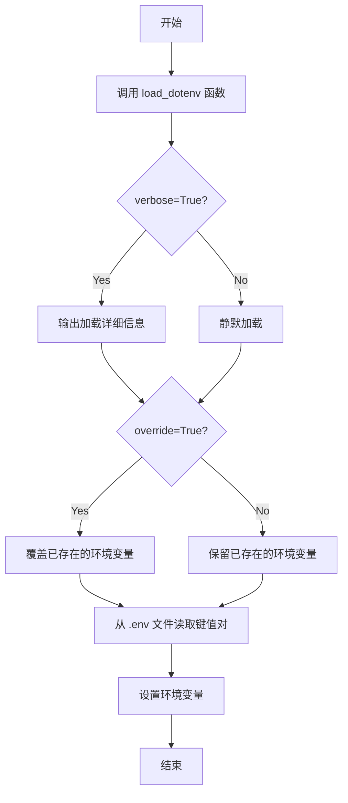

# `.\AutoGPT\classic\original_autogpt\autogpt\app\__init__.py` 详细设计文档

该代码是一个简单的环境变量加载模块，通过 dotenv 库将用户 .env 文件中的配置项加载到系统环境变量中，支持 verbose 模式输出加载详情，并允许 override 模式覆盖已存在的环境变量，加载完成后清理导入的函数以避免命名空间污染。

## 整体流程

```mermaid
graph TD
    A[开始] --> B[导入 dotenv.load_dotenv]
    B --> C[调用 load_dotenv(verbose=True, override=True)]
C --> D[dotenv 库查找并解析 .env 文件]
D --> E{找到 .env 文件?}
E -- 否 --> F[verbose 输出警告信息]
E -- 是 --> G[读取 .env 文件内容]
G --> H[解析键值对]
H --> I{override=True?}
I -- 是 --> J[覆盖已存在的环境变量]
I -- 否 --> K[仅设置不存在的环境变量]
J --> L[设置环境变量]
K --> L
L --> M[verbose 输出加载的环境变量]
M --> N[del 删除 load_dotenv 名称]
N --> O[结束]
```

## 类结构

```
该文件为单脚本模块，无类层次结构
仅包含全局导入、全局函数调用和全局名称删除操作
```

## 全局变量及字段


    

## 全局函数及方法


### `load_dotenv`

该函数是 `dotenv` 库的核心方法，用于将 `.env` 文件中的键值对加载到 Python 的环境变量中，支持配置加载行为的可选控制。

参数：

- `verbose`：`bool`，可选参数，控制是否输出加载过程的详细信息，默认为 `True`
- `override`：`bool`，可选参数，控制是否覆盖已存在的环境变量，默认为 `True`

返回值：`None` 或 `bool`，加载成功时返回 `None` 或 `True`，失败时可能返回 `False` 或抛出异常

#### 流程图



#### 带注释源码

```python
# 从 dotenv 库导入 load_dotenv 函数
from dotenv import load_dotenv

# Load the users .env file into environment variables
# 调用 load_dotenv 函数，加载 .env 文件到环境变量
# verbose=True: 输出详细的加载信息（如文件路径、加载的变量数量等）
# override=True: 如果环境变量已存在，覆盖为 .env 文件中的值
load_dotenv(verbose=True, override=True)

# 删除 load_dotenv 名称，清理命名空间
del load_dotenv
```

## 关键组件


### dotenv 库导入

使用 Python 的 dotenv 库来管理环境变量，该库允许从 .env 文件加载配置到应用程序的环境变量中。

### load_dotenv 函数

这是 dotenv 库的核心函数，用于读取 .env 文件并将其内容加载到 Python 的 os.environ 中。调用时传入了两个参数：verbose=True 表示显示加载详细信息，override=True 表示覆盖已存在的环境变量。

### 环境变量配置机制

通过 .env 文件存储敏感配置（如 API 密钥、数据库连接信息等），实现配置与代码分离，便于在不同环境（开发、生产）中使用不同的配置值。

### 命名空间清理

通过 `del load_dotenv` 删除对 load_dotenv 函数的引用，避免该函数在后续代码中被意外调用，确保环境变量加载过程是一次性的。


## 问题及建议


### 已知问题

-   **环境变量覆盖风险**：`override=True` 会覆盖系统已存在的环境变量，可能导致生产环境配置被意外覆盖，引发难以追踪的运行时问题
-   **缺乏错误处理**：未检查 .env 文件是否存在或格式是否正确，文件缺失时程序会抛出 `FileNotFoundError`
-   **调试能力受限**：删除 `load_dotenv` 后，若后续需要排查环境变量加载问题，无法重新调用或查看加载状态
-   **生产环境冗余输出**：`verbose=True` 会在控制台输出加载信息，生产环境中产生不必要的日志噪音
-   **代码可读性差**：导入后立即删除的写法不符合常规Python实践，增加维护成本
-   **无路径灵活性**：硬编码加载 .env 文件，无法适应不同环境（开发/测试/生产）使用不同配置文件

### 优化建议

-   **移除 override 参数**：改为 `override=False` 或省略（默认False），避免覆盖系统环境变量，或根据环境变量 `ENV` 动态设置
-   **添加文件存在性检查**：使用 `os.path.exists()` 验证 .env 文件存在后再加载，提供友好的错误提示
-   **条件化 verbose**：根据环境决定是否启用 verbose，如 `verbose=os.getenv('DEBUG', 'false').lower() == 'true'`
-   **保留函数引用**：不删除 `load_dotenv`，以便后续需要时重新加载或调试
-   **支持多环境配置**：通过环境变量指定配置文件路径，如 `dotenv_path='.env.production'`
-   **封装配置加载逻辑**：将环境变量加载封装为独立函数或类，统一管理不同环境的配置加载行为
-   **添加日志记录**：使用 Python logging 模块替代 verbose 输出，便于生产环境日志管理


## 其它


### 设计目标与约束
该代码的核心目标是将用户目录下的.env文件中的环境变量加载到Python进程的运行环境中。设计约束包括：必须在项目启动早期执行（通常在应用入口顶部），依赖dotenv第三方库，需要确保.env文件存在于项目根目录或指定路径，且.del load_dotenv操作会从当前模块命名空间中移除load_dotenv函数引用。

### 错误处理与异常设计
代码本身未显式包含try-except异常处理机制。潜在的异常场景包括：FileNotFoundError（.env文件不存在时load_dotenv会抛出此异常）、PermissionError（.env文件无读取权限）、SyntaxError（.env文件格式错误）。建议在实际项目中使用try-except包装，并提供用户友好的错误提示，例如"未找到.env文件，请检查项目根目录"。

### 数据流与状态机
数据流向为：.env文件（磁盘） → load_dotenv函数解析 → 环境变量表（os.environ） → 被后续代码引用。状态机方面，加载前环境变量为初始状态，加载后.env中的变量被注入环境变量表，若override=True则覆盖同名变量，否则保留现有变量值。

### 外部依赖与接口契约
外部依赖为python-dotenv库，需通过pip install dotenv安装。load_dotenv函数签名为load_dotenv(dotenv_path=None, verbose=False, override=False)，其中verbose=True表示打印加载过程信息，override=True表示覆盖已存在的环境变量。函数无返回值。

### 安全考虑
.env文件通常包含敏感信息（如API密钥、数据库密码），必须确保：.env文件加入.gitignore版本控制忽略列表、永远不要提交到代码仓库、生产环境使用环境变量注入而非.env文件、load_dotenv执行后删除的是函数引用而非环境变量本身。

### 配置管理
.env文件采用KEY=VALUE格式，每行一个变量，支持#注释，不支持引号包裹的值（会被当作值的一部分）。文件命名约定为.env，可通过dotenv_path参数指定自定义路径。load_dotenv默认查找当前工作目录的.env文件。

### 命名空间清理
执行del load_dotenv后，当前模块中无法再通过from module import load_dotenv调用该函数。此操作的目的是：避免与其他可能导入的dotenv相关函数冲突、保持模块命名空间整洁、防止后续代码意外调用已加载的配置函数。但需要注意，此操作不影响已加载到os.environ中的环境变量。

### 性能考虑
load_dotenv首次调用时会读取并解析.env文件，后续无缓存机制。对于包含大量变量的.env文件，加载时间可能达到毫秒级。如需频繁访问环境变量，建议在应用启动时一次性加载，后续直接通过os.environ.get()获取。

### 测试策略
测试用例应覆盖：正常加载.env文件、文件不存在时的行为、override参数为False时的合并行为、override参数为True时的覆盖行为、.env文件格式错误时的异常抛出、verbose参数的信息输出。可使用unittest.mock模拟.env文件或环境变量。

### 版本兼容性
该代码兼容Python 3.6+版本（dotenv库要求）。dotenv库版本建议使用0.19.0及以上以确保兼容性和安全性。load_dotenv函数在dotenv 0.9.0版本后支持override参数。

### 日志与监控
verbose=True参数会在控制台输出类似"Loading .env from /path/to/.env"的日志信息，便于调试环境变量加载问题。在生产环境中建议设置verbose=False以避免不必要的日志输出，可结合Python标准日志库配置自定义日志格式和级别。

### 多环境支持
标准做法是创建多个.env文件（如.env.development、.env.production），通过环境变量或命令行参数选择加载对应文件，代码示例：load_dotenv(dotenv_path=f".env.{os.getenv('ENV', 'development')}")。


    