# `.\AutoGPT\classic\original_autogpt\autogpt\app\agent_protocol_server.py` 详细设计文档

这是一个基于FastAPI的AutoGPT服务器实现，核心功能是提供Agent Protocol RESTful API，用于管理AI代理任务的创建、执行、步骤追踪和产物管理，同时集成了LLM提供商和文件存储功能，支持CORS配置和前端静态文件服务。

## 整体流程

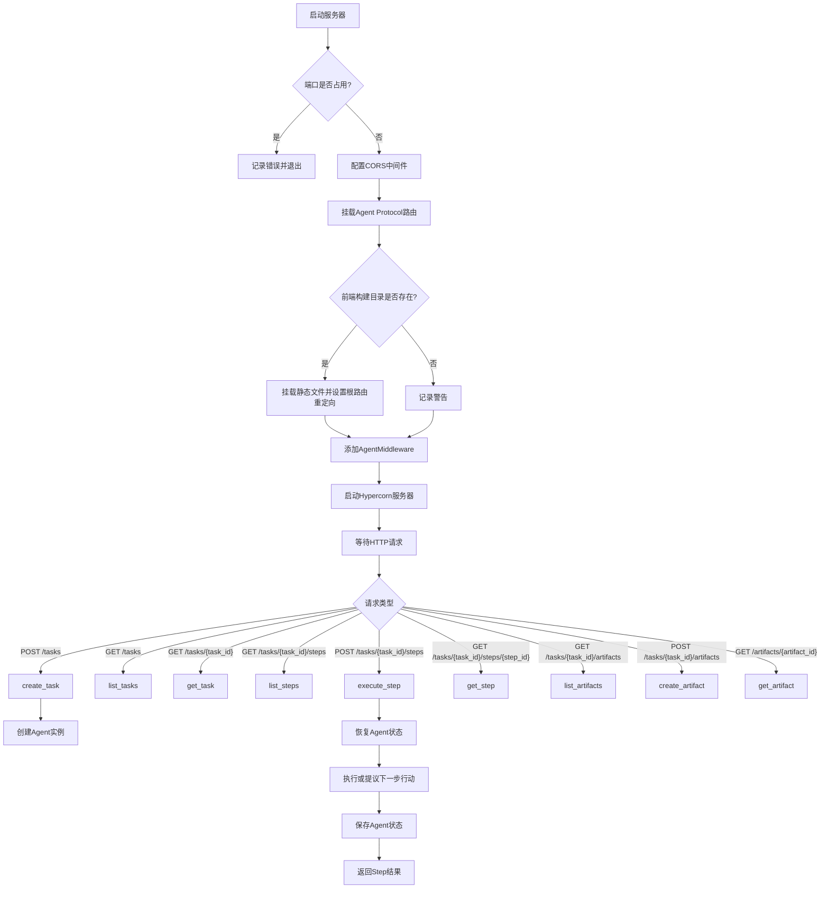

## 类结构

```
AgentProtocolServer (主服务类)
├── 字段: app_config, db, file_storage, llm_provider, agent_manager, _task_budgets
└── 方法: start, create_task, list_tasks, get_task, list_steps, execute_step, get_step, list_artifacts, create_artifact, get_artifact, _get_task_agent_file_workspace, _get_task_llm_provider, _on_agent_write_file
```

## 全局变量及字段


### `logger`
    
模块级日志记录器，用于记录服务器运行日志

类型：`logging.Logger`
    


### `AgentProtocolServer.app_config`
    
应用配置对象，包含应用程序的配置信息

类型：`AppConfig`
    


### `AgentProtocolServer.db`
    
数据库实例，用于持久化任务、步骤和产物数据

类型：`AgentDB`
    


### `AgentProtocolServer.file_storage`
    
文件存储实例，用于管理代理的工作空间文件

类型：`FileStorage`
    


### `AgentProtocolServer.llm_provider`
    
LLM提供商实例，用于与语言模型交互

类型：`MultiProvider`
    


### `AgentProtocolServer.agent_manager`
    
代理管理器实例，用于管理代理状态的加载和保存

类型：`AgentManager`
    


### `AgentProtocolServer._task_budgets`
    
任务预算字典，存储每个任务的LLM调用预算信息

类型：`dict[str, ModelProviderBudget]`
    
    

## 全局函数及方法


### `task_agent_id`

该函数是一个全局工具函数，用于根据传入的任务ID生成对应的代理ID。它接收一个任务标识符（字符串或整数），并返回一个格式为 `'AutoGPT-{task_id}'` 的字符串，作为唯一标识符用于 Agent 的创建和管理。

参数：

- `task_id`：`str | int`，任务的唯一标识符。

返回值：`str`，格式化的代理ID字符串（例如 "AutoGPT-123"）。

#### 流程图

```mermaid
graph LR
    A[开始: task_id] --> B{构建字符串}
    B --> C[返回: f"AutoGPT-{task_id}"]
```

#### 带注释源码

```python
def task_agent_id(task_id: str | int) -> str:
    """
    根据任务ID生成代理ID。
    
    参数:
        task_id: 任务的唯一标识符，可以是字符串或整数类型。
        
    返回值:
        字符串，格式为 'AutoGPT-{task_id}'，用于在系统中唯一标识一个Agent实例。
    """
    return f"AutoGPT-{task_id}"
```


### `AgentProtocolServer.start`

启动 AutoGPT Agent 协议服务器，初始化 FastAPI 应用，配置 CORS 中间件、路由、前端静态文件，并使用 Hypercorn 异步服务器启动 HTTP 服务监听指定端口。

参数：

- `port`：`int`，服务器监听端口，默认为 8000
- `router`：`APIRouter`，API 路由实例，默认为 `base_router`

返回值：`None`，无返回值（异步方法启动服务器后阻塞）

#### 流程图

```mermaid
flowchart TD
    A[开始启动服务器] --> B{检查端口是否可用}
    B -->|端口被占用| C[记录错误日志并返回]
    B -->|端口可用| D[创建 HypercornConfig 配置对象]
    D --> E[绑定到 localhost:{port}]
    E --> F[初始化 FastAPI 应用<br/>设置标题、描述、版本]
    F --> G[获取默认 CORS 来源列表<br/>http://localhost:{port}]
    G --> H{检查环境变量<br/>AP_SERVER_CORS_ALLOWED_ORIGINS}
    H -->|已配置| I[使用配置的 CORS 来源]
    H -->|未配置| J[使用默认 CORS 来源]
    I --> K
    J --> K[添加 CORSMiddleware 中间件]
    K --> L[挂载 API 路由<br/>/ap/v1 前缀]
    L --> M[计算前端构建路径]
    M --> N{前端路径是否存在}
    N -->|存在| O[挂载静态文件到 /app 路径]
    O --> P[添加根路径重定向<br/>/app/index.html]
    N -->|不存在| Q[记录警告日志]
    Q --> R[添加 AgentMiddleware 中间件<br/>注入 self 引用]
    R --> S[设置日志级别为 ERROR]
    S --> T[修改绑定地址为 0.0.0.0:{port}]
    T --> U[启动 Hypercorn 服务<br/>异步阻塞运行]
```

#### 带注释源码

```python
async def start(self, port: int = 8000, router: APIRouter = base_router):
    """Start the agent server."""
    # 记录调试日志，表示服务器开始启动
    logger.debug("Starting the agent server...")
    
    # 检查指定端口是否已被占用
    if not is_port_free(port):
        # 端口被占用时记录错误信息
        logger.error(f"Port {port} is already in use.")
        logger.info(
            "You can specify a port by either setting the AP_SERVER_PORT "
            "environment variable or defining AP_SERVER_PORT in the .env file."
        )
        return  # 直接返回，不启动服务器

    # 创建 Hypercorn 服务器配置对象
    config = HypercornConfig()
    # 初始绑定到 localhost（仅本地访问）
    config.bind = [f"localhost:{port}"]
    
    # 初始化 FastAPI 应用，配置元数据
    app = FastAPI(
        title="AutoGPT Server",
        description="Forked from AutoGPT Forge; "
        "Modified version of The Agent Protocol.",
        version="v0.4",
    )

    # Configure CORS middleware
    # 设置默认 CORS 来源，仅允许本地域访问
    default_origins = [f"http://localhost:{port}"]  # Default only local access
    # 从环境变量读取配置的 CORS 来源列表
    configured_origins = [
        origin
        for origin in os.getenv("AP_SERVER_CORS_ALLOWED_ORIGINS", "").split(",")
        if origin  # Empty list if not configured
    ]
    # 优先使用配置的来源，否则使用默认值
    origins = configured_origins or default_origins

    # 添加 CORS 中间件，允许跨域请求
    app.add_middleware(
        CORSMiddleware,
        allow_origins=origins,
        allow_credentials=True,
        allow_methods=["*"],
        allow_headers=["*"],
    )

    # 挂载 API 路由，设置 /ap/v1 前缀
    app.include_router(router, prefix="/ap/v1")
    
    # 计算前端静态文件路径（相对于当前脚本目录）
    script_dir = os.path.dirname(os.path.realpath(__file__))
    frontend_path = (
        pathlib.Path(script_dir)
        .joinpath("../../../classic/frontend/build/web")
        .resolve()
    )

    # 检查前端构建目录是否存在
    if os.path.exists(frontend_path):
        # 挂载前端静态文件到 /app 路径
        app.mount("/app", StaticFiles(directory=frontend_path), name="app")

        # 添加根路径重定向，将用户导向前端 index.html
        @app.get("/", include_in_schema=False)
        async def root():
            return RedirectResponse(url="/app/index.html", status_code=307)

    else:
        # 前端不存在时记录警告日志
        logger.warning(
            f"Frontend not found. {frontend_path} does not exist. "
            "The frontend will not be available."
        )

    # Used to access the methods on this class from API route handlers
    # 添加 AgentMiddleware，使路由处理器可以访问此类的方法
    app.add_middleware(AgentMiddleware, agent=self)

    # 设置日志级别为 ERROR，减少输出噪音
    config.loglevel = "ERROR"
    # 修改绑定地址为 0.0.0.0，允许外部访问
    config.bind = [f"0.0.0.0:{port}"]

    # 记录服务器启动信息
    logger.info(f"AutoGPT server starting on http://localhost:{port}")
    # 使用 Hypercorn 异步启动服务器（阻塞运行）
    await hypercorn_serve(app, config)  # type: ignore
```


### `AgentProtocolServer.create_task`

创建任务方法是 Agent 协议服务器的核心功能之一，用于接收任务请求、创建任务记录、初始化 Agent 实例并保存初始状态。该方法首先从请求中提取用户 ID 用于追踪，然后创建任务记录，生成对应的 Agent 实例，并将 Agent 的初始状态持久化到存储中。

**参数：**

- `task_request`：`TaskRequestBody`，创建任务的请求体，包含任务输入和额外输入参数

**返回值：** `Task`，创建成功的任务对象，包含任务 ID、输入内容、状态等信息

#### 流程图

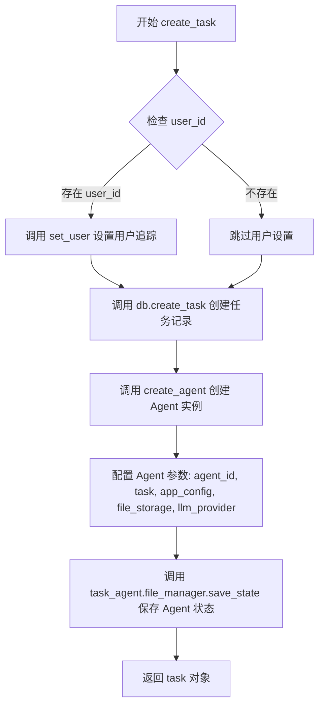

#### 带注释源码

```python
async def create_task(self, task_request: TaskRequestBody) -> Task:
    """
    Create a task for the agent.
    
    该方法负责：
    1. 从请求中提取用户 ID 并设置到 Sentry 进行追踪
    2. 在数据库中创建任务记录
    3. 为该任务创建一个 Agent 实例
    4. 保存 Agent 的初始状态到文件存储
    
    Args:
        task_request: 包含任务输入和额外参数的请求体
        
    Returns:
        Task: 创建成功的任务对象
    """
    # 从请求的 additional_input 中提取用户 ID，用于 Sentry 等工具的用户追踪
    if user_id := (task_request.additional_input or {}).get("user_id"):
        set_user({"id": user_id})

    # 调用数据库接口创建任务记录，保存任务的输入和额外输入信息
    task = await self.db.create_task(
        input=task_request.input,
        additional_input=task_request.additional_input,
    )
    
    # TODO: re-evaluate performance benefit of task-oriented profiles
    # logger.debug(f"Creating agent for task: '{task.input}'")
    # task_agent = await generate_agent_for_task(
    
    # 使用 Agent 工厂创建 Agent 实例，传入以下参数：
    # - agent_id: 由任务 ID 生成，格式为 "AutoGPT-{task_id}"
    # - task: 任务的输入内容
    # - app_config: 应用配置
    # - file_storage: 文件存储接口
    # - llm_provider: 通过 _get_task_llm_provider 为该任务配置的 LLM 提供商
    task_agent = create_agent(
        agent_id=task_agent_id(task.task_id),
        task=task.input,
        app_config=self.app_config,
        file_storage=self.file_storage,
        llm_provider=self._get_task_llm_provider(task),
    )
    
    # 保存 Agent 的初始状态到文件管理器，确保后续可以恢复
    await task_agent.file_manager.save_state()

    # 返回创建的任务对象
    return task
```


### `AgentProtocolServer.list_tasks`

列出所有已创建的任务，支持分页查询。

参数：

- `page`：`int`，页码，默认为1，表示查询的页数
- `pageSize`：`int`，每页大小，默认为10，表示每页返回的任务数量

返回值：`TaskListResponse`，包含任务列表和分页信息的响应对象

#### 流程图

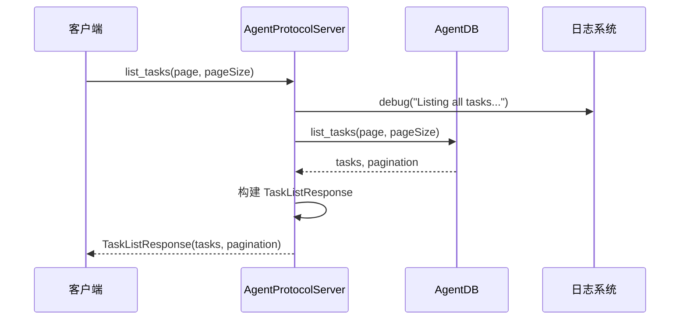

#### 带注释源码

```python
async def list_tasks(self, page: int = 1, pageSize: int = 10) -> TaskListResponse:
    """
    List all tasks that the agent has created.
    """
    # 记录调试日志，表示正在列出所有任务
    logger.debug("Listing all tasks...")
    
    # 调用数据库层的 list_tasks 方法，获取任务列表和分页信息
    tasks, pagination = await self.db.list_tasks(page, pageSize)
    
    # 构建响应对象，包含任务列表和分页信息
    response = TaskListResponse(tasks=tasks, pagination=pagination)
    
    # 返回响应对象
    return response
```


### `AgentProtocolServer.get_task`

根据任务ID从数据库中获取任务信息并返回。

参数：

- `task_id`：`str`，任务的唯一标识符，用于指定要获取的任务

返回值：`Task`，返回找到的任务对象，如果任务不存在则抛出异常

#### 流程图

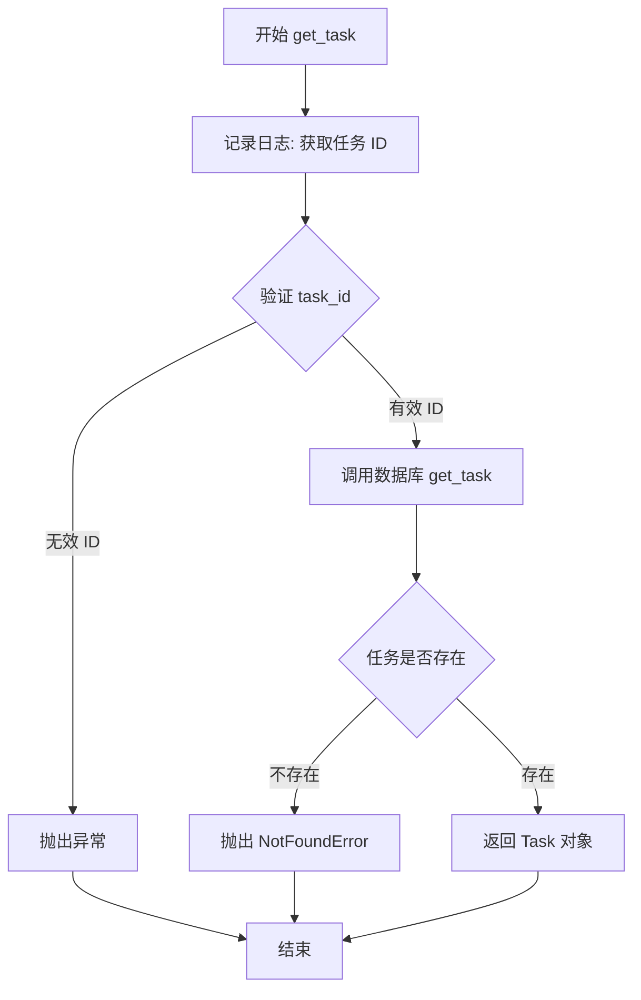

#### 带注释源码

```python
async def get_task(self, task_id: str) -> Task:
    """
    Get a task by ID.
    通过任务ID从数据库中检索任务对象
    """
    # 记录调试日志，包含要获取的任务ID
    logger.debug(f"Getting task with ID: {task_id}...")
    
    # 调用数据库层的 get_task 方法异步获取任务
    # 数据库层会根据 task_id 查询并返回对应的 Task 对象
    task = await self.db.get_task(task_id)
    
    # 返回找到的 Task 对象
    # 如果任务不存在，数据库层会抛出 NotFoundError 异常
    return task
```


### `AgentProtocolServer.list_steps`

列出指定任务创建的所有步骤，返回步骤列表和分页信息。

参数：

- `task_id`：`str`，任务ID，用于指定要列出步骤的任务
- `page`：`int = 1`，分页参数，表示当前页码，默认为第一页
- `pageSize`：`int = 10`，分页参数，表示每页返回的步骤数量，默认为10

返回值：`TaskStepsListResponse`，包含步骤列表和分页信息的响应对象

#### 流程图

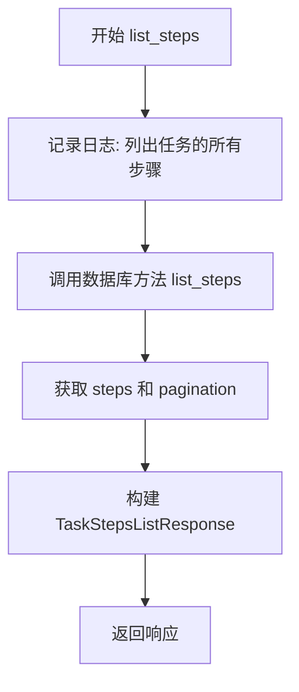

#### 带注释源码

```python
async def list_steps(
    self, task_id: str, page: int = 1, pageSize: int = 10
) -> TaskStepsListResponse:
    """
    List the IDs of all steps that the task has created.
    """
    # 记录调试日志，输出任务ID信息
    logger.debug(f"Listing all steps created by task with ID: {task_id}...")
    
    # 调用数据库层的list_steps方法，获取该任务下的步骤列表和分页信息
    steps, pagination = await self.db.list_steps(task_id, page, pageSize)
    
    # 构建响应对象，将步骤列表和分页信息封装到TaskStepsListResponse中
    response = TaskStepsListResponse(steps=steps, pagination=pagination)
    
    # 返回响应对象
    return response
```


### `AgentProtocolServer.execute_step`

该方法是AgentProtocolServer的核心方法，负责为指定任务创建并执行一个步骤。它首先恢复Agent实例，然后根据当前状态决定是执行之前提议的动作还是提出新的动作，最后将执行结果更新到数据库并返回。

参数：

- `task_id`：`str`，任务ID，用于标识要执行步骤的具体任务
- `step_request`：`StepRequestBody`，步骤请求体，包含用户的输入和指令

返回值：`Step`，执行后的步骤对象，包含状态、输出和附加信息

#### 流程图

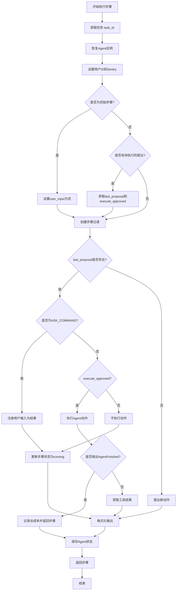

#### 带注释源码

```python
async def execute_step(self, task_id: str, step_request: StepRequestBody) -> Step:
    """Create a step for the task."""
    # 记录调试日志
    logger.debug(f"Creating a step for task with ID: {task_id}...")

    # 1. 通过task_id获取任务信息
    task = await self.get_task(task_id)
    
    # 2. 恢复Agent实例 - 从持久化状态加载Agent
    agent = configure_agent_with_state(
        state=self.agent_manager.load_agent_state(task_agent_id(task_id)),
        app_config=self.app_config,
        file_storage=self.file_storage,
        llm_provider=self._get_task_llm_provider(task),
    )

    # 3. 如果存在user_id，则将其设置到Sentry用于追踪
    if user_id := (task.additional_input or {}).get("user_id"):
        set_user({"id": user_id})

    # 4. 判断是否为初始步骤 - 根据Agent事件历史是否为空
    # 根据Agent Protocol规范，第一个execute_step请求包含与create_task相同的输入
    # 为防止干扰Agent流程，忽略第一个步骤请求的输入
    is_init_step = not bool(agent.event_history)
    last_proposal, tool_result = None, None
    execute_approved = False

    # 5. HACK: 仅用于兼容AGBenchmark
    if step_request.input == "y":
        step_request.input = ""

    # 6. 确定用户输入内容
    user_input = step_request.input if not is_init_step else ""

    # 7. 检查是否存在待执行的提议
    if (
        not is_init_step
        and agent.event_history.current_episode
        and not agent.event_history.current_episode.result
    ):
        # 获取上次提议的动作
        last_proposal = agent.event_history.current_episode.action
        # 如果有用户输入，则视为批准执行
        execute_approved = not user_input

        logger.debug(
            f"Agent proposed command {last_proposal.use_tool}."
            f" User input/feedback: {repr(user_input)}"
        )

    # 8. 在数据库中创建步骤记录
    step = await self.db.create_step(
        task_id=task_id,
        input=step_request,
        is_last=(
            last_proposal is not None
            and last_proposal.use_tool.name == FINISH_COMMAND
            and execute_approved
        ),
    )
    
    # 9. 为该步骤设置独立的LLM提供者
    agent.llm_provider = self._get_task_llm_provider(task, step.step_id)

    # 10. 执行之前提议的动作（如果存在）
    if last_proposal:
        # 设置文件写入回调
        agent.file_manager.workspace.on_write_file = (
            lambda path: self._on_agent_write_file(
                task=task, step=step, relative_path=path
            )
        )

        # 处理ASK_COMMAND - 需要用户输入
        if last_proposal.use_tool.name == ASK_COMMAND:
            tool_result = ActionSuccessResult(outputs=user_input)
            agent.event_history.register_result(tool_result)
        # 执行已批准的动作
        elif execute_approved:
            step = await self.db.update_step(
                task_id=task_id,
                step_id=step.step_id,
                status="running",
            )

            try:
                # 执行之前提议的动作
                tool_result = await agent.execute(last_proposal)
            except AgentFinished:
                # 处理Agent完成的情况
                additional_output = {}
                task_total_cost = agent.llm_provider.get_incurred_cost()
                if task_total_cost > 0:
                    additional_output["task_total_cost"] = task_total_cost
                    logger.info(
                        f"Total LLM cost for task {task_id}: "
                        f"${round(task_total_cost, 2)}"
                    )

                step = await self.db.update_step(
                    task_id=task_id,
                    step_id=step.step_id,
                    output=last_proposal.use_tool.arguments["reason"],
                    additional_output=additional_output,
                )
                await agent.file_manager.save_state()
                return step
        else:
            # 用户提供了反馈但不批准执行
            assert user_input
            tool_result = await agent.do_not_execute(last_proposal, user_input)

    # 11. 提出下一个动作
    try:
        assistant_response = await agent.propose_action()
        next_tool_to_use = assistant_response.use_tool
        logger.debug(f"AI output: {assistant_response.thoughts}")
    except Exception as e:
        # 处理提议动作时的异常
        step = await self.db.update_step(
            task_id=task_id,
            step_id=step.step_id,
            status="completed",
            output=f"An error occurred while proposing the next action: {e}",
        )
        return step

    # 12. 格式化步骤输出
    output = (
        (
            f"`{last_proposal.use_tool}` returned:"
            + ("\n\n" if "\n" in str(tool_result) else " ")
            + f"{tool_result}\n\n"
        )
        if last_proposal and last_proposal.use_tool.name != ASK_COMMAND
        else ""
    )
    output += f"{assistant_response.thoughts.speak}\n\n"
    output += (
        f"Next Command: {next_tool_to_use}"
        if next_tool_to_use.name != ASK_COMMAND
        else next_tool_to_use.arguments["question"]
    )

    # 13. 构建附加输出信息
    additional_output = {
        **(
            {
                "last_action": {
                    "name": last_proposal.use_tool.name,
                    "args": last_proposal.use_tool.arguments,
                    "result": (
                        ""
                        if tool_result is None
                        else (
                            orjson.loads(tool_result.model_dump_json())
                            if not isinstance(tool_result, ActionErrorResult)
                            else {
                                "error": str(tool_result.error),
                                "reason": tool_result.reason,
                            }
                        )
                    ),
                },
            }
            if last_proposal and tool_result
            else {}
        ),
        **assistant_response.model_dump(),
    }

    # 14. 计算累积成本
    task_cumulative_cost = agent.llm_provider.get_incurred_cost()
    if task_cumulative_cost > 0:
        additional_output["task_cumulative_cost"] = task_cumulative_cost
    logger.debug(
        f"Running total LLM cost for task {task_id}: "
        f"${round(task_cumulative_cost, 3)}"
    )

    # 15. 更新步骤为完成状态
    step = await self.db.update_step(
        task_id=task_id,
        step_id=step.step_id,
        status="completed",
        output=output,
        additional_output=additional_output,
    )

    # 16. 保存Agent状态
    await agent.file_manager.save_state()
    return step
```


### `AgentProtocolServer.get_step`

获取指定任务下的特定步骤信息。

参数：

- `task_id`：`str`，任务ID，用于标识所属的任务
- `step_id`：`str`，步骤ID，用于标识要获取的具体步骤

返回值：`Step`，步骤对象，包含步骤的详细信息

#### 流程图

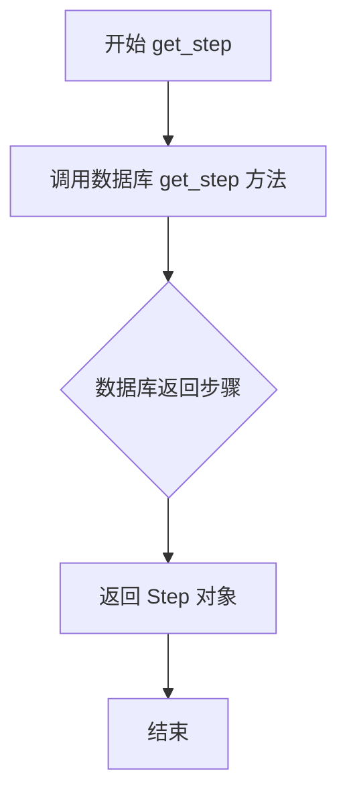

#### 带注释源码

```python
async def get_step(self, task_id: str, step_id: str) -> Step:
    """
    Get a step by ID.
    """
    # 调用数据库层的 get_step 方法，根据 task_id 和 step_id 获取步骤对象
    step = await self.db.get_step(task_id, step_id)
    # 返回找到的步骤对象，如果未找到则由数据库层抛出异常
    return step
```


### `AgentProtocolServer.list_artifacts`

列出指定任务创建的所有产物（artifacts），支持分页查询。

参数：

- `self`：AgentProtocolServer，类实例本身
- `task_id`：`str`，任务ID，用于指定要查询产物的任务
- `page`：`int = 1`，分页页码，默认从第1页开始
- `pageSize`：`int = 10`，每页返回的产物数量，默认10条

返回值：`TaskArtifactsListResponse`，包含产物列表和分页信息的响应对象

#### 流程图

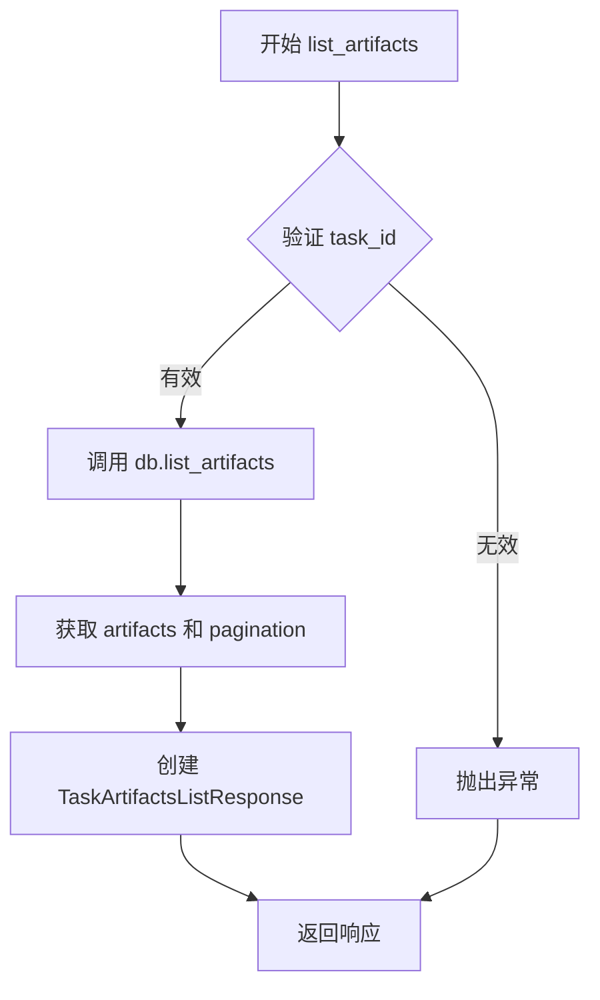

#### 带注释源码

```python
async def list_artifacts(
    self, task_id: str, page: int = 1, pageSize: int = 10
) -> TaskArtifactsListResponse:
    """
    List the artifacts that the task has created.
    列出指定任务创建的所有产物（artifacts）
    """
    # 调用数据库层的 list_artifacts 方法，获取该任务下的产物列表和分页信息
    artifacts, pagination = await self.db.list_artifacts(task_id, page, pageSize)
    
    # 封装成符合 Agent Protocol 规范的响应格式并返回
    return TaskArtifactsListResponse(artifacts=artifacts, pagination=pagination)
```


### `AgentProtocolServer.create_artifact`

创建产物（Artifact）接口，用于接收客户端上传的文件并将其存储到任务的工作区中，同时在数据库中创建相应的产物记录。

参数：

- `task_id`：`str`，任务ID，指定要将产物关联到的任务标识
- `file`：`UploadFile`，上传的文件，客户端通过 HTTP multipart/form-data 上传的文件对象
- `relative_path`：`str`，相对路径，产物文件存放在任务工作区中的相对路径

返回值：`Artifact`，创建成功的产物对象，包含产物在数据库中的唯一标识和相关元数据

#### 流程图

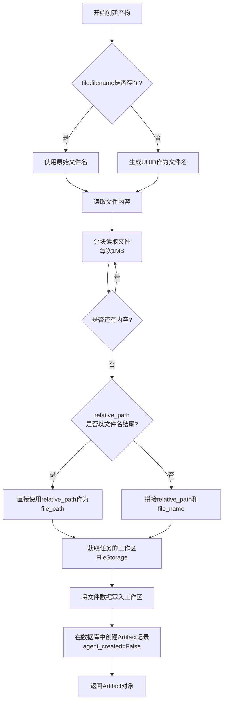

#### 带注释源码

```python
async def create_artifact(
    self, task_id: str, file: UploadFile, relative_path: str
) -> Artifact:
    """
    Create an artifact for the task.
    """
    # 如果文件有文件名则使用，否则生成UUID作为文件名
    file_name = file.filename or str(uuid4())
    
    # 初始化空字节数组用于存储文件内容
    data = b""
    # 分块读取文件内容，每次读取1MB，避免大文件占用过多内存
    while contents := file.file.read(1024 * 1024):
        data += contents
    
    # 检查相对路径是否已经包含文件名
    # 如果relative_path以文件名结尾，说明路径已完整，直接使用
    # 否则需要将relative_path和file_name拼接
    if relative_path.endswith(file_name):
        file_path = relative_path
    else:
        file_path = os.path.join(relative_path, file_name)

    # 获取当前任务对应的Agent工作区存储空间
    workspace = self._get_task_agent_file_workspace(task_id)
    # 将读取的文件数据写入到工作区的指定路径
    await workspace.write_file(file_path, data)

    # 在数据库中创建产物记录
    # agent_created=False 表示这是用户上传的产物，而非Agent生成的
    artifact = await self.db.create_artifact(
        task_id=task_id,
        file_name=file_name,
        relative_path=relative_path,
        agent_created=False,
    )
    return artifact
```


### `AgentProtocolServer.get_artifact`

获取产物（Artifact）是 AgentProtocolServer 类中用于下载任务产物的异步方法。该方法通过任务ID和产物ID从数据库获取产物元数据，然后从文件存储工作区读取对应的文件内容，最后以流式响应的形式返回给客户端进行下载。

参数：

- `task_id`：`str`，任务ID，用于定位任务的工作区目录
- `artifact_id`：`str`，产物ID，用于从数据库检索产物元数据

返回值：`StreamingResponse`，FastAPI 流式响应对象，包含二进制文件数据，并设置 Content-Disposition 头以触发浏览器下载

#### 流程图

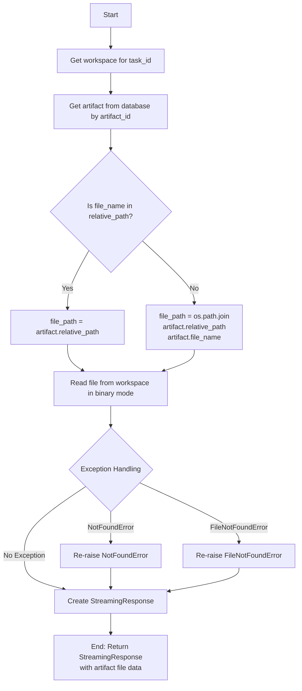

#### 带注释源码

```python
async def get_artifact(self, task_id: str, artifact_id: str) -> StreamingResponse:
    """
    Download a task artifact by ID.
    
    从任务的工作区读取产物文件并以流式响应的形式返回给客户端。
    支持从数据库获取产物元数据，并处理文件路径的构建逻辑。
    """
    try:
        # 获取任务对应的文件存储工作区
        workspace = self._get_task_agent_file_workspace(task_id)
        
        # 从数据库获取产物元数据（包含文件名、相对路径等信息）
        artifact = await self.db.get_artifact(artifact_id)
        
        # 构建文件路径：检查 file_name 是否已包含在 relative_path 中
        # 如果没有，则拼接两者；如果有，则直接使用 relative_path
        if artifact.file_name not in artifact.relative_path:
            file_path = os.path.join(artifact.relative_path, artifact.file_name)
        else:
            file_path = artifact.relative_path
        
        # 从工作区以二进制模式读取文件内容
        retrieved_artifact = workspace.read_file(file_path, binary=True)
    except NotFoundError:
        # 数据库中未找到产物时，直接重新抛出异常
        raise
    except FileNotFoundError:
        # 文件系统中未找到文件时，直接重新抛出异常
        raise

    # 返回流式响应，设置媒体类型为八位字节流
    # 并在 Header 中设置 Content-Disposition 以触发浏览器下载
    return StreamingResponse(
        BytesIO(retrieved_artifact),
        media_type="application/octet-stream",
        headers={
            "Content-Disposition": f'attachment; filename="{artifact.file_name}"'
        },
    )
```


### `AgentProtocolServer._get_task_agent_file_workspace`

获取任务代理的文件工作区，用于为特定任务创建独立的文件存储空间。

参数：

- `task_id`：`str | int`，任务标识符，用于生成代理ID并定位对应的工作区目录

返回值：`FileStorage`，返回克隆了子根目录的 FileStorage 实例，路径为 `agents/{agent_id}/workspace`

#### 流程图

```mermaid
flowchart TD
    A[开始] --> B[接收 task_id 参数]
    B --> C[调用 task_agent_id 函数生成 agent_id]
    C --> D[构建子根路径: agents/{agent_id}/workspace]
    D --> E[调用 file_storage.clone_with_subroot 克隆存储实例]
    E --> F[返回配置好的 FileStorage 对象]
```

#### 带注释源码

```python
def _get_task_agent_file_workspace(self, task_id: str | int) -> FileStorage:
    """
    获取任务代理的文件工作区。
    
    该方法为每个任务创建一个独立的文件存储空间，通过将任务ID转换为
    代理ID，并使用 file_storage 的 clone_with_subroot 方法创建一个
    隔离的工作区目录。
    
    Args:
        task_id: 任务标识符，可以是字符串或整数类型
        
    Returns:
        FileStorage: 带有特定子根目录的 FileStorage 实例，
                     路径格式为 'agents/{agent_id}/workspace'
    """
    # 使用 task_agent_id 函数将 task_id 转换为代理ID
    # 例如: task_id="123" -> agent_id="AutoGPT-123"
    agent_id = task_agent_id(task_id)
    
    # 克隆 file_storage 并设置子根目录为 agents/{agent_id}/workspace
    # 这样可以为每个任务代理提供独立的文件存储空间
    return self.file_storage.clone_with_subroot(f"agents/{agent_id}/workspace")
```


### `AgentProtocolServer._get_task_llm_provider`

该方法用于获取任务特定的 LLM 提供者，通过复制基础 LLM 提供者配置并添加任务相关的请求头（如 AP-TaskID、AP-StepID、AutoGPT-UserID），实现请求与任务的关联追踪，同时为每个任务维护独立的预算管理。

参数：

- `self`：隐含的 `AgentProtocolServer` 实例
- `task`：`Task`，任务对象，用于提取 `task_id` 和 `additional_input` 以构建请求头
- `step_id`：`str`，可选的步骤 ID，默认为空字符串，用于在请求头中标识具体步骤

返回值：`MultiProvider`，返回配置了任务特定请求头和预算的 LLM 提供者实例

#### 流程图

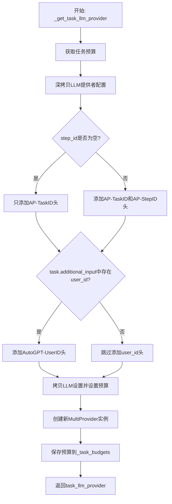

#### 带注释源码

```python
def _get_task_llm_provider(self, task: Task, step_id: str = "") -> MultiProvider:
    """
    Configures the LLM provider with headers to link outgoing requests to the task.
    为LLM提供者配置请求头，将出站请求与任务关联起来。
    """
    # 从任务预算字典中获取当前任务的预算，如果不存在则创建新的ModelProviderBudget实例
    task_llm_budget = self._task_budgets[task.task_id]

    # 深拷贝LLM提供者的配置对象，避免修改原始配置
    task_llm_provider_config = self.llm_provider._configuration.model_copy(
        deep=True
    )
    
    # 获取额外的请求头字典
    _extra_request_headers = task_llm_provider_config.extra_request_headers
    
    # 添加任务ID到请求头，用于追踪请求所属任务
    _extra_request_headers["AP-TaskID"] = task.task_id
    
    # 如果提供了step_id，则添加到请求头中
    if step_id:
        _extra_request_headers["AP-StepID"] = step_id
    
    # 如果任务包含additional_input且其中有user_id，则添加到请求头
    if task.additional_input and (user_id := task.additional_input.get("user_id")):
        _extra_request_headers["AutoGPT-UserID"] = user_id

    # 拷贝LLM提供者的设置对象
    settings = self.llm_provider._settings.model_copy()
    
    # 为该任务设置专属的预算和配置
    settings.budget = task_llm_budget
    settings.configuration = task_llm_provider_config
    
    # 创建新的MultiProvider实例，使用任务特定的设置和日志记录器
    task_llm_provider = self.llm_provider.__class__(
        settings=settings,
        logger=logger.getChild(
            f"Task-{task.task_id}_{self.llm_provider.__class__.__name__}"
        ),
    )
    
    # 将新创建提供者的预算保存回_task_budgets字典，供后续使用
    self._task_budgets[task.task_id] = task_llm_provider._budget  # type: ignore

    return task_llm_provider
```


### `AgentProtocolServer._on_agent_write_file`

该方法是一个异步回调函数，用于在代理（Agent）执行写文件操作时被触发。其核心职责是确保文件系统中的文件变更与数据库中的 `Artifact`（工件）记录保持同步 either by creating a new artifact entry if the file is new, or by updating an existing artifact's metadata to mark it as agent-created.

#### 参数

- `self`：隐式参数，表示 `AgentProtocolServer` 的实例本身。
- `task`：`Task`，当前代理任务的对象，包含了任务的上下文信息及现有的 artifacts 列表。
- `step`：`Step`，当前正在执行的步骤对象，用于关联 artifact 创建的归属。
- `relative_path`：`pathlib.Path`，代理写入文件的相对路径。

#### 返回值

`None`。该函数不返回任何值，主要通过修改数据库状态来持久化信息。

#### 流程图

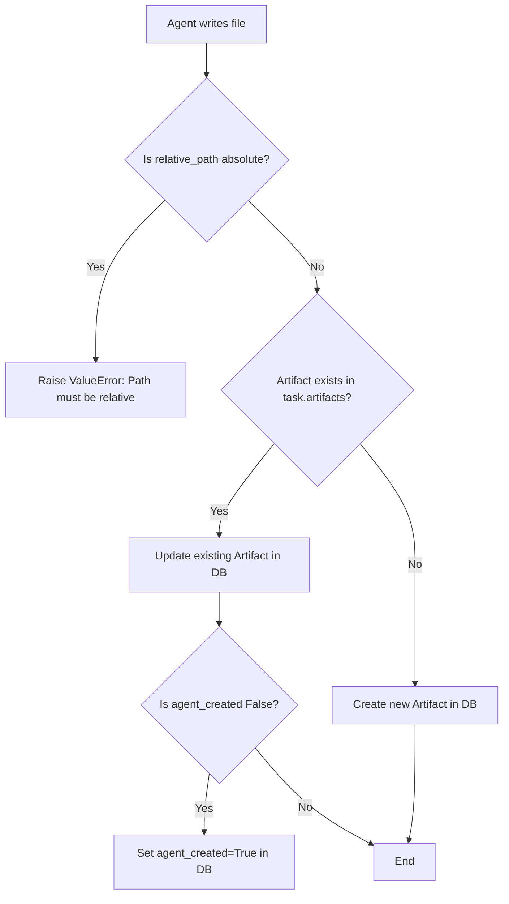

#### 带注释源码

```python
async def _on_agent_write_file(
    self, task: Task, step: Step, relative_path: pathlib.Path
) -> None:
    """
    Creates an Artifact for the written file, or updates the Artifact if it exists.
    """
    # 1. 验证路径合法性：禁止绝对路径，必须是相对路径以保证隔离性
    if relative_path.is_absolute():
        raise ValueError(f"File path '{relative_path}' is not relative")
    
    # 2. 遍历当前任务下的现有 artifacts，检查该文件是否已有记录
    for a in task.artifacts or []:
        if a.relative_path == str(relative_path):
            # 找到匹配项，记录日志
            logger.debug(f"Updating Artifact after writing to existing file: {a}")
            # 如果该 artifact 原本不是由 agent 创建的（例如通过上传），则更新其状态
            if not a.agent_created:
                await self.db.update_artifact(a.artifact_id, agent_created=True)
            break
    # 3. 如果未找到匹配项，说明是新建文件，则在数据库中创建新的 Artifact 记录
    else:
        logger.debug(f"Creating Artifact for new file '{relative_path}'")
        await self.db.create_artifact(
            task_id=step.task_id,
            step_id=step.step_id,
            file_name=relative_path.parts[-1], # 获取文件名作为 artifact 名称
            agent_created=True, # 标记为由 agent 创建
            relative_path=str(relative_path),
        )
```

## 关键组件


### AgentProtocolServer

核心服务器类，负责管理整个AutoGPT Agent Protocol服务。它处理任务、步骤、工件的创建与管理，并协调LLM提供者与文件存储的交互。

### 任务创建与管理 (create_task, get_task, list_tasks)

负责接收用户输入创建任务，提供任务列表查询和单个任务检索功能。集成Sentry用于用户追踪，并通过AgentFactory创建具体的Agent实例。

### 步骤执行引擎 (execute_step)

核心业务逻辑方法，处理Agent与用户的交互循环。包含状态恢复、用户输入处理、动作执行批准机制、支持ASK_COMMAND和FINISH_COMMAND等命令，是自动化执行的关键组件。

### 工件管理系统 (create_artifact, get_artifact, list_artifacts, _on_agent_write_file)

管理Agent生成的文件资源。提供工件创建、下载、列表查询功能，并通过文件写入回调自动追踪和注册Artifact，支持增量更新和状态保存。

### LLM提供者工厂 (_get_task_llm_provider)

为每个任务创建隔离的LLM实例，支持预算管理和请求追踪。通过请求头注入任务ID和步骤ID，实现多任务并发下的成本核算和日志追踪。

### 文件存储抽象 (_get_task_agent_file_workspace)

基于FileStorage的目录隔离机制，为每个任务分配独立的workspace目录。支持二进制文件读写，是Agent操作文件系统的核心依赖。

### CORS中间件配置

动态配置跨域资源共享策略，支持环境变量配置多个来源。默认仅允许本地访问，提供灵活的部署适应性。

### HyperCorn ASGI服务器配置

基于Hypercorn的异步HTTP服务器封装，支持异步启动和配置管理。提供端口冲突检测和错误日志输出。

### 预算管理 (_task_budgets)

基于defaultdict的预算追踪机制，为每个任务维护独立的ModelProviderBudget实例，实现细粒度的资源使用控制。


## 问题及建议


### 已知问题

-   **日志级别硬编码**：在`start`方法中`config.loglevel = "ERROR"`被硬编码，无法通过配置动态调整，导致调试困难
-   **TODO和HACK代码未清理**：代码中存在TODO注释（关于task-oriented profiles性能）和HACK注释（AGBenchmark兼容性），这些技术债务未解决
-   **异常处理不完善**：`get_artifact`方法捕获`NotFoundError`和`FileNotFoundError`后直接重新抛出，没有添加额外上下文信息，不利于问题排查
-   **Lambda函数降低可读性**：`execute_step`中`on_write_file`使用lambda表达式定义回调，调试困难且不易于维护
-   **类型注解不完整**：多处使用`type: ignore`注释掩盖类型问题，如`await hypercorn_serve(app, config)`和`self._task_budgets`赋值
-   **重复代码模式**：多处重复提取`user_id`的逻辑（如`task_request.additional_input.get("user_id")`和`task.additional_input.get("user_id")`），未提取为公共方法
-   **长方法问题**：`execute_step`方法过长（超过200行），包含过多职责，应拆分为更小的方法
-   **内部API直接访问**：直接访问`llm_provider._configuration`、`llm_provider._settings`、`llm_provider._budget`等私有属性，存在接口不稳定风险

### 优化建议

-   将日志级别、端口、绑定地址等配置提取到`AppConfig`中，实现可配置化
-   清理TODO和HACK注释，或将其转化为正式的Issue跟踪
-   为异常处理添加更详细的上下文信息，使用自定义异常类包装
-   将lambda回调重构为具名方法，提升可测试性和可维护性
-   完善类型注解，使用泛型替代`type: ignore`
-   抽取公共方法如`extract_user_id()`减少重复代码
-   重构`execute_step`方法，拆分为`load_agent`、`execute_proposal`、`propose_next_action`等独立方法
-   通过公共接口或属性方法封装对LLM provider内部状态的访问，减少对私有属性的依赖

## 其它


### 设计目标与约束

本代码的设计目标是构建一个基于Agent Protocol的AutoGPT服务器，实现任务管理、步骤执行和AI代理运行的核心功能。约束条件包括：使用FastAPI作为Web框架，Hypercorn作为ASGI服务器，必须通过Agent Protocol规范进行API交互，支持CORS跨域配置，端口默认8000（可配置），前端静态文件路径依赖项目目录结构。

### 错误处理与异常设计

错误处理采用分层设计：数据库操作通过AgentDB的NotFoundError捕获任务/步骤/工件不存在的情况；文件操作通过FileNotFoundError和ValueError处理路径问题；代理执行通过AgentFinished异常标记任务完成，通过ActionErrorResult传递执行错误。API层面返回状态码和错误信息，LLM调用异常会导致步骤状态标记为completed并输出错误描述。关键点：所有异步数据库操作使用await，文件写入通过workspace.write_file()，错误日志使用logging模块。

### 数据流与状态机

任务创建流程：create_task接收TaskRequestBody -> 创建数据库任务 -> 生成代理实例 -> 保存初始状态。步骤执行流程：execute_step接收StepRequestBody -> 加载任务和代理状态 -> 判断是否为初始步骤 -> 如果存在上一步骤提议则执行或等待用户确认 -> 否则生成新的动作提议 -> 更新步骤状态和输出 -> 保存代理状态。状态转换：task创建后进入pending状态，step创建后经历pending->running->completed状态转换，agent通过event_history管理会话历史和当前episode状态。

### 外部依赖与接口契约

核心依赖包括：fastapi（Web框架）、hypercorn（ASGI服务器）、orjson（高性能JSON序列化）、sentry_sdk（错误监控）、forge包（agent_protocol模块）、autogpt包（agent_factory、agents模块）。接口契约遵循Agent Protocol规范：/ap/v1/tasks（任务CRUD）、/ap/v1/tasks/{task_id}/steps（步骤CRUD）、/ap/v1/tasks/{task_id}/artifacts（工件管理）。数据库接口AgentDB提供create_task、get_task、list_tasks、create_step、update_step、get_step、list_steps、create_artifact、get_artifact、list_artifacts、update_artifact方法。

### 安全性考虑

CORS配置允许通过AP_SERVER_CORS_ALLOWED_ORIGINS环境变量配置可信源，默认仅允许localhost访问。Sentry集成通过set_user()记录用户ID用于追踪。文件路径安全：_on_agent_write_file()检查relative_path必须为相对路径，防止路径遍历攻击。任务隔离：每个任务使用独立的file_storage子目录（agents/{agent_id}/workspace），LLM请求头包含AP-TaskID和AP-StepID用于请求追踪。

### 性能优化建议

代码中已有TODO注释：需要重新评估task-oriented profiles的性能收益。当前实现存在优化空间：每次execute_step都重新加载代理状态（configure_agent_with_state），可考虑缓存机制；文件读取使用分块读取（1024*1024字节），但可进一步优化大文件处理；_task_budgets使用defaultdict但未实现预算消耗后的自动清理；可添加代理状态缓存层减少数据库读取频率。

### 测试策略

建议的测试覆盖：单元测试覆盖AgentProtocolServer类的各个方法（create_task、execute_step等），使用mock模拟AgentDB和FileStorage；集成测试验证API端点响应和状态流转；模拟Agent执行场景测试异常处理路径。当前代码已包含部分测试友好设计：依赖注入模式便于mock，异步方法支持mocking。

### 部署注意事项

部署需满足以下条件：AP_SERVER_PORT环境变量或.env配置端口；AP_SERVER_CORS_ALLOWED_ORIGINS配置生产环境CORS；frontend构建产物需放置于classic/frontend/build/web目录否则仅提供API服务；确保数据库（AgentDB实现）和文件存储（FileStorage）可用；LLM提供者需通过环境变量或配置文件设置。

### 配置管理

配置通过AppConfig类集中管理，运行时参数通过环境变量传递：AP_SERVER_PORT（服务器端口）、AP_SERVER_CORS_ALLOWED_ORIGINS（逗号分隔的CORS白名单）、LLM提供者配置。代码内默认端口8000，frontend路径通过动态计算script_dir相对路径确定，Hypercorn日志级别设为ERROR以减少输出。

### 日志与监控

日志使用Python标准logging模块，logger通过__name__获取。关键操作均有debug级别日志：任务创建、步骤执行、成本计算。错误场景使用error和warning级别。Sentry SDK集成用于生产环境错误追踪，通过set_user()关联用户ID。LLM成本追踪：记录task_total_cost和task_cumulative_cost用于计费和监控。

### 可扩展性设计

设计支持多种扩展方向：中间件机制（AgentMiddleware）允许注入代理到请求上下文；MultiProvider模式支持多LLM提供者；FileStorage的clone_with_subroot支持多租户隔离；TaskLLMProvider配置复制机制支持每个任务独立配置；router参数化支持自定义API路由。新的功能可通过继承AgentProtocolServer或添加新的endpoint实现扩展。

    