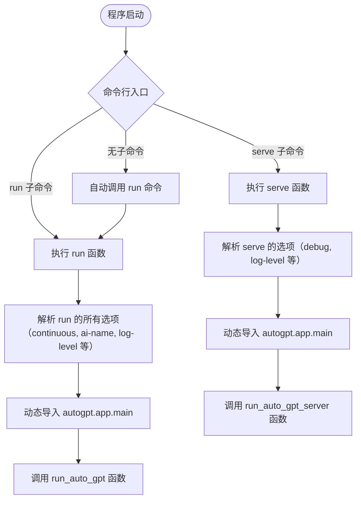
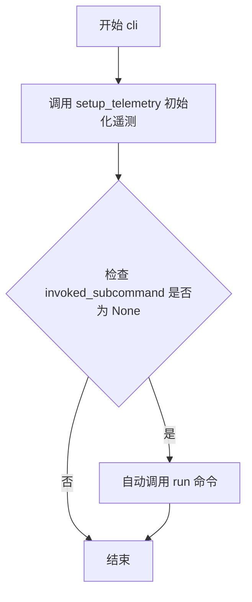
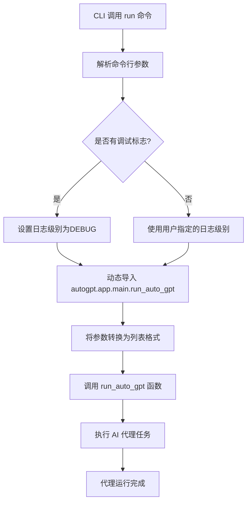
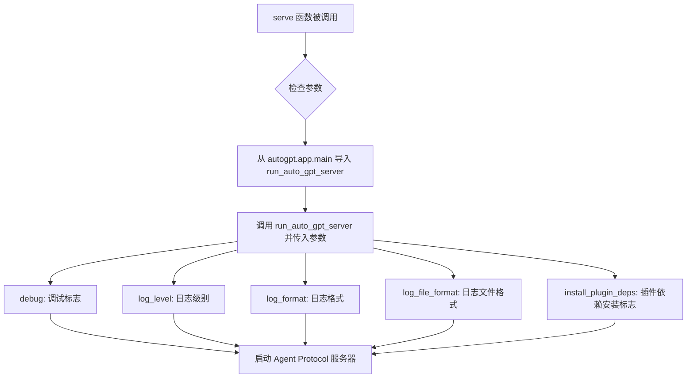

# `.\AutoGPT\classic\original_autogpt\autogpt\app\cli.py` 详细设计文档

这是 AutoGPT 项目的命令行界面（CLI）入口脚本，基于 Click 框架构建。它定义了 'cli' 主命令组，并包含 'run'（用于启动交互式或连续模式代理）和 'serve'（用于启动 Agent Protocol HTTP 服务器）两个核心子命令，负责解析各类配置参数（如日志、AI 角色、插件依赖等）并调用底层应用逻辑。

## 整体流程



## 类结构

```
autogpt/cli.py (CLI 模块)
├── 导入 (Imports)
│   ├── logging._nameToLevel (as logLevelMap)
│   ├── pathlib.Path
│   ├── typing.Optional
│   ├── click
│   ├── forge.logging.config.LogFormatName
│   └── .telemetry.setup_telemetry
├── cli (主命令组)
├── run (子命令)
└── serve (子命令)
```

## 全局变量及字段


### `logLevelMap`
    
日志级别名称到数值的映射字典，用于将日志级别字符串转换为对应的数值

类型：`dict`
    


### `Path`
    
pathlib 路径类，用于文件路径操作，提供面向对象的路径操作方法

类型：`class`
    


### `Optional`
    
typing 中的可选类型，用于标注可能为 None 的参数或返回值

类型：`typing.Optional`
    


### `click`
    
用于构建命令行界面的库，提供装饰器方式定义 CLI 命令和选项的功能

类型：`module`
    


### `LogFormatName`
    
日志格式枚举类，定义应用中可用的日志输出格式选项

类型：`enum class`
    


### `setup_telemetry`
    
导入的遥测初始化函数，用于设置应用的数据收集和监控功能

类型：`function`
    


    

## 全局函数及方法


### `cli`

这是 AutoGPT 包的主入口函数，作为 Click 命令组的根命令，在没有指定子命令时自动调用 `run` 命令，并初始化遥测系统。

参数：

- `ctx`：`click.Context`，Click 框架的上下文对象，包含当前命令执行的状态信息，用于判断是否有子命令被调用

返回值：`None`，该函数不返回任何值，仅执行副作用操作

#### 流程图



#### 带注释源码

```python
@click.group(invoke_without_command=True)
@click.pass_context
def cli(ctx: click.Context):
    """
    主命令组函数，作为 AutoGPT CLI 的入口点。
    当没有指定任何子命令时，自动调用 run 命令。
    """
    # 初始化遥测系统，用于收集使用数据
    setup_telemetry()

    # 当没有子命令被调用时，自动执行 run 命令
    # invoke_without_command=True 使得即使不传子命令也会进入 cli 函数
    # 此时 ctx.invoked_subcommand 为 None
    if ctx.invoked_subcommand is None:
        # 动态调用同命令组下的 run 子命令
        ctx.invoke(run)
```


### `run`

该函数是 AutoGPT CLI 的子命令，用于设置并运行一个基于用户指定任务的 AI 代理，或恢复一个已存在的代理。它通过 Click 框架接收大量配置选项，并将这些选项传递给核心的 `run_auto_gpt` 函数来执行代理逻辑。

参数：

-  `continuous`：`bool`，启用连续模式（Continuous Mode）
-  `continuous_limit`：`Optional[int]`，定义连续模式运行的次数
-  `speak`：`bool`，启用语音模式（Speak Mode）
-  `install_plugin_deps`：`bool`，安装第三方插件的外部依赖
-  `skip_news`：`bool`，是否在启动时抑制最新消息的输出
-  `skip_reprompt`：`bool`，跳过脚本开头的重新提示消息
-  `ai_name`：`Optional[str]`，AI 名称覆盖
-  `ai_role`：`Optional[str]`，AI 角色覆盖
-  `resource`：`tuple[str]`，添加或覆盖 AI 资源（可多次使用）
-  `constraint`：`tuple[str]`，添加或覆盖 AI 约束（可多次使用）
-  `best_practice`：`tuple[str]`，添加或覆盖 AI 最佳实践（可多次使用）
-  `override_directives`：`bool`，如果指定，则 --constraint、--resource 和 --best-practice 将覆盖 AI 的指令而不是追加
-  `debug`：`bool`，启用调试模式（隐含 --log-level=DEBUG --log-format=debug）
-  `log_level`：`Optional[str]`，日志级别
-  `log_format`：`Optional[str]`，日志格式选择
-  `log_file_format`：`Optional[str]`，日志文件输出格式覆盖
-  `component_config_file`：`Optional[Path]`，JSON 配置文件的路径

返回值：`None`，该函数没有返回值，通过调用 `run_auto_gpt` 执行代理逻辑

#### 流程图



#### 带注释源码

```python
@cli.command()
@click.option("-c", "--continuous", is_flag=True, help="Enable Continuous Mode")
@click.option(
    "-l",
    "--continuous-limit",
    type=int,
    help="Defines the number of times to run in continuous mode",
)
@click.option("--speak", is_flag=True, help="Enable Speak Mode")
@click.option(
    "--install-plugin-deps",
    is_flag=True,
    help="Installs external dependencies for 3rd party plugins.",
)
@click.option(
    "--skip-news",
    is_flag=True,
    help="Specifies whether to suppress the output of latest news on startup.",
)
@click.option(
    "--skip-reprompt",
    "-y",
    is_flag=True,
    help="Skips the re-prompting messages at the beginning of the script",
)
@click.option(
    "--ai-name",
    type=str,
    help="AI name override",
)
@click.option(
    "--ai-role",
    type=str,
    help="AI role override",
)
@click.option(
    "--constraint",
    type=str,
    multiple=True,
    help=(
        "Add or override AI constraints to include in the prompt;"
        " may be used multiple times to pass multiple constraints"
    ),
)
@click.option(
    "--resource",
    type=str,
    multiple=True,
    help=(
        "Add or override AI resources to include in the prompt;"
        " may be used multiple times to pass multiple resources"
    ),
)
@click.option(
    "--best-practice",
    type=str,
    multiple=True,
    help=(
        "Add or override AI best practices to include in the prompt;"
        " may be used multiple times to pass multiple best practices"
    ),
)
@click.option(
    "--override-directives",
    is_flag=True,
    help=(
        "If specified, --constraint, --resource and --best-practice will override"
        " the AI's directives instead of being appended to them"
    ),
)
@click.option(
    "--debug", is_flag=True, help="Implies --log-level=DEBUG --log-format=debug"
)
@click.option("--log-level", type=click.Choice([*logLevelMap.keys()]))
@click.option(
    "--log-format",
    help=(
        "Choose a log format; defaults to 'simple'."
        " Also implies --log-file-format, unless it is specified explicitly."
        " Using the 'structured_google_cloud' format disables log file output."
    ),
    type=click.Choice([i.value for i in LogFormatName]),
)
@click.option(
    "--log-file-format",
    help=(
        "Override the format used for the log file output."
        " Defaults to the application's global --log-format."
    ),
    type=click.Choice([i.value for i in LogFormatName]),
)
@click.option(
    "--component-config-file",
    help="Path to a json configuration file",
    type=click.Path(exists=True, dir_okay=False, resolve_path=True, path_type=Path),
)
def run(
    continuous: bool,
    continuous_limit: Optional[int],
    speak: bool,
    install_plugin_deps: bool,
    skip_news: bool,
    skip_reprompt: bool,
    ai_name: Optional[str],
    ai_role: Optional[str],
    resource: tuple[str],
    constraint: tuple[str],
    best_practice: tuple[str],
    override_directives: bool,
    debug: bool,
    log_level: Optional[str],
    log_format: Optional[str],
    log_file_format: Optional[str],
    component_config_file: Optional[Path],
) -> None:
    """
    Sets up and runs an agent, based on the task specified by the user, or resumes an
    existing agent.
    """
    # 将导入放在函数内部以避免在启动 CLI 时导入所有内容（延迟导入）
    from autogpt.app.main import run_auto_gpt

    # 调用核心运行函数，传递所有配置参数
    # 注意：tuple 类型参数需要转换为 list
    run_auto_gpt(
        continuous=continuous,
        continuous_limit=continuous_limit,
        skip_reprompt=skip_reprompt,
        speak=speak,
        debug=debug,
        log_level=log_level,
        log_format=log_format,
        log_file_format=log_file_format,
        skip_news=skip_news,
        install_plugin_deps=install_plugin_deps,
        override_ai_name=ai_name,
        override_ai_role=ai_role,
        resources=list(resource),       # 将 tuple 转换为 list
        constraints=list(constraint),     # 将 tuple 转换为 list
        best_practices=list(best_practice),  # 将 tuple 转换为 list
        override_directives=override_directives,
        component_config_file=component_config_file,
    )
```


### `serve`

启动一个 Agent Protocol 兼容的 AutoGPT 服务器，该服务器为每个任务创建自定义代理。

参数：

- `install_plugin_deps`：`bool`，安装第三方插件的外部依赖
- `debug`：`bool`，启用调试模式（隐含 `--log-level=DEBUG --log-format=debug`）
- `log_level`：`Optional[str]`，日志级别，可选值来自 `logging` 模块
- `log_format`：`Optional[str]`，日志格式，默认为 'simple'，可选值包括 LogFormatName 枚举的值
- `log_file_format`：`Optional[str]`，日志文件格式，默认使用全局 `--log-format` 设置

返回值：`None`，无返回值（该函数通过调用 `run_auto_gpt_server` 执行服务器启动逻辑）

#### 流程图



#### 带注释源码

```python
@cli.command()
@click.option(
    "--install-plugin-deps",
    is_flag=True,
    help="安装第三方插件的外部依赖。",
)
@click.option(
    "--debug", 
    is_flag=True, 
    help="启用调试模式，隐含 --log-level=DEBUG --log-format=debug"
)
@click.option(
    "--log-level", 
    type=click.Choice([*logLevelMap.keys()])
)
@click.option(
    "--log-format",
    help=(
        "选择日志格式；默认为 'simple'。"
        " 同时也隐含 --log-file-format，除非明确指定。"
        " 使用 'structured_google_cloud' 格式会禁用日志文件输出。"
    ),
    type=click.Choice([i.value for i in LogFormatName]),
)
@click.option(
    "--log-file-format",
    help=(
        "覆盖日志文件输出使用的格式。"
        " 默认为应用程序的全局 --log-format。"
    ),
    type=click.Choice([i.value for i in LogFormatName]),
)
def serve(
    install_plugin_deps: bool,
    debug: bool,
    log_level: Optional[str],
    log_format: Optional[str],
    log_file_format: Optional[str],
) -> None:
    """
    启动一个 Agent Protocol 兼容的 AutoGPT 服务器，为每个任务创建自定义代理。
    """
    # 将导入放在函数内部，以避免在启动 CLI 时导入所有内容
    # 这是一种延迟导入策略，用于优化启动性能
    from autogpt.app.main import run_auto_gpt_server

    # 调用 run_auto_gpt_server 函数启动服务器
    # 传递所有配置参数：调试模式、日志配置和插件依赖安装选项
    run_auto_gpt_server(
        debug=debug,
        log_level=log_level,
        log_format=log_format,
        log_file_format=log_file_format,
        install_plugin_deps=install_plugin_deps,
    )
```

## 关键组件


### CLI命令组（cli）

主入口点，使用Click框架的@click.group装饰器，invoke_without_command=True表示无子命令时默认执行run命令，并集成遥测功能。

### run命令

用于运行AutoGPT代理的核心命令，提供丰富的命令行选项，包括连续模式、连续限制、说话模式、安装插件依赖、跳过新闻、跳过重新提示、AI名称/角色覆盖、约束/资源/最佳实践添加、日志配置、调试模式、组件配置文件等。

### serve命令

启动符合Agent Protocol规范的AutoGPT服务器，为每个任务创建自定义代理，支持安装插件依赖、调试模式和日志配置选项。

### 命令行选项处理模块

通过Click的@click.option装饰器定义大量可选参数，包括布尔标志（is_flag=True）和值选项（type=str/int），支持多次使用的选项（multiple=True），以及路径类型验证和日志级别/格式选择。

### 遥测集成（setup_telemetry）

从.telemetry模块导入的遥测设置函数，在CLI初始化时调用，用于收集和上报运行时的遥测数据。

### 日志配置集成

使用logging._nameToLevel映射和LogFormatName枚举来配置日志级别和格式，支持简单格式、调试格式和结构化云日志格式。

### 动态导入模块

将autogpt.app.main中的run_auto_gpt和run_auto_gpt_server函数在函数内部导入，避免启动时导入所有依赖，提升启动性能。

## 问题及建议


### 已知问题

-   **私有API依赖**：使用了 `logging._nameToLevel` 这个私有API（带下划线前缀），这在不同Python版本中可能不稳定，属于内部实现细节
-   **重复选项定义**：`--debug`, `--log-level`, `--log-format`, `--log-file-format`, `--install-plugin-deps` 等选项在 `run` 和 `serve` 命令中完全重复定义，增加维护成本和一致性风险
-   **导入语句放在函数内部**：虽然注释说明是为了延迟导入以加快CLI启动速度，但这种模式降低了代码可读性，且每次调用都会执行导入检查
- **类型注解不精确**：参数类型使用 `tuple[str]`，但实际接收的是不可变 tuple，转换为 list 再传递造成了额外开销
- **缺乏错误处理**：整个 CLI 入口没有任何 try-except 包装，导入失败或运行时异常会直接暴露给用户
- **日志格式选项构建方式脆弱**：通过列表推导 `[i.value for i in LogFormatName]` 构建 click.Choice，如果枚举顺序改变或值重复，可能导致意外行为

### 优化建议

-   **抽取公共选项为装饰器**：使用 click 的 `@click.option` 装饰器组合或自定义装饰器函数来定义公共选项，避免在多处重复声明
-   **使用公共日志API替代私有API**：考虑使用 `logging.getLevelByName`（如果可用）或维护一个自己的日志级别映射字典
-   **延迟导入改为条件导入**：将函数内部导入移至模块顶部，使用懒加载模式或依赖注入来避免启动时的全量导入
-   **统一参数处理**：对于多个值的参数，考虑直接使用 `click.option(..., multiple=True, callback=... )` 进行转换，避免在调用处手动 `list()` 转换
-   **添加全局异常处理**：在 `cli` 入口点添加 click 的 `@cli.error_handler` 或手动 try-except 块，提升用户体验
-   **提取公共函数**：将 `run` 和 `serve` 命令中相同的日志设置逻辑抽取为独立函数，减少代码重复

## 其它


### 设计目标与约束

该CLI模块作为AutoGPT的入口点，核心设计目标是提供灵活的命令行接口，支持两种运行模式（直接运行run和服务模式serve），允许用户通过丰富的命令行参数配置Agent行为。约束方面：依赖Click框架进行CLI解析；必须保持与autogpt.app.main模块的解耦（通过延迟导入避免循环依赖）；所有命令行参数需与底层run_auto_gpt和run_auto_gpt_server函数签名匹配；日志配置需兼容多种格式包括Google Cloud结构化日志。

### 错误处理与异常设计

CLI层主要处理命令行参数解析错误，由Click框架自动捕获并显示友好提示。对于运行时错误，底层模块（autogpt.app.main）抛出的异常会直接向上传播，CLI不做额外捕获处理。潜在需要增强的方面：component-config-file选项虽然检查文件存在性，但未验证JSON格式有效性；log-level和log-format的非法组合（如debug模式配合特定格式）未在CLI层校验；网络相关异常（如telemetry初始化失败）应优雅降级而非中断启动流程。建议添加全局异常处理器以捕获未预期异常并提供调试信息。

### 数据流与状态机

CLI模块本身不维护复杂状态机，其数据流相对简单：用户输入 → Click解析 → 参数验证 → 参数组装 → 调用底层函数。状态转换主要体现在：cli_group初始化 → run命令或serve命令执行 → 程序终止。关键状态节点包括：ctx.invoked_subcommand判断是否自动调用run；continuous和continuous_limit的逻辑关联（limit需大于0）；debug标志对log-level和log-format的隐式覆盖逻辑。

### 外部依赖与接口契约

核心依赖包括：click（CLI框架）、logging模块的_nameToLevel映射、pathlib.Path（路径处理）、typing.Optional。外部契约方面：依赖autogpt.app.main模块的run_auto_gpt和run_auto_gpt_server函数，需保持参数签名一致；依赖forge.logging.config的LogFormatName枚举；依赖自带的telemetry模块进行遥测初始化。所有外部导入均采用绝对导入方式，模块级导入仅logging._nameToLevel（内部API）和pathlib.Path，其他均为函数内延迟导入以优化启动性能。

### 配置管理

CLI层本身不直接管理配置，主要通过component-config-file参数接收外部JSON配置文件路径。配置传递方式：CLI参数优先于配置文件；multiple类型的参数（constraint、resource、best_practice）为列表形式，可叠加；override_directives标志控制是追加还是覆盖AI指令。配置验证时机：文件存在性在Click层检查，JSON有效性未验证，配置内容结构由底层模块负责校验。

### 安全性考虑

当前CLI层安全措施有限，主要包括：component-config-file路径使用resolve_path=True解析为绝对路径；exists=True检查文件存在性；dir_okay=False防止目录遍历攻击。潜在安全风险：install_plugin-deps标志允许自动安装第三方依赖，可能执行任意代码；未对AI_NAME和AI_ROLE参数进行长度或内容限制，可能导致提示词注入；配置文件内容完全信任，缺少Schema验证机制。建议增加：参数值长度限制；敏感配置项脱敏处理；安装依赖前的确认机制。

### 性能考量

主要性能优化体现在延迟导入策略：run和serve函数内部才导入autogpt.app.main，避免CLI模块加载时触发整个AutoGPT包的初始化。日志级别和格式的选择直接影响IO性能，debug模式会产生大量日志输出。启动流程中setup_telemetry()为同步调用，可考虑异步化以减少启动时间。

### 兼容性考虑

Python版本要求：代码使用类型注解和match语句（虽然本文件未使用），需Python 3.10+；日志级别映射依赖logging模块的内部实现_nameToLevel，不同Python版本可能存在差异。命令行参数兼容性：--speak和--continuous-limit等参数在不同版本间应保持稳定；日志格式选项依赖forge.logging.config模块，需同步版本。跨平台支持：Path类型处理Windows/Linux路径差异；click.Path在Windows下行为可能不同。

### 测试策略建议

CLI模块测试应覆盖：命令行参数解析正确性；默认值和参数组合验证；帮助文档生成；无效参数的错误处理。建议使用Click提供的CliRunner进行单元测试，验证各命令组合的行为。由于存在条件导入，mock autogpt.app.main模块以隔离测试范围。集成测试应验证CLI参数能正确传递给底层函数。

### 监控与日志设计

CLI层日志配置通过--log-level和--log-format参数控制，debug标志隐含设置DEBUG级别和debug格式。日志格式选项支持多种输出目标：标准输出、文件输出、Google Cloud结构化格式。telemetry模块负责收集遥测数据但实现细节对CLI透明。建议增强：日志轮转配置；结构化日志字段标准化；关键操作（如配置加载、依赖安装）的审计日志。

### 版本与升级管理

当前文件无版本标识，建议添加__version__或通过包元数据获取版本信息。CLI参数应保持向后兼容，新增参数应有默认值保证旧调用方式继续工作。配置文件格式演进需考虑版本协商机制。

### 许可证与法律

代码头部无许可证声明，需确认AutoGPT整体项目的开源许可证（通常为MIT或AGPL）。第三方依赖（click、forge等）许可证需兼容。AI_NAME和AI_ROLE参数可能涉及商标使用提示。

### 贡献指南相关

代码风格：遵循PEP 8，使用类型注解，import排序符合PEP 8或isort规范。docstring格式：使用Google风格或Sphinx风格。提交前需确保：单元测试通过；无类型检查错误；CLI帮助文档更新（如果新增参数）。

    