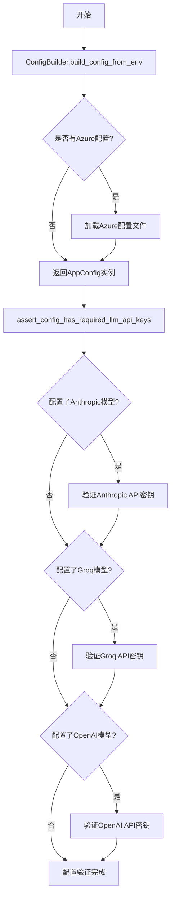
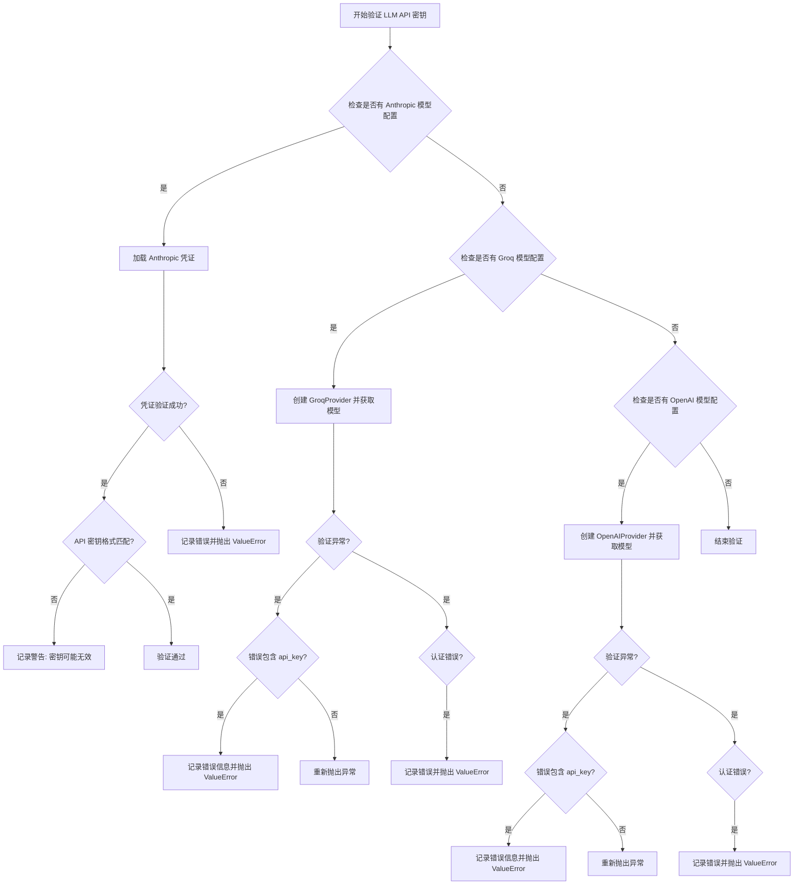

# `.\AutoGPT\classic\original_autogpt\autogpt\app\config.py` 详细设计文档

这是Auto-GPT应用程序的配置管理模块,定义了应用配置类(AppConfig)用于存储和管理LLM模型设置、凭证、日志配置等,并通过ConfigBuilder从环境变量构建配置,同时提供API密钥验证函数确保所需的LLM服务可用。

## 整体流程



## 类结构

```
BaseConfig (抽象基类)
└── AppConfig (应用配置类)
    └── ConfigBuilder[ConfigBuilder[Configurable[AppConfig]]]
```

## 全局变量及字段


### `PROJECT_ROOT`
    
项目根目录路径

类型：`Path`
    


### `AZURE_CONFIG_FILE`
    
Azure配置文件路径

类型：`Path`
    


### `GPT_4_MODEL`
    
GPT-4模型枚举

类型：`OpenAIModelName`
    


### `GPT_3_MODEL`
    
GPT-3模型枚举

类型：`OpenAIModelName`
    


### `AppConfig.name`
    
应用名称

类型：`str`
    


### `AppConfig.description`
    
应用描述

类型：`str`
    


### `AppConfig.project_root`
    
项目根目录

类型：`Path`
    


### `AppConfig.app_data_dir`
    
应用数据目录

类型：`Path`
    


### `AppConfig.skip_news`
    
跳过新闻标志

类型：`bool`
    


### `AppConfig.skip_reprompt`
    
跳过重提示标志

类型：`bool`
    


### `AppConfig.authorise_key`
    
授权键

类型：`str`
    


### `AppConfig.exit_key`
    
退出键

类型：`str`
    


### `AppConfig.noninteractive_mode`
    
非交互模式标志

类型：`bool`
    


### `AppConfig.logging`
    
日志配置

类型：`LoggingConfig`
    


### `AppConfig.component_config_file`
    
组件配置文件

类型：`Optional[Path]`
    


### `AppConfig.fast_llm`
    
快速LLM模型

类型：`ModelName`
    


### `AppConfig.smart_llm`
    
智能LLM模型

类型：`ModelName`
    


### `AppConfig.temperature`
    
温度参数

类型：`float`
    


### `AppConfig.openai_functions`
    
OpenAI函数标志

类型：`bool`
    


### `AppConfig.embedding_model`
    
嵌入模型

类型：`str`
    


### `AppConfig.continuous_mode`
    
连续模式标志

类型：`bool`
    


### `AppConfig.continuous_limit`
    
连续限制

类型：`int`
    


### `AppConfig.disabled_commands`
    
禁用命令列表

类型：`list[str]`
    


### `AppConfig.restrict_to_workspace`
    
限制工作区标志

类型：`bool`
    


### `AppConfig.openai_credentials`
    
OpenAI凭证

类型：`Optional[OpenAICredentials]`
    


### `AppConfig.azure_config_file`
    
Azure配置文件

类型：`Optional[Path]`
    


### `ConfigBuilder.default_settings`
    
默认配置

类型：`AppConfig`
    
    

## 全局函数及方法


### `assert_config_has_required_llm_api_keys`

该异步函数用于验证配置的 LLM 模型（SMART_LLM 和 FAST_LLM）是否具有有效的 API 密钥。它会检查 Anthropic、Groq 和 OpenAI 三种模型提供商，根据配置动态加载相应的凭证并进行验证，如果密钥缺失或无效则抛出 ValueError 异常。

参数：

- `config`：`AppConfig`，应用程序的配置对象，包含 smart_llm 和 fast_llm 两个模型配置字段

返回值：`None`，该函数不返回任何值，通过抛出异常来表示验证失败

#### 流程图



#### 带注释源码

```python
async def assert_config_has_required_llm_api_keys(config: AppConfig) -> None:
    """
    Check if API keys (if required) are set for the configured SMART_LLM and FAST_LLM.
    """
    # 导入 Anthropic 和 Groq 的模型名称枚举以及 Pydantic 验证错误
    from forge.llm.providers.anthropic import AnthropicModelName
    from forge.llm.providers.groq import GroqModelName
    from pydantic import ValidationError

    # ========== Anthropic API 密钥验证 ==========
    # 检查配置中是否使用了 Anthropic 模型
    if set((config.smart_llm, config.fast_llm)).intersection(AnthropicModelName):
        # 动态导入 Anthropic 凭证类
        from forge.llm.providers.anthropic import AnthropicCredentials

        try:
            # 从环境变量加载 Anthropic 凭证
            credentials = AnthropicCredentials.from_env()
        except ValidationError as e:
            # 如果验证错误包含 api_key 相关信息
            if "api_key" in str(e):
                # 记录错误日志，提示用户设置 API 密钥
                logger.error(
                    "Set your Anthropic API key in .env or as an environment variable"
                )
                logger.info(
                    "For further instructions: "
                    "https://docs.agpt.co/classic/original_autogpt/setup/#anthropic"
                )

            # 抛出 ValueError 表示 Anthropic 不可用
            raise ValueError("Anthropic is unavailable: can't load credentials") from e

        # 定义有效的 Anthropic API 密钥格式正则表达式
        key_pattern = r"^sk-ant-api03-[\w\-]{95}"

        # 如果密钥已设置但格式不匹配
        if not re.search(key_pattern, credentials.api_key.get_secret_value()):
            logger.warning(
                "Possibly invalid Anthropic API key! "
                f"Configured Anthropic API key does not match pattern '{key_pattern}'. "
                "If this is a valid key, please report this warning to the maintainers."
            )

    # ========== Groq API 密钥验证 ==========
    # 检查配置中是否使用了 Groq 模型
    if set((config.smart_llm, config.fast_llm)).intersection(GroqModelName):
        from forge.llm.providers.groq import GroqProvider
        from groq import AuthenticationError

        try:
            # 创建 GroqProvider 实例并尝试获取可用模型列表
            groq = GroqProvider()
            await groq.get_available_models()
        except ValidationError as e:
            # 如果是 API 密钥相关的验证错误
            if "api_key" not in str(e):
                raise

            logger.error("Set your Groq API key in .env or as an environment variable")
            logger.info(
                "For further instructions: "
                + "https://docs.agpt.co/classic/original_autogpt/setup/#groq"
            )
            raise ValueError("Groq is unavailable: can't load credentials")
        except AuthenticationError as e:
            # 如果是认证错误（无效的 API 密钥）
            logger.error("The Groq API key is invalid!")
            logger.info(
                "For instructions to get and set a new API key: "
                "https://docs.agpt.co/classic/original_autogpt/setup/#groq"
            )
            raise ValueError("Groq is unavailable: invalid API key") from e

    # ========== OpenAI API 密钥验证 ==========
    # 检查配置中是否使用了 OpenAI 模型
    if set((config.smart_llm, config.fast_llm)).intersection(OpenAIModelName):
        from forge.llm.providers.openai import OpenAIProvider
        from openai import AuthenticationError

        try:
            # 创建 OpenAIProvider 实例并尝试获取可用模型列表
            openai = OpenAIProvider()
            await openai.get_available_models()
        except ValidationError as e:
            # 如果是 API 密钥相关的验证错误
            if "api_key" not in str(e):
                raise

            logger.error(
                "Set your OpenAI API key in .env or as an environment variable"
            )
            logger.info(
                "For further instructions: "
                + "https://docs.agpt.co/classic/original_autogpt/setup/#openai"
            )
            raise ValueError("OpenAI is unavailable: can't load credentials")
        except AuthenticationError as e:
            # 如果是认证错误（无效的 API 密钥）
            logger.error("The OpenAI API key is invalid!")
            logger.info(
                "For instructions to get and set a new API key: "
                "https://docs.agpt.co/classic/original_autogpt/setup/#openai"
            )
            raise ValueError("OpenAI is unavailable: invalid API key") from e
```


### `_safe_split`

安全地将字符串按分隔符分割为列表。如果输入字符串为 `None`，返回空列表。

参数：

- `s`：`Union[str, None]`，要分割的字符串
- `sep`：`str = ","`，分隔符，默认为逗号

返回值：`list[str]`，分割后的字符串列表

#### 流程图

```mermaid
flowchart TD
    A[开始 _safe_split] --> B{s is None?}
    B -- 是 --> C[返回空列表 []]
    B -- 否 --> D[返回 s.split(sep)]
    C --> E[结束]
    D --> E
```

#### 带注释源码

```python
def _safe_split(s: Union[str, None], sep: str = ",") -> list[str]:
    """Split a string by a separator. Return an empty list if the string is None."""
    # 如果输入字符串为 None，直接返回空列表，避免后续操作报错
    if s is None:
        return []
    # 使用指定分隔符分割字符串，返回列表
    return s.split(sep)
```


### `AppConfig.validate_openai_functions`

验证 OpenAI 函数支持。该方法是一个 Pydantic field_validator，用于在配置初始化时检查当启用 `openai_functions` 功能时，所选的 `smart_llm` 模型是否支持函数调用（tool calling）功能。如果模型不支持函数调用但用户尝试启用该功能，则抛出断言错误。

参数：

- `cls`：类型，类对象（类方法隐含的第一个参数）
- `value`：`bool`，当前验证的 `openai_functions` 字段的值，表示是否启用 OpenAI 函数支持
- `info`：`ValidationInfo`，Pydantic 验证上下文对象，包含当前验证过程中的所有数据，可通过 `info.data` 访问同一条记录中的其他字段值

返回值：`bool`，返回验证后的 `openai_functions` 值，允许在验证器中转换或标准化该值

#### 流程图

```mermaid
flowchart TD
    A[开始验证 openai_functions] --> B{value == True?}
    B -->|否| F[返回 value]
    B -->|是| C[获取 smart_llm]
    C --> D{CHAT_MODELS[smart_llm].has_function_call_api?}
    D -->|是| F
    D -->|否| E[抛出 AssertionError: 模型不支持函数调用]
    E --> G[结束]
    F --> G
```

#### 带注释源码

```python
@field_validator("openai_functions")
def validate_openai_functions(cls, value: bool, info: ValidationInfo):
    """
    验证 OpenAI 函数支持。
    
    当启用 openai_functions 时，确保所选的 smart_llm 模型支持函数调用 API。
    这是一个 Pydantic field_validator，在模型字段验证阶段自动执行。
    
    参数:
        cls: 类对象，Python 类方法的隐含第一个参数
        value: bool，当前验证的 openai_functions 字段值
        info: ValidationInfo，Pydantic 验证上下文，包含同一条记录的其他字段数据
    
    返回:
        bool：验证通过后返回原始值（或转换后的值）
    
    异常:
        AssertionError：当启用函数支持但模型不支持时抛出
    """
    # 仅当启用 openai_functions 时才进行验证
    if value:
        # 从验证信息中获取 smart_llm 配置值
        smart_llm = info.data["smart_llm"]
        
        # 检查所选模型是否支持函数调用 API
        assert CHAT_MODELS[smart_llm].has_function_call_api, (
            f"Model {smart_llm} does not support tool calling. "
            "Please disable OPENAI_FUNCTIONS or choose a suitable model."
        )
    
    # 返回验证后的值（允许返回转换后的值）
    return value
```


### `ConfigBuilder.build_config_from_env`

该方法是一个类方法，用于从环境变量中读取配置值并构建完整的 `AppConfig` 对象。它首先调用 `build_agent_configuration()` 从环境变量初始化配置对象，然后处理相对路径转换为绝对路径，最后如果配置了 Azure 凭据，则加载 Azure 配置文件。

参数：

- `project_root`：`Path`，项目根目录路径，默认为 `PROJECT_ROOT`（即 `Path(forge.__file__).parent.parent`）

返回值：`AppConfig`，返回构建完成的应用程序配置对象

#### 流程图

```mermaid
flowchart TD
    A[开始 build_config_from_env] --> B[调用 cls.build_agent_configuration 构建基础配置]
    B --> C[设置 config.project_root = project_root]
    C --> D[遍历配置项集合: azure_config_file]
    D --> E[将相对路径转换为绝对路径: project_root / getattr(config, k)]
    E --> F{检查 openai_credentials 是否存在且 api_type 为 azure}
    F -->|是| G{检查 azure_config_file 是否存在}
    F -->|否| I[返回 config 对象]
    G -->|是| H[调用 load_azure_config 加载 Azure 配置]
    G -->|否| I
    H --> I
    I[结束, 返回 AppConfig 对象]
```

#### 带注释源码

```python
@classmethod
def build_config_from_env(cls, project_root: Path = PROJECT_ROOT) -> AppConfig:
    """Initialize the Config class"""

    # 步骤1: 调用父类方法从环境变量构建基础配置对象
    # build_agent_configuration() 继承自 Configurable 基类
    # 会遍历 AppConfig 中所有 UserConfigurable 字段并从环境变量加载
    config = cls.build_agent_configuration()

    # 步骤2: 设置项目根目录
    # 将传入的 project_root 参数赋值给配置对象的 project_root 字段
    config.project_root = project_root

    # 步骤3: 处理相对路径转换为绝对路径
    # 遍历需要转换为绝对路径的配置项集合
    # 目前只包含 azure_config_file（用于存储 Azure 配置文件路径）
    # TODO 注释表明这个逻辑可能需要重构，移出 project root
    for k in {
        "azure_config_file",  # TODO: move from project root
    }:
        # 使用 setattr 将相对路径转换为绝对路径
        # getattr(config, k) 获取当前配置值（可能是相对路径）
        # project_root / getattr(...) 将相对路径与 project_root 连接成绝对路径
        setattr(config, k, project_root / getattr(config, k))

    # 步骤4: 处理 Azure 配置加载
    # 检查是否存在 openai_credentials 且其 api_type 为 azure
    # 使用 SecretStr 进行类型比较
    if (
        config.openai_credentials  # 检查凭据是否存在
        and config.openai_credentials.api_type == SecretStr("azure")  # 检查是否为 Azure 类型
        and (config_file := config.azure_config_file)  # 获取 Azure 配置文件路径
    ):
        # 如果满足条件，调用凭据对象的 load_azure_config 方法加载 Azure 配置
        # 这会读取 azure.yaml 配置文件并解析其中的设置
        config.openai_credentials.load_azure_config(config_file)

    # 步骤5: 返回构建完成的配置对象
    # 返回的 AppConfig 包含所有从环境变量加载的配置项
    return config
```

## 关键组件


### AppConfig

主配置类，继承自BaseConfig，用于存储和管理Auto-GPT应用程序的全局配置状态，包含应用设置、代理控制设置、命令配置和凭证配置四大类配置项。

### ConfigBuilder

配置构建器类，继承自Configurable，提供从环境变量构建AppConfig实例的类方法build_config_from_env，负责将环境变量和相对路径转换为完整的配置对象。

### assert_config_has_required_llm_api_keys

异步函数，用于验证配置的智能语言模型和快速语言模型所需的API密钥是否已正确设置，分别检查Anthropic、Groq和OpenAI的凭证有效性。

### _safe_split

辅助函数，用于安全地分割字符串，当输入为None时返回空列表，避免空指针异常。

### PROJECT_ROOT

全局变量，类型为Path，指向项目根目录，通过forge包的安装位置计算得出。

### AZURE_CONFIG_FILE

全局变量，类型为Path，指向Azure配置文件，默认为"azure.yaml"。

### GPT_4_MODEL 和 GPT_3_MODEL

全局变量，类型为OpenAIModelName，分别代表GPT-4和GPT-3.5模型名称常量，用于配置默认的智能和快速语言模型。

### openai_credentials

AppConfig类的字段，类型为Optional[OpenAICredentials]，存储OpenAI API凭证，支持从环境变量或Azure配置加载。

### fast_llm 和 smart_llm

AppConfig类的字段，分别配置快速和智能语言模型，支持从环境变量FAST_LLM和SMART_LLM加载，默认为GPT-3.5和GPT-4 Turbo。

### continuous_mode

AppConfig类的字段，布尔类型，控制代理是否以连续模式运行，可通过环境变量配置。

### disabled_commands

AppConfig类的字段，类型为list[str]，存储禁用的命令列表，支持从环境变量DISABLED_COMMANDS以逗号分隔的方式加载。


## 问题及建议


### 已知问题

- **未使用的常量**：`GPT_4_MODEL` 和 `GPT_3_MODEL` 常量定义后未被使用，造成代码冗余。
- **类型验证不一致**：`validate_openai_functions` 仅验证 `smart_llm` 是否支持函数调用，但未对 `fast_llm` 进行相同的验证，导致配置不完整。
- **环境变量处理模式不统一**：部分配置使用 `lambda: os.getenv(...)` 包装，部分直接使用 `os.getenv(...)`，维护难度增加。
- **异步与同步混用**：`assert_config_has_required_llm_api_keys` 为异步函数，但在同步配置构建流程中被调用，可能导致意外的运行时行为。
- **硬编码路径处理**：`build_config_from_env` 中对 `azure_config_file` 的路径转换逻辑存在 TODO 标记，表明实现不完整且相对路径转换逻辑脆弱。
- **导入语句位置不当**：多个导入语句在函数内部进行，增加了加载时间并降低了代码可读性。
- **API 密钥验证逻辑重复**：针对 Anthropic、Groq、OpenAI 的验证逻辑高度相似，存在代码重复问题。
- **配置默认值风险**：`openai_credentials` 默认为 `None`，但在后续代码中直接访问其属性可能导致 `AttributeError`。

### 优化建议

- 移除未使用的常量 `GPT_4_MODEL` 和 `GPT_3_MODEL`，或将其用于配置默认值。
- 扩展 `validate_openai_functions` 验证器，增加对 `fast_llm` 的函数调用支持验证。
- 统一环境变量读取模式，建议全部使用 `UserConfigurable(from_env=...)` 方式或创建统一的环境变量读取辅助函数。
- 将 `assert_config_has_required_llm_api_keys` 改为同步函数，或在异步上下文中调用。
- 完成 TODO 标记的 `azure_config_file` 路径处理逻辑，使用 `Path.resolve()` 确保路径一致性。
- 将所有导入语句移至文件顶部，采用延迟导入（如 `TYPE_CHECKING`）处理循环依赖。
- 提取 API 密钥验证逻辑为通用方法，接受模型类型和凭据类作为参数，减少代码重复。
- 为 `openai_credentials` 提供更安全的默认值或在使用前进行空值检查。

## 其它


### 设计目标与约束

该配置模块旨在为 Auto-GPT 应用提供集中化、可验证、灵活的配置管理机制。核心设计目标包括：1) 通过 Pydantic 实现配置的类型安全和自动验证；2) 支持从环境变量动态加载配置，适应不同部署环境；3) 支持多种 LLM 提供商（OpenAI、Anthropic、Groq、Azure）的凭证管理；4) 通过 `UserConfigurable` 装饰器实现配置项的统一来源管理。约束条件包括：配置项必须在 `AppConfig` 类中预先定义，不支持运行时动态添加配置项；所有路径类配置默认相对于 `PROJECT_ROOT` 进行解析。

### 错误处理与异常设计

配置模块的错误处理采用分层设计。在配置验证阶段，使用 Pydantic 的 `field_validator` 装饰器进行字段级验证，例如 `validate_openai_functions` 方法检查所选模型是否支持工具调用 API。在凭证加载阶段，`assert_config_has_required_llm_api_keys` 异步函数负责检查各 LLM 提供商的 API 密钥：若密钥缺失或格式无效，会记录详细错误日志并抛出 `ValueError` 异常；若密钥验证失败（如 `AuthenticationError`），会包装为 `ValueError` 并附加上下文信息。配置加载过程中的文件路径错误（如 Azure 配置文件不存在）会导致配置构建失败。整体上遵循“早发现、早报错”原则，避免将无效配置传递到运行时。

### 数据流与状态机

配置数据的流动遵循以下路径：首先通过 `ConfigBuilder.build_config_from_env()` 方法从环境变量和默认值为各字段赋值；然后对路径类字段进行相对路径到绝对路径的转换；接着对于使用 Azure API 的情况，调用 `load_azure_config()` 方法加载 Azure 特定配置；最后通过 `assert_config_has_required_llm_api_keys()` 异步函数验证 LLM 凭证的有效性。配置对象本身在构建完成后是不可变的（frozen=False，允许运行时修改字段），状态流转为：初始化 → 环境变量填充 → 路径解析 → 凭证加载 → 凭证验证 → 就绪。

### 外部依赖与接口契约

该模块依赖以下外部组件：1) `forge` 框架的 `BaseConfig`、`Configurable`、`UserConfigurable` 等配置基类；2) `pydantic` 库用于配置建模和验证；3) `forge.llm.providers` 模块中的模型枚举（`CHAT_MODELS`、`ModelName`、`OpenAIModelName`）和凭证类（`OpenAICredentials`、`AnthropicCredentials`）；4) 各 LLM 提供商的 Python SDK（`openai`、`groq`）。接口契约方面，`AppConfig` 类必须继承自 `BaseConfig` 并实现所有必需字段；`ConfigBuilder.build_config_from_env()` 返回 `AppConfig` 实例；`assert_config_has_required_llm_api_keys()` 接受 `AppConfig` 参数并在验证失败时抛出异常。

### 安全性考虑

敏感信息处理是配置模块的核心安全考量。API 密钥通过 `pydantic.SecretStr` 类型存储，防止在日志和序列化输出中泄露。`openai_credentials` 字段使用 `Optional[OpenAICredentials]` 类型，允许为空以支持仅使用本地模型。环境变量中的密钥通过 `UserConfigurable` 的 `from_env` 参数注入，而非硬编码。Anthropic API 密钥在验证时会检查格式是否符合 `^sk-ant-api03-[\w\-]{95}` 的正则模式，以检测可能的无效密钥。此外，配置文件中不应存储实际密钥，应依赖环境变量注入。

### 配置验证规则

配置验证分为两个层次。字段级验证通过 Pydantic 的 `field_validator` 装饰器实现，当前包含 `validate_openai_functions` 验证器，检查当 `openai_functions` 启用时，所选 `smart_llm` 模型是否具备函数调用能力。跨字段验证在 `assert_config_has_required_llm_api_keys` 函数中实现，根据配置的模型类型（`smart_llm` 和 `fast_llm`）动态检查对应的 API 密钥是否存在且有效。数值约束方面，`temperature` 默认值为 0，`continuous_limit` 默认值为 0（表示无限制），`restrict_to_workspace` 默认为 True 以保障文件操作安全。`disabled_commands` 列表默认为空，使用 `_safe_split` 函数安全处理环境变量中的逗号分隔字符串。

### 环境变量与配置文件

配置来源优先级为：显式传入参数 > 环境变量 > 默认值。`UserConfigurable` 装饰器支持三种赋值方式：1) 直接指定默认值，如 `authorise_key: str = UserConfigurable(default="y")`；2) 从环境变量读取，如 `from_env="FAST_LLM"`；3) 通过 lambda 函数进行转换后读取，如 `from_env=lambda: os.getenv("OPENAI_FUNCTIONS", "False") == "True"`。配置文件方面，Azure 配置通过 `azure_config_file` 字段指定路径，默认为 `azure.yaml`，在构建配置时会被解析为绝对路径。`component_config_file` 字段允许指定额外的组件配置文件路径。

### 扩展性设计

配置系统支持以下扩展方式：1) 新增 LLM 提供商：在 `assert_config_has_required_llm_api_keys` 函数中添加新的 Provider 检查分支，并在对应的模型枚举类中添加新模型；2) 新增配置字段：在 `AppConfig` 类中定义新字段，使用 `UserConfigurable` 装饰器指定来源；3) 新增验证规则：在 `AppConfig` 类中添加新的 `field_validator` 方法或创建自定义验证器。`ConfigBuilder` 类继承自 `Configurable[AppConfig]`，提供了配置构建的扩展点，子类可重写 `build_agent_configuration` 方法以添加自定义配置逻辑。

### 版本兼容性

该配置模块假设使用 Python 3.10+（因使用 `from __future__ import annotations` 和类型注解语法）。Pydantic 版本应兼容 V2 特性（使用 `field_validator` 装饰器）。对于 OpenAI 模型名称，使用 `OpenAIModelName` 枚举确保类型安全，但需注意模型名称枚举可能随 SDK 版本更新而变化。Azure 配置加载逻辑假设 `azure.yaml` 文件格式稳定，若格式变更需同步更新 `load_azure_config` 方法。

### 测试策略

建议针对以下场景编写测试：1) 单元测试：验证各配置字段的默认值和环境变量覆盖机制；2) 验证器测试：测试 `validate_openai_functions` 在不同模型选择下的行为；3) 凭证验证测试：使用 mock 方式测试 `assert_config_has_required_llm_api_keys` 对各 LLM 提供商密钥的检查逻辑；4) 路径解析测试：验证相对路径到绝对路径的转换正确性；5) 集成测试：在有真实环境变量的情况下测试 `ConfigBuilder.build_config_from_env` 的完整流程。测试应覆盖正常路径和异常路径，包括环境变量缺失、密钥格式错误、配置文件不存在等场景。

### 部署与运维注意事项

生产部署时需注意：1) 环境变量应通过安全机制注入，避免在容器镜像或配置文件中明文存储 API 密钥；2) `PROJECT_ROOT` 基于 `forge.__file__` 动态计算，部署时需确保 `forge` 包正确安装；3) `app_data_dir` 默认位于项目根目录下的 `data` 文件夹，需确保运行进程具有写权限；4) 建议在服务启动时调用 `assert_config_has_required_llm_api_keys` 进行预检查，避免运行时因配置错误导致服务异常；5) 日志配置 `logging` 字段默认使用 `LoggingConfig()`，可根据部署环境调整日志级别和输出格式。


    