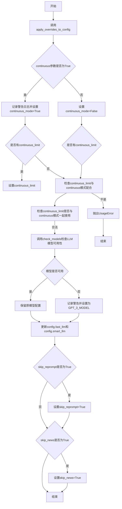
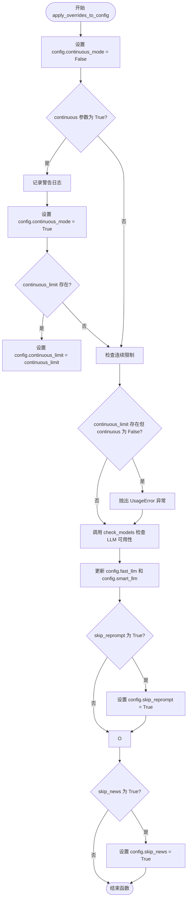
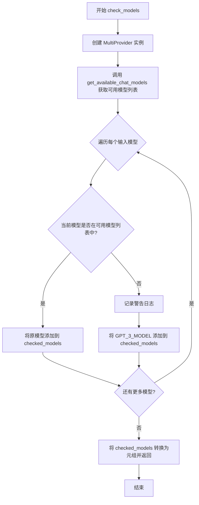

# `.\AutoGPT\classic\original_autogpt\autogpt\app\configurator.py` 详细设计文档

这是一个配置管理模块，负责接收命令行参数并更新应用配置(AppConfig)，同时具备模型可用性检查功能，当配置的LLM模型不可用时自动回退到GPT-3.5-turbo。

## 整体流程



## 类结构

```
模块: configurator (无类定义)
├── 全局函数
│   ├── apply_overrides_to_config
│   └── check_models
└── 导入依赖
```

## 全局变量及字段


### `logger`
    
模块级日志记录器

类型：`logging.Logger`
    


### `GPT_3_MODEL`
    
来自autogpt.app.config的GPT-3.5模型常量

类型：`str`
    


### `autogpt.app.config.AppConfig`
    
来自autogpt.app.config的应用配置类

类型：`Type`
    


### `forge.llm.providers.ModelName`
    
来自forge.llm.providers的模型名称类型

类型：`Type`
    


### `forge.llm.providers.MultiProvider`
    
来自forge.llm.providers的多提供商类

类型：`Type`
    
    

## 全局函数及方法


### `apply_overrides_to_config`

该异步函数接收命令行参数（如连续模式、跳过重新提示、跳过新闻等），并根据这些参数更新 `AppConfig` 对象的相应属性，同时检查可用的大语言模型并回退到备用模型。

参数：

- `config`：`AppConfig`，需要更新的配置对象
- `continuous`：`bool`，是否以连续模式运行（默认为 False）
- `continuous_limit`：`Optional[int]`，连续模式下的运行次数限制（默认为 None）
- `skip_reprompt`：`bool`，是否跳过启动时的重新提示消息（默认为 False）
- `skip_news`：`bool`，是否跳过启动时的最新消息输出（默认为 False）

返回值：`None`，该函数不返回任何值，仅修改传入的 `config` 对象

#### 流程图



#### 带注释源码

```python
async def apply_overrides_to_config(
    config: AppConfig,
    continuous: bool = False,
    continuous_limit: Optional[int] = None,
    skip_reprompt: bool = False,
    skip_news: bool = False,
) -> None:
    """Updates the config object with the given arguments.

    Args:
        config (Config): The config object to update.
        continuous (bool): Whether to run in continuous mode.
        continuous_limit (int): The number of times to run in continuous mode.
        skip_reprompt (bool): Whether to skip the re-prompting messages on start.
        skip_news (bool): Whether to suppress the output of latest news on startup.
    """
    # 默认关闭连续模式
    config.continuous_mode = False

    # 如果用户启用了连续模式，记录警告并更新配置
    if continuous:
        logger.warning(
            "Continuous mode is not recommended. It is potentially dangerous and may"
            " cause your AI to run forever or carry out actions you would not usually"
            " authorise. Use at your own risk.",
        )
        # 启用连续模式
        config.continuous_mode = True

        # 如果提供了连续模式限制，则设置该限制
        if continuous_limit:
            config.continuous_limit = continuous_limit

    # 验证逻辑：continuous_limit 只能与 continuous 模式一起使用
    # 如果单独使用 continuous_limit 而没有启用 continuous 模式，抛出错误
    if continuous_limit and not continuous:
        raise click.UsageError("--continuous-limit can only be used with --continuous")

    # 检查配置的 LLM 是否可用，如果不可用则回退到 GPT-3.5 模型
    # 更新 config 中的 fast_llm 和 smart_llm
    config.fast_llm, config.smart_llm = await check_models(
        (config.fast_llm, "fast_llm"), (config.smart_llm, "smart_llm")
    )

    # 如果用户指定跳过重新提示，则更新配置
    if skip_reprompt:
        config.skip_reprompt = True

    # 如果用户指定跳过新闻输出，则更新配置
    if skip_news:
        config.skip_news = True
```


### `check_models`

检查配置的LLM模型是否可用，如果配置的模型不可用，则自动回退到默认的GPT-3.5-turbo模型，并记录警告日志。

参数：

- `*models`：`tuple[ModelName, Literal["smart_llm", "fast_llm"]]`，可变参数，每个元素是一个包含模型名称和模型类型（"smart_llm"或"fast_llm"）的元组

返回值：`tuple[ModelName, ...]`，返回检查后的模型名称元组，每个元素对应输入的模型，如果原模型不可用则返回GPT-3.5-turbo

#### 流程图



#### 带注释源码

```python
async def check_models(
    *models: tuple[ModelName, Literal["smart_llm", "fast_llm"]]
) -> tuple[ModelName, ...]:
    """Check if model is available for use. If not, return gpt-3.5-turbo."""
    # 创建多提供商实例，用于获取可用的聊天模型
    multi_provider = MultiProvider()
    # 异步获取当前可用的聊天模型列表
    available_models = await multi_provider.get_available_chat_models()

    # 用于存储检查后的模型列表
    checked_models: list[ModelName] = []
    # 遍历每个需要检查的模型
    for model, model_type in models:
        # 检查当前模型是否在可用模型列表中
        if any(model == m.name for m in available_models):
            # 如果模型可用，直接添加到结果列表
            checked_models.append(model)
        else:
            # 模型不可用，记录警告日志
            logger.warning(
                f"You don't have access to {model}. "
                f"Setting {model_type} to {GPT_3_MODEL}."
            )
            # 将默认的 GPT-3.5-turbo 模型添加到结果列表
            checked_models.append(GPT_3_MODEL)

    # 将列表转换为元组并返回
    return tuple(checked_models)
```

## 关键组件


### 配置覆盖模块 (Configurator Module)

该模块负责管理系统配置更新和语言模型可用性检查，提供配置参数覆盖功能和LLM模型可用性回退机制。

### apply_overrides_to_config 配置覆盖函数

异步函数，用于根据命令行参数更新应用配置对象，包括连续模式设置、跳过提示、跳过新闻等功能，同时验证参数合法性并检查LLM模型可用性。

### check_models 模型可用性检查函数

异步函数，用于验证配置的LLM模型是否可用，若不可用则自动回退到GPT-3.5-turbo模型，确保系统持续可用。

### AppConfig 配置对象

从autogpt.app.config导入的应用配置类，存储应用运行时配置，包括连续模式、LLM模型选择等参数。

### ModelName 模型名称类型

从forge.llm.providers导入的模型名称枚举类型，用于标识不同的LLM模型。

### MultiProvider 多提供者类

从forge.llm.providers导入的多模型提供者类，用于获取可用的聊天模型列表。

### GPT_3_MODEL 默认模型常量

从autogpt.app.config导入的GPT-3.5-turbo模型常量，作为模型不可用时的回退选项。


## 问题及建议


### 已知问题

-   **文档字符串与函数签名不匹配**: `apply_overrides_to_config` 函数的文档字符串中提到了 `speak`, `debug`, `log_level`, `log_format`, `log_file_format`, `skips_news` 参数，但这些参数在函数签名中并不存在，导致文档误导。
-   **MultiProvider 实例未被复用**: `check_models` 函数每次调用都会创建新的 `MultiProvider()` 实例，可能导致资源浪费和性能问题。
-   **缺少错误处理**: `check_models` 函数调用 `multi_provider.get_available_chat_models()` 时没有 try-except 异常处理，如果 API 调用失败会导致未处理的异常。
-   **硬编码的后备模型**: `GPT_3_MODEL` 被硬编码为默认值，缺乏灵活性，应考虑从配置或环境变量获取。
-   **参数验证不足**: `continuous_limit` 参数没有验证是否为正整数，负数或零值可能导致意外行为。
-   **日志记录方式不够规范**: 使用了 f-string 直接拼接日志消息，未利用 logging 模块的结构化日志功能，影响日志可读性和可搜索性。

### 优化建议

-   **更新文档字符串**: 移除文档字符串中不存在的参数描述，保持文档与实现一致。
-   **复用 MultiProvider 实例**: 考虑将 `MultiProvider` 作为参数传入或使用单例模式，避免重复实例化。
-   **添加错误处理**: 为 `get_available_chat_models()` 调用添加 try-except 块，捕获可能的网络错误或 API 异常。
-   **外部化配置**: 将 `GPT_3_MODEL` 后备模型配置化，支持通过环境变量或配置文件设置。
-   **增强参数验证**: 使用 `click` 的验证器或添加手动检查，确保 `continuous_limit` 为正整数。
-   **改进日志记录**: 使用 logging 模块的格式化功能，如 `logger.warning("You don't have access to %s.", model)`，或使用结构化日志。

## 其它


### 设计目标与约束

本模块的设计目标是提供一个配置管理模块，用于在应用启动时根据命令行参数动态更新应用配置。约束包括：1) 连续模式（continuous mode）存在潜在危险性，需要警告用户；2) continuous_limit参数必须与continuous模式一起使用；3) 模型检查需要异步调用外部LLM提供商服务。

### 错误处理与异常设计

模块中定义了两类错误处理机制：1) 使用`click.UsageError`处理参数使用错误，当`--continuous-limit`参数在非连续模式下使用时抛出；2) 使用`logger.warning`记录警告信息，包括连续模式的风险提示和模型不可用时的降级处理。异常设计遵循渐进式增强原则，允许配置降级而非直接失败。

### 数据流与状态机

数据流主要分为两条路径：1) 配置覆盖流程：外部传入AppConfig对象和CLI参数，通过`apply_overrides_to_config`函数更新config对象的各个属性（continuous_mode、continuous_limit、skip_reprompt、skip_news）；2) 模型检查流程：调用`check_models`函数，通过MultiProvider获取可用模型列表，将不可用的模型降级为GPT_3_MODEL，最终返回检查后的模型元组。状态转换主要体现在config对象的属性变化，无复杂状态机设计。

### 外部依赖与接口契约

模块依赖以下外部组件：1) `click`库 - 用于抛出UsageError异常；2) `forge.llm.providers`模块中的`ModelName`枚举和`MultiProvider`类 - 用于模型名称类型定义和可用模型查询；3) `autogpt.app.config`模块中的`GPT_3_MODEL`常量和`AppConfig`类 - 用于默认模型配置和应用配置对象。接口契约方面：`apply_overrides_to_config`接受可变数量的可选参数，返回None；`check_models`接受可变数量的模型元组，返回ModelName元组。

### 潜在的技术债务或优化空间

1. **配置验证逻辑分散**：配置验证逻辑（如continuous_limit与continuous的依赖关系）散落在函数内部，可考虑引入配置验证器类；2. **模型检查的重复实例化**：每次调用`check_models`都创建新的`MultiProvider`实例，建议在模块级别或应用级别复用；3. **硬编码的降级模型**：`GPT_3_MODEL`直接硬编码，可考虑从配置文件读取或提供配置选项；4. **缺少单元测试**：该模块未展示测试代码，应补充针对参数验证、模型降级逻辑的单元测试；5. **日志级别管理**：虽然接收了log_level等参数，但实际未在函数中处理，可扩展配置覆盖范围。

### 关键组件信息

1. **AppConfig对象** - 应用配置容器，存储连续模式、模型配置、跳过选项等运行时参数
2. **MultiProvider** - LLM多提供商管理类，用于查询可用模型列表
3. **ModelName** - 模型名称枚举类型，定义支持的LLM模型标识
4. **GPT_3_MODEL** - 默认降级模型常量，定义当指定模型不可用时的备选模型

### 全局变量信息

| 名称 | 类型 | 描述 |
|------|------|------|
| logger | logging.Logger | 模块级日志记录器，用于输出警告和信息日志 |

### 类信息

本模块为纯函数模块，未定义类。所有功能通过模块级函数实现。

### 全局函数信息

#### apply_overrides_to_config

| 项目 | 内容 |
|------|------|
| 函数名 | apply_overrides_to_config |
| 参数 | config: AppConfig, continuous: bool = False, continuous_limit: Optional[int] = None, skip_reprompt: bool = False, skip_news: bool = False |
| 参数类型 | AppConfig, bool, Optional[int], bool, bool |
| 参数描述 | config为应用配置对象，continuous控制连续模式，continuous_limit限制连续模式执行次数，skip_reprompt控制是否跳过重新提示，skip_news控制是否跳过新闻显示 |
| 返回值类型 | None |
| 返回值描述 | 无返回值，直接修改传入的config对象 |
| 流程图 | ```mermaid\nflowchart TD\n    A[开始] --> B{continuous参数为True?}\n    B -->|是| C[记录警告日志]\n    C --> D[设置config.continuous_mode = True]\n    D --> E{continuous_limit存在?}\n    E -->|是| F[设置config.continuous_limit]\n    B -->|否| G{continuous_limit存在?}\n    G -->|是| H[抛出UsageError]\n    G -->|否| I[跳过模型检查]\n    E -->|否| I\n    I --> J[调用check_models检查模型]\n    J --> K{skip_reprompt为True?}\n    K -->|是| L[设置config.skip_reprompt = True]\n    K -->|否| M{skip_news为True?}\n    M -->|是| N[设置config.skip_news = True]\n    M -->|否| O[结束]\n    L --> M\n    F --> J\n    H --> O\n``` |
| 源码 | ```python\nasync def apply_overrides_to_config(\n    config: AppConfig,\n    continuous: bool = False,\n    continuous_limit: Optional[int] = None,\n    skip_reprompt: bool = False,\n    skip_news: bool = False,\n) -> None:\n    \"\"\"Updates the config object with the given arguments.\n\n    Args:\n        config (Config): The config object to update.\n        continuous (bool): Whether to run in continuous mode.\n        continuous_limit (int): The number of times to run in continuous mode.\n        skip_reprompt (bool): Whether to skip the re-prompting messages on start.\n        speak (bool): Whether to enable speak mode.\n        debug (bool): Whether to enable debug mode.\n        log_level (int): The global log level for the application.\n        log_format (str): The format for the log(s).\n        log_file_format (str): Override the format for the log file.\n        skips_news (bool): Whether to suppress the output of latest news on startup.\n    \"\"\"\n    config.continuous_mode = False\n\n    if continuous:\n        logger.warning(\n            \"Continuous mode is not recommended. It is potentially dangerous and may\"\n            \" cause your AI to run forever or carry out actions you would not usually\"\n            \" authorise. Use at your own risk.\",\n        )\n        config.continuous_mode = True\n\n        if continuous_limit:\n            config.continuous_limit = continuous_limit\n\n    # Check if continuous limit is used without continuous mode\n    if continuous_limit and not continuous:\n        raise click.UsageError(\"--continuous-limit can only be used with --continuous\")\n\n    # Check availability of configured LLMs; fallback to other LLM if unavailable\n    config.fast_llm, config.smart_llm = await check_models(\n        (config.fast_llm, \"fast_llm\"), (config.smart_llm, \"smart_llm\")\n    )\n\n    if skip_reprompt:\n        config.skip_reprompt = True\n\n    if skip_news:\n        config.skip_news = True\n``` |

#### check_models

| 项目 | 内容 |
|------|------|
| 函数名 | check_models |
| 参数 | *models: tuple[ModelName, Literal["smart_llm", "fast_llm"]] |
| 参数类型 | tuple[ModelName, Literal["smart_llm", "fast_llm"]]的可变参数 |
| 参数描述 | 可变数量的模型元组，每个元组包含ModelName和模型类型字符串("smart_llm"或"fast_llm") |
| 返回值类型 | tuple[ModelName, ...] |
| 返回值描述 | 返回检查后的模型名称元组，不可用模型会被替换为GPT_3_MODEL |
| 流程图 | ```mermaid\nflowchart TD\n    A[开始] --> B[创建MultiProvider实例]\n    B --> C[调用get_available_chat_models获取可用模型列表]\n    C --> D[初始化空列表checked_models]\n    D --> E{遍历models中的每个模型}\n    E --> F{模型在可用列表中?}\n    F -->|是| G[将原模型添加到checked_models]\n    F -->|否| H[记录警告日志]\n    H --> I[将GPT_3_MODEL添加到checked_models]\n    G --> J{还有更多模型?}\n    I --> J\n    J -->|是| E\n    J -->|否| K[返回checked_models元组]\n``` |
| 源码 | ```python\nasync def check_models(\n    *models: tuple[ModelName, Literal[\"smart_llm\", \"fast_llm\"]]\n) -> tuple[ModelName, ...]:\n    \"\"\"Check if model is available for use. If not, return gpt-3.5-turbo.\"\"\"\n    multi_provider = MultiProvider()\n    available_models = await multi_provider.get_available_chat_models()\n\n    checked_models: list[ModelName] = []\n    for model, model_type in models:\n        if any(model == m.name for m in available_models):\n            checked_models.append(model)\n        else:\n            logger.warning(\n                f\"You don't have access to {model}. \"\n                f\"Setting {model_type} to {GPT_3_MODEL}.\"\n            )\n            checked_models.append(GPT_3_MODEL)\n\n    return tuple(checked_models)\n``` |

### 整体运行流程

本模块作为AutoGPT应用的配置初始化模块，在应用启动时被调用。整体流程如下：1) 主程序解析命令行参数后，调用`apply_overrides_to_config`函数；2) 函数首先检查连续模式参数，若启用则记录警告并设置配置；3) 验证continuous_limit与continuous模式的配合使用，不合法则抛出异常；4) 调用`check_models`异步函数检查配置的LLM模型可用性，不可用则降级到GPT-3.5-turbo；5) 处理skip_reprompt和skip_news选项；6) 配置对象更新完成，返回主程序继续启动流程。

### 一段话描述

本模块（Configurator）是AutoGPT应用的核心配置管理模块，负责在应用启动时根据命令行参数动态更新应用配置对象，包括连续模式设置、模型可用性检查与降级处理、以及各类启动选项的开关控制，确保应用以用户指定的配置参数正常运行。


    