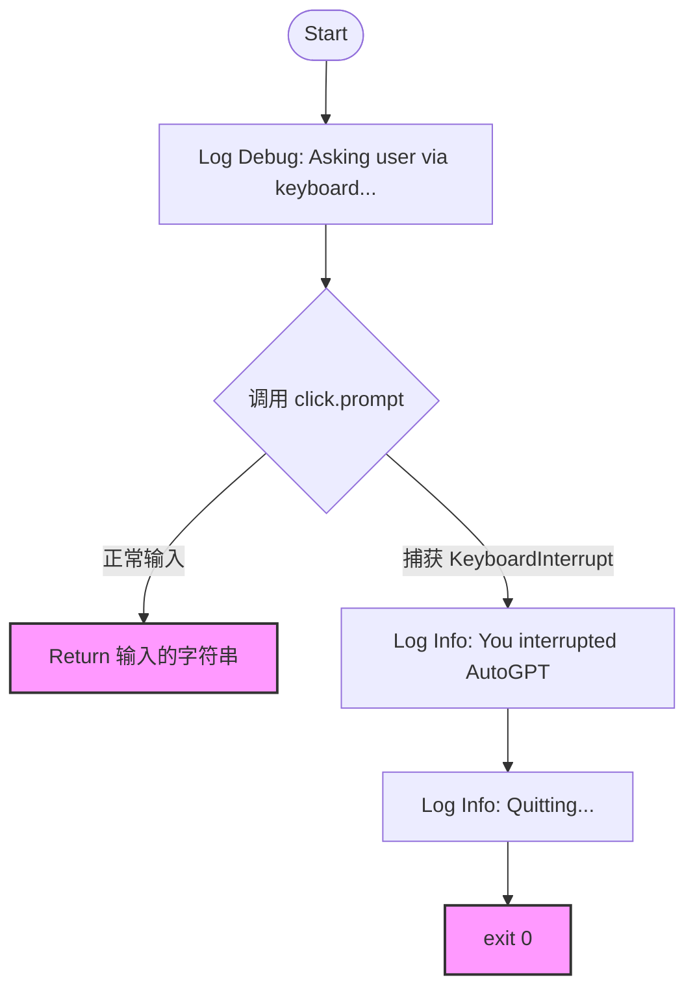

# `.\AutoGPT\classic\original_autogpt\autogpt\app\input.py` 详细设计文档

该代码实现了一个命令行交互模块，提供用户输入功能并处理键盘中断事件，使用 click 库获取用户输入，通过 logging 模块记录日志。

## 整体流程

```mermaid
graph TD
    A[开始] --> B{是否捕获KeyboardInterrupt?}
    B -- 是 --> C[记录日志并退出程序]
    B -- 否 --> D[调用click.prompt获取用户输入]
    D --> E[返回用户输入内容]
    C --> F[exit(0)]
```

## 类结构

```
无类层次结构，仅包含模块级函数
```

## 全局变量及字段


### `logger`
    
模块级日志记录器，用于记录调试和信息日志

类型：`logging.Logger`
    


    

## 全局函数及方法


### `clean_input`

该函数用于在命令行环境中通过 `click` 库提示用户输入内容，并处理用户强制退出（Ctrl+C）的场景，确保程序优雅退出。

参数：
- `prompt`：`str`，显示在输入提示符前的文本内容。

返回值：`str`，返回用户键入的字符串内容；若用户直接按下回车键，则返回空字符串。

#### 流程图



#### 带注释源码

```python
def clean_input(prompt: str = ""):
    """
    获取用户通过命令行界面的输入。
    
    参数:
        prompt (str): 显示给用户的提示文本，默认为空字符串。
    
    返回:
        str: 用户输入的内容。如果用户直接回车，返回空字符串。
    """
    try:
        # 记录调试日志，表示程序正在等待用户通过键盘输入
        logger.debug("Asking user via keyboard...")

        # 使用 click 库提供的 prompt 函数获取输入
        # prompt_suffix=" ": 在提示符后加空格
        # default="": 如果用户直接按回车，返回空字符串而不是报错
        # show_default=False: 不显示默认值提示
        return click.prompt(
            text=prompt, prompt_suffix=" ", default="", show_default=False
        )
    except KeyboardInterrupt:
        # 捕获 Ctrl+C 中断
        logger.info("You interrupted AutoGPT")
        logger.info("Quitting...")
        # 正常退出程序
        exit(0)
```

## 关键组件


### 日志记录器 (logger)

用于记录调试信息和用户操作的日志实例，通过 Python 标准库的 logging 模块创建，便于跟踪程序执行状态和异常情况。

### 用户输入函数 (clean_input)

处理交互式命令行输入的核心函数，提供用户友好的输入提示，支持默认值，当用户中断输入（Ctrl+C）时优雅退出程序。

### Click 库集成

使用 click 库的 prompt 功能实现交互式命令行界面，支持默认输入、提示符自定义等特性。

### 异常处理机制

针对键盘中断（KeyboardInterrupt）提供专门的异常处理逻辑，确保程序在用户取消操作时能够安全退出并记录相关日志。


## 问题及建议


### 已知问题

-   **异常处理不全面**：只捕获了 `KeyboardInterrupt`，未处理 `EOFError`（当输入流关闭时触发）等其他可能的异常
-   **函数命名不准确**：`clean_input` 名称暗示会"清理"输入，但实际仅获取用户输入，未进行任何验证或处理
-   **退出方式不优雅**：使用 `exit(0)` 立即退出程序，不是抛出异常或返回特定值让调用者决定如何处理
-   **缺少输入验证**：没有对用户输入进行任何格式验证或清理，可能导致后续处理问题
-   **日志级别不一致**：使用 `logger.debug` 记录正常流程，`logger.info` 记录中断，缺少 `warning` 级别
-   **缺乏文档注释**：函数没有文档字符串，调用者难以理解其行为和返回值含义

### 优化建议

-   添加文档字符串说明函数用途、参数和返回值
-   考虑捕获更广泛的异常（如 `click.Abort`、`EOFError`），并提供统一的错误处理机制
-   考虑返回 `None` 或特定值而非直接调用 `exit()`，让调用者决定如何处理中断
-   添加输入验证逻辑（如长度限制、字符过滤等）以真正实现"clean"的功能
-   统一日志级别使用，建议将中断信息改为 `logger.warning`
-   考虑添加超时机制，避免无限等待用户输入
-   考虑添加输入重试机制，当输入为空时可以提示用户重新输入


## 其它


### 设计目标与约束

本模块的设计目标是提供一个统一的命令行用户输入交互接口，抽象底层输入细节，简化主程序对用户交互逻辑的处理。约束包括：仅支持同步阻塞式输入，不支持GUI或Web界面；依赖click库作为输入框架；必须在命令行环境中运行。

### 错误处理与异常设计

本模块主要处理两类异常：KeyboardInterrupt（用户主动中断）和click库内部的输入验证异常。对于KeyboardInterrupt，捕获后记录INFO级别日志，输出"Quitting..."后以状态码0正常退出。输入验证异常默认由click.prompt向上传播，调用方负责捕获处理。未捕获的Exception将导致程序以非零状态码异常退出。

### 外部依赖与接口契约

本模块依赖两个外部库：logging（Python标准库）和click（第三方库）。接口契约方面，clean_input函数接受一个字符串类型的prompt参数，返回用户输入的字符串（可能为空字符串）；当用户按下Ctrl+C时，函数不返回，直接调用exit(0)终止进程。

### 配置信息

本模块无独立配置文件，依赖父模块的logging配置。logger通过logging.getLogger(__name__)创建，名称为"clean_input"。日志级别、格式和输出目标由主程序或根logger配置决定。

### 安全性考虑

输入安全：直接返回用户输入的原始字符串，未进行特殊字符转义或命令注入过滤。建议调用方根据实际用途自行处理输入验证和清洗。日志安全：logger.debug和logger.info输出的内容不包含敏感信息。

### 性能要求

本模块为轻量级IO操作，无复杂计算。性能瓶颈在于用户输入速度，平均响应时间取决于人工输入延迟。超时控制由click库默认行为决定。

### 兼容性要求

Python版本：依赖click库，click 8.x版本要求Python 3.7+。操作系统：支持所有运行click库的操作系统（Windows、Linux、macOS）。终端兼容性：依赖终端的标准输入支持。

### 日志规范

本模块使用Python标准logging模块。DEBUG级别记录" Asking user via keyboard..."，仅在需要调试输入流程时输出。INFO级别记录用户中断时的提示信息。

### 测试策略建议

单元测试：Mock click.prompt函数，验证不同输入场景的返回行为；Mock KeyboardInterrupt，验证异常处理逻辑。集成测试：在真实命令行环境中验证用户输入流程。

### 代码质量指标

当前代码行数约15行，函数单一职责明确，无重复代码。clean_input函数长度在合理范围内，注释清晰。建议添加类型注解的完整支持（目前仅prompt参数有注解）。

### 版本历史与变更记录

当前版本为初始版本，无变更记录。


    