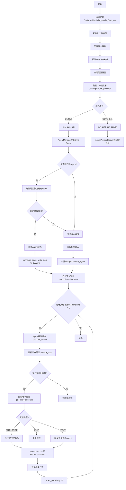
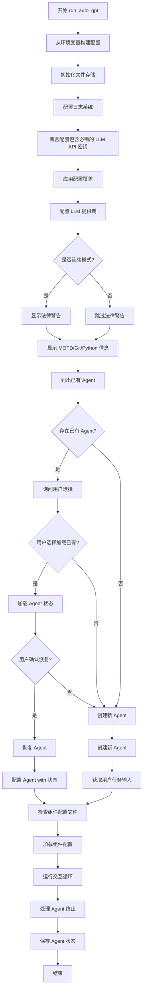
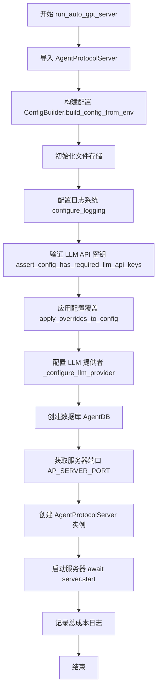
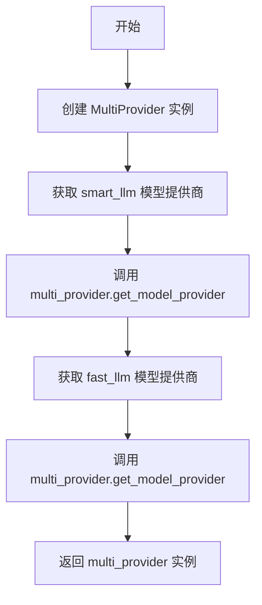
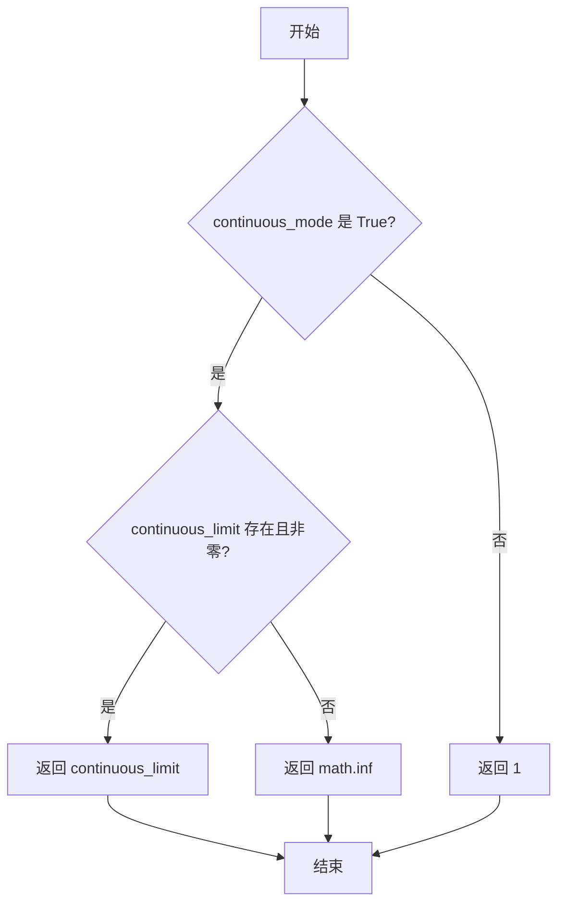
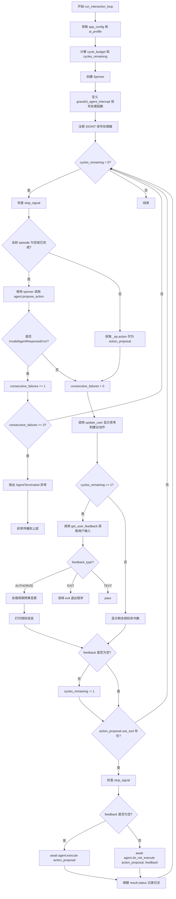
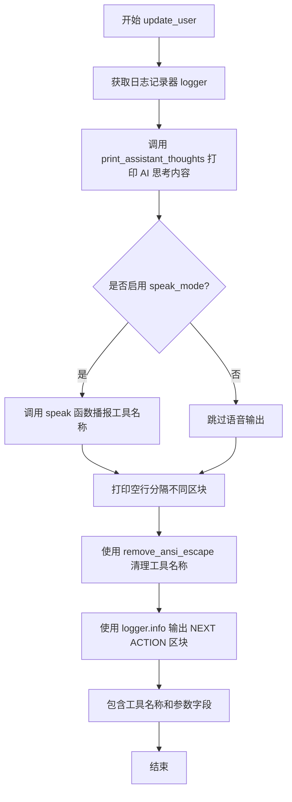
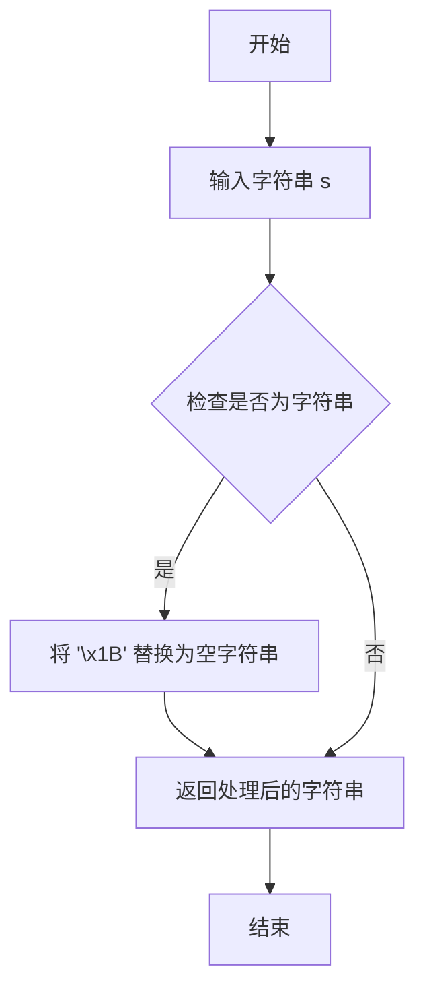

# `.\AutoGPT\classic\original_autogpt\autogpt\app\main.py` 详细设计文档

AutoGPT应用的主入口点，提供交互式命令行界面和服务器模式两种运行方式，负责配置初始化、Agent创建与恢复、主交互循环执行、用户反馈处理以及命令执行的核心逻辑。

## 整体流程



## 类结构

```
UserFeedback (枚举类)
├── AUTHORIZE = 'GENERATE NEXT COMMAND JSON'
├── EXIT = 'EXIT'
└── TEXT = 'TEXT'
```

## 全局变量及字段


### `continuous`
    
Flag to enable continuous mode for agent execution

类型：`bool`
    


### `continuous_limit`
    
Limit for continuous mode execution cycles

类型：`Optional[int]`
    


### `skip_reprompt`
    
Flag to skip reprompting for user input

类型：`bool`
    


### `speak`
    
Flag to enable text-to-speech output

类型：`bool`
    


### `debug`
    
Flag to enable debug logging

类型：`bool`
    


### `log_level`
    
Logging level configuration

类型：`Optional[str]`
    


### `log_format`
    
Log message format specification

类型：`Optional[str]`
    


### `log_file_format`
    
Log file format specification

类型：`Optional[str]`
    


### `skip_news`
    
Flag to skip printing news/motd information

类型：`bool`
    


### `install_plugin_deps`
    
Flag to install plugin dependencies

类型：`bool`
    


### `override_ai_name`
    
Override the AI agent name

类型：`Optional[str]`
    


### `override_ai_role`
    
Override the AI agent role/description

类型：`Optional[str]`
    


### `resources`
    
List of resources for the AI agent

类型：`Optional[list[str]]`
    


### `constraints`
    
List of constraints for the AI agent

类型：`Optional[list[str]]`
    


### `best_practices`
    
List of best practices for the AI agent

类型：`Optional[list[str]]`
    


### `override_directives`
    
Flag to override AI directives

类型：`bool`
    


### `component_config_file`
    
Path to component configuration file

类型：`Optional[Path]`
    


### `config`
    
Application configuration object

类型：`AppConfig`
    


### `local`
    
Flag indicating if local file storage is used

类型：`bool`
    


### `restrict_to_root`
    
Flag to restrict file operations to root directory

类型：`bool`
    


### `file_storage`
    
File storage backend instance

类型：`FileStorage`
    


### `llm_provider`
    
LLM provider for model access

类型：`MultiProvider`
    


### `logger`
    
Logger instance for the module

类型：`logging.Logger`
    


### `agent_manager`
    
Manager for handling multiple agents

类型：`AgentManager`
    


### `existing_agents`
    
List of existing agent IDs

类型：`list`
    


### `load_existing_agent`
    
ID of agent to load for continuation

类型：`str`
    


### `agent`
    
Current active agent instance

类型：`Agent`
    


### `agent_state`
    
State of the agent to restore or create

类型：`Optional[AgentState]`
    


### `task`
    
Task description for new agent

类型：`str`
    


### `ai_profile`
    
AI personality and configuration profile

类型：`AIProfile`
    


### `additional_ai_directives`
    
Additional directives for AI behavior

类型：`AIDirectives`
    


### `file_manager`
    
Manager for agent file operations

类型：`FileManager`
    


### `cycle_budget`
    
Maximum cycles allowed without user interaction

类型：`int | float`
    


### `cycles_remaining`
    
Remaining cycles before user check-in

类型：`int | float`
    


### `spinner`
    
Loading spinner for thinking state

类型：`Spinner`
    


### `stop_reason`
    
Reason for stopping the agent

类型：`Optional[Exception]`
    


### `consecutive_failures`
    
Count of consecutive agent failures

类型：`int`
    


### `action_proposal`
    
Proposed action from the agent

类型：`ActionProposal`
    


### `feedback_type`
    
Type of user feedback received

类型：`UserFeedback`
    


### `feedback`
    
User feedback text content

类型：`str`
    


### `new_cycles_remaining`
    
Updated cycle count from user

类型：`Optional[int]`
    


### `result`
    
Result of executed action

类型：`ActionResult`
    


### `database`
    
Database for agent protocol server

类型：`AgentDB`
    


### `port`
    
Server port number

类型：`int`
    


### `server`
    
Agent protocol server instance

类型：`AgentProtocolServer`
    


### `multi_provider`
    
Multi-model LLM provider

类型：`MultiProvider`
    


### `model`
    
Model name for LLM provider configuration

类型：`str`
    


### `current_episode`
    
Current event episode in agent history

类型：`Optional[Episode]`
    


### `finish_reason`
    
Reason for agent finish command

类型：`str`
    


### `new_assignment`
    
New task from user after agent finish

类型：`str`
    


### `thoughts_text`
    
Processed thoughts text for display

类型：`str`
    


### `safe_tool_name`
    
Tool name with ANSI escape codes removed

类型：`str`
    


### `user_feedback`
    
Parsed user feedback type

类型：`Optional[UserFeedback]`
    


### `user_input`
    
Raw user input text

类型：`str`
    


### `console_input`
    
Input from console

类型：`str`
    


### `assistant_thoughts_plan`
    
Plan from assistant thoughts

类型：`str`
    


### `assistant_thoughts_speak`
    
Speech text from assistant thoughts

类型：`str`
    


### `line`
    
Individual line from plan output

类型：`str`
    


### `lines`
    
Lines from plan splitting

类型：`list`
    


### `restart_spinner`
    
Flag to restart spinner after interrupt

类型：`bool`
    


### `save_as_id`
    
Alternative agent ID for saving state

类型：`str`
    


### `agent_id`
    
Current agent identifier

类型：`str`
    


### `answer`
    
User answer for resume prompt

类型：`str`
    


### `UserFeedback.AUTHORIZE`
    
Authorization to execute next command

类型：`str`
    


### `UserFeedback.EXIT`
    
Exit the program

类型：`str`
    


### `UserFeedback.TEXT`
    
Text feedback for the agent

类型：`str`
    
    

## 全局函数及方法


### `run_auto_gpt`

这是 AutoGPT 应用程序的主入口点，负责初始化配置、设置文件存储、配置日志和 LLM 提供商、管理Agent的创建或恢复、加载组件配置，并启动交互循环。

参数：

- `continuous`：`bool`，是否启用连续模式（无需用户授权即可执行多个命令）
- `continuous_limit`：`Optional[int]`，连续模式下允许的最大命令执行次数
- `skip_reprompt`：`bool`，是否跳过重新提示用户
- `speak`：`bool`，是否启用语音输出模式
- `debug`：`bool`，是否启用调试模式
- `log_level`：`Optional[str]`，日志级别
- `log_format`：`Optional[str]`，日志格式
- `log_file_format`：`Optional[str]`，日志文件格式
- `skip_news`：`bool`，是否跳过显示新闻/更新信息
- `install_plugin_deps`：`bool`，是否安装插件依赖
- `override_ai_name`：`Optional[str]`，覆盖默认的 AI 名称
- `override_ai_role`：`Optional[str]`，覆盖默认的 AI 角色描述
- `resources`：`Optional[list[str]]`，AI 可用的资源列表
- `constraints`：`Optional[list[str]]`，AI 的约束条件列表
- `best_practices`：`Optional[list[str]]`，AI 应遵循的最佳实践列表
- `override_directives`：`bool`，是否覆盖现有指令
- `component_config_file`：`Optional[Path]`，组件配置文件路径

返回值：`None`，该函数通过启动交互循环来运行应用程序，不返回任何值

#### 流程图



#### 带注释源码

```python
@coroutine
async def run_auto_gpt(
    continuous: bool = False,              # 是否启用连续模式（无需用户授权连续执行）
    continuous_limit: Optional[int] = None, # 连续模式下的命令次数限制
    skip_reprompt: bool = False,            # 是否跳过重新提示
    speak: bool = False,                    # 是否启用语音模式
    debug: bool = False,                    # 是否启用调试模式
    log_level: Optional[str] = None,        # 日志级别
    log_format: Optional[str] = None,       # 日志格式
    log_file_format: Optional[str] = None, # 日志文件格式
    skip_news: bool = False,                # 是否跳过新闻显示
    install_plugin_deps: bool = False,      # 是否安装插件依赖
    override_ai_name: Optional[str] = None, # 覆盖 AI 名称
    override_ai_role: Optional[str] = None, # 覆盖 AI 角色
    resources: Optional[list[str]] = None, # AI 可用资源
    constraints: Optional[list[str]] = None, # AI 约束条件
    best_practices: Optional[list[str]] = None, # 最佳实践
    override_directives: bool = False,      # 是否覆盖指令
    component_config_file: Optional[Path] = None, # 组件配置文件
):
    # ========== 步骤1: 构建配置 ==========
    # 从环境变量构建应用程序配置
    config = ConfigBuilder.build_config_from_env()
    
    # ========== 步骤2: 初始化文件存储 ==========
    # 根据配置选择本地或远程存储后端
    local = config.file_storage_backend == FileStorageBackendName.LOCAL
    # 确定是否限制在根目录
    restrict_to_root = not local or config.restrict_to_workspace
    # 获取存储实例
    file_storage = get_storage(
        config.file_storage_backend,
        root_path=Path("data"),
        restrict_to_root=restrict_to_root,
    )
    # 初始化存储（创建必要的目录结构）
    file_storage.initialize()

    # ========== 步骤3: 配置日志系统 ==========
    # 如果启用语音模式，设置 TTS 配置
    if speak:
        config.tts_config.speak_mode = True
    # 配置日志模块
    configure_logging(
        debug=debug,
        level=log_level,
        log_format=log_format,
        log_file_format=log_file_format,
        config=config.logging,
        tts_config=config.tts_config,
    )

    # ========== 步骤4: 验证 LLM API 密钥 ==========
    # 确保配置中包含必需的 LLM API 密钥
    await assert_config_has_required_llm_api_keys(config)

    # ========== 步骤5: 应用配置覆盖 ==========
    # 应用命令行参数覆盖默认配置
    await apply_overrides_to_config(
        config=config,
        continuous=continuous,
        continuous_limit=continuous_limit,
        skip_reprompt=skip_reprompt,
        skip_news=skip_news,
    )

    # ========== 步骤6: 配置 LLM 提供商 ==========
    # 创建并配置 LLM 提供商实例
    llm_provider = _configure_llm_provider(config)

    # 获取模块日志器
    logger = logging.getLogger(__name__)

    # ========== 步骤7: 显示法律警告 ==========
    # 如果启用连续模式，显示法律警告
    if config.continuous_mode:
        for line in get_legal_warning().split("\n"):
            logger.warning(
                extra={
                    "title": "LEGAL:",
                    "title_color": Fore.RED,
                    "preserve_color": True,
                },
                msg=markdown_to_ansi_style(line),
            )

    # ========== 步骤8: 显示系统信息 ==========
    # 显示欢迎信息、Git 信息、Python 版本等
    if not config.skip_news:
        print_motd(logger)
        print_git_branch_info(logger)
        print_python_version_info(logger)
        print_attribute("Smart LLM", config.smart_llm)
        print_attribute("Fast LLM", config.fast_llm)
        if config.continuous_mode:
            print_attribute("Continuous Mode", "ENABLED", title_color=Fore.YELLOW)
            if continuous_limit:
                print_attribute("Continuous Limit", config.continuous_limit)
        if config.tts_config.speak_mode:
            print_attribute("Speak Mode", "ENABLED")
        if we_are_running_in_a_docker_container() or is_docker_available():
            print_attribute("Code Execution", "ENABLED")
        else:
            print_attribute(
                "Code Execution",
                "DISABLED (Docker unavailable)",
                title_color=Fore.YELLOW,
            )

    # ========== 步骤9: 管理已有 Agent ==========
    # 创建 Agent 管理器并列出已有 Agent
    agent_manager = AgentManager(file_storage)
    existing_agents = agent_manager.list_agents()
    load_existing_agent = ""
    
    # 如果存在已有 Agent，提示用户选择
    if existing_agents:
        print(
            "Existing agents\n---------------\n"
            + "\n".join(f"{i} - {id}" for i, id in enumerate(existing_agents, 1))
        )
        load_existing_agent = clean_input(
            "Enter the number or name of the agent to run,"
            " or hit enter to create a new one:",
        )
        # 处理数字输入
        if re.match(r"^\d+$", load_existing_agent.strip()) and 0 < int(
            load_existing_agent
        ) <= len(existing_agents):
            load_existing_agent = existing_agents[int(load_existing_agent) - 1]

        # 验证 Agent ID 是否有效
        if load_existing_agent != "" and load_existing_agent not in existing_agents:
            logger.info(
                f"Unknown agent '{load_existing_agent}', "
                f"creating a new one instead.",
                extra={"color": Fore.YELLOW},
            )
            load_existing_agent = ""

    # ========== 步骤10: 恢复或创建 Agent ==========
    agent = None
    agent_state = None

    # -------- 恢复已有 Agent --------
    if load_existing_agent:
        agent_state = None
        # 循环询问用户是否恢复
        while True:
            answer = clean_input("Resume? [Y/n]")
            if answer == "" or answer.lower() == "y":
                agent_state = agent_manager.load_agent_state(load_existing_agent)
                break
            elif answer.lower() == "n":
                break

    # 如果有 Agent 状态，加载并配置 Agent
    if agent_state:
        agent = configure_agent_with_state(
            state=agent_state,
            app_config=config,
            file_storage=file_storage,
            llm_provider=llm_provider,
        )
        # 应用 AI 设置覆盖
        apply_overrides_to_ai_settings(
            ai_profile=agent.state.ai_profile,
            directives=agent.state.directives,
            override_name=override_ai_name,
            override_role=override_ai_role,
            resources=resources,
            constraints=constraints,
            best_practices=best_practices,
            replace_directives=override_directives,
        )

        # 检查 Agent 是否之前已执行 finish 命令
        if (
            (current_episode := agent.event_history.current_episode)
            and current_episode.action.use_tool.name == FINISH_COMMAND
            and not current_episode.result
        ):
            # Agent 之前已自终止，获取终止原因并请求后续任务
            finish_reason = current_episode.action.use_tool.arguments["reason"]
            print(f"Agent previously self-terminated; reason: '{finish_reason}'")
            new_assignment = clean_input(
                "Please give a follow-up question or assignment:"
            )
            agent.event_history.register_result(
                ActionInterruptedByHuman(feedback=new_assignment)
            )

        # 如果没有通过 CLI 指定配置，允许用户交互式修改
        if not any(
            [
                override_ai_name,
                override_ai_role,
                resources,
                constraints,
                best_practices,
            ]
        ):
            ai_profile, ai_directives = await interactively_revise_ai_settings(
                ai_profile=agent.state.ai_profile,
                directives=agent.state.directives,
                app_config=config,
            )
        else:
            logger.info("AI config overrides specified through CLI; skipping revision")

    # -------- 创建新 Agent --------
    if not agent:
        # 获取用户任务输入
        task = ""
        while task.strip() == "":
            task = clean_input(
                "Enter the task that you want AutoGPT to execute,"
                " with as much detail as possible:",
            )

        # 初始化 AI 配置
        ai_profile = AIProfile()
        additional_ai_directives = AIDirectives()
        
        # 应用覆盖设置
        apply_overrides_to_ai_settings(
            ai_profile=ai_profile,
            directives=additional_ai_directives,
            override_name=override_ai_name,
            override_role=override_ai_role,
            resources=resources,
            constraints=constraints,
            best_practices=best_practices,
            replace_directives=override_directives,
        )

        # 允许用户交互式修改 AI 配置
        if not any(
            [
                override_ai_name,
                override_ai_role,
                resources,
                constraints,
                best_practices,
            ]
        ):
            (
                ai_profile,
                additional_ai_directives,
            ) = await interactively_revise_ai_settings(
                ai_profile=ai_profile,
                directives=additional_ai_directives,
                app_config=config,
            )
        else:
            logger.info("AI config overrides specified through CLI; skipping revision")

        # 创建新 Agent 实例
        agent = create_agent(
            agent_id=agent_manager.generate_id(ai_profile.ai_name),
            task=task,
            ai_profile=ai_profile,
            directives=additional_ai_directives,
            app_config=config,
            file_storage=file_storage,
            llm_provider=llm_provider,
        )

        file_manager = agent.file_manager

        # 显示工作空间信息
        if file_manager and not agent.config.allow_fs_access:
            logger.info(
                f"{Fore.YELLOW}"
                "NOTE: All files/directories created by this agent can be found "
                f"inside its workspace at:{Fore.RESET} {file_manager.workspace.root}",
                extra={"preserve_color": True},
            )

    # ========== 步骤11: 加载组件配置 ==========
    if _config_file := component_config_file or config.component_config_file:
        try:
            logger.info(f"Loading component configuration from {_config_file}")
            agent.load_component_configs(_config_file.read_text())
        except Exception as e:
            logger.error(f"Could not load component configuration: {e}")

    # ========== 步骤12: 运行交互循环 ==========
    try:
        await run_interaction_loop(agent)
    except AgentTerminated:
        agent_id = agent.state.agent_id
        logger.info(f"Saving state of {agent_id}...")

        # 允许用户指定不同的保存 ID
        save_as_id = clean_input(
            f"Press enter to save as '{agent_id}',"
            " or enter a different ID to save to:",
        )
        # 保存 Agent 状态
        await agent.file_manager.save_state(
            save_as_id.strip() if not save_as_id.isspace() else None
        )
```


### `run_auto_gpt_server`

这是一个异步函数，作为 AutoGPT 服务器的入口点，用于启动基于 Agent Protocol 的服务器实例，处理客户端请求并管理 Agent 的生命周期。

参数：

- `debug`：`bool`，是否启用调试模式，默认为 False
- `log_level`：`Optional[str]`，日志级别，默认为 None
- `log_format`：`Optional[str]`，日志格式，默认为 None
- `log_file_format`：`Optional[str]`，日志文件格式，默认为 None
- `install_plugin_deps`：`bool`，是否安装插件依赖，默认为 False

返回值：`None`，无返回值

#### 流程图



#### 带注释源码

```python
@coroutine
async def run_auto_gpt_server(
    debug: bool = False,
    log_level: Optional[str] = None,
    log_format: Optional[str] = None,
    log_file_format: Optional[str] = None,
    install_plugin_deps: bool = False,
):
    """启动 AutoGPT 服务器实例的异步入口函数。
    
    该函数负责初始化所有必要的组件，包括配置、存储、日志、数据库
    和 LLM 提供者，然后启动 Agent Protocol 服务器来处理客户端请求。
    """
    # 动态导入 Agent Protocol Server，避免循环依赖
    from .agent_protocol_server import AgentProtocolServer

    # 从环境变量构建应用程序配置
    config = ConfigBuilder.build_config_from_env()
    
    #  Storage: 根据配置初始化文件存储后端
    # 判断是否为本地存储
    local = config.file_storage_backend == FileStorageBackendName.LOCAL
    # 确定是否限制在根目录
    restrict_to_root = not local or config.restrict_to_workspace
    # 获取文件存储实例
    file_storage = get_storage(
        config.file_storage_backend,
        root_path=Path("data"),
        restrict_to_root=restrict_to_root,
    )
    # 初始化存储后端
    file_storage.initialize()

    # Set up logging module: 配置日志系统
    configure_logging(
        debug=debug,
        level=log_level,
        log_format=log_format,
        log_file_format=log_file_format,
        config=config.logging,
        tts_config=config.tts_config,
    )

    # 验证配置中是否包含必需的 LLM API 密钥
    await assert_config_has_required_llm_api_keys(config)

    # 应用配置覆盖（如有）
    await apply_overrides_to_config(
        config=config,
    )

    # 配置 LLM 提供者（MultiProvider）
    llm_provider = _configure_llm_provider(config)

    # Set up & start server: 初始化数据库连接
    # 从环境变量获取数据库连接字符串，默认为 SQLite
    database = AgentDB(
        database_string=os.getenv("AP_SERVER_DB_URL", "sqlite:///data/ap_server.db"),
        debug_enabled=debug,
    )
    
    # 获取服务器端口，默认为 8000
    port: int = int(os.getenv("AP_SERVER_PORT", default=8000))
    
    # 创建 Agent Protocol Server 实例
    server = AgentProtocolServer(
        app_config=config,
        database=database,
        file_storage=file_storage,
        llm_provider=llm_provider,
    )
    
    # 启动服务器并监听指定端口
    await server.start(port=port)

    # 服务器关闭后，记录总的 OpenAI 会话成本
    logging.getLogger().info(
        f"Total OpenAI session cost: "
        f"${round(sum(b.total_cost for b in server._task_budgets.values()), 2)}"
    )
```


### `_configure_llm_provider`

该函数用于根据应用配置初始化并返回一个 MultiProvider 实例，确保配置的智能 LLM 和快速 LLM 的模型提供商可用。

参数：

- `config`：`AppConfig`，应用程序配置对象，包含 smart_llm 和 fast_llm 等模型配置

返回值：`MultiProvider`，返回配置好的多模型提供商实例

#### 流程图



#### 带注释源码

```python
def _configure_llm_provider(config: AppConfig) -> MultiProvider:
    """根据配置初始化 LLM 提供商。
    
    Args:
        config: 应用程序配置对象，包含 smart_llm 和 fast_llm 模型配置
        
    Returns:
        配置好的 MultiProvider 实例，可用于访问多个 LLM
    """
    # 创建多提供商实例，用于管理多个 LLM 提供商
    multi_provider = MultiProvider()
    
    # 遍历配置的模型列表（smart_llm 和 fast_llm）
    for model in [config.smart_llm, config.fast_llm]:
        # 确保配置的 LLM 的模型提供商可用
        # 如果提供商不存在或不可用，这里会抛出异常
        multi_provider.get_model_provider(model)
    
    # 返回配置好的多提供商实例
    return multi_provider
```


### `_get_cycle_budget`

该函数用于根据配置中的 `continuous_mode`（连续模式）和 `continuous_limit`（连续模式限制）计算周期预算（cycle_budget），即在需要与用户确认之前可以连续执行的最大周期数。

参数：

- `continuous_mode`：`bool`，表示是否启用连续模式。在连续模式下，代理可以自动执行多个周期而无需用户每次都确认授权。
- `continuous_limit`：`int`，连续模式下允许的最大连续执行周期数。如果为 `0` 或 `None`，则表示无限制。

返回值：`int | float`，返回周期预算（最大连续执行周期数）。当 `continuous_mode` 为 `False` 时返回 `1`；当 `continuous_mode` 为 `True` 且 `continuous_limit` 有有效值时返回该值，否则返回 `math.inf`（无穷大）。

#### 流程图



#### 带注释源码

```python
def _get_cycle_budget(continuous_mode: bool, continuous_limit: int) -> int | float:
    """
    根据连续模式配置计算周期预算。
    
    周期预算定义了代理在需要用户确认之前可以连续执行的最大周期数。
    这影响了 run_interaction_loop 中的循环控制逻辑。
    
    参数:
        continuous_mode: bool, 是否启用连续模式
        continuous_limit: int, 连续模式下的周期限制，0 或 None 表示无限制
    
    返回:
        int | float: 周期预算值
            - 非连续模式: 始终返回 1，每步都需要用户授权
            - 连续模式且有限制: 返回具体限制数值
            - 连续模式且无限制: 返回 math.inf
    """
    # 从 continuous_mode/continuous_limit 配置转换
    # 到 cycle_budget（最大无需与用户确认的运行周期数）
    if continuous_mode:
        # 连续模式下，如果设置了限制则使用限制值，否则使用无穷大
        cycle_budget = continuous_limit if continuous_limit else math.inf
    else:
        # 非连续模式，每次只运行一个周期，需要用户逐次授权
        cycle_budget = 1

    return cycle_budget
```


### `run_interaction_loop`

该函数是 AutoGPT 应用的核心交互循环，负责管理代理（Agent）的完整生命周期：接收代理的动作提议、向用户展示思考过程与建议动作、获取用户授权或反馈、执行动作并处理结果，同时支持通过信号处理实现优雅中断。

参数：

-  `agent`：`"Agent"`（字符串类型的前向引用），执行交互循环的代理实例

返回值：`None`，无返回值，通过副作用完成任务

#### 流程图



#### 带注释源码

```python
async def run_interaction_loop(
    agent: "Agent",
) -> None:
    """Run the main interaction loop for the agent.

    Args:
        agent: The agent to run the interaction loop for.

    Returns:
        None
    """
    # 从 agent 实例中获取应用配置和 AI 个人资料
    app_config = agent.app_config
    ai_profile = agent.state.ai_profile
    logger = logging.getLogger(__name__)

    # 根据连续模式配置计算周期预算（最大无需用户确认的执行次数）
    cycle_budget = cycles_remaining = _get_cycle_budget(
        app_config.continuous_mode, app_config.continuous_limit
    )
    
    # 创建思考中的微调器 spinner，用于在等待代理响应时显示动画
    spinner = Spinner(
        "Thinking...", plain_output=app_config.logging.plain_console_output
    )
    stop_reason = None  # 用于存储优雅中断的原因

    # 定义信号处理函数，用于响应 Ctrl+C 中断信号
    def graceful_agent_interrupt(signum: int, frame: Optional[FrameType]) -> None:
        """处理 SIGINT 信号，实现优雅关闭"""
        nonlocal cycle_budget, cycles_remaining, spinner, stop_reason
        if stop_reason:
            # 第二次按下 Ctrl+C，立即退出
            logger.error("Quitting immediately...")
            sys.exit()
        if cycles_remaining in [0, 1]:
            # 剩余周期很少，准备完全关闭
            logger.warning("Interrupt signal received: shutting down gracefully.")
            logger.warning(
                "Press Ctrl+C again if you want to stop AutoGPT immediately."
            )
            stop_reason = AgentTerminated("Interrupt signal received")
        else:
            # 中断连续执行模式，进入单步模式
            restart_spinner = spinner.running
            if spinner.running:
                spinner.stop()

            logger.error(
                "Interrupt signal received: stopping continuous command execution."
            )
            cycles_remaining = 1  # 强制进入需要用户确认的最后一轮
            if restart_spinner:
                spinner.start()

    # 检查是否有待处理的中断信号
    def handle_stop_signal() -> None:
        if stop_reason:
            raise stop_reason

    # 注册 SIGINT 信号处理器
    signal.signal(signal.SIGINT, graceful_agent_interrupt)

    #########################
    # Application Main Loop #
    #########################

    # 追踪代理连续失败次数
    consecutive_failures = 0

    # 主循环：只要还有剩余周期就继续执行
    while cycles_remaining > 0:
        logger.debug(f"Cycle budget: {cycle_budget}; remaining: {cycles_remaining}")

        ########
        # Plan #
        ########
        handle_stop_signal()  # 检查是否有待处理的中断
        
        # 让代理决定下一步动作
        if not (_ep := agent.event_history.current_episode) or _ep.result:
            # 如果没有当前 episode 或上一个已完成，则请求新动作
            with spinner:
                try:
                    action_proposal = await agent.propose_action()
                except InvalidAgentResponseError as e:
                    # 代理输出解析失败，记录警告并增加失败计数
                    logger.warning(f"The agent's thoughts could not be parsed: {e}")
                    consecutive_failures += 1
                    if consecutive_failures >= 3:
                        logger.error(
                            "The agent failed to output valid thoughts"
                            f" {consecutive_failures} times in a row. Terminating..."
                        )
                        raise AgentTerminated(
                            "The agent failed to output valid thoughts"
                            f" {consecutive_failures} times in a row."
                        )
                    continue  # 跳过本次循环，继续下一次
        else:
            # 存在未完成的 episode，继续之前的动作
            action_proposal = _ep.action

        consecutive_failures = 0  # 重置失败计数

        ###############
        # Update User #
        ###############
        # 向用户展示代理的思考和下一个待执行命令
        update_user(
            ai_profile,
            action_proposal,
            speak_mode=app_config.tts_config.speak_mode,
        )

        ##################
        # Get user input #
        ##################
        handle_stop_signal()
        if cycles_remaining == 1:  # 最后一个周期
            # 获取用户反馈（授权/退出/文本输入）
            feedback_type, feedback, new_cycles_remaining = await get_user_feedback(
                app_config,
                ai_profile,
            )

            if feedback_type == UserFeedback.AUTHORIZE:
                # 用户授权执行命令
                if new_cycles_remaining is not None:
                    # 用户指定了连续执行次数（N）
                    if cycle_budget > 1:
                        cycle_budget = new_cycles_remaining + 1
                    cycles_remaining = new_cycles_remaining + 1
                else:
                    # 恢复或重置周期预算
                    if cycle_budget > 1:
                        logger.info(
                            f"The cycle budget is {cycle_budget}.",
                            extra={
                                "title": "RESUMING CONTINUOUS EXECUTION",
                                "title_color": Fore.MAGENTA,
                            },
                        )
                    cycles_remaining = cycle_budget + 1
                logger.info(
                    "-=-=--=-=--= COMMAND AUTHORISED BY USER -=-=--=-=--=",
                    extra={"color": Fore.MAGENTA},
                )
            elif feedback_type == UserFeedback.EXIT:
                logger.warning("Exiting...")
                exit()
            else:  # user_feedback == UserFeedback.TEXT
                pass  # 用户提供了文本反馈
        else:
            # 非最后周期，无需用户输入，显示剩余授权次数
            feedback = ""
            print()  # 打印空行以便区分控制台输出区域
            if cycles_remaining != math.inf:
                print_attribute(
                    "AUTHORIZED_COMMANDS_LEFT", cycles_remaining, title_color=Fore.CYAN
                )

        ###################
        # Execute Command #
        ###################
        # 先递减周期计数器，降低在命令执行过程中收到 SIGINT 导致立即退出的概率
        if not feedback:
            cycles_remaining -= 1

        if not action_proposal.use_tool:
            # 没有需要执行的工具，跳过
            continue

        handle_stop_signal()

        # 执行动作或处理用户文本反馈
        if not feedback:
            result = await agent.execute(action_proposal)
        else:
            result = await agent.do_not_execute(action_proposal, feedback)

        # 记录执行结果
        if result.status == "success":
            logger.info(result, extra={"title": "SYSTEM:", "title_color": Fore.YELLOW})
        elif result.status == "error":
            logger.warning(
                f"Command {action_proposal.use_tool.name} returned an error: "
                f"{result.error or result.reason}"
            )
```


### `update_user`

该函数是 AutoGPT 与用户交互循环中的核心环节，负责将 AI 的思考过程和即将执行的工具操作以可视化的方式呈现给用户，支持文本和语音两种输出模式，是实现人机协作的关键桥梁。

参数：

- `ai_profile`：`AIProfile`，AI 的个人资料/配置，包含 AI 名称等属性
- `action_proposal`：`ActionProposal`，AI 提出的动作提案，包含思考内容、工具名称和参数等
- `speak_mode`：`bool`，可选参数，默认为 False，是否启用语音模式

返回值：`None`，该函数无返回值，仅执行副作用（打印/语音输出）

#### 流程图



#### 带注释源码

```python
def update_user(
    ai_profile: AIProfile,
    action_proposal: "ActionProposal",
    speak_mode: bool = False,
) -> None:
    """Prints the assistant's thoughts and the next command to the user.

    Args:
        config: The program's configuration.
        ai_profile: The AI's personality/profile
        command_name: The name of the command to execute.
        command_args: The arguments for the command.
        assistant_reply_dict: The assistant's reply.
    """
    # 获取当前模块的日志记录器，用于后续输出带有特定格式的日志
    logger = logging.getLogger(__name__)

    # 调用辅助函数打印 AI 的思考内容，包括推理过程、计划、批评等
    # 根据是否启用 speak_mode 决定是否进行语音输出
    print_assistant_thoughts(
        ai_name=ai_profile.ai_name,
        thoughts=action_proposal.thoughts,
        speak_mode=speak_mode,
    )

    # 如果启用了语音模式，则播报即将执行的工具名称
    if speak_mode:
        speak(f"I want to execute {action_proposal.use_tool.name}")

    # 打印空行，使用户在控制台中能更好地区分不同区块
    print()
    
    # 移除 ANSI 转义序列，确保日志在各类终端中正常显示
    safe_tool_name = remove_ansi_escape(action_proposal.use_tool.name)
    
    # 输出 NEXT ACTION 区块，包含工具名称和参数信息
    # 使用 colorama 库实现控制台彩色输出
    logger.info(
        f"COMMAND = {Fore.CYAN}{safe_tool_name}{Style.RESET_ALL}  "
        f"ARGUMENTS = {Fore.CYAN}{action_proposal.use_tool.arguments}{Style.RESET_ALL}",
        extra={
            "title": "NEXT ACTION:",
            "title_color": Fore.CYAN,
            "preserve_color": True,
        },
    )
```


### `get_user_feedback`

该函数用于获取用户对助手回复的反馈，通过命令行交互让用户选择是授权执行命令、退出程序，还是提供文本反馈给智能体。

参数：

- `config`：`AppConfig`，程序的配置对象，包含授权键、退出键等配置信息
- `ai_profile`：`AIProfile`，AI 的配置，包括 AI 名称等

返回值：`tuple[UserFeedback, str, int | None]`，返回包含用户反馈类型、用户输入内容、以及如果用户启动了连续模式时剩余周期数的元组

#### 流程图

```mermaid
flowchart TD
    A[开始获取用户反馈] --> B[打印授权提示信息]
    B --> C{循环获取用户输入}
    C --> D[clean_input 读取控制台输入]
    D --> E{判断输入内容}
    E -->|输入等于授权键| F[设置 user_feedback = AUTHORIZE]
    E -->|输入为空| G[输出警告: 无效输入格式]
    E -->|输入以授权键开头| H[尝试解析连续命令数量]
    H --> I{解析成功?}
    I -->|是| F
    I -->|否| J[输出警告: 格式错误]
    E -->|输入等于退出键| K[设置 user_feedback = EXIT]
    E -->|其他| L[设置 user_feedback = TEXT, user_input = 控制台输入]
    G --> C
    J --> C
    F --> M[返回 tuple[user_feedback, user_input, new_cycles_remaining]]
    K --> M
    L --> M
```

#### 带注释源码

```python
async def get_user_feedback(
    config: AppConfig,
    ai_profile: AIProfile,
) -> tuple[UserFeedback, str, int | None]:
    """Gets the user's feedback on the assistant's reply.

    Args:
        config: The program's configuration.
        ai_profile: The AI's configuration.

    Returns:
        A tuple of the user's feedback, the user's input, and the number of
        cycles remaining if the user has initiated a continuous cycle.
    """
    logger = logging.getLogger(__name__)

    # ### GET USER AUTHORIZATION TO EXECUTE COMMAND ###
    # Get key press: Prompt the user to press enter to continue or escape
    # to exit
    logger.info(
        f"Enter '{config.authorise_key}' to authorise command, "
        f"'{config.authorise_key} -N' to run N continuous commands, "
        f"'{config.exit_key}' to exit program, or enter feedback for "
        f"{ai_profile.ai_name}..."
    )

    user_feedback = None
    user_input = ""
    new_cycles_remaining = None

    # 循环获取有效用户输入，直到用户反馈类型被确定
    while user_feedback is None:
        # Get input from user
        console_input = clean_input(Fore.MAGENTA + "Input:" + Style.RESET_ALL)

        # Parse user input
        # 情况1: 用户直接输入授权键（如 "y"）授权命令执行
        if console_input.lower().strip() == config.authorise_key:
            user_feedback = UserFeedback.AUTHORIZE
        # 情况2: 用户输入为空，要求重新输入
        elif console_input.lower().strip() == "":
            logger.warning("Invalid input format.")
        # 情况3: 用户输入授权键加数字，启动连续模式（如 "y -5" 执行5次）
        elif console_input.lower().startswith(f"{config.authorise_key} -"):
            try:
                user_feedback = UserFeedback.AUTHORIZE
                # 提取数字作为连续命令数量
                new_cycles_remaining = abs(int(console_input.split(" ")[1]))
            except ValueError:
                logger.warning(
                    f"Invalid input format. "
                    f"Please enter '{config.authorise_key} -N'"
                    " where N is the number of continuous tasks."
                )
        # 情况4: 用户输入退出键，退出程序
        elif console_input.lower() in [config.exit_key, "exit"]:
            user_feedback = UserFeedback.EXIT
        # 情况5: 其他任何输入视为文本反馈，传递给智能体
        else:
            user_feedback = UserFeedback.TEXT
            user_input = console_input

    return user_feedback, user_input, new_cycles_remaining
```


### `print_assistant_thoughts`

该函数负责将AI助手的思考过程以格式化的方式输出到控制台，支持多种输入类型（字符串、ModelWithSummary或AssistantThoughts），并根据`speak_mode`决定是否通过语音方式传达思考内容。

参数：

- `ai_name`：`str`，AI助手的名称，用于构建输出标题
- `thoughts`：`str | ModelWithSummary | AssistantThoughts`，包含AI思考内容的对象，可以是纯文本、带摘要的模型或结构化的助手思考对象
- `speak_mode`：`bool`，是否启用语音模式，通过TTS朗读思考内容

返回值：`None`，该函数仅执行输出操作，无返回值

#### 流程图

```mermaid
flowchart TD
    A[开始: print_assistant_thoughts] --> B{thoughts类型判断}
    B -->|AssistantThoughts| C[提取thoughts.text]
    B -->|ModelWithSummary| D[调用thoughts.summary()]
    B -->|str| E[直接使用thoughts]
    C --> F[remove_ansi_escape处理]
    D --> F
    E --> F
    F --> G[print_attribute输出 THOUGHTS]
    G --> H{是否为AssistantThoughts?}
    H -->|是| I[print_attribute输出 REASONING]
    H -->|否| J[调用speak输出thoughts_text]
    I --> K{thoughts.plan是否存在?}
    K -->|是| L[格式化plan为带破折号列表]
    K -->|否| M[print_attribute输出 PLAN空标题]
    L --> N[逐行输出plan内容]
    M --> O[print_attribute输出 CRITICISM]
    N --> O
    O --> P{thoughts.speak是否存在?}
    P -->|是| Q{判断speak_mode}
    P -->|否| R[结束]
    Q -->|True| S[调用speak函数朗读]
    Q -->|False| T[print_attribute输出 SPEAK]
    S --> R
    T --> R
```

#### 带注释源码

```python
def print_assistant_thoughts(
    ai_name: str,
    thoughts: str | ModelWithSummary | AssistantThoughts,
    speak_mode: bool = False,
) -> None:
    """打印AI助手的思考过程到控制台
    
    根据thoughts的类型采用不同的处理策略：
    - AssistantThoughts: 输出完整的思考结构（推理、计划、自我批评等）
    - ModelWithSummary: 输出摘要内容
    - str: 直接输出文本内容
    
    Args:
        ai_name: AI助手的名称
        thoughts: 包含思考内容的对象
        speak_mode: 是否启用语音模式
    """
    # 获取当前模块的日志记录器
    logger = logging.getLogger(__name__)

    # 根据thoughts的类型提取文本内容并进行ANSI转义序列移除
    thoughts_text = remove_ansi_escape(
        thoughts.text
        if isinstance(thoughts, AssistantThoughts)
        else thoughts.summary()
        if isinstance(thoughts, ModelWithSummary)
        else thoughts
    )
    
    # 打印AI名称 + "THOUGHTS"标题和思考内容，使用黄色标题
    print_attribute(
        f"{ai_name.upper()} THOUGHTS", thoughts_text, title_color=Fore.YELLOW
    )

    # 如果是AssistantThoughts类型，输出更多结构化信息
    if isinstance(thoughts, AssistantThoughts):
        # 打印推理过程
        print_attribute(
            "REASONING", remove_ansi_escape(thoughts.reasoning), title_color=Fore.YELLOW
        )
        
        # 处理并打印计划内容
        if assistant_thoughts_plan := remove_ansi_escape(
            "\n".join(f"- {p}" for p in thoughts.plan)
        ):
            # 先打印空标题"PLAN"
            print_attribute("PLAN", "", title_color=Fore.YELLOW)
            
            # 如果是列表，转换为字符串
            if isinstance(assistant_thoughts_plan, list):
                assistant_thoughts_plan = "\n".join(assistant_thoughts_plan)
            elif isinstance(assistant_thoughts_plan, dict):
                assistant_thoughts_plan = str(assistant_thoughts_plan)

            # 按行处理，去除破折号前缀，使用绿色标题输出每行
            lines = assistant_thoughts_plan.split("\n")
            for line in lines:
                line = line.lstrip("- ")
                logger.info(
                    line.strip(), extra={"title": "- ", "title_color": Fore.GREEN}
                )
        
        # 打印自我批评内容
        print_attribute(
            "CRITICISM",
            remove_ansi_escape(thoughts.self_criticism),
            title_color=Fore.YELLOW,
        )

        # 处理语音输出
        if assistant_thoughts_speak := remove_ansi_escape(thoughts.speak):
            if speak_mode:
                # 语音模式下通过TTS朗读
                speak(assistant_thoughts_speak)
            else:
                # 非语音模式则打印到控制台
                print_attribute(
                    "SPEAK", assistant_thoughts_speak, title_color=Fore.YELLOW
                )
    else:
        # 非AssistantThoughts类型，直接语音输出
        speak(thoughts_text)
```


### `remove_ansi_escape`

该函数用于移除字符串中的 ANSI 转义序列（ANSI escape sequences），主要作用是在将文本输出到日志或终端时，防止 ANSI 转义字符（如颜色代码、光标移动等）被记录或显示，从而确保日志的纯文本格式。

参数：

-  `s`：`str`，需要移除 ANSI 转义字符的输入字符串

返回值：`str`，移除 ANSI 转义字符后的纯文本字符串

#### 流程图



#### 带注释源码

```python
def remove_ansi_escape(s: str) -> str:
    """
    移除字符串中的 ANSI 转义字符。
    
    ANSI 转义字符通常用于终端控制，如颜色代码、光标移动等。
    在日志记录或需要纯文本输出的场景下，需要移除这些字符。
    
    参数:
        s: 包含 ANSI 转义字符的输入字符串
        
    返回:
        移除 ANSI 转义字符后的字符串
    """
    # \x1B 是 ESC 字符的十六进制表示，ANSI 转义序列以 ESC 开头
    # 使用 str.replace() 将所有 ESC 字符替换为空字符串
    return s.replace("\x1B", "")
```

## 关键组件


### AgentManager

负责管理和操作Agent实例的核心组件，提供Agent的列表查询、状态加载和ID生成功能。

### ConfigBuilder

从环境变量构建应用程序配置的构建器，集成配置验证和环境适配逻辑。

### MultiProvider

多模型提供商适配器，支持Smart LLM和Fast LLM等多种大语言模型的后端切换与管理。

### FileStorageBackend

文件存储后端系统，支持本地存储和远程存储模式，提供工作区文件访问限制控制。

### Agent

核心AI代理实体，包含状态管理、事件历史记录、动作执行和组件配置加载功能。

### run_interaction_loop

主交互循环引擎，协调Agent的思考、用户反馈收集、动作执行和循环控制逻辑。

### UserFeedback

用户反馈枚举类型，定义命令授权、程序退出和文本反馈三种交互模式。

### 组件配置加载器

动态加载外部组件配置文件的模块，支持运行时配置热更新。

### 信号处理系统

Graceful中断处理机制，支持SIGINT信号捕获，实现连续执行模式的优雅停止。

### 日志与输出系统

集成彩色输出、TTS语音播报、进度显示器的用户界面组件。


## 问题及建议


### 已知问题

-   **不正确的程序退出方式**：在`run_interaction_loop`函数中使用`exit()`直接退出，而不是抛出异常或返回，导致无法执行清理操作（如保存状态）
-   **ANSI转义序列移除不完整**：`remove_ansi_escape`函数只移除了`\x1B`字符，没有处理完整的ANSI转义序列（如`\x1B[...m`）
-   **配置重复代码**：`run_auto_gpt`和`run_auto_gpt_server`函数中存在大量重复的配置代码（存储初始化、日志配置、LLM提供者配置等），违反DRY原则
-   **信号处理器中调用sys.exit()**：`graceful_agent_interrupt`函数在某些情况下直接调用`sys.exit()`，这会导致资源无法正确释放
-   **缺少输入验证**：在`get_user_feedback`中解析用户输入`console_input.split(" ")[1]`时没有检查索引是否存在，可能引发`IndexError`
-   **TODO功能未实现**：代码中有多处TODO注释标记的未完成功能（如"re-evaluate performance benefit"、"allow many-to-one relations"）
-   **日志级别不一致**：某些地方使用`logger.error`记录本应使用`logger.warning`或`logger.info`的情况
-   **硬编码路径和默认值**：数据库URL和端口使用`os.getenv`带默认值硬编码在代码中
-   **组件配置加载异常处理过于宽泛**：捕获所有异常后仅记录日志，缺少降级方案或错误传播机制
-   **类型注解不完整**：某些函数参数缺少类型注解

### 优化建议

-   **重构退出逻辑**：将`run_interaction_loop`中的`exit()`调用替换为抛出自定义异常，由外层捕获处理
-   **完善ANSI转义处理**：使用正则表达式`re.compile(r'\x1B(?:[@-Z\\-_]|\[[0-?]*[ -/]*[@-~])').sub('', s)`替代简单的字符串替换
-   **提取公共配置逻辑**：将`run_auto_gpt`和`run_auto_gpt_server`中的重复配置代码提取为独立函数
-   **改进信号处理**：在信号处理器中设置标志位，由主循环检查并优雅退出
-   **添加输入验证**：在解析用户输入前检查索引是否存在或使用更安全的解析方式
-   **实现TODO功能或移除注释**：完成标记的TODO功能或移除这些注释，避免误导
-   **配置外部化**：将硬编码的默认值移至配置文件或环境变量
-   **细化异常处理**：为组件配置加载提供合理的降级策略或错误传播
-   **添加完整类型注解**：为所有函数参数添加类型注解，提高代码可维护性
-   **统一日志级别使用**：根据错误严重程度统一日志级别使用规范


## 其它


### 设计目标与约束

本代码是AutoGPT的核心入口模块，主要目标是提供一个可配置的AI代理（Agent）框架，能够接收用户任务、通过LLM进行推理和执行行动，并与用户进行交互式反馈循环。设计约束包括：1）支持连续模式（continuous mode）和单次交互模式；2）支持从现有Agent状态恢复执行；3）需要Docker支持以实现安全的代码执行环境；4）支持通过CLI参数覆盖AI配置。

### 错误处理与异常设计

代码中定义了多种异常情况处理：1）AgentTerminated异常用于Agent被终止或中断时抛出；2）InvalidAgentResponseError用于LLM返回无效响应时捕获；3）在run_interaction_loop中通过try-except捕获InvalidAgentResponseError，连续失败3次后终止Agent；4）信号处理函数graceful_agent_interrupt捕获SIGINT信号，实现优雅退出；5）配置加载失败时仅记录错误日志，不中断程序执行。

### 数据流与状态机

整体数据流如下：1）用户启动后首先构建AppConfig配置；2）初始化FileStorage和LLM Provider；3）检查是否加载已有Agent或创建新Agent；4）进入主交互循环（run_interaction_loop）；5）循环中依次执行：Agent推理（propose_action）→展示行动建议→获取用户授权/反馈→执行行动（execute）或反馈处理（do_not_execute）；6）循环终止条件为cycles_remaining≤0或用户退出。状态转换主要涉及Agent的event_history管理，记录每个episode的action和result。

### 外部依赖与接口契约

主要外部依赖包括：1）forge框架提供的配置管理（AppConfig）、日志（logging）、LLM provider；2）AgentDB数据库用于server模式存储；3）FileStorage后端用于文件操作；4）colorama用于终端彩色输出；5）signal模块处理系统信号。关键接口契约：run_auto_gpt和run_auto_gpt_server为异步入口函数；AgentManager负责Agent生命周期管理；Agent对象提供propose_action和execute方法；配置通过ConfigBuilder从环境变量构建。

### 性能考虑

代码中包含以下性能相关设计：1）cycle_budget机制限制连续模式下的循环次数，避免无限运行；2）spinner显示thinking状态，提升用户体验；3）连续失败计数（consecutive_failures）快速终止问题Agent；4）信号处理中先减少cycles_remaining再执行，降低SIGINT中断导致的状态不一致风险。

### 安全考虑

安全相关设计包括：1）Docker容器检测（we_are_running_in_a_docker_container/is_docker_available）决定是否启用代码执行功能；2）restrict_to_root和allow_fs_access配置控制文件系统访问范围；3）连续模式显示法律警告；4）Agent工作区隔离，文件仅存在于各自workspace目录。

### 配置管理

配置管理采用分层架构：1）ConfigBuilder.build_config_from_env()从环境变量构建基础配置；2）apply_overrides_to_config支持CLI参数覆盖；3）apply_overrides_to_ai_settings支持AI Profile和Directives的运行时覆盖；4）interactively_revise_ai_settings提供交互式配置修改；5）component_config_file支持从文件加载组件配置。

### 测试策略

代码中未包含直接测试代码，但设计了多个可测试点：1）_get_cycle_budget纯函数可单元测试；2）UserFeedback枚举定义清晰；3）各函数职责单一，便于mock测试；4）信号处理函数通过closure访问状态，可通过注入依赖改善可测试性。

### 部署考虑

部署时需考虑：1）环境变量配置（AP_SERVER_DB_URL、AP_SERVER_PORT等）；2）工作目录权限（data目录需要读写权限）；3）Docker环境可用性检测；4）日志配置（可通过log_level、log_format参数定制）；5）连续模式需设置continuous_limit防止无限运行。


    