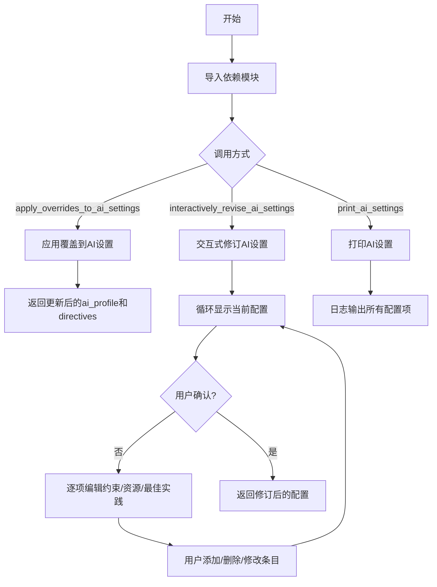
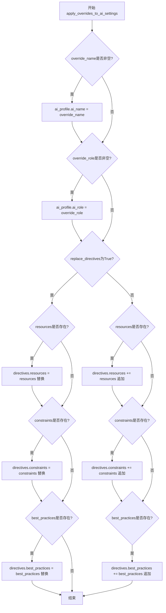
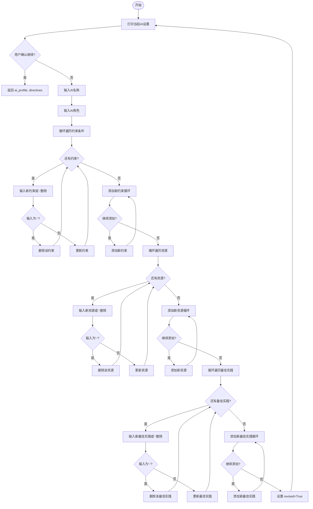
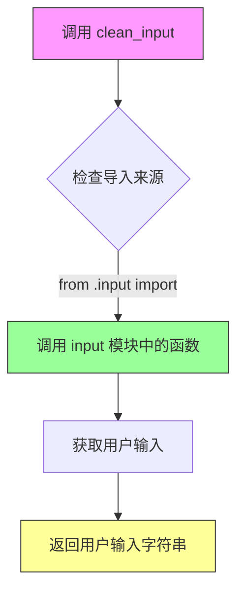
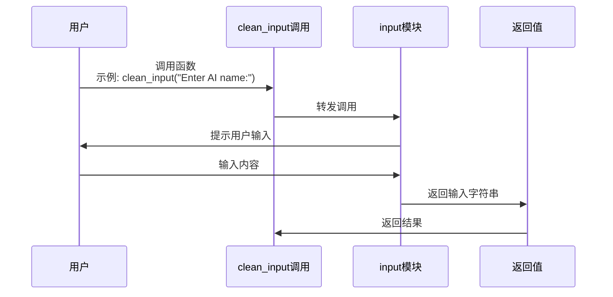
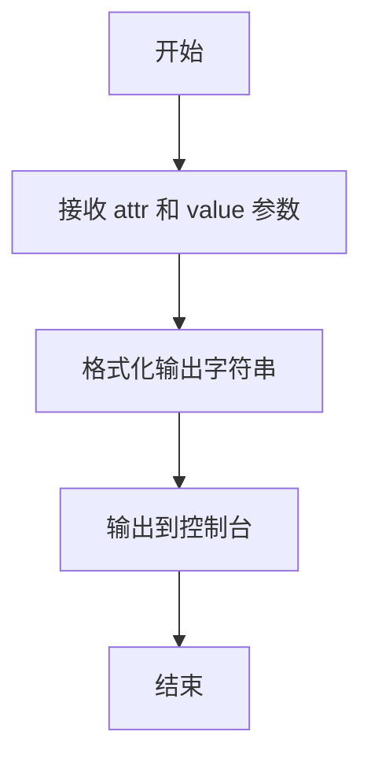
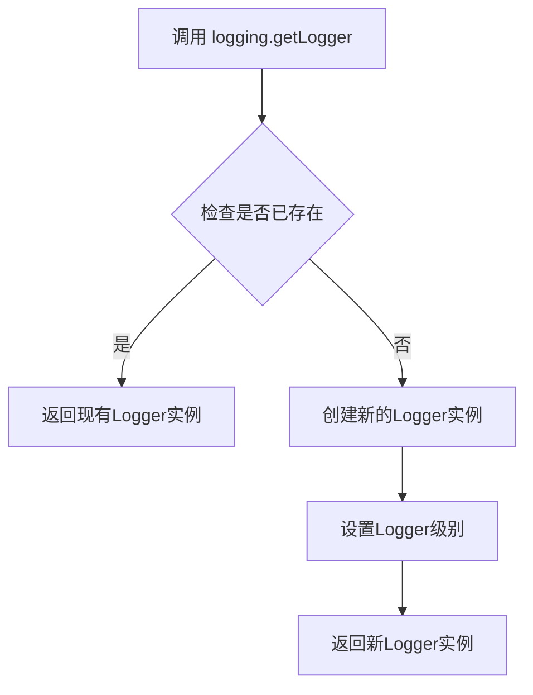
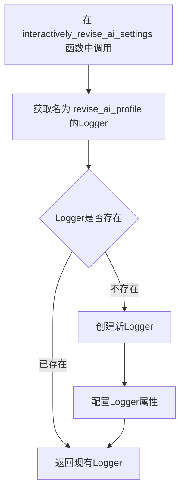

# `.\AutoGPT\classic\original_autogpt\autogpt\app\setup.py` 详细设计文档

该文件是AutoGPT项目的AI配置设置模块，提供交互式和非交互式的方式修改AI的配置文件（名称、角色、指令、资源、约束和最佳实践），支持通过命令行或覆盖方式配置AI行为。

## 整体流程



## 类结构

```
模块: autogpt.app.setup (无类定义)
├── apply_overrides_to_ai_settings (全局函数)
├── interactively_revise_ai_settings (全局函数)
└── print_ai_settings (全局函数)
```

## 全局变量及字段


### `logger`
    
模块级别的日志记录器，用于记录AI设置相关操作

类型：`logging.Logger`
    


### `apply_overrides_to_ai_settings.ai_profile`
    
AI配置文件对象，包含AI名称和角色信息

类型：`AIProfile`
    


### `apply_overrides_to_ai_settings.directives`
    
AI指令配置对象，包含资源、约束和最佳实践

类型：`AIDirectives`
    


### `apply_overrides_to_ai_settings.override_name`
    
可选字符串，用于覆盖AI名称

类型：`Optional[str]`
    


### `apply_overrides_to_ai_settings.override_role`
    
可选字符串，用于覆盖AI角色

类型：`Optional[str]`
    


### `apply_overrides_to_ai_settings.replace_directives`
    
布尔标志，指示是否替换现有指令而非追加

类型：`bool`
    


### `apply_overrides_to_ai_settings.resources`
    
可选的资源列表，用于更新AI指令

类型：`Optional[list[str]]`
    


### `apply_overrides_to_ai_settings.constraints`
    
可选的约束列表，用于更新AI指令

类型：`Optional[list[str]]`
    


### `apply_overrides_to_ai_settings.best_practices`
    
可选的最佳实践列表，用于更新AI指令

类型：`Optional[list[str]]`
    


### `interactively_revise_ai_settings.ai_profile`
    
当前的AI配置文件对象，将被交互式修改

类型：`AIProfile`
    


### `interactively_revise_ai_settings.directives`
    
当前的AI指令配置对象，将被交互式修改

类型：`AIDirectives`
    


### `interactively_revise_ai_settings.app_config`
    
应用程序配置对象，包含授权键等信息

类型：`AppConfig`
    


### `interactively_revise_ai_settings.logger`
    
日志记录器，用于输出AI设置信息

类型：`logging.Logger`
    


### `interactively_revise_ai_settings.revised`
    
布尔标志，标记AI设置是否已被修改过

类型：`bool`
    


### `interactively_revise_ai_settings.constraint`
    
循环中当前遍历的约束项

类型：`str`
    


### `interactively_revise_ai_settings.new_constraint`
    
用户输入的新约束内容

类型：`str`
    


### `interactively_revise_ai_settings.resource`
    
循环中当前遍历的资源项

类型：`str`
    


### `interactively_revise_ai_settings.new_resource`
    
用户输入的新资源内容

类型：`str`
    


### `interactively_revise_ai_settings.best_practice`
    
循环中当前遍历的最佳实践项

类型：`str`
    


### `interactively_revise_ai_settings.new_best_practice`
    
用户输入的新最佳实践内容

类型：`str`
    


### `print_ai_settings.ai_profile`
    
AI配置文件对象，用于获取名称和角色

类型：`AIProfile`
    


### `print_ai_settings.directives`
    
AI指令配置对象，用于获取约束、资源和最佳实践

类型：`AIDirectives`
    


### `print_ai_settings.logger`
    
日志记录器，用于输出AI设置详情

类型：`logging.Logger`
    


### `print_ai_settings.title`
    
打印输出的标题文本

类型：`str`
    


### `print_ai_settings.constraint`
    
循环中当前遍历的约束项

类型：`str`
    


### `print_ai_settings.resource`
    
循环中当前遍历的资源项

类型：`str`
    


### `print_ai_settings.best_practice`
    
循环中当前遍历的最佳实践项

类型：`str`
    
    

## 全局函数及方法


### `apply_overrides_to_ai_settings`

该函数用于在初始化或配置AI时，有条件地覆盖或扩展AI_profile中的名称、角色信息，以及AIDirectives中的资源、约束和最佳实践列表，支持替换或追加两种模式。

参数：

- `ai_profile`：`AIProfile`，AI配置文件对象，包含ai_name和ai_role属性
- `directives`：`AIDirectives`，AI指令集对象，包含resources、constraints和best_practices属性
- `override_name`：`Optional[str]`，可选参数，用于覆盖AI名称的字符串，默认为空字符串
- `override_role`：`Optional[str]`，可选参数，用于覆盖AI角色的字符串，默认为空字符串
- `replace_directives`：`bool`，可选布尔值，指定如何处理指令列表，为True时替换，为False时追加，默认为False
- `resources`：`Optional[list[str]]`，可选的资源列表，用于更新或追加到directives.resources
- `constraints`：`Optional[list[str]]`，可选的约束列表，用于更新或追加到directives.constraints
- `best_practices`：`Optional[list[str]]`，可选的最佳实践列表，用于更新或追加到directives.best_practices

返回值：`None`，该函数直接修改传入的ai_profile和directives对象，不返回任何值

#### 流程图



#### 带注释源码

```python
def apply_overrides_to_ai_settings(
    ai_profile: AIProfile,
    directives: AIDirectives,
    override_name: Optional[str] = "",
    override_role: Optional[str] = "",
    replace_directives: bool = False,
    resources: Optional[list[str]] = None,
    constraints: Optional[list[str]] = None,
    best_practices: Optional[list[str]] = None,
):
    """Apply override values to AI profile and directives.
    
    This function modifies the provided AIProfile and AIDirectives objects
    in place based on the provided override parameters. It supports both
    replacing and appending to directive lists.
    
    Args:
        ai_profile: The AIProfile object to modify with name/role overrides
        directives: The AIDirectives object to modify with resources/constraints/best_practices
        override_name: Optional new name for the AI
        override_role: Optional new role description for the AI
        replace_directives: If True, replace directive lists; if False, append to them
        resources: Optional list of resources to add or replace
        constraints: Optional list of constraints to add or replace
        best_practices: Optional list of best practices to add or replace
    """
    # 处理AI名称覆盖：如果提供了override_name，则更新ai_profile的ai_name属性
    if override_name:
        ai_profile.ai_name = override_name
    
    # 处理AI角色覆盖：如果提供了override_role，则更新ai_profile的ai_role属性
    if override_role:
        ai_profile.ai_role = override_role

    # 根据replace_directives标志决定是替换还是追加指令
    if replace_directives:
        # 替换模式：将提供的列表直接赋值给对应的directives属性
        if resources:
            directives.resources = resources
        if constraints:
            directives.constraints = constraints
        if best_practices:
            directives.best_practices = best_practices
    else:
        # 追加模式：将提供的列表添加到现有的directives属性末尾
        if resources:
            directives.resources += resources
        if constraints:
            directives.constraints += constraints
        if best_practices:
            directives.best_practices += best_practices
```


### `interactively_revise_ai_settings`

该函数是一个异步交互式函数，允许用户通过命令行界面修改 AI 配置文件的名称、角色、指令约束、资源和最佳实践。函数会持续循环展示当前设置，直到用户确认满意后返回更新后的配置对象。

参数：

- `ai_profile`：`AIProfile`，当前的 AI 配置文件对象
- `directives`：`AIDirectives`，当前的 AI 指令集对象，包含约束、资源和最佳实践
- `app_config`：`AppConfig`，应用程序配置对象，用于获取授权键等配置

返回值：`(AIProfile, AIDirectives)`，返回修订后的 AI 配置文件和指令集

#### 流程图



#### 带注释源码

```python
async def interactively_revise_ai_settings(
    ai_profile: AIProfile,
    directives: AIDirectives,
    app_config: AppConfig,
):
    """Interactively revise the AI settings.

    Args:
        ai_profile (AIConfig): The current AI profile.
        ai_directives (AIDirectives): The current AI directives.
        app_config (Config): The application configuration.

    Returns:
        AIConfig: The revised AI settings.
    """
    # 获取专用日志记录器用于记录AI配置修订过程
    logger = logging.getLogger("revise_ai_profile")

    # 标记配置是否已被修改
    revised = False

    # 主循环：持续询问用户直到确认设置
    while True:
        # 打印当前AI配置（根据是否已修订显示不同标题）
        print_ai_settings(
            title="Current AI Settings" if not revised else "Revised AI Settings",
            ai_profile=ai_profile,
            directives=directives,
            logger=logger,
        )

        # 询问用户是否继续使用当前设置
        # 支持两种确认方式：直接输入Y/n，或使用授权键
        if (
            clean_input("Continue with these settings? [Y/n]").lower()
            or app_config.authorise_key
        ) == app_config.authorise_key:
            break  # 用户确认，退出循环

        # ===== 修改AI名称和角色 =====
        ai_profile.ai_name = (
            clean_input("Enter AI name (or press enter to keep current):")
            or ai_profile.ai_name
        )
        ai_profile.ai_role = (
            clean_input("Enter new AI role (or press enter to keep current):")
            or ai_profile.ai_role
        )

        # ===== 修订约束条件 =====
        i = 0
        while i < len(directives.constraints):
            constraint = directives.constraints[i]
            print_attribute(f"Constraint {i+1}:", f'"{constraint}"')
            new_constraint = (
                clean_input(
                    f"Enter new constraint {i+1}"
                    " (press enter to keep current, or '-' to remove):",
                )
                or constraint
            )

            if new_constraint == "-":
                directives.constraints.remove(constraint)
                continue  # 跳过i++，因为删除了元素
            elif new_constraint:
                directives.constraints[i] = new_constraint

            i += 1

        # 添加新约束条件
        while True:
            new_constraint = clean_input(
                "Press enter to finish, or enter a constraint to add:",
            )
            if not new_constraint:
                break
            directives.constraints.append(new_constraint)

        # ===== 修订资源 =====
        i = 0
        while i < len(directives.resources):
            resource = directives.resources[i]
            print_attribute(f"Resource {i+1}:", f'"{resource}"')
            new_resource = (
                clean_input(
                    f"Enter new resource {i+1}"
                    " (press enter to keep current, or '-' to remove):",
                )
                or resource
            )
            if new_resource == "-":
                directives.resources.remove(resource)
                continue
            elif new_resource:
                directives.resources[i] = new_resource

            i += 1

        # 添加新资源
        while True:
            new_resource = clean_input(
                "Press enter to finish, or enter a resource to add:",
            )
            if not new_resource:
                break
            directives.resources.append(new_resource)

        # ===== 修订最佳实践 =====
        i = 0
        while i < len(directives.best_practices):
            best_practice = directives.best_practices[i]
            print_attribute(f"Best Practice {i+1}:", f'"{best_practice}"')
            new_best_practice = (
                clean_input(
                    f"Enter new best practice {i+1}"
                    " (press enter to keep current, or '-' to remove):",
                )
                or best_practice
            )
            if new_best_practice == "-":
                directives.best_practices.remove(best_practice)
                continue
            elif new_best_practice:
                directives.best_practices[i] = new_best_practice

            i += 1

        # 添加新最佳实践
        while True:
            new_best_practice = clean_input(
                "Press enter to finish, or add a best practice to add:",
            )
            if not new_best_practice:
                break
            directives.best_practices.append(new_best_practice)

        # 标记配置已被修订
        revised = True

    # 返回修订后的配置对象
    return ai_profile, directives
```


### `print_ai_settings`

该函数用于将 AI 的配置信息（包括名称、角色、约束、资源和最佳实践）格式化打印到日志中，支持自定义标题显示。

参数：

- `ai_profile`：`AIProfile`，AI 配置文件，包含 AI 的名称（ai_name）和角色（ai_role）
- `directives`：`AIDirectives`，AI 指令配置，包含约束（constraints）、资源（resources）和最佳实践（best_practices）
- `logger`：`logging.Logger`，用于输出日志信息的日志记录器
- `title`：`str`，打印输出的标题，默认为 "AI Settings"

返回值：`None`，该函数无返回值，仅执行日志输出操作

#### 流程图

```mermaid
flowchart TD
    A[开始 print_ai_settings] --> B[打印标题和分隔线]
    B --> C[打印 AI 名称]
    C --> D[打印 AI 角色]
    D --> E{检查 constraints 是否为空}
    E -->|是| F[打印 '(none)']
    E -->|否| G[遍历并打印每条 constraint]
    F --> H{检查 resources 是否为空}
    G --> H
    H -->|是| I[打印 '(none)']
    H -->|否| J[遍历并打印每条 resource]
    I --> K{检查 best_practices 是否为空}
    J --> K
    K -->|是| L[打印 '(none)']
    K -->|否| M[遍历并打印每条 best_practice]
    L --> N[结束]
    M --> N
```

#### 带注释源码

```python
def print_ai_settings(
    ai_profile: AIProfile,
    directives: AIDirectives,
    logger: logging.Logger,
    title: str = "AI Settings",
):
    """打印 AI 设置信息到日志

    Args:
        ai_profile: 包含 AI 名称和角色的配置文件
        directives: 包含约束、资源和最佳实践的指令配置
        logger: 用于输出日志的日志记录器
        title: 显示的标题文本，默认为 "AI Settings"
    """
    # 打印主标题
    print_attribute(title, "")
    # 打印与标题等长的分隔线
    print_attribute("-" * len(title), "")
    # 打印 AI 名称
    print_attribute("Name :", ai_profile.ai_name)
    # 打印 AI 角色
    print_attribute("Role :", ai_profile.ai_role)

    # 处理并打印约束列表
    print_attribute("Constraints:", "" if directives.constraints else "(none)")
    for constraint in directives.constraints:
        # 将每条约束记录到日志
        logger.info(f"- {constraint}")

    # 处理并打印资源列表
    print_attribute("Resources:", "" if directives.resources else "(none)")
    for resource in directives.resources:
        # 将每条资源记录到日志
        logger.info(f"- {resource}")

    # 处理并打印最佳实践列表
    print_attribute("Best practices:", "" if directives.best_practices else "(none)")
    for best_practice in directives.best_practices:
        # 将每条最佳实践记录到日志
        logger.info(f"- {best_practice}")
```


### `clean_input`

从 `input` 模块导入的用户输入处理函数，用于获取并清理用户通过命令行输入的内容。

参数：

- 无直接参数（从 `.input` 模块导入，实际参数取决于模块定义）

返回值：未知（实际定义不在当前代码文件中）

> **注意**：`clean_input` 函数定义在 `input.py` 模块中，当前代码文件仅包含导入语句。以下信息基于代码中的调用方式推断。

#### 流程图





#### 带注释源码

```python
# 从当前包中的 input 模块导入 clean_input 函数
# 注意：实际的函数定义不在此文件中
from .input import clean_input

# 在代码中的实际使用示例：
# 示例1：确认设置
clean_input("Continue with these settings? [Y/n]").lower() or app_config.authorise_key

# 示例2：获取AI名称
ai_profile.ai_name = (
    clean_input("Enter AI name (or press enter to keep current):")
    or ai_profile.ai_name  # 如果用户输入为空，保留原值
)

# 示例3：获取AI角色
ai_profile.ai_role = (
    clean_input("Enter new AI role (or press enter to keep current):")
    or ai_profile.ai_role
)

# 示例4：修改约束条件
new_constraint = clean_input(
    f"Enter new constraint {i+1}"
    " (press enter to keep current, or '-' to remove):",
) or constraint

# 示例5：添加新约束
new_constraint = clean_input(
    "Press enter to finish, or enter a constraint to add:",
)

# 示例6：修改资源
new_resource = clean_input(
    f"Enter new resource {i+1}"
    " (press enter to keep current, or '-' to remove):",
) or resource

# 示例7：添加新资源
new_resource = clean_input(
    "Press enter to finish, or enter a resource to add:",
)

# 示例8：修改最佳实践
new_best_practice = clean_input(
    f"Enter new best practice {i+1}"
    " (press enter to keep current, or '-' to remove):",
) or best_practice

# 示例9：添加新最佳实践
new_best_practice = clean_input(
    "Press enter to finish, or add a best practice to add:",
)
```

---

**推断的函数签名**（基于调用方式）：

| 参数名 | 参数类型 | 参数描述 |
|--------|----------|----------|
| prompt | `str` | 显示给用户的提示信息 |

| 返回值类型 | 返回值描述 |
|------------|------------|
| `str` | 用户输入的字符串内容 |


### `print_attribute`

打印属性键值对，用于在控制台输出带标签的文本信息。

参数：

- `attr`：标签（str），要打印的属性名称或标题
- `value`：值（str），对应标签的值或内容

返回值：无

#### 流程图



#### 带注释源码

```python
# print_attribute 是从 forge.logging.utils 导入的外部函数
# 代码中没有实现，只有使用示例
# 根据调用方式推断的签名和功能：

def print_attribute(attr: str, value: str) -> None:
    """
    打印属性键值对到控制台
    
    Args:
        attr: 属性名称或标签
        value: 属性值
    """
    # 格式化并输出到控制台/日志
    print(f"{attr} {value}")
```

#### 代码中的实际调用示例

```python
# 在本文件中的实际调用方式：

print_attribute(title, "")                        # 打印标题
print_attribute("-" * len(title), "")              # 打印分隔线
print_attribute("Name :", ai_profile.ai_name)      # 打印AI名称
print_attribute("Role :", ai_profile.ai_role)      # 打印AI角色
print_attribute("Constraints:", "(none)")          # 打印约束标题
print_attribute(f"Constraint {i+1}:", f'"{constraint}"')  # 打印单个约束
print_attribute("Resources:", "(none)")            # 打印资源标题
print_attribute(f"Resource {i+1}:", f'"{resource}"')     # 打印单个资源
print_attribute("Best practices:", "(none)")      # 打印最佳实践标题
print_attribute(f"Best Practice {i+1}:", f'"{best_practice}"')  # 打印单个最佳实践
```

---

### 技术债务与优化空间

1. **外部依赖不确定性**：`print_attribute` 函数是从 `forge.logging.utils` 导入的外部函数，本代码文件无法控制其实现细节。如果该函数发生变化，当前文件的功能可能受影响。

2. **缺少错误处理**：调用 `print_attribute` 时没有异常捕获机制，如果该函数抛出异常，整个交互式配置流程将中断。

3. **日志输出不一致**：部分信息通过 `logger.info` 输出，部分通过 `print_attribute` 输出到标准输出，建议统一日志输出方式。

4. **硬编码字符串**：提示信息如 `"Continue with these settings? [Y/n]"` 等硬编码在函数中，可考虑提取到配置或常量中。


### `logging.getLogger(__name__)`

获取当前模块的日志记录器，用于在模块级别记录日志。

参数：

- `__name__`：`str`，Python 模块的 `__name__` 变量，表示当前模块的完整路径（如 `autogpt.app.setup`）

返回值：`logging.Logger`，返回与指定名称关联的日志记录器对象

#### 流程图



#### 带注释源码

```python
# 模块级别初始化日志记录器
# __name__ 是 Python 内置变量，自动获取当前模块的全限定名
# 这样可以方便地识别日志来源，便于调试和过滤日志
logger = logging.getLogger(__name__)
```

---

### `logging.getLogger("revise_ai_profile")`

获取专门用于 AI 配置修订功能的日志记录器，便于单独控制和过滤该功能模块的日志输出。

参数：

- `"revise_ai_profile"`：`str`，日志记录器的名称字符串，用于标识特定功能模块

返回值：`logging.Logger`，返回与指定名称关联的日志记录器对象

#### 流程图



#### 带注释源码

```python
async def interactively_revise_ai_settings(
    ai_profile: AIProfile,
    directives: AIDirectives,
    app_config: AppConfig,
):
    """Interactively revise the AI settings.
    
    Args:
        ai_profile (AIConfig): The current AI profile.
        ai_directives (AIDirectives): The current AI directives.
        app_config (Config): The application configuration.
    
    Returns:
        AIConfig: The revised AI settings.
    """
    # 使用特定名称 "revise_ai_profile" 创建专用的日志记录器
    # 这样可以在日志配置中单独控制这个模块的日志级别和输出格式
    logger = logging.getLogger("revise_ai_profile")
```


## 关键组件


### AI配置覆盖机制

该函数负责将外部传入的配置参数（如名称、角色、资源、约束、最佳实践）应用到AI配置对象中，支持替换或追加模式。

### 交互式配置修订工作流

该模块提供了一个完整的交互式命令行界面，允许用户逐项编辑AI的名称、角色、约束、资源和最佳实践，支持添加、修改和删除操作。

### 配置打印输出模块

该函数负责格式化并输出当前AI配置的完整状态，包括名称、角色、约束列表、资源列表和最佳实践列表。

### 输入清理与验证

该模块对用户输入进行清理处理，确保输入数据的一致性和安全性。

### 配置数据模型

这些类定义了AI代理的配置文件结构，包括AIProfile（名称和角色）和AIDirectives（约束、资源、最佳实践）。


## 问题及建议


### 已知问题

-   **代码重复（DRY原则违反）**: `interactively_revise_ai_settings`函数中，修订constraints、resources和best_practices的代码逻辑几乎完全相同，只是变量名不同，应该抽取为通用函数。
-   **逻辑运算符优先级问题**: `clean_input(...).lower() or app_config.authorise_key` 表达式中，`or`优先级低于`==`，可能导致意外行为，应加括号明确优先级。
-   **类型提示不完整**: `Optional[list[str]]`在Python 3.9以下版本不兼容，应使用`Optional[List[str]]`并导入`List`。
-   **日志记录器重复创建**: 在`interactively_revise_ai_settings`函数内部创建了`logger = logging.getLogger("revise_ai_profile")`，而模块已有`logger = logging.getLogger(__name__)`，造成日志记录器冗余。
-   **文档字符串与实际参数不一致**: `interactively_revise_ai_settings`的docstring中参数名为`ai_directives`但实际函数签名使用`directives`。
-   **硬编码字符串**: 多处使用硬编码字符串如"-"表示删除操作、"Press enter to finish"等提示语，缺乏常量定义。
-   **缺少输入验证**: 用户输入未进行长度限制、空格处理或特殊字符过滤，可能导致后续处理问题。
-   **循环中修改列表**: 使用`directives.constraints.remove(constraint)`在遍历列表时删除元素，可能导致索引越界或跳过元素。
-   **无异常处理**: 缺少对用户中断、输入错误或配置对象属性访问失败等异常情况的处理。
-   **函数职责过重**: `interactively_revise_ai_settings`函数体超过150行，同时处理UI交互、数据验证和状态管理。

### 优化建议

-   将重复的列表修订逻辑抽取为`revise_list_items`辅助函数，接受列表名和提示消息作为参数。
-   添加括号明确布尔表达式优先级，确保逻辑正确。
-   修正类型提示为`Optional[List[str]]`或在文件头部添加`from __future__ import annotations`。
-   删除函数内部重复创建的logger，直接使用模块级logger或传入logger参数。
-   统一docstring与函数签名的参数名称。
-   定义常量类或枚举来管理所有提示文本和操作标识符。
-   添加输入验证函数，对用户输入进行trim、空格处理和长度限制。
-   使用列表推导式或倒序遍历避免循环中修改列表的问题。
-   添加try-except块处理可能的KeyError、AttributeError和KeyboardInterrupt。
-   将`interactively_revise_ai_settings`拆分为更小的函数，如`print_settings`、`revise_single_list`、`prompt_user_input`等。


## 其它


### 设计目标与约束

本模块的设计目标是提供一个灵活且用户友好的方式来配置和调整AI代理的核心设置，包括AI名称、角色、指令、资源限制和最佳实践。设计约束包括：1) 必须保持向后兼容性，确保现有配置格式不被破坏；2) 交互式修订流程必须提供清晰的用户反馈；3) 配置修改支持增量添加和完全替换两种模式。

### 错误处理与异常设计

代码中的错误处理主要通过以下方式实现：1) 输入验证使用`clean_input`函数处理用户输入；2) 使用`or`运算符提供默认值，避免空值问题；3) 循环中的`continue`语句用于处理特定的移除操作。当前缺乏显式的异常捕获机制，建议在文件I/O操作和配置持久化时添加try-except块。

### 数据流与状态机

模块的数据流遵循以下路径：初始配置 → 用户交互界面 → 配置修订循环 → 最终配置输出。状态机包含三个主要状态：1) 显示当前配置状态；2) 等待用户确认或修改状态；3) 完成配置状态。循环通过用户输入"n"或按下Ctrl+C退出。

### 外部依赖与接口契约

本模块依赖以下外部组件：1) `forge.config.ai_directives.AIDirectives` - AI指令配置类；2) `forge.config.ai_profile.AIProfile` - AI profile配置类；3) `forge.logging.utils.print_attribute` - 日志打印工具函数；4) `autogpt.app.config.AppConfig` - 应用程序配置；5) `forge.logging.utils` - 日志模块。接口契约要求传入的`ai_profile`和`directives`对象必须具有特定的属性结构。

### 安全性考虑

当前代码存在以下安全考量：1) 用户输入直接用于修改配置对象，建议在生产环境中添加输入清理和验证；2) 配置文件可能包含敏感信息，需要确保适当的访问权限控制；3) 交互式输入过程不包含超时机制，可能导致进程阻塞。

### 性能考量

性能瓶颈主要集中在交互式修订循环中，每次迭代都会调用多次`clean_input`函数。建议优化：1) 批量收集用户输入而非逐项输入；2) 对于大量约束、资源和最佳实践，考虑使用分页显示和操作；3) 可以添加缓存机制避免重复打印配置信息。

### 配置管理

配置管理采用覆盖(override)和追加(appending)两种模式。`apply_overrides_to_ai_settings`函数支持：1) 直接覆盖名称和角色；2) 选择性替换或追加资源、约束和最佳实践。配置变更通过返回值传播，不直接修改全局状态。

### 用户交互流程

交互流程包括：1) 显示当前AI配置；2) 提示用户确认或选择修改；3) 若选择修改，提供对名称、角色、约束、资源和最佳实践的逐项编辑；4) 支持添加新项目和删除现有项目；5) 循环直到用户确认或退出。授权密钥用于跳过交互式确认流程。

### 测试策略

建议的测试策略包括：1) 单元测试验证`apply_overrides_to_ai_settings`函数的各种覆盖场景；2) 集成测试模拟用户交互流程，验证配置正确修改；3) 边界条件测试处理空列表、None值和特殊字符输入；4) Mock测试隔离外部依赖。

### 版本兼容性

代码使用Python类型提示注解，要求Python 3.9+版本以支持`Optional[list[str]]`语法。依赖的外部模块版本需与`forge`和`autogpt`主项目保持一致，建议在项目requirements.txt中明确指定版本范围。

    