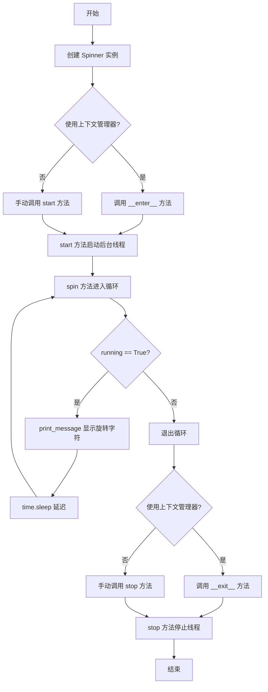
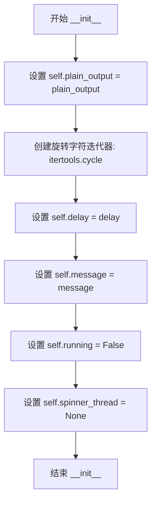
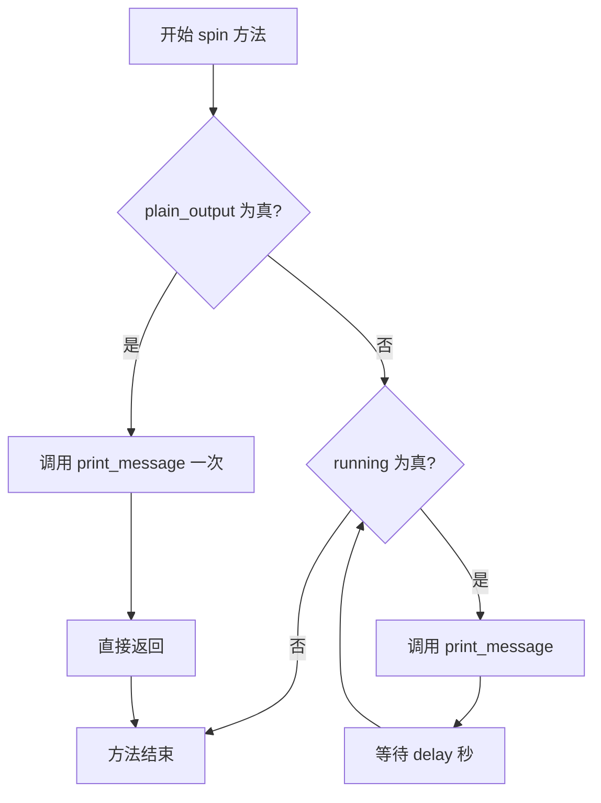
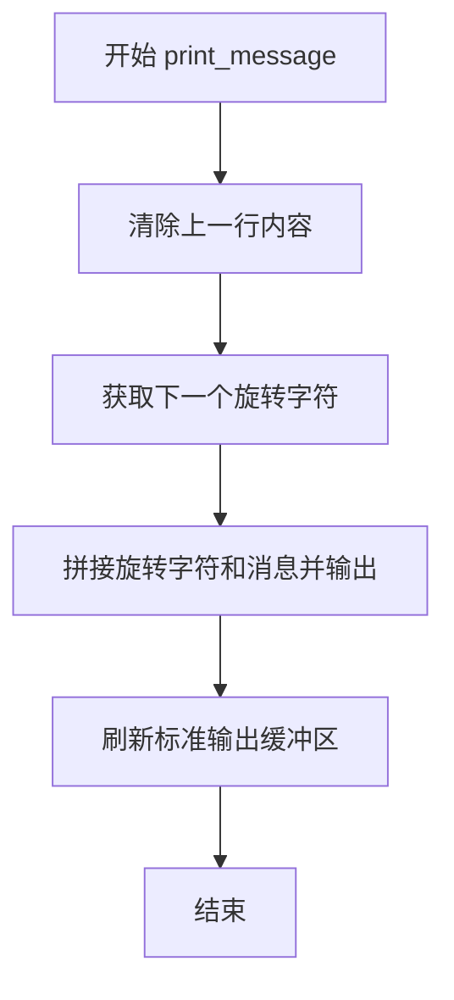
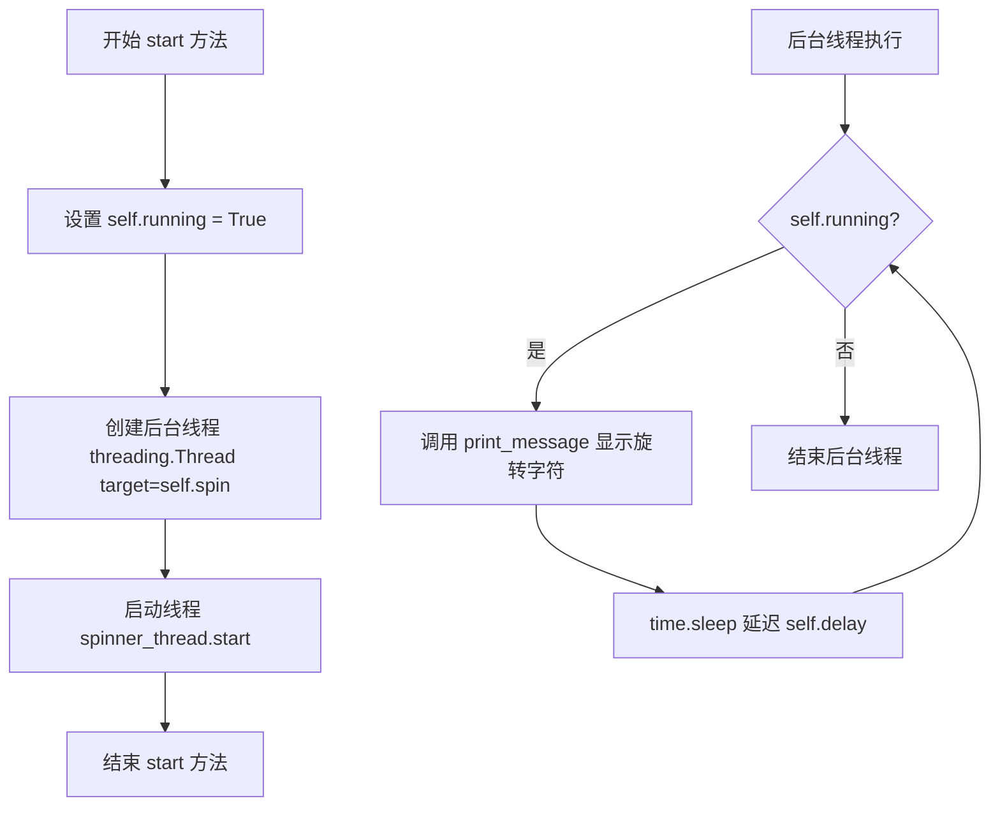
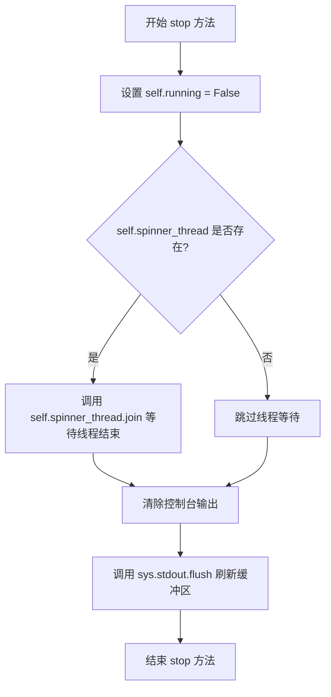
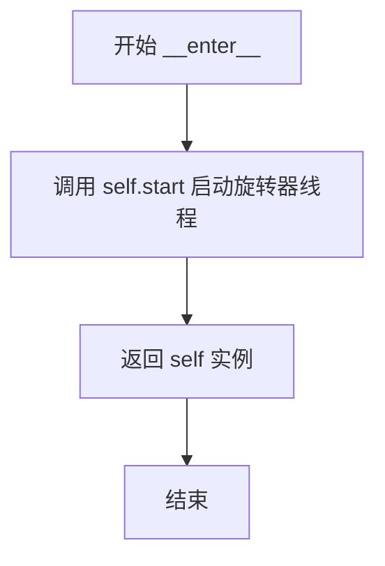
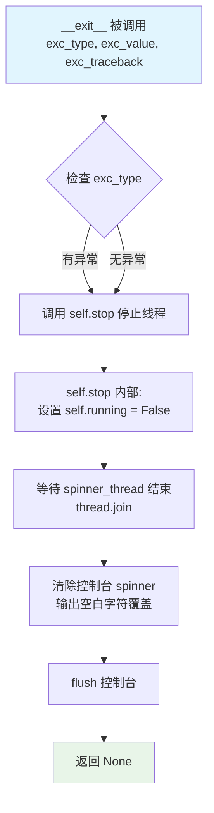

# `.\AutoGPT\classic\original_autogpt\autogpt\app\spinner.py` 详细设计文档

一个简单的终端旋转加载指示器模块，通过在控制台显示旋转字符来指示长时间运行的任务正在进行中，支持上下文管理器协议以实现自动启动和停止。

## 整体流程



## 类结构

```
Spinner (旋转加载指示器类)
```

## 全局变量及字段


### `Spinner.plain_output`
    
是否使用纯文本输出（不显示旋转字符）

类型：`bool`
    


### `Spinner.spinner`
    
旋转字符的迭代器

类型：`itertools.cycle`
    


### `Spinner.delay`
    
旋转动画的刷新延迟（秒）

类型：`float`
    


### `Spinner.message`
    
显示的消息文本

类型：`str`
    


### `Spinner.running`
    
指示旋转器是否正在运行

类型：`bool`
    


### `Spinner.spinner_thread`
    
执行旋转动画的后台线程

类型：`threading.Thread`
    
    

## 全局函数及方法


### Spinner.__init__

该方法用于初始化旋转器实例，设置显示消息、延迟时间、输出模式，并初始化相关的运行状态和线程变量。

参数：

- `message`：`str`，默认值 "Loading..."，要显示的消息文本
- `delay`：`float`，默认值 0.1，每次旋转器更新之间的延迟时间（秒）
- `plain_output`：`bool`，默认值 False，是否使用纯文本输出模式（不显示旋转动画）

返回值：`None`，无返回值，仅完成对象初始化

#### 流程图



#### 带注释源码

```python
def __init__(
    self,
    message: str = "Loading...",
    delay: float = 0.1,
    plain_output: bool = False,
) -> None:
    """Initialize the spinner class

    Args:
        message (str): The message to display.
        delay (float): The delay between each spinner update.
        plain_output (bool): Whether to display the spinner or not.
    """
    # 保存是否使用纯文本输出的标志
    self.plain_output = plain_output
    # 创建旋转字符的循环迭代器，字符序列为 ["-", "/", "|", "\\"]
    self.spinner = itertools.cycle(["-", "/", "|", "\\"])
    # 保存旋转更新延迟时间
    self.delay = delay
    # 保存要显示的消息文本
    self.message = message
    # 初始化运行状态为 False（未运行）
    self.running = False
    # 初始化旋转器线程为 None（尚未创建线程）
    self.spinner_thread = None
```


### `Spinner.spin`

执行旋转动画的核心方法，负责在终端中循环显示 spinner 字符直到停止信号被触发。

参数：无（除隐式参数 `self`）

返回值：`None`，该方法无返回值，仅执行副作用操作（向标准输出写入字符）

#### 流程图



#### 带注释源码

```python
def spin(self) -> None:
    """Spin the spinner
    
    该方法是 spinner 的核心动画循环方法，
    在独立线程中运行，持续更新终端显示的 spinner 字符。
    """
    # 检查是否需要以纯文本模式运行（不显示旋转动画）
    if self.plain_output:
        # 仅打印一次静态消息，不进行循环
        self.print_message()
        # 直接返回，结束方法
        return
    
    # 主循环：当 running 标志为 True 时持续旋转
    while self.running:
        # 打印当前 spinner 字符和消息到终端
        self.print_message()
        # 暂停指定的时间间隔，控制动画速度
        time.sleep(self.delay)
```


### `Spinner.print_message`

在控制台打印当前的旋转字符和消息，通过覆盖前一行的方式实现动态旋转效果。

参数：

- 该方法无显式参数（`self` 为实例引用）

返回值：`None`，该方法仅执行输出操作，无返回值

#### 流程图



#### 带注释源码

```python
def print_message(self):
    """在控制台打印当前的旋转字符和消息
    
    该方法通过以下步骤实现动态旋转效果：
    1. 清除控制台上一行的内容（使用空格覆盖）
    2. 写入当前旋转字符和消息
    3. 刷新输出缓冲区确保即时显示
    """
    # 步骤1：清除上一行
    # 计算空格数量：消息长度 + 2（额外空间确保完全覆盖）
    # \r 是回车符，将光标移动到行首
    sys.stdout.write(f"\r{' ' * (len(self.message) + 2)}\r")
    
    # 步骤2：写入当前旋转字符和消息
    # next(self.spinner) 从迭代器获取下一个旋转字符
    # 格式："{旋转字符} {消息}"
    sys.stdout.write(f"{next(self.spinner)} {self.message}\r")
    
    # 步骤3：刷新输出缓冲区
    # 确保内容立即写入控制台，而非停留在缓冲区
    sys.stdout.flush()
```


### `Spinner.start`

启动旋转动画，创建并启动后台线程以执行旋转任务。

参数：无（仅包含 `self` 隐式参数）

返回值：`None`，无返回值描述

#### 流程图



#### 带注释源码

```python
def start(self):
    """启动旋转动画
    
    创建一个后台线程来执行 spin 方法，实现非阻塞的旋转动画效果。
    该方法会设置运行标志并启动一个新的线程来处理旋转显示。
    """
    # 1. 设置运行标志为 True，通知 spin 方法开始旋转
    self.running = True
    
    # 2. 创建后台线程，target 指定线程执行的目标方法为 self.spin
    # daemon=True 未设置，默认为 False，线程会在主程序结束前完成
    self.spinner_thread = threading.Thread(target=self.spin)
    
    # 3. 启动后台线程，开始执行 spin 方法中的旋转逻辑
    # 线程启动后立即返回，不会阻塞主线程
    self.spinner_thread.start()
```


### `Spinner.stop`

停止旋转动画，设置 running 标志为 False 并等待后台线程结束，最后清除控制台上的 spinner 残留输出。

参数：

- `self`：`Spinner` 实例，隐式参数，代表当前 Spinner 对象本身

返回值：`None`，无返回值

#### 流程图



#### 带注释源码

```python
def stop(self):
    """停止旋转动画
    
    设置 running 标志为 False 以停止旋转循环，
    等待后台线程结束后，清除控制台上的 spinner 残留输出。
    """
    # 1. 设置 running 为 False，通知 spin 方法中的循环停止
    self.running = False
    
    # 2. 检查 spinner_thread 是否已创建（start 方法可能未被调用）
    if self.spinner_thread is not None:
        # 3. 等待后台线程完全结束，确保资源安全释放
        self.spinner_thread.join()
    
    # 4. 清除控制台上的 spinner 残留输出
    # 计算空格数量：消息长度 + 2（留有余量）
    # \r 将光标移到行首，填满空格覆盖原输出
    sys.stdout.write(f"\r{' ' * (len(self.message) + 2)}\r")
    
    # 5. 立即刷新输出，确保清除操作立即生效
    sys.stdout.flush()
```


### `Spinner.__enter__`

上下文管理器入口方法，用于启动旋转器并返回实例本身，使该类能够与 Python 的 `with` 语句配合使用。

参数：无需额外参数（`self` 为实例本身）

返回值：`Spinner`，返回旋转器实例本身，以便在 `with` 语句块中使用该实例

#### 流程图



#### 带注释源码

```python
def __enter__(self):
    """Start the spinner"""
    # 调用 start 方法启动后台线程运行 spin 方法
    self.start()
    # 返回 self，使调用者可以在 with 块中访问 spinner 实例
    return self
```


### `Spinner.__exit__`

上下文管理器出口方法，在 `with` 语句块结束时被自动调用，负责停止旋转器线程并清除控制台上的 spinner 显示。

参数：

- `exc_type`：`type | None`，Python 上下文管理器标准参数，表示异常类型（如果有）
- `exc_value`：`BaseException | None`，Python 上下文管理器标准参数，表示异常实例（如果有）
- `exc_traceback`：`traceback | None`，Python 上下文管理器标准参数，表示异常追踪对象（如果有）

返回值：`None`，无返回值，用于满足上下文管理器协议接口

#### 流程图



#### 带注释源码

```python
def __exit__(self, exc_type, exc_value, exc_traceback) -> None:
    """Stop the spinner

    Args:
        exc_type (Exception): The exception type.
        exc_value (Exception): The exception value.
        exc_traceback (Exception): The exception traceback.
    """
    # 调用 stop 方法停止旋转器
    # 该方法会:
    # 1. 将 self.running 设为 False，通知 spin 循环终止
    # 2. 等待 spinner_thread 线程结束 (join)
    # 3. 清除控制台上的 spinner 显示
    self.stop()
    
    # 注意: 此处未使用 exc_type, exc_value, exc_traceback 参数
    # 意味着即使 with 块中发生异常，spinner 也会正常停止
    # 如需处理异常，可在此处添加日志记录或重新抛出异常
```

## 关键组件


### Spinner 类

核心的旋转加载动画类，负责在控制台显示加载状态，支持后台线程运行和上下文管理器协议。

### 迭代器循环组件 (itertools.cycle)

使用 itertools.cycle 创建字符循环迭代器，实现 - / | \ 四个字符的循环切换。

### 后台线程支持 (threading.Thread)

通过 threading 模块创建后台线程，使 spinner 动画与主程序逻辑并行运行，避免阻塞主线程。

### 动画刷新机制 (time.sleep)

使用 time.sleep 控制动画更新频率，默认 0.1 秒刷新一次，支持自定义延迟参数。

### 上下文管理器支持 (__enter__ / __exit__)

实现 Python 上下文管理器协议，支持 with 语句自动启动和停止 spinner，确保资源正确释放。

### 控制台输出管理 (sys.stdout)

通过 sys.stdout.write 和 sys.stdout.flush 实现无换行的原地更新显示，使用 \r 字符实现覆盖效果。

### 消息显示与清除

print_message 方法在每次刷新时先清除之前的消息（填充空格），然后显示新的旋转字符和消息内容。


## 问题及建议


### 已知问题

-   **线程安全问题**：`self.running` 在主线程中写入（`start()`/`stop()`），在子线程中读取（`spin()`），存在竞态条件；`self.spinner` 的 `next()` 操作在线程中非原子操作，可能导致不可预测行为
-   **线程清理不完整**：未将 `spinner_thread` 设置为 daemon 线程，程序异常退出时可能导致僵尸线程
-   **异常处理缺失**：`spin()` 方法的循环中没有捕获异常，若发生异常会导致线程无声终止，`running` 标志可能无法被重置
-   **输出环境适配问题**：直接使用 `sys.stdout.write` 未检查是否为 TTY 终端，重定向到文件时会产生多余字符污染输出
-   **`plain_output` 模式逻辑不一致**：该模式下 `spin()` 只调用一次 `print_message()` 即返回，无法实现真正的"不显示spinner"功能，且与正常模式行为不一致
-   **上下文管理器异常处理缺失**：`__exit__` 中直接调用 `stop()`，未处理 `stop()` 本身可能抛出的异常
-   **消息长度缓存问题**：`stop()` 方法使用 `len(self.message)` 计算清除宽度，但 `self.message` 在运行过程中可能被修改，导致清除不完整
-   **类型注解不完整**：`print_message`、`start`、`stop` 方法缺少返回类型注解

### 优化建议

-   引入 `threading.Lock` 保护 `self.running` 和 `self.spinner` 的读写，或使用 `threading.Event` 控制线程生命周期
-   在 `start()` 中设置 `daemon=True`，确保程序退出时线程被强制终止
-   在 `spin()` 循环中添加 `try-except` 块，捕获异常后确保 `self.running = False`
-   添加 `sys.stdout.isatty()` 检查，非交互环境下跳过 spinner 或输出静态信息
-   重构 `plain_output` 逻辑，或移除该功能以保持 API 简洁
-   缓存 `self.message` 的长度在初始化时，避免运行时计算的潜在不一致问题
-   为所有方法补充完整的类型注解，提升代码可维护性
-   添加 `__del__` 方法或使用 `atexit` 注册，确保程序退出时 spinner 被正确停止


## 其它


### 设计目标与约束

本模块的设计目标是在命令行应用程序中提供一个轻量级的加载动画指示器，提升用户体验。约束条件包括：仅支持Unix/Linux/macOS等支持ANSI转义序列的终端环境；线程安全，允许在主线程之外运行；不支持Windows命令提示符的彩色输出（plain_output模式可在不支持终端时使用）。

### 错误处理与异常设计

1. **线程异常**：如果spin方法中发生异常，线程会终止但不会影响主线程，running标志位会自动使循环退出
2. **上下文管理器异常**：即使在with块中发生异常，__exit__也会被调用，确保spinner正确停止
3. **stdout异常**：如果sys.stdout.write或flush失败（如输出重定向到不可写文件），异常会向上传播
4. **无显式异常类**：当前实现没有自定义异常类，所有错误均以标准Python异常形式抛出

### 数据流与状态机

Spinner具有三种状态：
- **初始态（IDLE）**：running=False, spinner_thread=None，spinner未启动
- **运行态（RUNNING）**：running=True, spinner_thread为活跃线程，不断输出动画
- **停止态（STOPPED）**：running=False, spinner_thread已终止，动画已清除

状态转换：
- IDLE → RUNNING：调用start()方法
- RUNNING → STOPPED：调用stop()方法
- 任何状态 → IDLE：对象销毁或重新start()

### 外部依赖与接口契约

**依赖模块**：
- itertools：提供cycle()用于无限循环迭代旋转字符
- sys：提供stdout写入和flush操作
- threading：提供多线程支持
- time：提供sleep()实现延迟

**公共接口契约**：
- Spinner类可通过实例化或上下文管理器使用
- start()和stop()必须成对调用
- 在plain_output=True时，spin()会退化为仅打印静态消息
- 线程在stop()后会完全终止，spinner不可复用（需重新创建实例）

### 线程安全与并发考虑

1. **running标志位**：虽然Python中布尔赋值是原子操作，但在极端高并发场景下建议使用threading.Event()
2. **迭代器访问**：itertools.cycle非线程安全，多线程同时访问可能产生问题，当前实现通过单线程spin()避免此问题
3. **stdout操作**：sys.stdout不是线程安全的，多线程同时写入可能导致输出交错，建议通过锁保护
4. **join()调用**：stop()中的join()会阻塞主线程，等待spinner线程完全终止

### 性能考量

1. **延迟精度**：delay参数为float，理论上可达微秒级，但实际受系统调度精度限制
2. **内存占用**：itertools.cycle会缓存所有字符，内存占用极低
3. **CPU使用**：plain_output=False时持续运行time.sleep()，CPU占用极低
4. **I/O开销**：每次spin会写入stdout，在高延迟情况下I/O开销可忽略

### 潜在技术债务与优化空间

1. **不支持自定义旋转字符**：当前仅支持内置的["-", "/", "|", "\\"]四种字符，应允许用户自定义
2. **不支持彩色输出**：可添加颜色支持增强视觉效果
3. **plain_output模式逻辑不清晰**：在plain_output=True时仍调用spin()但立即返回，语义不够明确
4. **缺少类型提示完整性**：print_message方法缺少类型提示
5. **不支持动态消息更新**：message在初始化后不可更改
6. **stop()后输出残留**：stop()仅清除空格，可能在某些终端残留字符
7. **缺少单元测试**：代码中没有任何测试用例

### 配置与可扩展性建议

1. 添加类方法或工厂函数创建预配置的Spinner
2. 支持回调函数在spin()每个周期执行自定义逻辑
3. 添加进度百分比支持（类似进度条）
4. 支持多个并发的Spinner实例
5. 添加日志功能便于调试

    