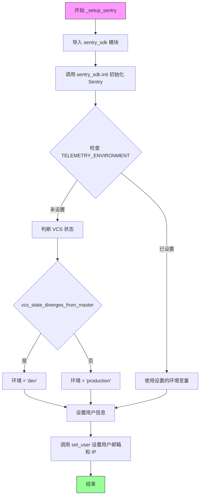
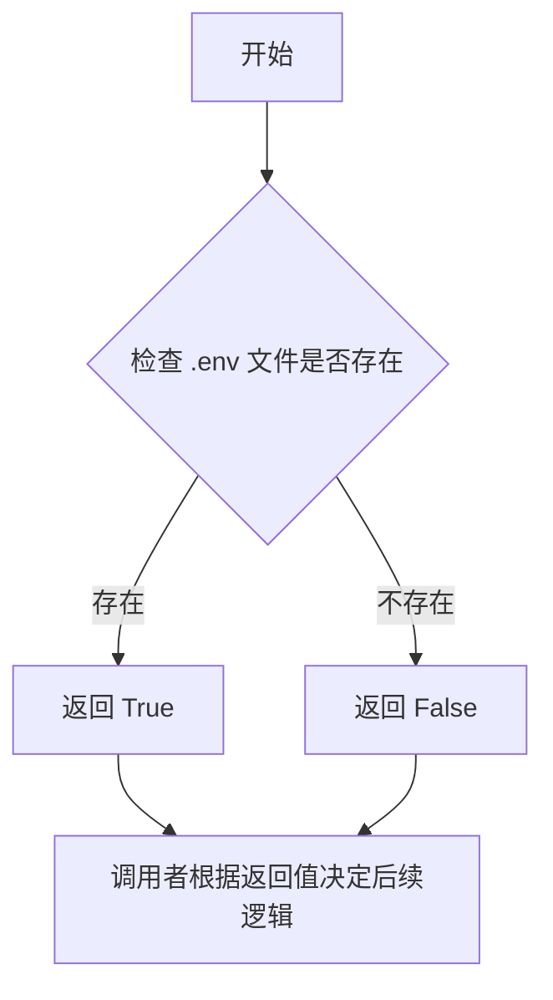
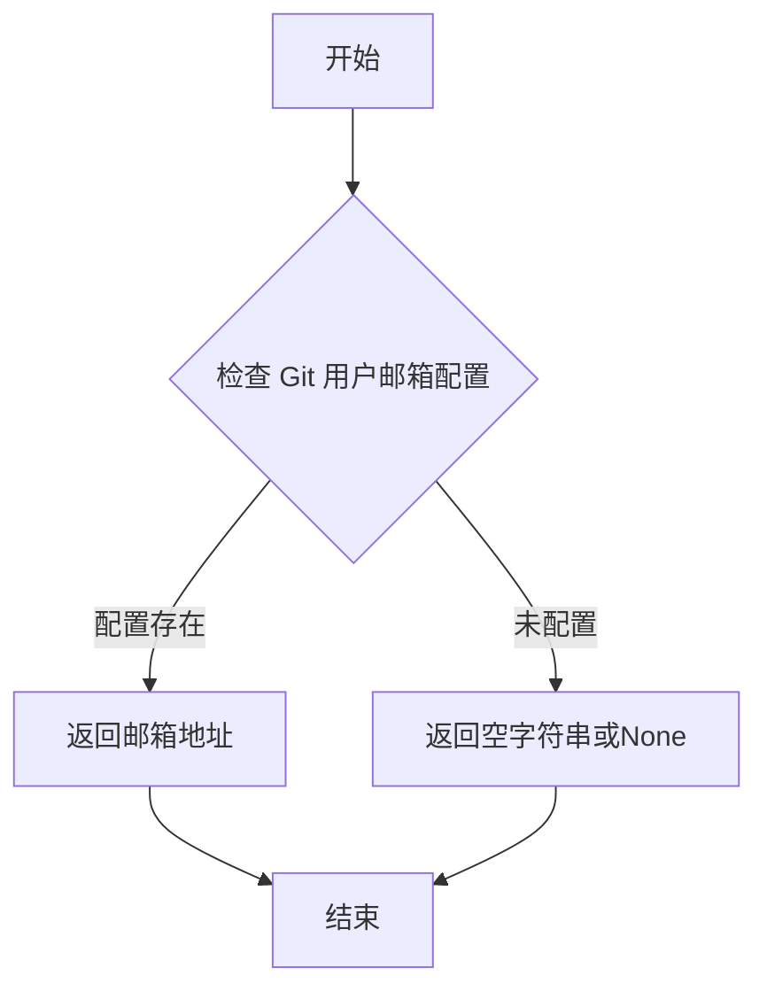
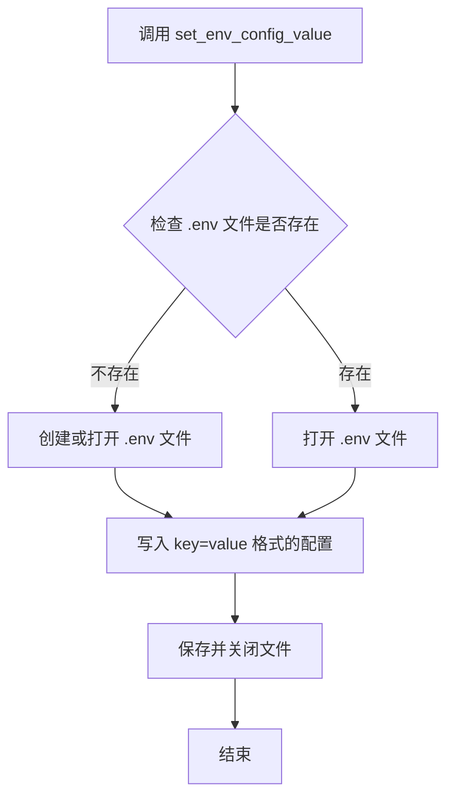
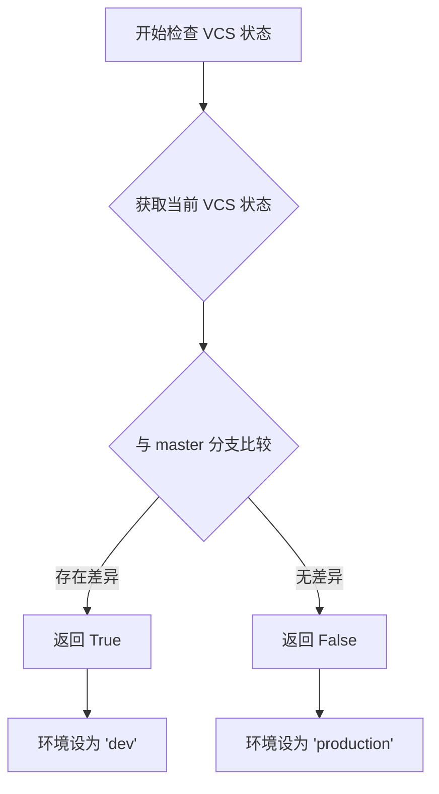

# `.\AutoGPT\classic\original_autogpt\autogpt\app\telemetry.py` 详细设计文档

这是一个遥测(telemetry)设置模块，用于管理AutoGPT的匿名使用数据收集功能。代码通过检测环境变量引导用户选择是否启用遥测，若启用则初始化Sentry SDK进行错误追踪和性能监控。

## 整体流程

```mermaid
graph TD
    A[开始] --> B{TELEMETRY_OPT_IN 环境变量是否存在?}
    B -- 否 --> C{.env 文件是否存在?}
    C -- 否 --> D[直接返回，不提示用户]
    C -- 是 --> E[提示用户选择是否启用遥测]
    E --> F[设置 TELEMETRY_OPT_IN 环境变量]
    F --> G[显示感谢消息]
    B -- 是 --> H{TELEMETRY_OPT_IN == 'true'?}
    H -- 是 --> I[调用 _setup_sentry()]
    H -- 否 --> J[结束]
    I --> K[初始化 Sentry SDK]
    K --> L[设置用户信息（邮箱和IP）]
    G --> J
    D --> J
```

## 类结构

```
模块级别结构（无类）
└── 全局函数
    ├── setup_telemetry
    └── _setup_sentry
```

## 全局变量及字段


### `TELEMETRY_OPT_IN`
    
环境变量，用于控制遥测开关，值为'true'时启用遥测，'false'时禁用

类型：`str`
    


### `TELEMETRY_ENVIRONMENT`
    
环境变量，用于设置Sentry追踪系统的环境标识，如'production'或'dev'

类型：`str`
    


    

## 全局函数及方法


### `setup_telemetry`

该函数是遥测功能的初始化入口，用于检查用户是否启用了遥测功能。如果用户选择启用，则调用内部函数 `_setup_telemetry` 初始化 Sentry SDK 进行错误追踪和性能监控。

参数：

- 无

返回值：`None`，无返回值

#### 流程图

```mermaid
flowchart TD
    A([开始 setup_telemetry]) --> B{os.getenv<br/>"TELEMETRY_OPT_IN"<br/>是否存在?}
    B -->|否| C{env_file_exists<br/>.env文件是否存在?}
    C -->|否| D[直接返回, 不询问]
    C -->|是| E[使用click.prompt<br/>提示用户选择是否启用遥测]
    E --> F{用户选择<br/>yes或no?}
    F -->|yes| G[set_env_config_value<br/>TELEMETRY_OPT_IN=true]
    F -->|no| H[set_env_config_value<br/>TELEMETRY_OPT_IN=false]
    G --> I[显示感谢信息<br/>Telemetry enabled]
    H --> J[显示信息<br/>Telemetry disabled]
    I --> K{os.getenv<br/>TELEMETRY_OPT_IN<br/>== 'true'?}
    J --> K
    B -->|是| K
    K -->|是| L[调用_setup_sentry<br/>初始化Sentry]
    K -->|否| M([结束])
    L --> M

    subgraph _setup_sentry内部
    N[import sentry_sdk] --> O[sentry_sdk.init<br/>初始化SDK]
    O --> P[sentry_sdk.set_user<br/>设置用户邮箱]
    end
```

#### 带注释源码

```python
def setup_telemetry() -> None:
    """
    遥测功能初始化入口函数。
    检查用户是否启用了遥测功能，如果启用则初始化Sentry SDK。
    """
    # 检查环境变量 TELEMETRY_OPT_IN 是否已设置
    if os.getenv("TELEMETRY_OPT_IN") is None:
        # 如果 .env 文件不存在，则不询问用户，避免在非持久化环境中重复询问
        if not env_file_exists():
            return

        # 使用 click 库提示用户选择是否启用遥测
        allow_telemetry = click.prompt(
            f"""
{Style.BRIGHT}❓ Do you want to enable telemetry? ❓{Style.NORMAL}
This means AutoGPT will send diagnostic data to the core development team when something
goes wrong, and will help us to diagnose and fix problems earlier and faster. It also
allows us to collect basic performance data, which helps us find bottlenecks and other
things that slow down the application.

By entering 'yes', you confirm that you have read and agree to our Privacy Policy,
which is available here:
https://www.notion.so/auto-gpt/Privacy-Policy-ab11c9c20dbd4de1a15dcffe84d77984

Please enter 'yes' or 'no'""",
            type=bool,
        )
        # 将用户选择写入 .env 配置文件
        set_env_config_value("TELEMETRY_OPT_IN", "true" if allow_telemetry else "false")
        # 根据用户选择显示不同的感谢信息
        click.echo(
            f"❤️  Thank you! Telemetry is {Fore.GREEN}enabled{Fore.RESET}."
            if allow_telemetry
            else f"👍 Telemetry is {Fore.RED}disabled{Fore.RESET}."
        )
        click.echo(
            "💡 If you ever change your mind, you can change 'TELEMETRY_OPT_IN' in .env"
        )
        click.echo()

    # 如果用户启用了遥测功能（环境变量为 "true"），则初始化 Sentry
    if os.getenv("TELEMETRY_OPT_IN", "").lower() == "true":
        _setup_sentry()
```


### `_setup_sentry`

该私有函数用于初始化 Sentry SDK，配置错误追踪和性能监控功能。它从环境变量获取配置，确定运行环境（生产或开发），并设置用户标识信息以便追踪问题来源。

参数：
- 无

返回值：`None`，该函数没有返回值，仅执行 Sentry SDK 的初始化配置

#### 流程图



#### 带注释源码

```python
def _setup_sentry() -> None:
    """
    初始化 Sentry SDK 用于错误追踪和性能监控。
    
    该函数在用户同意遥测功能后被调用，负责配置 Sentry 以收集
    应用程序的诊断数据和性能指标。
    """
    # 动态导入 Sentry SDK，仅在需要时加载
    import sentry_sdk

    # 初始化 Sentry SDK
    # DSN (Data Source Name) 是 Sentry 项目的唯一标识符
    # enable_tracing=True 开启性能追踪功能
    # environment 根据 VCS 状态区分开发和生产环境
    sentry_sdk.init(
        dsn="https://dc266f2f7a2381194d1c0fa36dff67d8@o4505260022104064.ingest.sentry.io/4506739844710400",  # noqa
        enable_tracing=True,
        # 如果未设置 TELEMETRY_ENVIRONMENT，则自动判断：
        # - 若 VCS 状态偏离 master 分支，则为 'dev' 环境
        # - 否则为 'production' 环境
        environment=os.getenv(
            "TELEMETRY_ENVIRONMENT",
            "production" if not vcs_state_diverges_from_master() else "dev",
        ),
    )

    # 设置 Sentry 用户上下文
    # 用于在问题报告中区分不同用户
    # email: 从 Git 配置中获取用户邮箱
    # ip_address: "{{auto}}" 表示自动收集客户端 IP
    sentry_sdk.set_user({"email": get_git_user_email(), "ip_address": "{{auto}}"})
```


### `env_file_exists`

该函数用于检查项目根目录下是否存在 `.env` 配置文件，以便决定是否向用户询问是否启用遥测功能。

参数：
- （无参数）

返回值：`bool`，如果 `.env` 文件存在返回 `True`，否则返回 `False`

#### 流程图



#### 带注释源码

```
# 注意：以下为基于代码上下文的推断实现
# 实际源码位于 utils 模块中，此处未直接提供

def env_file_exists() -> bool:
    """
    检查 .env 文件是否存在于项目根目录
    
    返回:
        bool: 如果 .env 文件存在返回 True，否则返回 False
    """
    # 常见实现方式（推断）：
    env_path = os.path.join(os.getcwd(), '.env')
    return os.path.exists(env_path)

# 在 setup_telemetry() 中的调用示例：
# if not env_file_exists():
#     return  # 如果没有 .env 文件则不询问用户启用遥测
```

#### 补充说明

该函数在 `setup_telemetry()` 中的使用场景：

```python
# 如果没有 .env 文件存在，则不询问用户是否启用遥测
# 这样可以避免在非持久化环境中重复询问
if not env_file_exists():
    return
```

---

> **备注**：由于 `env_file_exists` 函数是从 `utils` 模块导入的，而该模块的具体实现未在提供的代码中展示，因此上述源码为基于使用方式的合理推断。实际实现可能包含更多的错误处理或配置路径逻辑。


### `get_git_user_email`

获取当前 Git 配置中用户的邮箱地址，用于在遥测功能中标识用户。

参数：
- 该函数无参数

返回值：`str`，返回 Git 用户的邮箱地址字符串，如果未配置则返回空字符串或 `None`

#### 流程图



#### 带注释源码

```
# 由于 get_git_user_email 是从 .utils 模块导入的，
# 下面是基于其使用场景的推断实现

def get_git_user_email() -> str:
    """
    获取当前 Git 配置中的用户邮箱地址。
    
    该函数通常通过执行 git config user.email 命令来获取
    配置的用户邮箱。在本代码中用于 Sentry 遥测功能，
    以便识别和追踪特定用户的错误报告。
    
    Returns:
        str: Git 用户的邮箱地址，如果未配置则返回空字符串
    """
    import subprocess
    
    try:
        # 执行 git 命令获取用户邮箱
        result = subprocess.run(
            ['git', 'config', 'user.email'],
            capture_output=True,
            text=True,
            check=True
        )
        return result.stdout.strip()
    except (subprocess.CalledProcessError, FileNotFoundError):
        # 如果 git 未安装或用户未配置邮箱，返回空字符串
        return ""
```


### `set_env_config_value`

设置环境配置值到 .env 文件或系统环境变量中，用于持久化保存配置信息。

参数：

- `key`：`str`，环境变量的键名（如 "TELEMETRY_OPT_IN"）
- `value`：`str`，要设置的环境变量值（如 "true" 或 "false"）

返回值：`None`（根据函数名和调用方式推断为无返回值，直接修改环境配置）

#### 流程图



#### 带注释源码

```python
def set_env_config_value(key: str, value: str) -> None:
    """
    设置环境配置值到 .env 文件中
    
    参数:
        key: 环境变量的键名，如 'TELEMETRY_OPT_IN'
        value: 要设置的值，如 'true' 或 'false'
    
    返回:
        None: 直接修改 .env 文件，无返回值
    """
    # 读取现有 .env 文件内容（如果存在）
    # 查找并更新对应 key 的值
    # 如果 key 不存在，则追加新行
    # 写回 .env 文件
    pass  # 具体实现未在代码中显示
```


### `vcs_state_diverges_from_master`

该函数从 `.utils` 模块导入，用于检查版本控制系统（VCS）状态是否偏离 master 分支。如果 VCS 状态与 master 分支存在差异（即处于开发状态），返回 `True`；如果与 master 分支一致（即处于生产状态），返回 `False`。

参数：

- 该函数无参数（从调用模式 `vcs_state_diverges_from_master()` 可知）

返回值：`bool`，如果 VCS 状态偏离 master 分支返回 `True`（表示开发环境），否则返回 `False`（表示生产环境）

#### 流程图



#### 带注释源码

```
# 从 utils 模块导入该函数
from .utils import (
    vcs_state_diverges_from_master,
)

# 在 _setup_sentry() 函数中的使用示例：
def _setup_sentry() -> None:
    import sentry_sdk

    sentry_sdk.init(
        dsn="...",  # Sentry DSN
        enable_tracing=True,
        # 根据 vcs_state_diverges_from_master() 的返回值决定环境
        # 如果函数返回 True（偏离 master），环境设为 'dev'
        # 如果函数返回 False（未偏离），环境设为 'production'
        environment=os.getenv(
            "TELEMETRY_ENVIRONMENT",
            "production" if not vcs_state_diverges_from_master() else "dev",
        ),
    )
```

---

> **注意**：该函数的完整实现在 `.utils` 模块中，未在当前代码文件中提供。从调用方式来看，该函数通过执行 git 命令（如 `git status` 或 `git diff`）来判断当前代码状态是否与 master 分支存在差异。

## 关键组件


### 遥测初始化流程 (setup_telemetry)

主入口函数，负责检查环境变量、判断是否需要提示用户启用遥测、并在用户同意后调用Sentry初始化

### Sentry集成 (_setup_sentry)

私有函数，通过sentry_sdk初始化错误追踪和性能监控，设置用户标识和环境信息

### 环境变量检查

检查TELEMETRY_OPT_IN环境变量是否存在，以决定是否显示遥测启用提示

### 用户交互模块

使用click.prompt获取用户对启用遥测的确认，并提供隐私政策说明和交互反馈

### VCS状态检测

通过vcs_state_diverges_from_master()判断当前代码版本是否偏离master分支，用于设置Sentry环境标识

### Git用户信息获取

通过get_git_user_email()获取当前Git配置的用户邮箱，用于Sentry用户标识设置

### 环境配置管理

通过set_env_config_value()将用户的遥测选择写入.env配置文件持久化保存

### 颜色输出模块

使用colorama库实现彩色终端输出，提升用户交互体验


## 问题及建议


### 已知问题

- **硬编码的Sentry DSN密钥**：代码中直接暴露了Sentry的DSN（Data Source Name），这是敏感的安全配置信息，不应硬编码在源代码中。
- **用户Git邮箱隐私泄露**：使用`get_git_user_email()`获取用户的Git配置邮箱并发送给Sentry，可能在未经用户明确同意的情况下泄露用户身份信息。
- **bool类型解析问题**：click.prompt中使用`type=bool`可能导致意外行为，因为任何非空输入（包括输入"false"）都会被转换为True。
- **缺少错误处理**：Sentry初始化过程没有异常捕获，如果Sentry SDK初始化失败（如网络问题、依赖问题），可能导致整个程序崩溃。
- **环境变量检查顺序**：先检查`TELEMETRY_OPT_IN`环境变量，再检查`.env`文件存在性，逻辑顺序可能导致用户体验不一致。
- **延迟导入Sentry**：sentry_sdk在函数内部导入，虽然是常见模式，但可能延迟发现导入错误，且不利于静态分析。

### 优化建议

- 将Sentry DSN移至环境变量或配置文件，通过`os.getenv()`读取，避免硬编码。
- 在获取用户邮箱前应再次确认用户同意，或者完全移除用户邮箱的收集以保护隐私。
- 改用click.Choice(['yes', 'no'])或自定义bool解析函数来处理用户输入。
- 为Sentry初始化添加try-except块，捕获初始化失败并给出友好的错误提示。
- 重构逻辑：先检查.env文件是否存在，再检查环境变量，最后决定是否提示用户。
- 考虑将sentry_sdk导入移至文件顶部或使用懒加载模式统一管理。
- 将Sentry的`ip_address`参数直接省略（让Sentry自动处理），而不是使用占位符字符串"{{auto}}"。

## 其它


### 设计目标与约束

该模块的设计目标是实现一个用户友好的遥测功能配置系统，允许用户在首次运行时选择是否启用遥测，并在后台自动配置Sentry错误追踪。约束包括：仅在存在.env文件时才提示用户（防止非持久环境中的重复询问）、遥测设置仅在用户明确同意后才启用、使用环境变量控制遥测状态。

### 错误处理与异常设计

当用户输入无效的布尔值时，click.prompt的type=bool参数会自动验证输入并提示重新输入。如果env_file_exists()、get_git_user_email()、set_env_config_value()或vcs_state_diverges_from_master()抛出异常，setup_telemetry()函数会向上传播这些异常。_setup_sentry()中的sentry_sdk.init()失败会导致遥测设置失败但不影响主程序运行。Sentry DSN硬编码在代码中，若DSN失效需要更新代码。

### 数据流与状态机

数据流：用户运行程序 → setup_telemetry()检查TELEMETRY_OPT_IN环境变量 → 如未设置且存在.env文件 → 提示用户选择 → 用户输入yes/no → set_env_config_value()写入环境变量 → 如选择true则调用_setup_sentry() → sentry_sdk初始化并设置用户信息。状态机：初始状态(无环境变量) → 判断.env存在性 → 询问用户状态 → 已启用状态/已禁用状态。

### 外部依赖与接口契约

外部依赖：click库用于命令行交互、colorama用于彩色输出、sentry_sdk用于错误追踪、utils模块提供环境文件和Git相关操作。接口契约：setup_telemetry()无参数无返回值、_setup_sentry()无参数无返回值、env_file_exists()返回布尔值、get_git_user_email()返回字符串、set_env_config_value(key, value)接受两个字符串参数、vcs_state_diverges_from_master()返回布尔值。

### 性能考虑

该模块在程序启动时执行一次，对性能影响较小。Sentry初始化启用enable_tracing=True会带来一定的性能开销，但仅在遥测启用时才会产生。get_git_user_email()调用Git命令可能有轻微延迟。

### 安全考虑

Sentry DSN硬编码在源代码中，虽然是公开的集成密钥，但存在被滥用的风险。Git用户邮箱可能被用于识别开发者身份。环境变量TELEMETRY_OPT_IN以明文存储在.env文件中。建议将敏感配置移至安全的配置管理系统。

### 配置管理

配置通过环境变量TELEMETRY_OPT_IN和TELEMETRY_ENVIRONMENT控制。TELEMETRY_OPT_IN可取值"true"/"false"，TELEMETRY_ENVIRONMENT默认值为"production"或"dev"（取决于VCS状态）。.env文件用于持久化用户偏好。

### 测试策略

应测试：用户选择yes时TELEMETRY_OPT_IN被设置为"true"、用户选择no时TELEMETRY_OPT_IN被设置为"false"、无.env文件时不会提示用户、TELEMETRY_OPT_IN已设置时不会重复提示、_setup_sentry()正确初始化Sentry、vcs_state_diverges_from_master()返回true时环境变量设置为"dev"。建议使用mock测试避免实际Git操作和Sentry初始化。

### 部署注意事项

部署时需确保.env文件中TELEMETRY_OPT_IN已正确配置或保持未设置状态以首次提示用户。Sentry DSN可能随时间变化，需要关注Sentry项目设置中的密钥轮换。生产环境应设置TELEMETRY_ENVIRONMENT为"production"。在Docker等非持久环境中运行时，应预先配置TELEMETRY_OPT_IN避免交互式提示阻塞部署流程。

    