# `.\AutoGPT\classic\original_autogpt\autogpt\app\utils.py` 详细设计文档

这是一个AutoGPT项目的工具模块，提供了Git仓库信息获取、公告系统、环境配置管理、端口检测以及Markdown到ANSI样式转换等功能，主要用于系统初始化时的版本检查、配置验证和用户通知。

## 整体流程

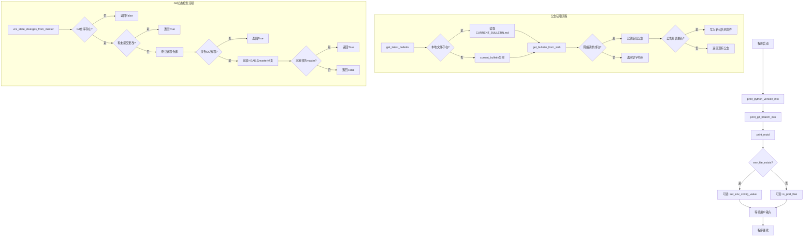

## 类结构

```
该文件为工具模块文件，无类定义
所有功能以模块级函数形式提供
全局变量: logger, ENV_FILE_PATH
类型变量: P (ParamSpec), T (TypeVar)
```

## 全局变量及字段


### `P`
    
类型参数，用于装饰器类型提示

类型：`ParamSpec`
    


### `T`
    
类型变量，用于装饰器类型提示

类型：`TypeVar`
    


### `logger`
    
模块级日志记录器

类型：`logging.Logger`
    


### `ENV_FILE_PATH`
    
.env文件路径，指向项目根目录

类型：`Path`
    


    

## 全局函数及方法


### `get_bulletin_from_web`

从GitHub远程仓库获取AutoGPT公告内容（从指定的GitHub URL获取BULLETIN.md文件），成功时返回公告文本，失败时返回空字符串。

参数：此函数无参数。

返回值：`str`，返回从GitHub获取的公告内容文本，如果网络请求失败或状态码非200则返回空字符串。

#### 流程图

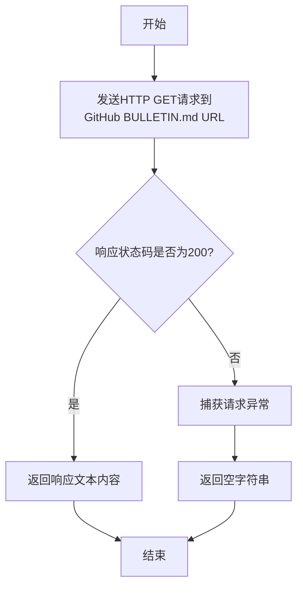

#### 带注释源码

```python
def get_bulletin_from_web():
    """
    从GitHub远程获取AutoGPT公告内容
    
    该函数尝试从GitHub仓库获取最新的公告文件(BULLETIN.md)。
    如果网络请求成功且返回状态码为200，则返回公告的文本内容；
    如果发生任何网络错误或异常，则静默处理并返回空字符串。
    
    返回:
        str: 公告内容文本，失败时返回空字符串
    """
    try:
        # 发送HTTP GET请求到GitHub上的BULLETIN.md文件URL
        response = requests.get(
            "https://raw.githubusercontent.com/Significant-Gravitas/AutoGPT/master/classic/original_autogpt/BULLETIN.md"  # noqa: E501
        )
        # 检查HTTP响应状态码是否为200（成功）
        if response.status_code == 200:
            # 返回响应体中的文本内容（即BULLETIN.md文件内容）
            return response.text
    except requests.exceptions.RequestException:
        # 捕获所有网络请求相关的异常（如连接超时、DNS解析失败等）
        # 静默处理异常，不记录日志，也不抛出异常
        pass

    # 请求失败或状态码非200时，返回空字符串作为默认值
    return ""
```


### `get_current_git_branch`

获取当前 Git 仓库的活跃分支名称，如果当前目录不是有效的 Git 仓库或发生错误，则返回空字符串。

参数：此函数无参数。

返回值：`str`，当前 Git 仓库的活跃分支名称，若不是有效 Git 仓库则返回空字符串。

#### 流程图

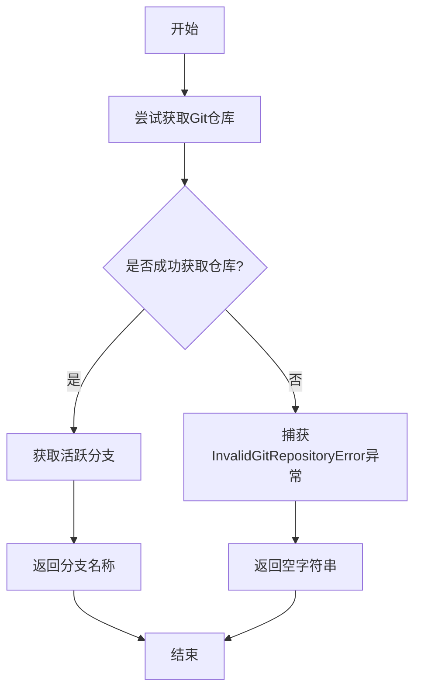

#### 带注释源码

```python
def get_current_git_branch() -> str:
    """
    获取当前Git仓库的活跃分支名称。
    
    Returns:
        str: 当前活跃分支的名称。如果当前目录不是有效的Git仓库，
             或者发生任何Git相关错误，则返回空字符串。
    """
    try:
        # 使用GitPython库的Repo类搜索父目录中的Git仓库
        # search_parent_directories=True会向上搜索直到找到.git目录
        repo = Repo(search_parent_directories=True)
        
        # 获取当前活跃的分支对象
        branch = repo.active_branch
        
        # 返回分支的名称（字符串形式）
        return branch.name
    except InvalidGitRepositoryError:
        # 当当前目录不是Git仓库或无法访问时捕获此异常
        # 返回空字符串作为默认值，避免程序中断
        return ""
```

#### 相关上下文信息

该函数在代码中被 `print_git_branch_info` 调用，用于在启动时检查用户是否运行在非 master 分支上，并向用户发出警告。


### `vcs_state_diverges_from_master`

该函数用于判断当前代码库是否与远程 master 分支存在差异，通过检查未提交的更改、远程仓库配置以及本地提交是否领先于原始 AutoGPT 的 master 分支来确定代码状态是否 divergence。

参数：无需参数

返回值：`bool`，返回 `True` 表示本地代码与 master 分支存在差异（包括有未提交的更改、远程仓库配置缺失或本地领先于远程 master），返回 `False` 表示代码与 master 保持同步或不存在 git 仓库。

#### 流程图

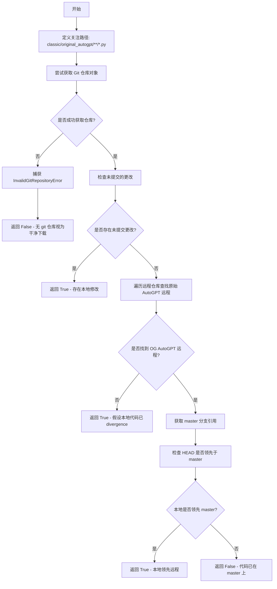

#### 带注释源码

```python
def vcs_state_diverges_from_master() -> bool:
    """
    Returns whether a git repo is present and contains changes that are not in `master`.
    """
    # 定义需要关注的代码路径 - 只检查 classic/original_autogpt 目录下的 Python 文件
    paths_we_care_about = "classic/original_autogpt/classic/original_autogpt/**/*.py"
    try:
        # 尝试在当前目录或父目录中查找 Git 仓库
        repo = Repo(search_parent_directories=True)

        # 检查指定路径下是否存在未提交的更改（未暂存和已暂存的更改）
        uncommitted_changes = repo.index.diff(None, paths=paths_we_care_about)
        if uncommitted_changes:
            # 存在未提交更改，说明代码与 master 存在差异
            return True

        # 遍历所有远程仓库，查找原始 AutoGPT 的远程仓库
        for remote in repo.remotes:
            # 检查远程 URL 是否匹配 AutoGPT 或 Auto-GPT 仓库的各种 URL 格式
            if remote.url.endswith(
                tuple(
                    # 所有旧/新仓库名和 HTTP(S)/Git URL 的排列组合
                    f"{prefix}{path}"
                    for prefix in ("://github.com/", "git@github.com:")
                    for path in (
                        f"Significant-Gravitas/{n}.git" for n in ("AutoGPT", "Auto-GPT")
                    )
                )
            ):
                og_remote = remote
                break
        else:
            # 未配置原始 AutoGPT 远程仓库：假设本地代码已 divergence
            return True

        # 获取远程的 master 分支引用
        master_branch = og_remote.refs.master
        # 使用 contextlib.suppress 忽略 StopIteration 异常
        with contextlib.suppress(StopIteration):
            # 尝试迭代 HEAD 到 master 之间的提交
            next(repo.iter_commits(f"HEAD..{master_branch}", paths=paths_we_care_about))
            # 如果能迭代到提交，说明本地落后于 master（这在逻辑上应该返回某种状态，但原代码只返回 True）
            # Local repo is one or more commits ahead of OG AutoGPT master branch
            return True

        # 关键代码部分已在 master 上，没有 divergence
        return False
    except InvalidGitRepositoryError:
        # 不存在 git 仓库：假设代码是干净下载的
        return False
```


### `get_git_user_email`

获取 Git 配置中的用户邮箱地址。如果不存在 Git 仓库或用户未配置邮箱，则返回空字符串。

**参数：** 无

**返回值：** `str`，Git 配置中的用户邮箱地址，若无配置则返回空字符串

#### 流程图

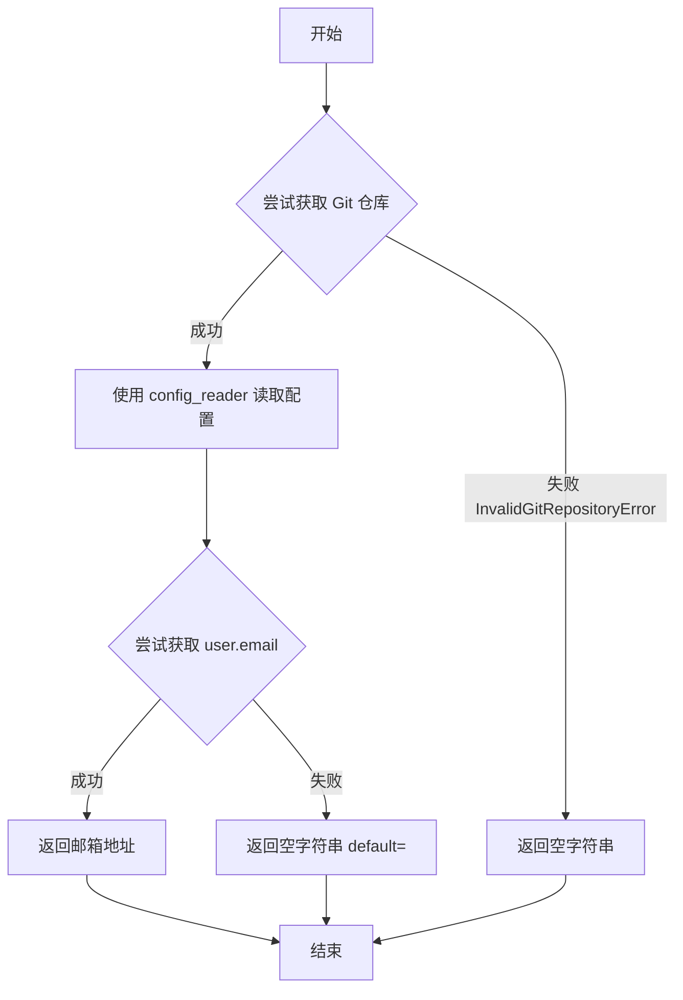

#### 带注释源码

```python
def get_git_user_email() -> str:
    """
    获取 Git 配置中的用户邮箱地址。
    
    尝试从当前目录的父目录中查找 Git 仓库，并读取用户配置中的邮箱地址。
    如果没有 Git 仓库或未配置邮箱，返回空字符串。
    
    Returns:
        str: Git 用户邮箱地址，未配置则返回空字符串
    """
    try:
        # 搜索父目录中的 Git 仓库
        repo = Repo(search_parent_directories=True)
        
        # 使用 config_reader 读取 Git 配置
        # 从 [user] 节中获取 email 键的值，若不存在则返回默认值 ""
        return cast(str, repo.config_reader().get_value("user", "email", default=""))
    except InvalidGitRepositoryError:
        # 若不存在有效的 Git 仓库，返回空字符串
        return ""
```

---

#### 补充信息

| 项目 | 说明 |
|------|------|
| **所属模块** | `git` (GitPython 库) |
| **异常处理** | 捕获 `InvalidGitRepositoryError`，当目录不是 Git 仓库时返回空字符串 |
| **依赖** | `git.Repo`, `git.InvalidGitRepositoryError`, `typing.cast` |
| **设计目标** | 提供一种安全获取 Git 用户邮箱的方式，优雅处理无仓库情况 |


### `get_latest_bulletin`

获取并比较本地与远程公告内容，判断是否存在新公告，并返回格式化的公告文本及更新状态标志。

参数：无

返回值：`tuple[str, bool]`，返回一个元组，包含格式化后的公告内容字符串和布尔值标识是否存在新公告

#### 流程图

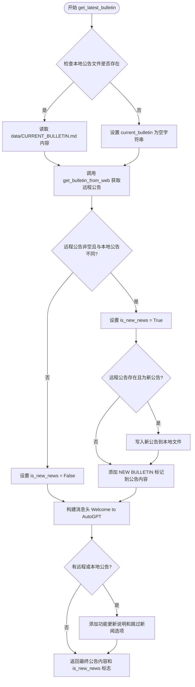

#### 带注释源码

```python
def get_latest_bulletin() -> tuple[str, bool]:
    """
    获取并比较本地与远程公告内容，判断是否存在新公告，
    并返回格式化的公告文本及更新状态标志。
    
    Returns:
        tuple[str, bool]: 
            - str: 格式化后的公告内容，包含欢迎标题和公告正文
            - bool: 是否存在新公告的标志
    """
    # 检查本地公告文件是否存在
    exists = os.path.exists("data/CURRENT_BULLETIN.md")
    current_bulletin = ""
    
    # 如果本地文件存在，则读取其内容
    if exists:
        current_bulletin = open(
            "data/CURRENT_BULLETIN.md", "r", encoding="utf-8"
        ).read()
    
    # 从远程获取最新公告
    new_bulletin = get_bulletin_from_web()
    
    # 判断是否有新公告：远程公告非空且与本地公告内容不同
    is_new_news = new_bulletin != "" and new_bulletin != current_bulletin

    # 构建欢迎标题，使用黄色前景色
    news_header = Fore.YELLOW + "Welcome to AutoGPT!\n"
    
    # 如果存在任何公告（远程或本地），添加功能更新说明
    if new_bulletin or current_bulletin:
        news_header += (
            "Below you'll find the latest AutoGPT News and feature updates!\n"
            "If you don't wish to see this message, you "
            "can run AutoGPT with the *--skip-news* flag.\n"
        )

    # 如果存在新公告，保存到本地文件并标记为新
    if new_bulletin and is_new_news:
        # 将新公告写入本地文件
        open("data/CURRENT_BULLETIN.md", "w", encoding="utf-8").write(new_bulletin)
        # 在公告内容前添加新公告标记（红色）
        current_bulletin = f"{Fore.RED}::NEW BULLETIN::{Fore.RESET}\n\n{new_bulletin}"

    # 返回格式化的公告内容和是否新公告的标志
    return f"{news_header}\n{current_bulletin}", is_new_news
```


## 详细设计文档

### `markdown_to_ansi_style`

该函数将Markdown格式的文本转换为带有ANSI转义序列颜色和样式的字符串，支持标题的高亮显示（使用Bright样式）和Heading标记的青色（Cyan）颜色渲染，同时对普通文本中的加粗标记（星号）进行转换。

参数：

- `markdown`：`str`，输入的Markdown格式文本

返回值：`str`，转换后的带有ANSI颜色样式的字符串

#### 流程图

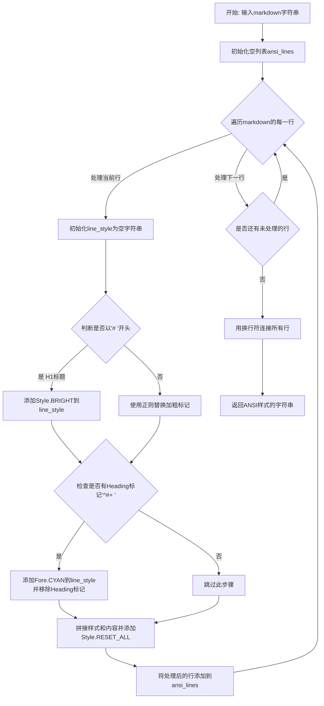

#### 带注释源码

```python
def markdown_to_ansi_style(markdown: str):
    """
    将Markdown文本转换为带ANSI颜色样式的字符串
    
    支持:
    - H1标题 (# 开头): 应用Style.BRIGHT高亮
    - 其他标题 (##, ###等): 应用Fore.CYAN青色
    - 加粗文本 (*text*): 应用Style.BRIGHT高亮
    """
    # 用于存储转换后的ANSI样式行
    ansi_lines: list[str] = []
    
    # 按行分割Markdown文本
    for line in markdown.split("\n"):
        # 初始化当前行的样式字符串
        line_style = ""

        # 判断是否为一级标题（以"# "开头）
        if line.startswith("# "):
            # 一级标题添加高亮样式
            line_style += Style.BRIGHT
        else:
            # 处理普通文本中的加粗标记（星号）
            # 正则解释:
            # (?<!\*) - 前面不是星号
            # \* - 匹配开始星号
            # (\*?[^*]+\*?) - 捕获加粗内容（可选的星号 + 非星号字符 + 可选的星号）
            # \*(?!\*) - 匹配结束星号（后面不是星号）
            line = re.sub(
                r"(?<!\*)\*(\*?[^*]+\*?)\*(?!\*)",
                rf"{Style.BRIGHT}\1{Style.NORMAL}",
                line,
            )

        # 检查是否为任意级别的标题（以一个或多个#开头后跟空格）
        # 例如: ##, ###, #### 等
        if re.match(r"^#+ ", line) is not None:
            # 添加青色前景色
            line_style += Fore.CYAN
            # 移除标题标记（如 ##, ###）
            line = re.sub(r"^#+ ", "", line)

        # 将样式应用到行首，原始内容居中，结尾添加重置样式
        # 这样可以确保每行的样式互不影响
        ansi_lines.append(f"{line_style}{line}{Style.RESET_ALL}")
    
    # 将所有行用换行符连接成最终字符串
    return "\n".join(ansi_lines)
```

---

## 关键组件信息

| 组件名称 | 一句话描述 |
|---------|-----------|
| `Style.BRIGHT` | colorama库提供的高亮/加粗文本样式 |
| `Style.NORMAL` | colorama库提供的恢复正常样式 |
| `Style.RESET_ALL` | colorama库提供的重置所有样式 |
| `Fore.CYAN` | colorama库提供的青色前景色 |
| `re.sub()` | Python正则表达式替换函数 |

---

## 潜在的技术债务或优化空间

1. **正则表达式复杂性**：当前的加粗正则表达式 `(?<!\*)\*(\*?[^*]+\*?)\*(?!\*)` 逻辑较为复杂，可能无法正确处理所有边缘情况（如嵌套星号、转义星号等）

2. **样式应用粒度**：当前实现是按行应用样式，如果需要对同一行内的不同文本片段应用不同样式，需要重构逻辑

3. **缺少错误处理**：函数没有对输入进行验证，如果输入为`None`会导致属性错误

4. **常量未提取**：样式常量（如`Style.BRIGHT`、`Fore.CYAN`）在代码中直接使用，可考虑定义为模块级常量提高可读性

5. **不支持完整的Markdown语法**：仅支持标题和加粗，代码块、链接、列表等常见Markdown元素未被处理

---

## 其它项目

### 设计目标与约束

- **目标**：将Markdown格式的公告信息（Bulletin）转换为终端可显示的带颜色文本
- **约束**：依赖于`colorama`库的ANSI转义序列支持
- **输入假设**：输入为有效的Markdown字符串

### 错误处理与异常设计

- 当前函数未包含显式的异常处理机制
- 如果`markdown`参数为`None`，调用`.split()`方法会抛出`AttributeError`
- 正则表达式在输入格式异常时可能返回意外结果

### 数据流与状态机

```
输入 Markdown 字符串
    ↓
逐行处理（for循环状态）
    ↓
检测行类型（H1/Heading/普通文本）
    ↓
应用相应ANSI样式
    ↓
添加行结束重置标记
    ↓
收集到ansi_lines列表
    ↓
输出最终字符串
```

### 外部依赖与接口契约

| 依赖模块 | 版本要求 | 用途 |
|---------|---------|------|
| `colorama` | 任意版本 | 提供`Fore`和`Style`常量 |
| `re` | Python标准库 | 正则表达式处理 |

### 调用方信息

该函数在以下位置被调用：

- `print_motd()` 函数中：用于将获取到的公告（Bulletin）Markdown文本转换为ANSI样式后输出到日志


### `get_legal_warning`

该函数返回 AutoGPT 的法律免责声明和赔偿协议文本，包含了系统使用条款、责任限制、用户监督义务以及 indemnification 条款等内容，用于在用户使用系统前展示法律警告信息。

参数：なし（无参数）

返回值：`str`，返回包含完整法律免责声明和赔偿协议的字符串内容。

#### 流程图

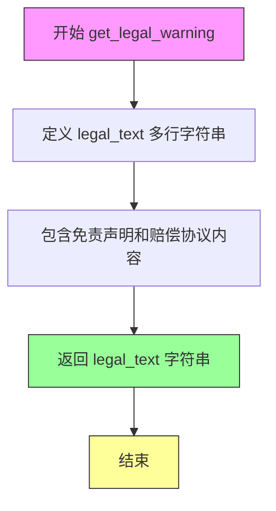

#### 带注释源码

```python
def get_legal_warning() -> str:
    """
    返回 AutoGPT 的法律免责声明和赔偿协议文本。
    
    该函数生成并返回一个包含完整法律警告信息的多行字符串，
    内容涵盖免责声明、责任限制、用户义务以及赔偿条款。
    
    Returns:
        str: 包含法律免责声明和赔偿协议的字符串
    """
    # 定义包含完整法律文本的多行字符串
    legal_text = """
## DISCLAIMER AND INDEMNIFICATION AGREEMENT
### PLEASE READ THIS DISCLAIMER AND INDEMNIFICATION AGREEMENT CAREFULLY BEFORE USING THE AUTOGPT SYSTEM. BY USING THE AUTOGPT SYSTEM, YOU AGREE TO BE BOUND BY THIS AGREEMENT.

## Introduction
AutoGPT (the "System") is a project that connects a GPT-like artificial intelligence system to the internet and allows it to automate tasks. While the System is designed to be useful and efficient, there may be instances where the System could perform actions that may cause harm or have unintended consequences.

## No Liability for Actions of the System
The developers, contributors, and maintainers of the AutoGPT project (collectively, the "Project Parties") make no warranties or representations, express or implied, about the System's performance, accuracy, reliability, or safety. By using the System, you understand and agree that the Project Parties shall not be liable for any actions taken by the System or any consequences resulting from such actions.

## User Responsibility and Respondeat Superior Liability
As a user of the System, you are responsible for supervising and monitoring the actions of the System while it is operating on your
behalf. You acknowledge that using the System could expose you to potential liability including but not limited to respondeat superior and you agree to assume all risks and liabilities associated with such potential liability.

## Indemnification
By using the System, you agree to indemnify, defend, and hold harmless the Project Parties from and against any and all claims, liabilities, damages, losses, or expenses (including reasonable attorneys' fees and costs) arising out of or in connection with your use of the System, including, without limitation, any actions taken by the System on your behalf, any failure to properly supervise or monitor the System, and any resulting harm or unintended consequences.
    """  # noqa: E501
    # 返回完整的法律文本字符串
    return legal_text
```


### `print_motd`

该函数用于获取最新公告信息，将其从 Markdown 格式转换为 ANSI 样式，然后逐行输出到日志中。如果检测到新公告，会提示用户按 Enter 键继续。

参数：

-  `logger`：`logging.Logger`，用于记录公告内容的日志记录器对象

返回值：`None`，该函数没有返回值，仅执行日志输出和用户交互

#### 流程图

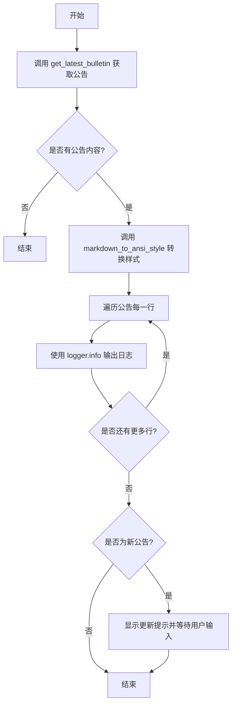

#### 带注释源码

```python
def print_motd(logger: logging.Logger):
    """格式化并打印最新公告信息到日志"""
    # 获取最新公告内容和是否为新公告的标志
    motd, is_new_motd = get_latest_bulletin()
    
    # 检查是否存在公告内容
    if motd:
        # 将 Markdown 格式转换为 ANSI 控制台样式
        motd = markdown_to_ansi_style(motd)
        
        # 逐行输出公告到日志
        for motd_line in motd.split("\n"):
            logger.info(
                extra={
                    "title": "NEWS:",
                    "title_color": Fore.GREEN,
                    "preserve_color": True,
                },
                msg=motd_line,
            )
        
        # 如果检测到新公告，提示用户按回车键继续
        if is_new_motd:
            input(
                Fore.MAGENTA
                + Style.BRIGHT
                + "NEWS: Bulletin was updated! Press Enter to continue..."
                + Style.RESET_ALL
            )
```


### `print_git_branch_info`

该函数用于检查当前 Git 分支是否为非 master 分支，如果是则输出警告信息，提示用户当前运行在非支持的分支上。

参数：

- `logger`：`logging.Logger`，用于输出警告信息的日志记录器实例

返回值：`None`，该函数不返回值，仅通过 logger 输出警告信息

#### 流程图

```mermaid
flowchart TD
    A[开始] --> B[调用 get_current_git_branch 获取当前分支]
    B --> C{分支名称存在且<br/>分支名称 ≠ 'master'}
    C -->|是| D[使用 logger.warning<br/>输出警告信息:<br/>'You are running on<br/>`{git_branch}` branch<br/>- this is not a supported branch.']
    C -->|否| E[结束]
    D --> E
```

#### 带注释源码

```python
def print_git_branch_info(logger: logging.Logger):
    """
    打印当前 Git 分支信息，如果当前分支非 master 则输出警告
    
    参数:
        logger: logging.Logger 实例，用于记录警告信息
    返回:
        无返回值
    """
    # 获取当前 Git 分支名称
    git_branch = get_current_git_branch()
    
    # 检查分支是否存在且分支名称不为 master
    if git_branch and git_branch != "master":
        # 输出警告日志，提示用户当前运行在非支持的分支上
        logger.warning(
            f"You are running on `{git_branch}` branch"
            " - this is not a supported branch."
        )
```


### `print_python_version_info`

检查当前 Python 运行环境版本，若版本低于 3.10 则通过日志记录器输出错误警告信息，提醒用户考虑升级 Python 版本以避免兼容性问题。

参数：

- `logger`：`logging.Logger`，日志记录器实例，用于输出版本过低的警告信息

返回值：`None`，该函数不返回任何值，仅执行日志输出操作

#### 流程图

```mermaid
flowchart TD
    A[开始] --> B{检查 Python 版本}
    B -->|sys.version_info >= (3, 10)| C[不做任何操作]
    B -->|sys.version_info < (3, 10)| D[输出错误日志警告]
    D --> C
    C --> E[结束]
```

#### 带注释源码

```python
def print_python_version_info(logger: logging.Logger):
    """
    检查 Python 版本，若低于 3.10 则输出警告日志
    
    参数:
        logger: logging.Logger 实例，用于记录错误级别的日志信息
    返回:
        None: 该函数仅执行日志输出，不返回任何值
    """
    # 获取当前 Python 版本信息并与 3.10 进行比较
    if sys.version_info < (3, 10):
        # 当版本低于 3.10 时，通过 logger.error 输出警告信息
        logger.error(
            "WARNING: You are running on an older version of Python. "
            "Some people have observed problems with certain "
            "parts of AutoGPT with this version. "
            "Please consider upgrading to Python 3.10 or higher.",
        )
```


### `env_file_exists`

检查项目根目录是否存在 .env 配置文件。

参数：

- （无参数）

返回值：`bool`，如果 `.env` 文件存在于项目根目录则返回 `True`，否则返回 `False`。

#### 流程图

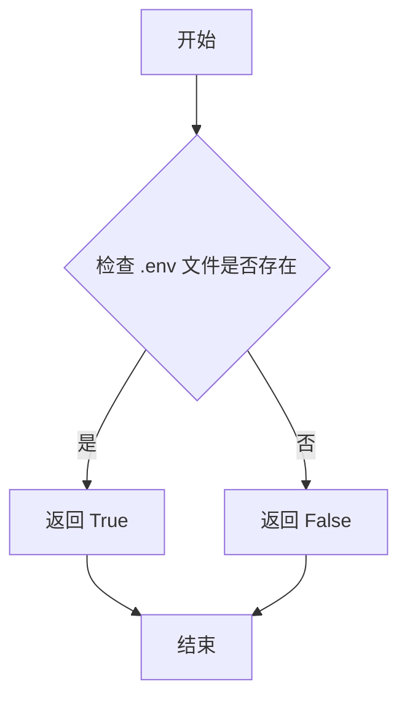

#### 带注释源码

```python
# 定义 .env 文件的路径，基于当前文件的父目录的父目录的父目录
ENV_FILE_PATH = Path(__file__).parent.parent.parent / ".env"


def env_file_exists() -> bool:
    """
    检查项目根目录是否存在 .env 配置文件。
    
    Returns:
        bool: 如果 .env 文件存在返回 True，否则返回 False
    """
    # 使用 Path 对象的 is_file() 方法检查文件是否存在且是文件类型
    return ENV_FILE_PATH.is_file()
```


### `set_env_config_value`

设置指定的环境变量并同步更新到 .env 文件，确保配置持久化。

参数：

- `key`：`str`，环境变量的键名
- `value`：`str`，要设置的环境变量值

返回值：`None`，无返回值，仅执行环境变量和文件更新操作

#### 流程图

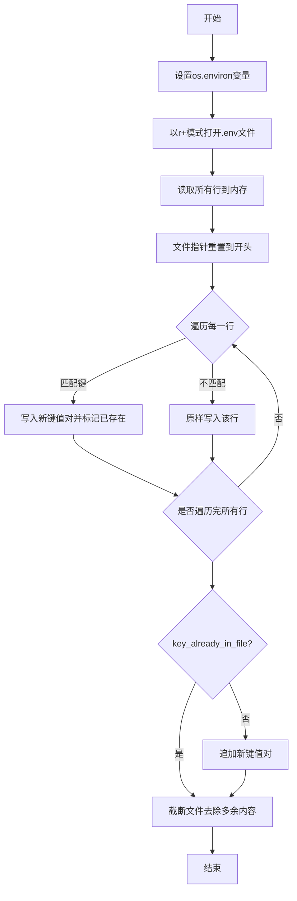

#### 带注释源码

```python
def set_env_config_value(key: str, value: str) -> None:
    """Sets the specified env variable and updates it in .env as well"""
    
    # 步骤1: 先将键值对设置到当前进程的环境变量中
    # 这样当前Python进程可以立即使用该配置
    os.environ[key] = value

    # 步骤2: 以读写模式打开.env文件
    # r+模式允许同时读取和写入，不会截断文件
    with ENV_FILE_PATH.open("r+") as file:
        
        # 步骤3: 读取所有行到内存列表
        # 保存原始文件内容用于后续处理
        lines = file.readlines()
        
        # 步骤4: 将文件指针移动到文件开头
        # 以便重新写入处理后的内容
        file.seek(0)
        
        # 初始化标记：检查key是否已存在于文件中
        key_already_in_file = False
        
        # 步骤5: 遍历文件每一行
        for line in lines:
            # 使用正则表达式匹配键名，支持可选的注释前缀(# )
            # 匹配格式: [可选空格# ]key=任意值
            if re.match(rf"^(?:# )?{key}=.*$", line):
                # 找到匹配的键，用新值替换该行
                file.write(f"{key}={value}\n")
                # 标记键已存在于文件中
                key_already_in_file = True
            else:
                # 不匹配的键，原样写入保留
                file.write(line)

        # 步骤6: 如果键不存在于原文件中
        # 在文件末尾追加新的键值对
        if not key_already_in_file:
            file.write(f"{key}={value}\n")

        # 步骤7: 截断文件
        # 重要: 如果原文件比新内容长，truncate会删除多余内容
        # 这确保文件大小与新内容匹配
        file.truncate()
```


### `is_port_free`

检测指定主机端口是否处于可用状态，通过尝试绑定端口来判断是否被占用。

参数：

- `port`：`int`，要检测的端口号
- `host`：`str`，要检测的主机地址，默认为 "127.0.0.1"

返回值：`bool`，如果端口可用返回 True，否则返回 False

#### 流程图

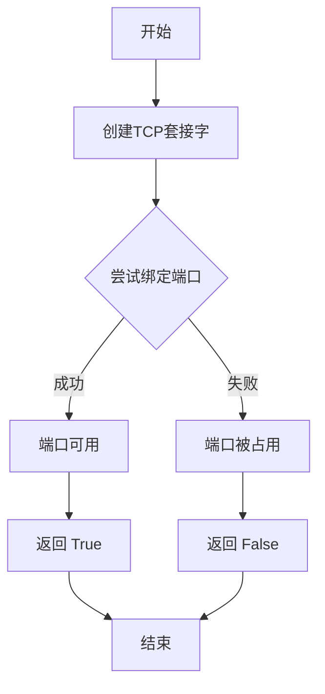

#### 带注释源码

```python
def is_port_free(port: int, host: str = "127.0.0.1"):
    """
    检测指定主机端口是否处于可用状态
    
    参数:
        port: int, 要检测的端口号
        host: str, 要检测的主机地址, 默认为 "127.0.0.1"
    
    返回:
        bool, 如果端口可用返回 True, 否则返回 False
    """
    # 创建一个IPv4 TCP套接字
    with socket.socket(socket.AF_INET, socket.SOCK_STREAM) as s:
        try:
            s.bind((host, port))  # 尝试绑定到指定的主机和端口
            return True  # 如果绑定成功, 说明端口未被占用
        except OSError:
            # 如果绑定失败(抛出OSError异常), 说明端口已被占用
            return False  # 返回False表示端口不可用
```


### `coroutine`

这是一个装饰器函数，用于将异步函数（Coroutine）包装为同步调用。它接受一个异步函数作为参数，返回一个同步函数，当调用该同步函数时，会使用 `asyncio.run()` 在新的事件循环中执行异步函数，从而实现从同步代码中调用异步函数的目的。

参数：

- `f`：`Callable[P, Coroutine[Any, Any, T]]`，要装饰的异步函数，该函数接受类型参数 `P` 指定的各种参数，返回一个 `Coroutine` 对象

返回值：`Callable[P, T]`，包装后的同步函数，该函数接受与原始异步函数相同的参数，但直接返回异步函数的最终结果（类型为 `T`），而不是返回协程对象

#### 流程图

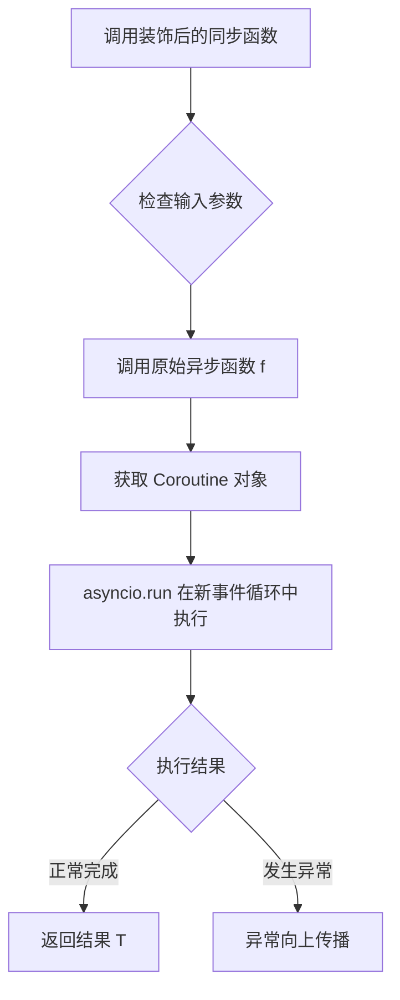

#### 带注释源码

```python
def coroutine(f: Callable[P, Coroutine[Any, Any, T]]) -> Callable[P, T]:
    """
    装饰器：将异步函数包装为同步调用
    
    参数:
        f: 要装饰的异步函数，签名符合 Callable[P, Coroutine[Any, Any, T]]
           - P: 参数规格（ParamSpec），保留原始函数的参数类型信息
           - T: 异步函数的返回类型
    
    返回:
        一个同步函数 wrapper，签名符合 Callable[P, T]
        调用时会在新的事件循环中执行异步函数并返回结果
    """
    # 使用 functools.wraps 保留原函数元数据（名称、文档字符串等）
    @functools.wraps(f)
    def wrapper(*args: P.args, **kwargs: P.kwargs):
        """
        包装函数：将异步调用转换为同步调用
        
        参数:
            *args: 位置参数，透传给原始异步函数
            **kwargs: 关键字参数，透传给原始异步函数
        
        返回:
            异步函数 f 的执行结果，类型为 T
        """
        # 使用 asyncio.run 创建新的事件循环并运行异步函数
        # 注意：每次调用都会创建新的事件循环，适用于简单场景
        return asyncio.run(f(*args, **kwargs))

    return wrapper
```

#### 使用示例

```python
# 定义一个异步函数
@coroutine
async def fetch_data(url: str) -> dict:
    async with aiohttp.ClientSession() as session:
        async with session.get(url) as response:
            return await response.json()

# 调用时如同同步函数一般
result = fetch_data("https://api.example.com/data")  # 返回 dict，无需 await
```

## 关键组件


### Bulletin/Web资讯模块

负责从GitHub获取最新公告资讯，并支持从本地文件系统读取已缓存的公告内容

### Git版本控制集成模块

提供获取当前Git分支、检测代码库是否偏离master分支、获取Git用户邮箱等版本控制相关功能

### 环境配置管理模块

负责管理环境变量配置，支持从.env文件读取配置以及动态更新环境变量和.env文件内容

### 终端样式转换模块

将Markdown格式文本转换为ANSI终端控制码，实现终端彩色高亮输出效果

### 系统信息提示模块

在程序启动时输出公告信息、Git分支警告、Python版本检查等系统状态提示

### 网络端口检测模块

提供检测指定主机端口是否已被占用的工具函数

### 异步协程装饰器模块

提供将异步函数同步调用的装饰器工具，简化异步代码的执行方式

### 法律免责声明模块

返回AutoGPT项目法律免责声明和赔偿协议文本内容


## 问题及建议


### 已知问题

-   **文件句柄未正确关闭**：在 `get_latest_bulletin()` 函数中，直接使用 `open()` 打开文件读取和写入，没有使用 `with` 语句或显式 `close()`，可能导致文件句柄泄漏
-   **网络请求缺少超时设置**：`get_bulletin_from_web()` 中使用 `requests.get()` 但未设置 timeout 参数，可能导致请求无限期等待
-   **异常处理过于宽泛**：多处使用 `except ...: pass` 的模式（如 `get_bulletin_from_web()`、`vcs_state_diverges_from_master()` 等），吞掉了实际错误信息，排查问题困难
-   **正则表达式复杂且可能存在缺陷**：`markdown_to_ansi_style()` 中的正则 `r"(?<!\*)\*(\*?[^*]+\*?)\*(?!\*)"` 逻辑复杂，可能无法正确处理所有 Markdown 格式
-   **环境变量写入存在竞态条件**：`set_env_config_value()` 直接读写 .env 文件，多进程或多线程场景下可能导致数据竞争或文件损坏
-   **重复创建 Repo 对象**：多个函数（`get_current_git_branch()`、`vcs_state_diverges_from_master()`、`get_git_user_email()`）都独立调用 `Repo(search_parent_directories=True)`，效率低下
-   **硬编码路径和 URL**：GitHub URL、文件路径（如 "data/CURRENT_BULLETIN.md"）硬编码在函数中，缺乏配置管理
-   **魔法数字和字符串**：端口检查默认 host "127.0.0.1"、路径模式 "classic/original_autogpt/classic/original_autogpt/**/*.py" 等缺乏解释性
-   **类型注解不精确**：`coroutine` 装饰器的实现对 `TypeVar` 使用不够严谨，返回值类型与实际不符
-   **日志参数依赖未文档化**：`print_motd()` 使用特定格式的 `extra` 参数，依赖于调用方日志系统的特定实现

### 优化建议

-   使用 `with` 语句管理文件操作，或考虑使用 `pathlib` 的读写方法
-   为 `requests.get()` 添加合理的 timeout 参数（如 10 秒）
-   改进异常处理，记录日志或返回更有意义的错误信息，而非静默吞掉异常
-   考虑使用成熟的 Markdown 解析库（如 `markdown`）替代自定义正则转换
-   考虑使用文件锁（如 `fcntl` 或第三方库）确保写入原子性，或使用专门的环境变量管理库（如 `python-dotenv`）
-   提取 `Repo` 创建逻辑为共享函数或缓存结果，减少重复初始化开销
-   将 URL、路径等配置提取为常量或配置文件
-   使用具名常量替代魔法数字/字符串，提高代码可读性
-   重新设计 `coroutine` 装饰器的类型注解，或使用类型安全的异步装饰器实现
-   将日志格式依赖显式化，或使用标准日志格式传递信息

## 其它


### 代码概述

该代码是一个AutoGPT项目的辅助工具模块，提供了一系列用于获取Git仓库信息、检查版本控制状态、获取公告、处理环境配置以及验证系统状态的工具函数，主要用于AutoGPT启动时的初始化检查和用户通知功能。

### 整体运行流程

该模块不包含主执行流程，而是一组工具函数的集合。主要流程如下：
1. 当AutoGPT启动时，会调用`print_motd`函数显示最新公告
2. 调用`print_git_branch_info`检查当前分支是否为支持分支
3. 调用`print_python_version_info`检查Python版本
4. 环境配置相关函数可供其他模块调用以读取/设置环境变量
5. VCS状态检查函数用于确定本地代码是否与原始仓库存在差异
6. 端口检查函数用于验证指定端口是否可用

### 全局变量详情

### logger

- **类型**: `logging.Logger`
- **描述**: 模块级别的日志记录器，用于记录模块内的操作信息

### ENV_FILE_PATH

- **类型**: `Path`
- **描述**: 指向项目根目录的.env文件路径

### P

- **类型**: `ParamSpec`
- **描述**: 用于协程装饰器的类型参数规范

### T

- **类型**: `TypeVar`
- **描述**: 用于协程装饰器的类型变量

### 全局函数详情

### get_bulletin_from_web

- **参数**:
  - 无参数
- **返回值类型**: `str`
- **返回值描述**: 返回从GitHub获取的公告文本，如果获取失败则返回空字符串
- **流程图**:

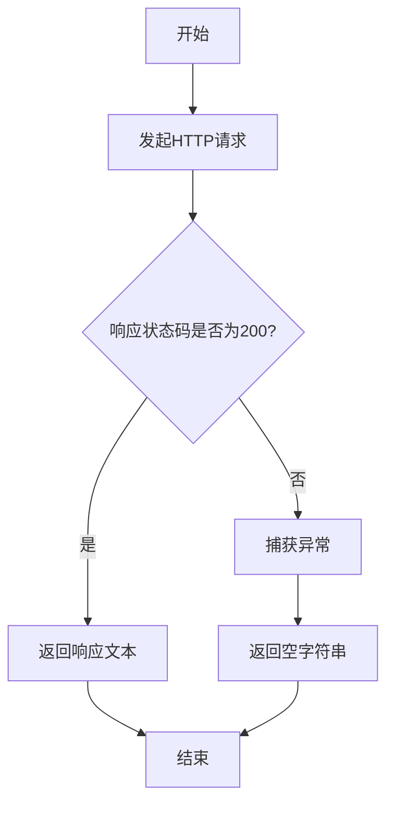

- **源码**:

```python
def get_bulletin_from_web():
    try:
        response = requests.get(
            "https://raw.githubusercontent.com/Significant-Gravitas/AutoGPT/master/classic/original_autogpt/BULLETIN.md"  # noqa: E501
        )
        if response.status_code == 200:
            return response.text
    except requests.exceptions.RequestException:
        pass

    return ""
```

### get_current_git_branch

- **参数**:
  - 无参数
- **返回值类型**: `str`
- **返回值描述**: 返回当前Git仓库的活动分支名称，如果不在Git仓库中则返回空字符串
- **流程图**:

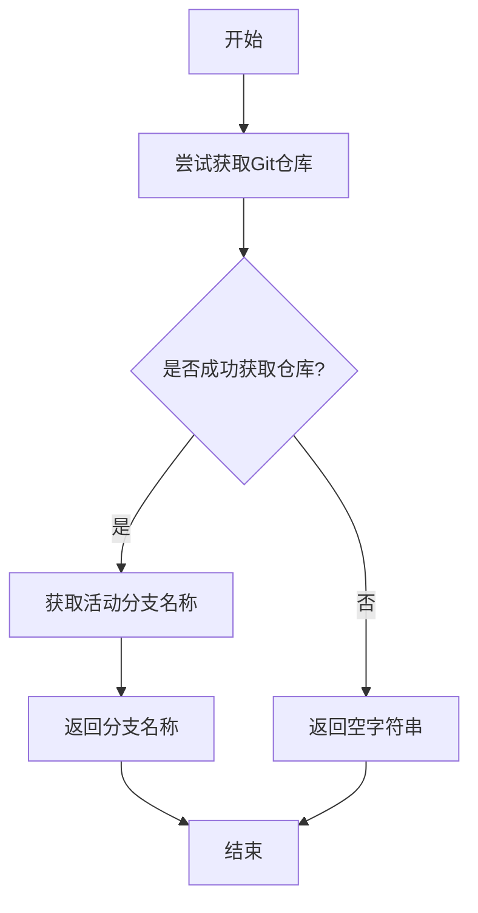

- **源码**:

```python
def get_current_git_branch() -> str:
    try:
        repo = Repo(search_parent_directories=True)
        branch = repo.active_branch
        return branch.name
    except InvalidGitRepositoryError:
        return ""
```

### vcs_state_diverges_from_master

- **参数**:
  - 无参数
- **返回值类型**: `bool`
- **返回值描述**: 返回True表示本地代码与master分支存在差异，返回False表示代码与master一致或无Git仓库
- **流程图**:

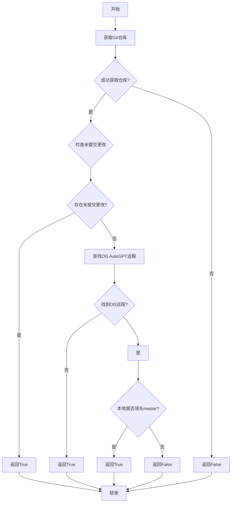

- **源码**:

```python
def vcs_state_diverges_from_master() -> bool:
    """
    Returns whether a git repo is present and contains changes that are not in `master`.
    """
    paths_we_care_about = "classic/original_autogpt/classic/original_autogpt/**/*.py"
    try:
        repo = Repo(search_parent_directories=True)

        # Check for uncommitted changes in the specified path
        uncommitted_changes = repo.index.diff(None, paths=paths_we_care_about)
        if uncommitted_changes:
            return True

        # Find OG AutoGPT remote
        for remote in repo.remotes:
            if remote.url.endswith(
                tuple(
                    # All permutations of old/new repo name and HTTP(S)/Git URLs
                    f"{prefix}{path}"
                    for prefix in ("://github.com/", "git@github.com:")
                    for path in (
                        f"Significant-Gravitas/{n}.git" for n in ("AutoGPT", "Auto-GPT")
                    )
                )
            ):
                og_remote = remote
                break
        else:
            # Original AutoGPT remote is not configured: assume local codebase diverges
            return True

        master_branch = og_remote.refs.master
        with contextlib.suppress(StopIteration):
            next(repo.iter_commits(f"HEAD..{master_branch}", paths=paths_we_care_about))
            # Local repo is one or more commits ahead of OG AutoGPT master branch
            return True

        # Relevant part of the codebase is on master
        return False
    except InvalidGitRepositoryError:
        # No git repo present: assume codebase is a clean download
        return False
```

### get_git_user_email

- **参数**:
  - 无参数
- **返回值类型**: `str`
- **返回值描述**: 返回Git配置中的用户邮箱，如果没有配置则返回空字符串
- **流程图**:

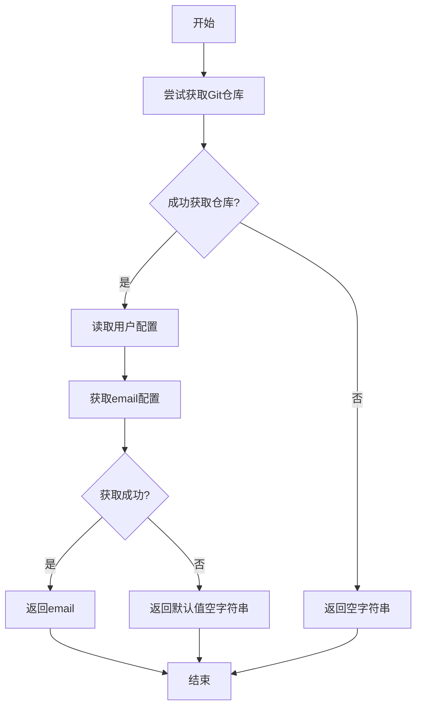

- **源码**:

```python
def get_git_user_email() -> str:
    try:
        repo = Repo(search_parent_directories=True)
        return cast(str, repo.config_reader().get_value("user", "email", default=""))
    except InvalidGitRepositoryError:
        return ""
```

### get_latest_bulletin

- **参数**:
  - 无参数
- **返回值类型**: `tuple[str, bool]`
- **返回值描述**: 返回包含公告内容和是否为新公告的元组
- **流程图**:

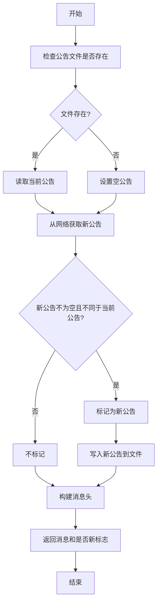

- **源码**:

```python
def get_latest_bulletin() -> tuple[str, bool]:
    exists = os.path.exists("data/CURRENT_BULLETIN.md")
    current_bulletin = ""
    if exists:
        current_bulletin = open(
            "data/CURRENT_BULLETIN.md", "r", encoding="utf-8"
        ).read()
    new_bulletin = get_bulletin_from_web()
    is_new_news = new_bulletin != "" and new_bulletin != current_bulletin

    news_header = Fore.YELLOW + "Welcome to AutoGPT!\n"
    if new_bulletin or current_bulletin:
        news_header += (
            "Below you'll find the latest AutoGPT News and feature updates!\n"
            "If you don't wish to see this message, you "
            "can run AutoGPT with the *--skip-news* flag.\n"
        )

    if new_bulletin and is_new_news:
        open("data/CURRENT_BULLETIN.md", "w", encoding="utf-8").write(new_bulletin)
        current_bulletin = f"{Fore.RED}::NEW BULLETIN::{Fore.RESET}\n\n{new_bulletin}"

    return f"{news_header}\n{current_bulletin}", is_new_news
```

### markdown_to_ansi_style

- **参数**:
  - `markdown`: `str` - 待转换的Markdown文本
- **参数类型**: `str`
- **参数描述**: 需要转换为ANSI样式的Markdown字符串
- **返回值类型**: `str`
- **返回值描述**: 转换后的ANSI样式文本字符串
- **流程图**:

```mermaid
flowchart TD
    A[开始] --> B[按行分割Markdown]
    B --> C{还有未处理行?}
    C -->|是| D[检查行样式]
    D --> E{是否为一级标题?}
    E -->|是| F[添加高亮样式]
    E -->|否| G[处理加粗标记]
    G --> H{是否有标题标记?}
    H -->|是| I[添加青色并移除标记]
    H -->|否| J[保持原样]
    I --> K[添加样式到行]
    F --> K
    J --> K
    K --> C
    C -->|否| L[合并所有行]
    L --> M[返回ANSI文本]
    M --> N[结束]
```

- **源码**:

```python
def markdown_to_ansi_style(markdown: str):
    ansi_lines: list[str] = []
    for line in markdown.split("\n"):
        line_style = ""

        if line.startswith("# "):
            line_style += Style.BRIGHT
        else:
            line = re.sub(
                r"(?<!\*)\*(\*?[^*]+\*?)\*(?!\*)",
                rf"{Style.BRIGHT}\1{Style.NORMAL}",
                line,
            )

        if re.match(r"^#+ ", line) is not None:
            line_style += Fore.CYAN
            line = re.sub(r"^#+ ", "", line)

        ansi_lines.append(f"{line_style}{line}{Style.RESET_ALL}")
    return "\n".join(ansi_lines)
```

### get_legal_warning

- **参数**:
  - 无参数
- **返回值类型**: `str`
- **返回值描述**: 返回法律免责声明和赔偿协议的完整文本
- **流程图**:

```mermaid
flowchart TD
    A[开始] --> B[返回预设的法律文本]
    B --> C[结束]
```

- **源码**:

```python
def get_legal_warning() -> str:
    legal_text = """
## DISCLAIMER AND INDEMNIFICATION AGREEMENT
### PLEASE READ THIS DISCLAIMER AND INDEMNIFICATION AGREEMENT CAREFULLY BEFORE USING THE AUTOGPT SYSTEM. BY USING THE AUTOGPT SYSTEM, YOU AGREE TO BE BOUND BY THIS AGREEMENT.

## Introduction
AutoGPT (the "System") is a project that connects a GPT-like artificial intelligence system to the internet and allows it to automate tasks. While the System is designed to be useful and efficient, there may be instances where the System could perform actions that may cause harm or have unintended consequences.

## No Liability for Actions of the System
The developers, contributors, and maintainers of the AutoGPT project (collectively, the "Project Parties") make no warranties or representations, express or implied, about the System's performance, accuracy, reliability, or safety. By using the System, you understand and agree that the Project Parties shall not be liable for any actions taken by the System or any consequences resulting from such actions.

## User Responsibility and Respondeat Superior Liability
As a user of the System, you are responsible for supervising and monitoring the actions of the System while it is operating on your
behalf. You acknowledge that using the System could expose you to potential liability including but not limited to respondeat superior and you agree to assume all risks and liabilities associated with such potential liability.

## Indemnification
By using the System, you agree to indemnify, defend, and hold harmless the Project Parties from and against any and all claims, liabilities, damages, losses, or expenses (including reasonable attorneys' fees and costs) arising out of or in connection with your use of the System, including, without limitation, any actions taken by the System on your behalf, any failure to properly supervise or monitor the System, and any resulting harm or unintended consequences.
    """  # noqa: E501
    return legal_text
```

### print_motd

- **参数**:
  - `logger`: `logging.Logger` - 用于输出信息的日志记录器
- **参数类型**: `logging.Logger`
- **参数描述**: 用于记录MOTD信息的日志记录器实例
- **返回值类型**: `None`
- **返回值描述**: 无返回值，仅输出信息到日志
- **流程图**:

```mermaid
flowchart TD
    A[开始] --> B[获取最新公告]
    B --> C{公告内容是否存在?}
    C -->|是| D[转换为ANSI样式]
    C -->|否| E[结束]
    D --> F[逐行输出到日志]
    F --> G{是否为新公告?}
    G -->|是| H[提示用户按回车继续]
    G -->|否| I[结束]
    H --> I
```

- **源码**:

```python
def print_motd(logger: logging.Logger):
    motd, is_new_motd = get_latest_bulletin()
    if motd:
        motd = markdown_to_ansi_style(motd)
        for motd_line in motd.split("\n"):
            logger.info(
                extra={
                    "title": "NEWS:",
                    "title_color": Fore.GREEN,
                    "preserve_color": True,
                },
                msg=motd_line,
            )
        if is_new_motd:
            input(
                Fore.MAGENTA
                + Style.BRIGHT
                + "NEWS: Bulletin was updated! Press Enter to continue..."
                + Style.RESET_ALL
            )
```

### print_git_branch_info

- **参数**:
  - `logger`: `logging.Logger` - 用于输出警告的日志记录器
- **参数类型**: `logging.Logger`
- **参数描述**: 用于记录分支警告信息的日志记录器实例
- **返回值类型**: `None`
- **返回值描述**: 无返回值，仅输出警告到日志
- **流程图**:

```mermaid
flowchart TD
    A[开始] --> B[获取当前Git分支]
    B --> C{分支存在且不是master?}
    C -->|是| D[输出警告日志]
    C -->|否| E[结束]
    D --> E
```

- **源码**:

```python
def print_git_branch_info(logger: logging.Logger):
    git_branch = get_current_git_branch()
    if git_branch and git_branch != "master":
        logger.warning(
            f"You are running on `{git_branch}` branch"
            " - this is not a supported branch."
        )
```

### print_python_version_info

- **参数**:
  - `logger`: `logging.Logger` - 用于输出错误的日志记录器
- **参数类型**: `logging.Logger`
- **参数描述**: 用于记录版本警告信息的日志记录器实例
- **返回值类型**: `None`
- **返回值描述**: 无返回值，仅输出错误到日志
- **流程图**:

```mermaid
flowchart TD
    A[开始] --> B[检查Python版本]
    B --> C{版本低于3.10?}
    C -->|是| D[输出错误日志]
    C -->|否| E[结束]
    D --> E
```

- **源码**:

```python
def print_python_version_info(logger: logging.Logger):
    if sys.version_info < (3, 10):
        logger.error(
            "WARNING: You are running on an older version of Python. "
            "Some people have observed problems with certain "
            "parts of AutoGPT with this version. "
            "Please consider upgrading to Python 3.10 or higher.",
        )
```

### env_file_exists

- **参数**:
  - 无参数
- **返回值类型**: `bool`
- **返回值描述**: 返回True表示.env文件存在，返回False表示不存在
- **流程图**:

```mermaid
flowchart TD
    A[开始] --> B[检查文件是否存在]
    B --> C[返回结果]
    C --> D[结束]
```

- **源码**:

```python
def env_file_exists() -> bool:
    return ENV_FILE_PATH.is_file()
```

### set_env_config_value

- **参数**:
  - `key`: `str` - 环境变量名称
  - `value`: `str` - 环境变量值
- **参数类型**: `str, str`
- **参数描述**: key为要设置的环境变量名称，value为对应的值
- **返回值类型**: `None`
- **返回值描述**: 无返回值，仅设置环境变量并更新.env文件
- **流程图**:

```mermaid
flowchart TD
    A[开始] --> B[设置环境变量]
    B --> C[打开.env文件]
    C --> D[读取所有行]
    D --> E{找到对应key?}
    E -->|是| F[更新该行]
    E -->|否| G{key已在文件中?}
    G -->|否| H[追加新行]
    G -->|是| I[跳过]
    F --> J[写入所有行]
    H --> J
    I --> J
    J --> K[截断文件]
    K --> L[结束]
```

- **源码**:

```python
def set_env_config_value(key: str, value: str) -> None:
    """Sets the specified env variable and updates it in .env as well"""
    os.environ[key] = value

    with ENV_FILE_PATH.open("r+") as file:
        lines = file.readlines()
        file.seek(0)
        key_already_in_file = False
        for line in lines:
            if re.match(rf"^(?:# )?{key}=.*$", line):
                file.write(f"{key}={value}\n")
                key_already_in_file = True
            else:
                file.write(line)

        if not key_already_in_file:
            file.write(f"{key}={value}\n")

        file.truncate()
```

### is_port_free

- **参数**:
  - `port`: `int` - 要检查的端口号
  - `host`: `str` - 主机地址，默认为"127.0.0.1"
- **参数类型**: `int, str`
- **参数描述**: port为要检查的端口号，host为目标主机地址
- **返回值类型**: `bool`
- **返回值描述**: 返回True表示端口可用，返回False表示端口已被占用
- **流程图**:

```mermaid
flowchart TD
    A[开始] --> B[创建TCP套接字]
    B --> C[尝试绑定端口]
    C --> D{绑定成功?}
    D -->|是| E[返回True]
    D -->|否| F[返回False]
    E --> G[结束]
    F --> G
```

- **源码**:

```python
def is_port_free(port: int, host: str = "127.0.0.1"):
    with socket.socket(socket.AF_INET, socket.SOCK_STREAM) as s:
        try:
            s.bind((host, port))  # Try to bind to the port
            return True  # If successful, the port is free
        except OSError:
            return False  # If failed, the port is likely in use
```

### coroutine

- **参数**:
  - `f`: `Callable[P, Coroutine[Any, Any, T]]` - 要装饰的异步函数
- **参数类型**: `Callable[P, Coroutine[Any, Any, T]]`
- **参数描述**: 一个异步函数，作为装饰器的输入
- **返回值类型**: `Callable[P, T]`
- **返回值描述**: 返回一个同步包装函数，执行异步函数并返回结果
- **流程图**:

```mermaid
flowchart TD
    A[开始] --> B[接收异步函数]
    B --> C[创建wrapper函数]
    C --> D[使用asyncio.run执行]
    D --> E[返回结果]
    E --> F[结束]
```

- **源码**:

```python
def coroutine(f: Callable[P, Coroutine[Any, Any, T]]) -> Callable[P, T]:
    @functools.wraps(f)
    def wrapper(*args: P.args, **kwargs: P.kwargs):
        return asyncio.run(f(*args, **kwargs))

    return wrapper
```

### 关键组件信息

### Git仓库操作组件

- **名称**: Git操作工具集
- **描述**: 使用GitPython库进行Git仓库的版本控制状态检查、分支获取和用户配置读取

### 公告系统组件

- **名称**: 公告获取与显示系统
- **描述**: 从远程获取AutoGPT最新公告并支持本地缓存和更新提示

### 环境配置管理组件

- **名称**: .env配置文件管理器
- **描述**: 负责读取和写入环境变量到.env配置文件，支持配置的持久化

### Markdown转ANSI样式组件

- **名称**: Markdown渲染器
- **描述**: 将Markdown格式的公告文本转换为带ANSI颜色代码的终端显示样式

### 网络请求组件

- **名称**: 公告HTTP客户端
- **描述**: 使用requests库从GitHub获取最新公告的HTTP客户端

### 设计目标与约束

### 设计目标

1. **模块化设计**: 将不同功能分离为独立函数，便于维护和测试
2. **容错性**: 所有外部调用（网络请求、文件系统操作、Git操作）都包含异常处理
3. **用户体验**: 通过MOTD和颜色输出提供友好的启动体验
4. **配置持久化**: 支持环境变量的动态配置和持久化存储

### 技术约束

1. **Python版本要求**: 最低支持Python 3.10
2. **依赖管理**: 依赖requests、gitpython、colorama等第三方库
3. **网络依赖**: 公告功能需要可访问GitHub
4. **文件系统依赖**: 需要可写的.env文件和数据目录

### 错误处理与异常设计

### 异常处理策略

1. **网络请求异常**: 使用try-except捕获`requests.exceptions.RequestException`，静默返回空字符串
2. **Git仓库异常**: 捕获`InvalidGitRepositoryError`，返回安全的默认值（空字符串或False）
3. **文件系统异常**: 未显式处理文件读写异常，可能导致未捕获的IOError
4. **端口绑定异常**: 捕获OSError并返回布尔值表示端口状态

### 建议改进

1. 文件操作应使用上下文管理器并添加异常处理
2. 考虑添加日志记录而非静默失败
3. 网络请求应添加超时参数

### 数据流与状态机

### 主要数据流

1. **公告数据流**: GitHub URL → HTTP请求 → 响应文本 → 本地缓存/用户显示
2. **环境配置流**: 用户输入 → 内存变量 → .env文件持久化
3. **Git状态流**: 本地仓库 → 分支/提交检查 → 差异报告

### 状态说明

- **Git仓库状态**: 存在/不存在、未修改/已修改、同步/领先/落后master
- **公告状态**: 无公告/有公告、新公告/旧公告
- **端口状态**: 空闲/占用

### 外部依赖与接口契约

### 外部依赖

1. **requests**: 用于HTTP请求获取公告
2. **gitpython**: 用于Git仓库操作
3. **colorama**: 用于终端颜色输出
4. **asyncio**: 用于协程装饰器
5. **pathlib**: 用于路径操作

### 接口契约

1. **get_bulletin_from_web**: 无参数，返回公告字符串或空字符串
2. **get_current_git_branch**: 无参数，返回分支名或空字符串
3. **vcs_state_diverges_from_master**: 无参数，返回布尔值
4. **set_env_config_value**: 参数key和value为字符串，无返回值
5. **is_port_free**: 参数port为整数，host为字符串，返回布尔值

### 安全性考虑

1. **环境变量泄露风险**: .env文件可能包含敏感信息，需确保文件权限设置正确
2. **网络请求安全**: 建议添加HTTPS证书验证
3. **文件写入安全**: set_env_config_value直接写入文件，存在竞态条件风险

### 性能考虑

1. **网络请求阻塞**: get_bulletin_from_web和get_latest_bulletin在主线程执行，可能阻塞启动
2. **Git操作性能**: vcs_state_diverges_from_master进行远程比对，可能较慢
3. **建议**: 考虑将网络和Git操作异步化

### 测试相关

### 单元测试建议

1. 为每个工具函数编写单元测试
2. 使用mock模拟网络请求和文件系统操作
3. 测试边界条件（如空字符串、异常情况）
4. 测试端口检查功能的正确性

### 部署相关

### 部署要求

1. 确保Python环境为3.10或更高版本
2. 安装所需依赖：pip install requests gitpython colorama
3. 确保项目根目录存在可写的.env文件
4. 确保data目录存在用于缓存公告

### 维护建议

1. 考虑将硬编码的GitHub URL提取为配置项
2. 添加日志记录以便排查问题
3. 定期更新依赖库版本
4. 考虑将大型文本（如法律警告）移至单独文件

### 潜在的技术债务或优化空间

1. **文件操作未使用上下文管理器**: get_latest_bulletin中的文件操作可以直接使用with语句
2. **硬编码路径**: 多个地方使用硬编码路径（如"data/CURRENT_BULLETIN.md"），应统一管理
3. **缺少超时设置**: HTTP请求和端口检查缺少超时参数
4. **正则表达式编译**: 多次使用的正则表达式应预编译以提高性能
5. **类型注解不完整**: 部分函数缺少返回类型注解
6. **魔法字符串**: 多个地方使用硬编码字符串，应提取为常量
7. **异步支持缺失**: 建议将阻塞操作改为异步以提升性能
8. **日志记录不足**: 很多失败场景静默处理，建议增加日志记录


    