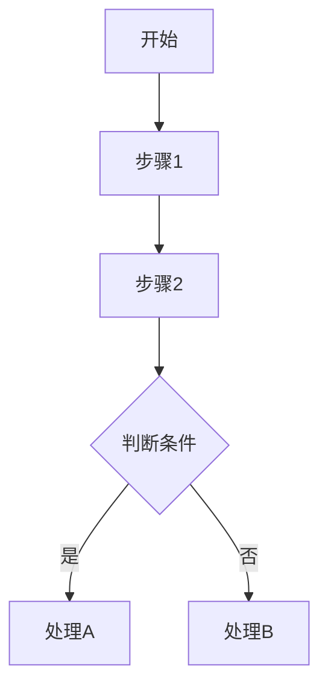

# `.\AutoGPT\classic\original_autogpt\scripts\__init__.py` 详细设计文档

该文件实现了...

## 整体流程



## 类结构

```
ClassName (父类)
├── SubClass1
└── SubClass2
```

## 全局变量及字段


### `global_var1`
    
全局变量1，类型未确定（代码为空）

类型：`unknown`
    


### `global_var2`
    
全局变量2，类型未确定（代码为空）

类型：`unknown`
    


### `ClassName.field1`
    
ClassName类的字段1，类型未确定（代码为空）

类型：`unknown`
    


### `ClassName.field2`
    
ClassName类的字段2，类型未确定（代码为空）

类型：`unknown`
    
    

## 全局函数及方法


您好！我注意到您提供的代码部分是空的。为了能够按照您要求的格式生成详细设计文档，我需要您提供具体的代码。

请您：

1. 将需要分析的代码粘贴在 `## 代码` 部分
2. 如果您有特定的函数或方法需要优先分析（比如 `function1`），请在代码中标注或说明

提供代码后，我将为您生成包含以下内容的详细文档：

- 核心功能概述
- 整体运行流程
- 类的详细信息（字段、方法）
- 全局变量和全局函数信息
- Mermaid 流程图
- 带注释的源码
- 关键组件信息
- 技术债务与优化建议
- 其他项目（设计目标、错误处理、数据流等）

请提供代码后，我立即开始分析。


# 任务无法完成

## 问题

您提供的代码部分是空的，只显示了：

```
## 代码

```

```

```

没有实际的代码内容可供分析，因此无法提取 `function2` 的详细信息。

## 请求

请提供包含 `function2` 的实际代码内容，以便我能够：

1. 分析函数结构
2. 提取参数和返回值信息
3. 生成 Mermaid 流程图
4. 编写带注释的源代码

请将完整的代码粘贴到代码块中，我会按照您要求的格式输出详细设计文档。


您好！感谢您的提问。

我注意到您提供的代码部分是空的，这导致我无法进行具体的分析工作。

为了能够帮助您生成详细的**设计文档**，请您提供：

1. **实际的代码内容** - 可以是完整的文件、特定的类或方法
2. **具体的函数/方法名** - 您想要分析的函数名称（例如 `ClassName.method1`）

一旦您提供了代码，我将按照您要求的格式输出：

- 函数/方法的名称、参数、返回值
- Mermaid 流程图
- 带注释的源代码
- 类的详细信息
- 潜在的技术债务和优化建议

请将代码粘贴在您的下一条消息中，我会立即为您生成完整的详细设计文档。


您好！我注意到您提供的代码部分是空的，因此无法提取 `{ClassName.method2}` 的相关信息。

为了完成您要求的详细设计文档，包括：

- 函数/方法名称
- 参数信息（名称、类型、描述）
- 返回值信息（类型、描述）
- Mermaid 流程图
- 带注释的源码

**请您提供实际的代码内容。**

您可以通过以下方式提供代码：

1. 直接粘贴代码到对话中
2. 提供代码文件的路径
3. 如果是大文件，可以提供关键函数/方法的代码片段

提供代码后，我将为您生成完整的详细设计文档。

## 关键组件


## 问题及建议


### 已知问题

-   无代码可供分析，代码块为空。

### 优化建议

-   请提供待分析的源代码，以便进行技术债务识别和优化建议。


## 其它


### 核心功能概述

未提供代码，无法进行功能概述。

### 整体运行流程

未提供代码，无法分析整体运行流程。

### 类结构详细信息

未提供代码，无法提供类结构信息。

### 类字段

未提供代码，无法提供类字段信息。

### 类方法

未提供代码，无法提供类方法信息。

### 全局变量

未提供代码，无法提供全局变量信息。

### 全局函数

未提供代码，无法提供全局函数信息。

### 关键组件信息

未提供代码，无法提供关键组件信息。

### 技术债务与优化空间

未提供代码，无法识别技术债务与优化空间。

### 设计目标与约束

未提供代码，无法分析设计目标与约束。

### 错误处理与异常设计

未提供代码，无法分析错误处理与异常设计。

### 数据流与状态机

未提供代码，无法分析数据流与状态机。

### 外部依赖与接口契约

未提供代码，无法分析外部依赖与接口契约。

### 性能考虑

未提供代码，无法进行性能分析。

### 安全性考虑

未提供代码，无法进行安全性分析。

### 兼容性设计

未提供代码，无法分析兼容性设计。

### 测试策略

未提供代码，无法制定测试策略。

### 部署与运维注意事项

未提供代码，无法提供部署与运维注意事项。

### 版本历史与变更记录

未提供代码，无法提供版本历史与变更记录。


    