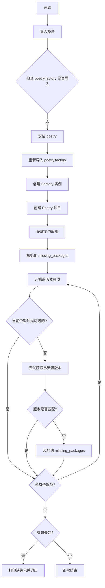

# `.\AutoGPT\classic\original_autogpt\scripts\check_requirements.py` 详细设计文档

该脚本用于检查当前Poetry项目的主依赖项是否已安装且版本符合要求，如果不满足则报错并列出缺失的包。

## 整体流程



## 类结构

```
该代码中没有定义任何类，因此没有类层次结构。
```

## 全局变量及字段


    

## 全局函数及方法


### `main`

检查项目主依赖组中所有必需依赖是否已安装，如果有任何缺失的依赖则打印缺失列表并以错误码1退出，否则正常退出。

参数：

- 无

返回值：`None`，无返回值（函数通过`sys.exit(1)`表示失败或正常结束）

#### 流程图

```mermaid
flowchart TD
    A[开始] --> B[创建Poetry Factory实例并生成项目对象]
    B --> C[获取主依赖组 'main']
    C --> D[初始化空列表 missing_packages]
    D --> E{遍历依赖组中的每个依赖}
    E -->|是可选依赖| F[跳过, 继续下一个]
    E -->|不是可选依赖| G{尝试获取已安装版本}
    G -->|ModuleNotFoundError| H[标记为缺失]
    H --> I[添加到 missing_packages]
    G -->|成功获取版本| J{版本是否满足约束}
    J -->|满足| F
    J -->|不满足| I
    F --> E
    I --> E
    E -->|遍历完成| K{有缺失依赖?}
    K -->|是| L[打印 Missing packages: 和缺失列表]
    L --> M[sys.exit(1) 退出]
    K -->|否| N[正常结束]
```

#### 带注释源码

```python
import contextlib
import os
import sys
from importlib.metadata import version

try:
    import poetry.factory  # type: ignore # noqa
except ModuleNotFoundError:
    # 如果未安装Poetry，自动安装兼容版本
    os.system(f"{sys.executable} -m pip install 'poetry>=1.6.1,<2.0.0'")

from poetry.core.constraints.version.version import Version  # type: ignore
from poetry.factory import Factory  # type: ignore


def main():
    """
    主函数：检查项目主依赖组中所有必需依赖是否已安装
    """
    # 通过Poetry Factory创建项目对象
    poetry_project = Factory().create_poetry()
    # 获取主依赖组（通常包含核心依赖）
    dependency_group = poetry_project.package.dependency_group("main")

    # 存储缺失的依赖包
    missing_packages = []
    
    # 遍历主依赖组中的所有依赖
    for dep in dependency_group.dependencies:
        # 跳过可选依赖（optional=True的依赖）
        if dep.is_optional():
            continue
        
        # 尝试验证已安装版本是否满足约束
        # contextlib.suppress 捕获 ModuleNotFoundError（未安装）和 PackageNotFoundError
        with contextlib.suppress(ModuleNotFoundError):
            # 获取已安装版本，如果失败说明未安装
            installed_version = version(dep.name)
            # 检查已安装版本是否满足依赖约束
            if dep.constraint.allows(Version.parse(installed_version)):
                # 版本满足要求，继续检查下一个依赖
                continue
        
        # 如果上述验证失败（未安装或版本不满足），标记为缺失
        missing_packages.append(str(dep))

    # 如果存在缺失依赖，打印信息并以错误码退出
    if missing_packages:
        print("Missing packages:")
        print(", ".join(missing_packages))
        sys.exit(1)


if __name__ == "__main__":
    main()
```

## 关键组件


### Poetry工厂初始化

使用`Factory().create_poetry()`创建Poetry项目对象，用于访问项目配置和依赖信息

### 依赖组获取

通过`poetry_project.package.dependency_group("main")`获取主依赖组，遍历所有非可选依赖

### 版本验证与约束检查

使用`poetry.core.constraints.version.version.Version`解析已安装包版本，并通过`dep.constraint.allows()`方法验证版本是否满足约束条件

### 缺失包收集机制

使用列表收集不满足版本约束或未安装的包，最后统一输出报告

### 异常处理与静默抑制

使用`contextlib.suppress(ModuleNotFoundError)`静默处理包未安装的情况，避免中断检查流程


## 问题及建议


### 已知问题

-   **不安全的依赖安装方式**：使用 `os.system()` 执行 pip 安装命令存在安全风险，且未检查安装是否成功，失败时静默继续导致后续代码可能因模块未安装而失败
-   **异常抑制作为控制流**：`contextlib.suppress(ModuleNotFoundError)` 掩盖了真正的错误信息，使得调试困难，且将异常处理作为正常业务逻辑不够清晰
-   **缺少顶层异常处理**：`Factory().create_poetry()` 和 `poetry_project.package.dependency_group("main")` 没有 try-except 保护，项目配置不存在或格式错误时会抛出原始异常
-   **导入失败后未重新导入**：如果首次 `import poetry.factory` 失败并触发安装，安装完成后并未重新导入，后续代码仍会因模块不存在而失败
-   **硬编码依赖组名称**：仅检查 "main" 组，忽略了其他依赖组（如 dev、test 等），可能导致检测不完整
-   **类型注解被广泛忽略**：多处使用 `# type: ignore` 表明类型检查不完整，长期会影响代码可维护性

### 优化建议

-   使用 `subprocess.run()` 替代 `os.system()`，并检查返回码确保安装成功，安装后显式重新导入或重启脚本
-   将异常抑制替换为显式的版本检查逻辑（如 `importlib.util.find_spec`），或捕获异常后记录日志
-   为关键操作添加 try-except 块，提供友好的错误提示（如 "未找到 pyproject.toml"）
-   支持通过参数或配置指定依赖组名称，或遍历所有依赖组进行检查
-   考虑缓存已检查的包版本结果，避免重复调用 `version()` API
-   补充类型注解并逐步移除 `# type: ignore`，或使用 `# type: ignore[具体错误码]` 精确忽略特定错误


## 其它


### 设计目标与约束

该代码的核心目标是验证Python项目依赖是否已正确安装，通过Poetry管理工具检查主依赖组中的所有包是否满足版本约束。设计约束包括：仅检查非可选依赖、仅支持Poetry项目结构、需要Python 3.8+以支持importlib.metadata模块。

### 错误处理与异常设计

代码采用静默忽略策略处理ModuleNotFoundError，使用contextlib.suppress捕获该异常并标记为缺失包。对于Poetry相关异常（如项目配置错误），会向上抛出由Factory类自行处理。系统退出码1表示存在缺失依赖，0表示所有依赖满足要求。

### 外部依赖与接口契约

主要依赖包括：poetry.core.constraints.version.version.Version用于版本解析、poetry.factory.Factory用于创建Poetry项目实例、importlib.metadata.version用于获取已安装包版本。接口契约要求Poetry项目必须存在pyproject.toml文件且包含main依赖组。

### 性能考虑与优化空间

当前实现逐个检查依赖，可考虑并行化检查以提升大规模项目的验证速度。version函数的多次调用可能导致性能开销，可引入缓存机制。此外，依赖Poetry库的全量导入会带来较长的启动时间。

### 安全性考虑

代码通过os.system执行pip安装命令存在潜在的命令注入风险，建议使用subprocess.run并验证输入。自动安装Poetry的行为可能在某些CI/CD环境中产生意外副作用，应提供跳过自动安装的选项。

### 可维护性与扩展性

当前硬编码"main"依赖组名称，可通过命令行参数扩展支持其他组。缺失包的错误信息可增强显示更详细的版本对比信息。代码缺少详细的日志记录，建议引入logging模块。

### 测试策略建议

建议添加单元测试覆盖：正常依赖满足场景、缺失依赖场景、版本不匹配场景、Poetry未安装场景。可使用pytest和mock模拟version函数返回值以实现隔离测试。

    