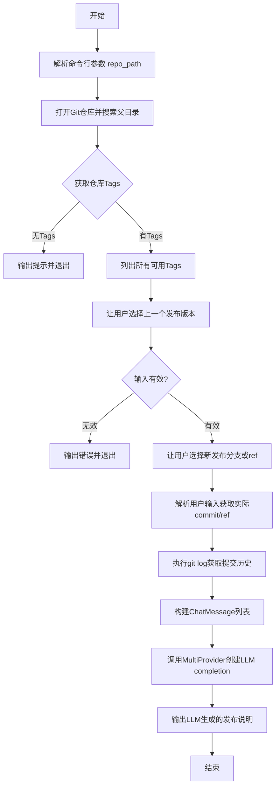
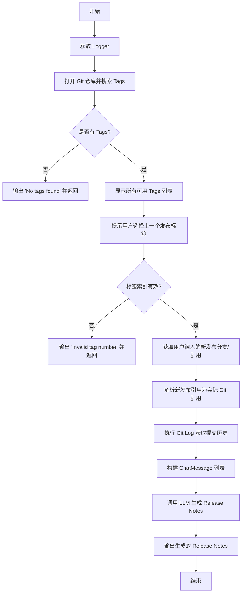
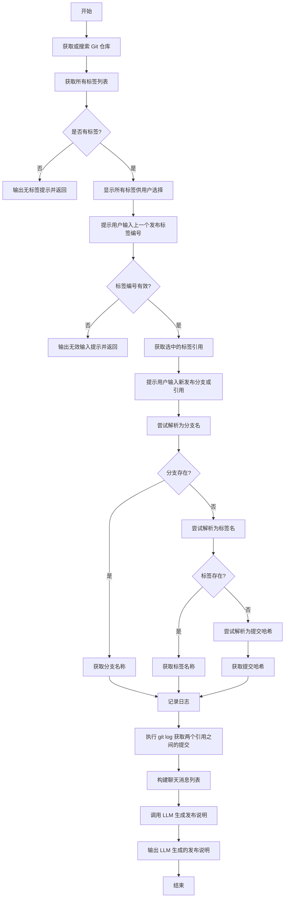
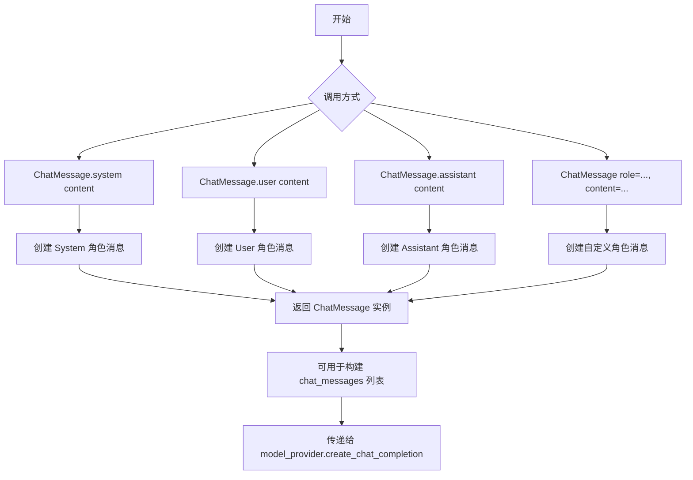
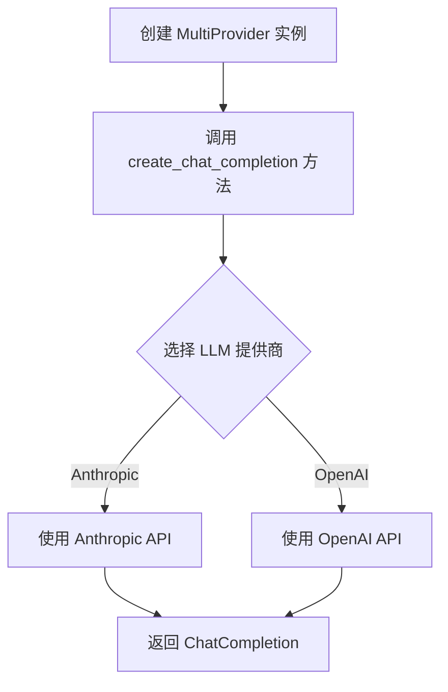

# `.\AutoGPT\classic\original_autogpt\scripts\git_log_to_release_notes.py` 详细设计文档

一个用于自动生成项目发布说明的CLI工具，通过分析Git仓库的提交历史，结合LLM（Claude 3 Opus）来生成结构化的发布笔记。

## 整体流程



## 类结构

```
无类定义，主要为脚本形式
全局函数: generate_release_notes (Click命令)
全局变量: SYSTEM_PROMPT, EXAMPLE_RELEASE_NOTES
```

## 全局变量及字段


### `EXAMPLE_RELEASE_NOTES`
    
示例发布说明的模板文本，包含新功能、架构变更和改进的示例格式，用于指导LLM生成发布说明的风格和结构

类型：`str`
    


### `SYSTEM_PROMPT`
    
用于调用LLM生成发布说明的系统提示词，包含示例发布说明和具体指令，要求LLM根据Git日志生成发布笔记

类型：`str`
    


    

## 全局函数及方法


### `generate_release_notes`

这是一个异步 Click 命令，用于通过分析 Git 仓库的两个提交点之间的提交历史，并结合 LLM 生成结构化的发布说明文档。函数首先让用户选择上一个发布标签和新发布分支/引用，然后提取 Git 日志并调用 Claude 3 Opus 模型生成符合项目规范格式的 Release Notes。

参数：

- `repo_path`：`Optional[str | Path]`，可选参数，指定 Git 仓库的路径。如果为 None，则自动搜索父目录中的 Git 仓库

返回值：`None`，函数通过 `click.echo` 直接输出交互信息和生成的发布说明，无返回值

#### 流程图



#### 带注释源码

```python
#!/usr/bin/env python3
"""
生成发布说明的 Click 命令模块
"""

import logging
from pathlib import Path
from typing import Optional

import click
from forge.llm.providers import ChatMessage, MultiProvider
from forge.llm.providers.anthropic import AnthropicModelName
from git import Repo, TagReference

from autogpt.app.utils import coroutine


@click.command()
@click.option(
    "--repo-path",
    type=click.Path(file_okay=False, exists=True),
    help="Path to the git repository",
)
@coroutine
async def generate_release_notes(repo_path: Optional[str | Path] = None):
    """
    生成发布说明的异步命令函数
    
    通过分析两个 Git 引用之间的提交历史，使用 LLM 生成结构化的发布说明
    """
    # 获取该函数的命名空间 logger，用于日志记录
    logger = logging.getLogger(generate_release_notes.name)

    # 初始化 Git 仓库对象，search_parent_directories=True 允许自动向上搜索 .git 目录
    repo = Repo(repo_path, search_parent_directories=True)
    
    # 获取仓库所有标签并转换为列表
    tags = list(repo.tags)
    
    # 检查是否存在标签
    if not tags:
        click.echo("No tags found in the repository.")
        return

    # 显示所有可用标签供用户选择
    click.echo("Available tags:")
    for index, tag in enumerate(tags):
        click.echo(f"{index + 1}: {tag.name}")

    # 提示用户输入上一个发布的标签编号
    last_release_index = (
        click.prompt("Enter the number for the last release tag", type=int) - 1
    )
    
    # 验证标签编号的有效性
    if last_release_index >= len(tags) or last_release_index < 0:
        click.echo("Invalid tag number entered.")
        return
    
    # 获取选中的标签引用对象
    last_release_tag: TagReference = tags[last_release_index]

    # 提示用户输入新发布的分支或 Git 引用，默认为当前活跃分支
    new_release_ref = click.prompt(
        "Enter the name of the release branch or git ref",
        default=repo.active_branch.name,
    )
    
    # 尝试解析用户输入的引用类型：分支 -> 标签 -> 提交哈希
    try:
        new_release_ref = repo.heads[new_release_ref].name
    except IndexError:
        try:
            new_release_ref = repo.tags[new_release_ref].name
        except IndexError:
            new_release_ref = repo.commit(new_release_ref).hexsha
    
    # 记录调试信息
    logger.debug(f"Selected release ref: {new_release_ref}")

    # 执行 Git Log 命令获取两个引用之间的所有提交（不含合并提交）
    git_log = repo.git.log(
        f"{last_release_tag.name}...{new_release_ref}",
        "classic/original_autogpt/",
        no_merges=True,
        follow=True,
    )
    logger.debug(f"-------------- GIT LOG --------------\n\n{git_log}\n")

    # 初始化多模型提供者
    model_provider = MultiProvider()
    
    # 构建聊天消息列表：系统提示 + Git 日志内容
    chat_messages = [
        ChatMessage.system(SYSTEM_PROMPT),
        ChatMessage.user(content=git_log),
    ]
    
    # 提示用户正在生成发布说明
    click.echo("Writing release notes ...")
    
    # 调用 LLM 生成发布说明，使用 Claude 3 Opus 模型
    completion = await model_provider.create_chat_completion(
        model_prompt=chat_messages,
        model_name=AnthropicModelName.CLAUDE3_OPUS_v1,
    )

    # 输出 LLM 生成的发布说明
    click.echo("-------------- LLM RESPONSE --------------\n")
    click.echo(completion.response.content)
```

---

## 关键组件信息

| 组件名称 | 一句话描述 |
|---------|-----------|
| `Repo` | GitPython 库提供的 Git 仓库操作对象，用于执行 Git 命令和访问仓库数据 |
| `TagReference` | Git 标签引用对象，包含标签名称和指向的提交 |
| `MultiProvider` | 来自 forge.llm.providers 的多模型 LLM 调用封装，支持动态选择模型 |
| `ChatMessage` | 聊天消息结构体，用于构建与 LLM 交互的消息上下文 |
| `AnthropicModelName.CLAUDE3_OPUS_v1` | Claude 3 Opus 模型标识，用于生成高质量文本 |
| `@coroutine` | 装饰器，将 Click 命令转换为异步协程支持 |

---

## 潜在的技术债务或优化空间

1. **缺少模型选择灵活性**：模型名称硬编码为 Claude 3 Opus，建议通过命令行参数或配置文件允许用户选择其他模型（如 GPT-4）

2. **错误处理不完善**：网络调用 LLM 时没有异常捕获和处理，如果 LLM 调用失败会导致程序崩溃

3. **Git Log 路径硬编码**：`"classic/original_autogpt/"` 路径硬编码在代码中，限制了函数的通用性

4. **没有输出文件选项**：仅通过 `click.echo` 输出到 stdout，建议增加 `--output` 选项保存到文件

5. **标签数量过多时体验差**：所有标签一次性列出，当仓库标签很多时不够友好，可考虑增加搜索/过滤功能

6. **SYSTEM_PROMPT 和 EXAMPLE_RELEASE_NOTES 全局定义**：这些常量应该可以通过配置文件或参数传入，提高灵活性

---

## 其它项目

### 设计目标与约束

- **设计目标**：通过自动化方式生成符合项目规范的 Release Notes，减少人工编写工作量
- **技术约束**：依赖 GitPython 库访问仓库，需要 LLM API（Claude）支持

### 错误处理与异常设计

- 使用 `try/except IndexError` 优雅处理用户输入的无效分支/标签/提交哈希
- 对无效标签编号进行边界检查并给出友好提示
- LLM 调用失败时当前无处理，可能导致未捕获异常

### 数据流与状态机

```
用户输入 repo_path 
    → Repo 对象初始化 
    → 获取 Tags 列表 
    → 用户选择 last_release_tag 
    → 用户输入 new_release_ref 
    → 引用解析（分支/标签/哈希） 
    → Git Log 提取 
    → 构建 ChatMessages 
    → LLM API 调用 
    → 输出结果
```

### 外部依赖与接口契约

- **GitPython**：用于操作 Git 仓库（`from git import Repo, TagReference`）
- **forge.llm.providers**：LLM 调用封装（`MultiProvider`, `ChatMessage`）
- **Anthropic API**：通过 `AnthropicModelName.CLAUDE3_OPUS_v1` 调用 Claude 模型
- **Click**：CLI 框架支持（`@click.command()`, `@click.option()`, `@click.prompt()`）


### `generate_release_notes`

该函数是一个异步协程，用于通过比较两个 Git 引用（标签或分支）之间的提交记录，并利用 LLM（大型语言模型）自动生成发布说明。用户需要选择上一个发布标签和新发布引用，函数会获取之间的 Git 日志并发送给 Claude 模型来生成结构化的发布说明。

参数：

- `repo_path`：`Optional[str | Path]`，Git 仓库的路径，默认为 None，会自动搜索父目录

返回值：`async coroutine`，无显式返回值（返回 None）

#### 流程图



#### 带注释源码

```python
@coroutine
async def generate_release_notes(repo_path: Optional[str | Path] = None):
    """
    生成发布说明的异步协程函数
    
    该函数通过以下步骤生成发布说明：
    1. 打开或搜索 Git 仓库
    2. 列出所有标签供用户选择上一个发布版本
    3. 获取用户输入的新发布分支或引用
    4. 执行 git log 获取两次发布之间的所有提交
    5. 调用 Claude LLM 生成结构化的发布说明
    """
    # 获取该函数的命名logger用于日志记录
    logger = logging.getLogger(generate_release_notes.name)

    # 初始化 Repo 对象，search_parent_directories=True 允许自动向上搜索父目录
    repo = Repo(repo_path, search_parent_directories=True)
    
    # 获取仓库所有标签并转换为列表
    tags = list(repo.tags)
    
    # 检查是否存在标签，如果没有则提示用户并退出
    if not tags:
        click.echo("No tags found in the repository.")
        return

    # 显示所有可用的标签供用户选择
    click.echo("Available tags:")
    for index, tag in enumerate(tags):
        click.echo(f"{index + 1}: {tag.name}")

    # 提示用户输入上一个发布版本的标签编号（减1转为列表索引）
    last_release_index = (
        click.prompt("Enter the number for the last release tag", type=int) - 1
    )
    
    # 验证用户输入的编号是否有效
    if last_release_index >= len(tags) or last_release_index < 0:
        click.echo("Invalid tag number entered.")
        return
    
    # 获取用户选择的标签引用对象
    last_release_tag: TagReference = tags[last_release_index]

    # 提示用户输入新发布的分支名或 Git 引用，默认为当前活动分支
    new_release_ref = click.prompt(
        "Enter the name of the release branch or git ref",
        default=repo.active_branch.name,
    )
    
    # 尝试将用户输入解析为有效的 Git 引用
    try:
        # 首先尝试作为分支名解析
        new_release_ref = repo.heads[new_release_ref].name
    except IndexError:
        try:
            # 分支不存在则尝试作为标签名解析
            new_release_ref = repo.tags[new_release_ref].name
        except IndexError:
            # 标签也不存在则尝试作为提交哈希解析
            new_release_ref = repo.commit(new_release_ref).hexsha
    
    # 记录选中的发布引用用于调试
    logger.debug(f"Selected release ref: {new_release_ref}")

    # 执行 git log 命令获取两次发布之间的所有提交
    # 参数说明：
    # - f"{last_release_tag.name}...{new_release_ref}"：获取两个引用之间的提交
    # - "classic/original_autogpt/"：限制只获取该目录下的提交
    # - no_merges=True：排除合并提交
    # - follow=True：跟踪文件重命名
    git_log = repo.git.log(
        f"{last_release_tag.name}...{new_release_ref}",
        "classic/original_autogpt/",
        no_merges=True,
        follow=True,
    )
    
    # 记录 git log 用于调试
    logger.debug(f"-------------- GIT LOG --------------\n\n{git_log}\n")

    # 初始化多提供者模型
    model_provider = MultiProvider()
    
    # 构建聊天消息列表，包含系统提示和用户提供的 git log
    chat_messages = [
        ChatMessage.system(SYSTEM_PROMPT),
        ChatMessage.user(content=git_log),
    ]
    
    # 提示用户正在生成发布说明
    click.echo("Writing release notes ...")
    
    # 调用 LLM 生成发布说明
    # 使用 Claude 3 Opus 模型
    completion = await model_provider.create_chat_completion(
        model_prompt=chat_messages,
        model_name=AnthropicModelName.CLAUDE3_OPUS_v1,
    )

    # 输出 LLM 生成的发布说明
    click.echo("-------------- LLM RESPONSE --------------\n")
    click.echo(completion.response.content)
```


### `TagReference`

表示 Git 仓库中的标签引用对象，用于从标签列表中获取具体的标签实例并访问其名称属性。

参数：

- `repo.tags`：标签列表的索引访问，返回 `TagReference` 类型对象

返回值：`TagReference`，Git 标签引用对象

#### 流程图

```mermaid
flowchart TD
    A[获取 repo.tags 列表] --> B[用户选择标签序号]
    B --> C[计算索引 last_release_index]
    C --> D{索引有效性检查}
    D -->|有效| E[tags[last_release_index]]
    D -->|无效| F[返回错误信息]
    E --> G[赋值给 last_release_tag: TagReference]
    G --> H[访问 tag.name 属性]
    
    style E fill:#e1f5fe
    style G fill:#e1f5fe
    style H fill:#e1f5fe
```

#### 带注释源码

```python
# 从 git 库导入 Repo 和 TagReference 类
from git import Repo, TagReference

# ... 在 generate_release_notes 函数内部 ...

# 获取仓库的所有标签
tags = list(repo.tags)

# 用户选择最后一个发布版本的序号（1-based）
last_release_index = (
    click.prompt("Enter the number for the last release tag", type=int) - 1
)

# 索引有效性检查
if last_release_index >= len(tags) or last_release_index < 0:
    click.echo("Invalid tag number entered.")
    return

# 从标签列表中通过索引获取 TagReference 对象
# TagReference 是 git 库中的类，表示 Git 仓库中的一个标签引用
# 包含了标签的名称、引用路径、以及对应的 commit 对象等信息
last_release_tag: TagReference = tags[last_release_index]

# 后续使用：
# last_release_tag.name 获取标签名称（如 "v1.0.0"）
# last_release_tag.commit 获取标签对应的提交对象
# last_release_tag.path 获取标签的引用路径（如 "refs/tags/v1.0.0"）

# 在 git log 命令中使用标签名称
git_log = repo.git.log(
    f"{last_release_tag.name}...{new_release_ref}",  # 使用 TagReference.name 属性
    "classic/original_autogpt/",
    no_merges=True,
    follow=True,
)
```


### `ChatMessage`

`ChatMessage` 是 `forge` 库中的一个消息类，用于构建与 LLM（大语言模型）交互的聊天消息。该类提供了多种消息角色（system、user、assistant）的创建方法，并包含消息内容的存储和访问功能。

参数：

- `role`：`str`，消息角色（如 "system"、"user"、"assistant"）
- `content`：`str`，消息的实际内容

返回值：`ChatMessage` 实例，表示一条聊天消息

#### 流程图



#### 带注释源码

```python
# 从 forge.llm.providers 导入 ChatMessage 类
from forge.llm.providers import ChatMessage, MultiProvider

# 使用示例（在 generate_release_notes 函数中）:
chat_messages = [
    ChatMessage.system(SYSTEM_PROMPT),    # 创建系统角色消息
    ChatMessage.user(content=git_log),     # 创建用户角色消息，content 为关键字参数
]

# ChatMessage 类的典型结构（基于使用方式推断）:
class ChatMessage:
    """用于表示聊天消息的类"""
    
    @classmethod
    def system(cls, content: str) -> "ChatMessage":
        """创建系统消息"""
        return cls(role="system", content=content)
    
    @classmethod
    def user(cls, content: str) -> "ChatMessage":
        """创建用户消息"""
        return cls(role="user", content=content)
    
    @classmethod
    def assistant(cls, content: str) -> "ChatMessage":
        """创建助手/AI消息"""
        return cls(role="assistant", content=content)
    
    def __init__(self, role: str, content: str):
        """
        初始化 ChatMessage
        
        参数:
            role: 消息角色，如 "system"、"user"、"assistant"
            content: 消息的实际内容文本
        """
        self.role = role
        self.content = content
    
    @property
    def raw_content(self) -> str:
        """获取原始内容（未解析的内容）"""
        return self._content
```

#### 关键属性

| 属性名 | 类型 | 描述 |
|--------|------|------|
| `role` | `str` | 消息角色标识（system/user/assistant） |
| `content` | `str` | 消息的实际内容 |

#### 使用场景

在代码中，`ChatMessage` 用于构建与 LLM 交互的消息列表：

```python
# 构建消息列表
chat_messages = [
    ChatMessage.system(SYSTEM_PROMPT),    # 系统提示，定义任务
    ChatMessage.user(content=git_log),    # 用户消息，传入 git log 内容
]

# 传递给模型提供者
completion = await model_provider.create_chat_completion(
    model_prompt=chat_messages,
    model_name=AnthropicModelName.CLAUDE3_OPUS_v1,
)
```


### `MultiProvider`

这是 `forge` 库中的一个 LLM 多提供商管理类，用于统一管理和调度多个 LLM 提供商（如 Anthropic、OpenAI 等）的聊天完成请求。该类会自动选择合适的提供商并处理请求。

参数：

- 无参数（构造函数）

返回值：`MultiProvider` 实例，提供 `create_chat_completion` 方法用于创建聊天完成请求

#### 流程图



#### 带注释源码

```python
# 导入 MultiProvider 类（来自 forge.llm.providers 模块）
from forge.llm.providers import ChatMessage, MultiProvider
from forge.llm.providers.anthropic import AnthropicModelName

# 实例化 MultiProvider（无构造函数参数）
model_provider = MultiProvider()

# 构建聊天消息列表
chat_messages = [
    ChatMessage.system(SYSTEM_PROMPT),    # 系统提示消息
    ChatMessage.user(content=git_log),     # 用户消息（包含 git log）
]

# 调用 create_chat_completion 方法创建聊天完成请求
# 参数：
#   - model_prompt: 聊天消息列表
#   - model_name: 模型名称（如 AnthropicModelName.CLAUDE3_OPUS_v1）
completion = await model_provider.create_chat_completion(
    model_prompt=chat_messages,
    model_name=AnthropicModelName.CLAUDE3_OPUS_v1,
)

# completion.response.content 包含 LLM 生成的响应内容
click.echo(completion.response.content)
```

## 关键组件


### 代码概述

该脚本是一个自动化发布说明生成工具，通过Git获取版本间的提交记录，并利用LLM（如Claude或GPT）智能生成结构化的发布说明文档。

### 文件运行流程

1. **入口执行**：通过`if __name__ == "__main__"`加载配置和运行环境
2. **命令注册**：Click装饰器注册`generate_release_notes`为CLI命令
3. **交互式获取Git信息**：提示用户选择上一个发布tag和新版本分支
4. **Git历史提取**：执行`git log`获取两次发布间的所有提交
5. **LLM生成**：将Git日志和提示模板发送给LLM处理
6. **输出结果**：将生成的发布说明打印到终端

### 关键组件

#### 1. Git仓库集成模块

使用`gitpython`库（`Repo`, `TagReference`）实现版本控制交互，支持获取仓库对象、标签列表、提交历史等功能。

#### 2. LLM多提供商集成

通过`MultiProvider`类调用不同的LLM服务（Claude Opus或GPT-4），使用`ChatMessage`构建对话上下文，接收AI生成的发布说明内容。

#### 3. CLI交互界面

基于`click`框架构建命令行工具，提供`--repo-path`选项、tag选择提示、新版本引用输入等交互功能。

#### 4. 提示工程系统

包含`SYSTEM_PROMPT`系统提示词和`EXAMPLE_RELEASE_NOTES`示例模板，定义了LLM生成发布说明的格式规范和风格要求。

#### 5. 日志与配置模块

集成`logging`日志系统和`configure_logging`配置功能，支持`.env`环境变量加载，提供调试级别的日志输出。

### 潜在技术债务与优化空间

1. **缺乏错误处理**：Git操作（获取tags、log）和LLM调用缺少完善的异常捕获机制
2. **硬编码模型选择**：当前仅注释掉了OpenAI模型，需实现动态模型选择
3. **交互式限制**：无法非交互式运行，自动化CI/CD流程中难以使用
4. **Git Log过滤简单**：仅使用`no_merges=True`过滤，可考虑更智能的提交过滤策略
5. **无输出重定向**：发布说明仅打印到stdout，未支持文件输出选项
6. **路径处理**：未验证repo-path的实际有效性，可能导致后续操作失败

### 其它项目

#### 设计目标

- 简化手动编写发布说明的繁琐过程
- 利用LLM能力生成结构化、规范化的发布文档

#### 约束条件

- 依赖Git仓库存在tags
- 需要有效的LLM API密钥（Anthropic Claude或OpenAI GPT）
- 交互式CLI设计，不适合无人值守运行

#### 外部依赖

- `click`: CLI框架
- `gitpython`: Git操作
- `forge.llm.providers`: LLM多提供商
- `dotenv`: 环境变量管理


## 问题及建议


### 已知问题

-   **模型选择硬编码**：模型名称被硬编码为 `AnthropicModelName.CLAUDE3_OPUS_v1`，无法通过命令行参数动态指定不同模型
-   **缺乏输入验证**：用户输入的标签索引虽然进行了范围检查，但未对非数字输入或其他异常情况进行捕获处理
-   **错误处理不完善**：多处关键操作（如 `repo.git.log`、`model_provider.create_chat_completion`）缺少 try-except 包裹，可能导致程序直接崩溃
-   **未设置退出码**：命令执行失败时未显式调用 `sys.exit()` 或设置退出码，CLI 可能返回成功的 0 状态码
-   **日志与输出混用**：同时使用 `logger` 和 `click.echo` 输出信息，缺少统一的日志级别管理和输出规范
-   **全局变量位置不当**：`SYSTEM_PROMPT` 和 `EXAMPLE_RELEASE_NOTES` 定义在文件末尾，降低了代码可读性和模块化程度
-   **类型注解不完整**：部分变量如 `repo`、`tags` 等缺少显式类型注解
-   **魔法字符串**：git 路径 `"classic/original_autogpt/"` 被硬编码在 `repo.git.log` 调用中，缺乏配置化

### 优化建议

-   添加 `--model` 或 `--model-provider` 命令行选项，允许用户选择不同的 LLM 提供商和模型
-   对所有外部交互（Git 操作、LLM 调用）添加异常处理，并返回有意义的错误信息和适当的退出码
-   将 `SYSTEM_PROMPT` 和 `EXAMPLE_RELEASE_NOTES` 移至文件顶部或单独的配置模块，提高代码结构清晰度
-   统一日志输出策略，优先使用 logging 模块，并考虑为不同级别的日志配置不同的 handler
-   为关键函数和变量补充完整的类型注解，提升代码可维护性和 IDE 支持
-   将硬编码的 git 子目录路径提取为可配置的 CLI 选项或环境变量
-   考虑将 git log 获取和 LLM 调用封装为独立的异步函数，提升代码可测试性
-   添加 `--quiet` 或 `--verbose` 选项控制输出详细程度

## 其它


### 设计目标与约束

**设计目标**：为AutoGPT项目提供一个交互式的命令行工具，用于自动生成Git版本间的发布说明（Release Notes）。通过集成LLM（Claude 3 Opus）将git log转换为结构化的发布文档。

**设计约束**：
- 依赖GitPython库进行仓库操作
- 必须使用Anthropic Claude 3 Opus模型生成内容
- 交互式CLI设计，不支持非交互式自动化调用
- 必须在Git仓库目录下运行

### 错误处理与异常设计

**主要异常场景**：
1. **无Git仓库**：Repo初始化失败时，GitPython会抛出InvalidGitRepositoryError
2. **无标签**：tags列表为空时，直接返回并提示用户
3. **无效标签序号**：用户输入超出范围的序号时，提示"Invalid tag number entered"
4. **无效分支/引用**：heads和tags中都不存在时，尝试作为commit hash处理，若也不存在则抛出IndexError

**错误处理方式**：使用try-except捕获IndexError，逐一尝试解析用户输入的引用（分支名→标签名→commit hash）

### 数据流与状态机

**数据处理流程**：
1. 初始化阶段：加载环境变量、配置日志、创建Repo对象
2. 输入阶段：列出所有标签 → 用户选择上一版本 → 用户输入新版本引用
3. 处理阶段：执行git log获取提交历史 → 构建ChatMessage列表 → 调用LLM生成内容
4. 输出阶段：打印LLM响应内容

**状态转换**：IDLE → TAGS_LISTED → LAST_RELEASE_SELECTED → NEW_RELEASE_SELECTED → GENERATING → COMPLETED

### 外部依赖与接口契约

**核心依赖**：
- `click`：CLI框架，提供@click.command()和@click.option装饰器
- `git`（GitPython）：Repo类用于Git操作，TagReference表示标签
- `forge.llm.providers`：MultiProvider类提供LLM调用能力
- `anthropic`：AnthropicModelName枚举定义可用模型
- `dotenv`：环境变量加载
- `logging`：日志记录

**接口契约**：
- generate_release_notes为异步协程，通过@coroutine装饰器适配Click
- MultiProvider.create_chat_completion()接受model_prompt、model_name参数，返回completion对象
- ChatMessage包含system/user角色，支持.content属性访问消息内容

### 性能考虑

- git log使用no_merges=True和follow=True参数过滤无关提交
- tags列表使用list()一次性加载，避免多次IO
- LLM调用为唯一网络耗时操作，无明显性能瓶颈

### 安全性考虑

- 依赖dotenv加载API密钥，需确保.env文件不被提交到版本控制
- 用户输入的分支/引用名未经严格校验，理论上存在注入风险（但仅用于本地Git操作）

### 测试策略

当前代码未包含单元测试。推荐测试场景：
1. 无Git仓库时的错误提示
2. 空标签列表的处理
3. 无效序号输入的验证
4. git log为空时的LLM响应

### 部署与运维

- 作为独立脚本运行：`python generate_release_notes.py`
- 依赖环境变量：ANTHROPIC_API_KEY（或其他LLM provider的API key）
- 无持久化状态，所有状态为会话级


    