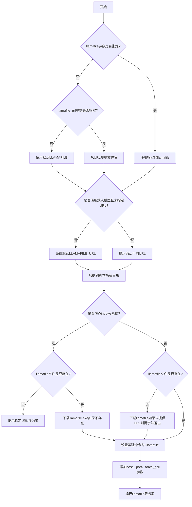
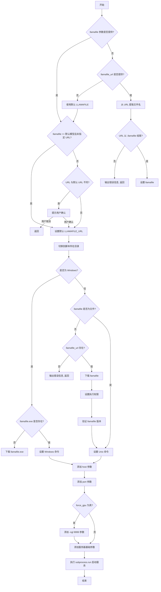
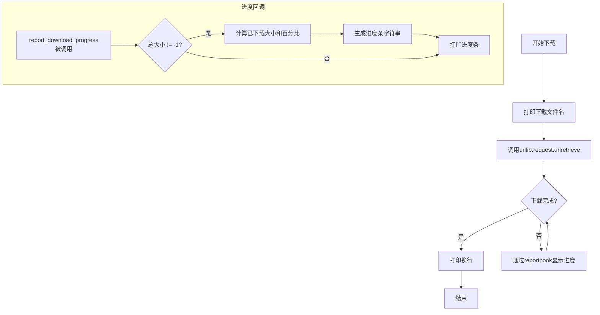
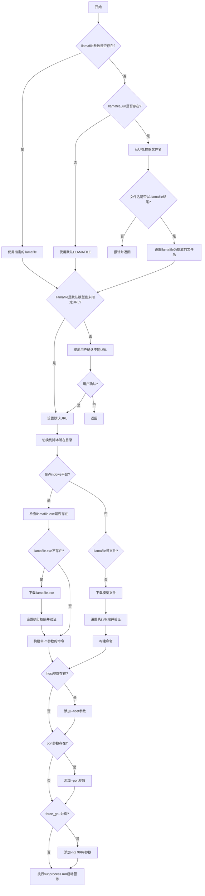

# `.\AutoGPT\classic\original_autogpt\scripts\llamafile\serve.py` 详细设计文档

该脚本用于自动下载（如果缺失）并通过llamafile启动一个量化版的Mistral-7B-Instruct-v0.2模型作为本地HTTP服务器，支持自定义模型路径、URL、监听地址、端口及GPU加速选项，适用于Windows、macOS和Linux平台。

## 整体流程



## 类结构

```
无类层次结构（该脚本仅包含模块级函数和变量）
```

## 全局变量及字段


### `LLAMAFILE`
    
默认llamafile文件名

类型：`Path`
    


### `LLAMAFILE_URL`
    
默认llamafile下载URL

类型：`str`
    


### `LLAMAFILE_EXE`
    
Windows可执行文件名

类型：`Path`
    


### `LLAMAFILE_EXE_URL`
    
Windows可执行文件下载URL

类型：`str`
    


    

## 全局函数及方法


### `main`

该函数是 CLI 命令的主入口，用于启动 llamafile 服务器来提供量化版 Mistral-7B-Instruct-v0.2 模型服务。函数处理命令行参数解析、模型文件下载、操作系统适配（Windows 与 Unix 系），并最终通过子进程启动 llamafile 可执行文件，同时支持自定义主机地址、端口、GPU 加速等配置选项。

参数：

- `llamafile`：`Optional[Path]`，要服务的 llamafile 名称，默认为 `mistral-7b-instruct-v0.2.Q5_K_M.llamafile`
- `llamafile_url`：`Optional[str]`，用于下载 llamafile 的 URL 地址
- `host`：`Optional[str]`，llamafile 服务器监听的网络地址
- `port`：`Optional[int]`，llamafile 服务器监听的端口号
- `force_gpu`：`bool`，是否强制仅使用 GPU 运行模型（AMD 或 Nvidia）

返回值：`None`，该函数不返回值，仅执行副作用操作（下载文件、启动子进程等）

#### 流程图



#### 带注释源码

```python
#!/usr/bin/env python3
"""
Use llamafile to serve a (quantized) mistral-7b-instruct-v0.2 model

Usage:
  cd <repo-root>/autogpt
  ./scripts/llamafile/serve.py
"""

import os
import platform
import subprocess
from pathlib import Path
from typing import Optional

import click

# 默认模型文件名常量
LLAMAFILE = Path("mistral-7b-instruct-v0.2.Q5_K_M.llamafile")
# 默认模型下载 URL
LLAMAFILE_URL = f"https://huggingface.co/jartine/Mistral-7B-Instruct-v0.2-llamafile/resolve/main/{LLAMAFILE.name}"  # noqa
# Windows 专用无模型可执行文件名
LLAMAFILE_EXE = Path("llamafile.exe")
# Windows 专用可执行文件下载 URL
LLAMAFILE_EXE_URL = "https://github.com/Mozilla-Ocho/llamafile/releases/download/0.8.6/llamafile-0.8.6"  # noqa


# 使用 click 框架定义 CLI 命令
@click.command()
@click.option(
    "--llamafile",
    type=click.Path(dir_okay=False, path_type=Path),
    help=f"Name of the llamafile to serve. Default: {LLAMAFILE.name}",
)
@click.option("--llamafile_url", help="Download URL for the llamafile you want to use")
@click.option(
    "--host", help="Specify the address for the llamafile server to listen on"
)
@click.option(
    "--port", type=int, help="Specify the port for the llamafile server to listen on"
)
@click.option(
    "--force-gpu",
    is_flag=True,
    hidden=platform.system() != "Darwin",
    help="Run the model using only the GPU (AMD or Nvidia). "
    "Otherwise, both CPU and GPU may be (partially) used.",
)
def main(
    llamafile: Optional[Path] = None,
    llamafile_url: Optional[str] = None,
    host: Optional[str] = None,
    port: Optional[int] = None,
    force_gpu: bool = False,
):
    """主函数：处理命令行参数、下载逻辑和服务器启动"""
    # 调试输出：显示 llamafile 参数类型
    print(f"type(llamafile) = {type(llamafile)}")
    
    # 如果未提供 llamafile 参数，则根据 URL 情况确定模型文件
    if not llamafile:
        # 既没有指定 llamafile 也没有指定 URL，使用默认模型
        if not llamafile_url:
            llamafile = LLAMAFILE
        else:
            # 从 URL 中提取文件名（取最后一个 / 后的部分）
            llamafile = Path(llamafile_url.rsplit("/", 1)[1])
            # 验证 URL 是否以 .llamafile 结尾，否则无法确定文件名
            if llamafile.suffix != ".llamafile":
                click.echo(
                    click.style(
                        "The given URL does not end with '.llamafile' -> "
                        "can't get filename from URL. "
                        "Specify the filename using --llamafile.",
                        fg="red",
                    ),
                    err=True,
                )
                return

    # 如果使用默认模型且未指定 URL，设置默认 URL
    if llamafile == LLAMAFILE and not llamafile_url:
        llamafile_url = LLAMAFILE_URL
    # 如果指定了非默认的 URL，提示用户确认（防止下载错误的模型）
    elif llamafile_url != LLAMAFILE_URL:
        if not click.prompt(
            click.style(
                "You seem to have specified a different URL for the default model "
                f"({llamafile.name}). Are you sure this is correct? "
                "If you want to use a different model, also specify --llamafile.",
                fg="yellow",
            ),
            type=bool,
        ):
            return

    # 切换工作目录到脚本所在目录（classic/original_autogpt/scripts/llamafile/）
    os.chdir(Path(__file__).resolve().parent)

    # 检测操作系统类型
    on_windows = platform.system() == "Windows"

    # 检查模型文件是否存在
    if not llamafile.is_file():
        # 没有文件且没有 URL，无法下载
        if not llamafile_url:
            click.echo(
                click.style(
                    "Please use --lamafile_url to specify a download URL for "
                    f"'{llamafile.name}'. "
                    "This will only be necessary once, so we can download the model.",
                    fg="red",
                ),
                err=True,
            )
            return

        # 执行文件下载
        download_file(llamafile_url, llamafile)

        # Unix 系统下设置可执行权限并验证版本
        if not on_windows:
            llamafile.chmod(0o755)
            subprocess.run([llamafile, "--version"], check=True)

    # 根据操作系统构建基础命令
    if not on_windows:
        # Unix 系统：直接运行 llamafile
        base_command = [f"./{llamafile}"]
    else:
        # Windows 不允许可执行文件超过 4GB，因此需要下载不含模型的 llamafile.exe
        # 然后通过 -m 参数指定模型文件
        if not LLAMAFILE_EXE.is_file():
            download_file(LLAMAFILE_EXE_URL, LLAMAFILE_EXE)
            LLAMAFILE_EXE.chmod(0o755)
            subprocess.run([f".\\{LLAMAFILE_EXE}", "--version"], check=True)

        base_command = [f".\\{LLAMAFILE_EXE}", "-m", llamafile]

    # 添加可选参数：主机地址
    if host:
        base_command.extend(["--host", host])
    # 添加可选参数：端口号
    if port:
        base_command.extend(["--port", str(port)])
    # 添加可选参数：强制 GPU 模式（设置 GPU 层数为 9999）
    if force_gpu:
        base_command.extend(["-ngl", "9999"])

    # 执行最终的 llamafile 命令，启动服务器
    subprocess.run(
        [
            *base_command,
            "--server",          # 启动服务器模式
            "--nobrowser",      # 不自动打开浏览器
            "--ctx-size", "0",  # 0 表示使用模型配置的上下文大小
            "--n-predict", "1024",  # 最大预测 token 数
        ],
        check=True,
    )

    # note: --ctx-size 0 means the prompt context size will be set directly from the
    # underlying model configuration. This may cause slow response times or consume
    # a lot of memory.


def download_file(url: str, to_file: Path) -> None:
    """下载文件并显示进度条"""
    print(f"Downloading {to_file.name}...")
    import urllib.request

    # 使用 urlretrieve 下载文件，传入进度回调函数
    urllib.request.urlretrieve(url, to_file, reporthook=report_download_progress)
    print()


def report_download_progress(chunk_number: int, chunk_size: int, total_size: int):
    """下载进度报告回调函数"""
    if total_size != -1:
        downloaded_size = chunk_number * chunk_size
        # 计算下载百分比
        percent = min(1, downloaded_size / total_size)
        # 创建进度条字符串
        bar = "#" * int(40 * percent)
        print(
            f"\rDownloading: [{bar:<40}] {percent:.0%}"
            f" - {downloaded_size/1e6:.1f}/{total_size/1e6:.1f} MB",
            end="",
        )


if __name__ == "__main__":
    main()
```


### `download_file`

下载指定URL的文件到本地路径，并显示下载进度条。

参数：

- `url`：`str`，要下载的文件的URL地址
- `to_file`：`Path`，下载文件保存的本地目标路径

返回值：`None`，无返回值，仅执行下载操作

#### 流程图



#### 带注释源码

```python
def download_file(url: str, to_file: Path) -> None:
    """
    从指定URL下载文件到本地路径
    
    Args:
        url: 要下载的文件的URL地址
        to_file: 下载文件保存的本地目标路径
    """
    # 打印开始下载的消息，显示要下载的文件名
    print(f"Downloading {to_file.name}...")
    
    # 导入urllib.request模块，用于处理HTTP请求和文件下载
    import urllib.request
    
    # 使用urlretrieve方法下载文件
    # url: 远程文件的URL
    # to_file: 本地保存路径
    # reporthook: 回调函数，用于报告下载进度
    urllib.request.urlretrieve(url, to_file, reporthook=report_download_progress)
    
    # 打印空行，用于换行，结束进度条的显示
    print()


def report_download_progress(chunk_number: int, chunk_size: int, total_size: int):
    """
    下载进度回调函数，用于显示下载进度条
    
    Args:
        chunk_number: 当前已下载的块编号
        chunk_size: 每个块的大小（字节）
        total_size: 文件总大小（字节），-1表示未知
    """
    # 只在总大小已知时显示进度
    if total_size != -1:
        # 计算已下载的总字节数
        downloaded_size = chunk_number * chunk_size
        
        # 计算下载百分比（0-1之间）
        percent = min(1, downloaded_size / total_size)
        
        # 生成进度条字符串（40个字符宽度）
        bar = "#" * int(40 * percent)
        
        # 打印进度条，使用\r回到行首实现动态更新
        # 显示：进度条 | 百分比 | 已下载/总大小（MB）
        print(
            f"\rDownloading: [{bar:<40}] {percent:.0%}"
            f" - {downloaded_size/1e6:.1f}/{total_size/1e6:.1f} MB",
            end="",
        )
```


### `report_download_progress`

下载进度回调函数，用于在下载文件时显示进度条，包括已下载百分比和下载大小信息。

参数：

- `chunk_number`：`int`，当前已下载的块编号
- `chunk_size`：`int`，每个块的字节大小
- `total_size`：`int`，文件的总字节大小（若未知则为 -1）

返回值：`None`，无返回值，仅通过 print 输出进度信息

#### 流程图

```mermaid
flowchart TD
    A[开始: report_download_progress] --> B{total_size != -1?}
    B -->|否| C[直接返回，不显示进度]
    B -->|是| D[计算已下载大小: downloaded_size = chunk_number × chunk_size]
    D --> E[计算下载百分比: percent = min(1, downloaded_size / total_size)]
    E --> F[生成进度条字符串: bar = '#' × int(40 × percent)]
    F --> G[打印进度条和下载信息]
    G --> H[结束]
```

#### 带注释源码

```python
def report_download_progress(chunk_number: int, chunk_size: int, total_size: int):
    """
    下载进度回调函数，用于显示下载进度条
    
    参数:
        chunk_number: 当前已下载的块编号
        chunk_size: 每个块的字节大小
        total_size: 文件总字节大小，若未知则为 -1
    """
    # 检查是否知道文件总大小（-1 表示未知大小）
    if total_size != -1:
        # 计算已下载的字节数 = 块编号 × 块大小
        downloaded_size = chunk_number * chunk_size
        # 计算下载百分比，最大值为 1
        percent = min(1, downloaded_size / total_size)
        # 生成进度条字符串，使用 40 个字符的宽度
        bar = "#" * int(40 * percent)
        # 打印进度条，使用 \r 实现同一行覆盖更新
        # 显示进度条、百分比、已下载/总大小（MB）
        print(
            f"\rDownloading: [{bar:<40}] {percent:.0%}"
            f" - {downloaded_size/1e6:.1f}/{total_size/1e6:.1f} MB",
            end="",
        )
    # 如果 total_size 为 -1，则不显示进度信息（保持静默）
```

## 关键组件


### 概述

该脚本是一个用于通过llamafile服务量化Mistral-7B-Instruct-v0.2模型的工具，支持跨平台（Windows/macOS/Linux）部署，自动下载模型文件和可执行文件，并配置服务器参数启动模型服务。

### 整体运行流程

1. 解析命令行参数（llamafile路径、URL、主机地址、端口、GPU强制使用）
2. 确定要使用的模型文件和下载URL
3. 验证URL与默认模型的一致性，必要时提示用户确认
4. 切换到脚本所在目录
5. 检查llamafile是否存在，如不存在则下载
6. 在Windows平台下，额外下载不含模型的llamafile.exe
7. 构建命令行参数（主机、端口、GPU层数、服务器选项等）
8. 执行llamafile启动模型服务

### 全局变量

#### LLAMAFILE
- **类型**: Path
- **描述**: 默认的量化模型文件名（mistral-7b-instruct-v0.2.Q5_K_M.llamafile）

#### LLAMAFILE_URL
- **类型**: str
- **描述**: 默认模型文件的下载URL，指向HuggingFace仓库

#### LLAMAFILE_EXE
- **类型**: Path
- **描述**: llamafile可执行文件的文件名（llamafile.exe）

#### LLAMAFILE_EXE_URL
- **类型**: str
- **描述**: llamafile可执行文件的下载URL，指向GitHub releases

### 函数详细信息

#### main()
- **参数**:
  - llamafile: Optional[Path] - 要服务的llamafile名称或路径
  - llamafile_url: Optional[str] - llamafile的下载URL
  - host: Optional[str] - 服务器监听地址
  - port: Optional[int] - 服务器监听端口
  - force_gpu: bool - 是否强制仅使用GPU运行
- **返回值**: None
- **描述**: 主CLI命令函数，负责整个服务启动流程的编排



```python
@click.command()
@click.option(
    "--llamafile",
    type=click.Path(dir_okay=False, path_type=Path),
    help=f"Name of the llamafile to serve. Default: {LLAMAFILE.name}",
)
@click.option("--llamafile_url", help="Download URL for the llamafile you want to use")
@click.option(
    "--host", help="Specify the address for the llamafile server to listen on"
)
@click.option(
    "--port", type=int, help="Specify the port for the llamafile server to listen on"
)
@click.option(
    "--force-gpu",
    is_flag=True,
    hidden=platform.system() != "Darwin",
    help="Run the model using only the GPU (AMD or Nvidia). "
    "Otherwise, both CPU and GPU may be (partially) used.",
)
def main(
    llamafile: Optional[Path] = None,
    llamafile_url: Optional[str] = None,
    host: Optional[str] = None,
    port: Optional[int] = None,
    force_gpu: bool = False,
):
    print(f"type(llamafile) = {type(llamafile)}")
    if not llamafile:
        if not llamafile_url:
            llamafile = LLAMAFILE
        else:
            llamafile = Path(llamafile_url.rsplit("/", 1)[1])
            if llamafile.suffix != ".llamafile":
                click.echo(
                    click.style(
                        "The given URL does not end with '.llamafile' -> "
                        "can't get filename from URL. "
                        "Specify the filename using --llamafile.",
                        fg="red",
                    ),
                    err=True,
                )
                return

    if llamafile == LLAMAFILE and not llamafile_url:
        llamafile_url = LLAMAFILE_URL
    elif llamafile_url != LLAMAFILE_URL:
        if not click.prompt(
            click.style(
                "You seem to have specified a different URL for the default model "
                f"({llamafile.name}). Are you sure this is correct? "
                "If you want to use a different model, also specify --llamafile.",
                fg="yellow",
            ),
            type=bool,
        ):
            return

    # Go to classic/original_autogpt/scripts/llamafile/
    os.chdir(Path(__file__).resolve().parent)

    on_windows = platform.system() == "Windows"

    if not llamafile.is_file():
        if not llamafile_url:
            click.echo(
                click.style(
                    "Please use --lamafile_url to specify a download URL for "
                    f"'{llamafile.name}'. "
                    "This will only be necessary once, so we can download the model.",
                    fg="red",
                ),
                err=True,
            )
            return

        download_file(llamafile_url, llamafile)

        if not on_windows:
            llamafile.chmod(0o755)
            subprocess.run([llamafile, "--version"], check=True)

    if not on_windows:
        base_command = [f"./{llamafile}"]
    else:
        # Windows does not allow executables over 4GB, so we have to download a
        # model-less llamafile.exe and run that instead.
        if not LLAMAFILE_EXE.is_file():
            download_file(LLAMAFILE_EXE_URL, LLAMAFILE_EXE)
            LLAMAFILE_EXE.chmod(0o755)
            subprocess.run([f".\\{LLAMAFILE_EXE}", "--version"], check=True)

        base_command = [f".\\{LLAMAFILE_EXE}", "-m", llamafile]

    if host:
        base_command.extend(["--host", host])
    if port:
        base_command.extend(["--port", str(port)])
    if force_gpu:
        base_command.extend(["-ngl", "9999"])

    subprocess.run(
        [
            *base_command,
            "--server",
            "--nobrowser",
            "--ctx-size",
            "0",
            "--n-predict",
            "1024",
        ],
        check=True,
    )
```

#### download_file()
- **参数**:
  - url: str - 下载源URL
  - to_file: Path - 目标文件路径
- **返回值**: None
- **描述**: 使用urllib从指定URL下载文件，并显示下载进度

```python
def download_file(url: str, to_file: Path) -> None:
    print(f"Downloading {to_file.name}...")
    import urllib.request

    urllib.request.urlretrieve(url, to_file, reporthook=report_download_progress)
    print()
```

#### report_download_progress()
- **参数**:
  - chunk_number: int - 当前块编号
  - chunk_size: int - 块大小（字节）
  - total_size: int - 文件总大小（字节）
- **返回值**: None
- **描述**: 下载进度回调函数，在每个块下载完成后调用，显示进度条

```python
def report_download_progress(chunk_number: int, chunk_size: int, total_size: int):
    if total_size != -1:
        downloaded_size = chunk_number * chunk_size
        percent = min(1, downloaded_size / total_size)
        bar = "#" * int(40 * percent)
        print(
            f"\rDownloading: [{bar:<40}] {percent:.0%}"
            f" - {downloaded_size/1e6:.1f}/{total_size/1e6:.1f} MB",
            end="",
        )
```

### 关键组件信息

#### 量化模型服务
使用llamafile直接服务量化后的Mistral-7B模型，量化策略为Q5_K_M，平衡了模型大小与质量

#### 跨平台支持
通过platform.system()检测操作系统，针对Windows特殊处理（4GB限制），分别采用不同命令策略

#### 惰性下载
模型文件和可执行文件仅在不存在时才下载，避免重复下载

#### 下载进度显示
通过urllib的reporthook回调实现实时下载进度条显示

### 潜在技术债务与优化空间

1. **硬编码版本号**: LLAMAFILE_EXE_URL中版本号0.8.6硬编码，应考虑版本管理或自动获取最新版本
2. **缺少错误恢复**: 下载中断后无法断点续传，大文件下载可靠性不足
3. **ctx-size为0的风险**: 代码注释已指出可能导致响应慢或内存占用高，应考虑提供配置选项
4. **GPU支持隐藏**: force-gpu选项仅在Darwin显示，Linux/Windows用户无法使用该标志
5. **缺少日志记录**: 仅使用print输出，无结构化日志，不便于问题排查
6. **无超时控制**: subprocess.run无超时设置，可能导致进程挂起
7. **URL验证不足**: 未验证URL有效性即开始下载，浪费带宽

### 其它项目

#### 设计目标
- 提供简单易用的命令行接口启动量化模型服务
- 支持自定义模型文件和URL
- 跨平台兼容（Windows/macOS/Linux）

#### 约束条件
- Windows平台受4GB可执行文件限制，需分离模型与执行文件
- 默认使用CPU和GPU混合模式，需force_gpu强制仅GPU
- 模型上下文大小由模型配置决定

#### 错误处理
- URL不以.llamafile结尾时报错并退出
- 指定非默认URL时提示用户确认
- 文件不存在且无URL时报错
- subprocess调用使用check=True确保异常传播

#### 外部依赖
- click: CLI框架
- urllib: 文件下载
- platform: 操作系统检测
- subprocess: 进程管理
- pathlib: 路径操作


## 问题及建议


### 已知问题

- **调试代码遗留**: `print(f"type(llamafile) = {type(llamafile)}")` 这行代码应该在上生产环境前移除
- **魔法数字硬编码**: `--n-predict 1024`、`-ngl 9999`、进度条宽度 `40` 等关键参数未通过配置提供，修改需要改动源码
- **`--ctx-size 0` 的潜在风险**: 注释中已提到可能导致响应慢或内存占用高，但默认值未优化
- **下载函数缺少错误处理**: `urllib.request.urlretrieve` 未包装 try-except，无法处理网络中断、下载失败或文件损坏的情况
- **下载中断无清理**: 如果下载中途失败，已下载的部分文件不会被删除，可能导致磁盘空间浪费
- **导入语句位置不当**: `import urllib.request` 放在函数内部，虽实现懒加载但影响代码可读性和模块级导入的一致性
- **Windows 平台权限处理缺失**: 代码对 Windows 下的文件权限操作未做处理，`chmod` 在 Windows 上无效
- **URL 校验缺失**: 未验证 `llamafile_url` 和 `LLAMAFILE_EXE_URL` 的有效性就直接下载
- **无日志系统**: 使用 `print` 而非标准 `logging` 模块，不利于生产环境的问题排查
- **子进程错误处理不足**: `subprocess.run(check=True)` 抛出异常时缺少用户友好的错误提示
- **端口和主机参数未校验**: 未检查 `host` 格式是否合法、`port` 范围是否有效 (1-65535)

### 优化建议

- 移除调试用的 print 语句
- 引入配置文件或命令行参数来管理 `--n-predict`、`--ctx-size`、`-ngl` 等模型相关参数
- 为 `download_file` 添加异常处理（网络超时、HTTP 错误码、文件完整性校验）
- 实现下载失败时的文件清理机制
- 将 `import urllib.request` 提升至模块顶部
- 使用 `logging` 模块替代 print 语句，并设置合理的日志级别
- 添加 URL 格式校验和端口范围校验
- 为 Windows 平台单独处理可执行文件权限（可跳过或使用 icacls）

## 其它


### 设计目标与约束

本脚本的设计目标是简化本地运行大型语言模型的过程，通过llamafile技术将模型权重和推理引擎打包成单一可执行文件，降低用户部署门槛。核心约束包括：1) 仅支持POSIX系统（Linux、macOS）和Windows；2) Windows平台因文件大小限制（4GB）需采用特殊处理；3) 默认使用Q5_K_M量化版本平衡性能与资源占用；4) 模型下载仅执行一次，后续直接使用本地文件。

### 错误处理与异常设计

脚本采用分层错误处理策略。命令行参数验证阶段，click框架自动处理必填参数和类型检查；URL验证阶段检查文件后缀是否为".llamafile"；下载前检查本地文件是否存在；执行阶段使用subprocess.run的check=True参数确保命令失败时抛出异常。关键错误场景包括：1) URL不合法返回错误提示并退出；2) 下载失败抛出urllib异常；3) llamafile执行失败导致脚本非零退出；4) Windows平台下载llamafile.exe失败处理。所有错误均通过click.echo结合click.style输出彩色错误信息到stderr。

### 数据流与状态机

程序执行分为六个状态：1) 参数解析状态，接收llamafile路径、URL、host、port、force_gpu选项；2) 文件定位状态，判断使用默认模型、指定本地文件或从URL下载；3) 下载状态，执行大文件下载并显示进度条；4) 权限设置状态，对非Windows平台设置可执行权限；5) 命令构建状态，根据平台和选项组装llamafile命令参数；6) 执行状态，启动HTTP服务器并阻塞直到进程终止。状态转换条件明确，任何验证失败都会提前返回而不进入下一状态。

### 外部依赖与接口契约

外部依赖包括：1) click框架提供CLI接口；2) urllib.request用于文件下载；3) platform模块检测操作系统；4) pathlib.Path处理文件路径；5) subprocess执行llamafile进程。接口契约方面，脚本作为独立CLI工具使用，接收命令行参数并返回进程退出码；与llamafile的交互通过命令行参数传递，支持的接口包括--server启动HTTP服务、--host/--port配置监听地址、-ngl设置GPU层数、--ctx-size设置上下文大小、--n-predict设置最大生成token数。

### 配置管理

配置通过命令行参数传递，分为三类：模型配置（--llamafile、--llamafile_url）、服务器配置（--host、--port）、执行配置（--force_gpu）。内置默认值包括：默认模型文件LLAMAFILE、默认下载URL LLAMAFILE_URL、默认可执行文件LLAMAFILE_EXE及其URL。配置优先级为：用户明确指定 > 默认值。配置文件不适用本场景，因其为一次性启动脚本。

### 平台特定行为

程序对Windows和POSIX系统有显著差异化处理。路径分隔符方面，POSIX使用"./llamafile"，Windows使用".\\llamafile.exe"；可执行权限方面，POSIX需chmod 0o755，Windows不需要；大文件限制方面，Windows禁止单个可执行文件超过4GB，因此需下载独立的llamafile.exe并通过-m参数指定模型文件；平台检测通过platform.system()返回值（"Windows"、"Darwin"或其他）实现。

### 安全性考虑

主要安全考量包括：1) 文件下载未验证SSL证书（使用默认urllib行为）；2) 下载文件直接设置为可执行权限存在风险；3) 无用户认证机制，仅限本地访问；4) 模型运行无输入过滤；5) 无沙箱隔离。优化建议：添加SHA256校验和验证、考虑以非root用户运行、添加基本的输入长度限制。

### 性能考虑

性能相关配置通过llamafile参数传递：--ctx-size 0使用模型原生上下文长度（可能内存占用高）；--n-predict 1024限制单次生成最大token数；-ngl 9999请求最大化GPU层数使用。脚本本身性能开销极低，主要瓶颈在模型推理。下载进度条实现考虑了chunk粒度更新避免频繁IO。

### 日志与监控

当前实现仅使用print输出进度信息，级别包括：debug级（type打印）、info级（下载进度、版本检查）、warn级（URL不匹配提示）、error级（各种错误场景）。建议增加结构化日志（JSON格式）便于日志聚合分析；添加执行耗时指标；捕获llamafile的stderr输出用于故障排查。

### 测试策略

测试应覆盖：1) 参数解析测试，验证各参数组合；2) 文件存在性测试，模拟不同场景；3) URL验证测试；4) 平台判断测试；5) 命令构建测试，验证参数正确拼接；6) 模拟下载测试（使用 responses 库或本地HTTP服务器）。当前代码缺少单元测试，建议使用pytest框架编写。

### 部署相关

部署场景为开发者本地开发环境或CI/CD流水线。部署要求：1) Python 3.8+；2) click库安装；3) 网络访问权限以下载模型；4) 足够磁盘空间（模型约4GB）。容器化建议：需暴露端口并挂载模型存储卷，注意Windows容器支持有限。

### 许可证和法律

llamafile本身采用BSD-3-Clause许可证；Mistral-7B-Instruct模型采用Apache 2.0许可证。脚本本身为工具代码无特殊许可证要求。使用前需确认符合各组件许可证要求，特别是模型使用限制（Mistral许可允许商业使用）。

### 用户交互流程

交互流程包含两次用户确认：1) 当用户指定非默认URL时，提示确认是否正确；2) Windows平台下载llamafile.exe时自动执行无需交互。下载过程显示进度条，包括百分比、已下载/总大小（MB）、可视化进度条。其他操作均为非交互式自动执行。

    