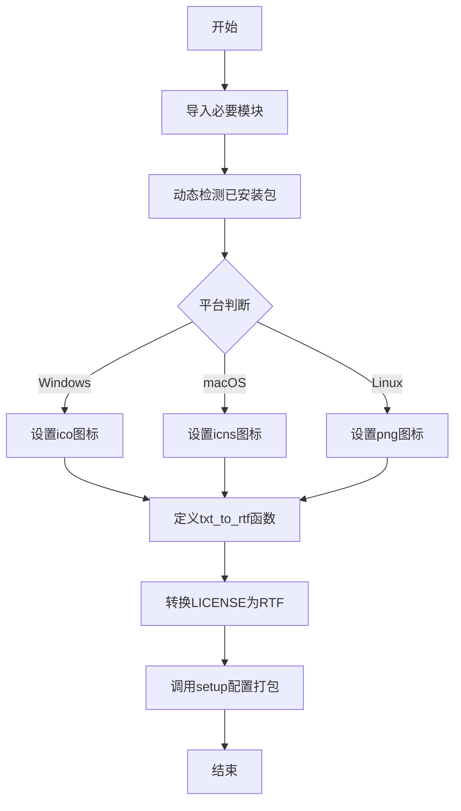

# `.\AutoGPT\classic\original_autogpt\setup.py` 详细设计文档

这是一个使用 cx_Freeze 打包 AutoGPT 应用程序的构建配置文件，通过动态检测环境中已安装的包，自动转换许可证文件为 RTF 格式，并配置跨平台（Windows、macOS、Linux）的可执行文件打包选项。

## 整体流程



## 类结构

```
setup.py (模块级脚本)
└── 无类层次结构 - 纯过程式代码
```

## 全局变量及字段


### `packages`
    
动态检测到的 Poetry 依赖包列表

类型：`List[str]`
    


### `icon`
    
根据操作系统选择的应用程序图标路径

类型：`str`
    


### `license_file`
    
生成的 RTF 许可证文件名

类型：`str`
    


    

## 全局函数及方法


### `txt_to_rtf`

将纯文本文件转换为 RTF（富文本格式），通过添加 RTF 文档结构标签并替换换行符为 RTF 段落标记来实现格式转换。

参数：

- `input_file`：`Union[str, Path]`，输入的纯文本文件路径
- `output_file`：`Union[str, Path]`，输出的 RTF 文件路径

返回值：`None`，该函数无返回值，直接将转换后的 RTF 内容写入到输出文件中

#### 流程图

```mermaid
flowchart TD
    A[开始] --> B[接收 input_file 和 output_file 参数]
    B --> C[将 input_file 转换为 Path 对象]
    C --> D[将 output_file 转换为 Path 对象]
    D --> E[以 UTF-8 编码打开并读取 input_file 内容]
    E --> F[构建 RTF 文档头 {\rtf1\ansi\deff0...]
    F --> G[将内容中的换行符 \n 替换为 RTF 段落标记 \\par]
    G --> H[添加 RTF 文档闭合标签 }]
    H --> I[以 UTF-8 编码打开 output_file 并写入 RTF 内容]
    I --> J[结束]
```

#### 带注释源码

```python
def txt_to_rtf(input_file: Union[str, Path], output_file: Union[str, Path]) -> None:
    """
    Convert a text file to RTF format.

    Args:
    input_file (Union[str, Path]): Path to the input text file.
    output_file (Union[str, Path]): Path to the output RTF file.

    Returns:
    None
    """
    # 将输入路径字符串或 Path 对象统一转换为 Path 对象，以便统一操作
    input_path = Path(input_file)
    output_path = Path(output_file)

    # 以 UTF-8 编码打开输入文件并读取全部内容
    # 使用上下文管理器确保文件正确关闭
    with input_path.open("r", encoding="utf-8") as txt_file:
        content = txt_file.read()

    # RTF 文档头部，定义 RTF 版本、字符集和默认字体
    # \rtf1 - RTF 版本 1
    # \ansi - 使用 ANSI 字符集
    # \deff0 - 使用默认字体表 0
    # {\fonttbl {\f0 Times New Roman;}} - 字体表，定义 Times New Roman 字体
    # \f0\fs24 - 选择字体 0，字体大小 24 (12pt)
    rtf = r"{\rtf1\ansi\deff0 {\fonttbl {\f0 Times New Roman;}}\f0\fs24 "

    # 将文本中的换行符替换为 RTF 段落标记 \par
    # RTF 中 \par 表示段落结束/换行
    rtf += content.replace("\n", "\\par ")

    # 闭合 RTF 文档的大括号
    rtf += "}"

    # 以 UTF-8 编码写入 RTF 内容到输出文件
    with output_path.open("w", encoding="utf-8") as rtf_file:
        rtf_file.write(rtf)
```

#### 关键组件信息

| 组件名称 | 说明 |
|---------|------|
| `Path` | Python pathlib 模块中的路径对象，用于跨平台文件路径操作 |
| `txt_to_rtf` | 核心转换函数，负责文本到 RTF 格式的转换逻辑 |
| `RTF 文档结构 | 包含头部信息、字体表、正文内容和闭合标签的 RTF 文档格式 |

#### 潜在的技术债务或优化空间

1. **缺少错误处理机制**：函数未处理文件不存在、编码错误、读取权限问题等异常情况，可能导致程序崩溃
2. **硬编码的 RTF 样式**：字体（Times New Roman）和字号（24）被硬编码，缺乏灵活性
3. **不支持特殊字符转义**：RTF 特殊字符（如 `{`、`}`、`\`）未被转义，可能导致生成的 RTF 文件损坏
4. **未使用上下文返回值**：函数返回 `None`，无法向调用者反馈转换结果或错误信息
5. **文件覆盖无确认**：直接覆盖已存在的输出文件，未提供确认或备份机制

#### 其它项目

**设计目标与约束：**
- 目标：将纯文本文件转换为 RTF 格式，以便在支持 RTF 的应用程序中显示
- 约束：输入输出路径必须有效，文件编码统一使用 UTF-8
- 使用场景：该函数用于将 LICENSE 文件转换为 RTF 格式，以便在 MSI 安装程序中作为许可协议显示

**错误处理与异常设计：**
- 当前实现未包含 try-except 块
- 建议增加异常处理：FileNotFoundError（文件不存在）、PermissionError（权限不足）、UnicodeDecodeError（编码错误）

**数据流与状态机：**
- 数据流：输入文件（文本） → 读取内容 → RTF 格式化 → 输出文件（RTF）
- 无复杂状态机，仅为简单的线性转换流程

**外部依赖与接口契约：**
- 依赖：`pathlib.Path`（标准库）、`typing.Union`（标准库）
- 接口契约：接收字符串或 Path 类型的输入输出路径，无返回值，通过副作用（写入文件）完成功能

## 关键组件


### 动态包检测模块

使用pkgutil.iter_modules遍历当前Python环境中的所有包，筛选出在"poetry"路径下的包，生成需要打包的依赖列表。

### 跨平台图标处理

根据platform.system()检测操作系统类型，动态设置不同平台的图标文件路径（.ico用于Windows，.icns用于macOS，.png用于Linux）。

### 文本转RTF转换器

将纯文本文件转换为RTF富文本格式，包含RTF头部、字体表定义，并将换行符替换为RTF的\par命令，支持Unicode编码。

### cx_Freeze可执行配置

配置AutoGPT主入口文件为classic/original_autogpt/__main__.py，设置目标名称为"autogpt"，基础为console类型，并关联平台图标。

### 构建选项配置

指定需要包含的包和模块列表（autogpt、spacy、uvicorn等），以及需要排除的包（readability.compat.two），确保打包时包含正确的依赖。

### macOS打包配置

设置bundle_name为"AutoGPT"，指定.icns图标文件，包含空资源目录，用于生成macOS应用程序包。

### Windows MSI打包配置

设置目标名称为"AutoGPT"，添加安装路径，指定.ico图标文件和RTF许可证文件，用于生成Windows安装程序。

### Linux打包配置

配置应用程序快捷方式和卷标，用于生成Linux平台的发行版包。


## 问题及建议


### 已知问题

- **动态包检测逻辑脆弱**：使用 `iter_modules()` 并基于路径中是否包含 "poetry" 来过滤包，这种方式高度依赖当前运行环境的模块状态，可能在不同环境下产生不一致的包列表，导致打包时缺少依赖或包含不必要的包
- **硬编码路径问题**：代码中存在多处硬编码路径（如 `"../LICENSE"`、`"../../assets/..."`），缺乏灵活性，且在不同工作目录下可能导致文件找不到错误
- **平台判断逻辑不完整**：对于 Windows 平台没有显式处理，虽然会使用默认的 `.ico` 文件，但逻辑不够清晰；且 icon 变量可能在某些边缘情况下未定义
- **RTF 转换函数缺乏健壮性**：没有对输入文件存在性、编码有效性进行验证；RTF 生成逻辑简单，未处理特殊字符（如反斜杠、花括号等），可能导致生成的 RTF 文件损坏
- **cx_Freeze 配置缺乏灵活性**：executables 路径、includes 列表、excludes 列表等都是硬编码，难以适应项目结构变化；packages 列表通过动态探测获得，但探测逻辑可能引入不确定性
- **缺乏错误处理与异常捕获**：文件读写操作、路径处理等关键步骤均未捕获异常，程序可能在遇到问题时直接崩溃
- **资源文件路径验证缺失**：icon 文件、LICENSE 文件等资源文件在使用前未验证是否存在，可能导致打包失败或运行时错误
- **类型注解不完整**：部分变量（如 `license_file`）缺少类型注解；`packages` 列表的类型推断依赖 type ignore 注释，降低了代码可靠性

### 优化建议

- **改进动态包检测**：考虑使用更可靠的依赖声明文件（如 requirements.txt、pyproject.toml）来明确列出需要打包的包，而非运行时动态探测；或者在探测时添加版本约束和更严格的过滤条件
- **使用配置文件或环境变量**：将路径配置抽取到单独的配置文件或使用环境变量，提高代码的可移植性
- **完善平台判断逻辑**：使用明确的 if-elif-else 结构覆盖所有平台情况，并为每种平台设置清晰的默认值和回退方案
- **增强 RTF 转换函数的健壮性**：添加输入验证（文件存在性、编码检测）、特殊字符转义处理（特别是 `\`, `{`, `}`）、以及异常捕获机制
- **解耦 cx_Freeze 配置**：将打包配置参数化，可考虑使用配置文件或命令行参数传入；将 includes 和 excludes 列表明确化，避免依赖运行时探测的不确定性
- **添加全面的错误处理**：在文件操作、路径处理、平台判断等关键位置添加 try-except 块，实现优雅的错误处理和有意义的错误信息提示
- **增加资源文件预检查**：在执行打包前验证所有依赖的资源文件（icon、license 等）是否存在，必要时提供清晰的错误信息
- **完善类型注解**：为所有变量和函数添加完整的类型注解，提高代码的可维护性和静态检查能力


## 其它


### 设计目标与约束

本代码的核心目标是将AutoGPT项目打包为跨平台可执行文件（Windows MSI、macOS DMG/App Bundle、Linux），并满足以下约束：1）自动发现项目依赖包；2）支持多平台图标适配；3）生成符合各平台标准的安装包；4）包含RTF格式的许可证文件以满足Windows MSI要求。

### 错误处理与异常设计

代码在以下环节进行错误处理：1）文件读取/写入使用UTF-8编码，捕获IOError异常；2）Path对象操作时捕获OSError；3）包检测时使用条件判断避免None引用；4）platform.system()返回非预期值时使用默认icon路径。当前错误处理粒度较粗，缺乏详细的错误日志记录和用户友好的错误提示。

### 数据流与状态机

数据流如下：1）iter_modules()扫描当前Python环境的所有模块；2）筛选poetry相关包生成packages列表；3）platform模块检测操作系统类型；4）txt_to_rtf()将LICENSE文本转换为RTF；5）setup()配置构建参数并执行打包。状态机模型：Idle → PackageDiscovery → PlatformDetection → LicenseConversion → BuildConfiguration → BuildExecution。

### 外部依赖与接口契约

主要外部依赖包括：1）cx_Freeze（打包工具）；2）platform模块（系统检测）；3）pathlib.Path（文件操作）；4）pkgutil.iter_modules（包扫描）；5）typing.Union（类型注解）。接口契约：txt_to_rtf()接受Union[str, Path]类型输入，返回None；setup()使用cx_Freeze标准API，executables列表必须包含至少一个Executable对象。

### 安全性考虑

当前代码存在以下安全考量：1）文件路径使用相对路径（../LICENSE），依赖于执行目录；2）icon路径使用硬编码相对路径，跨平台移植时需手动调整；3）包检测逻辑依赖module_finder.path属性，存在注入风险（虽然当前为只读属性）；4）建议使用绝对路径或环境变量增强路径安全性。

### 性能考虑

包扫描使用列表推导式一次性加载所有模块，可能影响大型项目的初始化速度；iter_modules()会遍历sys.path下所有包，对于复杂环境可考虑缓存机制；当前构建配置中packages数量动态生成，建议在CI/CD环境中记录已知包列表以加速重复构建。

### 配置管理

当前配置采用硬编码方式，主要配置项包括：1）executables目标入口（classic/original_autogpt/__main__.py）；2）build_exe的packages和includes列表；3）各平台特定选项（bdist_mac/bdist_dmg/bdist_msi）；4）icon路径动态选择。优化建议：将平台相关配置抽离为独立配置文件（如setup.cfg或pyproject.toml），提高可维护性。

### 平台特定实现

代码包含三个平台的条件分支：1）Windows（platform.system()=="Windows"，默认）：使用.ico图标，生成MSI安装包；2）macOS（Darwin）：使用.icns图标，配置bundle_name和DMG参数；3）Linux：使用.png图标。需要注意：当前代码未显式处理Windows情况，platform.system()在Windows上返回"Windows"，但if-elif链未覆盖，默认使用.ico。

### 许可证与法律事项

代码将LICENSE文本转换为RTF格式以满足Windows MSI安装程序的license_file要求；RTF生成使用简单替换逻辑，未包含复杂的字符编码处理；建议验证RTF输出是否符合目标Windows版本的兼容性要求。

### 构建产物分析

预期生成产物：1）Windows：AutoGPT.exe、AutoGPT.msi；2）macOS：AutoGPT.app、AutoGPT.dmg；3）Linux：autogpt可执行文件。构建产物大小受includes列表中的spacy、uvicorn等大型包影响；excludes列表明确排除readability.compat.two以减小体积。

### 技术债务与优化空间

1）动态包检测可能遗漏隐式依赖，建议维护显式包列表；2）includes中列出大量spacy和uvicorn子模块，反映依赖声明不完整；3）缺乏构建日志和错误报告机制；4）license文件路径使用相对路径，依赖工作目录；5）txt_to_rtf函数可复用性低，建议提取为独立工具模块；6）缺少单元测试覆盖。


    