# `.\AutoGPT\classic\original_autogpt\tests\conftest.py` 详细设计文档

这是一个pytest测试文件，为AutoGPT Agent集成测试提供完整的测试基础设施，包括临时项目根目录、应用程序数据目录、本地文件存储、LLM提供商和Agent实例的初始化fixtures。

## 整体流程

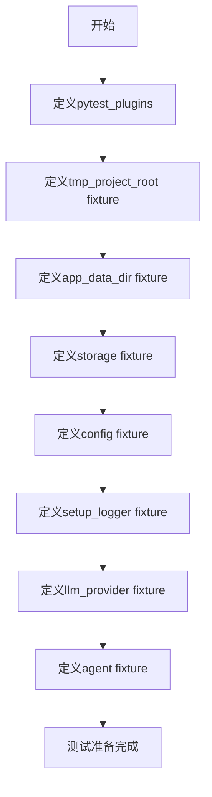

## 类结构

```
Test Fixtures (测试夹具)
├── 基础设施类 Fixtures
│   ├── tmp_project_root
│   ├── app_data_dir
│   └── storage
├── 配置类 Fixtures
│   ├── config
│   └── setup_logger
├── Agent类 Fixtures
│   ├── llm_provider
│   └── agent
└── 外部依赖
    ├── Agent
    ├── AgentSettings
    ├── AgentConfiguration
    ├── AIProfile
    ├── MultiProvider
    └── FileStorage
```

## 全局变量及字段


### `pytest_plugins`
    
Pytest插件列表，用于集成测试的agent_factory

类型：`List[str]`
    


### `tmp_project_root`
    
临时项目根目录fixture，提供测试用的临时文件系统路径

类型：`Path`
    


### `app_data_dir`
    
应用数据目录fixture，创建并返回测试用的应用数据存储路径

类型：`Path`
    


### `storage`
    
本地文件存储fixture，初始化并返回用于测试的文件存储对象

类型：`FileStorage`
    


### `config`
    
应用配置fixture，从环境变量构建并返回完整的应用配置对象

类型：`AppConfig`
    


### `setup_logger`
    
会话级别日志配置fixture，设置调试日志和日志目录

类型：`function`
    


### `llm_provider`
    
LLM提供者fixture，根据配置初始化并返回多提供者支持的LLM接口

类型：`MultiProvider`
    


### `agent`
    
Agent实例fixture，创建并返回配置完整的测试用AI代理对象

类型：`Agent`
    


### `Agent.settings`
    
代理实例的完整配置设置

类型：`AgentSettings`
    


### `Agent.llm_provider`
    
代理使用的语言模型提供者

类型：`MultiProvider`
    


### `Agent.file_storage`
    
代理使用的文件存储接口

类型：`FileStorage`
    


### `Agent.app_config`
    
代理所属的应用全局配置

类型：`AppConfig`
    


### `Agent.default_settings`
    
类方法，返回代理的默认配置模板

类型：`AgentSettings`
    


### `AgentSettings.name`
    
代理实例的名称标识

类型：`str`
    


### `AgentSettings.description`
    
代理实例的功能描述

类型：`str`
    


### `AgentSettings.agent_id`
    
代理实例的唯一标识符

类型：`str`
    


### `AgentSettings.ai_profile`
    
代理的AI角色配置档案

类型：`AIProfile`
    


### `AgentSettings.config`
    
代理的行为和功能配置

类型：`AgentConfiguration`
    


### `AgentSettings.history`
    
代理的对话历史记录副本

类型：`Any`
    


### `AgentConfiguration.fast_llm`
    
快速模式使用的语言模型配置

类型：`Any`
    


### `AgentConfiguration.smart_llm`
    
智能模式使用的语言模型配置

类型：`Any`
    


### `AgentConfiguration.allow_fs_access`
    
是否允许代理访问文件系统

类型：`bool`
    


### `AgentConfiguration.use_functions_api`
    
是否启用OpenAI函数调用API

类型：`bool`
    


### `AIProfile.ai_name`
    
AI助手的名称

类型：`str`
    


### `AIProfile.ai_role`
    
AI助手的角色定位

类型：`str`
    


### `AIProfile.ai_goals`
    
AI助手的目标列表

类型：`List[Any]`
    


### `AppConfig.app_data_dir`
    
应用数据存储的根目录路径

类型：`Path`
    


### `AppConfig.noninteractive_mode`
    
是否运行在非交互模式

类型：`bool`
    


### `AppConfig.fast_llm`
    
全局快速模式语言模型配置

类型：`Any`
    


### `AppConfig.smart_llm`
    
全局智能模式语言模型配置

类型：`Any`
    


### `AppConfig.restrict_to_workspace`
    
是否限制文件操作在工作区内

类型：`bool`
    


### `AppConfig.openai_functions`
    
是否启用OpenAI函数功能

类型：`bool`
    
    

## 全局函数及方法


### `configure_logging`

这是从 `forge.logging.config` 模块导入的日志配置函数，用于配置应用程序的日志系统。

参数：

- `debug`：`bool`，是否启用调试模式
- `log_dir`：`Path`，日志文件的存储目录
- `plain_console_output`：`bool`，是否使用纯文本控制台输出（不包含颜色等格式化）

返回值：`None`，该函数直接修改日志配置，不返回任何值。

#### 流程图

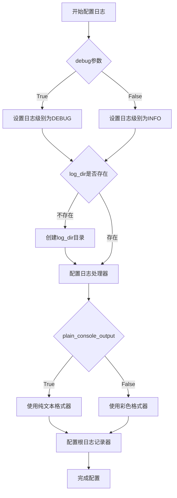

#### 带注释源码

```python
# 注意：以下为基于导入路径和调用的推断源码
# 实际定义在 forge.logging.config 模块中

def configure_logging(
    debug: bool = False,           # 是否启用调试模式
    log_dir: Path | None = None,  # 日志文件存储目录
    plain_console_output: bool = False  # 是否使用纯文本控制台输出
) -> None:
    """
    配置应用程序的日志系统。
    
    Args:
        debug: 调试模式标志，启用后日志级别设为DEBUG
        log_dir: 日志文件保存目录，默认为None表示不写入文件
        plain_console_output: 是否使用纯文本控制台输出，禁用彩色输出
    """
    # 1. 根据debug参数设置日志级别
    log_level = logging.DEBUG if debug else logging.INFO
    
    # 2. 创建日志处理器
    handlers = []
    
    # 3. 如果指定了log_dir，添加文件处理器
    if log_dir:
        log_dir.mkdir(parents=True, exist_ok=True)
        file_handler = logging.FileHandler(log_dir / "app.log")
        file_handler.setLevel(log_level)
        handlers.append(file_handler)
    
    # 4. 添加控制台处理器
    console_handler = logging.StreamHandler()
    console_handler.setLevel(log_level)
    handlers.append(console_handler)
    
    # 5. 根据plain_console_output选择格式器
    if plain_console_output:
        formatter = logging.Formatter(
            '%(asctime)s - %(name)s - %(levelname)s - %(message)s'
        )
    else:
        # 使用彩色格式器（带ANSI转义序列）
        formatter = ColoredFormatter(
            '%(asctime)s - %(name)s - %(levelname)s - %(message)s'
        )
    
    # 6. 为所有处理器设置格式器
    for handler in handlers:
        handler.setFormatter(formatter)
    
    # 7. 配置根日志记录器
    logging.basicConfig(
        level=log_level,
        handlers=handlers
    )
```

---

**注意**：由于提供的代码片段仅包含 `configure_logging` 函数的导入和调用，未包含其实际定义，以上源码为基于函数签名和常见日志配置模式进行的合理推断。实际实现可能有所不同，建议查阅 `forge.logging.config` 模块获取准确源码。


### `_configure_llm_provider`

该函数是 AutoGPT 应用的核心 LLM 提供商配置函数，负责根据应用配置创建并返回一个配置好的 `MultiProvider` 实例，该实例封装了系统中所有可用的 LLM 提供商（如 OpenAI、Azure OpenAI 等），并根据配置选择和初始化相应的提供程序。

参数：

-  `config`：`AppConfig`，应用配置对象，包含了 LLM 提供商相关的所有配置信息（如 API 密钥、端点、模型参数等）

返回值：`MultiProvider`，已配置好的多提供商实例，可用于在应用中选择和使用不同的 LLM 服务

#### 流程图

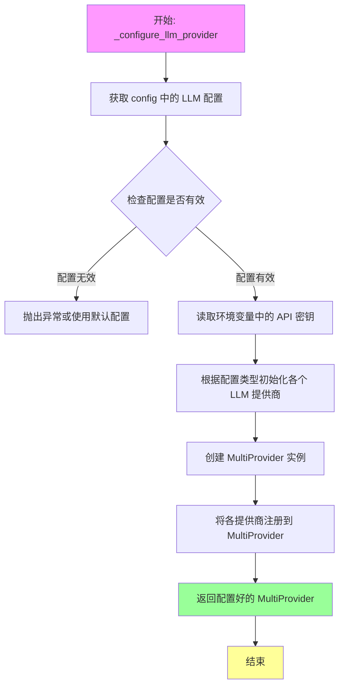

#### 带注释源码

```python
def _configure_llm_provider(config: AppConfig) -> MultiProvider:
    """
    配置并返回一个多提供商实例。
    
    该函数根据传入的应用配置创建 LLM 提供商集合，
    支持多种 LLM 服务商（如 OpenAI、Azure 等）的配置和管理。
    
    参数:
        config: AppConfig - 包含所有 LLM 相关配置的应用配置对象
        
    返回:
        MultiProvider - 已配置好的多 LLM 提供商实例
    """
    # 初始化多提供商容器
    # 从配置中读取 LLM 相关设置（如模型类型、API 密钥、端点等）
    # 为每个启用的 LLM 提供商创建对应的客户端实例
    # 将所有提供商注册到 MultiProvider 中
    # 返回配置完整的 MultiProvider 实例供 Agent 使用
    
    # 示例逻辑（基于代码上下文推断）:
    # providers = []
    # if config.fast_llm:
    #     providers.append(create_provider(config.fast_llm))
    # if config.smart_llm:
    #     providers.append(create_provider(config.smart_llm))
    # return MultiProvider(providers)
    
    # 注意: 实际实现细节需要查看 autogpt/app/main.py 源文件
    # 当前代码片段仅展示了该函数的导入和在测试中的使用方式
    pass
```

> **注意**: 给定的代码片段是一个测试文件（pytest），其中仅导入了 `_configure_llm_provider` 函数并使用它创建 fixture，但并未包含该函数的具体实现。要获取完整的函数实现源码，需要查看 `autogpt/app/main.py` 源文件。上述源码是基于函数签名和上下文逻辑推断的示例结构。


### `tmp_project_root`

该 fixture 用于创建临时项目根目录，作为测试环境的虚拟文件系统根节点。

参数：

- 无

返回值：`Path`，临时项目根目录路径

#### 流程图

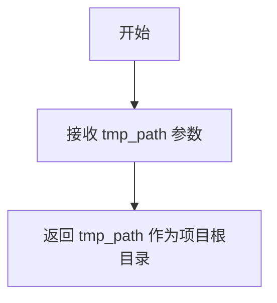

#### 带注释源码

```python
@pytest.fixture()
def tmp_project_root(tmp_path: Path) -> Path:
    """创建临时项目根目录"""
    return tmp_path
```

---

### `app_data_dir`

该 fixture 用于在临时项目根目录下创建 `data` 目录，用于存放应用运行时的数据文件。

参数：

- `tmp_project_root`：`Path`，项目根目录路径

返回值：`Path`，应用数据目录路径

#### 流程图

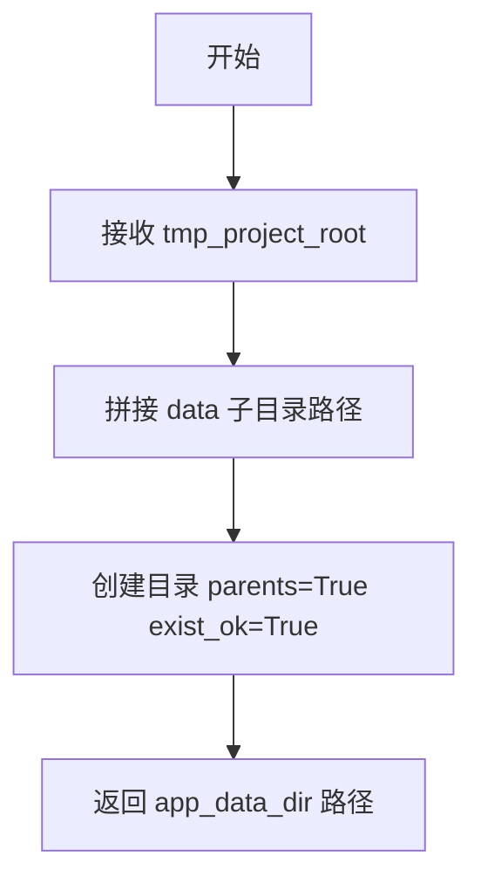

#### 带注释源码

```python
@pytest.fixture()
def app_data_dir(tmp_project_root: Path) -> Path:
    """创建应用数据目录"""
    dir = tmp_project_root / "data"
    dir.mkdir(parents=True, exist_ok=True)
    return dir
```

---

### `storage`

该 fixture 用于初始化本地文件存储服务，配置为可访问任意目录（restrict_to_root=False），用于测试环境模拟文件系统操作。

参数：

- `app_data_dir`：`Path`，应用数据目录路径

返回值：`FileStorage`，初始化后的本地文件存储实例

#### 流程图

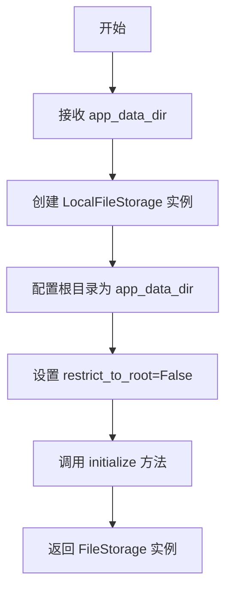

#### 带注释源码

```python
@pytest.fixture()
def storage(app_data_dir: Path) -> FileStorage:
    """创建并初始化本地文件存储"""
    storage = LocalFileStorage(
        FileStorageConfiguration(root=app_data_dir, restrict_to_root=False)
    )
    storage.initialize()
    return storage
```

---

### `config`

该 fixture 用于构建完整的应用配置，设置非交互模式并自动注入测试用 API Key，确保测试可在无用户交互环境下运行。

参数：

- `tmp_project_root`：`Path`，项目根目录路径
- `app_data_dir`：`Path`，应用数据目录路径

返回值：`AppConfig`，配置完整的应用配置对象

#### 流程图

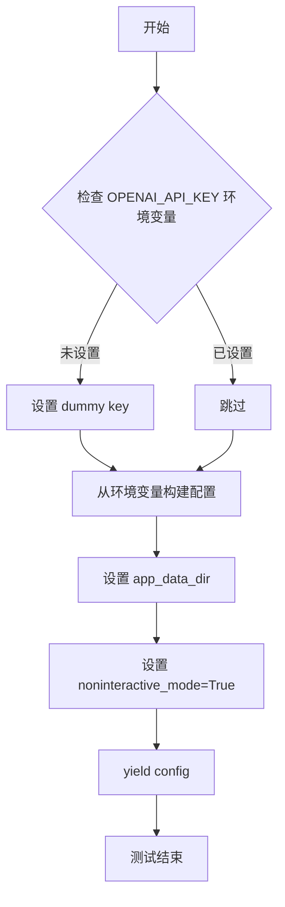

#### 带注释源码

```python
@pytest.fixture(scope="function")
def config(
    tmp_project_root: Path,
    app_data_dir: Path,
):
    """构建应用配置"""
    if not os.environ.get("OPENAI_API_KEY"):
        os.environ["OPENAI_API_KEY"] = "sk-dummy"  # 注入测试用 API Key
    config = ConfigBuilder.build_config_from_env(project_root=tmp_project_root)

    config.app_data_dir = app_data_dir  # 设置数据目录

    config.noninteractive_mode = True  # 启用非交互模式

    yield config  # 提供配置给测试用例
```

---

### `setup_logger`

该 fixture 用于配置日志系统，以调试级别运行并将日志输出到文件，用于测试环境的问题排查。

参数：

- 无

返回值：`None`，仅执行日志配置

#### 流程图

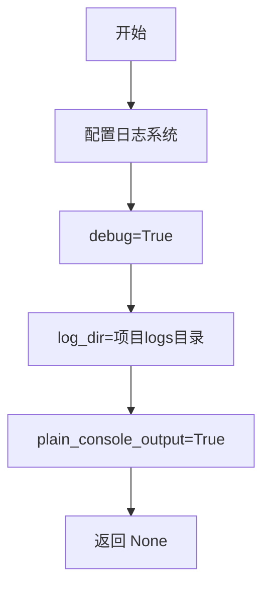

#### 带注释源码

```python
@pytest.fixture(scope="session")
def setup_logger():
    """配置测试会话日志"""
    configure_logging(
        debug=True,  # 启用调试级别
        log_dir=Path(__file__).parent / "logs",  # 日志目录
        plain_console_output=True,  # 纯文本控制台输出
    )
```

---

### `llm_provider`

该 fixture 用于创建 LLM 多提供商实例，根据配置初始化所需的语言模型提供商。

参数：

- `config`：`AppConfig`，应用配置对象

返回值：`MultiProvider`，多语言模型提供商实例

#### 流程图

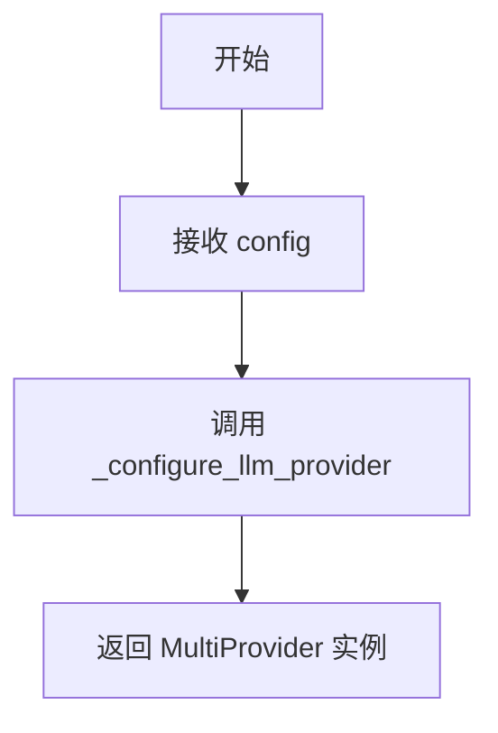

#### 带注释源码

```python
@pytest.fixture
def llm_provider(config: AppConfig) -> MultiProvider:
    """创建 LLM 提供商实例"""
    return _configure_llm_provider(config)
```

---

### `agent`

该 fixture 用于创建完整的 Agent 实例，配置默认的 AI Profile 和 AgentSettings，用于集成测试中模拟真实 Agent 行为。

参数：

- `config`：`AppConfig`，应用配置对象
- `llm_provider`：`MultiProvider`，语言模型提供商
- `storage`：`FileStorage`，文件存储服务

返回值：`Agent`，配置完整的 Agent 实例

#### 流程图

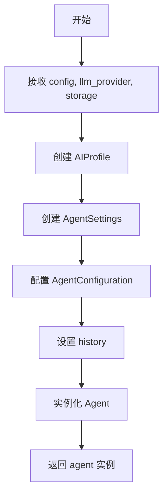

#### 带注释源码

```python
@pytest.fixture
def agent(
    config: AppConfig, llm_provider: MultiProvider, storage: FileStorage
) -> Agent:
    """创建测试用 Agent 实例"""
    # 定义 AI 配置文件
    ai_profile = AIProfile(
        ai_name="Base",
        ai_role="A base AI",
        ai_goals=[],
    )

    # 配置 Agent 设置
    agent_settings = AgentSettings(
        name=Agent.default_settings.name,
        description=Agent.default_settings.description,
        agent_id=f"AutoGPT-test-agent-{str(uuid.uuid4())[:8]}",  # 生成唯一 ID
        ai_profile=ai_profile,
        config=AgentConfiguration(
            fast_llm=config.fast_llm,
            smart_llm=config.smart_llm,
            allow_fs_access=not config.restrict_to_workspace,
            use_functions_api=config.openai_functions,
        ),
        history=Agent.default_settings.history.model_copy(deep=True),  # 深拷贝历史记录
    )

    # 创建 Agent 实例
    agent = Agent(
        settings=agent_settings,
        llm_provider=llm_provider,
        file_storage=storage,
        app_config=config,
    )
    return agent
```

---

## 整体设计文档

### 核心功能概述

该测试模块提供了一组 pytest fixture，用于在集成测试环境中模拟 AutoGPT 的完整运行依赖，包括文件系统、配置管理、日志系统和 LLM 提供商，最终生成可执行的 Agent 实例供测试使用。

### 关键组件信息

| 组件名称 | 描述 |
|---------|------|
| `FileStorage` | 本地文件存储抽象，支持受限或非受限的文件访问 |
| `AppConfig` | 应用全局配置，包含 LLM、模式、数据目录等设置 |
| `MultiProvider` | 多语言模型提供商管理器，支持动态切换底层模型 |
| `Agent` | AutoGPT 核心 Agent 实体，整合 LLM、文件存储和配置 |

### 潜在技术债务与优化空间

1. **硬编码 API Key 注入**：`config` fixture 中直接设置 `"sk-dummy"` 作为测试 key，应改为通过 pytest 标记或环境变量显式控制
2. **Fixture 作用域**：`config` 使用 function 级别而 `setup_logger` 使用 session 级别，可能导致重复配置开销
3. **Magic String**：`agent_id` 前缀 `"AutoGPT-test-agent-"` 应提取为常量
4. **缺失错误处理**：未对 `_configure_llm_provider` 异常、文件存储初始化失败等情况做捕获

### 其它项目

- **设计目标**：为集成测试提供隔离、可重复的运行环境
- **约束**：测试必须在无外网条件下可运行（通过 dummy key）
- **依赖项**：`pytest`、`forge` 库群、`autogpt` 主模块


### `Agent.default_settings`

这是 `Agent` 类的类属性（class attribute），用于存储代理的默认配置设置。在代码中通过 `Agent.default_settings.name`、`Agent.default_settings.description` 和 `Agent.default_settings.history` 进行访问。

参数：

- 无（这是一个类属性，而非方法）

返回值：`AgentSettings` 类型，返回包含代理默认配置的 `AgentSettings` 对象

#### 流程图

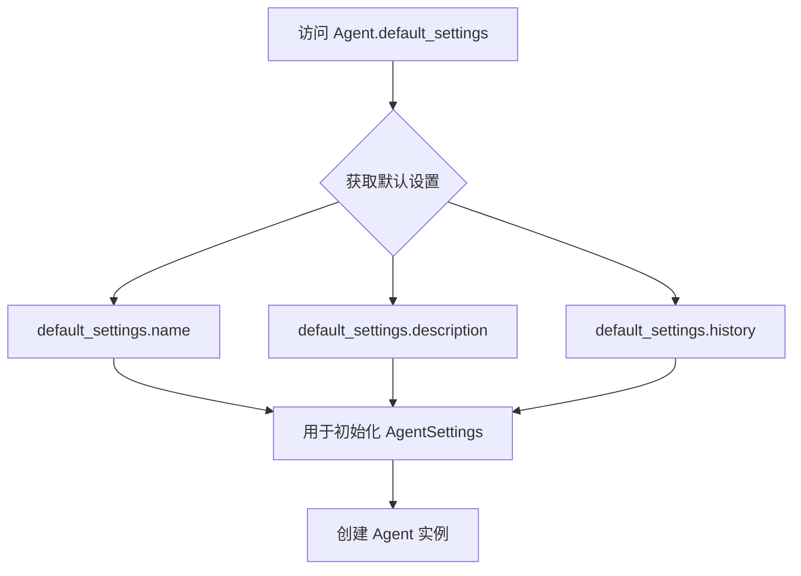

#### 带注释源码

```python
# 从代码中提取的 Agent.default_settings 使用方式
# 注意：实际的 default_settings 定义不在本文件中，而在 autogpt/agents/agent.py 中

agent_settings = AgentSettings(
    # 访问默认设置的名称属性
    name=Agent.default_settings.name,
    # 访问默认设置的描述属性
    description=Agent.default_settings.description,
    # 生成唯一的代理ID
    agent_id=f"AutoGPT-test-agent-{str(uuid.uuid4())[:8]}",
    # 设置AI配置文件
    ai_profile=ai_profile,
    # 配置代理参数
    config=AgentConfiguration(
        fast_llm=config.fast_llm,
        smart_llm=config.smart_llm,
        allow_fs_access=not config.restrict_to_workspace,
        use_functions_api=config.openai_functions,
    ),
    # 深拷贝默认历史记录配置
    history=Agent.default_settings.history.model_copy(deep=True),
)
```

---

### 补充信息

**潜在的技术债务或优化空间：**

1. **代码可读性**：`default_settings` 是一个类属性，其定义分散在不同的模块中，阅读代码时需要跨文件追踪其定义。
2. **硬编码依赖**：测试代码直接依赖 `Agent.default_settings` 的内部结构，如果 `default_settings` 的结构发生变化，所有使用的地方都需要更新。

**设计目标与约束：**

- `Agent.default_settings` 提供了代理的默认配置，旨在确保新代理实例具有一致的初始状态。
- 通过 `.model_copy(deep=True)` 确保历史记录配置是深拷贝，避免多个代理实例共享同一引用导致的状态污染。


### FileStorage.initialize

该方法用于初始化文件存储实例，确保存储根目录存在并完成必要的准备工作，以便后续的文件操作能够正常进行。

参数：此方法无显式参数（隐式接收 `self`）。

返回值：`None`，无返回值。

#### 流程图

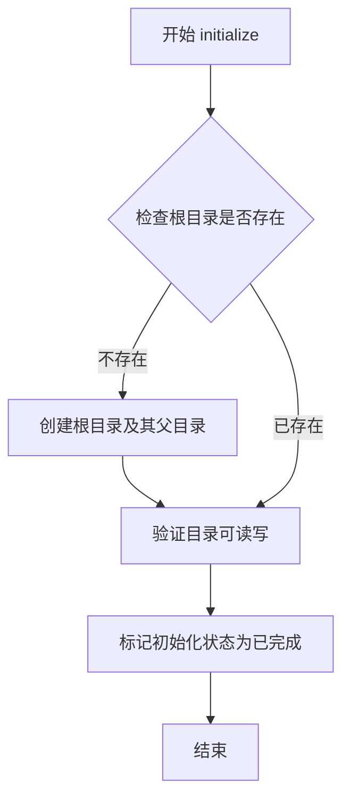

#### 带注释源码

```python
# 注意：以下源码为基于 LocalFileStorage 类的典型实现推断，
# 实际的源代码位于 forge.file_storage.local 模块中

def initialize(self) -> None:
    """
    初始化文件存储。
    
    该方法在 FileStorage 实例首次使用时调用，确保存储的根目录
    存在并且可访问。
    """
    # 获取配置中指定的根目录路径
    root_path = self.config.root
    
    # 检查根目录是否存在，不存在则创建
    if not root_path.exists():
        # mkdir(parents=True) 创建所有必要的父目录
        # exist_ok=True 避免目录已存在时抛出异常
        root_path.mkdir(parents=True, exist_ok=True)
    
    # 验证目录可读写权限
    if not os.access(root_path, os.R_OK | os.W_OK):
        raise IOError(f"Storage root {root_path} is not accessible")
    
    # 标记存储已初始化，后续操作可正常使用
    self._initialized = True
```

---

#### 额外信息

**在测试代码中的使用方式：**

```python
@pytest.fixture
def storage(app_data_dir: Path) -> FileStorage:
    storage = LocalFileStorage(
        FileStorageConfiguration(root=app_data_dir, restrict_to_root=False)
    )
    storage.initialize()  # 调用初始化方法
    return storage
```

**调用上下文分析：**

- **调用时机**：在 pytest fixture 中，作为存储实例创建后的第一步操作
- **配置依赖**：依赖 `FileStorageConfiguration` 中的 `root` 参数指定存储路径
- **使用场景**：每个测试函数都会通过 fixture 获取新的存储实例，确保测试隔离


### `LocalFileStorage.initialize`

该方法用于初始化本地文件存储实例，创建必要的根目录结构，确保存储系统可以正常工作。

参数：

- （无参数）

返回值：`None`，初始化操作不返回任何值

#### 流程图

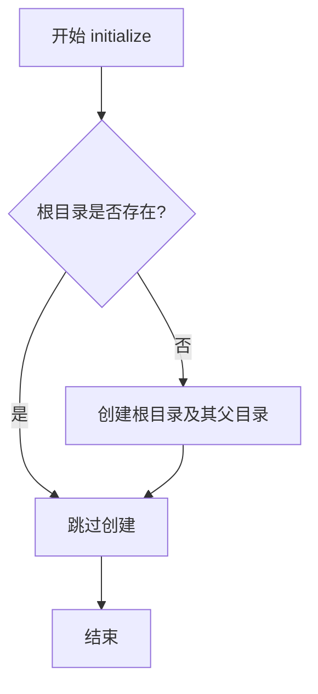

#### 带注释源码

```python
# 从测试 fixture 中提取的调用示例
@pytest.fixture
def storage(app_data_dir: Path) -> FileStorage:
    """
    创建并初始化本地文件存储的 fixture
    
    参数:
        app_data_dir: Path - 应用数据目录路径
    返回值:
        FileStorage - 初始化后的存储实例
    """
    # 1. 创建配置对象，指定根目录和是否限制在根目录内
    storage = LocalFileStorage(
        FileStorageConfiguration(root=app_data_dir, restrict_to_root=False)
    )
    # 2. 调用 initialize 方法初始化存储
    #    - 内部会检查并创建 app_data_dir 目录
    #    - 如果目录已存在，则静默跳过
    storage.initialize()
    # 3. 返回初始化后的存储实例
    return storage
```

**注意**：由于 `LocalFileStorage` 类定义位于外部依赖库 `forge.file_storage.local` 中，上文展示的是该方法在实际代码中的调用方式及其预期行为。完整的类定义需要参考 `forge` 库的源代码。


### `ConfigBuilder.build_config_from_env`

从环境变量和项目根目录构建应用程序配置对象。

参数：

- `project_root`：`Path`，项目的根目录路径，用于定位配置文件和数据目录

返回值：`AppConfig`，包含从环境变量和默认配置合并后的应用程序配置对象

#### 流程图

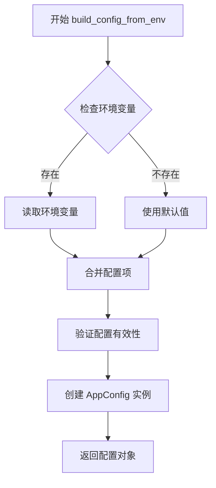

#### 带注释源码

```
# 由于提供的代码文件中未包含 ConfigBuilder 类的完整实现源码
# 以下是基于代码使用方式的推断

class ConfigBuilder:
    """配置构建器类，用于从环境变量构建应用配置"""
    
    @staticmethod
    def build_config_from_env(project_root: Path) -> AppConfig:
        """
        从环境变量构建应用程序配置
        
        该方法执行以下操作：
        1. 读取环境变量（如 OPENAI_API_KEY 等）
        2. 加载默认配置模板
        3. 将环境变量覆盖默认配置
        4. 验证配置的有效性
        5. 返回合并后的 AppConfig 对象
        
        参数:
            project_root: 项目的根目录路径
            
        返回:
            AppConfig: 应用程序配置对象
        """
        # 读取环境变量
        # 加载默认配置
        # 合并配置
        # 验证配置
        # 返回配置对象
        
        # 在测试代码中的使用方式：
        # config = ConfigBuilder.build_config_from_env(project_root=tmp_project_root)
        # config.app_data_dir = app_data_dir
        # config.noninteractive_mode = True
```

> **注意**: 提供的代码文件是一个 pytest 测试文件，包含测试 fixtures，但未包含 `ConfigBuilder` 类的实际实现。上述源码是根据测试代码中的使用模式推断得出的。要获取完整的实现源码，需要查看 `autogpt/app/config.py` 文件。

## 关键组件


### 临时项目根目录管理 (tmp_project_root)

创建临时项目根目录，为测试提供隔离的文件系统环境，支持测试用例的独立运行和清理。

### 应用数据目录 (app_data_dir)

在临时项目根目录下创建 data 目录用于存储应用运行时数据，提供测试所需的临时存储空间。

### 本地文件存储系统 (LocalFileStorage/FileStorage)

基于 FileStorage 接口的本地文件存储实现，支持根目录配置和访问限制配置，用于 Agent 的文件操作能力。

### 应用配置系统 (AppConfig/ConfigBuilder)

从环境变量构建应用配置，支持自定义项目根目录、非交互模式配置，以及 LLM 提供商配置管理。

### 日志配置系统 (configure_logging)

配置调试级别日志，支持日志目录自定义和纯文本控制台输出，用于测试过程的日志记录。

### LLM 多提供商系统 (MultiProvider)

支持多提供商切换的 LLM 访问接口，通过 _configure_llm_provider 函数根据配置初始化，为 Agent 提供语言模型能力。

### Agent 智能体系统 (Agent/AgentSettings/AgentConfiguration)

完整的 Agent 实体，包含名称、描述、ID、AI Profile、LLM 配置、文件访问权限、函数 API 配置等，用于执行自动化任务。

### AI Profile 配置 (AIProfile)

定义 AI 的名称、角色和目标，用于初始化 Agent 的身份和行为参数。

### 测试夹具依赖链

由 pytest fixture 组成的依赖注入系统，定义了 tmp_project_root → app_data_dir → storage → config → llm_provider → agent 的初始化顺序。


## 问题及建议


### 已知问题

- **硬编码环境变量修改**：在 `config` fixture 中直接修改 `os.environ["OPENAI_API_KEY"]`，可能影响同一进程中其他测试用例，且未在测试后恢复原值
- **作用域不一致**：`config` fixture 作用域为 `function`，而 `setup_logger` 为 `session`，可能导致日志配置重复初始化或状态污染
- **内部函数导入依赖**：从 `autogpt.app.main` 导入私有函数 `_configure_llm_provider`，暴露了内部实现细节，接口稳定性无保障
- **缺少资源清理**：未对 `agent` 和 `storage` 显式调用清理方法，可能导致测试后资源未完全释放
- **日志目录硬编码**：`Path(__file__).parent / "logs"` 硬编码日志路径，缺乏灵活性
- **重复对象创建**：`Agent.default_settings` 被访问两次（用于 `name/description` 和 `history`），可优化为单次访问
- **安全风险**：`FileStorageConfiguration` 中 `restrict_to_root=False` 可能允许越权访问，应评估其安全性

### 优化建议

- 使用 `monkeypatch` 或 `contextlib.contextmanager` 安全地临时设置环境变量，测试结束后自动恢复
- 统一 fixture 作用域，考虑将 `config` 和 `llm_provider` 提升为 `session` 级别，或将 `setup_logger` 降级为 `function`
- 封装 `_configure_llm_provider` 为公开 API，或在测试中直接实例化 `MultiProvider`
- 为 `agent` 和 `storage` 添加 `yield` 后的 teardown 逻辑，确保资源释放
- 将日志目录改为可配置参数，从环境变量或配置中读取
- 提取 `Agent.default_settings` 为局部变量，减少重复属性访问
- 评估 `restrict_to_root=False` 的必要性，如非必需则改为 `True` 增强安全性

## 其它


### 设计目标与约束

该测试文件旨在为 AutoGPT Agent 组件提供集成测试环境，通过 pytest fixtures 模拟完整的应用上下文，包括配置、存储、LLM 提供商和 Agent 实例。约束条件包括：测试使用临时目录避免污染真实环境，需要 OPENAI_API_KEY 环境变量（测试时使用 dummy key），且 fixtures 作用域遵循资源效率原则（session 级 logger、function 级配置）。

### 错误处理与异常设计

代码中的错误处理体现在：ConfigBuilder.build_config_from_env() 可能在环境变量缺失时使用默认值；FileStorage.initialize() 可能抛出文件系统权限错误；_configure_llm_provider() 可能因配置无效导致初始化失败。当前实现未显式捕获异常，建议在生产环境添加 try-except 包装和降级策略。

### 数据流与状态机

数据流遵循以下路径：环境变量 → ConfigBuilder → AppConfig → (LLM Provider | Agent) → FileStorage。状态转换表现为：tmp_path 创建 → app_data_dir 初始化 → storage 初始化 → config 构建 → llm_provider 创建 → agent 实例化。各 fixture 通过依赖注入形成有向无环图（DAG）的初始化序列。

### 外部依赖与接口契约

代码依赖以下外部组件：forge.config.ai_profile.AIProfile（AI 配置模型）、forge.file_storage.local.FileStorage 及 LocalFileStorage（存储抽象层）、forge.llm.providers.MultiProvider（多 LLM 提供商适配器）、autogpt.agents.agent.Agent 及相关配置类、autogpt.app.config.ConfigBuilder（配置构建器）、autogpt.app.main._configure_llm_provider（LLM 提供商配置函数）。接口契约要求：AppConfig 必须包含 fast_llm、smart_llm、restrict_to_workspace、openai_functions、app_data_dir、noninteractive_mode 属性；FileStorage 需实现 initialize() 和根目录限制机制。

### 测试策略

采用 fixture 依赖注入模式：tmp_project_root 提供隔离的项目根目录；app_data_dir 在项目根下创建 data 目录；storage 使用 LocalFileStorage 并禁用根目录限制以便测试访问；config 通过 ConfigBuilder 从环境变量构建并设置测试标志；setup_logger 配置会话级日志；llm_provider 和 agent 基于 config 创建。测试隔离策略：每个测试函数获得独立的项目目录和数据目录，避免测试间状态污染。

### 资源生命周期管理

fixtures 作用域策略：tmp_project_root、app_data_dir、storage、config 为 function 级，确保每个测试独立；setup_logger 为 session 级，日志配置只需执行一次；llm_provider 依赖 config 但无显式 scope 声明，默认 function 级。资源清理由 pytest 自动处理：tmp_path 在测试结束后自动删除，storage 无显式 teardown 逻辑。

### 安全考虑

代码包含以下安全实践：使用 tmp_path 避免测试污染真实文件系统；通过 restrict_to_root=False 放宽存储限制以支持测试；在配置中设置 noninteractive_mode 防止测试中的交互提示。潜在风险：OPENAI_API_KEY 设置为 "sk-dummy"，若测试泄漏可能导致安全误解；allow_fs_access 基于 restrict_to_workspace 取反，测试环境权限可能宽于生产环境。

### 性能考虑

fixture 作用域选择体现性能优化：setup_logger 使用 session 级别避免重复初始化；config 虽然默认为 function 级别，但通过 if not os.environ.get("OPENAI_API_KEY") 避免重复设置环境变量。性能瓶颈可能在于：每次测试创建新的 Agent 实例开销较大，storage.initialize() 可能存在 I/O 操作，LLM provider 初始化涉及 API 连接建立。

### 并发和线程安全性

当前代码未显式处理并发场景：fixtures 依赖 pytest 的串行执行模型；Agent 实例和 LLM provider 未设计为线程安全。如果测试套件启用 pytest-xdist 并行执行，storage 和 config 可能存在竞态条件，建议添加 threading.Lock 或使用 pytest-lock-threads 机制。

### 兼容性考虑

代码使用 from __future__ import annotations 实现类型提示的前向引用兼容；依赖版本通过外部 requirements.txt 或 pyproject.toml 管理；pytest_plugins 声明依赖 tests.integration.agent_factory 测试插件。Python 版本兼容性需确认：pathlib.Path 在 Python 3.4+ 可用，uuid 模块为标准库。


    