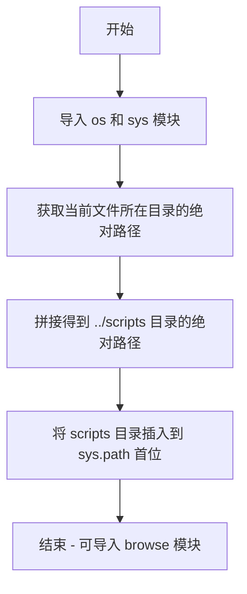

# `.\AutoGPT\classic\original_autogpt\tests\context.py` 详细设计文档

该代码是一个路径初始化脚本，用于将项目根目录下的 scripts 文件夹添加到 Python 的模块搜索路径（sys.path）中，以便后续可以导入 browse 模块。这通常出现在项目的入口文件或初始化文件中。

## 整体流程



## 类结构

```
该代码不包含任何类定义，为扁平化结构
```

## 全局变量及字段


    

## 全局函数及方法


## 关键组件


### 路径配置模块

该代码片段是一个简单的路径配置工具，用于将项目中的 scripts 目录添加到 Python 模块搜索路径中，以便能够导入 browse 模块。

### 关键组件信息

#### sys.path 动态修改
将父目录下的 scripts 文件夹添加到 Python 解释器的模块搜索路径列表的最前面，使其可以导入该目录下的模块。

#### 路径解析机制
通过 os.path.abspath 和 os.path.join 动态计算相对于当前文件位置的 scripts 目录的绝对路径，确保跨平台兼容性。

### 潜在的技术债务或优化空间

1. **缺乏错误处理**: 如果 ../scripts 目录不存在，后续导入将会失败，但没有进行目录存在性检查。
2. **硬编码路径依赖**: 相对路径 "../scripts" 是硬编码的，如果目录结构变化需要手动修改。
3. **无用途说明**: 注释仅说明可以导入 browse 模块，但未说明为何需要这样做或 browse 模块的用途。

### 其它项目

#### 设计目标
- 动态修改 Python 模块搜索路径
- 支持相对于当前文件位置的模块导入

#### 外部依赖与接口契约
- 依赖 Python 标准库: os, sys
- 假设 ../scripts 目录存在且包含可导入的 Python 模块（特别是 browse 模块）
- 假设当前文件位于某个项目目录结构中，其父目录下存在 scripts 文件夹


## 问题及建议


### 已知问题

-   **硬编码路径**：`"../scripts"` 路径硬编码，缺乏灵活性和可配置性
-   **缺乏错误处理**：未检查目标目录是否存在或路径是否有效，运行时可能抛出异常
-   **路径未验证**：未验证添加的路径是否为有效目录
-   **模块级副作用**：在模块导入时直接修改 `sys.path`，可能产生意外的导入副作用
-   **缺少日志记录**：路径操作无任何日志，难以调试和追踪问题
-   **假设依赖存在**：假设 `../scripts` 目录下必定存在 `browse` 模块，无前置条件检查

### 优化建议

-   使用配置文件或环境变量管理脚本路径，避免硬编码
-   添加路径存在性验证和异常处理，确保目录有效后再添加到 `sys.path`
-   考虑使用 `pathlib` 替代 `os.path` 进行更现代化的路径操作
-   添加日志记录，记录路径添加成功或失败的信息
-   考虑使用相对导入（`from .` 或 `from ..`）替代直接修改 `sys.path`
-   添加类型注解，提高代码可读性和可维护性


## 其它


### 设计目标与约束

本代码的核心目标是将父目录下的scripts文件夹路径添加到Python的模块搜索路径(sys.path)中，以便后续能够导入该目录下的browse模块。设计约束包括：仅适用于Python 3环境，需要文件目录结构符合预期（存在../scripts路径），并且假设运行脚本位于项目根目录下的某个位置。

### 错误处理与异常设计

本代码未实现显式的错误处理机制。潜在的异常场景包括：1) os.path.abspath()或os.path.join()可能抛出OSError如果路径无效；2) sys.path.insert()可能抛出TypeError如果提供的不是字符串路径；3) 如果../scripts目录不存在，后续的import语句将失败但本代码不负责检查。建议添加目录存在性检查和适当的异常捕获。

### 数据流与状态机

不适用。本代码为线性执行流程，无状态机设计。数据流为：获取当前文件目录路径 -> 计算父目录路径 -> 构建scripts目录绝对路径 -> 插入到sys.path列表首部。

### 外部依赖与接口契约

外部依赖：1) Python标准库os模块 - 用于路径操作；2) Python标准库sys模块 - 用于sys.path列表操作。接口契约：调用此代码前需保证../scripts目录存在；执行后可以在当前脚本中导入browse模块（假设该模块存在于scripts目录中）。

### 关键组件信息

| 组件名称 | 描述 |
|---------|------|
| sys.path | Python模块搜索路径列表，insert操作将其修改 |
| os.path.abspath() | 将相对路径转换为绝对路径的函数 |
| os.path.join() | 拼接路径片段的函数 |
| os.path.dirname() | 获取文件所在目录的函数 |

### 潜在技术债务与优化空间

1. 缺乏错误处理机制 - 未检查目标目录是否存在；2. 硬编码的相对路径"../scripts"缺乏灵活性；3. 没有使用try-except包装以提供友好的错误信息；4. 注释提到"browse模块"但未验证其是否存在；5. 可以考虑使用pathlib替代os.path以获得更现代的API。

### 其它项目

**版本兼容性**: 代码使用Python 3标准库函数，与Python 3.6+完全兼容。**线程安全性**: sys.path的修改在单线程环境下是安全的，多线程环境下可能存在竞态条件但在实际应用中影响较小。**可移植性**: 代码依赖Python标准库，具有良好的跨平台特性（Windows、Linux、macOS）。

    