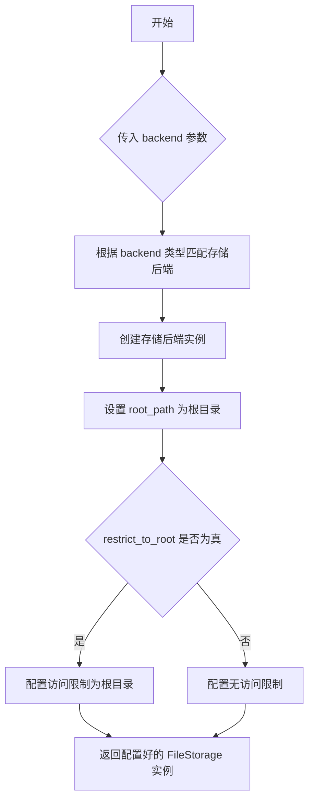
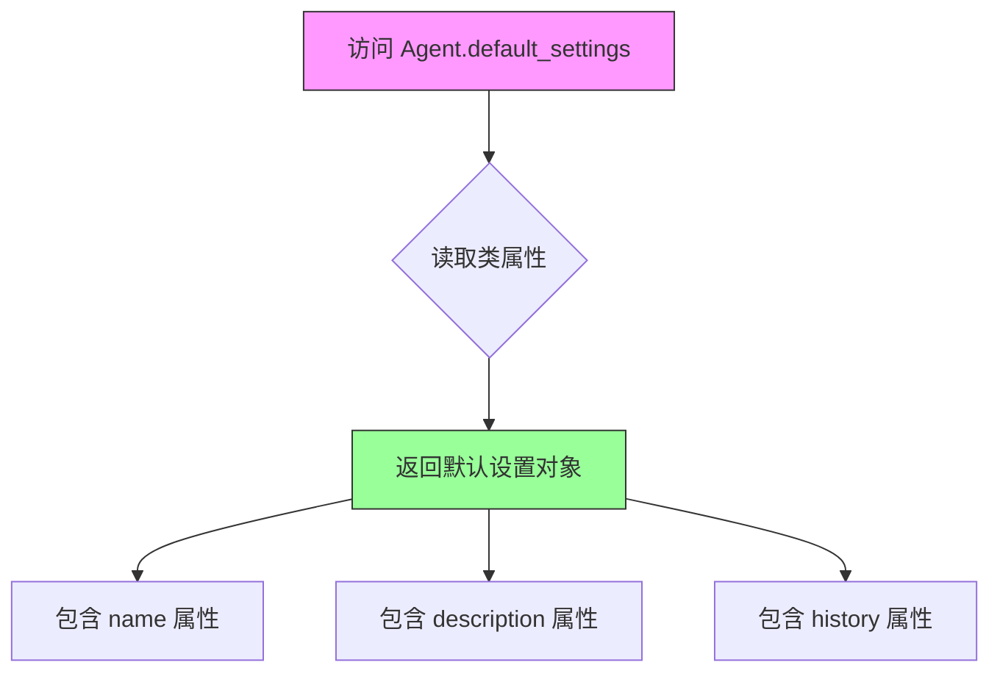
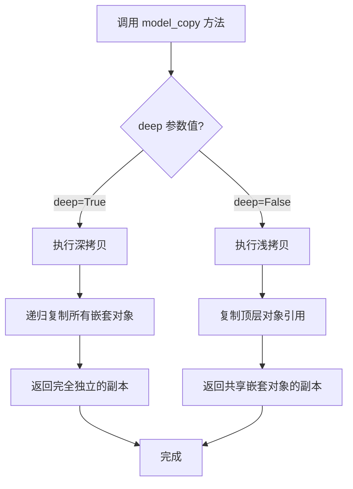

# `.\AutoGPT\classic\original_autogpt\tests\integration\agent_factory.py` 详细设计文档

这是一个 pytest fixture，用于创建模拟的 Agent 对象供测试使用，集成了 AI 配置、LLM 提供者和文件存储后端的初始化过程。

## 整体流程

```mermaid
graph TD
A[开始 dummy_agent fixture] --> B[创建 AIProfile]
B --> C[创建 AgentSettings]
C --> D{判断是否为本地存储}
D -- 是 --> E[local = True]
D -- 否 --> F[local = False]
E --> G[根据配置计算 restrict_to_root]
F --> G
G --> H[调用 get_storage 获取文件存储后端]
H --> I[初始化文件存储 file_storage.initialize()]
I --> J[创建 Agent 实例]
J --> K[返回 agent]
```

## 类结构

```
AppConfig (应用配置类)
├── file_storage_backend
├── restrict_to_workspace
├── fast_llm
├── smart_llm
└── openai_functions
AgentSettings (智能体设置)
├── name
├── description
├── ai_profile
├── config
└── history
AIProfile (AI配置)
├── ai_name
├── ai_role
└── ai_goals
AgentConfiguration (智能体配置)
├── fast_llm
├── smart_llm
└── use_functions_api
MultiProvider (多LLM提供者)
FileStorage (文件存储后端)
```

## 全局变量及字段


### `ai_profile`
    
创建AI配置文件实例

类型：`AIProfile`
    


### `agent_settings`
    
创建智能体设置实例

类型：`AgentSettings`
    


### `local`
    
判断是否为本地存储后端

类型：`bool`
    


### `restrict_to_root`
    
是否限制访问根目录

类型：`bool`
    


### `file_storage`
    
文件存储后端实例

类型：`FileStorage`
    


### `agent`
    
最终创建的智能体实例

类型：`Agent`
    


### `AIProfile.ai_name`
    
AI智能体名称

类型：`str`
    


### `AIProfile.ai_role`
    
AI智能体角色描述

类型：`str`
    


### `AIProfile.ai_goals`
    
AI智能体目标列表

类型：`List[str]`
    


### `AgentSettings.name`
    
智能体名称

类型：`str`
    


### `AgentSettings.description`
    
智能体描述

类型：`str`
    


### `AgentSettings.ai_profile`
    
AI配置

类型：`AIProfile`
    


### `AgentSettings.config`
    
运行时配置

类型：`AgentConfiguration`
    


### `AgentSettings.history`
    
对话历史

类型：`AgentHistory`
    


### `AgentConfiguration.fast_llm`
    
快速LLM实例

类型：`LLM`
    


### `AgentConfiguration.smart_llm`
    
智能LLM实例

类型：`LLM`
    


### `AgentConfiguration.use_functions_api`
    
是否使用函数API

类型：`bool`
    


### `Agent.settings`
    
智能体设置

类型：`AgentSettings`
    


### `Agent.llm_provider`
    
LLM提供者

类型：`MultiProvider`
    


### `Agent.file_storage`
    
文件存储

类型：`FileStorage`
    


### `Agent.app_config`
    
应用配置

类型：`AppConfig`
    


### `AppConfig.file_storage_backend`
    
存储后端类型

类型：`FileStorageBackendName`
    


### `AppConfig.restrict_to_workspace`
    
是否限制工作区

类型：`bool`
    


### `AppConfig.fast_llm`
    
快速LLM

类型：`LLM`
    


### `AppConfig.smart_llm`
    
智能LLM

类型：`LLM`
    


### `AppConfig.openai_functions`
    
OpenAI函数支持

类型：`bool`
    
    

## 全局函数及方法


### `dummy_agent`

这是一个 pytest fixture 函数，用于创建并返回一个模拟的 Agent 实例，以便在测试环境中使用。该 fixture 依赖 `AppConfig` 和 `MultiProvider` 两个外部 fixture，自动配置 AIProfile、AgentSettings、文件存储等组件，并最终实例化一个完整的 Agent 对象供测试调用。

参数：

- `config`：`AppConfig`，应用配置对象，包含 LLM 配置、文件存储后端等设置
- `llm_provider`：`MultiProvider`，多提供者 LLM 客户端，用于与语言模型交互

返回值：`Agent`，配置完成的模拟 Agent 实例，可直接用于单元测试或集成测试

#### 流程图

```mermaid
flowchart TD
    A[开始] --> B[创建 AIProfile 对象]
    B --> C[设置 ai_name='Dummy Agent']
    B --> D[设置 ai_role='Dummy Role']
    B --> E[设置 ai_goals=['Dummy Task']]
    
    F[创建 AgentSettings] --> G[继承 Agent.default_settings 的 name 和 description]
    G --> H[嵌入 AIProfile]
    G --> I[创建 AgentConfiguration:
        - fast_llm: config.fast_llm
        - smart_llm: config.smart_llm
        - use_functions_api: config.openai_functions]
    G --> J[复制 default_settings.history 深拷贝]
    
    K[判断文件存储配置] --> L{config.file_storage_backend == LOCAL?}
    L -->|是| M[local = True]
    L -->|否| N[local = False]
    M --> O[restrict_to_root = not config.restrict_to_workspace]
    N --> P[restrict_to_root = True]
    O --> Q[调用 get_storage 获取文件存储实例]
    P --> Q
    Q --> R[调用 file_storage.initialize 初始化存储]
    
    S[创建 Agent 实例] --> T[传入 settings, llm_provider, file_storage, app_config]
    T --> U[返回 agent 对象]
    
    B -.-> F
    J -.-> S
    R -.-> S
```

#### 带注释源码

```python
from pathlib import Path

import pytest
from forge.config.ai_profile import AIProfile
from forge.file_storage import FileStorageBackendName, get_storage
from forge.llm.providers import MultiProvider

from autogpt.agents.agent import Agent, AgentConfiguration, AgentSettings
from autogpt.app.config import AppConfig


@pytest.fixture
def dummy_agent(config: AppConfig, llm_provider: MultiProvider):
    """
    Pytest fixture，创建并返回一个模拟的 Agent 实例用于测试。
    
    参数:
        config: AppConfig 实例，提供应用级配置（LLM、文件存储等）
        llm_provider: MultiProvider 实例，提供多后端 LLM 调用能力
    
    返回:
        Agent: 配置完成的 Agent 实例
    """
    
    # Step 1: 创建 AIProfile - 定义 AI 助手的基本身份信息
    ai_profile = AIProfile(
        ai_name="Dummy Agent",          # AI 助手名称
        ai_role="Dummy Role",           # AI 助手角色描述
        ai_goals=[
            "Dummy Task",               # AI 助手目标列表
        ],
    )

    # Step 2: 创建 AgentSettings - 封装 Agent 的完整配置
    agent_settings = AgentSettings(
        name=Agent.default_settings.name,           # 使用默认名称
        description=Agent.default_settings.description,  # 使用默认描述
        ai_profile=ai_profile,                       # 注入 AI 身份配置
        config=AgentConfiguration(                  # 创建运行时配置
            fast_llm=config.fast_llm,               # 快速 LLM 配置
            smart_llm=config.smart_llm,             # 智能 LLM 配置
            use_functions_api=config.openai_functions,  # 是否启用 OpenAI functions
        ),
        # 深拷贝默认历史记录配置，避免多测试间共享状态
        history=Agent.default_settings.history.model_copy(deep=True),
    )

    # Step 3: 确定文件存储的根目录限制策略
    local = config.file_storage_backend == FileStorageBackendName.LOCAL  # 是否使用本地存储
    # 如果是本地存储则受 restrict_to_workspace 影响，否则默认限制
    restrict_to_root = not local or config.restrict_to_workspace
    
    # Step 4: 获取并初始化文件存储后端
    file_storage = get_storage(
        config.file_storage_backend,    # 存储后端类型
        root_path=Path("data"),          # 数据根目录
        restrict_to_root=restrict_to_root,  # 是否限制在根目录内
    )
    file_storage.initialize()           # 初始化存储（创建目录等）

    # Step 5: 创建 Agent 实例，组装所有依赖组件
    agent = Agent(
        settings=agent_settings,        # Agent 配置
        llm_provider=llm_provider,      # LLM 提供者
        file_storage=file_storage,      # 文件存储后端
        app_config=config,              # 应用配置引用
    )

    # Step 6: 返回可用的 Agent 实例
    return agent
```


### `get_storage`

获取文件存储后端实例，根据指定的存储后端名称、root_path 和 restrict_to_root 配置创建并返回一个文件存储对象。

参数：

- `backend`：`FileStorageBackendName`，文件存储后端名称，指定使用哪种存储后端（如本地存储等）
- `root_path`：`Path`，可选，关键字参数，存储的根路径，默认为 `Path("data")`
- `restrict_to_root`：`bool`，可选，关键字参数，是否限制在根目录内

返回值：`FileStorage`，返回配置好的文件存储后端实例，用于文件操作

#### 流程图



#### 带注释源码

```python
# 从 forge.file_storage 模块导入存储后端名称和获取存储的函数
from forge.file_storage import FileStorageBackendName, get_storage

# 调用 get_storage 函数创建文件存储后端实例
# 参数 config.file_storage_backend 指定存储后端类型
# 参数 root_path=Path("data") 指定数据存储的根目录为 "data" 文件夹
# 参数 restrict_to_root=restrict_to_root 指定是否限制文件操作在 root_path 内
file_storage = get_storage(
    config.file_storage_backend,
    root_path=Path("data"),
    restrict_to_root=restrict_to_root,
)

# 初始化文件存储后端，准备好存储环境
file_storage.initialize()
```


### `Agent.default_settings`

获取 Agent 的默认设置，包含默认名称、描述和历史记录配置。这是一个类属性（class attribute），返回一个包含默认配置的设置对象。

参数：

- （无参数 - 这是一个类属性访问，非实例方法）

返回值：`AgentSettings` 或类似的配置对象，包含以下属性：
- `name`：字符串，默认智能体名称
- `description`：字符串，默认智能体描述
- `history`：消息历史记录配置对象

#### 流程图



#### 带注释源码

```python
# 以下是从测试代码中提取的 Agent.default_settings 使用方式：

# 创建 AgentSettings 时引用默认设置
agent_settings = AgentSettings(
    name=Agent.default_settings.name,           # 获取默认名称
    description=Agent.default_settings.description,  # 获取默认描述
    ai_profile=ai_profile,
    config=AgentConfiguration(...),
    history=Agent.default_settings.history.model_copy(deep=True),  # 获取默认历史配置并深拷贝
)

# Agent.default_settings 是一个类属性，它提供了 Agent 类的默认配置值
# 该属性返回包含以下字段的配置对象：
# - name: 默认智能体名称
# - description: 默认智能体描述  
# - history: 默认消息历史记录配置
```

#### 补充说明

由于提供的代码片段仅包含测试 fixture，未展示 `Agent.default_settings` 的实际定义，从使用方式可以推断：

1. **属性类型**：这是一个类属性（class attribute），而非实例方法
2. **访问方式**：通过 `Agent.default_settings` 访问
3. **返回值结构**：返回一个配置对象，包含 `name`、`description`、`history` 三个主要属性
4. **设计意图**：提供统一的默认配置，避免在创建多个 Agent 实例时重复定义相同的配置值


### `AgentSettings.model_copy`

深拷贝模型数据，创建一个完全独立的模型副本，包括所有嵌套对象。

参数：

- `deep`：`bool`，指定是否进行深拷贝。`True` 表示复制所有嵌套对象，生成完全独立的副本；`False` 表示浅拷贝，只复制顶层对象引用

返回值：`AgentSettings`，返回模型的副本，类型与原对象相同

#### 流程图



#### 带注释源码

```python
# 在测试代码中的实际使用方式：
history=Agent.default_settings.history.model_copy(deep=True)

# 说明：
# - AgentSettings 应该是基于 Pydantic 的数据模型
# - .model_copy() 是 Pydantic BaseModel 的内置方法
# - deep=True 参数表示进行深拷贝，即所有嵌套对象（如 history）也会被递归复制
# - 返回一个新的 AgentSettings 实例，其所有字段都是独立副本
# - 这样可以避免修改副本影响原始对象
```

## 关键组件


### 一段话描述

该代码是一个pytest测试夹具（fixture），用于在AutoGPT项目中创建模拟的Agent实例，封装了AIProfile配置、AgentSettings设置、文件存储后端初始化等逻辑，为单元测试提供隔离的测试环境。

### 文件的整体运行流程

1. 定义pytest fixture `dummy_agent`
2. 接收config和llm_provider作为依赖注入
3. 创建AIProfile对象，包含AI名称、角色和目标
4. 创建AgentSettings对象，整合AIProfile和AgentConfiguration
5. 根据配置判断文件存储后端类型（本地或远程）
6. 调用get_storage获取文件存储实例
7. 初始化文件存储
8. 创建Agent实例并返回

### 类的详细信息

#### AIProfile类
- **字段**：
  - ai_name: str - AI智能体的名称
  - ai_role: str - AI智能体的角色描述
  - ai_goals: List[str] - AI智能体的目标列表

#### AgentSettings类
- **字段**：
  - name: str - Agent名称
  - description: str - Agent描述
  - ai_profile: AIProfile - AI配置文件
  - config: AgentConfiguration - Agent配置
  - history: Any - 对话历史

#### AgentConfiguration类
- **字段**：
  - fast_llm: Any - 快速LLM模型配置
  - smart_llm: Any - 智能LLM模型配置
  - use_functions_api: bool - 是否使用函数API

#### Agent类
- **方法**：
  - `__init__`: 初始化Agent实例
    - 参数：settings(AgentSettings), llm_provider(MultiProvider), file_storage(FileStorage), app_config(AppConfig)
    - 返回值：None

### 关键组件信息

### dummy_agent fixture
pytest测试夹具，负责构建测试用Agent实例，整合配置、LLM提供者、文件存储等依赖

### AIProfile
AI配置文件数据结构，定义智能体的身份和目标属性

### AgentSettings
Agent设置类，聚合配置信息用于Agent初始化

### AgentConfiguration
Agent运行时配置，封装LLM模型选择和函数API开关

### FileStorageBackendName
文件存储后端枚举，标识LOCAL等存储类型

### get_storage
工厂函数，根据后端类型和路径配置创建相应的文件存储实例

### Agent
核心智能体类，代表AutoGPT中的自主执行单元

### 潜在的技术债务或优化空间

1. **硬编码路径**：`root_path=Path("data")` 使用硬编码路径，应从配置读取
2. **重复配置**：default_settings.model_copy(deep=True) 复制逻辑可提取为工具函数
3. **紧耦合**：fixture直接实例化多个配置对象，测试灵活性受限
4. **缺失错误处理**：文件存储初始化失败时无明确异常处理
5. **类型注解不完整**：部分字段使用Any，应补充具体类型

### 其它项目

#### 设计目标与约束
- 提供隔离的测试环境，不依赖真实LLM API
- 支持本地和远程文件存储后端
- 遵循pytest fixture生命周期管理

#### 错误处理与异常设计
- 文件存储初始化可能抛出异常
- 配置对象缺失字段时依赖默认值

#### 数据流与状态机
- 配置数据自上而下流动：AppConfig → AgentConfiguration → AgentSettings → Agent
- 文件存储状态：未初始化 → 已初始化

#### 外部依赖与接口契约
- 依赖pytest框架
- 依赖forge包提供的配置和存储抽象
- 依赖autogpt.agents.agent模块的Agent类


## 问题及建议


### 已知问题

-   **硬编码路径**：`Path("data")` 被硬编码在 fixture 中，应作为配置参数注入，提高可配置性
-   **缺乏错误处理**：`get_storage()` 和 `file_storage.initialize()` 调用缺乏异常捕获，存储初始化失败时会导致测试行为不明确
-   **魔法字符串**：`"data"` 作为字符串字面量存在，应提取为常量或配置项
-   **配置逻辑嵌套过深**：`restrict_to_root` 的条件判断逻辑嵌套在单行中，可读性较差
-   **缺少类型注解**：`agent` 变量声明时未指定返回类型注解
-   **测试隔离性不足**：创建的 `agent` 对象未显式关闭或清理，可能影响测试用例间的隔离性

### 优化建议

-   将 `root_path` 参数化，通过 fixture 参数或配置文件传入，避免硬编码
-   为 `get_storage` 和 `initialize` 调用添加 try-except 块或 pytest 的 pytest.raises 验证
-   使用 `typing.cast` 或显式类型注解为 `agent` 变量添加类型声明
-   提取嵌套的条件逻辑为独立函数或变量，提升可读性
-   考虑实现 `agent` 的上下文管理器支持或在 fixture 中添加 yield/finally 块确保资源清理
-   为 fixture 添加 docstring 描述其用途和依赖


## 其它


### 概述

该代码定义了一个pytest fixture `dummy_agent`，用于在测试环境中创建并返回一个配置完整的Agent实例。它通过接收应用配置和LLM提供者作为参数，初始化AIProfile、AgentSettings、文件存储后端，最终构建一个可用于集成测试的虚拟代理对象。

### 整体运行流程

1. **接收依赖注入**：fixture接收`AppConfig`和`MultiProvider`两个参数，这两个参数由pytest容器注入。
2. **构建AIProfile**：创建AIProfile对象，设置AI名称为"Dummy Agent"、角色为"Dummy Role"、目标为["Dummy Task"]。
3. **配置AgentSettings**：使用默认设置结合自定义AIProfile和配置信息（fast_llm、smart_llm、use_functions_api）创建AgentSettings。
4. **确定文件存储策略**：根据配置判断使用本地存储还是远程存储，并设置是否限制访问根目录。
5. **初始化文件存储**：调用`get_storage`获取存储后端实例，并调用`initialize()`方法进行初始化。
6. **创建Agent实例**：将所有配置和依赖注入Agent构造函数，返回配置完整的Agent实例。

### 类详细信息

虽然该代码为pytest fixture，但其使用了以下核心类：

- **AIProfile** (forge.config.ai_profile)：定义AI代理的配置画像，包含名称、角色和目标。
- **AgentSettings** (autogpt.agents.agent)：代理的完整配置类，包含名称、描述、AI配置、历史记录等。
- **AgentConfiguration** (autogpt.agents.agent)：代理运行时配置，封装LLM模型选择和API设置。
- **Agent** (autogpt.agents.agent)：核心代理类，负责执行任务和与LLM交互。
- **AppConfig** (autogpt.app.config)：应用全局配置类，提供LLM、文件存储等配置。
- **MultiProvider** (forge.llm.providers)：多提供商LLM封装，支持动态路由。

### 类字段

由于该代码为fixture（非类定义），无可定义的类字段。但其创建的对象包含以下关键字段：

- **AIProfile.ai_name** (str)：AI代理名称
- **AIProfile.ai_role** (str)：AI代理角色描述
- **AIProfile.ai_goals** (List[str])：AI代理目标列表
- **AgentSettings.config** (AgentConfiguration)：包含fast_llm、smart_llm和use_functions_api的配置对象
- **AgentSettings.history** (ConversationHistory)：对话历史记录

### 类方法

该fixture未定义类，但使用了以下关键方法：

- **AgentSettings.model_copy(deep=True)**：复制历史记录配置，确保测试隔离
- **get_storage()**：工厂函数，根据后端名称返回对应的存储实现
- **file_storage.initialize()**：初始化存储后端
- **Agent.__init__()**：构造函数，接收设置、LLM提供者、文件存储和应用配置

### 全局变量和全局函数

- **Path** (pathlib.Path)：用于处理文件路径的类
- **pytest**：测试框架
- **AIProfile** (类型/类)：forge.config.ai_profile模块导入
- **FileStorageBackendName** (枚举)：forge.file_storage模块导入，定义存储后端类型
- **get_storage** (函数)：forge.file_storage模块导入，用于获取存储实例
- **MultiProvider** (类型/类)：forge.llm.providers模块导入
- **Agent, AgentConfiguration, AgentSettings** (类型/类)：autogpt.agents.agent模块导入
- **AppConfig** (类型/类)：autogpt.app.config模块导入
- **dummy_agent** (pytest fixture函数)：定义测试fixture，返回Agent实例

### 关键组件信息

- **Agent实例**：核心被测对象，包含完整的配置和依赖，用于验证代理行为
- **文件存储后端**：负责测试环境中的文件读写操作，支持本地和远程存储
- **LLM提供者**：提供大语言模型接口，用于Agent与模型交互
- **配置对象**：AppConfig提供全局配置，AgentSettings提供代理级配置

### 潜在的技术债务或优化空间

1. **硬编码路径**：`root_path=Path("data")`硬编码了存储路径，应从配置读取或参数化
2. **配置耦合**：fixture直接依赖AppConfig和MultiProvider的具体实现，单元测试应使用mock对象
3. **初始化逻辑**：文件存储初始化逻辑与fixture耦合，难以独立测试
4. **缺乏错误处理**：未处理配置缺失或无效的情况，如LLM provider为None
5. **重复配置**：AgentConfiguration中使用了config对象的属性，可考虑使用配置模板简化

### 其它项目

#### 设计目标与约束

- **目标**：为集成测试提供一个可复用的、配置完整的Agent实例，避免测试用例重复配置
- **约束**：
  - 依赖pytest容器提供的config和llm_provider fixture
  - 文件存储使用固定根路径"data"，测试环境限定
  - Agent使用默认历史记录，需深拷贝以避免状态污染

#### 错误处理与异常设计

- **参数校验**：若config或llm_provider为None，Agent初始化时可能抛出AttributeError或TypeError
- **存储初始化失败**：file_storage.initialize()可能抛出IOError或权限错误
- **配置缺失**：AgentConfiguration所需的fast_llm或smart_llm为None时，运行时会失败
- **建议改进**：添加参数校验和默认值处理，使用try-except包装初始化逻辑

#### 数据流与状态机

- **数据流**：
  - 输入：AppConfig → MultiProvider → AIProfile
  - 处理：配置组装 → 存储初始化 → Agent实例化
  - 输出：配置完整的Agent对象
- **状态机**：Fixture本身无状态，但Agent实例存在初始化态（未运行）、运行中、已完成等生命周期状态

#### 外部依赖与接口契约

- **forge.config.ai_profile.AIProfile**：需提供ai_name、ai_role、ai_goals参数
- **forge.file_storage.get_storage**：签名应为`get_storage(backend: FileStorageBackendName, root_path: Path, restrict_to_root: bool) -> FileStorage`，需实现initialize()方法
- **autogpt.agents.agent.Agent**：构造函数签名`Agent(settings: AgentSettings, llm_provider: MultiProvider, file_storage: FileStorage, app_config: AppConfig)`
- **pytest fixture契约**：dummy_agent依赖config和llm_provider fixture，需确保容器已注册相应scope的fixture


    