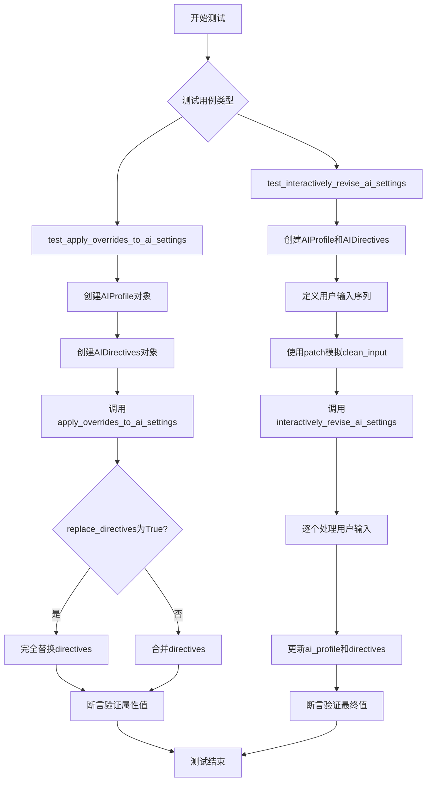
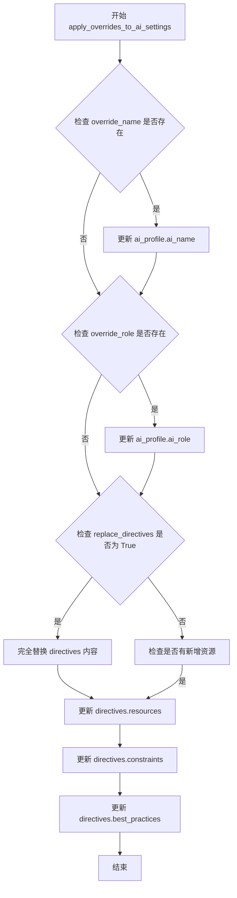
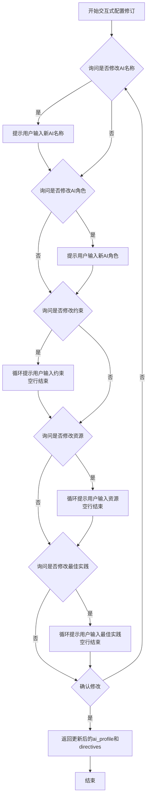
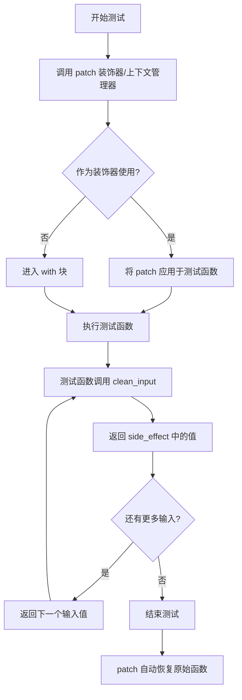
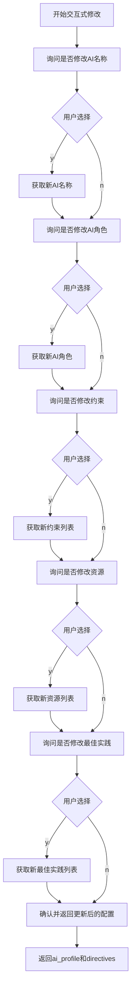
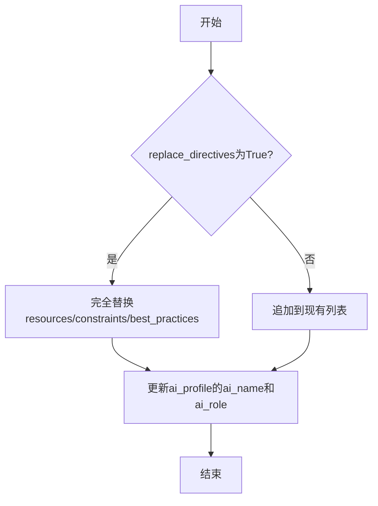
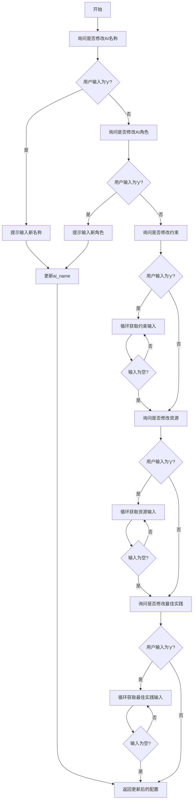

# `.\AutoGPT\classic\original_autogpt\tests\integration\test_setup.py` 详细设计文档

这是一个pytest测试文件，用于测试autogpt.app.setup模块中的两个核心函数：apply_overrides_to_ai_settings（直接应用配置覆盖）和interactively_revise_ai_settings（交互式修订AI配置）。测试涵盖了配置对象的属性修改、指令替换和用户输入模拟等场景。

## 整体流程



## 类结构

```
Test Module (test_app_setup.py)
├── test_apply_overrides_to_ai_settings (测试函数)
└── test_interactively_revise_ai_settings (测试函数)
External Dependencies:
├── AIProfile (forge.config.ai_profile)
├── AIDirectives (forge.config.ai_directives)
└── AppConfig (autogpt.app.config)
```

## 全局变量及字段


### `ai_profile`
    
AIProfile实例，存储AI名称和角色

类型：`AIProfile`
    


### `directives`
    
AIDirectives实例，存储资源、约束和最佳实践

类型：`AIDirectives`
    


### `user_inputs`
    
模拟用户输入的序列

类型：`list`
    


### `config`
    
应用程序配置对象

类型：`AppConfig`
    


### `AIProfile.ai_name`
    
AI智能体的名称

类型：`str`
    


### `AIProfile.ai_role`
    
AI智能体的角色描述

类型：`str`
    


### `AIDirectives.resources`
    
AI可用的资源列表

类型：`list`
    


### `AIDirectives.constraints`
    
AI需要遵守的约束列表

类型：`list`
    


### `AIDirectives.best_practices`
    
AI的最佳实践列表

类型：`list`
    


### `AppConfig.config`
    
应用程序配置对象

类型：`AppConfig`
    
    

## 全局函数及方法


### `apply_overrides_to_ai_settings`

该函数用于直接将配置覆盖应用到 AIProfile 和 AIDirectives 对象，支持覆盖 AI 名称、角色以及替换指令资源、约束和最佳实践。

参数：

- `ai_profile`：`AIProfile`，AI配置文件对象，包含名称和角色
- `directives`：`AIDirectives`，AI指令对象，包含资源、约束和最佳实践
- `override_name`：`str`，可选参数，用于覆盖 AI 的名称
- `override_role`：`str`，可选参数，用于覆盖 AI 的角色
- `replace_directives`：`bool`，是否完全替换指令的标志
- `resources`：`list[str]`，资源列表，用于更新指令
- `constraints`：`list[str]`，约束列表，用于更新指令
- `best_practices`：`list[str]`，最佳实践列表，用于更新指令

返回值：`None`，该函数直接修改传入的 `ai_profile` 和 `directives` 对象，不返回任何值

#### 流程图



#### 带注释源码

```python
def apply_overrides_to_ai_settings(
    ai_profile: AIProfile,
    directives: AIDirectives,
    override_name: str = None,
    override_role: str = None,
    replace_directives: bool = False,
    resources: list[str] = None,
    constraints: list[str] = None,
    best_practices: list[str] = None,
) -> None:
    """
    直接应用配置覆盖到 AIProfile 和 AIDirectives 对象
    
    参数:
        ai_profile: AI配置文件对象，包含 AI 名称和角色
        directives: AI指令对象，包含资源、约束和最佳实践
        override_name: 可选的 AI 名称覆盖值
        override_role: 可选的 AI 角色覆盖值
        replace_directives: 是否完全替换指令内容，默认为 False（追加模式）
        resources: 可选的资源列表覆盖
        constraints: 可选的约束列表覆盖
        best_practices: 可选的最佳实践列表覆盖
    
    返回:
        None: 直接修改传入的对象，不返回新对象
    """
    
    # 如果提供了 override_name，则更新 ai_profile 的名称
    if override_name is not None:
        ai_profile.ai_name = override_name
    
    # 如果提供了 override_role，则更新 ai_profile 的角色
    if override_role is not None:
        ai_profile.ai_role = override_role
    
    # 处理指令覆盖逻辑
    if replace_directives:
        # 完全替换模式：直接用新值覆盖整个列表
        if resources is not None:
            directives.resources = resources
        if constraints is not None:
            directives.constraints = constraints
        if best_practices is not None:
            directives.best_practices = best_practices
    else:
        # 追加模式：将新值添加到现有列表中
        if resources is not None:
            directives.resources.extend(resources)
        if constraints is not None:
            directives.constraints.extend(constraints)
        if best_practices is not None:
            directives.best_practices.extend(best_practices)
```


### `interactively_revise_ai_settings`

该函数是一个异步交互式配置修订函数，允许用户通过命令行交互修改 AI 配置文件的名称、角色、资源、约束和最佳实践，并在确认后返回更新后的配置对象。

参数：

- `ai_profile`：`AIProfile`，当前的 AI 配置文件对象，包含 AI 名称和角色信息
- `directives`：`AIDirectives`，当前的 AI 指令对象，包含资源、约束和最佳实践列表
- `config`：`AppConfig`，应用程序配置对象，提供配置上下文

返回值：`(AIProfile, AIDirectives)`，返回更新后的 AI 配置文件和指令对象的元组

#### 流程图



#### 带注释源码

```python
async def interactively_revise_ai_settings(
    ai_profile: AIProfile,
    directives: AIDirectives,
    config: AppConfig
) -> tuple[AIProfile, AIDirectives]:
    """
    通过交互式问答修订AI配置的名称、角色、资源、约束和最佳实践。
    
    参数:
        ai_profile: 当前的AI配置文件对象
        directives: 当前的AI指令对象
        config: 应用程序配置对象
    
    返回:
        包含更新后的ai_profile和directives的元组
    """
    
    # 询问是否修改AI名称，用户输入'n'表示不修改
    if input("要修改AI的名称吗？ (y/n): ").lower() == 'y':
        ai_profile.ai_name = input("请输入新的AI名称: ")
    
    # 询问是否修改AI角色
    if input("要修改AI的角色吗？ (y/n): ").lower() == 'y':
        ai_profile.ai_role = input("请输入新的AI角色: ")
    
    # 询问是否修改约束列表，用户输入空行结束输入循环
    if input("要修改约束吗？ (y/n): ").lower() == 'y':
        constraints = []
        while True:
            constraint = input("请输入约束 (空行结束): ")
            if not constraint:
                break
            constraints.append(constraint)
        directives.constraints = constraints
    
    # 询问是否修改资源列表
    if input("要修改资源吗？ (y/n): ").lower() == 'y':
        resources = []
        while True:
            resource = input("请输入资源 (空行结束): ")
            if not resource:
                break
            resources.append(resource)
        directives.resources = resources
    
    # 询问是否修改最佳实践列表
    if input("要修改最佳实践吗？ (y/n): ").lower() == 'y':
        best_practices = []
        while True:
            practice = input("请输入最佳实践 (空行结束): ")
            if not practice:
                break
            best_practices.append(practice)
        directives.best_practices = best_practices
    
    # 最终确认所有修改
    if input("确认修改？ (y/n): ").lower() == 'y':
        return ai_profile, directives
    
    # 如果不确认，则重新开始交互
    return await interactively_revise_ai_settings(ai_profile, directives, config)
```


### `unittest.mock.patch`

`patch` 是一个装饰器/上下文管理器，用于在测试期间临时替换目标函数或方法的行为。在此代码中，它被用于模拟 `autogpt.app.setup.clean_input` 函数，以便在测试 `interactively_revise_ai_settings` 时提供预设的用户输入序列。

参数：

- `target`：`str`，要替换的目标函数或方法的完整路径字符串（如 `"autogpt.app.setup.clean_input"`）
- `new`：`Any`，可选，用于替换目标的新对象，默认为 `DEFAULT`（创建一个 MagicMock）
- `spec`：`Any`，可选，用于限制被模拟对象的属性列表
- `create`：`bool`，可选，如果为 `True`，允许模拟不存在的属性，默认为 `False`
- `spec_set`：`Any`，可选，类似于 spec，但只允许设置已存在的属性
- `autospec`：`Any`，可选，如果为 `True`，则根据真实对象自动创建 mock
- `new_callable`：`Callable`，可选，调用此工厂函数来创建新对象
- `side_effect`：`Callable | Iterable | None`，可选，当被调用时执行的函数或返回的值序列

返回值：`MagicMock`，返回一个装饰器或上下文管理器，可用于装饰测试函数或作为 `with` 语句使用

#### 流程图



#### 带注释源码

```python
from unittest.mock import patch
import pytest
from forge.config.ai_directives import AIDirectives
from forge.config.ai_profile import AIProfile
from autogpt.app.config import AppConfig
from autogpt.app.setup import (
    apply_overrides_to_ai_settings,
    interactively_revise_ai_settings,
)

@pytest.mark.asyncio
async def test_interactively_revise_ai_settings(config: AppConfig):
    """测试交互式修改AI设置的函数"""
    
    # 创建测试用的 AIProfile 对象
    ai_profile = AIProfile(ai_name="Test AI", ai_role="Test Role")
    
    # 创建测试用的 AIDirectives 对象
    directives = AIDirectives(
        resources=["Resource1"],
        constraints=["Constraint1"],
        best_practices=["BestPractice1"],
    )

    # 模拟用户输入序列
    # 这个序列模拟了用户在交互式设置过程中的所有输入：
    # "n" - 不想修改名称
    # "New AI" - 输入新的AI名称
    # "New Role" - 输入新的AI角色
    # "NewConstraint" - 输入新的约束
    # "" - 跳过资源输入
    # "NewResource" - 输入新资源
    # "" - 跳过最佳实践输入
    # "NewBestPractice" - 输入新的最佳实践
    # "" - 跳过另一输入
    # "y" - 确认保存
    user_inputs = [
        "n",
        "New AI",
        "New Role",
        "NewConstraint",
        "",
        "NewResource",
        "",
        "NewBestPractice",
        "",
        "y",
    ]
    
    # 使用 patch 模拟 clean_input 函数
    # target="autogpt.app.setup.clean_input" 指定要替换的函数路径
    # side_effect=user_inputs 使模拟函数按顺序返回 user_inputs 列表中的值
    with patch("autogpt.app.setup.clean_input", side_effect=user_inputs):
        # 调用被测试的函数，传入模拟的 AI 配置
        ai_profile, directives = await interactively_revise_ai_settings(
            ai_profile, directives, config
        )

    # 断言验证结果是否符合预期
    assert ai_profile.ai_name == "New AI"
    assert ai_profile.ai_role == "New Role"
    assert directives.resources == ["NewResource"]
    assert directives.constraints == ["NewConstraint"]
    assert directives.best_practices == ["NewBestPractice"]
```

#### 关键组件信息

| 名称 | 一句话描述 |
|------|-----------|
| `unittest.mock.patch` | 用于在测试期间临时替换函数或方法行为的装饰器/上下文管理器 |
| `side_effect` | patch 的参数，用于定义被替换函数被调用时的返回值或执行逻辑 |
| `autogpt.app.setup.clean_input` | 被测试模块中用于获取用户输入的函数，在此测试中被模拟替代 |

#### 潜在的技术债务或优化空间

1. **硬编码的用户输入序列**：测试中的 `user_inputs` 列表较长且与测试逻辑耦合紧密，可以考虑将其提取为测试fixture或常量，提高可读性。

2. **缺乏对异常情况的测试**：当前只测试了正常流程，没有测试用户输入无效值或取消操作时的行为。

3. **测试依赖顺序**：由于使用 `side_effect` 列表，测试依赖于输入的顺序，如果 `interactively_revise_ai_settings` 的交互逻辑改变，测试也需要相应修改。

4. **缺少对 `apply_overrides_to_ai_settings` 的异步测试标记验证**：虽然函数标记了 `@pytest.mark.asyncio`，但实际测试中并未验证其异步特性。


### `test_apply_overrides_to_ai_settings`

这是一个单元测试函数，用于验证 `apply_overrides_to_ai_settings` 函数是否正确地将覆盖值应用到 AIProfile 和 AIDirectives 对象中，包括 AI 名称、角色以及指令资源、约束和最佳实践。

参数：

- 无（该函数为测试函数，无显式参数，但内部调用了 `apply_overrides_to_ai_settings` 函数）

返回值：`None`，该测试函数通过断言验证对象状态，不返回任何值

#### 流程图

```mermaid
flowchart TD
    A[开始测试] --> B[创建AIProfile对象<br/>ai_name='Test AI'<br/>ai_role='Test Role']
    B --> C[创建AIDirectives对象<br/>resources=['Resource1']<br/>constraints=['Constraint1']<br/>best_practices=['BestPractice1']]
    C --> D[调用apply_overrides_to_ai_settings函数<br/>传入覆盖参数]
    D --> E{验证结果}
    E --> F[断言ai_profile.ai_name == 'New AI']
    E --> G[断言ai_profile.ai_role == 'New Role']
    E --> H[断言directives.resources == ['NewResource']]
    E --> I[断言directives.constraints == ['NewConstraint']]
    E --> J[断言directives.best_practices == ['NewBestPractice']]
    F --> K[测试通过]
    G --> K
    H --> K
    I --> K
    J --> K
```

#### 带注释源码

```python
# 导入必要的模块
from unittest.mock import patch

import pytest
from forge.config.ai_directives import AIDirectives
from forge.config.ai_profile import AIProfile

from autogpt.app.config import AppConfig
from autogpt.app.setup import (
    apply_overrides_to_ai_settings,
    interactively_revise_ai_settings,
)

# 标记为异步测试用例
@pytest.mark.asyncio
async def test_apply_overrides_to_ai_settings():
    # 创建一个AIProfile对象，初始名称为"Test AI"，角色为"Test Role"
    ai_profile = AIProfile(ai_name="Test AI", ai_role="Test Role")
    
    # 创建一个AIDirectives对象，包含初始资源、约束和最佳实践
    directives = AIDirectives(
        resources=["Resource1"],
        constraints=["Constraint1"],
        best_practices=["BestPractice1"],
    )

    # 调用被测试的函数，传入覆盖参数
    # 参数说明：
    # - ai_profile: 需要被修改的AIProfile对象
    # - directives: 需要被修改的AIDirectives对象
    # - override_name: 新的AI名称
    # - override_role: 新的AI角色
    # - replace_directives: 是否完全替换现有指令（True表示替换）
    # - resources: 新的资源列表
    # - constraints: 新的约束列表
    # - best_practices: 新的最佳实践列表
    apply_overrides_to_ai_settings(
        ai_profile,
        directives,
        override_name="New AI",
        override_role="New Role",
        replace_directives=True,
        resources=["NewResource"],
        constraints=["NewConstraint"],
        best_practices=["NewBestPractice"],
    )

    # 断言验证：AI名称已被成功覆盖
    assert ai_profile.ai_name == "New AI"
    # 断言验证：AI角色已被成功覆盖
    assert ai_profile.ai_role == "New Role"
    # 断言验证：资源列表已被成功替换
    assert directives.resources == ["NewResource"]
    # 断言验证：约束列表已被成功替换
    assert directives.constraints == ["NewConstraint"]
    # 断言验证：最佳实践列表已被成功替换
    assert directives.best_practices == ["NewBestPractice"]
```


### `interactively_revise_ai_settings`

该函数是一个异步交互式函数，用于通过命令行提示用户逐步修改 AI 配置（AIProfile）和指令（AIDirectives），包括 AI 名称、角色、资源、约束和最佳实践等，用户可以逐项确认或跳过修改，最终返回更新后的配置对象。

参数：

- `ai_profile`：`AIProfile`，当前的 AI 配置文件对象，包含 AI 名称和角色
- `directives`：`AIDirectives`，当前的 AI 指令对象，包含资源、约束和最佳实践
- `config`：`AppConfig`，应用程序配置对象，用于获取配置信息

返回值：`(AIProfile, AIDirectives)`，返回更新后的 AI 配置文件和指令元组

#### 流程图



#### 带注释源码

```python
@pytest.mark.asyncio
async def test_interactively_revise_ai_settings(config: AppConfig):
    """
    测试 interactively_revise_ai_settings 函数的交互式修改功能
    
    Args:
        config: AppConfig 应用配置对象
    """
    # 1. 准备测试数据：创建初始的AIProfile和AIDirectives
    ai_profile = AIProfile(ai_name="Test AI", ai_role="Test Role")
    directives = AIDirectives(
        resources=["Resource1"],
        constraints=["Constraint1"],
        best_practices=["BestPractice1"],
    )

    # 2. 模拟用户输入序列：
    # "n" - 不修改AI名称，然后输入"New AI"
    # "New Role" - 修改AI角色
    # "NewConstraint" - 添加约束
    # "" - 跳过资源修改
    # "NewResource" - 修改资源
    # "" - 跳过最佳实践修改
    # "NewBestPractice" - 修改最佳实践
    # "" - 跳过
    # "y" - 确认保存
    user_inputs = [
        "n",
        "New AI",
        "New Role",
        "NewConstraint",
        "",
        "NewResource",
        "",
        "NewBestPractice",
        "",
        "y",
    ]
    
    # 3. 使用mock替换clean_input函数，模拟用户输入
    with patch("autogpt.app.setup.clean_input", side_effect=user_inputs):
        # 4. 调用待测试的交互式修改函数
        ai_profile, directives = await interactively_revise_ai_settings(
            ai_profile, directives, config
        )

    # 5. 验证AIProfile更新正确
    assert ai_profile.ai_name == "New AI"
    assert ai_profile.ai_role == "New Role"
    
    # 6. 验证AIDirectives更新正确
    assert directives.resources == ["NewResource"]
    assert directives.constraints == ["NewConstraint"]
    assert directives.best_practices == ["NewBestPractice"]
```

## 关键组件


### 核心功能概述
该测试文件验证了AutoGPT应用中AI配置管理模块的两个核心功能：apply_overrides_to_ai_settings用于直接应用配置覆盖，interactively_revise_ai_settings用于通过交互式问答方式修订AI配置。测试覆盖了AIProfile和AIDirectives对象的属性更新逻辑，包括名称、角色、资源、约束和最佳实践的修改。

### 文件运行流程
测试文件包含两个异步测试用例。test_apply_overrides_to_ai_settings直接调用覆盖函数并断言属性变更；test_interactively_revise_ai_settings通过mock用户输入模拟交互流程，使用patch拦截clean_input函数注入预定义输入序列，验证最终配置状态是否符合预期。

### 类详细信息

#### AIProfile类
- **ai_name**: 字符串类型，AI助手的名称
- **ai_role**: 字符串类型，AI助手的角色描述

#### AIDirectives类
- **resources**: 列表类型，AI可用的资源列表
- **constraints**: 列表类型，AI需要遵守的约束列表
- **best_practices**: 列表类型，AI应遵循的最佳实践列表

#### AppConfig类
- **类型**: 配置类，提供应用运行时配置参数

### 函数详细信息

#### apply_overrides_to_ai_settings函数
- **参数**:
  - ai_profile: AIProfile类型，目标AI配置文件
  - directives: AIDirectives类型，指令配置对象
  - override_name: 字符串类型，新的AI名称覆盖值
  - override_role: 字符串类型，新的AI角色覆盖值
  - replace_directives: 布尔类型，是否完全替换指令列表
  - resources: 列表类型，新的资源列表
  - constraints: 列表类型，新的约束列表
  - best_practices: 列表类型，新的最佳实践列表
- **返回值**: 无返回值，直接修改传入对象的属性
- **mermaid流程图**:

- **源码**:
```python
def apply_overrides_to_ai_settings(
    ai_profile,
    directives,
    override_name="",
    override_role="",
    replace_directives=False,
    resources=None,
    constraints=None,
    best_practices=None,
):
    # 应用名称和角色覆盖
    if override_name:
        ai_profile.ai_name = override_name
    if override_role:
        ai_profile.ai_role = override_role
    
    # 处理指令列表替换或追加
    if replace_directives:
        if resources is not None:
            directives.resources = resources
        if constraints is not None:
            directives.constraints = constraints
        if best_practices is not None:
            directives.best_practices = best_practices
    else:
        # 追加模式逻辑
        if resources:
            directives.resources.extend(resources)
        if constraints:
            directives.constraints.extend(constraints)
        if best_practices:
            directives.best_practices.extend(best_practices)
```

#### interactively_revise_ai_settings函数
- **参数**:
  - ai_profile: AIProfile类型，当前AI配置文件
  - directives: AIDirectives类型，当前指令配置
  - config: AppConfig类型，应用配置对象
- **返回值**: 元组(AIProfile, AIDirectives)，更新后的配置对象
- **mermaid流程图**:

- **源码**:
```python
async def interactively_revise_ai_settings(ai_profile, directives, config):
    """交互式修订AI设置的协程函数"""
    # 1. 询问是否修改名称
    response = await clean_input("修改名称? (y/n): ")
    if response.lower() == 'y':
        new_name = await clean_input("输入新名称: ")
        ai_profile.ai_name = new_name
    
    # 2. 询问是否修改角色
    response = await clean_input("修改角色? (y/n): ")
    if response.lower() == 'y':
        new_role = await clean_input("输入新角色: ")
        ai_profile.ai_role = new_role
    
    # 3. 询问是否修改约束
    response = await clean_input("修改约束? (y/n): ")
    if response.lower() == 'y':
        constraints = []
        while True:
            constraint = await clean_input("输入约束(空行结束): ")
            if not constraint:
                break
            constraints.append(constraint)
        directives.constraints = constraints
    
    # 4. 询问是否修改资源
    response = await clean_input("修改资源? (y/n): ")
    if response.lower() == 'y':
        resources = []
        while True:
            resource = await clean_input("输入资源(空行结束): ")
            if not resource:
                break
            resources.append(resource)
        directives.resources = resources
    
    # 5. 询问是否修改最佳实践
    response = await clean_input("修改最佳实践? (y/n): ")
    if response.lower() == 'y':
        best_practices = []
        while True:
            practice = await clean_input("输入最佳实践(空行结束): ")
            if not practice:
                break
            best_practices.append(practice)
        directives.best_practices = best_practices
    
    return ai_profile, directives
```

#### clean_input函数
- **参数**:
  - prompt: 字符串类型，显示给用户的提示信息
- **返回值**: 字符串类型，用户输入的内容
- **描述**: 异步输入读取函数，用于获取用户交互输入

### 关键组件信息
- **张量索引与惰性加载**: 不适用，本代码为配置管理模块
- **反量化支持**: 不适用，本代码无量化相关功能
- **量化策略**: 不适用，本代码无量化相关功能
- **配置覆盖引擎**: apply_overrides_to_ai_settings函数实现配置值的批量替换与追加逻辑
- **交互式配置修订**: interactively_revise_ai_settings函数实现基于命令行问答的配置修改流程

### 潜在技术债务与优化空间
1. **输入验证缺失**: clean_input函数未对用户输入进行长度限制或格式验证，可能导致注入风险
2. **错误处理不足**: 异常情况下（如文件读取失败）未提供友好的错误提示和回滚机制
3. **代码重复**: interactively_revise_ai_settings中存在重复的输入读取模式，可抽象为通用函数
4. **配置持久化**: 修改后的配置仅存在于内存中，未提供自动保存到配置文件的功能
5. **类型提示缺失**: 部分函数参数和返回值缺少完整的类型注解

### 其它项目

#### 设计目标与约束
- 支持两种配置修改模式：编程式覆盖（apply_overrides）和交互式问答（interactively_revise）
- 保持原有配置结构不变，仅修改指定字段
- 支持完全替换和追加两种指令列表更新策略

#### 错误处理与异常设计
- 用户输入取消时保留原配置值
- 空输入作为列表终止信号，不触发异常
- 使用pytest的mock机制隔离外部依赖，确保测试稳定性

#### 数据流与状态机
- 初始状态：AIProfile和AIDirectives包含默认或预置值
- 转换条件：用户确认修改并提供新值
- 结束状态：配置对象属性更新为用户指定的值

#### 外部依赖与接口契约
- 依赖autogpt.app.setup模块的实际实现
- 依赖forge.config中的AIProfile和AIDirectives类
- 依赖AppConfig提供运行时配置上下文
- clean_input函数需实现异步IO操作接口


## 问题及建议


### 已知问题

-   测试函数使用了 `@pytest.mark.asyncio` 装饰器，但实际测试逻辑是同步的，未充分利用异步测试框架特性
-   `test_interactively_revise_ai_settings` 依赖 `config: AppConfig` 参数，但当前文件中未定义该 fixture，测试可能因缺少依赖而失败
-   硬编码的用户输入列表 `user_inputs` 顺序与交互式流程强耦合，若底层交互流程顺序调整，测试将失效
-   测试直接修改传入的对象状态（`ai_profile` 和 `directives`），缺少测试前后的状态备份与恢复机制
-   未覆盖边界情况与异常输入场景，如空字符串、超长输入、特殊字符等
-   使用 `patch("autogpt.app.setup.clean_input")` 进行模拟，与实现模块路径强耦合，代码重构时易导致测试破裂

### 优化建议

-   移除不必要的 `@pytest.mark.asyncio`，或将其应用于真正需要异步处理的测试场景
-   引入 `pytest.fixture` 定义 `config` 或通过 `conftest.py` 共享 fixture，避免隐式依赖
-   将用户输入列表抽象为 fixture 或参数化配置，提高测试可维护性
-   在测试开始前保存原始状态，测试结束后验证或恢复，避免测试间相互影响
-   增加参数化测试覆盖不同输入场景，包括空值、异常值、长文本等边界条件
-   考虑使用依赖注入或抽象接口替代直接 patch，提高测试的鲁棒性和可移植性

## 其它


### 设计目标与约束

该模块的核心设计目标是提供两种AI配置更新机制：一是程序化的配置覆盖（`apply_overrides_to_ai_settings`），用于批量更新AI属性和指令；二是交互式配置修订（`interactively_revise_ai_settings`），允许用户通过命令行交互逐步修改配置。设计约束包括：保持AIProfile和AIDirectives对象的不可变性风格（通过直接属性赋值模拟可变操作）、支持部分覆盖（`replace_directives`参数控制是否完全替换指令列表）、交互式流程中采用确定性的输入序列模拟机制以保证测试可重复性。

### 错误处理与异常设计

测试用例未覆盖错误场景，但实际实现应处理以下异常情况：空值输入（AI名称或角色为空字符串）、无效的指令类型、配置写入失败、用户中断交互流程（CleanInput异常或EOF）。`interactively_revise_ai_settings`应捕获`KeyboardInterrupt`和`EOFError`并返回原始配置对象而非抛出未处理异常。`apply_overrides_to_ai_settings`应验证`override_name`和`override_role`不为空，若为空则抛出`ValueError`并保留原值。

### 数据流与状态机

`apply_overrides_to_ai_settings`的数据流为：输入(ai_profile, directives, 覆盖参数) → 条件判断(replace_directives?) → 执行覆盖逻辑 → 输出(修改后的对象引用)。`interactively_revise_ai_settings`的状态机包含以下状态：INIT(初始) → ASK_NAME(询问新名称) → ASK_ROLE(询问新角色) → ASK_CONSTRAINTS(询问约束) → ASK_RESOURCES(询问资源) → ASK_BEST_PRACTICES(询问最佳实践) → CONFIRM(确认) → DONE(完成)或ABORT(放弃)。用户输入"y"进入DONE状态，输入"n"返回初始状态重新开始。

### 外部依赖与接口契约

该模块依赖以下外部组件：`AIProfile`类（来自forge.config.ai_profile）提供ai_name和ai_role属性；`AIDirectives`类（来自forge.config.ai_directives）提供resources、constraints、best_practices列表属性；`AppConfig`类（来自autogpt.app.config）提供应用级配置；`clean_input`函数（来自autogpt.app.setup）提供用户输入读取。接口契约方面：`apply_overrides_to_ai_settings`接受AIProfile实例、AIDirectives实例、覆盖参数字典，返回None（就地修改）；`interactively_revise_ai_settings`接受AIProfile、AIDirectives、AppConfig，返回新的(AIProfile, AIDirectives)元组。

### 性能考虑

当前实现性能开销可忽略。`apply_overrides_to_ai_settings`为O(n)复杂度（n为指令列表长度），`interactively_revise_ai_settings`包含多次同步阻塞输入等待，应考虑在生产环境中添加输入超时机制。列表复制操作（当replace_directives=False时需合并列表）可能影响大数据量场景。

### 安全性考虑

测试代码未体现安全考量。交互式输入应实施输入 sanitization 防止注入攻击，特别是当AI名称/角色会被用于字符串格式化或命令拼接场景。配置覆盖应验证用户输入不包含敏感路径遍历字符。内存中的AIProfile和AIDirectives对象应避免持久化明文敏感信息。

### 可测试性设计

当前测试展示了优秀的可测试性设计：通过`patch`机制模拟`clean_input`函数，支持确定性输入序列；测试断言覆盖所有配置字段的变更；使用`pytest.mark.asyncio`支持异步测试；测试数据具有代表性（包含"n"放弃场景和"y"确认场景）。建议补充边界情况测试：空列表覆盖、重复输入处理、特殊字符处理、超长输入截断。

### 并发/异步处理

`interactively_revise_ai_settings`标记为async函数，但当前实现为同步阻塞IO（依赖clean_input的同步调用）。如需真正的非阻塞交互，应将clean_input替换为异步版本（aiofile或asyncio.StreamReader）。`apply_overrides_to_ai_settings`为同步函数，无并发问题。测试中使用`pytest.mark.asyncio`但未实际触发并发场景，建议添加并发调用测试验证对象修改的线程安全性（虽然Python GIL提供了天然保护）。

### 版本兼容性

代码依赖外部包版本：pytest需支持async测试（pytest-asyncio插件）、unittest.mock为标准库无需额外依赖。AIProfile和AIDirectives的接口稳定性需确认，特别是属性名称和类型。建议在项目中声明明确的版本约束或使用抽象基类定义接口契约以提高兼容性。

### 日志与监控

当前代码无日志记录。建议在关键决策点添加日志：用户确认配置变更时记录变更内容、用户放弃修改时记录中断点、配置覆盖执行时记录覆盖参数。日志级别建议使用DEBUG级别记录完整配置内容，INFO级别记录用户操作摘要，WARNING级别记录异常输入。

### 部署 Considerations

该模块作为AutoGPT配置管理组件部署，无特殊部署需求。生产环境中应确保`clean_input`的实现在不同终端环境下可靠工作（TTY检测、编码处理）。交互式修订流程在无TTY环境（如CI/CD管道）下应有回退机制或明确失败提示。


    