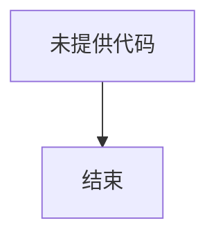

# `.\AutoGPT\classic\original_autogpt\tests\unit\__init__.py` 详细设计文档

未提供源代码，无法进行功能描述和详细分析。

## 整体流程



## 类结构

```

```

## 全局变量及字段


    

## 全局函数及方法


## 关键组件


由于未提供源代码，无法识别关键组件并生成详细设计文档。


## 问题及建议


### 已知问题

-   未提供代码，无法进行技术债务或优化分析。

### 优化建议

-   请提供具体的代码，以便进行详细的技术债务评估和优化建议。


## 其它


### 设计目标与约束

本文档旨在详细描述空代码库的详细设计，但由于未提供具体代码，设计目标与约束部分将基于通用软件工程实践提供示例内容。设计目标可能包括：实现高性能、高可用性、可扩展的系统；确保代码可维护、可测试；满足特定的业务需求。约束可能包括：技术栈限制（如必须使用Java 8、Spring Boot 2.x）、性能指标（如响应时间小于200ms）、兼容性要求（如支持IE11及以上浏览器）、法规合规（如GDPR数据保护）。这些目标和约束将指导后续的设计决策。

### 错误处理与异常设计

由于代码为空，我们假设系统需要统一的错误处理机制。异常设计可能包括：自定义业务异常类（如BusinessException），用于表示业务逻辑错误；系统异常类（如SystemException），用于表示基础设施错误；全局异常处理器（@ControllerAdvice），用于捕获未处理的异常并返回统一的错误响应（如JSON格式的错误码和错误信息）。错误码体系可能采用枚举定义（如ErrorCode枚举），包含错误码、错误描述和HTTP状态码。日志记录策略可能包括：记录异常堆栈信息、记录上下文数据（如用户ID、请求参数）、根据错误级别采取不同处理（如ERROR级别发送告警）。

### 数据流与状态机

对于数据流，典型的系统可能包括：前端请求 → API网关 → 业务服务 → 数据访问层 → 数据库。数据流描述应明确各环节的数据格式、传输协议和转换逻辑。对于状态机，如果系统涉及业务流程（如订单处理、审批流程），应定义状态集合（如订单状态：待支付、已支付、已发货、已完成）、事件集合（如支付事件、发货事件）、状态转换规则（状态机转移图）。可以使用mermaid状态图描述状态机流转。例如：stateDiagram-v2 [*] --> 待支付 --> 已支付 --> 已发货 --> 已完成。

### 外部依赖与接口契约

外部依赖可能包括：第三方API（如支付网关、地图服务）、中间件（如Redis缓存、消息队列Kafka）、数据库（如MySQL、PostgreSQL）。接口契约应定义清晰的API规范，可能包括：RESTful API接口文档（使用OpenAPI或Swagger）、接口请求响应格式（如JSON）、认证授权机制（如OAuth 2.0、JWT）、版本控制策略（如URL版本 /v1/、/v2/）、超时和重试策略（如请求超时30秒、重试3次）、限流和熔断机制（如Hystrix、Sentinel配置）。

### 性能要求与指标

性能要求可能包括：响应时间（如API平均响应时间小于200ms，P99小于500ms）、吞吐量（如支持1000 QPS）、并发用户数（如支持500并发用户）、资源利用率（如CPU使用率小于70%、内存使用率小于80%）。性能测试策略可能包括：负载测试、压力测试、稳定性测试（24小时运行无内存泄漏）。性能优化建议可能包括：数据库索引优化、缓存策略（如Redis缓存热点数据）、异步处理（如消息队列解耦耗时操作）、连接池管理（如数据库连接池、HTTP连接池）。

### 安全性考虑

安全性设计可能包括：身份认证（如JWT令牌、Session管理）、授权控制（如RBAC角色权限控制、细粒度权限注解）、数据加密（如传输层TLS加密、敏感数据AES加密）、输入验证（如参数校验框架Hibernate Validator）、SQL注入防护（如使用参数化查询mybatis #{}）、XSS防护（如输入过滤、输出编码）、CSRF防护（如Token验证）、审计日志（如记录关键操作日志、保留6个月）。安全合规可能要求：遵循OWASP Top 10、满足等保2.0要求。

### 可扩展性与可维护性

可扩展性设计可能包括：水平扩展（如无状态服务设计、支持容器化部署K8s）、垂直扩展（如模块化拆分、读写分离）、服务拆分（如微服务架构、领域驱动设计DDD）。可维护性设计可能包括：代码规范（如阿里Java开发手册）、模块化设计（如清晰的包结构、依赖管理）、文档维护（如API文档、架构决策记录ADR）、技术栈统一（如统一使用Spring Boot、统一日志框架）。

### 配置与部署

配置管理可能包括：环境配置（如dev、test、prod环境配置）、配置中心（如Apollo、Nacos配置管理）、敏感配置加密（如数据库密码、API密钥）。部署策略可能包括：容器化（如Docker镜像构建）、编排（如Kubernetes部署yaml）、CI/CD流程（如Jenkins流水线、代码质量门禁）、灰度发布（如金丝雀发布、流量切换）、回滚方案（如版本回退、数据库回滚脚本）。

### 监控与运维

监控体系可能包括：系统监控（如Prometheus+Grafana监控CPU、内存、磁盘、网络）、应用监控（如APM工具SkyWalking、Pinpoint监控链路和性能）、业务监控（如自定义业务指标仪表盘）。日志管理（如ELK日志收集和分析、分布式日志追踪ID）、告警策略（如邮件、钉钉、短信告警、告警阈值配置）、运维工具（如Admin管理后台、在线调试、缓存管理）。运维流程可能包括：故障响应流程、应急演练、容量规划。

### 测试策略

测试策略可能包括：单元测试（如JUnit 5、Mockito、覆盖率要求大于80%）、集成测试（如Spring Boot Test、数据库事务回滚）、端到端测试（如Selenium、Postman Newman）、性能测试（如JMeter、Locust）、安全测试（如OWASP ZAP扫描）。测试环境管理（如测试数据准备、环境隔离）、测试自动化（如CI流水线集成自动化测试）、测试报告（如测试结果可视化、缺陷管理）。

### 兼容性设计

兼容性设计可能包括：浏览器兼容性（如Chrome、Firefox、Safari、IE11）、操作系统兼容性（如Windows、Linux、Mac）、设备兼容性（如PC端、移动端响应式设计）、第三方库兼容性（如升级依赖时兼容性测试）、向后兼容性（如接口版本兼容、数据结构演进）。数据库兼容性（如MySQL 5.7及以上版本）、编程语言版本兼容性（如Java 8及以上）。

### 版本演进与迁移

版本演进策略可能包括：语义化版本号（如1.0.0主版本号变更表示不兼容API修改）、变更日志（如CHANGELOG维护）、废弃接口（如标记@Deprecated、预留过渡期）。数据迁移策略可能包括：数据迁移脚本（如Flyway、Liquibase数据库版本管理）、平滑迁移方案（如双写、灰度切换）、回滚方案（如数据回滚脚本、版本回退）。重大版本升级可能需要：架构升级文档、兼容性测试计划、用户迁移指南。

### 附录

附录可能包括：术语表（如业务术语和技术术语解释）、参考文档（如相关技术文档、架构设计文档链接）、架构决策记录（如关键设计决策的理由和后果）、联系方式（如架构师、开发团队联系方式）、版本历史（如文档版本号、修改日期、修改人）。示例内容仅供参考，实际内容需根据具体代码填充。

    